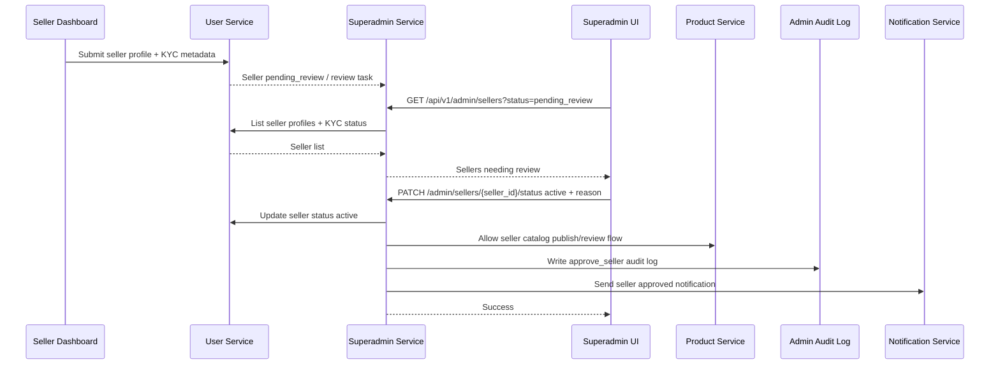
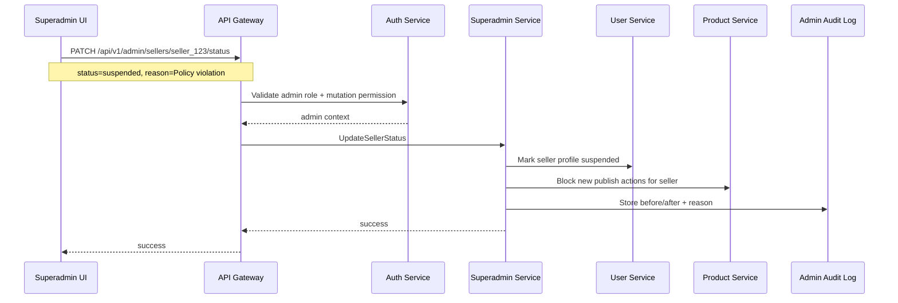
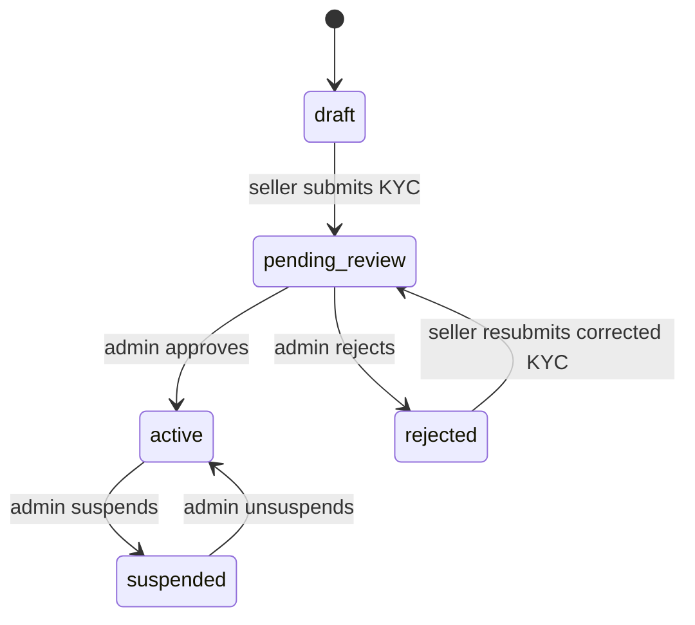
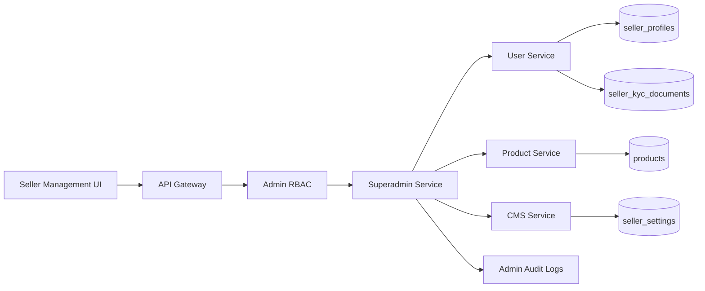

# 🏬 Superadmin Panel - Task 3: Seller Management


## 📌 Task Summary

| Field | Detail |
|---|---|
| Task Name | Seller management |
| Source | `docs/01-micro-tasks.md` → `Superadmin Panel` → Task 3 |
| Priority | `P1` |
| Dependency | User/CMS/Product |
| Main Goal | Seller KYC approval, suspension, aur catalog review UI banana |
| Output Type | Structured implementation guide |
| Not Included | Order operations, payment operations, session oversight, platform settings, full audit log viewer |

> **Simple Hinglish goal:** Is task ka purpose Superadmin Panel ke andar **Sellers module** banana hai jahan admin seller applications dekh sake, KYC documents review karke approve/reject kar sake, seller ko suspend/unsuspend kar sake, aur seller ke catalog/products ko moderation view me review kar sake.

---

## ✅ Final Output Created

```text
TaskImplementation/
└── Superadmin Panel/
    ├── task1.md
    ├── task2.md
    └── task3.md
```

### Why this structure?

- `TaskImplementation/` task-wise implementation guides ka central folder hai.
- `Superadmin Panel/` Superadmin Panel ke saare task guides ko group karta hai.
- `task3.md` sirf **Superadmin Panel - Task 3: Seller Management** ka guide hai.

> 🟢 **Note:** Is file me Task 3 ka complete step-by-step implementation guide diya gaya hai. Actual frontend/backend source code is task me add nahi kiya gaya, kyunki requested output sirf required folder structure aur `task3.md` content generate karna tha.

---

## 🧭 Implementation Approach

Is guide ko project ke existing documentation ke basis par design kiya gaya:

| Document | Kya use kiya gaya |
|---|---|
| `docs/01-micro-tasks.md` | Task 3 ka exact scope: Seller KYC approval, suspension, catalog review UI |
| `docs/02-system-architecture.md` | Superadmin Panel → API Gateway → Superadmin/User/CMS/Product services ka flow |
| `docs/03-folder-structure.md` | `frontend/superadmin-panel/src/features/sellers/` target structure |
| `docs/04-microservice-design.md` | User Service seller/KYC ownership, Product Service catalog data, Superadmin seller status APIs |
| `docs/05-database-design.md` | `seller_profiles`, `seller_kyc_documents`, `admin_review_tasks`, `admin_audit_logs` |
| `docs/06-auth-security.md` | Admin RBAC, short session TTL, audit requirement, mutation rate limits |
| `docs/09-cms-superadmin.md` | Sellers module capabilities, seller approval workflow, high-risk controls |
| `docs/10-frontend-implementation.md` | React Query, Zustand, protected routes, admin UI standards |
| `api/master-api.json` | REST endpoints: `GET /api/v1/admin/sellers`, `PATCH /api/v1/admin/sellers/{seller_id}/status` |

---

## 🧱 Task Boundary

### Included in Task 3

- Sellers route inside existing Superadmin shell
- Seller list page with search/filter/pagination
- Seller status badges and KYC state summary
- Seller review/detail page
- KYC document review panel
- Approve seller action with mandatory audit reason
- Reject seller action with mandatory rejection reason
- Suspend/unsuspend seller action with mandatory reason code
- Catalog review UI for seller products
- Product moderation view for draft/pending/published/rejected catalog items
- React Query hooks for seller list, seller status mutation, and catalog review data
- Role-based view/mutation permissions
- Loading, empty, error, and permission-denied states
- Tests/checklist for permissions, actions, and API calls
- Architecture and flow diagrams

### Not Included in Task 3

- User block/unblock UI from Task 2
- Order search/detail/dispute UI
- Payment refunds/reconciliation UI
- Session oversight/live suspicious activity UI
- Platform settings UI
- Full audit log viewer/export page
- Backend database migration implementation
- Product creation/editing form for sellers
- Seller dashboard/CMS screens
- Payment settlement, coupon, campaign, or analytics modules

> 🔴 **Rule:** Task 3 sirf **Seller Management** cover karega. Seller detail page par orders/payments/campaigns links dikh sakte hain, but actual screens next tasks me implement honge.

---

## 🗂️ Clean Target Folder Structure

Task 1 ne Superadmin shell diya. Task 2 ne users module add kiya. Task 3 usi shell ke andar `sellers` feature add karega.

```text
frontend/
└── superadmin-panel/
    ├── src/
    │   ├── app/
    │   │   └── router.tsx
    │   ├── components/
    │   │   └── ui/
    │   │       ├── action-reason-dialog.tsx
    │   │       ├── data-state.tsx
    │   │       ├── document-preview.tsx
    │   │       ├── status-badge.tsx
    │   │       └── table-pagination.tsx
    │   ├── features/
    │   │   └── sellers/
    │   │       ├── api/
    │   │       │   └── sellers-api.ts
    │   │       ├── components/
    │   │       │   ├── catalog-review-table.tsx
    │   │       │   ├── kyc-document-list.tsx
    │   │       │   ├── seller-action-bar.tsx
    │   │       │   ├── seller-filter-bar.tsx
    │   │       │   ├── seller-profile-summary.tsx
    │   │       │   ├── seller-review-checklist.tsx
    │   │       │   └── seller-table.tsx
    │   │       ├── hooks/
    │   │       │   ├── use-admin-seller.ts
    │   │       │   ├── use-admin-sellers.ts
    │   │       │   ├── use-seller-catalog.ts
    │   │       │   └── use-update-seller-status.ts
    │   │       ├── pages/
    │   │       │   ├── seller-list-page.tsx
    │   │       │   └── seller-review-page.tsx
    │   │       ├── permissions.ts
    │   │       └── types.ts
    │   ├── lib/
    │   │   ├── admin-permissions.ts
    │   │   ├── format.ts
    │   │   └── http.ts
    │   └── routes/
    │       └── require-admin.tsx
    └── tests/
        └── sellers/
            ├── seller-permissions.test.ts
            ├── seller-status-action.test.tsx
            ├── seller-table.test.tsx
            └── sellers-api.test.ts
```

### Folder Responsibility

| Path | Responsibility |
|---|---|
| `features/sellers/api/` | Admin seller REST calls |
| `features/sellers/hooks/` | React Query hooks for seller list/detail/catalog/status |
| `features/sellers/components/` | Seller table, filter bar, KYC list, catalog table, action bar |
| `features/sellers/pages/` | Route-level list and review pages |
| `features/sellers/permissions.ts` | Seller-specific role/action permissions |
| `features/sellers/types.ts` | Seller, KYC, catalog TypeScript types |
| `components/ui/action-reason-dialog.tsx` | Shared reason modal for approve/reject/suspend actions |
| `components/ui/document-preview.tsx` | KYC document preview shell |
| `tests/sellers/` | Seller module tests |

---

## 🔌 External Libraries and Tools

Task 3 me Task 1/Task 2 ke existing frontend stack ko reuse karna hai. New heavy dependency add karne ki zarurat nahi hai.

| Tool/Library | What it is | Why used | Install/Use |
|---|---|---|---|
| React | UI library | Seller list, review page, KYC panels banane ke liye | Vite React app me included |
| TypeScript | Static typing | Seller/KYC/product status strongly type karne ke liye | Vite React TS app me included |
| React Router DOM | Client routing | `/admin/sellers` and `/admin/sellers/:sellerId` routes ke liye | `pnpm add react-router-dom` |
| TanStack React Query | Server state library | Seller list/detail/catalog API cache, refetch, mutation handle karne ke liye | `pnpm add @tanstack/react-query` |
| Zustand | Lightweight state store | Admin auth/session state Task 1 se reuse karne ke liye | `pnpm add zustand` |
| lucide-react | Icon library | Search, filter, shield, store, file, suspend icons ke liye | `pnpm add lucide-react` |
| clsx | Conditional class helper | Status badge and row state classes clean rakhne ke liye | `pnpm add clsx` |
| Vitest | Test runner | Permission and API helper tests ke liye | `pnpm add -D vitest` |
| Testing Library | React component testing | Dialog/table interactions test karne ke liye | `pnpm add -D @testing-library/react @testing-library/user-event @testing-library/jest-dom` |
| MSW | API mocking | Seller/KYC/catalog API mocks ke liye | `pnpm add -D msw` |

### Install Commands

```bash
# from frontend/superadmin-panel
pnpm add react-router-dom @tanstack/react-query zustand lucide-react clsx
pnpm add -D vitest @testing-library/react @testing-library/user-event @testing-library/jest-dom msw
```

### Basic Usage Commands

```bash
# install dependencies
pnpm install

# run development server
pnpm dev

# run tests
pnpm vitest run

# type-check
pnpm typecheck
```

> 🟡 **Note:** Agar ye packages Task 1/Task 2 me already installed hain, to dobara install karne ki zarurat nahi hai.

---

## 🧩 Architecture Diagram

```mermaid
flowchart TB
    Admin[Admin Browser] --> Shell[Superadmin Shell]
    Shell --> SellersRoute[/admin/sellers]
    Shell --> SellerReviewRoute[/admin/sellers/:sellerId]

    SellersRoute --> SellerListPage[Seller List Page]
    SellerReviewRoute --> SellerReviewPage[Seller Review Page]

    SellerListPage --> SellerHooks[Seller React Query Hooks]
    SellerReviewPage --> SellerHooks
    SellerReviewPage --> CatalogHooks[Seller Catalog Hooks]

    SellerHooks --> HTTP[Admin HTTP Client]
    CatalogHooks --> HTTP

    HTTP --> Gateway[API Gateway]
    Gateway --> Auth[Auth/RBAC Check]
    Gateway --> Superadmin[Superadmin Service]

    Superadmin --> UserService[User Service: Seller Profile + KYC]
    Superadmin --> ProductService[Product Service: Catalog Review]
    Superadmin --> CMS[CMS Service: Seller Settings/Workflow Context]
    Superadmin --> Audit[(Admin Audit Logs)]
```

**Hinglish explanation:**  
Admin Superadmin shell open karta hai. Sellers route React Query hooks ke through API Gateway ko call karta hai. Gateway admin JWT/RBAC validate karta hai. Superadmin Service seller profile and KYC ke liye User Service se baat karta hai, catalog review ke liye Product Service se data leta hai, aur har risky action ke saath audit log write karta hai.

---

## 🔄 Seller Approval Workflow



---

## ⛔ Seller Suspension Workflow



---

## 🔐 Role and Permission Rules

Seller management me KYC documents and business actions sensitive hain. Frontend permissions UX ke liye hain; real authorization Gateway and Superadmin Service me enforce hogi.

| Role | View Sellers | View KYC | Approve/Reject KYC | Suspend Seller | Catalog Review |
|---|---:|---:|---:|---:|---:|
| `superadmin` | ✅ | ✅ | ✅ | ✅ | ✅ |
| `operations_admin` | ✅ | ✅ | ✅ | ✅ | ✅ |
| `catalog_admin` | ✅ | ❌ | ❌ | ❌ | ✅ |
| `finance_admin` | ❌ | ❌ | ❌ | ❌ | ❌ |
| `readonly_admin` | ✅ | Masked only | ❌ | ❌ | Read-only |

### Permission Rules

- `superadmin` complete seller management kar sakta hai.
- `operations_admin` seller lifecycle actions kar sakta hai: approve, reject, suspend, unsuspend.
- `catalog_admin` seller products/catalog review kar sakta hai, but KYC documents approve nahi karega.
- `readonly_admin` seller list and high-level profile dekh sakta hai, but PII/KYC document details masked rahenge.
- `finance_admin` ko seller management module default visible nahi hona chahiye.

### Permission Helper Example

```ts
export type AdminRole =
  | "superadmin"
  | "operations_admin"
  | "finance_admin"
  | "catalog_admin"
  | "readonly_admin";

export function canViewSellers(roles: AdminRole[]) {
  return roles.some((role) =>
    ["superadmin", "operations_admin", "catalog_admin", "readonly_admin"].includes(role),
  );
}

export function canReviewSellerKyc(roles: AdminRole[]) {
  return roles.some((role) => ["superadmin", "operations_admin"].includes(role));
}

export function canSuspendSeller(roles: AdminRole[]) {
  return roles.some((role) => ["superadmin", "operations_admin"].includes(role));
}

export function canReviewSellerCatalog(roles: AdminRole[]) {
  return roles.some((role) =>
    ["superadmin", "operations_admin", "catalog_admin"].includes(role),
  );
}
```

---

## 🧾 Seller Status Model

Project database me `seller_profiles.status` values:

| Status | Meaning | UI Treatment |
|---|---|---|
| `draft` | Seller profile incomplete hai | Gray badge, no action except view |
| `pending_review` | Seller KYC/admin review pending hai | Amber badge, primary review queue |
| `active` | Seller approved and allowed hai | Green badge |
| `suspended` | Seller temporarily blocked hai | Red badge, unsuspend action possible |
| `rejected` | Seller application reject hui | Slate/red badge, reason visible |

### Status Transition Rules



### Allowed Frontend Actions

| Current Status | Allowed Action | Target Status | Reason Required |
|---|---|---|---:|
| `pending_review` | Approve | `active` | ✅ |
| `pending_review` | Reject | `rejected` | ✅ |
| `active` | Suspend | `suspended` | ✅ |
| `suspended` | Unsuspend | `active` | ✅ |
| `draft` | No mutation | - | - |
| `rejected` | No direct approve until resubmission | - | - |

> 🔴 **Important:** Status transition validation backend me bhi honi chahiye. Frontend disabled buttons sirf UX safety hain.

---

## 📡 API Contract

`api/master-api.json` ke according Task 3 ke primary endpoints:

| API | Method | Service | gRPC | Purpose |
|---|---|---|---|---|
| `/api/v1/admin/sellers` | `GET` | `superadmin-service` | `SuperadminService.ListSellersForAdmin` | Seller list/search/filter |
| `/api/v1/admin/sellers/{seller_id}/status` | `PATCH` | `superadmin-service` | `SuperadminService.UpdateSellerStatus` | Approve/reject/suspend/unsuspend |

### List Sellers Request

```ts
export type AdminSellerListRequest = {
  q?: string;
  status?: SellerStatus;
  page?: number;
  page_size?: number;
};
```

### Seller Profile Response

`api/master-api.json` me base schema lightweight hai:

```ts
export type SellerProfile = {
  seller_id: string;
  user_id: string;
  store_name: string;
  status: SellerStatus;
  gst_number?: string;
};
```

Task 3 UI ke liye richer display type useful rahega. Backend response me ye fields add/projection ke through aa sakte hain:

```ts
export type AdminSeller = SellerProfile & {
  display_name?: string;
  support_email?: string;
  kyc_status?: "not_started" | "pending" | "approved" | "rejected";
  document_count?: number;
  pending_document_count?: number;
  product_count?: number;
  pending_catalog_count?: number;
  approved_by?: string;
  approved_at?: string;
  created_at?: string;
  updated_at?: string;
};
```

### Status Update Request

```ts
export type StatusUpdateRequest = {
  status: SellerStatus;
  reason: string;
};
```

Example approve request:

```json
{
  "status": "active",
  "reason": "GST and business documents verified. Store policy accepted."
}
```

Example suspend request:

```json
{
  "status": "suspended",
  "reason": "Repeated counterfeit product reports. Seller disabled pending investigation."
}
```

---

## 🧑‍💼 Step-by-Step Implementation

## Step 1: Seller module route add karo

Task 1 ke `router.tsx` me sellers routes add karo.

```tsx
{
  path: "/admin/sellers",
  element: (
    <RequireAdmin allowedRoles={["superadmin", "operations_admin", "catalog_admin", "readonly_admin"]}>
      <SellerListPage />
    </RequireAdmin>
  ),
},
{
  path: "/admin/sellers/:sellerId",
  element: (
    <RequireAdmin allowedRoles={["superadmin", "operations_admin", "catalog_admin", "readonly_admin"]}>
      <SellerReviewPage />
    </RequireAdmin>
  ),
}
```

**Explanation:**  
`/admin/sellers` seller queue/list ke liye hai. `/admin/sellers/:sellerId` detail review page ke liye hai. Route level pe finance admin ko allow nahi kiya gaya, kyunki Task 3 seller lifecycle se related hai, payments se nahi.

---

## Step 2: Sidebar menu me Sellers item configure karo

Task 1 ke menu config me Sellers already placeholder ho sakta hai. Is task me route active karna hai.

```ts
{
  id: "sellers",
  label: "Sellers",
  href: "/admin/sellers",
  icon: Store,
  roles: ["superadmin", "operations_admin", "catalog_admin", "readonly_admin"],
}
```

**Explanation:**  
Menu visibility admin roles ke basis par controlled rahegi. `catalog_admin` ko Sellers menu visible hoga kyunki catalog moderation Task 3 ka part hai.

---

## Step 3: Seller TypeScript types banao

`features/sellers/types.ts`:

```ts
export type SellerStatus =
  | "draft"
  | "pending_review"
  | "active"
  | "suspended"
  | "rejected";

export type KycDocumentStatus = "pending" | "approved" | "rejected";

export type KycDocument = {
  document_id: string;
  seller_id: string;
  document_type: string;
  storage_url: string;
  status: KycDocumentStatus;
  reviewed_by?: string;
  reviewed_at?: string;
  rejection_reason?: string;
  created_at: string;
};

export type AdminSeller = {
  seller_id: string;
  user_id: string;
  store_name: string;
  display_name?: string;
  gst_number?: string;
  support_email?: string;
  status: SellerStatus;
  kyc_status?: "not_started" | "pending" | "approved" | "rejected";
  document_count?: number;
  pending_document_count?: number;
  product_count?: number;
  pending_catalog_count?: number;
  approved_by?: string;
  approved_at?: string;
  created_at?: string;
  updated_at?: string;
};

export type SellerCatalogItem = {
  product_id: string;
  seller_id: string;
  title: string;
  brand?: string;
  category_id?: string;
  status: "draft" | "pending_review" | "published" | "rejected" | "unpublished";
  image_url?: string;
  updated_at?: string;
};
```

**Explanation:**  
Types se UI predictable banega. Backend schema simple ho sakta hai, but frontend display fields ko optional rakha gaya hai taaki API gradually richer ban sake.

---

## Step 4: Sellers API client banao

`features/sellers/api/sellers-api.ts`:

```ts
import { http } from "@/lib/http";
import type { AdminSeller, SellerCatalogItem, SellerStatus } from "../types";

export type SellerListParams = {
  q?: string;
  status?: SellerStatus | "all";
  page?: number;
  page_size?: number;
};

export type SellerListResponse = {
  sellers: AdminSeller[];
  page?: number;
  page_size?: number;
  total?: number;
};

export async function listAdminSellers(params: SellerListParams) {
  const searchParams = new URLSearchParams();

  if (params.q) searchParams.set("q", params.q);
  if (params.status && params.status !== "all") searchParams.set("status", params.status);
  if (params.page) searchParams.set("page", String(params.page));
  if (params.page_size) searchParams.set("page_size", String(params.page_size));

  return http.get<SellerListResponse>(`/api/v1/admin/sellers?${searchParams}`);
}

export async function updateSellerStatus(input: {
  sellerId: string;
  status: SellerStatus;
  reason: string;
}) {
  return http.patch<{ success: boolean }>(
    `/api/v1/admin/sellers/${input.sellerId}/status`,
    {
      status: input.status,
      reason: input.reason,
    },
  );
}

export async function listSellerCatalog(sellerId: string) {
  return http.get<{ products: SellerCatalogItem[] }>(
    `/api/v1/admin/sellers/${sellerId}/catalog`,
  );
}
```

**Explanation:**  
First two endpoints project contract me available hain. `listSellerCatalog` Task 3 catalog review UI ke liye recommended admin projection endpoint hai. Agar backend me abhi available nahi hai, to temporary implementation Product Service ke existing product list endpoint ko `seller_id` filter ke saath call kar sakti hai.

> 🟡 **Contract note:** `GET /api/v1/admin/sellers/{sellerId}/catalog` `api/master-api.json` me currently listed nahi hai. Task 3 UI ko catalog review ke liye Product data chahiye, isliye backend/gateway me ya to ye admin endpoint add hoga, ya existing `GET /api/v1/products?seller_id=...` ka admin-safe version use hoga.

---

## Step 5: React Query hooks banao

`features/sellers/hooks/use-admin-sellers.ts`:

```ts
import { useQuery } from "@tanstack/react-query";
import { listAdminSellers, type SellerListParams } from "../api/sellers-api";

export function useAdminSellers(params: SellerListParams) {
  return useQuery({
    queryKey: ["admin-sellers", params],
    queryFn: () => listAdminSellers(params),
    staleTime: 30_000,
  });
}
```

`features/sellers/hooks/use-update-seller-status.ts`:

```ts
import { useMutation, useQueryClient } from "@tanstack/react-query";
import { updateSellerStatus } from "../api/sellers-api";

export function useUpdateSellerStatus() {
  const queryClient = useQueryClient();

  return useMutation({
    mutationFn: updateSellerStatus,
    onSuccess: (_, input) => {
      queryClient.invalidateQueries({ queryKey: ["admin-sellers"] });
      queryClient.invalidateQueries({ queryKey: ["admin-seller", input.sellerId] });
      queryClient.invalidateQueries({ queryKey: ["seller-catalog", input.sellerId] });
    },
  });
}
```

`features/sellers/hooks/use-seller-catalog.ts`:

```ts
import { useQuery } from "@tanstack/react-query";
import { listSellerCatalog } from "../api/sellers-api";

export function useSellerCatalog(sellerId: string) {
  return useQuery({
    queryKey: ["seller-catalog", sellerId],
    queryFn: () => listSellerCatalog(sellerId),
    enabled: Boolean(sellerId),
  });
}
```

**Explanation:**  
React Query server state ko cache karta hai. Status update ke baad list/detail/catalog refetch hota hai, isliye UI stale nahi dikhega.

---

## Step 6: Seller filter bar banao

`seller-filter-bar.tsx` ka purpose search, status filter, and queue tabs handle karna hai.

```tsx
const statusOptions = [
  { label: "All", value: "all" },
  { label: "Pending Review", value: "pending_review" },
  { label: "Active", value: "active" },
  { label: "Suspended", value: "suspended" },
  { label: "Rejected", value: "rejected" },
];
```

UI behavior:

- Search input debounce ke saath API call kare.
- Status filter segmented control ya select me ho.
- Default queue `pending_review` rakhna useful hai, kyunki KYC approvals high-priority operational workflow hain.
- Mobile screen pe filters wrap ho jayein; table ke upar overlap nahi hona chahiye.

**Explanation:**  
Admin ko seller queue fast scan karni hoti hai. Filters simple rakho: search, status, page size. Advanced filters Task 8 audit/search modules me ja sakte hain.

---

## Step 7: Seller table banao

`seller-table.tsx`:

```tsx
type SellerTableProps = {
  sellers: AdminSeller[];
  canReviewKyc: boolean;
};

export function SellerTable({ sellers, canReviewKyc }: SellerTableProps) {
  return (
    <table className="w-full text-sm">
      <thead>
        <tr>
          <th>Store</th>
          <th>Status</th>
          <th>KYC</th>
          <th>Catalog</th>
          <th>Updated</th>
          <th />
        </tr>
      </thead>
      <tbody>
        {sellers.map((seller) => (
          <tr key={seller.seller_id}>
            <td>
              <div className="font-medium">{seller.store_name}</div>
              <div className="text-xs text-slate-500">{seller.seller_id}</div>
            </td>
            <td>
              <StatusBadge value={seller.status} />
            </td>
            <td>
              {canReviewKyc ? (
                <span>{seller.pending_document_count ?? 0} pending</span>
              ) : (
                <span>Masked</span>
              )}
            </td>
            <td>{seller.pending_catalog_count ?? 0} pending</td>
            <td>{formatDate(seller.updated_at)}</td>
            <td>
              <Link to={`/admin/sellers/${seller.seller_id}`}>Review</Link>
            </td>
          </tr>
        ))}
      </tbody>
    </table>
  );
}
```

**Explanation:**  
Table seller queue ka main scanning surface hai. Store name, status, KYC count, catalog pending count, and review CTA visible rakho. KYC count `readonly_admin` ke liye masked ho sakta hai.

---

## Step 8: Seller list page banao

`seller-list-page.tsx`:

```tsx
export function SellerListPage() {
  const roles = useAdminRoles();
  const [filters, setFilters] = useState({
    q: "",
    status: "pending_review" as const,
    page: 1,
    page_size: 20,
  });

  const canView = canViewSellers(roles);
  const canReviewKyc = canReviewSellerKyc(roles);
  const sellersQuery = useAdminSellers(filters);

  if (!canView) return <PermissionDenied />;

  return (
    <section className="space-y-4">
      <header>
        <h1 className="text-xl font-semibold">Sellers</h1>
        <p className="text-sm text-slate-500">KYC, suspension, and catalog review queue.</p>
      </header>

      <SellerFilterBar filters={filters} onChange={setFilters} />

      <DataState query={sellersQuery}>
        {(data) => (
          <>
            <SellerTable sellers={data.sellers} canReviewKyc={canReviewKyc} />
            <TablePagination
              page={filters.page}
              pageSize={filters.page_size}
              total={data.total}
              onPageChange={(page) => setFilters((current) => ({ ...current, page }))}
            />
          </>
        )}
      </DataState>
    </section>
  );
}
```

**Explanation:**  
Page-level component query, filters, permission, and pagination coordinate karta hai. Table component pure display rakha gaya hai.

---

## Step 9: Seller review page banao

`seller-review-page.tsx` layout:

```tsx
export function SellerReviewPage() {
  const { sellerId = "" } = useParams();
  const roles = useAdminRoles();
  const sellersQuery = useAdminSellers({ q: sellerId, page: 1, page_size: 1 });
  const catalogQuery = useSellerCatalog(sellerId);

  const seller = sellersQuery.data?.sellers[0];

  if (!canViewSellers(roles)) return <PermissionDenied />;

  return (
    <section className="grid gap-4 xl:grid-cols-[minmax(0,1fr)_360px]">
      <main className="space-y-4">
        {seller && <SellerProfileSummary seller={seller} />}
        {canReviewSellerKyc(roles) && seller && <KycDocumentList sellerId={seller.seller_id} />}
        {canReviewSellerCatalog(roles) && (
          <CatalogReviewTable query={catalogQuery} />
        )}
      </main>

      {seller && (
        <aside>
          <SellerActionBar seller={seller} roles={roles} />
          <SellerReviewChecklist seller={seller} />
        </aside>
      )}
    </section>
  );
}
```

**Explanation:**  
Review page me left side detail/review data hai, right side action bar and checklist hai. Operational UI me actions easy to find hone chahiye, but destructive actions reason dialog ke through hi trigger hon.

---

## Step 10: KYC document list banao

KYC documents `seller_kyc_documents` table ke metadata se aate hain. Actual file object storage/CDN me hoga.

```tsx
type KycDocumentListProps = {
  sellerId: string;
};

export function KycDocumentList({ sellerId }: KycDocumentListProps) {
  const documentsQuery = useSellerKycDocuments(sellerId);

  return (
    <section className="space-y-3">
      <h2 className="text-base font-semibold">KYC Documents</h2>
      <DataState query={documentsQuery}>
        {(data) => (
          <div className="grid gap-3">
            {data.documents.map((document) => (
              <DocumentPreview
                key={document.document_id}
                title={document.document_type}
                status={document.status}
                url={document.storage_url}
              />
            ))}
          </div>
        )}
      </DataState>
    </section>
  );
}
```

**Explanation:**  
KYC panel me document type, status, created date, reviewed by, rejection reason show karo. Sensitive document URLs ko direct public expose mat karo; backend signed URL ya proxied secure URL de.

> 🟡 **Contract note:** KYC document list endpoint current `api/master-api.json` me explicitly listed nahi hai. Recommended admin endpoint: `GET /api/v1/admin/sellers/{seller_id}/kyc-documents`, internally User Service se metadata/signed URLs fetch kare.

---

## Step 11: Action reason dialog banao

Approve/reject/suspend actions bina reason ke allow nahi karne.

```tsx
type ActionReasonDialogProps = {
  open: boolean;
  title: string;
  confirmLabel: string;
  minLength?: number;
  onCancel: () => void;
  onConfirm: (reason: string) => void;
};

export function ActionReasonDialog({
  open,
  title,
  confirmLabel,
  minLength = 10,
  onCancel,
  onConfirm,
}: ActionReasonDialogProps) {
  const [reason, setReason] = useState("");
  const canSubmit = reason.trim().length >= minLength;

  if (!open) return null;

  return (
    <Dialog title={title} onClose={onCancel}>
      <textarea
        value={reason}
        onChange={(event) => setReason(event.target.value)}
        placeholder="Audit reason enter karo"
        rows={4}
      />
      <button disabled={!canSubmit} onClick={() => onConfirm(reason.trim())}>
        {confirmLabel}
      </button>
    </Dialog>
  );
}
```

**Explanation:**  
Audit reason mandatory hai kyunki seller approval/suspension high-risk control hai. Minimum length accidental one-word reasons avoid karta hai.

---

## Step 12: Seller action bar banao

`seller-action-bar.tsx`:

```tsx
export function SellerActionBar({ seller, roles }: { seller: AdminSeller; roles: AdminRole[] }) {
  const mutation = useUpdateSellerStatus();

  const submitStatus = (status: SellerStatus, reason: string) => {
    mutation.mutate({
      sellerId: seller.seller_id,
      status,
      reason,
    });
  };

  return (
    <div className="space-y-2">
      {seller.status === "pending_review" && canReviewSellerKyc(roles) && (
        <>
          <ReasonedAction
            label="Approve"
            tone="success"
            onConfirm={(reason) => submitStatus("active", reason)}
          />
          <ReasonedAction
            label="Reject"
            tone="danger"
            onConfirm={(reason) => submitStatus("rejected", reason)}
          />
        </>
      )}

      {seller.status === "active" && canSuspendSeller(roles) && (
        <ReasonedAction
          label="Suspend"
          tone="danger"
          onConfirm={(reason) => submitStatus("suspended", reason)}
        />
      )}

      {seller.status === "suspended" && canSuspendSeller(roles) && (
        <ReasonedAction
          label="Unsuspend"
          tone="success"
          onConfirm={(reason) => submitStatus("active", reason)}
        />
      )}
    </div>
  );
}
```

**Explanation:**  
Action buttons current status ke basis pe visible hote hain. Same `PATCH /status` endpoint approve/reject/suspend/unsuspend sab handle karta hai.

---

## Step 13: Catalog review table banao

Catalog review UI seller ke products ko moderation view me show karega.

```tsx
export function CatalogReviewTable({ query }: { query: UseQueryResult<{ products: SellerCatalogItem[] }> }) {
  return (
    <section className="space-y-3">
      <h2 className="text-base font-semibold">Catalog Review</h2>
      <DataState query={query}>
        {(data) => (
          <table className="w-full text-sm">
            <thead>
              <tr>
                <th>Product</th>
                <th>Brand</th>
                <th>Category</th>
                <th>Status</th>
                <th>Updated</th>
              </tr>
            </thead>
            <tbody>
              {data.products.map((product) => (
                <tr key={product.product_id}>
                  <td>{product.title}</td>
                  <td>{product.brand ?? "-"}</td>
                  <td>{product.category_id ?? "-"}</td>
                  <td><StatusBadge value={product.status} /></td>
                  <td>{formatDate(product.updated_at)}</td>
                </tr>
              ))}
            </tbody>
          </table>
        )}
      </DataState>
    </section>
  );
}
```

**Explanation:**  
Task 3 me "catalog review UI" banana hai, seller product edit form nahi. Admin ko products ka status, category, brand, and pending moderation signal dikhna chahiye. Product approve/reject mutation agar backend contract me later add ho, to wahi table row actions extend kar sakte hain.

---

## Step 14: Review checklist banao

Checklist admin ko consistent decision lene me help karegi.

```ts
const sellerReviewChecklist = [
  "Store name and support email valid hain",
  "GST/business document seller profile se match karta hai",
  "KYC documents readable and not expired hain",
  "Catalog me prohibited/counterfeit products nahi hain",
  "Seller policies marketplace rules follow karte hain",
];
```

UI:

- Checklist item checkbox local UI state me ho.
- Approve button tab tak disabled rakha ja sakta hai jab tak required checklist complete na ho.
- Reject/suspend ke liye reason mandatory rahe.

**Explanation:**  
Checklist backend state nahi bhi ho sakti. Ye admin UX support hai. Agar compliance future me checklist persistence maange, to `admin_review_tasks` table me checklist snapshot store kiya ja sakta hai.

---

## Step 15: Audit behavior define karo

Har seller mutation ke time Superadmin Service audit log write karega.

Audit fields:

```json
{
  "actor_admin_id": "admin_123",
  "action": "seller.status.update",
  "resource_type": "seller",
  "resource_id": "seller_456",
  "request_id": "req_abc",
  "ip_hash": "hashed-ip",
  "before_summary": { "status": "pending_review" },
  "after_summary": { "status": "active" },
  "reason": "GST and business documents verified.",
  "created_at": "2026-06-02T10:00:00Z"
}
```

**Explanation:**  
Frontend reason bhejta hai. Backend actor, request id, IP hash, before/after summary add karta hai. Audit log immutable hona chahiye.

---

## Step 16: Error/loading/empty states polish karo

Required states:

| State | UI Behavior |
|---|---|
| Loading | Table skeleton ya compact loader |
| Empty | "No sellers found" with current filters visible |
| Error | Retry button and request id if available |
| Permission denied | Clear "You do not have access" state |
| Mutation pending | Button disabled + spinner |
| Mutation failed | Dialog remains open, error message show |
| Mutation success | Dialog close, query refetch, toast/snackbar |

**Explanation:**  
Admin tools me reliability feel important hai. Error state silent nahi hona chahiye, especially status update actions me.

---

## Step 17: Responsive UI rules follow karo

Superadmin Panel operational tool hai, landing page nahi.

Design rules:

- Dense but readable layout use karo.
- Cards sirf repeated items/panels ke liye use karo; page sections ko unnecessary floating cards mat banao.
- Buttons me icons use karo where useful: approve, reject, suspend, document, catalog.
- Table columns mobile pe horizontal scroll ya stacked compact rows me convert ho.
- Text buttons me long labels wrap/fit hon, overflow nahi karein.
- KYC document preview secure and constrained height me ho.
- Destructive actions red tone me, approve green tone me, neutral review actions slate tone me.

---

## Step 18: Tests add karo

### Permission Tests

```ts
describe("seller permissions", () => {
  it("allows operations admin to approve seller KYC", () => {
    expect(canReviewSellerKyc(["operations_admin"])).toBe(true);
  });

  it("does not allow catalog admin to suspend sellers", () => {
    expect(canSuspendSeller(["catalog_admin"])).toBe(false);
  });

  it("allows catalog admin to review seller catalog", () => {
    expect(canReviewSellerCatalog(["catalog_admin"])).toBe(true);
  });
});
```

### Mutation Test Cases

| Test | Expected |
|---|---|
| Approve without reason | Confirm disabled |
| Approve pending seller | PATCH status `active` with reason |
| Reject pending seller | PATCH status `rejected` with reason |
| Suspend active seller | PATCH status `suspended` with reason |
| Unsuspend seller | PATCH status `active` with reason |
| Catalog admin opens seller detail | Catalog visible, KYC actions hidden |
| Readonly admin opens seller detail | No mutation buttons visible |

### API Mock Example

```ts
http.get("/api/v1/admin/sellers", () => {
  return HttpResponse.json({
    sellers: [
      {
        seller_id: "seller_456",
        user_id: "user_123",
        store_name: "Acme Store",
        status: "pending_review",
        gst_number: "27ABCDE1234F1Z5",
      },
    ],
    total: 1,
  });
});
```

---

## 🧪 Manual QA Checklist

| Scenario | Expected Result |
|---|---|
| `/admin/sellers` opens for `superadmin` | Seller list visible |
| `/admin/sellers` opens for `operations_admin` | Seller list and KYC actions visible |
| `/admin/sellers` opens for `catalog_admin` | Seller list/catalog review visible, KYC actions hidden |
| `/admin/sellers` opens for `finance_admin` | Permission denied or menu hidden |
| Search by store name | List filters correctly |
| Filter `pending_review` | Only pending sellers visible |
| Approve seller with reason | Status becomes `active`, queries refetch |
| Reject seller with reason | Status becomes `rejected`, reason submitted |
| Suspend active seller | Status becomes `suspended` |
| Unsuspend suspended seller | Status becomes `active` |
| Reason under min length | Confirm disabled |
| API error on mutation | Dialog stays open and error visible |
| KYC document for readonly admin | Sensitive document preview hidden/masked |
| Mobile viewport | Filters/table/actions do not overlap |

---

## 🔗 Service Ownership

Task 3 touches multiple domains, but each service still owns its own data.

| Data/Action | Owner Service | Notes |
|---|---|---|
| Seller profile | User Service | `seller_profiles` table |
| KYC document metadata | User Service | `seller_kyc_documents` table |
| Seller status mutation | Superadmin Service orchestrates, User Service stores |
| Product/catalog list | Product Service | `products` collection filtered by `seller_id` |
| Seller workflow context | CMS Service | Seller settings/staff/workflow context |
| Audit logs | Superadmin Service | `admin_audit_logs` table |
| Review tasks | Superadmin Service | `admin_review_tasks` table |

> 🟢 **Golden rule:** Frontend API Gateway ko call karega. Superadmin Service downstream services ko gRPC ke through call karega. Kisi service ka DB directly dusri service read/write nahi karegi.

---

## 🧠 Data Flow Summary



**Hinglish explanation:**  
UI sirf API Gateway ke REST endpoints use karega. Gateway RBAC check karega. Superadmin Service workflow coordinate karega. User Service seller profile/KYC maintain karega. Product Service catalog data dega. CMS Service seller workflow context de sakta hai. Audit logs Superadmin DB me immutable store honge.

---

## 🚦 Status Badge Color Guide

| Status | Badge Color | Meaning |
|---|---|---|
| `draft` | Gray | Incomplete |
| `pending_review` | Amber | Admin action needed |
| `active` | Green | Approved |
| `suspended` | Red | Restricted |
| `rejected` | Rose/Slate | Application rejected |
| `published` | Green | Product live |
| `unpublished` | Gray | Product not live |

Example:

```tsx
const sellerStatusTone: Record<SellerStatus, "neutral" | "warning" | "success" | "danger"> = {
  draft: "neutral",
  pending_review: "warning",
  active: "success",
  suspended: "danger",
  rejected: "danger",
};
```

---

## 🧯 Security Notes

- KYC documents PII/business-sensitive hain. Direct public URL expose mat karo.
- Admin mutation ke liye reason mandatory rakho.
- Admin session short TTL and MFA recommended hai.
- Frontend role checks UX ke liye hain; backend authorization compulsory hai.
- `readonly_admin` ko KYC details masked milni chahiye.
- Suspension reason clear and auditable hona chahiye.
- Mutation response me unnecessary KYC URL/data return mat karo.
- Admin mutation rate limit: docs ke according admin mutations limited hone chahiye.

---

## 📦 Suggested API Enhancements for Full Task 3

Current master API Task 3 ke main seller list/status endpoints define karta hai. Complete KYC/catalog review ke liye ye admin-safe endpoints useful rahenge:

| Recommended Endpoint | Purpose |
|---|---|
| `GET /api/v1/admin/sellers/{seller_id}` | Seller detail with KYC summary |
| `GET /api/v1/admin/sellers/{seller_id}/kyc-documents` | KYC document metadata/signed URLs |
| `PATCH /api/v1/admin/sellers/{seller_id}/kyc-documents/{document_id}` | Individual document approve/reject |
| `GET /api/v1/admin/sellers/{seller_id}/catalog` | Seller catalog review list |
| `PATCH /api/v1/admin/products/{product_id}/moderation` | Product approve/reject moderation |

> 🟡 **Scope handling:** Agar backend abhi sirf `GET /admin/sellers` and `PATCH /admin/sellers/{seller_id}/status` expose karta hai, to frontend Task 3 ka MVP seller list + status actions implement kare. KYC/catalog sections ko read-only placeholders ya available projection data ke saath render kare.

---

## ✅ Completion Checklist

- [x] Task 3 scope clearly documented
- [x] Existing docs and API contract referenced
- [x] Target folder structure defined
- [x] Seller list route documented
- [x] Seller review route documented
- [x] KYC approval/rejection flow documented
- [x] Seller suspension/unsuspension flow documented
- [x] Catalog review UI documented
- [x] External libraries/tools explained
- [x] Code examples added
- [x] Mermaid architecture/flow diagrams added
- [x] Security and audit requirements documented
- [x] Testing and QA checklist added
- [x] No implementation beyond Superadmin Panel Task 3 added

---

## 🏁 Final Notes

Task 3 ka outcome ek focused seller-operations blueprint hai:

- Admin seller queue
- KYC review
- Seller status lifecycle
- Suspension controls
- Catalog moderation view
- Audit-safe mutation flow

> 🟢 **Scope close:** Is guide me sirf **Superadmin Panel - Task 3: Seller Management** cover hua hai. Koi bhi additional Superadmin Panel task implement nahi kiya gaya.
