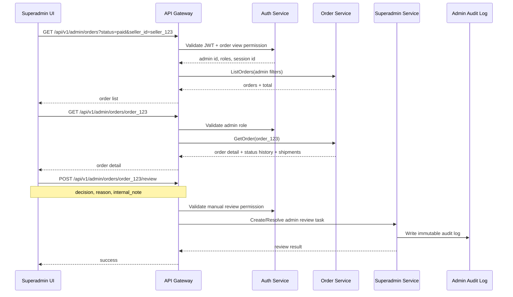
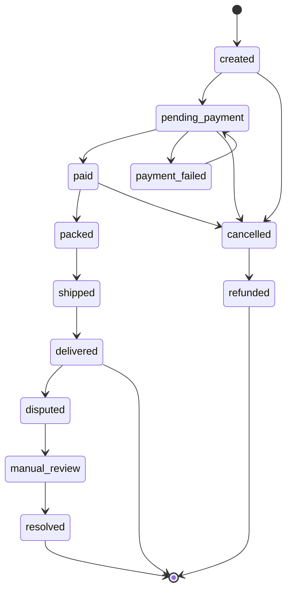

# 📦 Superadmin Panel - Task 4: Order Operations


## 📌 Task Summary

| Field | Detail |
|---|---|
| Task Name | Order operations |
| Source | `docs/01-micro-tasks.md` → `Superadmin Panel` → Task 4 |
| Priority | `P1` |
| Dependency | Order APIs |
| Main Goal | Order search, order detail, dispute view, aur manual review UI banana |
| Output Type | Structured implementation guide |
| Not Included | Payment operations, refund approval, reconciliation alerts, session oversight, platform settings, full audit log viewer |

> **Simple Hinglish goal:** Is task ka purpose Superadmin Panel ke andar ek **Orders module** banana hai jahan authorized admin platform ke orders search/filter kar sake, order details aur status history dekh sake, disputes inspect kar sake, aur suspicious/problematic orders ko manual review ke through handle kar sake.

---

## ✅ Final Output Created

```text
TaskImplementation/
└── Superadmin Panel/
    ├── task1.md
    ├── task2.md
    ├── task3.md
    └── task4.md
```

### Why this structure?

- `TaskImplementation/` task-wise implementation guides ka central folder hai.
- `Superadmin Panel/` Superadmin Panel ke saare task guides ko group karta hai.
- `task4.md` sirf **Superadmin Panel - Task 4: Order Operations** ka guide hai.

> 🟢 **Note:** Is file me Task 4 ka complete step-by-step implementation guide diya gaya hai. Actual frontend/backend source code is task me add nahi kiya gaya, kyunki requested output sirf required folder structure aur `task4.md` content generate karna tha.

---

## 🧭 Implementation Approach

Is guide ko project ke existing documentation ke basis par design kiya gaya:

| Document | Kya use kiya gaya |
|---|---|
| `docs/01-micro-tasks.md` | Task 4 ka exact scope: order search, detail, dispute, manual review UI |
| `docs/02-system-architecture.md` | API Gateway, auth validation, service communication, data ownership |
| `docs/03-folder-structure.md` | `frontend/superadmin-panel/src/features/orders/` target structure |
| `docs/04-microservice-design.md` | Order Service responsibility, gRPC methods, admin order APIs |
| `docs/05-database-design.md` | `orders`, `order_items`, `order_status_history`, `shipments`, indexes |
| `docs/06-auth-security.md` | Admin RBAC, audit requirement, admin mutation rate limits |
| `docs/09-cms-superadmin.md` | Superadmin Orders module capability: cross-platform order search and dispute support |
| `docs/10-frontend-implementation.md` | React Query, protected routes, role-based menu, admin UI standards |
| `api/master-api.json` | Existing API contract: `GET /api/v1/admin/orders` and `OrderListResponse` |

---

## 🧱 Task Boundary

### Included in Task 4

- Orders route inside existing Superadmin shell
- Cross-platform order search/filter page
- Order list table with pagination
- Order detail page/drawer
- Order status timeline from status history
- Buyer, seller, item, shipment, and payment-summary read-only sections
- Dispute panel for buyer/seller/support issues
- Manual review drawer/dialog
- Review reason and internal admin note capture
- React Query hooks for order list/detail/review data
- Role-based view/action permissions
- Loading, empty, error, and permission-denied states
- Code examples and Mermaid diagrams
- Testing checklist for order filters, permissions, and manual review

### Not Included in Task 4

- Payment status operations page
- Refund approval/rejection flow
- Reconciliation mismatch alerts
- Payment provider webhook handling
- Seller dashboard order manager
- Buyer order history page
- Shipment carrier integration
- Full audit log viewer/export page
- Backend database migration implementation
- Platform settings or maintenance mode
- Session oversight or suspicious live traffic dashboard

> 🔴 **Rule:** Task 4 sirf **Order Operations** cover karega. Payment/refund related data order detail me read-only summary ke form me dikh sakta hai, but refund approve/reject and reconciliation actions **Task 5: Payment Operations** me aayenge.

---

## 🗂️ Clean Target Folder Structure

Task 1 ne Superadmin shell diya, Task 2 ne users module add kiya, Task 3 ne sellers module add kiya. Task 4 usi shell ke andar `orders` feature add karega.

```text
frontend/
└── superadmin-panel/
    ├── src/
    │   ├── app/
    │   │   └── router.tsx
    │   ├── components/
    │   │   └── ui/
    │   │       ├── action-reason-dialog.tsx
    │   │       ├── data-state.tsx
    │   │       ├── status-badge.tsx
    │   │       ├── table-pagination.tsx
    │   │       └── timeline.tsx
    │   ├── features/
    │   │   └── orders/
    │   │       ├── api/
    │   │       │   └── orders-api.ts
    │   │       ├── components/
    │   │       │   ├── dispute-panel.tsx
    │   │       │   ├── manual-review-drawer.tsx
    │   │       │   ├── order-filter-bar.tsx
    │   │       │   ├── order-items-table.tsx
    │   │       │   ├── order-payment-summary.tsx
    │   │       │   ├── order-shipment-panel.tsx
    │   │       │   ├── order-status-timeline.tsx
    │   │       │   ├── order-summary-panel.tsx
    │   │       │   └── order-table.tsx
    │   │       ├── hooks/
    │   │       │   ├── use-admin-order.ts
    │   │       │   ├── use-admin-orders.ts
    │   │       │   ├── use-order-disputes.ts
    │   │       │   └── use-submit-order-review.ts
    │   │       ├── pages/
    │   │       │   ├── order-detail-page.tsx
    │   │       │   └── order-operations-page.tsx
    │   │       ├── permissions.ts
    │   │       └── types.ts
    │   ├── lib/
    │   │   ├── admin-permissions.ts
    │   │   ├── format.ts
    │   │   └── http.ts
    │   └── routes/
    │       └── require-admin.tsx
    └── tests/
        └── orders/
            ├── manual-review.test.tsx
            ├── order-filters.test.tsx
            ├── order-permissions.test.ts
            └── orders-api.test.ts
```

### Folder Responsibility

| Path | Responsibility |
|---|---|
| `features/orders/api/` | Admin order REST calls |
| `features/orders/hooks/` | React Query hooks for list/detail/dispute/review |
| `features/orders/components/` | Table, filters, timeline, dispute panel, review drawer |
| `features/orders/pages/` | Route-level order list and detail pages |
| `features/orders/permissions.ts` | Order-specific role/action permissions |
| `features/orders/types.ts` | Order, status, shipment, dispute, review TypeScript types |
| `components/ui/timeline.tsx` | Shared timeline UI for order status history |
| `components/ui/action-reason-dialog.tsx` | Shared reason/note modal for risky admin actions |
| `tests/orders/` | Order module tests |

---

## 🔌 External Libraries and Tools

Task 4 me Task 1/2/3 ke existing frontend stack ko reuse karna hai. Naya heavy dependency add karne ki zarurat nahi hai.

| Tool/Library | What it is | Why used | Install/Use |
|---|---|---|---|
| React | UI library | Order table, detail, timeline, dispute panel banane ke liye | Vite React app me included |
| TypeScript | Static typing | Order status, filters, review decision safe banane ke liye | Vite React TS app me included |
| React Router DOM | Client routing | `/admin/orders` and `/admin/orders/:orderId` routes ke liye | `pnpm add react-router-dom` |
| TanStack React Query | Server state library | Order list/detail API cache, loading, retry, mutation handle karne ke liye | `pnpm add @tanstack/react-query` |
| Zustand | Lightweight state store | Admin auth/session state Task 1 se reuse karne ke liye | `pnpm add zustand` |
| lucide-react | Icon library | Search, filter, package, alert, timeline, review icons ke liye | `pnpm add lucide-react` |
| clsx | Conditional class helper | Status badge, row highlighting, disabled actions clean rakhne ke liye | `pnpm add clsx` |
| Vitest | Test runner | Permission and API helper tests ke liye | `pnpm add -D vitest` |
| Testing Library | React component testing | Filters, table, drawer interactions test karne ke liye | `pnpm add -D @testing-library/react @testing-library/user-event @testing-library/jest-dom` |
| MSW | API mocking | Order list/detail/dispute/review API mocks ke liye | `pnpm add -D msw` |

### Install Commands

```bash
# from frontend/superadmin-panel
pnpm add react-router-dom @tanstack/react-query zustand lucide-react clsx
pnpm add -D vitest @testing-library/react @testing-library/user-event @testing-library/jest-dom msw
```

### Basic Usage Commands

```bash
# install dependencies
pnpm install

# run development server
pnpm dev

# run tests
pnpm vitest run

# type-check
pnpm typecheck
```

> 🟡 **Note:** Agar ye packages pehle tasks me already installed hain, to dobara install karne ki zarurat nahi hai. Task 4 ke liye `Intl.DateTimeFormat` aur `Intl.NumberFormat` enough hain, so date/currency formatting ke liye extra package mandatory nahi hai.

---

## 🧩 Architecture Diagram

```mermaid
flowchart TB
    Admin[Admin Browser] --> Shell[Superadmin Shell]
    Shell --> OrdersRoute[/admin/orders]
    Shell --> OrderDetailRoute[/admin/orders/:orderId]

    OrdersRoute --> OrderListPage[Order Operations Page]
    OrderDetailRoute --> OrderDetailPage[Order Detail Page]

    OrderListPage --> OrderHooks[Order React Query Hooks]
    OrderDetailPage --> OrderHooks
    OrderDetailPage --> DisputeHooks[Dispute/Review Hooks]

    OrderHooks --> HTTP[Admin HTTP Client]
    DisputeHooks --> HTTP

    HTTP --> Gateway[API Gateway]
    Gateway --> Auth[Auth/RBAC Check]
    Gateway --> OrderService[Order Service]
    Gateway --> SuperadminService[Superadmin Service]

    OrderService --> OrderDB[(Order MySQL DB)]
    OrderService --> PaymentService[Payment Service: read-only summary]
    SuperadminService --> Audit[(Admin Audit Logs)]
    SuperadminService --> ReviewTasks[(Admin Review Tasks)]
```

**Hinglish explanation:**  
Admin Superadmin shell open karta hai. Orders module React Query hooks ke through API Gateway ko call karta hai. Gateway admin JWT/RBAC validate karta hai. Order list/detail data Order Service se aata hai. Manual review ya dispute action ke time Superadmin Service audit log and review task maintain karta hai. Payment summary sirf read-only reference ke liye show hoti hai; refund action Task 5 me handle hoga.

---

## 🔄 Order Operations Flow



---

## 🧾 Order Lifecycle View

Order Service docs ke according order lifecycle transactional and auditable hoga. UI me status clear, compact, aur timeline based dikhana chahiye.



### Status UI Rules

| Status | Badge Color | Admin Meaning |
|---|---|---|
| `created` | Gray | Order created but payment flow not finished |
| `pending_payment` | Yellow | Payment confirmation pending |
| `paid` | Green | Payment captured and order ready for fulfillment |
| `packed` | Blue | Seller packed items |
| `shipped` | Indigo | Shipment in transit |
| `delivered` | Green | Order delivered |
| `cancelled` | Red | Order cancelled |
| `refunded` | Purple | Refund completed, read-only in Task 4 |
| `disputed` | Orange | Buyer/seller/support issue active |
| `manual_review` | Red | Admin intervention required |

> 🟡 **Note:** `disputed`, `manual_review`, and `resolved` UI states may come from admin review/dispute projections even if raw order status remains unchanged. Isliye status timeline me raw order status and review status ko clearly separate dikhana.

---

## 🔐 Role and Permission Rules

Order operations support and risk workflow hai. Frontend permissions UX ke liye hain; real authorization Gateway and services me enforce hogi.

| Role | View Orders | View Detail | View Disputes | Manual Review | Payment/Refund Action |
|---|---:|---:|---:|---:|---:|
| `superadmin` | ✅ | ✅ | ✅ | ✅ | ❌ Task 5 |
| `operations_admin` | ✅ | ✅ | ✅ | ✅ | ❌ Task 5 |
| `readonly_admin` | ✅ | ✅ | ✅ | ❌ | ❌ |
| `finance_admin` | ❌ | ❌ | ❌ | ❌ | ❌ Task 5 only |
| `catalog_admin` | ❌ | ❌ | ❌ | ❌ | ❌ |

### Permission Rules

- `superadmin` order module ka full Task 4 access rakhta hai.
- `operations_admin` support/order workflow handle kar sakta hai.
- `readonly_admin` order data inspect kar sakta hai, but action buttons disabled/hidden rahenge.
- `finance_admin` ka primary area Task 5 Payment Operations hai; Task 4 menu normally visible nahi hoga.
- `catalog_admin` product moderation ke liye hai, order operations ke liye nahi.
- Manual review submit karte time `reason` mandatory hoga.
- Har manual review mutation immutable admin audit log me store honi chahiye.

---

## 🧪 API Contract for Task 4

### Existing API from `api/master-api.json`

| Use Case | Method | Endpoint | Service | Response |
|---|---|---|---|---|
| Admin order list/search | `GET` | `/api/v1/admin/orders` | `order-service` | `OrderListResponse` |

### Required Query Filters

`AdminOrderListRequest` currently supports:

| Query Param | Type | Example | Use |
|---|---|---|---|
| `page` | number | `1` | Pagination |
| `limit` | number | `25` | Page size |
| `status` | string | `paid` | Filter by order status |
| `user_id` | string | `user_123` | Buyer-specific lookup |
| `seller_id` | string | `seller_123` | Seller-specific lookup |

### Recommended Task 4 Search Params

Task detail me "Order search" explicitly required hai. Current API file list endpoint me `status`, `user_id`, and `seller_id` documented hain. Implementation time order APIs me ye extra search params align karna useful hoga:

| Query Param | Type | Example | Use |
|---|---|---|---|
| `q` | string | `order_123` | Order ID, short ID, or support search token |
| `review_status` | string | `manual_review` | Dispute/manual-review queue filter |
| `from` | date | `2026-06-01` | Created date range start |
| `to` | date | `2026-06-02` | Created date range end |

> 🟡 **Practical fallback:** Agar `q` backend me ready nahi hai, exact order ID search ke liye UI direct `/admin/orders/{orderId}` open kar sakta hai. List endpoint support milte hi same field query param ke through search karega.

### Admin Detail/Review API Expectation

Task 4 UI ko order detail, dispute, aur manual review ke liye admin-safe APIs chahiye. Agar current API file me ye exact routes absent hain, to implementation time Order APIs/Superadmin APIs me ye contracts align karne honge:

| Use Case | Suggested Endpoint | Owner | Why needed |
|---|---|---|---|
| Order detail | `GET /api/v1/admin/orders/{order_id}` | Order Service | Cross-platform admin detail with status history and shipments |
| Order disputes | `GET /api/v1/admin/orders/{order_id}/disputes` | Order/Superadmin Service | Buyer/seller/support disputes visible karne ke liye |
| Manual review submit | `POST /api/v1/admin/orders/{order_id}/review` | Superadmin Service | Review decision, reason, audit log, review task update |

> 🔴 **Boundary reminder:** Refund review API already Task 5 ke scope me hai: `POST /api/v1/admin/refunds/{refund_id}/review`. Task 4 me is endpoint ko call nahi karna.

---

## 🧱 Data Model Examples

### `types.ts`

```ts
export type OrderStatus =
  | "created"
  | "pending_payment"
  | "payment_failed"
  | "paid"
  | "packed"
  | "shipped"
  | "delivered"
  | "cancelled"
  | "refunded";

export type ReviewStatus = "none" | "disputed" | "manual_review" | "resolved";

export type Money = {
  amount: number;
  currency: string;
};

export type AdminOrder = {
  order_id: string;
  user_id: string;
  status: OrderStatus;
  review_status?: ReviewStatus;
  total: Money;
  items: AdminOrderItem[];
  created_at: string;
};

export type AdminOrderItem = {
  item_id: string;
  product_id: string;
  seller_id: string;
  title: string;
  quantity: number;
  unit_price: Money;
  fulfillment_status: string;
};

export type OrderStatusEvent = {
  status: OrderStatus;
  note?: string;
  actor_type: "system" | "seller" | "admin" | "payment";
  created_at: string;
};

export type OrderShipment = {
  shipment_id: string;
  seller_id: string;
  status: string;
  carrier?: string;
  tracking_number?: string;
  shipped_at?: string;
  delivered_at?: string;
};

export type OrderDispute = {
  dispute_id: string;
  order_id: string;
  type: "delivery_issue" | "damaged_item" | "wrong_item" | "seller_claim" | "buyer_claim" | "status_mismatch";
  status: "open" | "in_review" | "resolved" | "rejected";
  opened_by: "buyer" | "seller" | "support" | "system";
  summary: string;
  created_at: string;
};

export type ManualReviewDecision = {
  decision: "mark_reviewing" | "resolve" | "escalate";
  reason: string;
  internal_note?: string;
};

export type AdminOrderFilters = {
  q?: string;
  status?: OrderStatus | "all";
  review_status?: ReviewStatus | "all";
  user_id?: string;
  seller_id?: string;
  page: number;
  limit: number;
};
```

**Explanation:**  
Types ko small and explicit rakha gaya hai. `OrderStatus` raw Order Service status ke liye hai, while `ReviewStatus` admin dispute/manual review state ke liye hai. Isse UI me order fulfillment and admin review state mix nahi hoti.

---

## 🧰 API Layer Example

### `orders-api.ts`

```ts
import { http } from "../../../lib/http";
import type {
  AdminOrder,
  AdminOrderFilters,
  ManualReviewDecision,
  OrderDispute,
  OrderShipment,
  OrderStatusEvent,
} from "../types";

export type AdminOrderListResponse = {
  orders: AdminOrder[];
  total: number;
};

export type AdminOrderDetailResponse = {
  order: AdminOrder;
  status_history: OrderStatusEvent[];
  shipments: OrderShipment[];
};

export async function listAdminOrders(filters: AdminOrderFilters) {
  const params = new URLSearchParams();

  params.set("page", String(filters.page));
  params.set("limit", String(filters.limit));

  if (filters.q) params.set("q", filters.q);
  if (filters.status && filters.status !== "all") params.set("status", filters.status);
  if (filters.review_status && filters.review_status !== "all") params.set("review_status", filters.review_status);
  if (filters.user_id) params.set("user_id", filters.user_id);
  if (filters.seller_id) params.set("seller_id", filters.seller_id);

  return http.get<AdminOrderListResponse>(`/api/v1/admin/orders?${params.toString()}`);
}

export async function getAdminOrder(orderId: string) {
  return http.get<AdminOrderDetailResponse>(`/api/v1/admin/orders/${orderId}`);
}

export async function listOrderDisputes(orderId: string) {
  return http.get<{ disputes: OrderDispute[] }>(`/api/v1/admin/orders/${orderId}/disputes`);
}

export async function submitOrderReview(orderId: string, input: ManualReviewDecision) {
  return http.post<{ success: boolean }>(`/api/v1/admin/orders/${orderId}/review`, input);
}
```

**Explanation:**  
API layer ka kaam sirf HTTP calls ko typed functions me wrap karna hai. UI components direct `fetch` use nahi karenge. Isse testing easy hoti hai aur endpoint changes ek hi file me update hote hain.

> 🟡 **Important:** `getAdminOrder`, `listOrderDisputes`, aur `submitOrderReview` ke routes implementation time backend API contract ke saath confirm karne honge. `listAdminOrders` route current API file me already documented hai.

---

## 🪝 React Query Hooks

### `use-admin-orders.ts`

```ts
import { useQuery } from "@tanstack/react-query";
import { listAdminOrders } from "../api/orders-api";
import type { AdminOrderFilters } from "../types";

export function useAdminOrders(filters: AdminOrderFilters) {
  return useQuery({
    queryKey: ["admin-orders", filters],
    queryFn: () => listAdminOrders(filters),
    placeholderData: (previousData) => previousData,
  });
}
```

### `use-admin-order.ts`

```ts
import { useQuery } from "@tanstack/react-query";
import { getAdminOrder } from "../api/orders-api";

export function useAdminOrder(orderId: string) {
  return useQuery({
    queryKey: ["admin-order", orderId],
    queryFn: () => getAdminOrder(orderId),
    enabled: Boolean(orderId),
  });
}
```

### `use-submit-order-review.ts`

```ts
import { useMutation, useQueryClient } from "@tanstack/react-query";
import { submitOrderReview } from "../api/orders-api";
import type { ManualReviewDecision } from "../types";

export function useSubmitOrderReview(orderId: string) {
  const queryClient = useQueryClient();

  return useMutation({
    mutationFn: (input: ManualReviewDecision) => submitOrderReview(orderId, input),
    onSuccess: () => {
      queryClient.invalidateQueries({ queryKey: ["admin-order", orderId] });
      queryClient.invalidateQueries({ queryKey: ["admin-orders"] });
      queryClient.invalidateQueries({ queryKey: ["order-disputes", orderId] });
    },
  });
}
```

**Explanation:**  
React Query list/detail cache manage karta hai. Manual review submit hone ke baad affected order and list invalidate hoti hai, taaki UI stale data na dikhaye.

---

## 🛣️ Routing Setup

Task 1 ke `AdminShell` and `RequireAdmin` ko reuse karna hai.

### `router.tsx`

```tsx
import { createBrowserRouter } from "react-router-dom";
import { RequireAdmin } from "../routes/require-admin";
import { AdminShell } from "../components/layout/admin-shell";
import { OrderOperationsPage } from "../features/orders/pages/order-operations-page";
import { OrderDetailPage } from "../features/orders/pages/order-detail-page";

export const router = createBrowserRouter([
  {
    path: "/admin",
    element: (
      <RequireAdmin allowedRoles={["superadmin", "operations_admin", "readonly_admin"]}>
        <AdminShell />
      </RequireAdmin>
    ),
    children: [
      {
        path: "orders",
        element: <OrderOperationsPage />,
      },
      {
        path: "orders/:orderId",
        element: <OrderDetailPage />,
      },
    ],
  },
]);
```

**Explanation:**  
`/admin/orders` list/search page ke liye hai. `/admin/orders/:orderId` detail page ke liye hai. Role list me only order-view roles rakhe gaye hain.

---

## 🧭 Sidebar Menu Update

Task 1 ke `admin-menu.ts` me Orders item add/update hoga.

```ts
import { PackageSearch } from "lucide-react";

export const adminMenu = [
  {
    label: "Orders",
    path: "/admin/orders",
    icon: PackageSearch,
    allowedRoles: ["superadmin", "operations_admin", "readonly_admin"],
  },
];
```

**Explanation:**  
Menu role-based filter se pass hoga. `finance_admin` ko yahan Orders menu nahi milega, kyunki payment/refund operations Task 5 me separate module hai.

---

## 🔎 Step-by-Step Implementation

## Step 1: Orders Feature Folder Banao

```bash
mkdir -p frontend/superadmin-panel/src/features/orders/{api,components,hooks,pages}
```

**Kya build hua:**  
Orders module ke liye isolated feature folder banaya. Isse users/sellers/payments ke code se responsibilities mix nahi hoti.

---

## Step 2: Types Define Karo

Create:

```text
frontend/superadmin-panel/src/features/orders/types.ts
```

Add:

- `OrderStatus`
- `AdminOrder`
- `AdminOrderItem`
- `OrderStatusEvent`
- `OrderShipment`
- `OrderDispute`
- `ManualReviewDecision`
- `AdminOrderFilters`

**Kya build hua:**  
Frontend ko strongly typed data model mila. Beginner-friendly rule: pehle types banao, phir API aur UI build karo. Isse wrong status strings and missing fields jaldi catch hote hain.

---

## Step 3: Permissions Helper Banao

Create:

```text
frontend/superadmin-panel/src/features/orders/permissions.ts
```

```ts
type AdminRole = "superadmin" | "operations_admin" | "finance_admin" | "catalog_admin" | "readonly_admin";

export function canViewOrders(roles: AdminRole[]) {
  return roles.some((role) => ["superadmin", "operations_admin", "readonly_admin"].includes(role));
}

export function canReviewOrders(roles: AdminRole[]) {
  return roles.some((role) => ["superadmin", "operations_admin"].includes(role));
}
```

**Kya build hua:**  
Order module ke actions role-safe ho gaye. `readonly_admin` detail dekh sakta hai but manual review submit nahi kar sakta.

---

## Step 4: API Client Functions Banao

Create:

```text
frontend/superadmin-panel/src/features/orders/api/orders-api.ts
```

Add typed functions:

- `listAdminOrders(filters)`
- `getAdminOrder(orderId)`
- `listOrderDisputes(orderId)`
- `submitOrderReview(orderId, input)`

**Kya build hua:**  
UI components API URLs ke baare me direct knowledge nahi rakhenge. Saare HTTP calls ek file me centralized rahenge.

---

## Step 5: React Query Hooks Banao

Create:

```text
frontend/superadmin-panel/src/features/orders/hooks/
├── use-admin-orders.ts
├── use-admin-order.ts
├── use-order-disputes.ts
└── use-submit-order-review.ts
```

**Kya build hua:**  
Data fetching reusable ho gayi. List page, detail page, dispute panel, and review drawer hooks reuse kar sakte hain.

---

## Step 6: Order Operations Page Banao

Create:

```text
frontend/superadmin-panel/src/features/orders/pages/order-operations-page.tsx
```

Page responsibilities:

- Search/filter state maintain karna
- `useAdminOrders(filters)` call karna
- Loading/error/empty states render karna
- `OrderFilterBar` and `OrderTable` compose karna
- Pagination handle karna

```tsx
import { useState } from "react";
import { useAdminOrders } from "../hooks/use-admin-orders";
import { OrderFilterBar } from "../components/order-filter-bar";
import { OrderTable } from "../components/order-table";
import type { AdminOrderFilters } from "../types";

const initialFilters: AdminOrderFilters = {
  page: 1,
  limit: 25,
  status: "all",
  review_status: "all",
};

export function OrderOperationsPage() {
  const [filters, setFilters] = useState(initialFilters);
  const ordersQuery = useAdminOrders(filters);

  return (
    <section className="space-y-4">
      <OrderFilterBar filters={filters} onChange={setFilters} />
      <OrderTable
        orders={ordersQuery.data?.orders ?? []}
        total={ordersQuery.data?.total ?? 0}
        page={filters.page}
        limit={filters.limit}
        isLoading={ordersQuery.isLoading}
        onPageChange={(page) => setFilters((current) => ({ ...current, page }))}
      />
    </section>
  );
}
```

**Kya build hua:**  
Main orders screen ready ho gayi. Is page ka kaam sirf layout and data coordination hai; table/filter logic child components me rahega.

---

## Step 7: Filter Bar Banao

Create:

```text
frontend/superadmin-panel/src/features/orders/components/order-filter-bar.tsx
```

Filters:

- Order ID/search input
- Status dropdown
- User ID input
- Seller ID input
- Review status dropdown
- Date range placeholder if Order API supports later
- Reset button

```tsx
import { Search, X } from "lucide-react";
import type { AdminOrderFilters, OrderStatus, ReviewStatus } from "../types";

type Props = {
  filters: AdminOrderFilters;
  onChange: (filters: AdminOrderFilters) => void;
};

const orderStatuses: Array<OrderStatus | "all"> = [
  "all",
  "created",
  "pending_payment",
  "paid",
  "packed",
  "shipped",
  "delivered",
  "cancelled",
  "refunded",
];

const reviewStatuses: Array<ReviewStatus | "all"> = ["all", "none", "disputed", "manual_review", "resolved"];

export function OrderFilterBar({ filters, onChange }: Props) {
  return (
    <div className="grid gap-3 md:grid-cols-[1.2fr_1fr_1fr_170px_170px_auto]">
      <label className="relative">
        <Search className="absolute left-3 top-2.5 h-4 w-4 text-slate-500" />
        <input
          className="h-10 w-full rounded-md border pl-9 pr-3 text-sm"
          placeholder="Order ID"
          value={filters.q ?? ""}
          onChange={(event) => onChange({ ...filters, q: event.target.value, page: 1 })}
        />
      </label>

      <input
        className="h-10 w-full rounded-md border px-3 text-sm"
          placeholder="User ID"
          value={filters.user_id ?? ""}
          onChange={(event) => onChange({ ...filters, user_id: event.target.value, page: 1 })}
      />

      <input
        className="h-10 w-full rounded-md border px-3 text-sm"
        placeholder="Seller ID"
        value={filters.seller_id ?? ""}
        onChange={(event) => onChange({ ...filters, seller_id: event.target.value, page: 1 })}
      />

      <select
        className="h-10 rounded-md border px-3 text-sm"
        value={filters.status ?? "all"}
        onChange={(event) => onChange({ ...filters, status: event.target.value as OrderStatus | "all", page: 1 })}
      >
        {orderStatuses.map((status) => (
          <option key={status} value={status}>
            {status}
          </option>
        ))}
      </select>

      <select
        className="h-10 rounded-md border px-3 text-sm"
        value={filters.review_status ?? "all"}
        onChange={(event) => onChange({ ...filters, review_status: event.target.value as ReviewStatus | "all", page: 1 })}
      >
        {reviewStatuses.map((status) => (
          <option key={status} value={status}>
            {status}
          </option>
        ))}
      </select>

      <button
        type="button"
        className="inline-flex h-10 items-center justify-center rounded-md border px-3 text-sm"
        onClick={() => onChange({ page: 1, limit: filters.limit, status: "all", review_status: "all", q: "" })}
      >
        <X className="mr-2 h-4 w-4" />
        Reset
      </button>
    </div>
  );
}
```

**Kya build hua:**  
Admin order list quickly narrow down kar sakta hai. Filters change hote hi page `1` reset hota hai, taaki empty page issue na aaye.

---

## Step 8: Order Table Banao

Create:

```text
frontend/superadmin-panel/src/features/orders/components/order-table.tsx
```

Table columns:

- Order ID
- Status
- Review status
- User ID
- Seller IDs summary
- Item count
- Total
- Created at
- Action: View detail

```tsx
import { Link } from "react-router-dom";
import type { AdminOrder } from "../types";
import { formatMoney, formatDateTime } from "../../../lib/format";

type Props = {
  orders: AdminOrder[];
  total: number;
  page: number;
  limit: number;
  isLoading: boolean;
  onPageChange: (page: number) => void;
};

export function OrderTable({ orders, total, page, limit, isLoading, onPageChange }: Props) {
  if (isLoading) return <div className="rounded-md border p-4 text-sm">Orders loading...</div>;
  if (orders.length === 0) return <div className="rounded-md border p-4 text-sm">No orders found.</div>;

  return (
    <div className="overflow-hidden rounded-md border">
      <table className="w-full text-left text-sm">
        <thead className="bg-slate-50 text-xs uppercase text-slate-600">
          <tr>
            <th className="px-4 py-3">Order</th>
            <th className="px-4 py-3">Status</th>
            <th className="px-4 py-3">Review</th>
            <th className="px-4 py-3">User</th>
            <th className="px-4 py-3">Items</th>
            <th className="px-4 py-3">Total</th>
            <th className="px-4 py-3">Created</th>
            <th className="px-4 py-3">Action</th>
          </tr>
        </thead>
        <tbody>
          {orders.map((order) => (
            <tr key={order.order_id} className="border-t">
              <td className="px-4 py-3 font-medium">{order.order_id}</td>
              <td className="px-4 py-3">{order.status}</td>
              <td className="px-4 py-3">{order.review_status ?? "none"}</td>
              <td className="px-4 py-3">{order.user_id}</td>
              <td className="px-4 py-3">{order.items.length}</td>
              <td className="px-4 py-3">{formatMoney(order.total)}</td>
              <td className="px-4 py-3">{formatDateTime(order.created_at)}</td>
              <td className="px-4 py-3">
                <Link className="text-blue-700 hover:underline" to={`/admin/orders/${order.order_id}`}>
                  View
                </Link>
              </td>
            </tr>
          ))}
        </tbody>
      </table>

      <div className="flex items-center justify-between border-t px-4 py-3 text-sm">
        <span>
          Page {page} · {total} total
        </span>
        <div className="flex gap-2">
          <button type="button" disabled={page === 1} onClick={() => onPageChange(page - 1)}>
            Previous
          </button>
          <button type="button" disabled={page * limit >= total} onClick={() => onPageChange(page + 1)}>
            Next
          </button>
        </div>
      </div>
    </div>
  );
}
```

**Kya build hua:**  
Admin ko scan-friendly operational table mil gaya. Detail view ek route link ke through open hota hai.

---

## Step 9: Formatting Helpers Banao

Create/update:

```text
frontend/superadmin-panel/src/lib/format.ts
```

```ts
import type { Money } from "../features/orders/types";

export function formatMoney(money: Money) {
  return new Intl.NumberFormat("en-IN", {
    style: "currency",
    currency: money.currency,
    maximumFractionDigits: 2,
  }).format(money.amount / 100);
}

export function formatDateTime(value: string) {
  return new Intl.DateTimeFormat("en-IN", {
    dateStyle: "medium",
    timeStyle: "short",
  }).format(new Date(value));
}
```

**Kya build hua:**  
Currency and date display consistent ho gaya. Extra formatting library ki zarurat nahi padi.

---

## Step 10: Order Detail Page Banao

Create:

```text
frontend/superadmin-panel/src/features/orders/pages/order-detail-page.tsx
```

Detail page sections:

- Order summary
- Items table
- Status timeline
- Shipment panel
- Dispute panel
- Payment summary read-only
- Manual review action drawer

```tsx
import { useParams } from "react-router-dom";
import { useAdminOrder } from "../hooks/use-admin-order";
import { OrderItemsTable } from "../components/order-items-table";
import { OrderStatusTimeline } from "../components/order-status-timeline";
import { DisputePanel } from "../components/dispute-panel";
import { ManualReviewDrawer } from "../components/manual-review-drawer";

export function OrderDetailPage() {
  const { orderId = "" } = useParams();
  const orderQuery = useAdminOrder(orderId);

  if (orderQuery.isLoading) return <div className="rounded-md border p-4 text-sm">Order loading...</div>;
  if (orderQuery.isError || !orderQuery.data) return <div className="rounded-md border p-4 text-sm">Order not found.</div>;

  const { order, status_history, shipments } = orderQuery.data;

  return (
    <section className="space-y-5">
      <header className="flex flex-wrap items-center justify-between gap-3">
        <div>
          <h1 className="text-xl font-semibold">Order {order.order_id}</h1>
          <p className="text-sm text-slate-600">User {order.user_id}</p>
        </div>
        <ManualReviewDrawer orderId={order.order_id} reviewStatus={order.review_status ?? "none"} />
      </header>

      <OrderItemsTable items={order.items} />
      <OrderStatusTimeline events={status_history} />
      <DisputePanel orderId={order.order_id} />

      <section className="rounded-md border p-4">
        <h2 className="text-sm font-semibold">Shipments</h2>
        <pre className="mt-3 text-xs">{JSON.stringify(shipments, null, 2)}</pre>
      </section>
    </section>
  );
}
```

**Kya build hua:**  
Admin ko ek complete order investigation page mil gaya. Page read-oriented hai, aur action sirf manual review drawer me scoped hai.

---

## Step 11: Status Timeline Banao

Create:

```text
frontend/superadmin-panel/src/features/orders/components/order-status-timeline.tsx
```

```tsx
import type { OrderStatusEvent } from "../types";
import { formatDateTime } from "../../../lib/format";

type Props = {
  events: OrderStatusEvent[];
};

export function OrderStatusTimeline({ events }: Props) {
  return (
    <section className="rounded-md border p-4">
      <h2 className="text-sm font-semibold">Status timeline</h2>
      <ol className="mt-4 space-y-3">
        {events.map((event, index) => (
          <li key={`${event.status}-${event.created_at}-${index}`} className="grid grid-cols-[120px_1fr] gap-3 text-sm">
            <time className="text-slate-500">{formatDateTime(event.created_at)}</time>
            <div>
              <div className="font-medium">{event.status}</div>
              <div className="text-slate-600">
                {event.actor_type}
                {event.note ? ` · ${event.note}` : ""}
              </div>
            </div>
          </li>
        ))}
      </ol>
    </section>
  );
}
```

**Kya build hua:**  
Order status history readable ho gayi. Admin quickly samajh sakta hai ki order kaha stuck hua.

---

## Step 12: Dispute Panel Banao

Create:

```text
frontend/superadmin-panel/src/features/orders/components/dispute-panel.tsx
```

```tsx
import { AlertTriangle } from "lucide-react";
import { useOrderDisputes } from "../hooks/use-order-disputes";
import { formatDateTime } from "../../../lib/format";

type Props = {
  orderId: string;
};

export function DisputePanel({ orderId }: Props) {
  const disputesQuery = useOrderDisputes(orderId);
  const disputes = disputesQuery.data?.disputes ?? [];

  return (
    <section className="rounded-md border p-4">
      <div className="flex items-center gap-2">
        <AlertTriangle className="h-4 w-4 text-orange-600" />
        <h2 className="text-sm font-semibold">Disputes</h2>
      </div>

      {disputesQuery.isLoading ? <p className="mt-3 text-sm">Disputes loading...</p> : null}
      {!disputesQuery.isLoading && disputes.length === 0 ? <p className="mt-3 text-sm text-slate-600">No disputes found.</p> : null}

      <div className="mt-3 space-y-3">
        {disputes.map((dispute) => (
          <article key={dispute.dispute_id} className="rounded-md border p-3 text-sm">
            <div className="flex flex-wrap items-center justify-between gap-2">
              <span className="font-medium">{dispute.type}</span>
              <span>{dispute.status}</span>
            </div>
            <p className="mt-2 text-slate-700">{dispute.summary}</p>
            <p className="mt-2 text-xs text-slate-500">
              Opened by {dispute.opened_by} · {formatDateTime(dispute.created_at)}
            </p>
          </article>
        ))}
      </div>
    </section>
  );
}
```

**Kya build hua:**  
Order detail me dispute context aa gaya. Admin ko buyer/seller/support issue ek jagah dikhai deta hai.

---

## Step 13: Manual Review Drawer Banao

Create:

```text
frontend/superadmin-panel/src/features/orders/components/manual-review-drawer.tsx
```

Manual review fields:

- Decision
- Reason
- Internal note
- Submit button
- Permission disabled state

```tsx
import { useState } from "react";
import { ShieldCheck } from "lucide-react";
import { useAuthStore } from "../../../stores/auth-store";
import { canReviewOrders } from "../permissions";
import { useSubmitOrderReview } from "../hooks/use-submit-order-review";
import type { ManualReviewDecision, ReviewStatus } from "../types";

type Props = {
  orderId: string;
  reviewStatus: ReviewStatus;
};

export function ManualReviewDrawer({ orderId, reviewStatus }: Props) {
  const roles = useAuthStore((state) => state.roles);
  const canReview = canReviewOrders(roles);
  const reviewMutation = useSubmitOrderReview(orderId);
  const [form, setForm] = useState<ManualReviewDecision>({
    decision: reviewStatus === "manual_review" ? "resolve" : "mark_reviewing",
    reason: "",
    internal_note: "",
  });

  function submitReview() {
    if (!form.reason.trim()) return;
    reviewMutation.mutate(form);
  }

  return (
    <div className="rounded-md border p-3">
      <div className="flex items-center gap-2">
        <ShieldCheck className="h-4 w-4 text-blue-700" />
        <span className="text-sm font-semibold">Manual review</span>
      </div>

      <div className="mt-3 grid gap-2">
        <select
          className="h-10 rounded-md border px-3 text-sm"
          disabled={!canReview}
          value={form.decision}
          onChange={(event) => setForm({ ...form, decision: event.target.value as ManualReviewDecision["decision"] })}
        >
          <option value="mark_reviewing">Mark reviewing</option>
          <option value="resolve">Resolve</option>
          <option value="escalate">Escalate</option>
        </select>

        <input
          className="h-10 rounded-md border px-3 text-sm"
          disabled={!canReview}
          placeholder="Reason is required"
          value={form.reason}
          onChange={(event) => setForm({ ...form, reason: event.target.value })}
        />

        <textarea
          className="min-h-24 rounded-md border px-3 py-2 text-sm"
          disabled={!canReview}
          placeholder="Internal note"
          value={form.internal_note}
          onChange={(event) => setForm({ ...form, internal_note: event.target.value })}
        />

        <button
          type="button"
          disabled={!canReview || !form.reason.trim() || reviewMutation.isPending}
          onClick={submitReview}
          className="h-10 rounded-md bg-blue-700 px-4 text-sm font-medium text-white disabled:cursor-not-allowed disabled:bg-slate-300"
        >
          Submit review
        </button>
      </div>
    </div>
  );
}
```

**Kya build hua:**  
Manual review action controlled and auditable ho gaya. Reason mandatory hai, aur unauthorized roles ke liye controls disabled hain.

---

## Step 14: Payment Summary Read-Only Rakho

Create:

```text
frontend/superadmin-panel/src/features/orders/components/order-payment-summary.tsx
```

Task 4 rule:

- Payment ID show kar sakte ho.
- Payment status show kar sakte ho.
- Refund status summary show kar sakte ho.
- Refund approve/reject button mat banao.
- Reconciliation action mat banao.

```tsx
type PaymentSummary = {
  payment_id?: string;
  status?: string;
  refund_status?: string;
};

type Props = {
  payment?: PaymentSummary;
};

export function OrderPaymentSummary({ payment }: Props) {
  if (!payment) return <p className="text-sm text-slate-600">No payment summary available.</p>;

  return (
    <section className="rounded-md border p-4">
      <h2 className="text-sm font-semibold">Payment summary</h2>
      <dl className="mt-3 grid gap-2 text-sm">
        <div className="flex justify-between gap-3">
          <dt className="text-slate-600">Payment ID</dt>
          <dd>{payment.payment_id ?? "N/A"}</dd>
        </div>
        <div className="flex justify-between gap-3">
          <dt className="text-slate-600">Status</dt>
          <dd>{payment.status ?? "N/A"}</dd>
        </div>
        <div className="flex justify-between gap-3">
          <dt className="text-slate-600">Refund</dt>
          <dd>{payment.refund_status ?? "N/A"}</dd>
        </div>
      </dl>
    </section>
  );
}
```

**Kya build hua:**  
Admin ko order investigation ke liye payment context milta hai, but Task 5 ke payment actions accidentally Task 4 me implement nahi hote.

---

## Step 15: Loading, Empty, Error States Polish Karo

Required states:

| State | UI Behavior |
|---|---|
| Loading list | Table skeleton or compact loading row |
| Empty result | "No orders found" plus reset filters action |
| API error | Error message with retry button |
| Permission denied | Readable permission-denied state |
| Manual review pending | Button disabled, spinner visible |
| Manual review success | Detail/list refetch and success toast |
| Manual review failed | Error message, form data preserved |

**Kya build hua:**  
Production UX reliable lagti hai. Admin ko har state me clear feedback milta hai.

---

## Step 16: Tests Add Karo

Recommended tests:

```text
frontend/superadmin-panel/tests/orders/
├── manual-review.test.tsx
├── order-filters.test.tsx
├── order-permissions.test.ts
└── orders-api.test.ts
```

### Permission Test Example

```ts
import { describe, expect, it } from "vitest";
import { canReviewOrders, canViewOrders } from "../../src/features/orders/permissions";

describe("order permissions", () => {
  it("allows operations admin to review orders", () => {
    expect(canViewOrders(["operations_admin"])).toBe(true);
    expect(canReviewOrders(["operations_admin"])).toBe(true);
  });

  it("allows readonly admin to view but not review", () => {
    expect(canViewOrders(["readonly_admin"])).toBe(true);
    expect(canReviewOrders(["readonly_admin"])).toBe(false);
  });

  it("blocks catalog admin from order operations", () => {
    expect(canViewOrders(["catalog_admin"])).toBe(false);
    expect(canReviewOrders(["catalog_admin"])).toBe(false);
  });
});
```

**Kya build hua:**  
Role rules locked ho gaye. Future changes me agar galti se `finance_admin` ya `catalog_admin` ko order action mil gaya to test fail hoga.

---

## ✅ Verification Checklist

| Check | Expected Result |
|---|---|
| `/admin/orders` open as `superadmin` | Order list visible |
| `/admin/orders` open as `operations_admin` | Order list visible |
| `/admin/orders` open as `readonly_admin` | Order list visible, action controls disabled |
| `/admin/orders` open as `catalog_admin` | Permission denied or menu hidden |
| Status filter apply | API query includes `status` |
| User ID filter apply | API query includes `user_id` |
| Seller ID filter apply | API query includes `seller_id` |
| Empty list response | Empty state visible |
| Row View click | Opens `/admin/orders/:orderId` |
| Order detail loading | Loading state visible |
| Disputes absent | "No disputes found" visible |
| Manual review without reason | Submit disabled or validation visible |
| Manual review success | Detail and list refetched |
| Payment summary | Read-only only, no refund action |

---

## 🧠 Beginner-Friendly Build Notes

- Pehle folder and types banao, phir API layer, phir hooks, phir pages.
- UI components ko direct API call nahi karna chahiye; hooks use karo.
- Order status and admin review status ko alag rakho.
- Manual review reason mandatory rakho.
- Admin mutation ke time backend audit log mandatory hai.
- Payment/refund buttons Task 4 me mat add karo.
- Table dense and scannable rakho; ye operational admin UI hai, landing page nahi.
- IDs copy-friendly hone chahiye because support/admin teams often order/user/seller IDs search karte hain.
- Frontend RBAC sirf UX guard hai; final permission check backend/Gateway karega.

---

## 🧾 Manual Review UX Rules

| Rule | Reason |
|---|---|
| Reason mandatory | Audit and compliance ke liye |
| Internal note optional | Investigation details preserve karne ke liye |
| Destructive/status-changing actions hidden for readonly | Accidental admin action avoid karne ke liye |
| Review action after submit disabled | Duplicate mutation avoid karne ke liye |
| Success pe refetch | Latest status show karne ke liye |
| Error pe form preserve | Admin ka typed note lost na ho |

---

## 🧩 Data Ownership Reminder

| Data | Owner Service | Task 4 UI Access |
|---|---|---|
| Orders | Order Service | List/detail/status history |
| Order items | Order Service | Read-only item table |
| Shipments | Order Service | Read-only shipment panel |
| Payments | Payment Service | Read-only summary only |
| Refund review | Superadmin + Payment Service | Not in Task 4 |
| Admin review tasks | Superadmin Service | Manual review state |
| Audit logs | Superadmin Service | Write on mutation, viewer Task 8 |

> 🟢 **Golden rule:** Kisi bhi service ke database ko frontend ya dusri service directly read/write nahi karegi. Data API Gateway → service APIs ke through hi aayega.

---

## 📚 Final Implementation Summary

Task 4 me Superadmin Panel ke liye **Order Operations module** design kiya gaya:

- `/admin/orders` route for cross-platform order search
- `/admin/orders/:orderId` route for order investigation
- Typed order API layer
- React Query hooks
- Order filter bar
- Order table with pagination
- Order detail page with items, timeline, shipments, disputes
- Manual review drawer with mandatory reason
- Role-based permissions
- Payment summary as read-only boundary
- Tests and verification checklist

> ✅ **Final scope status:** Superadmin Panel Task 4 documented completely. Payment Operations, refund approvals, and reconciliation alerts intentionally excluded because wo **Superadmin Panel - Task 5** ka scope hai.
