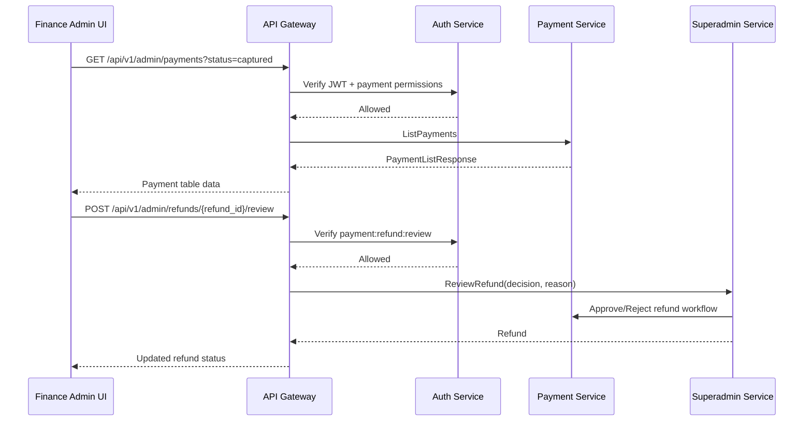
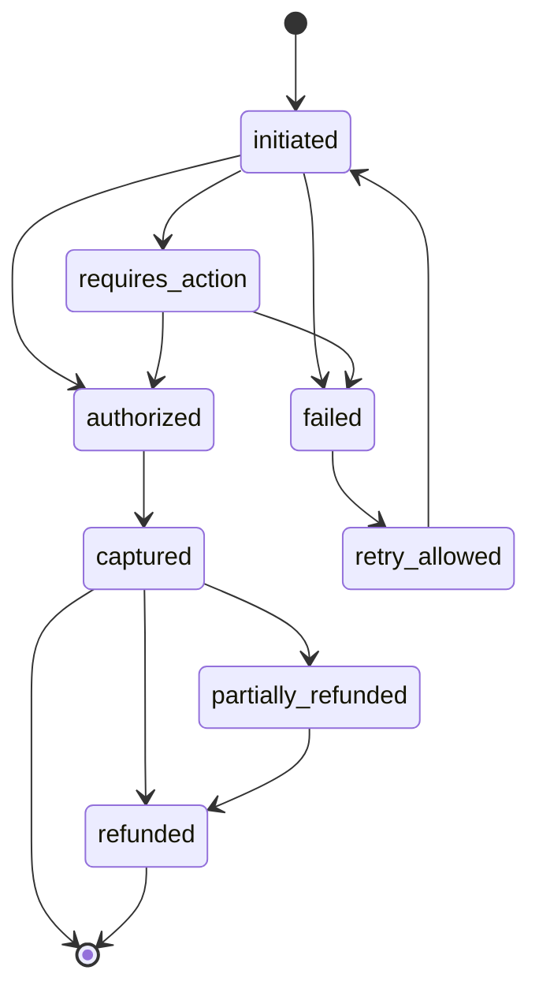
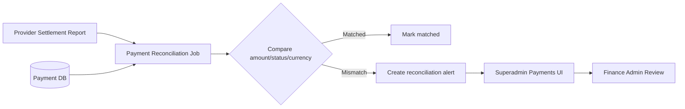
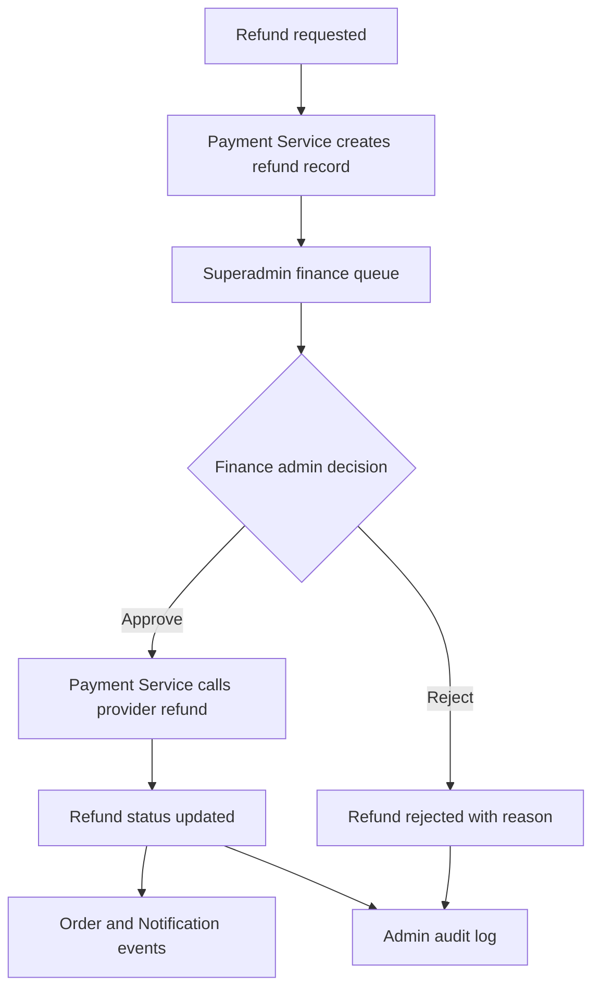

# 💳 Superadmin Panel - Task 5: Payment Operations


## 📌 Task Summary

| Field | Detail |
|---|---|
| Task Name | Payment operations |
| Source | `docs/01-micro-tasks.md` → `Superadmin Panel` → Task 5 |
| Priority | `P1` |
| Dependency | Payment APIs |
| Main Goal | Payment status, refunds, aur reconciliation alerts UI banana |
| Output Type | Structured implementation guide |
| Not Included | Order operations, session oversight, platform settings, full audit log viewer |

> **Simple Hinglish goal:** Is task ka purpose Superadmin Panel ke andar ek **Payments module** banana hai jahan authorized finance/admin team payments search kar sake, payment status inspect kar sake, refund requests review/approve/reject kar sake, aur reconciliation mismatch alerts dekh sake.

---

## ✅ Final Output Created

```text
TaskImplementation/
└── Superadmin Panel/
    ├── task1.md
    ├── task2.md
    ├── task3.md
    ├── task4.md
    └── task5.md
```

### Why this structure?

- `TaskImplementation/` task-wise implementation guides ka central folder hai.
- `Superadmin Panel/` Superadmin Panel ke saare task guides ko group karta hai.
- `task5.md` sirf **Superadmin Panel - Task 5: Payment Operations** ka guide hai.

> 🟢 **Note:** Is file me Task 5 ka complete step-by-step implementation guide diya gaya hai. Actual frontend/backend source code is task me add nahi kiya gaya, kyunki requested output sirf required folder structure aur `task5.md` content generate karna tha.

---

## 🧭 Implementation Approach

Is guide ko project ke existing documentation ke basis par design kiya gaya:

| Document | Kya use kiya gaya |
|---|---|
| `docs/01-micro-tasks.md` | Task 5 ka exact scope: payment status, refunds, reconciliation alerts UI |
| `docs/03-folder-structure.md` | `frontend/superadmin-panel/src/features/payments/` target structure |
| `docs/04-microservice-design.md` | Payment Service and Superadmin Service APIs |
| `docs/05-database-design.md` | `payments`, `payment_attempts`, `refunds`, `payment_reconciliations`, `admin_review_tasks` |
| `docs/06-auth-security.md` | `payment:refund:review`, finance admin access, audit mandatory |
| `docs/07-payment-system.md` | Payment state machine, refund flow, reconciliation flow |
| `docs/09-cms-superadmin.md` | Payments module: lookup, refunds, reconciliation mismatch |
| `docs/10-frontend-implementation.md` | React Query, protected routes, role-based menu, admin UI standards |
| `api/master-api.json` | Existing API contract: admin payments and refund review endpoints |

---

## 🧱 Task Boundary

### Included in Task 5

- Payments route inside existing Superadmin shell
- Payment list/search/filter page
- Payment status overview and detail drawer/page
- Payment attempts timeline
- Refund request queue
- Refund approve/reject UI with mandatory reason
- Reconciliation alert list
- Reconciliation mismatch detail panel
- Finance role based action permissions
- React Query hooks for payments, refunds, and reconciliation alerts
- Loading, empty, error, and permission-denied states
- Code examples and Mermaid diagrams
- Testing checklist for permissions, refund review, filters, and states

### Not Included in Task 5

- Order search/detail/dispute/manual review UI from Task 4
- Payment provider webhook implementation
- Checkout payment screen for buyers
- Seller dashboard revenue analytics
- Session oversight or suspicious activity dashboard
- Platform settings, commission settings, feature flags
- Full audit log viewer/export page
- Backend database migration implementation
- Direct card data handling or provider secret display

> 🔴 **Rule:** Task 5 sirf **Payment Operations** cover karega. Order detail ka read-only link dikh sakta hai, but order manual review Task 4 ka scope hai. Platform settings aur audit log viewer next tasks me rahenge.

---

## 🗂️ Clean Target Folder Structure

Task 1 ne Superadmin shell diya, Task 2 ne users module add kiya, Task 3 ne sellers module add kiya, Task 4 ne orders module document kiya. Task 5 usi shell ke andar `payments` feature add karega.

```text
frontend/
└── superadmin-panel/
    ├── src/
    │   ├── app/
    │   │   └── router.tsx
    │   ├── components/
    │   │   └── ui/
    │   │       ├── action-reason-dialog.tsx
    │   │       ├── amount-text.tsx
    │   │       ├── data-state.tsx
    │   │       ├── risk-badge.tsx
    │   │       ├── status-badge.tsx
    │   │       ├── table-pagination.tsx
    │   │       └── timeline.tsx
    │   ├── features/
    │   │   └── payments/
    │   │       ├── api/
    │   │       │   └── payments-api.ts
    │   │       ├── components/
    │   │       │   ├── payment-attempts-timeline.tsx
    │   │       │   ├── payment-detail-panel.tsx
    │   │       │   ├── payment-filter-bar.tsx
    │   │       │   ├── payment-status-summary.tsx
    │   │       │   ├── payment-table.tsx
    │   │       │   ├── reconciliation-alert-panel.tsx
    │   │       │   ├── reconciliation-table.tsx
    │   │       │   ├── refund-review-drawer.tsx
    │   │       │   └── refund-table.tsx
    │   │       ├── hooks/
    │   │       │   ├── use-admin-payments.ts
    │   │       │   ├── use-payment-detail.ts
    │   │       │   ├── use-reconciliation-alerts.ts
    │   │       │   ├── use-refund-review.ts
    │   │       │   └── use-refunds.ts
    │   │       ├── pages/
    │   │       │   ├── payment-operations-page.tsx
    │   │       │   └── refund-review-page.tsx
    │   │       ├── permissions.ts
    │   │       └── types.ts
    │   ├── lib/
    │   │   ├── admin-permissions.ts
    │   │   ├── format.ts
    │   │   └── http.ts
    │   └── routes/
    │       └── require-admin.tsx
    └── tests/
        └── payments/
            ├── payment-filters.test.tsx
            ├── payment-permissions.test.ts
            ├── payments-api.test.ts
            ├── reconciliation-alerts.test.tsx
            └── refund-review.test.tsx
```

### Folder Responsibility

| Path | Responsibility |
|---|---|
| `features/payments/api/` | Admin payment, refund, reconciliation REST calls |
| `features/payments/hooks/` | React Query hooks for list/detail/refund/reconciliation |
| `features/payments/components/` | Payment table, filters, refund drawer, reconciliation panel |
| `features/payments/pages/` | Route-level payment operations and refund review pages |
| `features/payments/permissions.ts` | Payment-specific role/action permissions |
| `features/payments/types.ts` | Payment, refund, attempt, reconciliation TypeScript types |
| `components/ui/action-reason-dialog.tsx` | Shared reason modal for risky admin actions |
| `components/ui/amount-text.tsx` | Money display helper |
| `tests/payments/` | Payment module tests |

---

## 🔌 External Libraries and Tools

Task 5 me Task 1-4 ke existing frontend stack ko reuse karna hai. Naya heavy dependency add karne ki zarurat nahi hai.

| Tool/Library | What it is | Why used | Install/Use |
|---|---|---|---|
| React | UI library | Payment tables, refund drawer, reconciliation panels banane ke liye | Vite React app me included |
| TypeScript | Static typing | Payment/refund status and API payloads safe banane ke liye | Vite React TS app me included |
| React Router DOM | Client routing | `/admin/payments` and `/admin/payments/refunds` routes ke liye | `pnpm add react-router-dom` |
| TanStack React Query | Server state library | Payment list/detail cache, refetch, mutation, loading states handle karne ke liye | `pnpm add @tanstack/react-query` |
| Zustand | Lightweight state store | Admin auth/session state Task 1 se reuse karne ke liye | `pnpm add zustand` |
| lucide-react | Icon library | Credit card, refund, alert, search, filter icons ke liye | `pnpm add lucide-react` |
| clsx | Conditional class helper | Status badge and risk row classes clean rakhne ke liye | `pnpm add clsx` |
| Vitest | Test runner | Permission and API helper tests ke liye | `pnpm add -D vitest` |
| Testing Library | React component testing | Refund drawer, filters, table states test karne ke liye | `pnpm add -D @testing-library/react @testing-library/user-event @testing-library/jest-dom` |
| MSW | API mocking | Payment/refund/reconciliation API mocks ke liye | `pnpm add -D msw` |

### Install Commands

```bash
# from frontend/superadmin-panel
pnpm add react-router-dom @tanstack/react-query zustand lucide-react clsx
pnpm add -D vitest @testing-library/react @testing-library/user-event @testing-library/jest-dom msw
```

### Basic Usage Commands

```bash
# install dependencies
pnpm install

# run development server
pnpm dev

# run tests
pnpm vitest run

# type-check
pnpm typecheck
```

> 🟡 **Note:** Agar ye packages pehle tasks me already installed hain, to dobara install karne ki zarurat nahi hai. Money formatting ke liye `Intl.NumberFormat` use karo; extra currency library mandatory nahi hai.

---

## 🧩 Architecture Diagram

```mermaid
flowchart TB
    Admin[Admin Browser] --> Shell[Superadmin Shell]
    Shell --> PaymentsRoute[/admin/payments]
    Shell --> RefundRoute[/admin/payments/refunds]

    PaymentsRoute --> PaymentPage[Payment Operations Page]
    RefundRoute --> RefundPage[Refund Review Page]

    PaymentPage --> PaymentHooks[Payment React Query Hooks]
    RefundPage --> RefundHooks[Refund Review Hooks]
    PaymentPage --> ReconHooks[Reconciliation Hooks]

    PaymentHooks --> HTTP[Admin HTTP Client]
    RefundHooks --> HTTP
    ReconHooks --> HTTP

    HTTP --> Gateway[API Gateway]
    Gateway --> Auth[Auth/RBAC Check]
    Gateway --> PaymentService[Payment Service]
    Gateway --> SuperadminService[Superadmin Service]

    PaymentService --> PaymentDB[(Payment MySQL DB)]
    SuperadminService --> AdminDB[(Superadmin MySQL DB)]
    SuperadminService --> Audit[(Admin Audit Logs)]
```

**Hinglish explanation:**  
Admin Superadmin shell open karta hai. Payments module React Query hooks ke through API Gateway ko call karta hai. Gateway JWT and RBAC validate karta hai. Payment list/detail/refund data Payment Service se aata hai. Refund approve/reject action Superadmin Service ke through review hota hai, jahan audit log mandatory hai.

---

## 🔄 Payment Operations Flow



**Kya ho raha hai:**  
Payment list read operation Payment Service se aata hai. Refund review high-risk mutation hai, isliye Superadmin Service review/audit workflow coordinate karta hai. Frontend kabhi bhi provider ko direct call nahi karega.

---

## 💸 Payment State Machine

Payment states `docs/07-payment-system.md` ke according:



### Status UI Mapping

| Status | Badge Color | UI Meaning |
|---|---|---|
| `initiated` | Gray | Intent created, provider action pending |
| `requires_action` | Yellow | Customer/provider action pending |
| `authorized` | Blue | Amount authorized but not captured |
| `captured` | Green | Payment successful and settled locally |
| `failed` | Red | Payment failed |
| `retry_allowed` | Orange | Failed but retry possible |
| `partially_refunded` | Purple | Some amount refunded |
| `refunded` | Purple | Full refund completed |

> 🟡 **Important:** Frontend callback final source of truth nahi hai. Payment final status provider webhook se decide hoga.

---

## 🔐 Permission Model

Payment operations sensitive financial module hai. Frontend permissions UX ke liye hain; real authorization API Gateway and services me enforce hogi.

| Role | View Payments | View Refunds | Approve/Reject Refund | View Reconciliation | Export |
|---|---:|---:|---:|---:|---:|
| `superadmin` | ✅ | ✅ | ✅ | ✅ | ✅ |
| `finance_admin` | ✅ | ✅ | ✅ | ✅ | ✅ |
| `operations_admin` | ❌ | ❌ | ❌ | ❌ | ❌ |
| `catalog_admin` | ❌ | ❌ | ❌ | ❌ | ❌ |
| `readonly_admin` | ✅ | ✅ | ❌ | ✅ | ❌ |

### Required Permissions

| Permission | Use |
|---|---|
| `payment:read` | Payment list/detail view |
| `payment:refund:read` | Refund queue view |
| `payment:refund:review` | Refund approve/reject |
| `payment:reconciliation:read` | Reconciliation mismatch view |
| `payment:export` | CSV/report export, if enabled later |

> 🔴 **Security rule:** Refund approve/reject action ke liye reason mandatory hai. High-value refunds me maker-checker approval future backend rule ho sakta hai.

---

## 🔗 API Contracts

Existing `api/master-api.json` me Task 5 ke core endpoints:

| Use Case | Method | Endpoint | Owner Service | gRPC |
|---|---|---|---|---|
| Payment list | `GET` | `/api/v1/admin/payments` | Payment Service | `PaymentService.ListPayments` |
| Refund review | `POST` | `/api/v1/admin/refunds/{refund_id}/review` | Superadmin Service | `SuperadminService.ReviewRefund` |
| Payment retry | `POST` | `/api/v1/payments/{payment_id}/retry` | Payment Service | `PaymentService.CreatePaymentIntent` |
| Refund create | `POST` | `/api/v1/payments/{payment_id}/refund` | Payment Service | `PaymentService.RefundPayment` |
| Provider webhook | `POST` | `/api/v1/webhooks/payments/{provider}` | Payment Service | `PaymentService.HandleWebhook` |

### Admin Payment List Query Params

`AdminPaymentListRequest` ke basis par:

| Query Param | Type | Example | Use |
|---|---|---|---|
| `page` | number | `1` | Pagination |
| `page_size` | number | `25` | Page size |
| `status` | string | `captured` | Status filter |
| `provider` | string | `razorpay` | Provider filter |
| `order_id` | string | `order_123` | Exact order lookup |

### Suggested API Additions for Complete UI

Current contract me admin payment list and refund review exist hain. Complete Task 5 UI ke liye implementation time ye contracts align karne honge:

| Use Case | Suggested Endpoint | Owner | Why needed |
|---|---|---|---|
| Payment detail | `GET /api/v1/admin/payments/{payment_id}` | Payment Service | Attempts, refunds, provider refs, timeline |
| Refund queue | `GET /api/v1/admin/refunds` | Payment/Superadmin Service | Pending refunds list view |
| Reconciliation alerts | `GET /api/v1/admin/payment-reconciliations` | Payment Service | Mismatch alerts table |
| Reconciliation detail | `GET /api/v1/admin/payment-reconciliations/{id}` | Payment Service | Amount/status/provider mismatch detail |

> 🟡 **Practical fallback:** Agar refund queue endpoint ready nahi hai, Payment list response me attached refund summaries se pending refund section temporarily derive kar sakte ho. Production me dedicated refund queue better rahegi.

---

## 🧱 Data Model Examples

### `types.ts`

```ts
export type PaymentStatus =
  | "initiated"
  | "requires_action"
  | "authorized"
  | "captured"
  | "failed"
  | "retry_allowed"
  | "partially_refunded"
  | "refunded";

export type RefundStatus =
  | "requested"
  | "pending_review"
  | "approved"
  | "rejected"
  | "processing"
  | "succeeded"
  | "failed";

export type ReconciliationStatus = "matched" | "mismatch" | "missing_local" | "missing_provider";

export type Money = {
  amount: number;
  currency: string;
};

export type AdminPayment = {
  payment_id: string;
  order_id: string;
  provider: "stripe" | "razorpay" | "cod" | string;
  provider_payment_id?: string;
  status: PaymentStatus;
  amount: Money;
  captured_at?: string;
  created_at: string;
};

export type PaymentAttempt = {
  attempt_id: string;
  payment_id: string;
  status: PaymentStatus;
  provider_reference?: string;
  error_code?: string;
  error_message?: string;
  created_at: string;
};

export type Refund = {
  refund_id: string;
  payment_id: string;
  order_id?: string;
  status: RefundStatus;
  amount: Money;
  reason: string;
  requested_by: "buyer" | "seller" | "support" | "admin";
  reviewed_by?: string;
  reviewed_at?: string;
  created_at: string;
};

export type ReconciliationAlert = {
  reconciliation_id: string;
  payment_id?: string;
  provider: string;
  status: ReconciliationStatus;
  local_amount?: Money;
  provider_amount?: Money;
  settlement_id?: string;
  detected_at: string;
};
```

**Kya build hua:**  
Payment feature ke core models typed ho gaye. Ab status spelling mistakes, missing amount shape, aur unsafe refund decisions avoid honge.

---

## Step 1: Payment Feature Folder Banao

Create:

```text
frontend/superadmin-panel/src/features/payments/
```

Recommended files:

```text
features/payments/
├── api/payments-api.ts
├── components/payment-table.tsx
├── components/payment-filter-bar.tsx
├── components/payment-detail-panel.tsx
├── components/refund-review-drawer.tsx
├── components/refund-table.tsx
├── components/reconciliation-table.tsx
├── hooks/use-admin-payments.ts
├── hooks/use-refund-review.ts
├── hooks/use-refunds.ts
├── hooks/use-reconciliation-alerts.ts
├── pages/payment-operations-page.tsx
├── pages/refund-review-page.tsx
├── permissions.ts
└── types.ts
```

**Kya build hua:**  
Payments ka code isolated feature folder me aa gaya. Isse users/sellers/orders module ke code ke saath responsibility mix nahi hoti.

---

## Step 2: Payment Permissions Define Karo

Create:

```text
frontend/superadmin-panel/src/features/payments/permissions.ts
```

```ts
type AdminRole =
  | "superadmin"
  | "finance_admin"
  | "operations_admin"
  | "catalog_admin"
  | "readonly_admin";

export function canViewPayments(roles: AdminRole[]) {
  return roles.some((role) => ["superadmin", "finance_admin", "readonly_admin"].includes(role));
}

export function canReviewRefunds(roles: AdminRole[]) {
  return roles.some((role) => ["superadmin", "finance_admin"].includes(role));
}

export function canViewReconciliation(roles: AdminRole[]) {
  return roles.some((role) => ["superadmin", "finance_admin", "readonly_admin"].includes(role));
}
```

**Kya build hua:**  
UI level pe action buttons and routes role ke basis par visible/disabled honge. Backend enforcement phir bhi mandatory hai.

---

## Step 3: Admin Menu Me Payments Route Add Karo

Existing shell menu config me Payments item add/update karo:

```ts
import { CreditCard } from "lucide-react";

export const adminMenu = [
  {
    label: "Payments",
    path: "/admin/payments",
    icon: CreditCard,
    allowedRoles: ["superadmin", "finance_admin", "readonly_admin"],
  },
];
```

**Kya build hua:**  
Finance admin and superadmin ko sidebar me Payments module dikhega. Operations/catalog admin ko ye module visible nahi hoga.

---

## Step 4: Routes Configure Karo

Create/update router:

```tsx
import { PaymentOperationsPage } from "@/features/payments/pages/payment-operations-page";
import { RefundReviewPage } from "@/features/payments/pages/refund-review-page";
import { RequireAdmin } from "@/routes/require-admin";

export const paymentRoutes = [
  {
    path: "/admin/payments",
    element: (
      <RequireAdmin allowedRoles={["superadmin", "finance_admin", "readonly_admin"]}>
        <PaymentOperationsPage />
      </RequireAdmin>
    ),
  },
  {
    path: "/admin/payments/refunds",
    element: (
      <RequireAdmin allowedRoles={["superadmin", "finance_admin", "readonly_admin"]}>
        <RefundReviewPage />
      </RequireAdmin>
    ),
  },
];
```

**Kya build hua:**  
Payment operations and refund review route protected ho gaye. Unauthorized admin ko permission-denied state milegi.

---

## Step 5: API Layer Banao

Create:

```text
frontend/superadmin-panel/src/features/payments/api/payments-api.ts
```

```ts
import { http } from "@/lib/http";
import type { AdminPayment, Refund, ReconciliationAlert } from "../types";

type PaymentListParams = {
  page?: number;
  page_size?: number;
  status?: string;
  provider?: string;
  order_id?: string;
};

type PaymentListResponse = {
  payments: AdminPayment[];
};

export function listAdminPayments(params: PaymentListParams) {
  return http.get<PaymentListResponse>("/api/v1/admin/payments", { params });
}

export function reviewRefund(refundId: string, body: { decision: "approved" | "rejected"; reason: string }) {
  return http.post<Refund>(`/api/v1/admin/refunds/${refundId}/review`, body);
}

export function listRefunds(params: { status?: string; page?: number; page_size?: number }) {
  return http.get<{ refunds: Refund[] }>("/api/v1/admin/refunds", { params });
}

export function listReconciliationAlerts(params: { status?: string; page?: number; page_size?: number }) {
  return http.get<{ alerts: ReconciliationAlert[] }>("/api/v1/admin/payment-reconciliations", { params });
}
```

**Kya build hua:**  
Component direct `fetch` nahi karega. Saare API calls ek typed layer me centralize ho gaye.

> 🟡 **Note:** `listRefunds` and `listReconciliationAlerts` suggested endpoints hain. Agar backend contract pending ho, implementation time API team ke saath align karna hoga.

---

## Step 6: React Query Hooks Banao

Create:

```text
frontend/superadmin-panel/src/features/payments/hooks/use-admin-payments.ts
```

```ts
import { useQuery } from "@tanstack/react-query";
import { listAdminPayments } from "../api/payments-api";

type Filters = {
  page: number;
  page_size: number;
  status?: string;
  provider?: string;
  order_id?: string;
};

export function useAdminPayments(filters: Filters) {
  return useQuery({
    queryKey: ["admin-payments", filters],
    queryFn: () => listAdminPayments(filters),
    staleTime: 30_000,
  });
}
```

Create refund mutation hook:

```text
frontend/superadmin-panel/src/features/payments/hooks/use-refund-review.ts
```

```ts
import { useMutation, useQueryClient } from "@tanstack/react-query";
import { reviewRefund } from "../api/payments-api";

export function useRefundReview() {
  const queryClient = useQueryClient();

  return useMutation({
    mutationFn: (input: { refundId: string; decision: "approved" | "rejected"; reason: string }) =>
      reviewRefund(input.refundId, {
        decision: input.decision,
        reason: input.reason,
      }),
    onSuccess: () => {
      queryClient.invalidateQueries({ queryKey: ["admin-refunds"] });
      queryClient.invalidateQueries({ queryKey: ["admin-payments"] });
    },
  });
}
```

**Kya build hua:**  
Payment list cached ho gayi, aur refund review ke baad payments/refunds automatically refresh honge.

---

## Step 7: Payment Filter Bar Banao

Create:

```text
frontend/superadmin-panel/src/features/payments/components/payment-filter-bar.tsx
```

```tsx
type Props = {
  filters: {
    status?: string;
    provider?: string;
    order_id?: string;
  };
  onChange: (filters: Props["filters"]) => void;
};

export function PaymentFilterBar({ filters, onChange }: Props) {
  return (
    <div className="flex flex-wrap items-end gap-3">
      <label className="grid gap-1 text-sm">
        <span className="font-medium">Order ID</span>
        <input
          value={filters.order_id ?? ""}
          onChange={(event) => onChange({ ...filters, order_id: event.target.value })}
          className="h-9 rounded-md border px-3"
          placeholder="order_123"
        />
      </label>

      <label className="grid gap-1 text-sm">
        <span className="font-medium">Status</span>
        <select
          value={filters.status ?? ""}
          onChange={(event) => onChange({ ...filters, status: event.target.value || undefined })}
          className="h-9 rounded-md border px-3"
        >
          <option value="">All</option>
          <option value="captured">Captured</option>
          <option value="failed">Failed</option>
          <option value="partially_refunded">Partially refunded</option>
          <option value="refunded">Refunded</option>
        </select>
      </label>

      <label className="grid gap-1 text-sm">
        <span className="font-medium">Provider</span>
        <select
          value={filters.provider ?? ""}
          onChange={(event) => onChange({ ...filters, provider: event.target.value || undefined })}
          className="h-9 rounded-md border px-3"
        >
          <option value="">All</option>
          <option value="stripe">Stripe</option>
          <option value="razorpay">Razorpay</option>
          <option value="cod">COD</option>
        </select>
      </label>
    </div>
  );
}
```

**Kya build hua:**  
Finance admin status/provider/order ID ke basis par payment records quickly filter kar sakta hai.

---

## Step 8: Payment Table Banao

Create:

```text
frontend/superadmin-panel/src/features/payments/components/payment-table.tsx
```

```tsx
import type { AdminPayment } from "../types";

type Props = {
  payments: AdminPayment[];
  onSelect: (payment: AdminPayment) => void;
};

export function PaymentTable({ payments, onSelect }: Props) {
  return (
    <table className="w-full border-collapse text-sm">
      <thead>
        <tr className="border-b bg-slate-50 text-left">
          <th className="p-3">Payment</th>
          <th className="p-3">Order</th>
          <th className="p-3">Provider</th>
          <th className="p-3">Status</th>
          <th className="p-3 text-right">Amount</th>
          <th className="p-3">Created</th>
        </tr>
      </thead>
      <tbody>
        {payments.map((payment) => (
          <tr
            key={payment.payment_id}
            className="cursor-pointer border-b hover:bg-slate-50"
            onClick={() => onSelect(payment)}
          >
            <td className="p-3 font-medium">{payment.payment_id}</td>
            <td className="p-3">{payment.order_id}</td>
            <td className="p-3">{payment.provider}</td>
            <td className="p-3">{payment.status}</td>
            <td className="p-3 text-right">
              {payment.amount.currency} {payment.amount.amount}
            </td>
            <td className="p-3">{new Date(payment.created_at).toLocaleString()}</td>
          </tr>
        ))}
      </tbody>
    </table>
  );
}
```

**Kya build hua:**  
Payment records compact operational table me show honge. Row click detail panel open karega.

---

## Step 9: Payment Detail Panel Banao

Create:

```text
frontend/superadmin-panel/src/features/payments/components/payment-detail-panel.tsx
```

```tsx
import type { AdminPayment } from "../types";

type Props = {
  payment: AdminPayment | null;
  onClose: () => void;
};

export function PaymentDetailPanel({ payment, onClose }: Props) {
  if (!payment) return null;

  return (
    <aside className="fixed inset-y-0 right-0 w-full max-w-xl border-l bg-white p-5 shadow-xl">
      <div className="flex items-start justify-between gap-4">
        <div>
          <h2 className="text-lg font-semibold">Payment detail</h2>
          <p className="text-sm text-slate-600">{payment.payment_id}</p>
        </div>
        <button className="rounded-md border px-3 py-1 text-sm" onClick={onClose}>
          Close
        </button>
      </div>

      <dl className="mt-5 grid gap-3 text-sm">
        <div className="flex justify-between gap-4">
          <dt className="text-slate-600">Order</dt>
          <dd className="font-medium">{payment.order_id}</dd>
        </div>
        <div className="flex justify-between gap-4">
          <dt className="text-slate-600">Provider</dt>
          <dd>{payment.provider}</dd>
        </div>
        <div className="flex justify-between gap-4">
          <dt className="text-slate-600">Provider payment ID</dt>
          <dd>{payment.provider_payment_id ?? "N/A"}</dd>
        </div>
        <div className="flex justify-between gap-4">
          <dt className="text-slate-600">Status</dt>
          <dd>{payment.status}</dd>
        </div>
        <div className="flex justify-between gap-4">
          <dt className="text-slate-600">Amount</dt>
          <dd>
            {payment.amount.currency} {payment.amount.amount}
          </dd>
        </div>
      </dl>
    </aside>
  );
}
```

**Kya build hua:**  
Admin payment details inspect kar sakta hai without leaving payment list. Is panel me card number, CVV, provider secrets, raw tokens kabhi show nahi karne.

---

## Step 10: Refund Review Page Banao

Create:

```text
frontend/superadmin-panel/src/features/payments/pages/refund-review-page.tsx
```

Page responsibilities:

- Pending refund requests list show karo.
- Refund amount, reason, linked payment/order show karo.
- Approve/reject buttons only finance admin/superadmin ko dikhao.
- Reason mandatory rakho.
- Mutation success ke baad queue refresh karo.

```tsx
import { useState } from "react";
import type { Refund } from "../types";
import { RefundReviewDrawer } from "../components/refund-review-drawer";

export function RefundReviewPage() {
  const [selectedRefund, setSelectedRefund] = useState<Refund | null>(null);

  return (
    <main className="grid gap-4">
      <header>
        <h1 className="text-xl font-semibold">Refund review</h1>
        <p className="text-sm text-slate-600">Pending finance approvals and refund decisions.</p>
      </header>

      {/* RefundTable data React Query hook se aayega */}
      {/* <RefundTable refunds={refunds} onReview={setSelectedRefund} /> */}

      <RefundReviewDrawer refund={selectedRefund} onClose={() => setSelectedRefund(null)} />
    </main>
  );
}
```

**Kya build hua:**  
Refund review separate focused page ban gaya. Payment list cluttered nahi hogi, aur finance team pending approvals par directly kaam kar sakti hai.

---

## Step 11: Refund Review Drawer Banao

Create:

```text
frontend/superadmin-panel/src/features/payments/components/refund-review-drawer.tsx
```

```tsx
import { useState } from "react";
import { useRefundReview } from "../hooks/use-refund-review";
import type { Refund } from "../types";

type Props = {
  refund: Refund | null;
  onClose: () => void;
};

export function RefundReviewDrawer({ refund, onClose }: Props) {
  const [reason, setReason] = useState("");
  const mutation = useRefundReview();

  if (!refund) return null;

  async function submit(decision: "approved" | "rejected") {
    if (!refund || reason.trim().length < 10) return;

    await mutation.mutateAsync({
      refundId: refund.refund_id,
      decision,
      reason: reason.trim(),
    });

    setReason("");
    onClose();
  }

  return (
    <aside className="fixed inset-y-0 right-0 w-full max-w-xl border-l bg-white p-5 shadow-xl">
      <h2 className="text-lg font-semibold">Review refund</h2>
      <p className="mt-1 text-sm text-slate-600">{refund.refund_id}</p>

      <dl className="mt-5 grid gap-3 text-sm">
        <div className="flex justify-between gap-4">
          <dt className="text-slate-600">Payment</dt>
          <dd>{refund.payment_id}</dd>
        </div>
        <div className="flex justify-between gap-4">
          <dt className="text-slate-600">Amount</dt>
          <dd>
            {refund.amount.currency} {refund.amount.amount}
          </dd>
        </div>
        <div className="flex justify-between gap-4">
          <dt className="text-slate-600">Request reason</dt>
          <dd>{refund.reason}</dd>
        </div>
      </dl>

      <label className="mt-5 grid gap-2 text-sm">
        <span className="font-medium">Admin reason</span>
        <textarea
          value={reason}
          onChange={(event) => setReason(event.target.value)}
          className="min-h-28 rounded-md border p-3"
          placeholder="Decision ka clear audit reason likho"
        />
      </label>

      <div className="mt-5 flex justify-end gap-3">
        <button className="rounded-md border px-4 py-2 text-sm" onClick={onClose}>
          Cancel
        </button>
        <button
          className="rounded-md border border-red-300 px-4 py-2 text-sm text-red-700"
          disabled={reason.trim().length < 10 || mutation.isPending}
          onClick={() => submit("rejected")}
        >
          Reject
        </button>
        <button
          className="rounded-md bg-emerald-700 px-4 py-2 text-sm text-white"
          disabled={reason.trim().length < 10 || mutation.isPending}
          onClick={() => submit("approved")}
        >
          Approve
        </button>
      </div>
    </aside>
  );
}
```

**Kya build hua:**  
Refund approve/reject action controlled ho gaya. Admin reason minimum length se validate hota hai, and API call ke through audit workflow trigger hota hai.

---

## Step 12: Reconciliation Alerts UI Banao

Create:

```text
frontend/superadmin-panel/src/features/payments/components/reconciliation-table.tsx
```

```tsx
import type { ReconciliationAlert } from "../types";

type Props = {
  alerts: ReconciliationAlert[];
};

export function ReconciliationTable({ alerts }: Props) {
  return (
    <table className="w-full border-collapse text-sm">
      <thead>
        <tr className="border-b bg-slate-50 text-left">
          <th className="p-3">Alert</th>
          <th className="p-3">Provider</th>
          <th className="p-3">Status</th>
          <th className="p-3">Payment</th>
          <th className="p-3">Settlement</th>
          <th className="p-3">Detected</th>
        </tr>
      </thead>
      <tbody>
        {alerts.map((alert) => (
          <tr key={alert.reconciliation_id} className="border-b">
            <td className="p-3 font-medium">{alert.reconciliation_id}</td>
            <td className="p-3">{alert.provider}</td>
            <td className="p-3">{alert.status}</td>
            <td className="p-3">{alert.payment_id ?? "N/A"}</td>
            <td className="p-3">{alert.settlement_id ?? "N/A"}</td>
            <td className="p-3">{new Date(alert.detected_at).toLocaleString()}</td>
          </tr>
        ))}
      </tbody>
    </table>
  );
}
```

**Kya build hua:**  
Finance admin reconciliation mismatch quickly identify kar sakta hai: missing local payment, missing provider payment, amount mismatch, ya status mismatch.

---

## Step 13: Payment Operations Page Compose Karo

Create:

```text
frontend/superadmin-panel/src/features/payments/pages/payment-operations-page.tsx
```

```tsx
import { useState } from "react";
import { PaymentFilterBar } from "../components/payment-filter-bar";
import { PaymentTable } from "../components/payment-table";
import { PaymentDetailPanel } from "../components/payment-detail-panel";
import { useAdminPayments } from "../hooks/use-admin-payments";
import type { AdminPayment } from "../types";

export function PaymentOperationsPage() {
  const [filters, setFilters] = useState({ page: 1, page_size: 25 });
  const [selectedPayment, setSelectedPayment] = useState<AdminPayment | null>(null);
  const query = useAdminPayments(filters);

  return (
    <main className="grid gap-4">
      <header className="flex flex-wrap items-center justify-between gap-3">
        <div>
          <h1 className="text-xl font-semibold">Payment operations</h1>
          <p className="text-sm text-slate-600">Payment status, refunds, and reconciliation overview.</p>
        </div>
      </header>

      <PaymentFilterBar filters={filters} onChange={(next) => setFilters({ ...filters, ...next, page: 1 })} />

      {query.isLoading ? <p>Loading payments...</p> : null}
      {query.isError ? <p>Unable to load payments.</p> : null}
      {query.data ? <PaymentTable payments={query.data.payments} onSelect={setSelectedPayment} /> : null}

      <PaymentDetailPanel payment={selectedPayment} onClose={() => setSelectedPayment(null)} />
    </main>
  );
}
```

**Kya build hua:**  
Main payment page ready ho gaya: filters, list, detail drawer, and server state integration ek saath composed hain.

---

## Step 14: Empty, Loading, Error States Polish Karo

Required states:

| State | UI Behavior |
|---|---|
| Loading | Skeleton/table loader show karo |
| Empty | "No payments found" with current filters reset action |
| Error | Error message + retry button |
| Permission denied | Readable denied page, no financial data |
| Mutation pending | Approve/reject buttons disabled |
| Mutation success | Toast + list refresh |
| Mutation failed | Error callout, reason field preserve karo |

Example:

```tsx
if (query.isError) {
  return (
    <section className="rounded-md border border-red-200 bg-red-50 p-4">
      <h2 className="text-sm font-semibold text-red-900">Payments load nahi ho paaye</h2>
      <button className="mt-3 rounded-md border px-3 py-2 text-sm" onClick={() => query.refetch()}>
        Retry
      </button>
    </section>
  );
}
```

**Kya build hua:**  
Production UX stable lagti hai. Admin ko blank screen ya confusing state nahi milti.

---

## Step 15: Audit and Security Rules Follow Karo

Payment module me ye security rules mandatory hain:

| Rule | Why |
|---|---|
| Raw card data never render | Platform card data store nahi karega |
| Provider API keys never show | Secret leakage avoid |
| Refund reason mandatory | Audit and compliance |
| Admin mutation rate-limited | Abuse/fat-finger risk reduce |
| High-value refund maker-checker | Fraud control |
| Webhook final source of truth | Client callback trusted nahi |
| Amount server-side computed | Tampering avoid |
| Logs redact provider refs where needed | Sensitive financial data protection |

**Kya build hua:**  
UI financial workflow ke security boundaries respect karta hai. Risky action backend audit workflow ke through jaata hai.

---

## Step 16: Testing Checklist

### Unit Tests

- `canViewPayments` correct roles allow karta hai.
- `canReviewRefunds` readonly/admin-only roles block karta hai.
- Money formatter currency correctly show karta hai.
- Payment status badge correct color map karta hai.

### Component Tests

- Payment filters query params update karte hain.
- Empty payment list empty state show karti hai.
- Payment row click detail panel open karta hai.
- Refund approve button reason ke bina disabled hota hai.
- Refund reject action correct payload bhejta hai.
- Readonly admin ko approve/reject buttons nahi dikhte.

### API Mock Tests

- `GET /api/v1/admin/payments` correct params ke saath call hota hai.
- `POST /api/v1/admin/refunds/{refund_id}/review` decision and reason send karta hai.
- API error par retry/error UI show hota hai.

Example test:

```tsx
it("requires reason before refund approval", async () => {
  render(<RefundReviewDrawer refund={mockRefund} onClose={vi.fn()} />);

  expect(screen.getByRole("button", { name: /approve/i })).toBeDisabled();

  await userEvent.type(screen.getByLabelText(/admin reason/i), "Valid finance review reason");

  expect(screen.getByRole("button", { name: /approve/i })).toBeEnabled();
});
```

---

## 🧪 Manual QA Checklist

| Check | Expected Result |
|---|---|
| Finance admin opens `/admin/payments` | Payment table visible |
| Operations admin opens `/admin/payments` | Permission denied |
| Readonly admin opens refunds page | Can view, cannot approve/reject |
| Filter by status `captured` | Only captured payments visible |
| Filter by provider `razorpay` | Provider-specific rows visible |
| Open payment detail | Payment metadata visible, no card data |
| Approve refund without reason | Button disabled |
| Approve refund with reason | API call succeeds and queue refreshes |
| Reject refund with reason | Refund status updates |
| Reconciliation mismatch exists | Alert row visible |

---

## 📊 Reconciliation Flow Diagram



**Hinglish explanation:**  
Daily reconciliation job provider settlement report ko local Payment DB se compare karta hai. Agar amount, currency, status, fee, ya settlement ID mismatch hota hai to alert create hota hai. Superadmin Payments UI me finance admin ye alert inspect karta hai.

---

## 🔁 Refund Review Flow Diagram



**Hinglish explanation:**  
Refund request pehle Payment Service me immutable record banta hai. Finance admin Superadmin UI se decision deta hai. Approve hone par provider refund call hoti hai. Reject hone par reason store hota hai. Dono cases me audit log required hai.

---

## 🚫 Common Mistakes Avoid Karo

| Mistake | Correct Approach |
|---|---|
| Frontend se provider refund direct call karna | Sirf API Gateway/Superadmin API call karo |
| Card data ya secrets UI me dikhana | Never render sensitive provider data |
| Refund approve without reason | Reason mandatory rakho |
| Readonly admin ko mutation button dena | View-only access do |
| Reconciliation ko Task 7 settings me move karna | Task 5 me only alert/view UI rakho |
| Order manual review yahan implement karna | Order operations Task 4 me rahega |
| Payment status client callback se final maana | Provider webhook source of truth hai |

---

## ✅ Final Verification Checklist

- [x] `TaskImplementation/` folder exists
- [x] `TaskImplementation/Superadmin Panel/` folder exists
- [x] `task5.md` created
- [x] Task 5 scope documented only
- [x] Payment status UI covered
- [x] Refund review UI covered
- [x] Reconciliation alerts UI covered
- [x] External libraries/tools mentioned
- [x] Folder structure included
- [x] Code examples included
- [x] Mermaid diagrams included
- [x] Security and RBAC rules included
- [x] No implementation beyond Superadmin Panel Task 5 added

---

## 🏁 Summary

Task 5 me Superadmin Panel ke liye **Payment Operations module** design kiya gaya:

- Payment list/search/filter
- Payment detail inspection
- Refund review queue
- Refund approve/reject with mandatory reason
- Reconciliation mismatch alerts
- Finance-focused RBAC
- React Query API flow
- Security boundaries for financial data

> ✅ **Final scope status:** Superadmin Panel Task 5 documented completely. Session oversight, platform settings, and audit log viewer intentionally excluded because wo next Superadmin Panel tasks ka scope hai.
