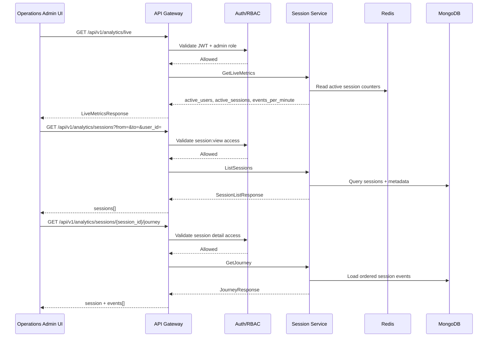

# 🛰️ Superadmin Panel - Task 6: Session Oversight


## 📌 Task Summary

| Field | Detail |
|---|---|
| Task Name | Session oversight |
| Source | `docs/01-micro-tasks.md` → `Superadmin Panel` → Task 6 |
| Priority | `P2` |
| Dependency | Session APIs |
| Main Goal | High-risk sessions, live traffic, aur suspicious activity view banana |
| Output Type | Structured implementation guide |
| Not Included | Platform settings, full audit log viewer, full analytics dashboard, heatmap/funnel/cohort reports |

> **Simple Hinglish goal:** Is task ka purpose Superadmin Panel ke andar ek **Session Oversight module** banana hai jahan authorized admin live platform traffic dekh sake, suspicious/high-risk sessions identify kar sake, aur kisi session ki journey timeline inspect kar sake. Ye module security aur operations team ko abnormal behavior jaldi spot karne me help karega.

---

## ✅ Final Output Created

```text
TaskImplementation/
└── Superadmin Panel/
    ├── task1.md
    ├── task2.md
    ├── task3.md
    ├── task4.md
    ├── task5.md
    └── task6.md
```

### Why this structure?

- `TaskImplementation/` task-wise implementation guides ka central folder hai.
- `Superadmin Panel/` Superadmin Panel ke saare task guides ko group karta hai.
- `task6.md` sirf **Superadmin Panel - Task 6: Session Oversight** ka guide hai.

> 🟢 **Note:** Is file me Task 6 ka complete step-by-step implementation guide diya gaya hai. Actual frontend/backend source code is task me add nahi kiya gaya, kyunki requested output sirf required folder structure aur `task6.md` content generate karna tha.

---

## 🧭 Implementation Approach

Is guide ko project ke existing documentation ke basis par design kiya gaya:

| Document | Kya use kiya gaya |
|---|---|
| `docs/01-micro-tasks.md` | Task 6 ka exact scope: high-risk sessions, live traffic, suspicious activity view |
| `docs/02-system-architecture.md` | Superadmin Panel → API Gateway → Session Service flow |
| `docs/03-folder-structure.md` | `frontend/superadmin-panel/src/features/sessions/` target structure |
| `docs/04-microservice-design.md` | Session Service responsibilities, gRPC methods, REST analytics APIs |
| `docs/05-database-design.md` | Session data MongoDB + Redis storage strategy |
| `docs/06-auth-security.md` | Secure session fields, PII masking, admin role checks |
| `docs/08-session-management-system.md` | Session events, journey tracking, live active users, analytics concepts |
| `docs/09-cms-superadmin.md` | Superadmin Sessions module capability: live sessions, suspicious activity, user journey |
| `docs/10-frontend-implementation.md` | Dense operational UI, React Query caching, protected admin routes |
| `api/master-api.json` | Existing endpoints: live metrics, session list, session journey |

---

## 🧱 Task Boundary

### Included in Task 6

- Sessions route inside existing Superadmin shell
- Live traffic metric cards
- Auto-refresh for live metrics
- Sessions table with date/user/status/risk filters
- High-risk session list
- Suspicious activity feed
- Session journey detail drawer/page
- Event timeline for page views, searches, cart actions, checkout steps, and payment results
- Device/browser/location summary with PII masking
- Risk score badge and risk reason labels
- Role-based access checks
- React Query hooks for live metrics, session list, and journey detail
- Loading, empty, error, and permission-denied states
- Code examples and Mermaid diagrams
- Testing checklist for permissions, live polling, filters, privacy, and risk scoring

### Not Included in Task 6

- Full standalone Session Analytics Dashboard
- Funnel analysis page
- Heatmap page
- Cohort/retention reports
- Scheduled analytics exports
- Session ingestion SDK implementation
- Backend fraud engine implementation
- Session revoke/logout mutation UI, because current API contract exposes read-focused session analytics endpoints
- Platform settings UI
- Full audit log viewer/export page
- User block/unblock UI from Task 2
- Payment/order/seller operations from Tasks 3-5

> 🔴 **Rule:** Task 6 sirf **Session Oversight** cover karega. Funnel, heatmap, cohorts, exports, and privacy retention settings separate Session Analytics Dashboard / future tasks ka scope hain.

---

## 🗂️ Clean Target Folder Structure

Task 1 ne Superadmin shell diya, Task 2 ne users module, Task 3 ne sellers, Task 4 ne orders, aur Task 5 ne payments module document kiya. Task 6 usi shell ke andar `sessions` feature add karega.

```text
frontend/
└── superadmin-panel/
    ├── src/
    │   ├── app/
    │   │   └── router.tsx
    │   ├── components/
    │   │   └── ui/
    │   │       ├── data-state.tsx
    │   │       ├── risk-score-badge.tsx
    │   │       ├── status-badge.tsx
    │   │       ├── table-pagination.tsx
    │   │       └── timeline.tsx
    │   ├── features/
    │   │   └── sessions/
    │   │       ├── api/
    │   │       │   └── sessions-api.ts
    │   │       ├── components/
    │   │       │   ├── device-summary-card.tsx
    │   │       │   ├── high-risk-session-table.tsx
    │   │       │   ├── live-metrics-cards.tsx
    │   │       │   ├── live-traffic-panel.tsx
    │   │       │   ├── masked-identity.tsx
    │   │       │   ├── session-detail-drawer.tsx
    │   │       │   ├── session-event-timeline.tsx
    │   │       │   ├── session-filter-bar.tsx
    │   │       │   ├── session-table.tsx
    │   │       │   └── suspicious-activity-feed.tsx
    │   │       ├── hooks/
    │   │       │   ├── use-admin-sessions.ts
    │   │       │   ├── use-live-metrics.ts
    │   │       │   └── use-session-journey.ts
    │   │       ├── pages/
    │   │       │   └── session-oversight-page.tsx
    │   │       ├── permissions.ts
    │   │       ├── risk-rules.ts
    │   │       └── types.ts
    │   ├── lib/
    │   │   ├── admin-permissions.ts
    │   │   ├── format.ts
    │   │   └── http.ts
    │   └── routes/
    │       └── require-admin.tsx
    └── tests/
        └── sessions/
            ├── live-metrics.test.tsx
            ├── session-filters.test.tsx
            ├── session-permissions.test.ts
            ├── session-risk-rules.test.ts
            └── session-timeline.test.tsx
```

### Folder Responsibility

| Path | Responsibility |
|---|---|
| `features/sessions/api/` | Session analytics REST calls |
| `features/sessions/hooks/` | React Query hooks for live metrics, sessions, and journey detail |
| `features/sessions/components/` | Metric cards, tables, filters, timeline, suspicious feed |
| `features/sessions/pages/` | Route-level session oversight page |
| `features/sessions/permissions.ts` | Session-specific role/action permissions |
| `features/sessions/risk-rules.ts` | UI-side risk score and risk reason derivation |
| `features/sessions/types.ts` | Session, event, journey, metrics TypeScript types |
| `components/ui/risk-score-badge.tsx` | Shared risk badge UI |
| `components/ui/timeline.tsx` | Shared event timeline UI |
| `tests/sessions/` | Session module tests |

---

## 🔌 External Libraries and Tools

Task 6 me Task 1-5 ke existing frontend stack ko reuse karna hai. Naya heavy charting dependency mandatory nahi hai; live metrics simple cards and compact tables se cover ho sakte hain.

| Tool/Library | What it is | Why used | Install/Use |
|---|---|---|---|
| React | UI library | Session tables, cards, drawers, timeline components banane ke liye | Vite React app me included |
| TypeScript | Static typing | Session/event/risk payloads safe banane ke liye | Vite React TS app me included |
| React Router DOM | Client routing | `/admin/sessions` route ke liye | `pnpm add react-router-dom` |
| TanStack React Query | Server state library | Live polling, session list cache, journey detail fetch handle karne ke liye | `pnpm add @tanstack/react-query` |
| Zustand | Lightweight state store | Admin auth/session state Task 1 se reuse karne ke liye | `pnpm add zustand` |
| lucide-react | Icon library | Activity, shield, monitor, alert, clock icons ke liye | `pnpm add lucide-react` |
| clsx | Conditional class helper | Risk badges and row highlighting clean rakhne ke liye | `pnpm add clsx` |
| Vitest | Test runner | Risk rules, permission helpers, and API helpers test karne ke liye | `pnpm add -D vitest` |
| Testing Library | React component testing | Filters, drawers, timeline, empty/error states test karne ke liye | `pnpm add -D @testing-library/react @testing-library/user-event @testing-library/jest-dom` |
| MSW | API mocking | Live metrics, sessions, and journey API mocks ke liye | `pnpm add -D msw` |

### Install Commands

```bash
# from frontend/superadmin-panel
pnpm add react-router-dom @tanstack/react-query zustand lucide-react clsx
pnpm add -D vitest @testing-library/react @testing-library/user-event @testing-library/jest-dom msw
```

### Basic Usage Commands

```bash
# install dependencies
pnpm install

# run development server
pnpm dev

# run tests
pnpm vitest run

# type-check
pnpm typecheck
```

> 🟡 **Note:** Agar ye packages pehle tasks me already installed hain, to dobara install karne ki zarurat nahi hai. Task 6 ke MVP ke liye `Intl.DateTimeFormat` enough hai; date formatting ke liye extra library mandatory nahi hai.

---

## 🧩 Architecture Diagram

```mermaid
flowchart TB
    Admin[Admin Browser] --> Shell[Superadmin Shell]
    Shell --> SessionsRoute[/admin/sessions]

    SessionsRoute --> OversightPage[Session Oversight Page]
    OversightPage --> MetricsHook[useLiveMetrics]
    OversightPage --> SessionsHook[useAdminSessions]
    OversightPage --> JourneyHook[useSessionJourney]
    OversightPage --> RiskRules[UI Risk Rules]

    MetricsHook --> HTTP[Admin HTTP Client]
    SessionsHook --> HTTP
    JourneyHook --> HTTP

    HTTP --> Gateway[API Gateway]
    Gateway --> Auth[Auth / RBAC Check]
    Gateway --> SessionService[Session Service]

    SessionService --> Redis[(Redis Active Sessions)]
    SessionService --> Mongo[(MongoDB Sessions and Events)]

    Auth --> AdminRoles[Admin Roles]
    AdminRoles --> PermissionCheck[Session Permission Check]
```

**Hinglish explanation:**  
Admin Superadmin shell se `/admin/sessions` page open karta hai. Page React Query hooks se Session APIs call karta hai. API Gateway admin JWT and roles validate karta hai. Live metrics mostly Redis active session counters se aate hain, while session list and journey timeline MongoDB session/event data se aata hai.

---

## 🔄 Live Session Oversight Flow



**Hinglish explanation:**  
Page pehle live counters fetch karta hai, fir sessions list dikhata hai. Jab admin kisi suspicious session ko open karta hai, journey API se ordered events aate hain. UI events ko timeline me render karta hai aur risk reasons highlight karta hai.

---

## 🔐 Permission Model

Task 1 ke role model ko reuse karna hai. Session oversight read-sensitive module hai, isliye actions minimal aur PII masked honi chahiye.

| Role | Sessions Menu | Live Metrics | Session List | Journey Detail | PII Unmasked |
|---|---:|---:|---:|---:|---:|
| `superadmin` | ✅ | ✅ | ✅ | ✅ | Limited / approved only |
| `operations_admin` | ✅ | ✅ | ✅ | ✅ | No |
| `readonly_admin` | ✅ | ✅ | ✅ | ✅ | No |
| `finance_admin` | ❌ | ❌ | ❌ | ❌ | No |
| `catalog_admin` | ❌ | ❌ | ❌ | ❌ | No |

> 🟠 **Privacy rule:** Admin session viewing me PII default masked rahegi. `ip_hash`, `device_fingerprint_hash`, anonymous id, and user id ko shortened/masked display karo. Raw IP, OTP, card data, password fields, ya private text kabhi render nahi karna.

---

## 🧠 Risk Scoring Strategy

Current API contract sessions and journey events provide karta hai. Agar backend future me `risk_score`, `risk_level`, and `risk_flags` return kare, UI directly use karega. Tab tak Task 6 UI-side derived score show kar sakta hai.

### Risk Levels

| Level | Score Range | Meaning |
|---|---:|---|
| `low` | `0-39` | Normal browsing/session activity |
| `medium` | `40-69` | Thoda unusual pattern, monitor karna useful |
| `high` | `70-100` | Suspicious behavior, operations team ko inspect karna chahiye |

### Example Risk Signals

| Signal | Why suspicious |
|---|---|
| Very high events per minute | Bot-like automation ho sakta hai |
| Checkout/payment failures repeated | Payment abuse ya card testing pattern ho sakta hai |
| Many cart actions in very short time | Automation/scripted cart behavior ho sakta hai |
| New anonymous session directly checkout flow me jaye | Unusual journey pattern |
| Missing/unknown device fields | Device fingerprint weak ya blocked ho sakta hai |
| Same user ke multiple active sessions abnormal count me ho | Account sharing, takeover, ya automation signal ho sakta hai |

> 🔵 **Important:** UI-side risk score sirf triage helper hai. Final security action backend/Auth/Superadmin workflow se hi hona chahiye.

---

## 🪜 Step-by-Step Implementation

### Step 1: Route and Menu Add Karo

Superadmin shell ke router me `/admin/sessions` route add karo.

```tsx
// frontend/superadmin-panel/src/app/router.tsx
import { SessionOversightPage } from "../features/sessions/pages/session-oversight-page";

export const adminRoutes = [
  {
    path: "/admin/sessions",
    element: (
      <RequireAdmin allowedRoles={["superadmin", "operations_admin", "readonly_admin"]}>
        <SessionOversightPage />
      </RequireAdmin>
    ),
  },
];
```

**Explanation:**  
Route sirf allowed admin roles ke liye open rahega. Finance aur catalog admins ko sessions module nahi dikhna chahiye kyunki unka domain payment/catalog tak limited hai.

---

### Step 2: Session Types Define Karo

API contract ke schemas ko TypeScript me map karo.

```ts
// frontend/superadmin-panel/src/features/sessions/types.ts
export type SessionDevice = {
  browser?: string;
  operating_system?: string;
  device_type?: "desktop" | "mobile" | "tablet" | "unknown";
  country?: string;
  city?: string;
  language?: string;
};

export type AdminSession = {
  session_id: string;
  anonymous_id?: string;
  user_id?: string;
  started_at: string;
  last_seen_at: string;
  revoked_at?: string | null;
  device?: SessionDevice;
  risk_score?: number;
  risk_level?: SessionRiskLevel;
  risk_flags?: string[];
};

export type SessionEvent = {
  event_type: string;
  anonymous_id: string;
  session_id: string;
  user_id?: string;
  occurred_at: string;
  path?: string;
  properties?: Record<string, unknown>;
};

export type LiveMetrics = {
  active_users: number;
  active_sessions: number;
  events_per_minute: number;
};

export type SessionJourney = {
  session: AdminSession;
  events: SessionEvent[];
};

export type SessionRiskLevel = "low" | "medium" | "high";

export type SessionRisk = {
  score: number;
  level: SessionRiskLevel;
  reasons: string[];
};
```

**Explanation:**  
Types API response ko predictable banate hain. `properties` flexible object rakha gaya hai kyunki events alag-alag payload rakh sakte hain.

---

### Step 3: API Client Banao

Session APIs ko ek single feature client me wrap karo.

```ts
// frontend/superadmin-panel/src/features/sessions/api/sessions-api.ts
import { http } from "../../../lib/http";
import type { AdminSession, LiveMetrics, SessionJourney } from "../types";

export type SessionListParams = {
  page?: number;
  limit?: number;
  user_id?: string;
  from?: string;
  to?: string;
};

export type SessionListResponse = {
  sessions: AdminSession[];
};

export async function getLiveMetrics() {
  return http.get<LiveMetrics>("/api/v1/analytics/live");
}

export async function listAdminSessions(params: SessionListParams) {
  return http.get<SessionListResponse>("/api/v1/analytics/sessions", {
    params,
  });
}

export async function getSessionJourney(sessionId: string) {
  return http.get<SessionJourney>(
    `/api/v1/analytics/sessions/${sessionId}/journey`,
  );
}
```

**Explanation:**  
API calls centralized rahenge, isliye components direct URL strings use nahi karenge. Future me query params ya response shape change ho to sirf API layer update hogi.

---

### Step 4: React Query Hooks Add Karo

Live metrics ko short polling ke saath fetch karo.

```ts
// frontend/superadmin-panel/src/features/sessions/hooks/use-live-metrics.ts
import { useQuery } from "@tanstack/react-query";
import { getLiveMetrics } from "../api/sessions-api";

export function useLiveMetrics() {
  return useQuery({
    queryKey: ["admin", "sessions", "live"],
    queryFn: getLiveMetrics,
    refetchInterval: 15_000,
    staleTime: 10_000,
  });
}
```

```ts
// frontend/superadmin-panel/src/features/sessions/hooks/use-admin-sessions.ts
import { useQuery } from "@tanstack/react-query";
import { listAdminSessions, type SessionListParams } from "../api/sessions-api";

export function useAdminSessions(params: SessionListParams) {
  return useQuery({
    queryKey: ["admin", "sessions", "list", params],
    queryFn: () => listAdminSessions(params),
    placeholderData: (previous) => previous,
  });
}
```

```ts
// frontend/superadmin-panel/src/features/sessions/hooks/use-session-journey.ts
import { useQuery } from "@tanstack/react-query";
import { getSessionJourney } from "../api/sessions-api";

export function useSessionJourney(sessionId?: string) {
  return useQuery({
    queryKey: ["admin", "sessions", "journey", sessionId],
    queryFn: () => getSessionJourney(sessionId!),
    enabled: Boolean(sessionId),
  });
}
```

**Explanation:**  
React Query loading/error/refetch states handle karta hai. `refetchInterval` live metrics ko automatically refresh karta hai, but session list manually filters ke through update hoti hai.

---

### Step 5: Risk Rules Implement Karo

UI-side risk calculation ko pure helper function me rakho.

```ts
// frontend/superadmin-panel/src/features/sessions/risk-rules.ts
import type { AdminSession, SessionEvent, SessionRisk } from "./types";

export function calculateSessionRisk(
  session: AdminSession,
  events: SessionEvent[] = [],
): SessionRisk {
  if (typeof session.risk_score === "number" && session.risk_level) {
    return {
      score: session.risk_score,
      level: session.risk_level,
      reasons: session.risk_flags ?? [],
    };
  }

  let score = 0;
  const reasons: string[] = [];

  const checkoutEvents = events.filter((event) => event.event_type === "checkout_step");
  const failedPayments = events.filter((event) => {
    return (
      event.event_type === "payment_result" &&
      event.properties?.status === "failed"
    );
  });
  const cartEvents = events.filter((event) => event.event_type === "add_to_cart");

  if (!session.device?.device_type || session.device.device_type === "unknown") {
    score += 15;
    reasons.push("Unknown device metadata");
  }

  if (cartEvents.length >= 10) {
    score += 20;
    reasons.push("High cart activity in one session");
  }

  if (checkoutEvents.length >= 5) {
    score += 20;
    reasons.push("Repeated checkout steps");
  }

  if (failedPayments.length >= 3) {
    score += 35;
    reasons.push("Repeated failed payment attempts");
  }

  if (!session.user_id && checkoutEvents.length > 0) {
    score += 10;
    reasons.push("Anonymous session reached checkout");
  }

  const cappedScore = Math.min(score, 100);

  return {
    score: cappedScore,
    level: cappedScore >= 70 ? "high" : cappedScore >= 40 ? "medium" : "low",
    reasons,
  };
}
```

**Explanation:**  
Risk rules deterministic and testable hain. Agar backend `risk_score`, `risk_level`, and `risk_flags` bhejta hai to UI wahi use karega. Agar backend risk fields nahi bhejta, tab UI fallback rules se basic triage score calculate karega. Ye final fraud decision nahi hai, sirf admin ko suspicious sessions prioritize karne me help karta hai.

---

### Step 6: Live Metrics Cards Banao

Live traffic ko top section me compact cards ke form me dikhao.

```tsx
// frontend/superadmin-panel/src/features/sessions/components/live-metrics-cards.tsx
import type { LiveMetrics } from "../types";

type Props = {
  metrics?: LiveMetrics;
  isLoading: boolean;
};

export function LiveMetricsCards({ metrics, isLoading }: Props) {
  const cards = [
    { label: "Active Users", value: metrics?.active_users },
    { label: "Active Sessions", value: metrics?.active_sessions },
    { label: "Events / Min", value: metrics?.events_per_minute },
  ];

  return (
    <section className="grid gap-3 md:grid-cols-3">
      {cards.map((card) => (
        <div key={card.label} className="rounded-md border bg-white p-4">
          <p className="text-sm text-slate-500">{card.label}</p>
          <p className="mt-2 text-2xl font-semibold text-slate-950">
            {isLoading ? "..." : card.value ?? 0}
          </p>
        </div>
      ))}
    </section>
  );
}
```

**Explanation:**  
Cards dense aur scannable hain. Superadmin UI me marketing hero style avoid karna hai; operational data first viewport me clearly visible hona chahiye.

---

### Step 7: Session Filters Add Karo

Filters me date range, user id, and risk level rakho.

```tsx
// frontend/superadmin-panel/src/features/sessions/components/session-filter-bar.tsx
import type { SessionRiskLevel } from "../types";

export type SessionFilters = {
  userId: string;
  from: string;
  to: string;
  riskLevel: "all" | SessionRiskLevel;
};

type Props = {
  value: SessionFilters;
  onChange: (next: SessionFilters) => void;
};

export function SessionFilterBar({ value, onChange }: Props) {
  return (
    <div className="flex flex-wrap gap-3 rounded-md border bg-white p-3">
      <input
        aria-label="User ID"
        className="min-w-48 rounded-md border px-3 py-2 text-sm"
        placeholder="User ID"
        value={value.userId}
        onChange={(event) => onChange({ ...value, userId: event.target.value })}
      />
      <input
        aria-label="From date"
        className="rounded-md border px-3 py-2 text-sm"
        type="datetime-local"
        value={value.from}
        onChange={(event) => onChange({ ...value, from: event.target.value })}
      />
      <input
        aria-label="To date"
        className="rounded-md border px-3 py-2 text-sm"
        type="datetime-local"
        value={value.to}
        onChange={(event) => onChange({ ...value, to: event.target.value })}
      />
      <select
        aria-label="Risk level"
        className="rounded-md border px-3 py-2 text-sm"
        value={value.riskLevel}
        onChange={(event) =>
          onChange({ ...value, riskLevel: event.target.value as SessionFilters["riskLevel"] })
        }
      >
        <option value="all">All risk</option>
        <option value="high">High risk</option>
        <option value="medium">Medium risk</option>
        <option value="low">Low risk</option>
      </select>
    </div>
  );
}
```

**Explanation:**  
Backend API currently `user_id`, `from`, and `to` support karta hai. `riskLevel` UI-side filter ho sakta hai after sessions/journey data available ho, ya future backend risk field aane par query param ban sakta hai.

---

### Step 8: Session Table Banao

Session list ko table me show karo with masked identifiers.

```tsx
// frontend/superadmin-panel/src/features/sessions/components/masked-identity.tsx
type Props = {
  value?: string;
};

export function MaskedIdentity({ value }: Props) {
  if (!value) return <span className="text-slate-400">Not linked</span>;

  const visible = value.length <= 8 ? value : `${value.slice(0, 4)}...${value.slice(-4)}`;
  return <code className="rounded bg-slate-100 px-1.5 py-0.5 text-xs">{visible}</code>;
}
```

```tsx
// frontend/superadmin-panel/src/features/sessions/components/session-table.tsx
import type { AdminSession, SessionRisk } from "../types";
import { MaskedIdentity } from "./masked-identity";

type Props = {
  sessions: AdminSession[];
  getRisk: (session: AdminSession) => SessionRisk;
  onOpen: (sessionId: string) => void;
};

export function SessionTable({ sessions, getRisk, onOpen }: Props) {
  return (
    <table className="w-full border-collapse text-sm">
      <thead>
        <tr className="border-b bg-slate-50 text-left">
          <th className="p-3">Session</th>
          <th className="p-3">User</th>
          <th className="p-3">Device</th>
          <th className="p-3">Last Seen</th>
          <th className="p-3">Risk</th>
          <th className="p-3">Action</th>
        </tr>
      </thead>
      <tbody>
        {sessions.map((session) => {
          const risk = getRisk(session);

          return (
            <tr key={session.session_id} className="border-b">
              <td className="p-3"><MaskedIdentity value={session.session_id} /></td>
              <td className="p-3"><MaskedIdentity value={session.user_id} /></td>
              <td className="p-3">{session.device?.device_type ?? "unknown"}</td>
              <td className="p-3">{new Date(session.last_seen_at).toLocaleString()}</td>
              <td className="p-3">
                <span data-risk={risk.level}>{risk.level} ({risk.score})</span>
              </td>
              <td className="p-3">
                <button className="text-sm font-medium text-blue-700" onClick={() => onOpen(session.session_id)}>
                  View journey
                </button>
              </td>
            </tr>
          );
        })}
      </tbody>
    </table>
  );
}
```

**Explanation:**  
Table me raw identifiers full expose nahi karne. `View journey` admin ko detailed event timeline drawer/page open karne ke liye use hoga.

---

### Step 9: Journey Detail Drawer Banao

Session journey me event timeline and device summary dikhani hai.

```tsx
// frontend/superadmin-panel/src/features/sessions/components/session-event-timeline.tsx
import type { SessionEvent } from "../types";

type Props = {
  events: SessionEvent[];
};

export function SessionEventTimeline({ events }: Props) {
  return (
    <ol className="space-y-3">
      {events.map((event, index) => (
        <li key={`${event.session_id}-${event.occurred_at}-${index}`} className="rounded-md border p-3">
          <div className="flex items-center justify-between gap-3">
            <p className="font-medium text-slate-950">{event.event_type}</p>
            <time className="text-xs text-slate-500">{new Date(event.occurred_at).toLocaleString()}</time>
          </div>
          {event.path ? <p className="mt-1 text-sm text-slate-600">{event.path}</p> : null}
        </li>
      ))}
    </ol>
  );
}
```

**Explanation:**  
Timeline chronological event story show karti hai. Admin dekh sakta hai ki session me user/bot ne kaunse steps follow kiye: product view, search, add to cart, checkout, payment result, etc.

---

### Step 10: Suspicious Activity Feed Banao

High-risk events ko separate feed me summarize karo.

```tsx
// frontend/superadmin-panel/src/features/sessions/components/suspicious-activity-feed.tsx
import type { AdminSession, SessionRisk } from "../types";
import { MaskedIdentity } from "./masked-identity";

type Props = {
  items: Array<{
    session: AdminSession;
    risk: SessionRisk;
  }>;
  onOpen: (sessionId: string) => void;
};

export function SuspiciousActivityFeed({ items, onOpen }: Props) {
  if (items.length === 0) {
    return (
      <div className="rounded-md border bg-white p-4 text-sm text-slate-500">
        No high-risk sessions found for selected filters.
      </div>
    );
  }

  return (
    <div className="space-y-3">
      {items.map(({ session, risk }) => (
        <button
          key={session.session_id}
          className="w-full rounded-md border bg-white p-3 text-left hover:bg-slate-50"
          onClick={() => onOpen(session.session_id)}
        >
          <div className="flex items-center justify-between gap-3">
            <MaskedIdentity value={session.session_id} />
            <span className="rounded bg-red-50 px-2 py-1 text-xs font-medium text-red-700">
              {risk.score}/100
            </span>
          </div>
          <p className="mt-2 text-sm text-slate-700">{risk.reasons.join(", ")}</p>
        </button>
      ))}
    </div>
  );
}
```

**Explanation:**  
Suspicious feed admin ko fastest triage view deta hai. High-risk sessions table me bhi visible honge, but feed top-priority issues ko compact cards me surface karega.

---

### Step 11: Page Compose Karo

All hooks and components ko single route page me combine karo.

```tsx
// frontend/superadmin-panel/src/features/sessions/pages/session-oversight-page.tsx
import { useMemo, useState } from "react";
import { LiveMetricsCards } from "../components/live-metrics-cards";
import { SessionFilterBar, type SessionFilters } from "../components/session-filter-bar";
import { SessionTable } from "../components/session-table";
import { SuspiciousActivityFeed } from "../components/suspicious-activity-feed";
import { useAdminSessions } from "../hooks/use-admin-sessions";
import { useLiveMetrics } from "../hooks/use-live-metrics";
import { calculateSessionRisk } from "../risk-rules";

const defaultFilters: SessionFilters = {
  userId: "",
  from: "",
  to: "",
  riskLevel: "all",
};

export function SessionOversightPage() {
  const [filters, setFilters] = useState(defaultFilters);
  const [selectedSessionId, setSelectedSessionId] = useState<string | undefined>();

  const liveMetrics = useLiveMetrics();
  const sessions = useAdminSessions({
    user_id: filters.userId || undefined,
    from: filters.from || undefined,
    to: filters.to || undefined,
  });

  const sessionRows = sessions.data?.sessions ?? [];

  const suspiciousItems = useMemo(() => {
    return sessionRows
      .map((session) => ({ session, risk: calculateSessionRisk(session) }))
      .filter((item) => item.risk.level === "high");
  }, [sessionRows]);

  const visibleRows = useMemo(() => {
    if (filters.riskLevel === "all") return sessionRows;
    return sessionRows.filter((session) => {
      return calculateSessionRisk(session).level === filters.riskLevel;
    });
  }, [filters.riskLevel, sessionRows]);

  return (
    <main className="space-y-4">
      <div>
        <h1 className="text-xl font-semibold text-slate-950">Session Oversight</h1>
        <p className="text-sm text-slate-500">Live traffic, suspicious activity, and journey inspection.</p>
      </div>

      <LiveMetricsCards metrics={liveMetrics.data} isLoading={liveMetrics.isLoading} />
      <SessionFilterBar value={filters} onChange={setFilters} />
      <SuspiciousActivityFeed items={suspiciousItems} onOpen={setSelectedSessionId} />
      <SessionTable sessions={visibleRows} getRisk={(session) => calculateSessionRisk(session)} onOpen={setSelectedSessionId} />

      {/* selectedSessionId ko SessionDetailDrawer me pass karo */}
      {selectedSessionId ? <div data-selected-session={selectedSessionId} /> : null}
    </main>
  );
}
```

**Explanation:**  
Page ka top part live metrics show karta hai. Middle me filters and suspicious feed hai. Bottom me complete session table hai. `selectedSessionId` journey drawer open karne ke liye use hoga.

---

## 🧾 API Contract Mapping

Task 6 ke liye existing API contract:

| UI Need | Method | Endpoint | Service | Auth |
|---|---|---|---|---|
| Live traffic cards | `GET` | `/api/v1/analytics/live` | `session-service` | `admin` |
| Sessions table | `GET` | `/api/v1/analytics/sessions` | `session-service` | `admin` |
| Journey drawer | `GET` | `/api/v1/analytics/sessions/{session_id}/journey` | `session-service` | `admin` |

### Query Parameters

| Endpoint | Params |
|---|---|
| `/api/v1/analytics/sessions` | `page`, `limit`, `user_id`, `from`, `to` |
| `/api/v1/analytics/live` | Optional date range if backend supports `DateRangeRequest` query mapping |
| `/api/v1/analytics/sessions/{session_id}/journey` | `session_id` path param |

> 🟡 **Implementation note:** High-risk filtering initially UI-side ho sakti hai. Production me backend should ideally return indexed `risk_score`, `risk_level`, and `risk_flags` so large datasets client par load na hon.

---

## 🧑‍💻 UI States

| State | UI Behavior |
|---|---|
| Loading live metrics | Cards me skeleton/placeholder |
| Loading session list | Table skeleton rows |
| Empty sessions | “No sessions found for selected filters” |
| No suspicious activity | Calm empty state, no red alert |
| API error | Retry button and request id if available |
| Permission denied | Admin shell ka shared permission denied component |
| Journey loading | Drawer skeleton timeline |
| Journey not found | Drawer me not found state |

---

## 🛡️ Privacy and Security Checklist

- ✅ Session page sirf `superadmin`, `operations_admin`, and `readonly_admin` ke liye visible ho.
- ✅ Raw IP address render na ho; `ip_hash` ya masked value only.
- ✅ User id and anonymous id shortened format me show ho.
- ✅ Password, OTP, card, private form field events never display karo.
- ✅ Journey event `properties` ko blindly JSON dump mat karo.
- ✅ Admin panel HTTPS-only environment me run ho.
- ✅ Live polling interval sensible rakho, for example `15s`.
- ✅ Suspicious UI read-only ho jab tak backend review/revoke endpoint available na ho.
- ✅ Error messages sensitive internal details expose na karein.
- ✅ PII unmasking future me aaye to maker-checker/audit required rakho.

---

## 🧪 Testing Checklist

### Unit Tests

- `calculateSessionRisk()` low/medium/high levels correctly return kare.
- Repeated failed payment events score increase kare.
- Unknown device metadata risk reason add kare.
- Permission helper finance/catalog admins ko deny kare.
- Masked identity full id expose na kare.

### Component Tests

- Live metrics cards loading and loaded state render kare.
- Session filters user input update karein.
- Suspicious feed empty state render kare.
- High-risk item click journey open callback call kare.
- Session table `View journey` button selected session id pass kare.

### API Mock Tests

- `/api/v1/analytics/live` success response render ho.
- `/api/v1/analytics/sessions` filters ke saath call ho.
- `/api/v1/analytics/sessions/{session_id}/journey` drawer open par fetch ho.
- API error state retry option show kare.

### Accessibility Tests

- Filters labels accessible hon.
- Table headers meaningful hon.
- Drawer keyboard close support kare.
- Buttons focus visible rakhein.
- Risk color ke saath text label bhi ho, sirf color par depend na karein.

---

## 🚀 Implementation Order

```mermaid
flowchart LR
    A[Add route and menu] --> B[Define types]
    B --> C[Build API client]
    C --> D[Create React Query hooks]
    D --> E[Build live metric cards]
    E --> F[Build filters and table]
    F --> G[Add risk rules]
    G --> H[Build suspicious feed]
    H --> I[Build journey drawer]
    I --> J[Add tests]
    J --> K[Run typecheck and test suite]
```



### Recommended Build Sequence

1. `features/sessions/types.ts` create karo.
2. `api/sessions-api.ts` me existing Session API endpoints wrap karo.
3. `hooks/` me live metrics, sessions list, journey hooks banao.
4. `/admin/sessions` route and menu item add karo.
5. Live metrics cards render karo.
6. Session filter bar and table render karo.
7. `risk-rules.ts` add karke high-risk/suspicious views enable karo.
8. Session journey drawer/timeline add karo.
9. Privacy masking and permission checks verify karo.
10. Unit/component/API mock tests add karo.

---

## ✅ Acceptance Criteria

Task 6 complete tab maana jayega jab:

- `/admin/sessions` route Superadmin Panel me accessible ho.
- Sirf allowed roles sessions module dekh sakein.
- Live active users, active sessions, and events/minute cards show hon.
- Session list API filters ke saath load ho.
- High-risk/suspicious sessions visually highlighted hon.
- Suspicious activity feed high-risk sessions summarize kare.
- Admin kisi session ka journey timeline inspect kar sake.
- PII identifiers masked form me show hon.
- Loading, empty, error, and permission denied states handled hon.
- Tests risk rules, permissions, filters, and basic UI states cover karein.

---

## 🧠 Beginner-Friendly Recap

Task 6 ek security-focused read-only dashboard hai:

- **Live metrics** batate hain platform par abhi kitni activity chal rahi hai.
- **Session table** admin ko sessions search/filter karne deta hai.
- **Risk score** suspicious sessions ko prioritize karta hai.
- **Suspicious feed** high-risk items ko fast review ke liye surface karta hai.
- **Journey timeline** session ke events ko story ke form me dikhata hai.
- **Privacy masking** ensure karta hai ki sensitive identifiers accidentally expose na hon.

> 🟢 Is task ka MVP simple rakho: live cards + filtered table + suspicious feed + journey drawer. Heavy analytics jaise funnel, heatmap, cohorts, and export ko is task me add mat karo.
