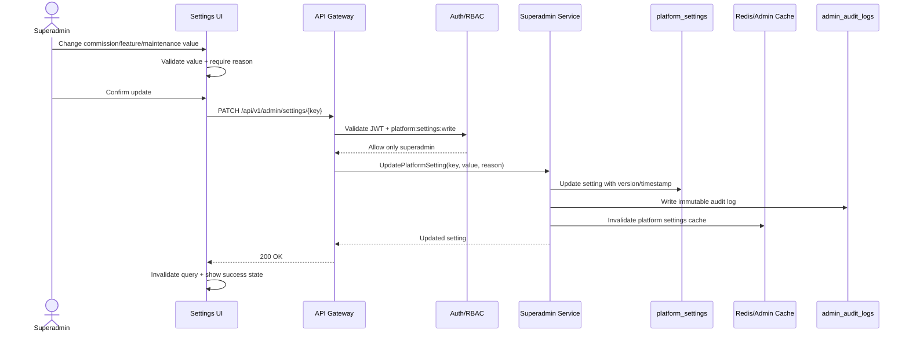
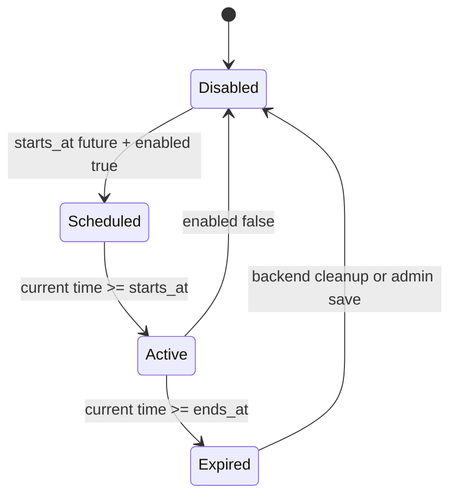

# 🛠️ Superadmin Panel - Task 7: Platform Settings


## 📌 Task Summary

| Field | Detail |
|---|---|
| Task Name | Platform settings |
| Source | `docs/01-micro-tasks.md` → `Superadmin Panel` → Task 7 |
| Priority | `P2` |
| Dependency | Superadmin APIs |
| Main Goal | Commission, search synonyms, feature flags, aur maintenance mode UI banana |
| Output Type | Structured implementation guide |
| Not Included | Full audit log viewer/export, payment reconciliation rules, seller settings, search reindex UI, zero-result analytics |

> **Simple Hinglish goal:** Is task ka purpose Superadmin Panel ke andar ek **Platform Settings module** banana hai jahan authorized admin platform-level configuration safely view/update kar sake. Isme commission rules, search synonyms, feature flags, aur maintenance mode controls cover honge.

---

## ✅ Final Output Created

```text
TaskImplementation/
└── Superadmin Panel/
    ├── task1.md
    ├── task2.md
    ├── task3.md
    ├── task4.md
    ├── task5.md
    ├── task6.md
    └── task7.md
```

### Why this structure?

- `TaskImplementation/` task-wise implementation guides ka central folder hai.
- `Superadmin Panel/` Superadmin Panel ke saare task guides ko group karta hai.
- `task7.md` sirf **Superadmin Panel - Task 7: Platform Settings** ka guide hai.

> 🟢 **Note:** Is file me Task 7 ka complete step-by-step implementation guide diya gaya hai. Actual frontend/backend source code is task me add nahi kiya gaya, kyunki requested output sirf required folder structure aur `task7.md` content generate karna tha.

---

## 🧭 Implementation Approach

Is guide ko project ke existing documentation ke basis par design kiya gaya:

| Document | Kya use kiya gaya |
|---|---|
| `docs/01-micro-tasks.md` | Task 7 ka exact scope: commission, search synonyms, feature flags, maintenance mode UI |
| `docs/02-system-architecture.md` | Superadmin Panel → API Gateway → Superadmin/Search Service flow |
| `docs/03-folder-structure.md` | `frontend/superadmin-panel/src/features/settings/` target structure |
| `docs/04-microservice-design.md` | Superadmin Service settings APIs and Search Service synonyms APIs |
| `docs/05-database-design.md` | `platform_settings` table and unique `setting_key` index |
| `docs/06-auth-security.md` | `platform:settings:write` permission and admin mutation rate limits |
| `docs/09-cms-superadmin.md` | Superadmin modules, permission model, high-risk controls |
| `docs/10-frontend-implementation.md` | Protected routes, role-based menu, React Query based frontend pattern |
| `docs/12-logging-monitoring-scalability.md` | Platform settings Redis cache TTL and invalidation rule |
| `api/master-api.json` | Existing contracts: `GET /api/v1/admin/settings`, `PATCH /api/v1/admin/settings/{key}` |

---

## 🧱 Task Boundary

### Included in Task 7

- `/admin/settings` route inside existing Superadmin shell
- Platform settings page with clear sections/tabs
- Commission settings UI
- Search synonyms manager UI
- Feature flags UI
- Maintenance mode UI
- Reason-required confirmation before every setting mutation
- Role-based view/write permission checks
- React Query hooks for settings fetch/update
- Search synonyms API helpers
- Cache invalidation after successful mutations
- Loading, empty, error, dirty-form, and permission-denied states
- Code examples and Mermaid diagrams
- Testing checklist for permissions, validation, update flow, and maintenance mode safety

### Not Included in Task 7

- Full audit log viewer/export page, because wo **Task 8** ka scope hai
- Payment reconciliation configuration, because Task 5 me sirf payment operations UI tha
- Seller dashboard settings, because wo CMS/Seller Dashboard scope hai
- Search full reindex UI
- Zero-result analytics dashboard
- Backend implementation of feature flag evaluation engine
- Maker-checker approval backend workflow
- Kubernetes rollout automation for maintenance mode

> 🔴 **Rule:** Task 7 sirf **Platform Settings** cover karega. Audit logs ka write backend mutation ke time hoga, but audit logs table/export UI Task 8 me banega.

---

## 🗂️ Clean Target Folder Structure

Task 1 ne Superadmin shell diya, Task 2 users, Task 3 sellers, Task 4 orders, Task 5 payments, aur Task 6 sessions module document kar chuke hain. Task 7 usi shell ke andar `settings` feature add karega.

```text
frontend/
└── superadmin-panel/
    ├── src/
    │   ├── app/
    │   │   └── router.tsx
    │   ├── components/
    │   │   └── ui/
    │   │       ├── badge.tsx
    │   │       ├── data-state.tsx
    │   │       ├── field-error.tsx
    │   │       ├── reason-confirm-dialog.tsx
    │   │       ├── section-tabs.tsx
    │   │       └── toggle.tsx
    │   ├── features/
    │   │   └── settings/
    │   │       ├── api/
    │   │       │   ├── search-synonyms-api.ts
    │   │       │   └── settings-api.ts
    │   │       ├── components/
    │   │       │   ├── commission-settings-card.tsx
    │   │       │   ├── feature-flag-list.tsx
    │   │       │   ├── maintenance-mode-panel.tsx
    │   │       │   ├── search-synonym-form.tsx
    │   │       │   ├── search-synonym-table.tsx
    │   │       │   ├── setting-change-summary.tsx
    │   │       │   └── settings-page-header.tsx
    │   │       ├── hooks/
    │   │       │   ├── use-platform-settings.ts
    │   │       │   ├── use-search-synonyms.ts
    │   │       │   └── use-update-platform-setting.ts
    │   │       ├── pages/
    │   │       │   └── platform-settings-page.tsx
    │   │       ├── permissions.ts
    │   │       ├── setting-definitions.ts
    │   │       ├── types.ts
    │   │       └── validators.ts
    │   ├── lib/
    │   │   ├── admin-permissions.ts
    │   │   ├── format.ts
    │   │   └── http.ts
    │   └── routes/
    │       └── require-admin.tsx
    └── tests/
        └── settings/
            ├── commission-settings.test.tsx
            ├── feature-flags.test.tsx
            ├── maintenance-mode.test.tsx
            ├── search-synonyms.test.tsx
            ├── settings-api.test.ts
            └── settings-permissions.test.ts
```

### Folder Responsibility

| Path | Responsibility |
|---|---|
| `features/settings/api/` | Superadmin settings and search synonym REST calls |
| `features/settings/hooks/` | React Query hooks for fetch/update/cache invalidation |
| `features/settings/components/` | Commission card, feature flags, maintenance panel, synonym table/form |
| `features/settings/pages/` | Route-level platform settings page |
| `features/settings/permissions.ts` | Settings-specific role/action permissions |
| `features/settings/setting-definitions.ts` | Allowed setting keys, labels, descriptions, default values |
| `features/settings/types.ts` | TypeScript models for settings, feature flags, synonyms |
| `features/settings/validators.ts` | Client-side validation helpers |
| `components/ui/reason-confirm-dialog.tsx` | Shared reason modal for high-risk admin mutations |
| `tests/settings/` | Unit and component tests for Task 7 |

---

## 🔌 External Libraries and Tools

Task 7 me existing frontend stack ko reuse karna hai. Naya heavy UI framework add karna zaruri nahi hai.

| Tool/Library | What it is | Why used | Install/Use |
|---|---|---|---|
| React | UI library | Settings sections, forms, tables, toggles render karne ke liye | Vite React app me included |
| TypeScript | Static typing | Setting values, API payloads, and feature flags safe banane ke liye | Vite React TS app me included |
| React Router DOM | Client routing | `/admin/settings` route ke liye | `pnpm add react-router-dom` |
| TanStack React Query | Server state library | Settings fetch, mutation, loading/error state, cache invalidation ke liye | `pnpm add @tanstack/react-query` |
| Zustand | Lightweight state store | Admin auth/session state Task 1 se reuse karne ke liye | `pnpm add zustand` |
| lucide-react | Icon library | Settings, toggle, warning, search, shield icons ke liye | `pnpm add lucide-react` |
| clsx | Conditional class helper | Dirty state, warning badges, disabled states ke classes clean rakhne ke liye | `pnpm add clsx` |
| Zod | Schema validation | Commission rate, maintenance window, feature flag payload validate karne ke liye | `pnpm add zod` |
| Vitest | Test runner | Permission helpers, validators, API helpers test karne ke liye | `pnpm add -D vitest` |
| Testing Library | React component testing | Forms, toggles, confirmation dialog, and table flows test karne ke liye | `pnpm add -D @testing-library/react @testing-library/user-event @testing-library/jest-dom` |
| MSW | API mocking | Settings and synonym endpoints mock karne ke liye | `pnpm add -D msw` |

### Install Commands

```bash
# from frontend/superadmin-panel
pnpm add react-router-dom @tanstack/react-query zustand lucide-react clsx zod
pnpm add -D vitest @testing-library/react @testing-library/user-event @testing-library/jest-dom msw
```

### Basic Usage Commands

```bash
# install dependencies
pnpm install

# run development server
pnpm dev

# run tests
pnpm vitest run

# type-check
pnpm typecheck
```

---

## 🏗️ Architecture Diagram

```mermaid
flowchart LR
    Admin[Superadmin Browser] --> Shell[Admin Shell]
    Shell --> SettingsPage[/admin/settings]

    SettingsPage --> SettingsHooks[React Query Hooks]
    SettingsHooks --> Gateway[API Gateway]

    Gateway --> Auth[Auth + RBAC]
    Auth --> SuperadminService[Superadmin Service]
    Auth --> SearchService[Search Service]

    SuperadminService --> SettingsDB[(MySQL platform_settings)]
    SuperadminService --> AuditDB[(admin_audit_logs)]
    SuperadminService --> Redis[(Redis settings cache)]

    SearchService --> Typesense[(Typesense synonyms)]
    SearchService --> SearchConfig[(Search config store optional)]
    SearchService --> AuditDB

    Redis --> GatewayCache[Gateway/Admin Cache]
```

**Explanation:**  
Admin `/admin/settings` open karta hai. UI React Query ke through API Gateway ko call karta hai. Gateway JWT/RBAC validate karta hai. Platform-level settings Superadmin Service se aati hain. Search synonyms Search Service se manage ho sakte hain, kyunki synonyms search index behavior ko directly affect karte hain. Har mutation ke saath reason mandatory hoga and backend audit log create karega.

---

## 🔄 Settings Update Flow



**Explanation:**  
Update button direct API call nahi karega. Pehle value validate hogi, fir admin reason dega, fir mutation chalegi. Backend audit log same transaction me write karega where possible. Cache invalidation zaruri hai because docs me platform settings cache TTL 5 minutes hai.

---

## 🧩 Settings Sections

| Section | Purpose | API Owner | Write Role |
|---|---|---|---|
| Commission | Marketplace commission percentage/rules control karna | Superadmin Service | `superadmin` |
| Search Synonyms | Search terms ko equivalent words se map karna | Search Service / Admin Search API | `superadmin`, `catalog_admin` |
| Feature Flags | Features ko controlled rollout ke liye enable/disable karna | Superadmin Service | `superadmin` |
| Maintenance Mode | Platform maintenance banner/access behavior control karna | Superadmin Service | `superadmin` |

> 🟡 **Permission note:** `platform:settings:write` docs ke according only `superadmin` ke paas hai. Search synonyms catalog domain ka part bhi hain, isliye same synonym manager component `catalog_admin` ke liye `/admin/search` ya search section me reuse ho sakta hai. Commission, feature flags, and maintenance mode ko `catalog_admin` update nahi karega.

---

## 🔐 Role and Permission Rules

| Role | View Settings | Update Commission | Manage Synonyms | Update Feature Flags | Update Maintenance Mode |
|---|---:|---:|---:|---:|---:|
| `superadmin` | ✅ | ✅ | ✅ | ✅ | ✅ |
| `catalog_admin` | Limited search view | ❌ | ✅ | ❌ | ❌ |
| `readonly_admin` | Read-only if route allowed | ❌ | ❌ | ❌ | ❌ |
| `operations_admin` | ❌ | ❌ | ❌ | ❌ | ❌ |
| `finance_admin` | ❌ | ❌ | ❌ | ❌ | ❌ |

### Permission Rules

- `superadmin` full Task 7 access rakhta hai.
- `catalog_admin` sirf search synonyms manage kar sakta hai, wo bhi search/catalog route ke through.
- `readonly_admin` ko write controls disabled/hidden rahenge.
- `operations_admin` users/sellers/orders/sessions ke liye hai, platform settings ke liye nahi.
- `finance_admin` payments/refunds ke liye hai, settings ke liye nahi.
- Every mutation reason ke saath backend audit log me store honi chahiye.

---

## 📡 API Contracts

### Existing Platform Settings APIs

| Purpose | Method | Endpoint | Service | Auth |
|---|---|---|---|---|
| List platform settings | `GET` | `/api/v1/admin/settings` | `superadmin-service` | `admin` |
| Update one setting | `PATCH` | `/api/v1/admin/settings/{key}` | `superadmin-service` | `superadmin` |

### Existing/Expected Search Synonym APIs

| Purpose | Method | Endpoint | Service | Auth |
|---|---|---|---|---|
| Create synonym | `POST` | `/api/v1/admin/search/synonyms` | `search-service` | `admin` |
| List synonyms | `GET` | `/api/v1/admin/search/synonyms` | `search-service` | `admin` |
| Update synonym | `PATCH` | `/api/v1/admin/search/synonyms/{synonym_id}` | `search-service` | `admin` |
| Delete synonym | `DELETE` | `/api/v1/admin/search/synonyms/{synonym_id}` | `search-service` | `admin` |

> 🟡 **Contract note:** `docs/04-microservice-design.md` explicitly mentions `POST /api/v1/admin/search/synonyms`, and `api/master-api.json` has `SearchSynonymInput`, `SearchSynonym`, and `SearchSynonymListResponse` schemas. Agar list/update/delete routes current API contract me absent hain, to Task 7 implementation time Gateway/Search API contract align karna hoga.

### Platform Setting Response Example

```json
{
  "settings": [
    {
      "key": "commission.default_rate",
      "value": {
        "rate_percent": 12,
        "applies_to": "all_sellers"
      },
      "updated_at": "2026-06-02T10:30:00Z"
    },
    {
      "key": "platform.maintenance_mode",
      "value": {
        "enabled": false,
        "message": "",
        "starts_at": null,
        "ends_at": null,
        "allow_admin_bypass": true
      },
      "updated_at": "2026-06-02T10:30:00Z"
    }
  ]
}
```

### Update Setting Request Example

```json
{
  "value": {
    "enabled": true,
    "message": "Scheduled maintenance from 1 AM to 2 AM UTC",
    "starts_at": "2026-06-03T01:00:00Z",
    "ends_at": "2026-06-03T02:00:00Z",
    "allow_admin_bypass": true
  },
  "reason": "Planned database maintenance window"
}
```

---

## 🧾 Recommended Setting Keys

| Key | Value Shape | Example |
|---|---|---|
| `commission.default_rate` | `{ rate_percent, applies_to }` | `{ "rate_percent": 12, "applies_to": "all_sellers" }` |
| `commission.category_overrides` | `{ overrides: [] }` | `{ "overrides": [{ "category_id": "cat_1", "rate_percent": 8 }] }` |
| `platform.feature_flags` | `{ flags: {} }` | `{ "flags": { "new_checkout": true, "seller_live_chat": false } }` |
| `platform.maintenance_mode` | `{ enabled, message, starts_at, ends_at, allow_admin_bypass }` | `{ "enabled": false, "message": "", "allow_admin_bypass": true }` |

### Validation Rules

| Setting | Rule |
|---|---|
| Commission rate | `0` se `50` percent ke beech rakho |
| Category override | Duplicate `category_id` avoid karo |
| Feature flag key | Lowercase snake_case use karo |
| Maintenance message | Required when maintenance enabled |
| Maintenance window | `ends_at` should be after `starts_at` |
| Reason | Mutation ke liye required, minimum 10 characters |

---

## 🧪 Maintenance Mode State Diagram



**Explanation:**  
Maintenance mode ko sirf boolean toggle ki tarah mat treat karo. Agar `starts_at` future me hai to UI "Scheduled" status dikhayega. Agar current time window ke andar hai to "Active" dikhayega. `ends_at` pass ho jaye to warning dikhani chahiye ki setting stale hai.

---

## 🪜 Step-by-Step Implementation Guide

## Step 1: Route Add Karo

Superadmin shell ke router me `/admin/settings` route add/update karo.

```tsx
// frontend/superadmin-panel/src/app/router.tsx
import { RequireAdmin } from "../routes/require-admin";
import { PlatformSettingsPage } from "../features/settings/pages/platform-settings-page";

export const adminRoutes = [
  {
    path: "/admin/settings",
    element: (
      <RequireAdmin allowedRoles={["superadmin"]}>
        <PlatformSettingsPage />
      </RequireAdmin>
    ),
  },
];
```

**Explanation:**  
`/admin/settings` route high-risk hai, isliye direct `superadmin` guard rakha gaya. Search synonyms agar catalog admin ko bhi dene hain, to same synonym components `/admin/search` route me reuse ho sakte hain.

---

## Step 2: Menu Item Confirm Karo

Task 1 ke admin menu me Settings item already expected hai:

```ts
// frontend/superadmin-panel/src/layout/admin-menu.ts
export const adminMenu = [
  {
    id: "settings",
    label: "Settings",
    path: "/admin/settings",
    roles: ["superadmin"],
  },
];
```

**Explanation:**  
Menu role-based filter karta hai. Isse non-superadmin roles ko high-risk Settings menu visible nahi hoga.

---

## Step 3: Types Define Karo

```ts
// frontend/superadmin-panel/src/features/settings/types.ts
export type SettingKey =
  | "commission.default_rate"
  | "commission.category_overrides"
  | "platform.feature_flags"
  | "platform.maintenance_mode";

export type PlatformSetting<TValue = unknown> = {
  key: SettingKey;
  value: TValue;
  updated_at: string;
};

export type CommissionDefaultRate = {
  rate_percent: number;
  applies_to: "all_sellers";
};

export type CommissionCategoryOverride = {
  category_id: string;
  rate_percent: number;
};

export type FeatureFlagsValue = {
  flags: Record<string, boolean>;
};

export type MaintenanceModeValue = {
  enabled: boolean;
  message: string;
  starts_at: string | null;
  ends_at: string | null;
  allow_admin_bypass: boolean;
};

export type PlatformSettingInput<TValue> = {
  value: TValue;
  reason: string;
};

export type SearchSynonym = {
  synonym_id: string;
  root: string;
  synonyms: string[];
};

export type SearchSynonymInput = {
  root: string;
  synonyms: string[];
};
```

**Explanation:**  
Types explicit rakhne se UI me wrong setting key ya wrong payload accidentally pass nahi hota. `PlatformSettingInput` me `reason` mandatory hai because admin mutation audit ke liye reason zaruri hai.

---

## Step 4: Setting Definitions Banao

```ts
// frontend/superadmin-panel/src/features/settings/setting-definitions.ts
import type { SettingKey } from "./types";

export const settingDefinitions: Record<SettingKey, { label: string; description: string }> = {
  "commission.default_rate": {
    label: "Default commission",
    description: "Platform-wide seller commission percentage.",
  },
  "commission.category_overrides": {
    label: "Category commission overrides",
    description: "Specific categories ke liye custom commission rates.",
  },
  "platform.feature_flags": {
    label: "Feature flags",
    description: "Controlled rollout ke liye features enable/disable karo.",
  },
  "platform.maintenance_mode": {
    label: "Maintenance mode",
    description: "Temporary platform maintenance banner/access control.",
  },
};
```

**Explanation:**  
Definitions central rakhne se labels and descriptions duplicate nahi hote. Agar future me setting add hoti hai, ek jagah entry add karni hogi.

---

## Step 5: Validators Add Karo

```ts
// frontend/superadmin-panel/src/features/settings/validators.ts
import { z } from "zod";

export const reasonSchema = z.string().trim().min(10, "Reason minimum 10 characters hona chahiye.");

export const commissionRateSchema = z.object({
  rate_percent: z.number().min(0).max(50),
  applies_to: z.literal("all_sellers"),
});

export const featureFlagsSchema = z.object({
  flags: z.record(z.string().regex(/^[a-z][a-z0-9_]*$/), z.boolean()),
});

export const maintenanceModeSchema = z
  .object({
    enabled: z.boolean(),
    message: z.string(),
    starts_at: z.string().nullable(),
    ends_at: z.string().nullable(),
    allow_admin_bypass: z.boolean(),
  })
  .superRefine((value, ctx) => {
    if (value.enabled && value.message.trim().length < 10) {
      ctx.addIssue({
        code: z.ZodIssueCode.custom,
        path: ["message"],
        message: "Maintenance enabled hai to clear message required hai.",
      });
    }

    if (value.starts_at && value.ends_at && new Date(value.ends_at) <= new Date(value.starts_at)) {
      ctx.addIssue({
        code: z.ZodIssueCode.custom,
        path: ["ends_at"],
        message: "End time start time ke baad hona chahiye.",
      });
    }
  });
```

**Explanation:**  
Client-side validation UX ke liye hai. Final validation Gateway/Service layer me bhi honi chahiye. Zod se form payload readable and testable ban jata hai.

---

## Step 6: Platform Settings API Helper

```ts
// frontend/superadmin-panel/src/features/settings/api/settings-api.ts
import { http } from "../../../lib/http";
import type { PlatformSetting, PlatformSettingInput, SettingKey } from "../types";

export type PlatformSettingsResponse = {
  settings: PlatformSetting[];
};

export function listPlatformSettings() {
  return http.get<PlatformSettingsResponse>("/api/v1/admin/settings");
}

export function updatePlatformSetting<TValue>(
  key: SettingKey,
  input: PlatformSettingInput<TValue>,
) {
  return http.patch<PlatformSetting<TValue>>(
    `/api/v1/admin/settings/${encodeURIComponent(key)}`,
    input,
  );
}
```

**Explanation:**  
API helper sirf HTTP detail handle karta hai. Components direct `fetch` nahi call karenge. Key ko `encodeURIComponent` karna zaruri hai because setting keys me dot `.` hota hai.

---

## Step 7: Search Synonyms API Helper

```ts
// frontend/superadmin-panel/src/features/settings/api/search-synonyms-api.ts
import { http } from "../../../lib/http";
import type { SearchSynonym, SearchSynonymInput } from "../types";

export type SearchSynonymListResponse = {
  synonyms: SearchSynonym[];
};

export function listSearchSynonyms() {
  return http.get<SearchSynonymListResponse>("/api/v1/admin/search/synonyms");
}

export function createSearchSynonym(input: SearchSynonymInput) {
  return http.post<SearchSynonym>("/api/v1/admin/search/synonyms", input);
}

export function updateSearchSynonym(synonymId: string, input: SearchSynonymInput) {
  return http.patch<SearchSynonym>(
    `/api/v1/admin/search/synonyms/${synonymId}`,
    input,
  );
}

export function deleteSearchSynonym(synonymId: string) {
  return http.delete<{ success: boolean }>(`/api/v1/admin/search/synonyms/${synonymId}`);
}
```

**Explanation:**  
Synonyms search behavior ko affect karte hain, isliye Search Service/Gateway route use hota hai. Agar backend me update/delete route abhi ready nahi hai, UI initially create/list mode me ship ho sakta hai and disabled edit/delete controls show kar sakta hai.

---

## Step 8: React Query Hooks

```ts
// frontend/superadmin-panel/src/features/settings/hooks/use-platform-settings.ts
import { useQuery } from "@tanstack/react-query";
import { listPlatformSettings } from "../api/settings-api";

export function usePlatformSettings() {
  return useQuery({
    queryKey: ["admin", "settings"],
    queryFn: listPlatformSettings,
    staleTime: 60_000,
  });
}
```

```ts
// frontend/superadmin-panel/src/features/settings/hooks/use-update-platform-setting.ts
import { useMutation, useQueryClient } from "@tanstack/react-query";
import { updatePlatformSetting } from "../api/settings-api";
import type { PlatformSettingInput, SettingKey } from "../types";

type MutationInput<TValue> = {
  key: SettingKey;
  input: PlatformSettingInput<TValue>;
};

export function useUpdatePlatformSetting<TValue>() {
  const queryClient = useQueryClient();

  return useMutation({
    mutationFn: ({ key, input }: MutationInput<TValue>) => updatePlatformSetting(key, input),
    onSuccess: () => {
      queryClient.invalidateQueries({ queryKey: ["admin", "settings"] });
    },
  });
}
```

```ts
// frontend/superadmin-panel/src/features/settings/hooks/use-search-synonyms.ts
import { useMutation, useQuery, useQueryClient } from "@tanstack/react-query";
import { createSearchSynonym, listSearchSynonyms } from "../api/search-synonyms-api";

export function useSearchSynonyms() {
  return useQuery({
    queryKey: ["admin", "search", "synonyms"],
    queryFn: listSearchSynonyms,
    staleTime: 60_000,
  });
}

export function useCreateSearchSynonym() {
  const queryClient = useQueryClient();

  return useMutation({
    mutationFn: createSearchSynonym,
    onSuccess: () => {
      queryClient.invalidateQueries({ queryKey: ["admin", "search", "synonyms"] });
    },
  });
}
```

**Explanation:**  
React Query server state ko predictable banata hai. Successful update ke baad related query invalidate hogi, so page fresh data fetch karega.

---

## Step 9: Permission Helper

```ts
// frontend/superadmin-panel/src/features/settings/permissions.ts
type AdminRole =
  | "superadmin"
  | "operations_admin"
  | "finance_admin"
  | "catalog_admin"
  | "readonly_admin";

export function canViewPlatformSettings(roles: AdminRole[]) {
  return roles.includes("superadmin") || roles.includes("readonly_admin");
}

export function canWritePlatformSettings(roles: AdminRole[]) {
  return roles.includes("superadmin");
}

export function canManageSearchSynonyms(roles: AdminRole[]) {
  return roles.includes("superadmin") || roles.includes("catalog_admin");
}
```

**Explanation:**  
Frontend permission helper UX guard hai. Final permission backend/Gateway enforce karega. `readonly_admin` ko write action kabhi enable nahi karna.

---

## Step 10: Page Layout Banao

```tsx
// frontend/superadmin-panel/src/features/settings/pages/platform-settings-page.tsx
import { useMemo, useState } from "react";
import { DataState } from "../../../components/ui/data-state";
import { usePlatformSettings } from "../hooks/use-platform-settings";
import { CommissionSettingsCard } from "../components/commission-settings-card";
import { FeatureFlagList } from "../components/feature-flag-list";
import { MaintenanceModePanel } from "../components/maintenance-mode-panel";
import { SearchSynonymTable } from "../components/search-synonym-table";

type SettingsTab = "commission" | "synonyms" | "flags" | "maintenance";

export function PlatformSettingsPage() {
  const [activeTab, setActiveTab] = useState<SettingsTab>("commission");
  const settingsQuery = usePlatformSettings();

  const settingsByKey = useMemo(() => {
    return new Map(settingsQuery.data?.settings.map((setting) => [setting.key, setting]));
  }, [settingsQuery.data?.settings]);

  if (settingsQuery.isLoading) {
    return <DataState state="loading" title="Loading platform settings" />;
  }

  if (settingsQuery.isError) {
    return <DataState state="error" title="Settings load nahi ho payi" />;
  }

  return (
    <section className="space-y-4">
      <header>
        <p className="text-sm text-slate-500">Superadmin Panel</p>
        <h1 className="text-2xl font-semibold text-slate-950">Platform Settings</h1>
      </header>

      <div className="flex gap-2 border-b border-slate-200">
        {["commission", "synonyms", "flags", "maintenance"].map((tab) => (
          <button
            key={tab}
            className={activeTab === tab ? "border-b-2 border-blue-600 text-blue-700" : ""}
            onClick={() => setActiveTab(tab as SettingsTab)}
          >
            {tab}
          </button>
        ))}
      </div>

      {activeTab === "commission" && (
        <CommissionSettingsCard setting={settingsByKey.get("commission.default_rate")} />
      )}
      {activeTab === "synonyms" && <SearchSynonymTable />}
      {activeTab === "flags" && (
        <FeatureFlagList setting={settingsByKey.get("platform.feature_flags")} />
      )}
      {activeTab === "maintenance" && (
        <MaintenanceModePanel setting={settingsByKey.get("platform.maintenance_mode")} />
      )}
    </section>
  );
}
```

**Explanation:**  
Page ek route-level container hai. Data fetch yahin hota hai, phir setting key ke basis par cards ko data diya jata hai. Tabs simple rakhe gaye hain because ye operational admin UI hai.

---

## Step 11: Commission Settings Card

```tsx
// frontend/superadmin-panel/src/features/settings/components/commission-settings-card.tsx
import { useState } from "react";
import { useUpdatePlatformSetting } from "../hooks/use-update-platform-setting";
import type { CommissionDefaultRate, PlatformSetting } from "../types";

type Props = {
  setting?: PlatformSetting;
};

export function CommissionSettingsCard({ setting }: Props) {
  const current = setting?.value as CommissionDefaultRate | undefined;
  const [rate, setRate] = useState(current?.rate_percent ?? 0);
  const [reason, setReason] = useState("");
  const updateSetting = useUpdatePlatformSetting<CommissionDefaultRate>();

  function save() {
    updateSetting.mutate({
      key: "commission.default_rate",
      input: {
        value: {
          rate_percent: rate,
          applies_to: "all_sellers",
        },
        reason,
      },
    });
  }

  return (
    <section className="space-y-4 rounded-md border border-slate-200 p-4">
      <div>
        <h2 className="text-lg font-semibold">Default Commission</h2>
        <p className="text-sm text-slate-500">Platform-wide seller commission rate.</p>
      </div>

      <label className="block text-sm font-medium">
        Rate percent
        <input
          className="mt-1 w-40 rounded border border-slate-300 px-3 py-2"
          type="number"
          min={0}
          max={50}
          value={rate}
          onChange={(event) => setRate(Number(event.target.value))}
        />
      </label>

      <label className="block text-sm font-medium">
        Change reason
        <textarea
          className="mt-1 w-full rounded border border-slate-300 px-3 py-2"
          value={reason}
          onChange={(event) => setReason(event.target.value)}
        />
      </label>

      <button disabled={updateSetting.isPending || reason.trim().length < 10} onClick={save}>
        Save commission
      </button>
    </section>
  );
}
```

**Explanation:**  
Commission change financial impact rakhta hai. Isliye reason field mandatory hai, range validation chahiye, and backend audit log compulsory hai.

---

## Step 12: Search Synonyms Manager

```tsx
// frontend/superadmin-panel/src/features/settings/components/search-synonym-form.tsx
import { useState } from "react";
import { useCreateSearchSynonym } from "../hooks/use-search-synonyms";

export function SearchSynonymForm() {
  const [root, setRoot] = useState("");
  const [synonymsText, setSynonymsText] = useState("");
  const createSynonym = useCreateSearchSynonym();

  function submit() {
    createSynonym.mutate({
      root: root.trim().toLowerCase(),
      synonyms: synonymsText
        .split(",")
        .map((item) => item.trim().toLowerCase())
        .filter(Boolean),
    });
  }

  return (
    <div className="grid gap-3 rounded-md border border-slate-200 p-4 md:grid-cols-[1fr_2fr_auto]">
      <input
        placeholder="Root word e.g. mobile"
        value={root}
        onChange={(event) => setRoot(event.target.value)}
      />
      <input
        placeholder="Synonyms comma separated: phone, smartphone"
        value={synonymsText}
        onChange={(event) => setSynonymsText(event.target.value)}
      />
      <button disabled={!root.trim() || createSynonym.isPending} onClick={submit}>
        Add
      </button>
    </div>
  );
}
```

```tsx
// frontend/superadmin-panel/src/features/settings/components/search-synonym-table.tsx
import { DataState } from "../../../components/ui/data-state";
import { useSearchSynonyms } from "../hooks/use-search-synonyms";
import { SearchSynonymForm } from "./search-synonym-form";

export function SearchSynonymTable() {
  const synonymsQuery = useSearchSynonyms();

  if (synonymsQuery.isLoading) {
    return <DataState state="loading" title="Loading search synonyms" />;
  }

  if (synonymsQuery.isError) {
    return <DataState state="error" title="Synonyms load nahi ho paye" />;
  }

  return (
    <section className="space-y-4">
      <SearchSynonymForm />
      <table className="w-full text-sm">
        <thead>
          <tr>
            <th>Root</th>
            <th>Synonyms</th>
          </tr>
        </thead>
        <tbody>
          {synonymsQuery.data?.synonyms.map((item) => (
            <tr key={item.synonym_id}>
              <td>{item.root}</td>
              <td>{item.synonyms.join(", ")}</td>
            </tr>
          ))}
        </tbody>
      </table>
    </section>
  );
}
```

**Explanation:**  
Synonym manager search quality improve karta hai. Example: user "mobile" search kare to "phone" and "smartphone" products bhi match ho sakte hain. Input normalize lowercase me hota hai so duplicates kam hote hain.

---

## Step 13: Feature Flags Panel

```tsx
// frontend/superadmin-panel/src/features/settings/components/feature-flag-list.tsx
import { useState } from "react";
import { useUpdatePlatformSetting } from "../hooks/use-update-platform-setting";
import type { FeatureFlagsValue, PlatformSetting } from "../types";

type Props = {
  setting?: PlatformSetting;
};

export function FeatureFlagList({ setting }: Props) {
  const current = (setting?.value as FeatureFlagsValue | undefined)?.flags ?? {};
  const [flags, setFlags] = useState<Record<string, boolean>>(current);
  const [reason, setReason] = useState("");
  const updateSetting = useUpdatePlatformSetting<FeatureFlagsValue>();

  function toggleFlag(flagKey: string) {
    setFlags((previous) => ({
      ...previous,
      [flagKey]: !previous[flagKey],
    }));
  }

  function save() {
    updateSetting.mutate({
      key: "platform.feature_flags",
      input: {
        value: { flags },
        reason,
      },
    });
  }

  return (
    <section className="space-y-4 rounded-md border border-slate-200 p-4">
      <div>
        <h2 className="text-lg font-semibold">Feature Flags</h2>
        <p className="text-sm text-slate-500">Controlled rollout ke liye features enable/disable karo.</p>
      </div>

      {Object.entries(flags).map(([flagKey, enabled]) => (
        <label key={flagKey} className="flex items-center justify-between border-b py-2">
          <span>{flagKey}</span>
          <input type="checkbox" checked={enabled} onChange={() => toggleFlag(flagKey)} />
        </label>
      ))}

      <textarea
        placeholder="Reason for feature flag change"
        value={reason}
        onChange={(event) => setReason(event.target.value)}
      />

      <button disabled={reason.trim().length < 10 || updateSetting.isPending} onClick={save}>
        Save feature flags
      </button>
    </section>
  );
}
```

**Explanation:**  
Feature flags production risk reduce karte hain. Admin kisi feature ko gradually enable/disable kar sakta hai without frontend redeploy. Lekin final flag evaluation backend/frontend config layer me hoti hai; ye task sirf admin UI and settings update flow cover karta hai.

---

## Step 14: Maintenance Mode Panel

```tsx
// frontend/superadmin-panel/src/features/settings/components/maintenance-mode-panel.tsx
import { useState } from "react";
import { useUpdatePlatformSetting } from "../hooks/use-update-platform-setting";
import type { MaintenanceModeValue, PlatformSetting } from "../types";

type Props = {
  setting?: PlatformSetting;
};

export function MaintenanceModePanel({ setting }: Props) {
  const current = setting?.value as MaintenanceModeValue | undefined;
  const [value, setValue] = useState<MaintenanceModeValue>(
    current ?? {
      enabled: false,
      message: "",
      starts_at: null,
      ends_at: null,
      allow_admin_bypass: true,
    },
  );
  const [reason, setReason] = useState("");
  const updateSetting = useUpdatePlatformSetting<MaintenanceModeValue>();

  function save() {
    updateSetting.mutate({
      key: "platform.maintenance_mode",
      input: { value, reason },
    });
  }

  return (
    <section className="space-y-4 rounded-md border border-amber-200 bg-amber-50 p-4">
      <div>
        <h2 className="text-lg font-semibold">Maintenance Mode</h2>
        <p className="text-sm text-amber-700">
          Is setting se buyer/seller experience directly impact ho sakta hai.
        </p>
      </div>

      <label className="flex items-center gap-2">
        <input
          type="checkbox"
          checked={value.enabled}
          onChange={(event) => setValue({ ...value, enabled: event.target.checked })}
        />
        Enable maintenance mode
      </label>

      <textarea
        placeholder="Maintenance message"
        value={value.message}
        onChange={(event) => setValue({ ...value, message: event.target.value })}
      />

      <div className="grid gap-3 md:grid-cols-2">
        <input
          type="datetime-local"
          onChange={(event) => setValue({ ...value, starts_at: event.target.value || null })}
        />
        <input
          type="datetime-local"
          onChange={(event) => setValue({ ...value, ends_at: event.target.value || null })}
        />
      </div>

      <label className="flex items-center gap-2">
        <input
          type="checkbox"
          checked={value.allow_admin_bypass}
          onChange={(event) =>
            setValue({ ...value, allow_admin_bypass: event.target.checked })
          }
        />
        Allow admin bypass
      </label>

      <textarea
        placeholder="Reason for maintenance change"
        value={reason}
        onChange={(event) => setReason(event.target.value)}
      />

      <button disabled={reason.trim().length < 10 || updateSetting.isPending} onClick={save}>
        Save maintenance mode
      </button>
    </section>
  );
}
```

**Explanation:**  
Maintenance mode high-risk control hai. Isliye panel visually warning style me rakha gaya, reason mandatory hai, and admin bypass option clear dikhaya gaya. Buyer/seller traffic impact hone se pehle admin ko summary confirm karni chahiye.

---

## Step 15: Reason Confirmation Dialog

```tsx
// frontend/superadmin-panel/src/components/ui/reason-confirm-dialog.tsx
type Props = {
  title: string;
  summary: string;
  reason: string;
  onReasonChange: (reason: string) => void;
  onConfirm: () => void;
  onCancel: () => void;
  pending?: boolean;
};

export function ReasonConfirmDialog({
  title,
  summary,
  reason,
  onReasonChange,
  onConfirm,
  onCancel,
  pending,
}: Props) {
  return (
    <div role="dialog" aria-modal="true" className="rounded-md border border-slate-200 bg-white p-4">
      <h2 className="text-lg font-semibold">{title}</h2>
      <p className="mt-2 text-sm text-slate-600">{summary}</p>

      <label className="mt-4 block text-sm font-medium">
        Reason
        <textarea
          className="mt-1 w-full rounded border border-slate-300 px-3 py-2"
          value={reason}
          onChange={(event) => onReasonChange(event.target.value)}
        />
      </label>

      <div className="mt-4 flex justify-end gap-2">
        <button onClick={onCancel}>Cancel</button>
        <button disabled={pending || reason.trim().length < 10} onClick={onConfirm}>
          Confirm update
        </button>
      </div>
    </div>
  );
}
```

**Explanation:**  
Har risky setting update pe admin ko "kya change ho raha hai" and "kyun change ho raha hai" dono confirm karna chahiye. Ye support, security, and compliance ke liye important hai.

---

## Step 16: Loading, Empty, Error States

| State | UI Behavior |
|---|---|
| Loading | Skeleton/card placeholders dikhaye |
| Empty settings | "No settings configured" plus seed/default hint |
| API error | Retry button with readable error |
| Permission denied | Admin shell ka shared permission-denied state |
| Dirty form | Save enabled, reset/cancel visible |
| Mutation pending | Save button disabled and spinner visible |
| Mutation success | Query invalidate + success toast |
| Mutation failure | Error message, form data preserve |

**Explanation:**  
Settings UI me accidental loss avoid karna important hai. Agar mutation fail ho jaye to form values reset nahi hone chahiye.

---

## Step 17: Cache Invalidation Rules

Docs ke according platform settings Redis me cache ho sakte hain with approx 5 min TTL. Isliye mutation ke baad:

```text
1. Superadmin Service DB update kare.
2. Audit log write kare.
3. Redis/admin cache invalidate kare.
4. Gateway ko latest config fetch karne de.
5. Frontend React Query cache invalidate kare.
```

> 🟢 **Best practice:** Settings update response me updated setting return karo. UI optimistic update kar sakta hai, but high-risk settings ke liye server-confirmed update safer hai.

---

## 🧪 Testing Plan

### Unit Tests

| Test | Expected |
|---|---|
| `canWritePlatformSettings(["superadmin"])` | `true` |
| `canWritePlatformSettings(["catalog_admin"])` | `false` |
| `canManageSearchSynonyms(["catalog_admin"])` | `true` |
| Commission rate `-1` | validation fail |
| Commission rate `51` | validation fail |
| Maintenance enabled with empty message | validation fail |
| Maintenance end before start | validation fail |
| Reason shorter than 10 chars | validation fail |

### Component Tests

| Scenario | Expected |
|---|---|
| Settings loading | Loading state visible |
| Settings API fail | Error state with retry |
| Commission input changed | Save enabled only with valid reason |
| Feature flag toggled | Dirty state visible |
| Maintenance enabled | Message field required |
| Synonym form submit | API called with normalized lowercase values |
| Non-superadmin opens settings | Permission denied or route blocked |

### API Mock Test Example

```ts
// frontend/superadmin-panel/tests/settings/settings-permissions.test.ts
import { describe, expect, it } from "vitest";
import {
  canManageSearchSynonyms,
  canWritePlatformSettings,
} from "../../src/features/settings/permissions";

describe("settings permissions", () => {
  it("allows only superadmin to write platform settings", () => {
    expect(canWritePlatformSettings(["superadmin"])).toBe(true);
    expect(canWritePlatformSettings(["catalog_admin"])).toBe(false);
    expect(canWritePlatformSettings(["finance_admin"])).toBe(false);
  });

  it("allows catalog admin to manage search synonyms", () => {
    expect(canManageSearchSynonyms(["catalog_admin"])).toBe(true);
    expect(canManageSearchSynonyms(["superadmin"])).toBe(true);
    expect(canManageSearchSynonyms(["operations_admin"])).toBe(false);
  });
});
```

**Explanation:**  
Permission tests future regression catch karte hain. Agar kisi ne accidentally `finance_admin` ko settings write access de diya, test fail ho jayega.

---

## 🧑‍💻 Manual QA Checklist

- ✅ `/admin/settings` route sirf `superadmin` ke liye accessible ho.
- ✅ Non-superadmin users ko Settings menu visible na ho.
- ✅ Settings page initial load par commission, flags, maintenance mode show kare.
- ✅ Commission rate invalid range pe save disabled/error show ho.
- ✅ Every setting update reason ke bina submit na ho.
- ✅ Feature flag toggle save ke baad refreshed value show kare.
- ✅ Maintenance mode enable karte time warning panel visible ho.
- ✅ Maintenance mode enabled ho to message required ho.
- ✅ Search synonym add karne par table refresh ho.
- ✅ Synonyms lowercase/trimmed save hon.
- ✅ API error ke baad entered form values preserve hon.
- ✅ Successful mutation ke baad React Query cache invalidate ho.
- ✅ Backend audit log write responsibility documented ho.
- ✅ Task 8 audit log viewer UI is task me add na ho.

---

## ⚠️ Edge Cases

| Edge Case | Handling |
|---|---|
| Setting key missing from API | UI default fallback show kare and "not configured" badge dikhaye |
| Unknown setting key returned | Ignore or show under "Unsupported settings" read-only section |
| Commission rate decimal | Backend policy ke according allow/round; UI validation consistent rakho |
| Duplicate synonym root | API should reject or update existing; UI error readable ho |
| Maintenance enabled without end time | Allow only if business policy supports indefinite maintenance |
| Admin loses permission mid-session | Mutation 403 handle karo and page permission state refresh karo |
| Cache stale after update | Frontend query invalidate + backend Redis invalidation required |
| Two admins update same setting | Backend `updated_at`/version conflict strategy recommended |

---

## 🔒 Security Notes

- Frontend permission sirf UX guard hai; Gateway and Service-level RBAC mandatory hai.
- `PATCH /api/v1/admin/settings/{key}` ko `superadmin` auth require karna chahiye.
- Admin mutation rate limit docs ke according approx `30 per admin per min` rakho.
- Setting update request me `reason` required hai.
- Before/after summary audit log me store honi chahiye.
- Maintenance mode and feature flag updates ko high-risk action treat karo.
- Secrets ko platform settings UI me expose mat karo.
- Unknown JSON values ko blindly render/edit mat karo.

---

## 🎨 UI Guidelines

- Operational UI compact, scannable, and boring-in-a-good-way rakho.
- Cards sirf real sections ke liye use karo; nested cards avoid karo.
- Maintenance mode panel ko amber/warning styling do.
- Destructive/risky update button copy clear rakho: `Enable maintenance`, `Save commission`, `Update feature flags`.
- Feature flag list me current enabled/disabled status badge visible ho.
- Last updated timestamp dikhana helpful hai.
- Reason dialog me change summary dikhana mandatory hai.
- Mobile layout me tabs wrap/scroll safely hon.

---

## 📦 Backend Alignment Notes

Task 7 primarily frontend Superadmin Panel guide hai, but backend contracts ko align karna zaruri hai:

| Backend Area | Expected Behavior |
|---|---|
| Superadmin Service | `GetPlatformSettings`, `UpdatePlatformSetting` methods |
| MySQL | `platform_settings(setting_key)` unique index |
| Audit Logs | Every setting update writes immutable audit log |
| Redis Cache | Platform settings cache invalidate after update |
| API Gateway | Route-level `superadmin` authorization for settings updates |
| Search Service | Synonym create/list/update/delete and Typesense sync |
| Typesense | Synonyms apply after admin update |

> 🔵 **Important:** UI me change ho gaya ka matlab production behavior updated ho gaya, ye tabhi true hoga jab backend DB/cache/search index sync successful ho. Isliye mutation success backend-confirmed hona chahiye.

---

## ✅ Final Scope Status

Task 7 me Superadmin Panel ke liye **Platform Settings module** document kiya gaya:

- `/admin/settings` route
- Commission settings UI
- Search synonym manager
- Feature flags panel
- Maintenance mode panel
- Reason-required mutation flow
- Role-based permissions
- API contracts and cache invalidation
- Code examples, diagrams, tests, and QA checklist

> ✅ **Final scope status:** Superadmin Panel Task 7 documented completely. Full audit log viewer/export intentionally excluded because wo **Superadmin Panel - Task 8** ka scope hai.
