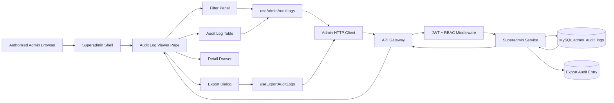
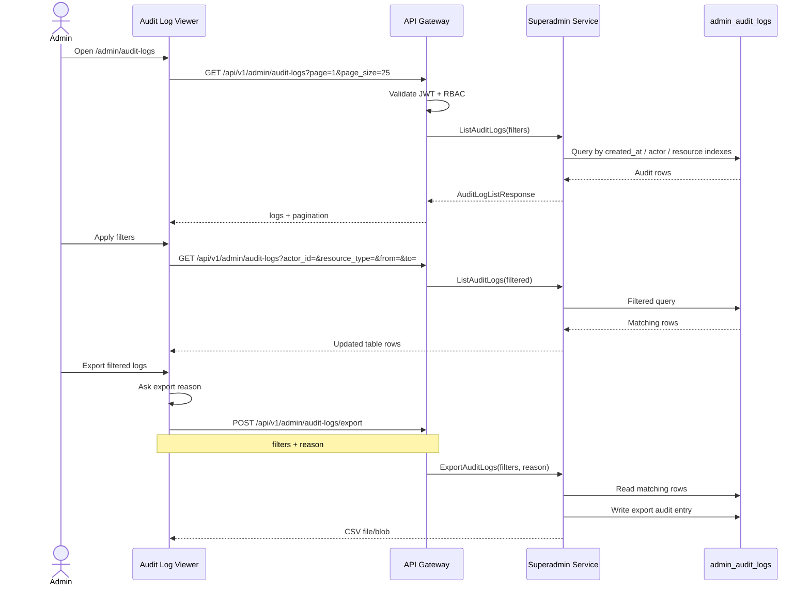

# 🧾 Superadmin Panel - Task 8: Audit Log Viewer


## 📌 Task Summary

| Field | Detail |
|---|---|
| Task Name | Audit log viewer |
| Source | `docs/01-micro-tasks.md` → `Superadmin Panel` → Task 8 |
| Priority | `P0` |
| Dependency | Audit APIs |
| Main Goal | Admin actions ki filterable table banana with secure export |
| Output Type | Structured implementation guide |
| Not Included | Backend audit-log writer, platform settings UI, user/seller/order/payment actions, SIEM integration |

> **Simple Hinglish goal:** Is task ka purpose Superadmin Panel ke andar ek **Audit Log Viewer module** banana hai jahan authorized admin/security reviewer platform ke admin actions ko search/filter kar sake, detail inspect kar sake, aur required filter ke saath export nikal sake. Ye compliance, debugging, fraud investigation, aur security review ke liye important hai.

---

## ✅ Final Output Created

```text
TaskImplementation/
└── Superadmin Panel/
    ├── task1.md
    ├── task2.md
    ├── task3.md
    ├── task4.md
    ├── task5.md
    ├── task6.md
    ├── task7.md
    └── task8.md
```

### Why this structure?

- `TaskImplementation/` project ke task-wise implementation guides ka central folder hai.
- `Superadmin Panel/` Superadmin Panel ke saare task guides ko group karta hai.
- `task8.md` sirf **Superadmin Panel - Task 8: Audit Log Viewer** ka guide hai.

> 🟢 **Note:** Is file me Task 8 ka complete step-by-step implementation guide diya gaya hai. Actual frontend/backend source code add nahi kiya gaya, kyunki user ne output me specifically required folder structure aur `task8.md` content manga hai.

---

## 🧭 Implementation Approach

Ye guide project ke existing docs ko follow karke banaya gaya hai:

| Document | Kya use kiya gaya |
|---|---|
| `docs/01-micro-tasks.md` | Task 8 ka exact scope: audit log filterable table with export |
| `docs/03-folder-structure.md` | Target route: `frontend/superadmin-panel/src/features/audit/pages/admin-audit-log-page.tsx` |
| `docs/04-microservice-design.md` | Superadmin Service responsibility: immutable admin audit logs and `ListAuditLogs` |
| `docs/05-database-design.md` | `admin_audit_logs` table, indexes, archive guidance |
| `docs/06-auth-security.md` | Audit required actions, audit fields, admin data export audit requirement |
| `docs/09-cms-superadmin.md` | Superadmin modules, permission model, audit log fields |
| `docs/10-frontend-implementation.md` | Superadmin panel modules, role-based menu, exportable operational UI |
| `api/master-api.json` | Existing API: `GET /api/v1/admin/audit-logs` → `SuperadminService.ListAuditLogs` |

---

## 🧱 Task Boundary

### Included in Task 8

- `/admin/audit-logs` route inside existing Superadmin shell
- Role-based menu visibility for Audit Logs
- Filterable audit log table
- Filters for actor, action, resource type, resource id, request id, and date range
- Pagination-ready API hook
- Audit log detail drawer
- Before/after summary viewer
- IP hash and request id display
- Export button with confirmation and export reason
- CSV export flow
- Loading, empty, error, permission denied, and export progress states
- React Query cache handling
- Code examples and Mermaid diagrams
- Testing checklist for permissions, filters, table, detail drawer, and export

### Not Included in Task 8

- Writing audit logs for every admin mutation, because backend mutation flows own that responsibility
- Platform settings page, because wo Task 7 ka scope tha
- User, seller, order, payment, session, or settings feature implementation
- Raw IP display
- Password, OTP, full token, card data, or secret rendering
- SIEM/OpenSearch integration
- Object storage archive viewer
- Backend schema migration implementation
- Full backend export endpoint implementation

> 🔴 **Rule:** Task 8 sirf **Audit Log Viewer + Export UI** cover karega. Audit logs generate karna existing/future backend mutation handlers ki responsibility hai.

---

## 🗂️ Clean Target Folder Structure

Task 1 ne Superadmin shell diya. Task 2-7 ne users, sellers, orders, payments, sessions, aur settings modules document kiye. Task 8 usi shell ke andar `audit` feature add karega.

```text
frontend/
└── superadmin-panel/
    ├── src/
    │   ├── app/
    │   │   └── router.tsx
    │   ├── components/
    │   │   └── ui/
    │   │       ├── badge.tsx
    │   │       ├── button.tsx
    │   │       ├── data-state.tsx
    │   │       ├── drawer.tsx
    │   │       ├── field-error.tsx
    │   │       ├── pagination.tsx
    │   │       └── reason-confirm-dialog.tsx
    │   ├── features/
    │   │   └── audit/
    │   │       ├── api/
    │   │       │   └── admin-audit-api.ts
    │   │       ├── components/
    │   │       │   ├── audit-export-dialog.tsx
    │   │       │   ├── audit-filter-panel.tsx
    │   │       │   ├── audit-log-detail-drawer.tsx
    │   │       │   ├── audit-log-table.tsx
    │   │       │   ├── audit-page-header.tsx
    │   │       │   ├── audit-summary-diff.tsx
    │   │       │   └── audit-status-badge.tsx
    │   │       ├── hooks/
    │   │       │   ├── use-admin-audit-logs.ts
    │   │       │   └── use-export-audit-logs.ts
    │   │       ├── pages/
    │   │       │   └── admin-audit-log-page.tsx
    │   │       ├── audit-csv.ts
    │   │       ├── constants.ts
    │   │       ├── permissions.ts
    │   │       ├── types.ts
    │   │       └── validators.ts
    │   ├── lib/
    │   │   ├── admin-permissions.ts
    │   │   ├── format.ts
    │   │   └── http.ts
    │   └── routes/
    │       └── require-admin.tsx
    └── tests/
        └── audit/
            ├── admin-audit-api.test.ts
            ├── audit-csv.test.ts
            ├── audit-export-dialog.test.tsx
            ├── audit-filter-panel.test.tsx
            ├── audit-log-table.test.tsx
            └── audit-permissions.test.ts
```

### Folder Responsibility

| Path | Responsibility |
|---|---|
| `features/audit/api/` | Audit log list/export REST calls |
| `features/audit/hooks/` | React Query hooks for list and export |
| `features/audit/components/` | Filters, table, drawer, export dialog, badges |
| `features/audit/pages/` | Route-level audit log viewer page |
| `features/audit/permissions.ts` | Audit viewer/export permission helpers |
| `features/audit/types.ts` | TypeScript models for logs and filters |
| `features/audit/audit-csv.ts` | CSV generation fallback/helper |
| `features/audit/validators.ts` | Filter and export reason validation |
| `tests/audit/` | Unit/component tests for Task 8 |

---

## 🔌 External Libraries and Tools

Task 8 me existing frontend stack reuse karna best hai. Naya heavy admin-table framework required nahi hai.

| Tool/Library | What it is | Why used | Install/Use |
|---|---|---|---|
| React | UI library | Filter form, table, drawer, export dialog render karne ke liye | Vite React app me included |
| TypeScript | Static typing | Audit log payloads and filters safe banane ke liye | Vite React TS app me included |
| React Router DOM | Client routing | `/admin/audit-logs` route register karne ke liye | `pnpm add react-router-dom` |
| TanStack React Query | Server-state library | Logs fetch, pagination, retry, loading/error state ke liye | `pnpm add @tanstack/react-query` |
| Zustand | Lightweight state store | Admin auth/session state Task 1 se reuse karne ke liye | `pnpm add zustand` |
| lucide-react | Icon library | Filter, download, shield, clock, search icons ke liye | `pnpm add lucide-react` |
| clsx | Conditional class helper | Badge color and disabled classes clean rakhne ke liye | `pnpm add clsx` |
| Zod | Schema validation | Filter values and export reason validate karne ke liye | `pnpm add zod` |
| date-fns | Date formatting utility | `created_at` and date range formatting ke liye | `pnpm add date-fns` |
| PapaParse | CSV helper | Rows ko safely CSV me convert karne ke liye | `pnpm add papaparse` |
| Vitest | Test runner | Permission, CSV, API helpers test karne ke liye | `pnpm add -D vitest` |
| Testing Library | React component testing | Filter panel, table, drawer, export dialog test karne ke liye | `pnpm add -D @testing-library/react @testing-library/user-event @testing-library/jest-dom` |
| MSW | API mocking | Audit API success/error/export mocks ke liye | `pnpm add -D msw` |

### Install Commands

```bash
# from frontend/superadmin-panel
pnpm add react-router-dom @tanstack/react-query zustand lucide-react clsx zod date-fns papaparse
pnpm add -D vitest @testing-library/react @testing-library/user-event @testing-library/jest-dom msw
```

### Basic Usage Commands

```bash
# install dependencies
pnpm install

# run development server
pnpm dev

# run tests
pnpm vitest run

# type-check
pnpm typecheck
```

> 🟡 **Note:** Agar project me `date-fns` ya `papaparse` already nahi use ho raha, implementation time decide kar sakte ho ki native date formatting and custom CSV helper enough hai. Audit export me CSV escaping important hota hai, isliye `papaparse` beginner-friendly option hai.

---

## 🏗️ Architecture Diagram



### Explanation

Admin Superadmin shell me `/admin/audit-logs` open karta hai. Page filters ke basis par React Query hook call karta hai. API Gateway admin token and role validate karta hai. Superadmin Service MySQL `admin_audit_logs` table se immutable audit rows return karta hai. Export ke time backend ko export action bhi audit karna chahiye, kyunki `docs/06-auth-security.md` ke according **Admin data export** audit required hai.

---

## 🔄 Filter and Export Flow



> 🟠 **API alignment note:** `api/master-api.json` currently documents `GET /api/v1/admin/audit-logs` for listing. Full production export should have a backend-supported export route so the export event itself can be audited. If that endpoint is not ready, UI can temporarily export currently loaded rows, but that is not enough for compliance-grade full export.

---

## 🧩 Data Model

Audit fields project docs me already defined hain:

- actor id
- actor role
- action
- resource type
- resource id
- request id
- IP hash
- before/after summary
- reason
- created at

### TypeScript Types

```ts
// frontend/superadmin-panel/src/features/audit/types.ts
export type AdminRole =
  | "superadmin"
  | "operations_admin"
  | "finance_admin"
  | "catalog_admin"
  | "readonly_admin";

export type AuditResourceType =
  | "user"
  | "seller"
  | "order"
  | "payment"
  | "refund"
  | "session"
  | "platform_setting"
  | "search_synonym"
  | "admin_user"
  | "admin_audit_logs";

export type AdminAuditLog = {
  id: string;
  actor_admin_id: string;
  actor_role: AdminRole;
  action: string;
  resource_type: AuditResourceType | string;
  resource_id: string;
  request_id: string;
  ip_hash: string;
  before_summary?: Record<string, unknown> | null;
  after_summary?: Record<string, unknown> | null;
  reason?: string | null;
  created_at: string;
};

export type AuditLogFilters = {
  actor_id?: string;
  action?: string;
  resource_type?: string;
  resource_id?: string;
  request_id?: string;
  from?: string;
  to?: string;
  page: number;
  page_size: number;
};

export type AuditLogListResponse = {
  logs: AdminAuditLog[];
  total?: number;
  page?: number;
  page_size?: number;
};

export type AuditExportRequest = {
  filters: AuditLogFilters;
  reason: string;
};
```

**Explanation:**  
Types frontend ko predictable banate hain. Backend `AuditLogListResponse` me currently `logs` array documented hai. Pagination metadata agar backend add kare to UI usko use karega; warna page controls conservative rakhe ja sakte hain.

---

## 🔐 Permission Model

Audit logs sensitive hote hain, kyunki wo admin actions, resource ids, request ids, and security context show karte hain.

| Action | Allowed Role | Reason |
|---|---|---|
| View audit logs | `superadmin`, `readonly_admin` | Security review and read-only investigation |
| Export audit logs | `superadmin` | Data export high-risk hai |
| Mutate audit logs | Nobody | Audit logs immutable hone chahiye |

### Permission Helper

```ts
// frontend/superadmin-panel/src/features/audit/permissions.ts
import type { AdminRole } from "./types";

export function canViewAuditLogs(roles: AdminRole[]) {
  return roles.includes("superadmin") || roles.includes("readonly_admin");
}

export function canExportAuditLogs(roles: AdminRole[]) {
  return roles.includes("superadmin");
}
```

**Explanation:**  
Frontend permission helper sirf UX guard hai. Real authorization API Gateway and Superadmin Service me enforce honi mandatory hai.

---

## 🧪 Filter Validation

```ts
// frontend/superadmin-panel/src/features/audit/validators.ts
import { z } from "zod";

export const auditLogFiltersSchema = z.object({
  actor_id: z.string().trim().optional(),
  action: z.string().trim().optional(),
  resource_type: z.string().trim().optional(),
  resource_id: z.string().trim().optional(),
  request_id: z.string().trim().optional(),
  from: z.string().datetime().optional(),
  to: z.string().datetime().optional(),
  page: z.number().int().min(1),
  page_size: z.number().int().min(10).max(100),
});

export const auditExportSchema = z.object({
  reason: z.string().trim().min(10, "Export reason minimum 10 characters hona chahiye."),
});
```

**Explanation:**  
Filters simple hain, but export reason strict rakha gaya hai. Export ek high-risk action hai, isliye reason blank allow nahi karna.

---

## 🧵 Step-by-Step Implementation

## Step 1: Audit Route and Scope Confirm Karo

Task start karne se pehle confirm karo:

- Route: `/admin/audit-logs`
- API: `GET /api/v1/admin/audit-logs`
- Service: `SuperadminService.ListAuditLogs`
- DB table: `admin_audit_logs`
- Main UI: filterable table + detail drawer + export
- Export: reason required, backend-audited

> 🟢 **Beginner tip:** Audit log viewer read-only hota hai. Agar UI me edit/delete button aa raha hai, wo galat direction hai.

---

## Step 2: API Contract Define Karo

Existing documented list API:

| Method | Path | Service | gRPC |
|---|---|---|---|
| `GET` | `/api/v1/admin/audit-logs` | `superadmin-service` | `SuperadminService.ListAuditLogs` |

Current documented request filters:

| Query Param | Meaning |
|---|---|
| `page` | Current page |
| `page_size` | Rows per page |
| `actor_id` | Admin actor id |
| `resource_type` | Resource type, jaise `user`, `seller`, `refund` |
| `resource_id` | Target resource id |

Recommended Task 8 UI filters:

| Query Param | Why useful |
|---|---|
| `action` | Specific action find karne ke liye |
| `request_id` | Logs/traces ke saath correlate karne ke liye |
| `from` | Start datetime |
| `to` | End datetime |

> 🟡 **Backend alignment:** `action`, `request_id`, `from`, and `to` agar API me absent hain, to backend contract update required hoga. UI code filter object ready rakhega, but production behavior backend support par depend karega.

### Export API Expectation

Production-safe export ke liye recommended endpoint:

| Method | Path | Body | Response |
|---|---|---|---|
| `POST` | `/api/v1/admin/audit-logs/export` | `filters`, `reason` | `text/csv` blob |

**Why POST?**  
Export reason body me jaata hai, aur backend export action ko audit log me write karta hai. GET URL me long filters/reason expose nahi hote.

---

## Step 3: API Client Banao

```ts
// frontend/superadmin-panel/src/features/audit/api/admin-audit-api.ts
import { http } from "@/lib/http";
import type {
  AuditExportRequest,
  AuditLogFilters,
  AuditLogListResponse,
} from "../types";

function toAuditLogSearchParams(filters: AuditLogFilters) {
  const params = new URLSearchParams();

  Object.entries(filters).forEach(([key, value]) => {
    if (value !== undefined && value !== null && value !== "") {
      params.set(key, String(value));
    }
  });

  return params;
}

export async function listAdminAuditLogs(filters: AuditLogFilters) {
  const params = toAuditLogSearchParams(filters);
  return http.get<AuditLogListResponse>(`/api/v1/admin/audit-logs?${params.toString()}`);
}

export async function exportAdminAuditLogs(request: AuditExportRequest) {
  return http.post<Blob>("/api/v1/admin/audit-logs/export", request, {
    responseType: "blob",
  });
}
```

**Explanation:**  
API file me URL construction centralize ho gaya. Component ko query string ka tension nahi rahega.

> 🟠 **Fallback:** Agar `POST /export` backend ready nahi hai, then current loaded logs ko `audit-csv.ts` helper se CSV banaya ja sakta hai. But compliance export ke liye backend endpoint recommended hai.

---

## Step 4: React Query Hooks Add Karo

```ts
// frontend/superadmin-panel/src/features/audit/hooks/use-admin-audit-logs.ts
import { useQuery } from "@tanstack/react-query";
import { listAdminAuditLogs } from "../api/admin-audit-api";
import type { AuditLogFilters } from "../types";

export function useAdminAuditLogs(filters: AuditLogFilters) {
  return useQuery({
    queryKey: ["admin-audit-logs", filters],
    queryFn: () => listAdminAuditLogs(filters),
    staleTime: 30_000,
  });
}
```

```ts
// frontend/superadmin-panel/src/features/audit/hooks/use-export-audit-logs.ts
import { useMutation } from "@tanstack/react-query";
import { exportAdminAuditLogs } from "../api/admin-audit-api";

export function useExportAuditLogs() {
  return useMutation({
    mutationFn: exportAdminAuditLogs,
  });
}
```

**Explanation:**  
List hook server state manage karta hai. Export hook mutation use karta hai because export action side effect hai and backend me audit entry create kar sakta hai.

---

## Step 5: Constants and Badge Colors Define Karo

```ts
// frontend/superadmin-panel/src/features/audit/constants.ts
export const auditResourceTypes = [
  "user",
  "seller",
  "order",
  "payment",
  "refund",
  "session",
  "platform_setting",
  "search_synonym",
  "admin_user",
  "admin_audit_logs",
];

export const highRiskActions = [
  "user.blocked",
  "seller.suspended",
  "refund.approved",
  "refund.rejected",
  "platform_setting.updated",
  "audit_logs.exported",
];
```

```tsx
// frontend/superadmin-panel/src/features/audit/components/audit-status-badge.tsx
import clsx from "clsx";
import { highRiskActions } from "../constants";

type Props = {
  action: string;
};

export function AuditStatusBadge({ action }: Props) {
  const isHighRisk = highRiskActions.includes(action);

  return (
    <span
      className={clsx(
        "rounded px-2 py-0.5 text-xs font-medium",
        isHighRisk
          ? "bg-red-50 text-red-700 ring-1 ring-red-200"
          : "bg-slate-100 text-slate-700"
      )}
    >
      {action}
    </span>
  );
}
```

**Explanation:**  
High-risk actions visually highlight honge. Admin quickly risky operations spot kar sakta hai.

---

## Step 6: Filter Panel Banao

```tsx
// frontend/superadmin-panel/src/features/audit/components/audit-filter-panel.tsx
import type { AuditLogFilters } from "../types";
import { auditResourceTypes } from "../constants";

type Props = {
  filters: AuditLogFilters;
  onChange: (filters: AuditLogFilters) => void;
  onReset: () => void;
};

export function AuditFilterPanel({ filters, onChange, onReset }: Props) {
  function updateFilter(key: keyof AuditLogFilters, value: string) {
    onChange({
      ...filters,
      [key]: value || undefined,
      page: 1,
    });
  }

  return (
    <section className="grid gap-3 border-b border-slate-200 bg-white p-4 md:grid-cols-3 xl:grid-cols-6">
      <label className="grid gap-1 text-sm">
        <span className="font-medium text-slate-700">Actor ID</span>
        <input
          value={filters.actor_id ?? ""}
          onChange={(event) => updateFilter("actor_id", event.target.value)}
          className="rounded border border-slate-300 px-3 py-2"
          placeholder="admin_123"
        />
      </label>

      <label className="grid gap-1 text-sm">
        <span className="font-medium text-slate-700">Action</span>
        <input
          value={filters.action ?? ""}
          onChange={(event) => updateFilter("action", event.target.value)}
          className="rounded border border-slate-300 px-3 py-2"
          placeholder="refund.approved"
        />
      </label>

      <label className="grid gap-1 text-sm">
        <span className="font-medium text-slate-700">Resource Type</span>
        <select
          value={filters.resource_type ?? ""}
          onChange={(event) => updateFilter("resource_type", event.target.value)}
          className="rounded border border-slate-300 px-3 py-2"
        >
          <option value="">All</option>
          {auditResourceTypes.map((type) => (
            <option key={type} value={type}>
              {type}
            </option>
          ))}
        </select>
      </label>

      <label className="grid gap-1 text-sm">
        <span className="font-medium text-slate-700">Resource ID</span>
        <input
          value={filters.resource_id ?? ""}
          onChange={(event) => updateFilter("resource_id", event.target.value)}
          className="rounded border border-slate-300 px-3 py-2"
          placeholder="seller_123"
        />
      </label>

      <label className="grid gap-1 text-sm">
        <span className="font-medium text-slate-700">Request ID</span>
        <input
          value={filters.request_id ?? ""}
          onChange={(event) => updateFilter("request_id", event.target.value)}
          className="rounded border border-slate-300 px-3 py-2"
          placeholder="req_abc"
        />
      </label>

      <div className="flex items-end">
        <button
          type="button"
          onClick={onReset}
          className="rounded border border-slate-300 px-3 py-2 text-sm font-medium text-slate-700"
        >
          Reset
        </button>
      </div>
    </section>
  );
}
```

**Explanation:**  
Filters dense and scannable rakhe gaye. Filter change hote hi `page: 1` reset hota hai, taaki user empty later page par stuck na ho.

---

## Step 7: Audit Table Banao

```tsx
// frontend/superadmin-panel/src/features/audit/components/audit-log-table.tsx
import { format } from "date-fns";
import type { AdminAuditLog } from "../types";
import { AuditStatusBadge } from "./audit-status-badge";

type Props = {
  logs: AdminAuditLog[];
  onSelect: (log: AdminAuditLog) => void;
};

export function AuditLogTable({ logs, onSelect }: Props) {
  return (
    <div className="overflow-x-auto">
      <table className="min-w-full divide-y divide-slate-200 text-sm">
        <thead className="bg-slate-50 text-left text-xs uppercase tracking-wide text-slate-500">
          <tr>
            <th className="px-4 py-3">Time</th>
            <th className="px-4 py-3">Actor</th>
            <th className="px-4 py-3">Action</th>
            <th className="px-4 py-3">Resource</th>
            <th className="px-4 py-3">Request ID</th>
            <th className="px-4 py-3">IP Hash</th>
            <th className="px-4 py-3">Details</th>
          </tr>
        </thead>
        <tbody className="divide-y divide-slate-100 bg-white">
          {logs.map((log) => (
            <tr key={log.id} className="hover:bg-slate-50">
              <td className="whitespace-nowrap px-4 py-3 text-slate-700">
                {format(new Date(log.created_at), "dd MMM yyyy, HH:mm")}
              </td>
              <td className="px-4 py-3">
                <div className="font-medium text-slate-900">{log.actor_admin_id}</div>
                <div className="text-xs text-slate-500">{log.actor_role}</div>
              </td>
              <td className="px-4 py-3">
                <AuditStatusBadge action={log.action} />
              </td>
              <td className="px-4 py-3">
                <div className="font-medium text-slate-900">{log.resource_type}</div>
                <div className="text-xs text-slate-500">{log.resource_id}</div>
              </td>
              <td className="px-4 py-3 font-mono text-xs text-slate-600">
                {log.request_id}
              </td>
              <td className="px-4 py-3 font-mono text-xs text-slate-600">
                {log.ip_hash}
              </td>
              <td className="px-4 py-3">
                <button
                  type="button"
                  onClick={() => onSelect(log)}
                  className="rounded border border-slate-300 px-2 py-1 text-xs font-medium"
                >
                  View
                </button>
              </td>
            </tr>
          ))}
        </tbody>
      </table>
    </div>
  );
}
```

**Explanation:**  
Table me primary investigation fields first-class hain: time, actor, action, resource, request id, and IP hash. Raw IP show nahi hota, sirf hash.

---

## Step 8: Detail Drawer Banao

```tsx
// frontend/superadmin-panel/src/features/audit/components/audit-log-detail-drawer.tsx
import type { AdminAuditLog } from "../types";
import { AuditSummaryDiff } from "./audit-summary-diff";

type Props = {
  log: AdminAuditLog | null;
  onClose: () => void;
};

export function AuditLogDetailDrawer({ log, onClose }: Props) {
  if (!log) return null;

  return (
    <aside className="fixed inset-y-0 right-0 z-50 w-full max-w-xl overflow-y-auto border-l border-slate-200 bg-white p-5 shadow-xl">
      <div className="flex items-start justify-between gap-4">
        <div>
          <h2 className="text-lg font-semibold text-slate-950">Audit log detail</h2>
          <p className="mt-1 text-sm text-slate-500">{log.id}</p>
        </div>
        <button type="button" onClick={onClose} className="rounded border px-2 py-1 text-sm">
          Close
        </button>
      </div>

      <dl className="mt-5 grid grid-cols-2 gap-3 text-sm">
        <div>
          <dt className="text-slate-500">Actor</dt>
          <dd className="font-medium text-slate-900">{log.actor_admin_id}</dd>
        </div>
        <div>
          <dt className="text-slate-500">Role</dt>
          <dd className="font-medium text-slate-900">{log.actor_role}</dd>
        </div>
        <div>
          <dt className="text-slate-500">Action</dt>
          <dd className="font-medium text-slate-900">{log.action}</dd>
        </div>
        <div>
          <dt className="text-slate-500">Resource</dt>
          <dd className="font-medium text-slate-900">
            {log.resource_type} / {log.resource_id}
          </dd>
        </div>
        <div>
          <dt className="text-slate-500">Request ID</dt>
          <dd className="font-mono text-xs text-slate-900">{log.request_id}</dd>
        </div>
        <div>
          <dt className="text-slate-500">IP Hash</dt>
          <dd className="font-mono text-xs text-slate-900">{log.ip_hash}</dd>
        </div>
      </dl>

      {log.reason ? (
        <section className="mt-5 rounded border border-amber-200 bg-amber-50 p-3">
          <h3 className="text-sm font-semibold text-amber-900">Admin reason</h3>
          <p className="mt-1 text-sm text-amber-900">{log.reason}</p>
        </section>
      ) : null}

      <AuditSummaryDiff before={log.before_summary} after={log.after_summary} />
    </aside>
  );
}
```

**Explanation:**  
Drawer investigation context deta hai without table page leave kiye. Reason and before/after summary high-risk actions samajhne ke liye important hain.

---

## Step 9: Before/After Summary Viewer Banao

```tsx
// frontend/superadmin-panel/src/features/audit/components/audit-summary-diff.tsx
type Props = {
  before?: Record<string, unknown> | null;
  after?: Record<string, unknown> | null;
};

function pretty(value: Record<string, unknown> | null | undefined) {
  if (!value) return "No summary available";
  return JSON.stringify(value, null, 2);
}

export function AuditSummaryDiff({ before, after }: Props) {
  return (
    <section className="mt-5 grid gap-4">
      <div>
        <h3 className="text-sm font-semibold text-slate-900">Before summary</h3>
        <pre className="mt-2 overflow-auto rounded bg-slate-950 p-3 text-xs text-slate-100">
          {pretty(before)}
        </pre>
      </div>

      <div>
        <h3 className="text-sm font-semibold text-slate-900">After summary</h3>
        <pre className="mt-2 overflow-auto rounded bg-slate-950 p-3 text-xs text-slate-100">
          {pretty(after)}
        </pre>
      </div>
    </section>
  );
}
```

**Explanation:**  
Audit summary raw secrets ke bina short JSON snapshot hota hai. UI pretty print karta hai, edit nahi karta.

---

## Step 10: CSV Helper Banao

```ts
// frontend/superadmin-panel/src/features/audit/audit-csv.ts
import Papa from "papaparse";
import type { AdminAuditLog } from "./types";

export function auditLogsToCsv(logs: AdminAuditLog[]) {
  return Papa.unparse(
    logs.map((log) => ({
      id: log.id,
      created_at: log.created_at,
      actor_admin_id: log.actor_admin_id,
      actor_role: log.actor_role,
      action: log.action,
      resource_type: log.resource_type,
      resource_id: log.resource_id,
      request_id: log.request_id,
      ip_hash: log.ip_hash,
      reason: log.reason ?? "",
    }))
  );
}

export function downloadCsv(filename: string, csv: string) {
  const blob = new Blob([csv], { type: "text/csv;charset=utf-8" });
  downloadBlob(filename, blob);
}

export function downloadBlob(filename: string, blob: Blob) {
  const url = URL.createObjectURL(blob);
  const link = document.createElement("a");
  link.href = url;
  link.download = filename;
  link.click();
  URL.revokeObjectURL(url);
}
```

**Explanation:**  
PapaParse CSV escaping handle karta hai. CSV me before/after summary include karna optional rakho, kyunki summary me sensitive data accidentally aa sakta hai. Export policy backend ke saath align honi chahiye.

---

## Step 11: Export Dialog Banao

```tsx
// frontend/superadmin-panel/src/features/audit/components/audit-export-dialog.tsx
import { useState } from "react";
import type { AuditLogFilters } from "../types";

type Props = {
  open: boolean;
  filters: AuditLogFilters;
  canExport: boolean;
  isExporting: boolean;
  onClose: () => void;
  onExport: (reason: string) => void;
};

export function AuditExportDialog({
  open,
  canExport,
  isExporting,
  onClose,
  onExport,
}: Props) {
  const [reason, setReason] = useState("");

  if (!open) return null;

  const isReasonValid = reason.trim().length >= 10;

  return (
    <div className="fixed inset-0 z-50 grid place-items-center bg-slate-950/40 p-4">
      <section className="w-full max-w-md rounded bg-white p-5 shadow-xl">
        <h2 className="text-lg font-semibold text-slate-950">Export audit logs</h2>
        <p className="mt-2 text-sm text-slate-600">
          Filtered audit logs export hoga. Ye action backend audit log me record hona chahiye.
        </p>

        {!canExport ? (
          <p className="mt-4 rounded border border-red-200 bg-red-50 p-3 text-sm text-red-700">
            Aapke role ko audit export permission nahi hai.
          </p>
        ) : (
          <label className="mt-4 grid gap-1 text-sm">
            <span className="font-medium text-slate-700">Export reason</span>
            <textarea
              value={reason}
              onChange={(event) => setReason(event.target.value)}
              className="min-h-24 rounded border border-slate-300 px-3 py-2"
              placeholder="Security review for refund approval investigation"
            />
          </label>
        )}

        <div className="mt-5 flex justify-end gap-2">
          <button type="button" onClick={onClose} className="rounded border px-3 py-2 text-sm">
            Cancel
          </button>
          <button
            type="button"
            disabled={!canExport || !isReasonValid || isExporting}
            onClick={() => onExport(reason)}
            className="rounded bg-slate-950 px-3 py-2 text-sm font-medium text-white disabled:opacity-50"
          >
            {isExporting ? "Exporting..." : "Export CSV"}
          </button>
        </div>
      </section>
    </div>
  );
}
```

**Explanation:**  
Export dialog accidental exports avoid karta hai. Reason field compliance ke liye useful hai and backend audit log me store hona chahiye.

---

## Step 12: Page Compose Karo

```tsx
// frontend/superadmin-panel/src/features/audit/pages/admin-audit-log-page.tsx
import { useMemo, useState } from "react";
import { useAdminRoles } from "@/lib/admin-permissions";
import { downloadBlob } from "../audit-csv";
import { AuditExportDialog } from "../components/audit-export-dialog";
import { AuditFilterPanel } from "../components/audit-filter-panel";
import { AuditLogDetailDrawer } from "../components/audit-log-detail-drawer";
import { AuditLogTable } from "../components/audit-log-table";
import { useAdminAuditLogs } from "../hooks/use-admin-audit-logs";
import { useExportAuditLogs } from "../hooks/use-export-audit-logs";
import { canExportAuditLogs, canViewAuditLogs } from "../permissions";
import type { AdminAuditLog, AdminRole, AuditLogFilters } from "../types";

const initialFilters: AuditLogFilters = {
  page: 1,
  page_size: 25,
};

export function AdminAuditLogPage() {
  const roles = useAdminRoles() as AdminRole[];
  const [filters, setFilters] = useState<AuditLogFilters>(initialFilters);
  const [selectedLog, setSelectedLog] = useState<AdminAuditLog | null>(null);
  const [exportOpen, setExportOpen] = useState(false);

  const canView = useMemo(() => canViewAuditLogs(roles), [roles]);
  const canExport = useMemo(() => canExportAuditLogs(roles), [roles]);

  const logsQuery = useAdminAuditLogs(filters);
  const exportMutation = useExportAuditLogs();

  if (!canView) {
    return (
      <main className="p-6">
        <h1 className="text-lg font-semibold text-slate-950">Permission denied</h1>
        <p className="mt-2 text-sm text-slate-600">
          Aapke role ko audit logs view karne ki permission nahi hai.
        </p>
      </main>
    );
  }

  const logs = logsQuery.data?.logs ?? [];

  return (
    <main className="min-h-screen bg-slate-50">
      <header className="border-b border-slate-200 bg-white p-4">
        <div className="flex flex-wrap items-center justify-between gap-3">
          <div>
            <h1 className="text-lg font-semibold text-slate-950">Audit Logs</h1>
            <p className="text-sm text-slate-600">
              Admin actions ko filter, inspect, and export karo.
            </p>
          </div>
          <button
            type="button"
            onClick={() => setExportOpen(true)}
            className="rounded bg-slate-950 px-3 py-2 text-sm font-medium text-white"
          >
            Export
          </button>
        </div>
      </header>

      <AuditFilterPanel
        filters={filters}
        onChange={setFilters}
        onReset={() => setFilters(initialFilters)}
      />

      <section className="p-4">
        {logsQuery.isLoading ? <p className="text-sm text-slate-600">Loading audit logs...</p> : null}
        {logsQuery.isError ? (
          <p className="rounded border border-red-200 bg-red-50 p-3 text-sm text-red-700">
            Audit logs load nahi ho paaye. Thodi der baad retry karo.
          </p>
        ) : null}
        {!logsQuery.isLoading && !logsQuery.isError && logs.length === 0 ? (
          <p className="rounded border border-slate-200 bg-white p-6 text-sm text-slate-600">
            Is filter ke liye koi audit log nahi mila.
          </p>
        ) : null}
        {logs.length > 0 ? <AuditLogTable logs={logs} onSelect={setSelectedLog} /> : null}
      </section>

      <AuditLogDetailDrawer log={selectedLog} onClose={() => setSelectedLog(null)} />

      <AuditExportDialog
        open={exportOpen}
        filters={filters}
        canExport={canExport}
        isExporting={exportMutation.isPending}
        onClose={() => setExportOpen(false)}
        onExport={(reason) => {
          exportMutation.mutate(
            { filters, reason },
            {
              onSuccess: (blob) => {
                const date = new Date().toISOString().slice(0, 10);
                downloadBlob(`audit-logs-${date}.csv`, blob);
                setExportOpen(false);
              },
            }
          );
        }}
      />
    </main>
  );
}
```

**Explanation:**  
Page me data flow simple hai: existing Task 1 admin auth/session store se roles aate hain, filters state query hook ko drive karta hai, table selected row drawer open karti hai, aur export success par CSV blob download hota hai. `useAdminRoles` ka exact import project ke current auth store ke naming ke according adjust karna hoga.

---

## Step 13: Router Me Route Add Karo

Superadmin shell ke router me route add karo.

```tsx
// frontend/superadmin-panel/src/app/router.tsx
import { AdminAuditLogPage } from "@/features/audit/pages/admin-audit-log-page";
import { RequireAdmin } from "@/routes/require-admin";

export const adminRoutes = [
  {
    path: "/admin/audit-logs",
    element: (
      <RequireAdmin allowedRoles={["superadmin", "readonly_admin"]}>
        <AdminAuditLogPage />
      </RequireAdmin>
    ),
  },
];
```

**Explanation:**  
Route guard page access ko protect karta hai. Export permission page ke andar separate hai, kyunki `readonly_admin` view kar sakta hai but export nahi.

---

## Step 14: Sidebar Menu Me Audit Logs Add Karo

```ts
// frontend/superadmin-panel/src/app/admin-menu.ts
export const adminMenu = [
  {
    label: "Audit Logs",
    path: "/admin/audit-logs",
    permission: "audit:logs:read",
    allowedRoles: ["superadmin", "readonly_admin"],
  },
];
```

**Explanation:**  
Menu item sirf allowed roles ko visible hoga. Ye sirf UX help hai; backend RBAC still required hai.

---

## Step 15: Pagination Add Karo

Audit logs high-volume ho sakte hain. Table me full data load mat karo.

```tsx
// inside admin-audit-log-page.tsx
function goToPage(page: number) {
  setFilters((current) => ({
    ...current,
    page: Math.max(1, page),
  }));
}
```

Recommended UI:

| Control | Behavior |
|---|---|
| Previous | `page - 1`, min `1` |
| Next | `page + 1`, disabled if returned rows `< page_size` |
| Page size | `25`, `50`, `100` options |
| Filter change | Page reset to `1` |

> 🔵 **Performance rule:** Audit logs ko infinite unbounded table me render mat karo. Pagination or virtualization mandatory hai jab row count large ho.

---

## Step 16: Date Range Filter Add Karo

Audit review usually time-bound hota hai. Date range filter helpful hai:

```ts
const defaultLast24Hours: AuditLogFilters = {
  page: 1,
  page_size: 25,
  from: new Date(Date.now() - 24 * 60 * 60 * 1000).toISOString(),
  to: new Date().toISOString(),
};
```

**Explanation:**  
Default last 24 hours se table fast load hoti hai. Agar backend default all-time query karega to large table slow ho sakta hai.

---

## Step 17: Security Rules Apply Karo

| Rule | Why |
|---|---|
| Raw IP never show | Privacy and compliance |
| IP hash show allowed | Investigation correlation |
| Full tokens/passwords/OTP never render | Secret leakage avoid |
| Export reason required | Compliance trail |
| Export only `superadmin` | Data exfiltration risk reduce |
| Audit log rows immutable | Trustworthy investigation |
| Request id visible | Logs/traces correlation |
| Before/after summary sanitized | Sensitive data leak avoid |
| Backend RBAC mandatory | Frontend hiding enough nahi hai |

> 🔴 **Important:** Audit log viewer me user PII ya secrets render karne se pehle masking policy apply honi chahiye. Audit logs ka purpose traceability hai, data dump nahi.

---

## Step 18: Loading, Empty, Error States Polish Karo

| State | UI Behavior |
|---|---|
| Loading | Compact skeleton/table placeholder |
| Empty | "No audit logs found for selected filters" |
| Error | Retry button + readable error |
| Permission denied | Clear role restriction message |
| Exporting | Disable export button and show progress |
| Export failed | Dialog open rakho, reason preserve karo |
| API 403 | Role refresh or permission denied state show karo |
| API 429 | "Too many requests" message show karo |

**Explanation:**  
Audit UI security-critical hai. Blank screen se admin investigation block ho sakti hai.

---

## Step 19: Tests Likho

### Permission Tests

```ts
// frontend/superadmin-panel/tests/audit/audit-permissions.test.ts
import { describe, expect, it } from "vitest";
import { canExportAuditLogs, canViewAuditLogs } from "../../src/features/audit/permissions";

describe("audit permissions", () => {
  it("allows superadmin and readonly_admin to view audit logs", () => {
    expect(canViewAuditLogs(["superadmin"])).toBe(true);
    expect(canViewAuditLogs(["readonly_admin"])).toBe(true);
  });

  it("allows only superadmin to export audit logs", () => {
    expect(canExportAuditLogs(["superadmin"])).toBe(true);
    expect(canExportAuditLogs(["readonly_admin"])).toBe(false);
    expect(canExportAuditLogs(["finance_admin"])).toBe(false);
  });
});
```

### CSV Tests

```ts
// frontend/superadmin-panel/tests/audit/audit-csv.test.ts
import { describe, expect, it } from "vitest";
import { auditLogsToCsv } from "../../src/features/audit/audit-csv";

describe("auditLogsToCsv", () => {
  it("exports safe audit columns", () => {
    const csv = auditLogsToCsv([
      {
        id: "log_1",
        actor_admin_id: "admin_1",
        actor_role: "superadmin",
        action: "refund.approved",
        resource_type: "refund",
        resource_id: "refund_1",
        request_id: "req_1",
        ip_hash: "hash_1",
        reason: "valid finance review",
        created_at: "2026-06-02T10:00:00Z",
      },
    ]);

    expect(csv).toContain("refund.approved");
    expect(csv).toContain("hash_1");
    expect(csv).not.toContain("before_summary");
  });
});
```

### Component Test Checklist

- Filter value type karne par API query params update hote hain.
- Reset button filters clear karta hai.
- Empty state visible hoti hai.
- Table row click drawer open karta hai.
- Drawer before/after summary render karta hai.
- Export dialog reason ke bina submit disable karta hai.
- `readonly_admin` export nahi kar sakta.
- API error par readable alert show hota hai.

---

## 📊 Backend Query Expectations

Frontend reliable tab chalega jab backend indexes ko use kare:

| Filter | Suggested Index |
|---|---|
| `actor_id + created_at` | `admin_audit_logs(actor_admin_id, created_at)` |
| `resource_type + resource_id` | `admin_audit_logs(resource_type, resource_id)` |
| `created_at` | Time-based pagination/query |
| `request_id` | Optional index for trace lookup |
| `action` | Optional index if frequently filtered |

> 🟡 **Scalability note:** `docs/05-database-design.md` ke according audit logs future me object storage archive ho sakte hain. Task 8 UI active DB logs ke liye design hai; archive search separate future scope hai.

---

## 🧾 Audit Log Row Example

```json
{
  "id": "audit_01JX2H",
  "actor_admin_id": "admin_123",
  "actor_role": "finance_admin",
  "action": "refund.approved",
  "resource_type": "refund",
  "resource_id": "refund_789",
  "request_id": "req_abc_123",
  "ip_hash": "sha256:9ab1...",
  "before_summary": {
    "status": "pending"
  },
  "after_summary": {
    "status": "approved"
  },
  "reason": "Customer received damaged item and seller confirmed return.",
  "created_at": "2026-06-02T10:15:00Z"
}
```

**Explanation:**  
Ye row enough context deti hai: kis admin ne kya action liya, kis resource par liya, request trace kya tha, aur action reason kya tha.

---

## 🎨 UI Guidelines

- Operational UI compact and scannable rakho.
- First viewport me filters + table start visible hona chahiye.
- Table rows dense but readable hon.
- High-risk actions red/amber badge me show karo.
- Request id and IP hash monospace font me rakho.
- Drawer full detail ke liye use karo, nested cards avoid karo.
- Export button visible ho but disabled/blocked for unauthorized roles.
- Mobile me table horizontal scroll kare; columns overlap na hon.
- Audit page ko marketing hero style me design mat karo.

---

## 🧑‍💻 Manual QA Checklist

- ✅ `/admin/audit-logs` route Superadmin shell me accessible ho.
- ✅ `superadmin` audit logs view kar sake.
- ✅ `readonly_admin` audit logs view kar sake but export na kar sake.
- ✅ `finance_admin`, `catalog_admin`, `operations_admin` ko route deny ho, unless backend policy explicitly allow kare.
- ✅ Actor filter query update kare.
- ✅ Resource type and resource id filter work kare.
- ✅ Request id filter trace-specific row find kare.
- ✅ Date range filter default last 24 hours ya configured range use kare.
- ✅ Filter reset page ko initial state me laaye.
- ✅ Table loading/empty/error state clear ho.
- ✅ Row click detail drawer open kare.
- ✅ Drawer actor, action, resource, reason, before/after summary show kare.
- ✅ Raw IP, password, OTP, token, card data show na ho.
- ✅ Export reason ke bina disabled rahe.
- ✅ Export success par CSV download ho.
- ✅ Export failure par reason preserve ho.
- ✅ Export action backend me audit ho.
- ✅ Pagination next/previous correctly work kare.
- ✅ Page size max 100 se zyada na ho.

---

## ⚠️ Edge Cases

| Edge Case | Handling |
|---|---|
| Backend returns unknown action | Show as neutral badge, do not crash |
| Unknown resource type | Display raw value safely |
| Missing before/after summary | Show "No summary available" |
| Missing reason | Show empty/null state, not `undefined` |
| Very long request id | Truncate visually but copyable rakho |
| Huge export request | Backend should cap rows or async export |
| Export endpoint absent | Current loaded rows CSV fallback possible, with compliance warning |
| Admin loses permission mid-session | API 403 handle karo and route state refresh karo |
| Archived old logs | Show message that archive search is future scope |
| Clock/timezone confusion | Display local time plus UTC tooltip if needed |
| Sensitive summary fields | Backend sanitize kare; frontend defensive masking add kare |

---

## 🔒 Security Notes

- Audit logs immutable hone chahiye.
- Frontend delete/edit capability kabhi add mat karo.
- Export high-risk action hai; reason and backend audit required hai.
- Raw IP show nahi karna; `ip_hash` enough hai.
- Request id expose allowed hai because debugging correlation ke liye needed hai.
- Before/after summary me secrets mask hone chahiye.
- API Gateway route-level authorization mandatory hai.
- Superadmin Service domain-level authorization mandatory hai.
- Admin data export rate limit hona chahiye.
- CSV formula injection avoid karne ke liye values sanitize karo if spreadsheet opening expected hai.

### CSV Injection Safety

CSV export me agar koi field `=`, `+`, `-`, ya `@` se start hoti hai to spreadsheet formula ban sakti hai. CSV helper me defensive prefix add karna useful hai.

```ts
export function sanitizeCsvCell(value: unknown) {
  const text = String(value ?? "");
  return /^[=+\-@]/.test(text) ? `'${text}` : text;
}
```

---

## 📈 Observability Notes

| Area | Recommendation |
|---|---|
| List API | Request id and latency log karo |
| Export API | Export row count, actor id, filters hash log karo |
| Errors | 403, 429, 500 counts monitor karo |
| Slow queries | Audit filter query duration track karo |
| Trace correlation | UI me `request_id` visible rakho |

**Explanation:**  
Audit viewer khud investigation tool hai. Agar ye slow ya broken ho, security review delay hota hai.

---

## 🚫 Out of Scope for Task 8

| Item | Reason |
|---|---|
| Audit log DB migration | Superadmin Service backend task |
| Audit writer middleware | Backend mutation flow task |
| User/seller/order/payment action implementation | Already previous Superadmin tasks |
| Settings screen | Task 7 |
| OpenSearch/SIEM dashboard | Future observability/security enhancement |
| Archive restore | Future compliance/storage workflow |
| Admin role management UI | Separate Superadmin capability |
| Real-time audit stream | Not required for filterable table/export MVP |

---

## ✅ Final Scope Status

Task 8 me Superadmin Panel ke liye **Audit Log Viewer module** document kiya gaya:

- `/admin/audit-logs` route
- Role-based view/export rules
- Audit log API expectations
- Filter panel
- Paginated table
- Detail drawer
- Before/after summary viewer
- CSV export with reason
- Security, privacy, performance, and testing checklist
- Architecture and sequence diagrams

> ✅ **Final scope status:** Superadmin Panel Task 8 documented completely. Scope strictly audit log viewer and export tak limited rakha gaya; backend audit generation, SIEM, and archive search intentionally excluded hain.
