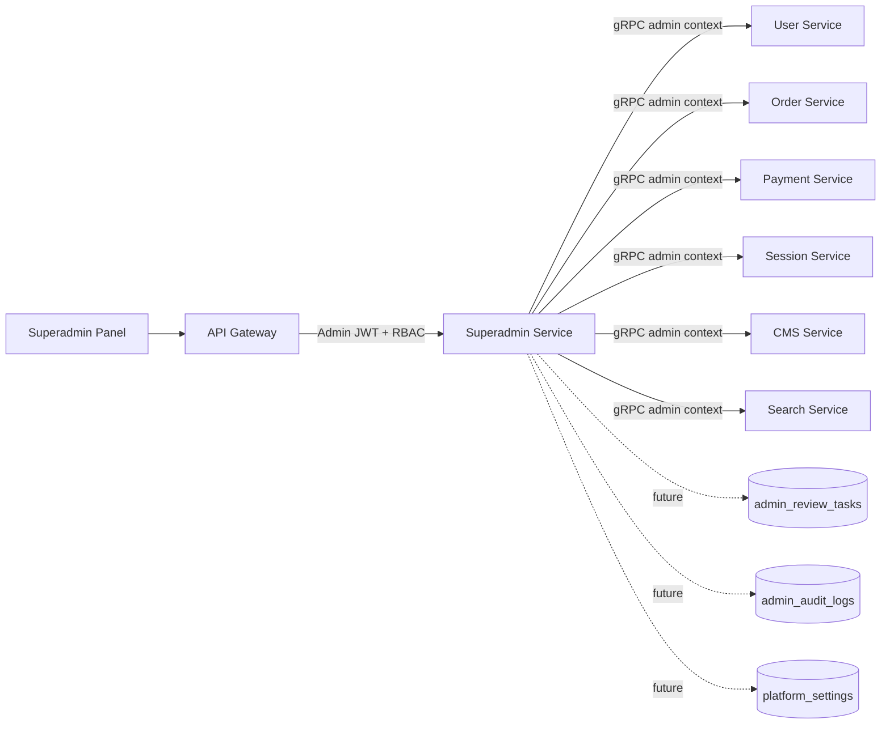
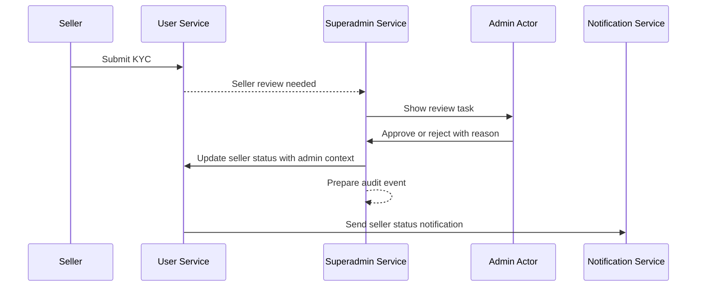
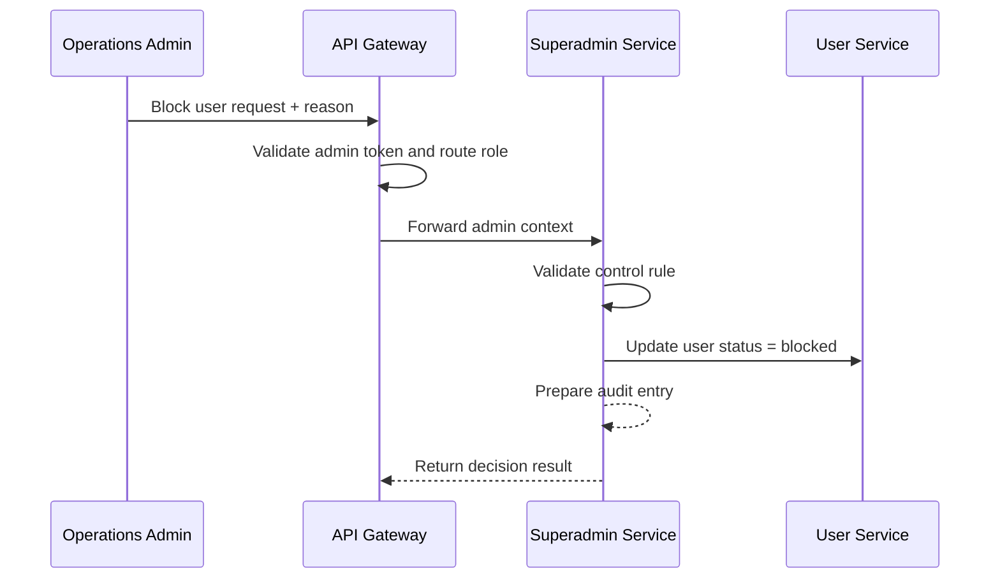
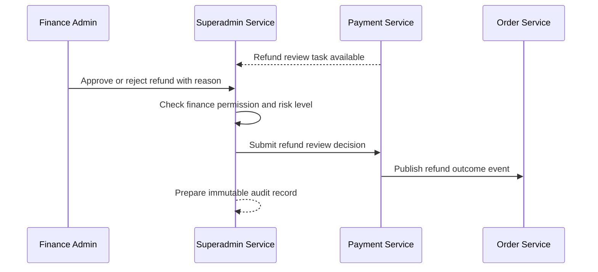
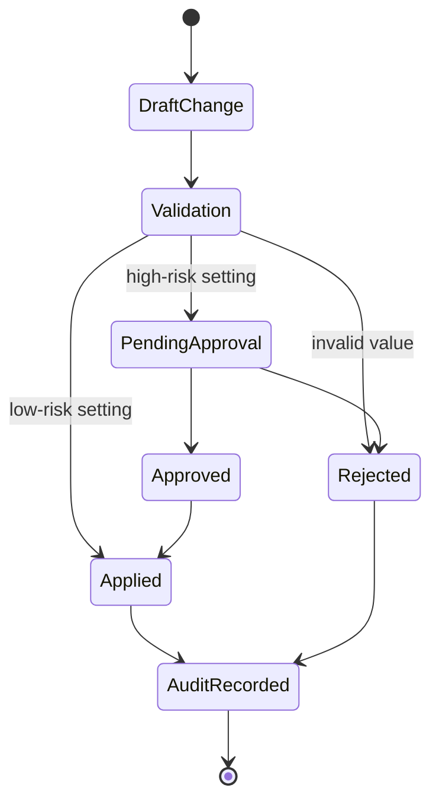
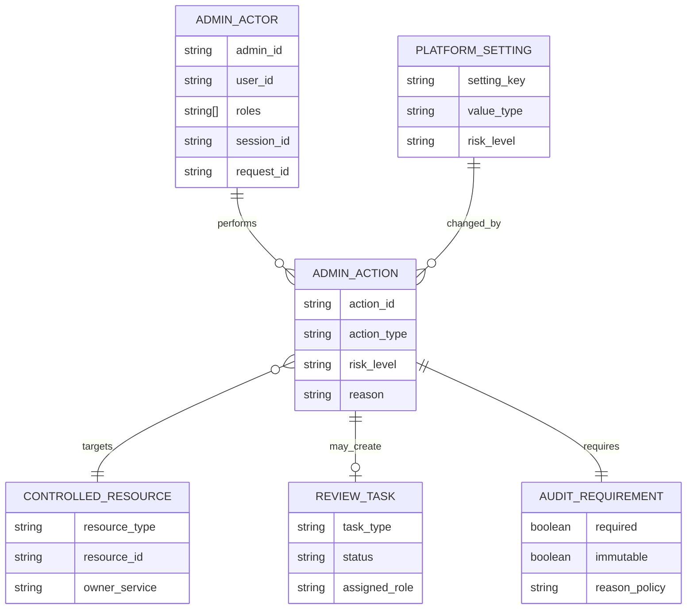
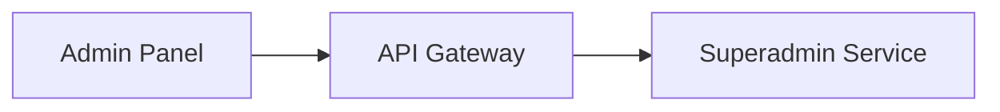

# 🛡️ Superadmin Service - Task 1: Define Admin Domain


## 📌 Task Summary

| Field | Detail |
|---|---|
| Task Name | Define admin domain |
| Source | `docs/01-micro-tasks.md` → `Superadmin Service` → Task 1 |
| Goal | Users, sellers, orders, payments, sessions, aur platform settings ke admin control rules define karna |
| Dependency | Auth RBAC |
| Priority | P1 |
| Output Type | Documentation-only domain implementation guide |
| Not Included | MySQL schema, Admin RBAC implementation, gRPC handlers, REST routes, frontend panel |

> **Simple Hinglish goal:** Is task ka kaam Superadmin Service ka domain clear karna hai. Matlab platform admin kya dekh sakta hai, kya change kar sakta hai, kis condition me change kar sakta hai, aur har sensitive action ka audit kaise socha jayega. Is task me production code ya database migration nahi banaya gaya.

---

## ✅ Final Output Created

```text
TaskImplementation/
└── Superadmin Service/
    └── task1.md
```

### Why this structure?

| Folder/File | Purpose |
|---|---|
| `TaskImplementation/` | Saare task-wise implementation guides ka central location |
| `Superadmin Service/` | Superadmin Service ke tasks ko logically group karta hai |
| `task1.md` | Sirf **Superadmin Service - Task 1** ka domain guide |

> 🟢 **Important:** Existing project code ko touch nahi kiya gaya. Ye task sirf required folder aur markdown guide create karta hai.

---

## 📚 Documents Studied

| Document | Kya use kiya gaya |
|---|---|
| `docs/01-micro-tasks.md` | Task name, dependency, priority, aur exact scope identify kiya |
| `docs/04-microservice-design.md` | Superadmin Service purpose, responsibilities, APIs, internal logic samjha |
| `docs/09-cms-superadmin.md` | Superadmin modules, permission model, high-risk controls, workflows |
| `docs/06-auth-security.md` | Roles, RBAC enforcement points, admin mutation rate limits |
| `docs/05-database-design.md` | Future DB tables aur audit-log direction samjha, but schema implement nahi kiya |
| `docs/03-folder-structure.md` | Future `superadmin-service` folder layout align kiya |
| `docs/02-system-architecture.md` | Gateway, gRPC, service ownership, and cross-service flow context |

---

## 🧭 Implementation Approach

Superadmin Service ek **platform-level control plane** hai. Iska matlab ye service directly buyer/seller app ka normal business flow nahi chalati. Ye admin operations ke liye safe control layer banati hai.

### Domain-first approach

Task 1 me humne code likhne se pehle ye define kiya:

- Admin actor kaun hoga
- Admin kis resource par action le sakta hai
- Kis action ke liye reason/audit/approval required hai
- Kaunsi service original data ki owner hai
- Superadmin Service kaha decision karegi aur kaha downstream service ko call karegi

> 🟡 **Beginner note:** Domain define karna ka matlab tables ya APIs banana nahi hota. Pehle business boundaries clear hoti hain, phir schema, RBAC, gRPC, REST, aur UI implement hote hain.

---

## 🪜 Step-by-Step Implementation

## Step 1: Task scope freeze kiya

`docs/01-micro-tasks.md` me Superadmin Service Task 1 ye hai:

| S.No | Task Name | Detail | Dependency | Priority |
|---:|---|---|---|---|
| 1 | Define admin domain | Users, sellers, orders, payments, sessions, platform settings ke control rules define karo. | Auth RBAC | P1 |

### Is task me allowed work

- Admin domain boundaries define karna
- Admin actors and controlled resources list karna
- High-risk actions ke rules define karna
- Audit expectations define karna
- Cross-service ownership clarify karna
- Future implementation ke liye conceptual examples dena

### Is task me not allowed work

| Area | Reason |
|---|---|
| MySQL tables create karna | Ye **Superadmin Service Task 2: Choose MySQL** ke baad hoga |
| Permission tables/RBAC code likhna | Ye **Task 3: Admin RBAC** ka scope hai |
| User/seller status API implement karna | Ye **Task 4: User/seller controls** ka scope hai |
| Refund workflow implement karna | Ye **Task 5: Order/payment controls** ka scope hai |
| Platform settings store karna | Ye **Task 7: Platform settings** ka scope hai |
| Audit log table/code banana | Ye **Task 8: Admin audit logs** ka scope hai |

> 🔴 **Boundary rule:** Task 1 me sirf domain definition complete karni hai. Backend service code, migrations, generated proto, ya frontend pages create nahi karne.

---

## Step 2: Superadmin Service ka purpose define kiya

Superadmin Service ka purpose hai platform owner ko ek safe control plane dena jahan se woh platform-wide operations monitor aur control kar sake.

### Core responsibilities

| Responsibility | Simple meaning |
|---|---|
| Admin user and permission management | Admin users aur unke access rules ka domain |
| User block/unblock | Suspicious ya policy-violating users ko restrict karna |
| Seller approval/suspension | Seller KYC, approval, suspension, catalog trust controls |
| Refund review | High-risk refund approvals/rejections ka admin workflow |
| Platform settings | Commission, feature flags, maintenance mode, search settings ka control |
| Cross-service admin workflows | User, Payment, Order, Session, CMS jaise services ko admin context ke saath coordinate karna |
| Immutable admin audit logs | Har sensitive admin action ka trace maintain karna |

### Service identity

```text
Service Name: superadmin-service
Main Role: Platform control plane
Public Access: Direct public nahi, API Gateway ke through protected admin routes
Internal Communication: gRPC with downstream services
Security Level: High-risk, audit mandatory
```

---

## Step 3: Admin actors define kiye

Admin actor woh authenticated internal user hai jo platform operations perform karta hai.

| Actor Role | Domain meaning | Typical access |
|---|---|---|
| `superadmin` | Platform owner / highest privilege | Full platform access |
| `operations_admin` | Daily support and operations team | Users, sellers, orders, support actions |
| `finance_admin` | Finance and refund team | Payments, refunds, reconciliation |
| `catalog_admin` | Catalog trust and search team | Product moderation, seller catalog, search synonyms |
| `readonly_admin` | Audit/support viewer | Read-only operational view |

> 🟡 **Note:** Ye role list domain definition ke liye hai. Actual role-permission enforcement **Task 3: Admin RBAC** me implement hoga.

### Admin actor conceptual model

```go
package domain

type AdminRole string

const (
    RoleSuperadmin     AdminRole = "superadmin"
    RoleOperations     AdminRole = "operations_admin"
    RoleFinance        AdminRole = "finance_admin"
    RoleCatalog        AdminRole = "catalog_admin"
    RoleReadonly       AdminRole = "readonly_admin"
)

type AdminActor struct {
    AdminID   string
    UserID    string
    Roles     []AdminRole
    SessionID string
    RequestID string
    IPHash    string
}
```

**Explanation:**  
`AdminActor` me admin identity, roles, session, request, aur IP hash rakha gaya hai. Sensitive action ke audit me ye details useful hoti hain.

---

## Step 4: Controlled resources define kiye

Superadmin domain me controlled resource wo object hai jisko admin view ya modify kar sakta hai.

| Resource | Original owner service | Superadmin capability | Control rule |
|---|---|---|---|
| Users | User Service | Search, view, block/unblock | Mutation ke liye reason and audit required |
| Sellers | User Service + CMS/Product | KYC review, approve, reject, suspend | Status change reason mandatory |
| Orders | Order Service | Cross-platform search, dispute view, manual review flag | Direct order mutation restricted |
| Payments | Payment Service | Payment lookup, refund review | Finance role or superadmin required |
| Sessions | Session Service | Live sessions, suspicious activity, user journey view | PII masking and readonly by default |
| Platform Settings | Superadmin/CMS/Search future ownership | Commission, feature flags, maintenance mode, synonyms | High-risk setting changes audit mandatory |
| Audit Logs | Superadmin Service | Filter and export admin actions | Immutable, append-only |
| Review Tasks | Superadmin Service | Approval queues for seller/refund/settings | Maker-checker possible for high-risk tasks |

> 🟢 **Ownership rule:** Superadmin Service doosri service ka source data own nahi karegi. Example: user profile User Service own karega, payment status Payment Service own karega. Superadmin Service admin decision coordinate karegi.

---

## Step 5: Admin action categories banaye

Actions ko category me split karne se security, audit, aur approval rules clean bante hain.

| Category | Examples | Risk level | Required controls |
|---|---|---|---|
| Read | User search, payment lookup, audit log view | Low to Medium | Role check, request log |
| Status Mutation | Block user, suspend seller, approve KYC | High | Role check, reason, audit |
| Financial Decision | Approve/reject refund | High | Finance/superadmin role, audit, optional maker-checker |
| Platform Change | Maintenance mode, commission update, feature flag update | Critical | Superadmin role, audit, optional approval |
| Export | Audit export, report export | Medium to High | Role check, purpose note, audit |

### Action conceptual model

```go
package domain

type ResourceType string
type ActionType string
type RiskLevel string

const (
    ResourceUser     ResourceType = "user"
    ResourceSeller   ResourceType = "seller"
    ResourceOrder    ResourceType = "order"
    ResourcePayment  ResourceType = "payment"
    ResourceSession  ResourceType = "session"
    ResourceSetting  ResourceType = "platform_setting"
    ResourceAuditLog ResourceType = "admin_audit_log"
)

const (
    RiskLow      RiskLevel = "low"
    RiskMedium   RiskLevel = "medium"
    RiskHigh     RiskLevel = "high"
    RiskCritical RiskLevel = "critical"
)

type AdminAction struct {
    ActionID     string
    ResourceType ResourceType
    ResourceID   string
    ActionType   ActionType
    RiskLevel    RiskLevel
    Reason       string
}
```

**Explanation:**  
Ye model future implementation ko guide karega. Har action ko resource, action type, risk level, aur reason ke saath represent kiya ja sakta hai.

---

## Step 6: Global control rules define kiye

Ye rules Superadmin Service ke saare admin actions par apply honge.

| Rule | Why important |
|---|---|
| Admin JWT/session required | Anonymous ya buyer/seller token se admin action block hoga |
| Gateway-level RBAC + service-level RBAC | Ek layer bypass ho jaye tab bhi service protection rahe |
| High-risk mutation me reason required | Compliance and support debugging ke liye |
| Every mutation must create audit intent | Sensitive changes traceable rahenge |
| Downstream service call admin context ke saath hoga | User/Payment/Order service ko pata rahe action admin ne kiya |
| Maker-checker support high-value actions me possible hoga | Refund/settings jaise critical actions me dual control |
| PII masking default for session/user views | Privacy risk reduce hota hai |
| Idempotency key high-risk mutation me recommended | Retry se duplicate admin action avoid hoga |

### Admin action request envelope

```json
{
  "request_id": "req_01HR9K7Q8Y",
  "actor_admin_id": "admin_123",
  "actor_roles": ["finance_admin"],
  "action": "refund.review",
  "resource_type": "payment_refund",
  "resource_id": "refund_789",
  "decision": "approved",
  "reason": "Customer returned sealed product within policy window",
  "idempotency_key": "refund_789:review:v1",
  "metadata": {
    "amount": 2500,
    "currency": "INR"
  }
}
```

**Explanation:**  
Is envelope me action ka full context aata hai. Future audit log aur downstream gRPC call dono isi information se consistent ban sakte hain.

---

## Step 7: Domain control matrix banaya

### Users

| Capability | Rule |
|---|---|
| Search users | `operations_admin`, `superadmin`, ya allowed admin role |
| View user profile | PII masking rules apply honge |
| Block user | Reason required, audit required |
| Unblock user | Reason required, audit required |
| View sessions | Session Service se readonly data, masking required |

### Sellers

| Capability | Rule |
|---|---|
| View seller profile | Seller status, KYC metadata, catalog health visible |
| Approve seller | KYC review note required |
| Reject seller | Rejection reason required |
| Suspend seller | Reason code and audit mandatory |
| Resume seller | Previous suspension context visible hona chahiye |

### Orders

| Capability | Rule |
|---|---|
| Search orders | Cross-platform admin query |
| View order detail | Buyer/seller sensitive data masked by role |
| Mark for manual review | Reason required |
| Resolve dispute note | Audit required |

### Payments and refunds

| Capability | Rule |
|---|---|
| View payment | `finance_admin` or `superadmin` |
| View refund request | Finance queue me visible |
| Approve refund | Reason and audit required |
| Reject refund | Reason and audit required |
| High-value refund | Maker-checker approval recommended |

### Sessions

| Capability | Rule |
|---|---|
| View active sessions | Operations/security use case only |
| View suspicious activity | Readonly by default |
| View journey | PII and sensitive payload masking |
| Export session data | Strong reason and audit required |

### Platform settings

| Capability | Rule |
|---|---|
| View settings | Admin role check |
| Update maintenance mode | `superadmin` only, audit mandatory |
| Update commission | `superadmin` only, audit and optional approval |
| Update feature flags | Audit mandatory |
| Update search synonyms | `catalog_admin` or `superadmin`, audit required |

---

## 🏗️ Architecture Diagram



### Diagram explanation

- Superadmin Panel direct services ko call nahi karega.
- API Gateway admin JWT validate karega.
- Superadmin Service domain decision and admin workflow coordinate karegi.
- Actual source data owning service ke paas rahega.
- Future tasks me review tasks, audit logs, aur settings MySQL me persist honge.

---

## 🔁 Core Workflow Diagrams

## Seller approval flow



**Explanation:**  
Seller ka original profile User Service own karta hai. Superadmin Service approval decision coordinate karti hai and reason/audit context maintain karti hai.

## User block flow



**Explanation:**  
Block/unblock high-risk action hai. Reason empty nahi hona chahiye. Future task me audit log actual DB me store hoga.

## Refund review flow



**Explanation:**  
Refund financial action hai, isliye finance admin ya superadmin role required hoga. High-value refunds ke liye maker-checker future rule apply ho sakta hai.

## Platform setting change flow



**Explanation:**  
Platform setting changes critical ho sakte hain, jaise maintenance mode ya commission. Isliye validation, approval, apply, aur audit ke states clearly define kiye gaye.

---

## 🧩 Domain Entity Map



### Entity explanation

| Entity | Meaning |
|---|---|
| `ADMIN_ACTOR` | Authenticated admin performing the action |
| `CONTROLLED_RESOURCE` | User, seller, order, payment, session, setting, audit log |
| `ADMIN_ACTION` | Admin ka requested action with risk and reason |
| `REVIEW_TASK` | Approval queue item for seller/refund/settings workflows |
| `AUDIT_REQUIREMENT` | Kis action ke liye audit mandatory hai |
| `PLATFORM_SETTING` | Future configurable platform setting |

---

## 🧪 Validation Rules

Task 1 me validation logic implement nahi ki gayi, but domain-level rules define kiye gaye.

| Field/Area | Rule |
|---|---|
| `reason` | High-risk mutation me required, minimum meaningful text |
| `resource_id` | Empty nahi hona chahiye |
| `resource_type` | Known resource type hona chahiye |
| `action_type` | Allowed action list me hona chahiye |
| `actor_roles` | Admin role context available hona chahiye |
| `request_id` | Traceability ke liye required |
| `idempotency_key` | Refund, setting update, status mutation me recommended |

### Control rule example

```go
package domain

type ControlRule struct {
    ActionType        string
    ResourceType      ResourceType
    MinimumRoles      []AdminRole
    RequireReason     bool
    RequireAudit      bool
    RequireApproval   bool
    MaskSensitiveData bool
}

var BlockUserRule = ControlRule{
    ActionType:        "user.status.block",
    ResourceType:      ResourceUser,
    MinimumRoles:      []AdminRole{RoleOperations, RoleSuperadmin},
    RequireReason:     true,
    RequireAudit:      true,
    RequireApproval:   false,
    MaskSensitiveData: true,
}
```

**Explanation:**  
Ye example batata hai ki future me rule engine ya usecase layer kaise decide kar sakti hai ki action allowed hai ya nahi.

---

## 🧾 Future API Surface Identified

`docs/04-microservice-design.md` me Superadmin Service ke future gRPC and REST contracts list hain. Task 1 me inhe implement nahi kiya gaya, sirf domain alignment ke liye reference liya gaya.

### Future gRPC methods

```text
ListUsersForAdmin
UpdateUserStatus
ListSellersForAdmin
UpdateSellerStatus
ReviewRefund
GetPlatformSettings
UpdatePlatformSetting
ListAuditLogs
```

### Future REST routes through API Gateway

```text
GET   /api/v1/admin/users
PATCH /api/v1/admin/users/{user_id}/status
GET   /api/v1/admin/sellers
PATCH /api/v1/admin/sellers/{seller_id}/status
GET   /api/v1/admin/orders
GET   /api/v1/admin/payments
POST  /api/v1/admin/refunds/{refund_id}/review
GET   /api/v1/admin/audit-logs
GET   /api/v1/admin/settings
PATCH /api/v1/admin/settings/{key}
```

> 🟡 **Note:** Ye routes Task 1 me create nahi hue. Ye sirf domain boundaries ko validate karne ke liye documented hain.

---

## 🗂️ Clean Folder Structure

## Actual implementation output for this task

```text
TaskImplementation/
└── Superadmin Service/
    └── task1.md
```

## Future service structure aligned with docs

```text
backend/
└── services/
    └── superadmin-service/
        ├── cmd/
        │   └── server/
        │       └── main.go
        ├── internal/
        │   ├── domain/
        │   │   ├── admin_actor.go
        │   │   ├── admin_action.go
        │   │   ├── controlled_resource.go
        │   │   ├── control_rule.go
        │   │   ├── review_task.go
        │   │   └── platform_setting.go
        │   ├── usecase/
        │   │   ├── manage_user.go
        │   │   ├── manage_seller.go
        │   │   ├── manage_payment.go
        │   │   ├── manage_setting.go
        │   │   └── list_audit_logs.go
        │   ├── repository/
        │   │   └── mysql_admin_repository.go
        │   ├── transport/
        │   │   └── grpc/
        │   │       ├── server.go
        │   │       └── admin_handler.go
        │   └── config/
        │       └── config.go
        ├── migrations/
        └── deploy/
```

> 🔴 **Scope reminder:** Upar wali future structure sirf guide hai. Task 1 me ye backend files create nahi kiye gaye.

---

## 🧰 External Libraries / Tools Used

## Runtime libraries

| Library | Used? | Why |
|---|---|---|
| Go external package | No | Task 1 documentation-only hai |
| MySQL driver | No | DB implementation Task 2 ke baad hoga |
| gRPC library | No | Proto/gRPC implementation later task me hoga |
| React/Tailwind | No | Superadmin Panel alag frontend task hai |

## Documentation tools

| Tool | What it is | Why used | Install/use |
|---|---|---|---|
| Markdown | Plain text documentation format | Guide readable and beginner-friendly banane ke liye | GitHub/GitLab/VS Code me directly view hota hai |
| Mermaid | Markdown-friendly diagram syntax | Architecture, sequence, state, ER diagrams banane ke liye | GitHub supports Mermaid. VS Code me optional extension `Markdown Preview Mermaid Support` use kar sakte ho |
| Shields.io badges | Badge image generator | Status, priority, dependency visually show karne ke liye | Install nahi chahiye. Badge URL markdown image ke through render hota hai |

### Mermaid usage example

````markdown

````

---

## 🔐 Security Decisions Captured

| Decision | Reason |
|---|---|
| Admin actions require admin context | Buyer/seller token misuse avoid karna |
| High-risk mutation requires reason | Compliance and traceability |
| Audit is mandatory for mutation | Security review and incident response |
| Downstream calls include admin context | Owning service ko actor visibility mile |
| Session/user PII masking | Privacy and least-privilege |
| Maker-checker support for critical actions | Financial/platform damage risk reduce karna |

---

## ✅ Definition of Done

| Check | Status |
|---|---|
| `TaskImplementation/` folder exists | ✅ |
| `TaskImplementation/Superadmin Service/` folder exists | ✅ |
| `task1.md` created | ✅ |
| Task scope limited to Superadmin Service Task 1 | ✅ |
| Admin actors defined | ✅ |
| Controlled resources defined | ✅ |
| Control rules defined | ✅ |
| Cross-service ownership clarified | ✅ |
| Mermaid diagrams added | ✅ |
| External tools/libraries explained | ✅ |
| Out-of-scope tasks clearly listed | ✅ |

---

## 🚫 Out of Scope for Task 1

| Future Task | Not implemented here |
|---|---|
| Task 2: Choose MySQL | Tables, migrations, repositories |
| Task 3: Admin RBAC | Permission enforcement, role mapping tables |
| Task 4: User/seller controls | Actual block/approve/suspend APIs |
| Task 5: Order/payment controls | Refund review implementation |
| Task 6: Session visibility | Session dashboard/API access |
| Task 7: Platform settings | Settings persistence and update APIs |
| Task 8: Admin audit logs | Immutable audit DB writes |

> 🔴 **Reason:** Ye sab alag micro-tasks hain. Task 1 ka goal sirf admin domain define karna tha.

---

## ✅ Final Task 1 Domain Standard

Superadmin Service ka domain ab clearly define hai:

- Ye service platform-level admin control plane hogi.
- Ye users, sellers, orders, payments, sessions, settings, review tasks, aur audit logs ke admin workflows coordinate karegi.
- Source data owning service ke paas rahega.
- Har sensitive mutation reason, role check, admin context, aur audit expectation ke saath chalegi.
- Future implementation tasks ke liye clean domain vocabulary ready hai.

> 🟢 **Task 1 complete:** Ab Superadmin Service ke next tasks me MySQL schema, Admin RBAC, user/seller controls, payment controls, settings, aur audit logs safely implement kiye ja sakte hain.
