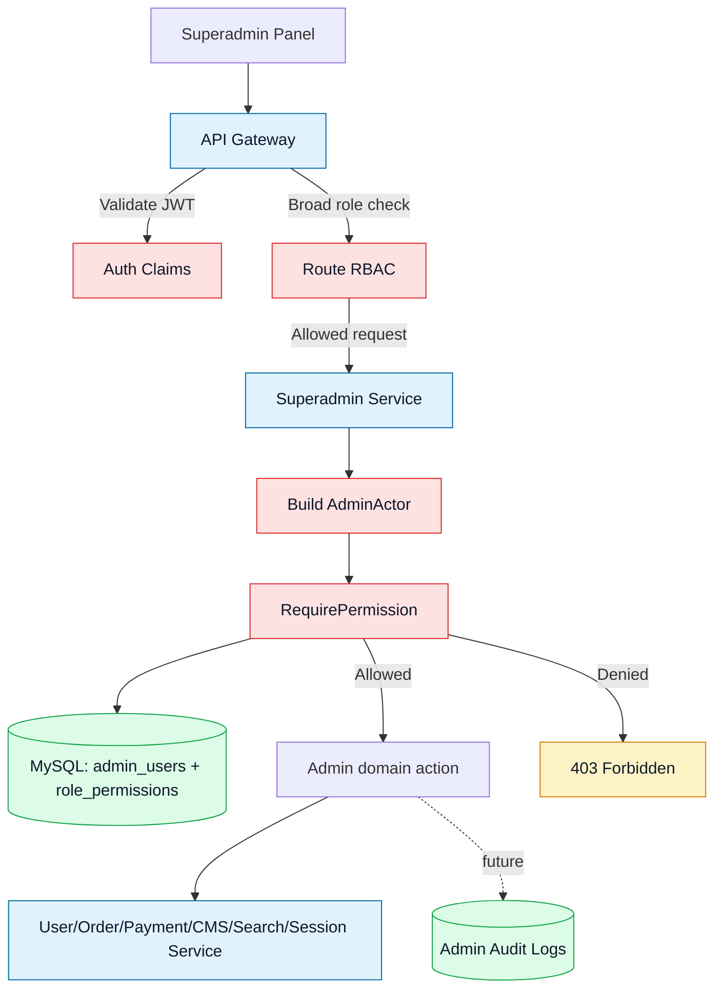
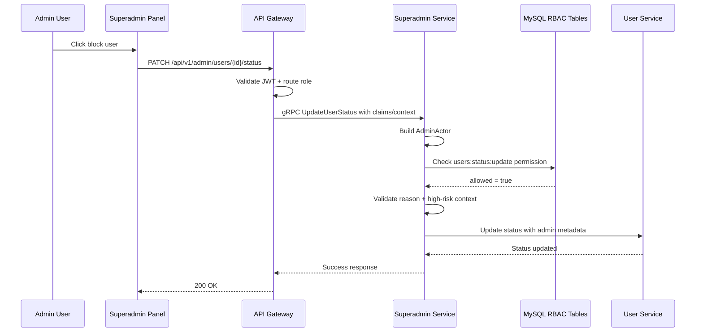

# 🛡️ Superadmin Service - Task 3: Admin RBAC


## 📌 Task Summary

| Field | Detail |
|---|---|
| Task Name | Admin RBAC |
| Source | `docs/01-micro-tasks.md` -> `Superadmin Service` -> Task 3 |
| Goal | `superadmin`, `operations_admin`, `finance_admin`, aur `catalog_admin` ke permissions define karna |
| Dependency | Auth Service |
| Priority | P0 |
| Output Type | Documentation-only RBAC implementation guide |
| Not Included | User/seller control APIs, refund approval flow, session visibility, platform settings feature, production migrations, frontend panel |

> **Simple Hinglish goal:** Is task ka kaam Superadmin Service ke admin roles aur permissions ko clearly define karna hai. Kaunsa admin kya dekh sakta hai, kya update kar sakta hai, aur kaunsi action ke liye strict permission chahiye, ye sab yaha documented hai. Production code ya real DB migration is task me create nahi kiya gaya.

---

## ✅ Final Output Created

```text
TaskImplementation/
└── Superadmin Service/
    ├── task1.md
    ├── task2.md
    └── task3.md
```

### Why this structure?

| Folder/File | Purpose |
|---|---|
| `TaskImplementation/` | Saare task-wise implementation guides ka central location |
| `Superadmin Service/` | Superadmin Service ke tasks ko logically group karta hai |
| `task1.md` | Admin domain boundaries define karta hai |
| `task2.md` | Superadmin Service ke liye MySQL decision explain karta hai |
| `task3.md` | Sirf **Superadmin Service - Task 3** ka Admin RBAC guide |

> 🟢 **Important:** `Superadmin Service` folder already present tha, isliye usko keep kiya gaya. Is task me backend source code, proto, migrations, ya frontend files create nahi kiye gaye.

---

## 📚 Documents Studied

| Document | Kya use kiya gaya |
|---|---|
| `docs/01-micro-tasks.md` | Task 3 ka exact scope: Superadmin roles and permissions define karna |
| `TaskImplementation/Superadmin Service/task1.md` | Admin domain, resources, risk categories, high-risk controls |
| `TaskImplementation/Superadmin Service/task2.md` | MySQL ownership, RBAC tables, permission persistence direction |
| `docs/06-auth-security.md` | Platform roles, RBAC enforcement, permission examples |
| `docs/09-cms-superadmin.md` | Superadmin permission model and high-risk controls |
| `docs/04-microservice-design.md` | Superadmin Service APIs and internal logic |
| `docs/05-database-design.md` | `admin_users`, `admin_permissions`, `admin_role_permissions` relationships |
| `database/draw.sql` | Reference tables for Superadmin DB RBAC storage |
| `api/master-api.json` | Admin REST/gRPC route mapping and auth levels |

---

## 🧭 Implementation Approach

Task 3 ko **Admin RBAC design and implementation guide** treat kiya gaya. RBAC ka matlab hai:

```text
Role Based Access Control
```

Simple words me:

- Admin login ke baad JWT me role claim aayega.
- API Gateway route-level role check karega.
- Superadmin Service service-level permission check karegi.
- High-risk mutations reason + audit context ke bina allow nahi hongi.
- Permissions MySQL me source of truth ke form me stored rahenge.

### Final RBAC decision

```text
Gateway check: broad route access
Service check: exact permission access
Database: MySQL permission registry and role-permission mapping
Token source: Auth Service JWT claims
Audit rule: every admin mutation must carry actor + reason + request context
```

---

## 🪜 Step-by-Step Implementation

## Step 1: Task Boundary Clear Kiya

`docs/01-micro-tasks.md` me Superadmin Service Task 3 ye hai:

| S.No | Task Name | Detail | Dependency | Priority |
|---:|---|---|---|---|
| 3 | Admin RBAC | Superadmin, operations admin, finance admin, catalog admin permissions define karo. | Auth Service | P0 |

### Is task me allowed work

- Admin roles define karna
- Permission naming convention define karna
- Role-permission matrix banana
- JWT claims expectation define karna
- Gateway + service RBAC enforcement flow explain karna
- MySQL seed/mapping examples dena
- Code examples dena for middleware and permission checks
- RBAC tests ka plan define karna

### Is task me not allowed work

| Area | Reason |
|---|---|
| Real user block/unblock API implement karna | Ye **Task 4: User/seller controls** ka scope hai |
| Seller approval/suspension workflow banana | Ye **Task 4** ka scope hai |
| Refund approve/reject production flow banana | Ye **Task 5: Order/payment controls** ka scope hai |
| Session analytics access implement karna | Ye **Task 6: Session visibility** ka scope hai |
| Platform settings write API banana | Ye **Task 7: Platform settings** ka scope hai |
| Immutable audit log production writer banana | Ye **Task 8: Admin audit logs** ka scope hai |
| Superadmin frontend pages banana | Ye **Superadmin Panel** tasks ka scope hai |

> 🔴 **Boundary rule:** Task 3 sirf Admin RBAC model, permission mapping, and enforcement strategy define karta hai. Actual business workflows future tasks me implement honge.

---

## Step 2: Admin Roles Define Kiye

Superadmin system ke roles docs me already identify hain. Task 3 me un roles ko permission point of view se formalize kiya gaya.

| Role | Meaning | Risk Level | Access Summary |
|---|---|---|---|
| `superadmin` | Platform owner / highest privilege | Critical | Full platform admin access |
| `operations_admin` | Support and operations team | High | Users, sellers, orders, support actions |
| `finance_admin` | Finance/refund/reconciliation team | High | Payments, refunds, finance review |
| `catalog_admin` | Catalog trust/search moderation team | Medium/High | Product moderation, seller catalog, search synonyms |
| `readonly_admin` | Audit/support viewer | Medium | Read-only operational visibility |

### Role constants example

```go
package rbac

type AdminRole string

const (
    RoleSuperadmin AdminRole = "superadmin"
    RoleOperations AdminRole = "operations_admin"
    RoleFinance    AdminRole = "finance_admin"
    RoleCatalog    AdminRole = "catalog_admin"
    RoleReadonly   AdminRole = "readonly_admin"
)
```

### Explanation

- `superadmin` ko sab permissions milti hain.
- Specialized roles ko sirf apne kaam ke permissions milte hain.
- `readonly_admin` useful hai jab support/audit team ko data dekhna hai but mutate nahi karna.
- Role names snake_case me rakhe gaye hain taaki JWT, DB, logs, aur config me same format rahe.

---

## Step 3: Permission Naming Convention Banaya

Permission key ka format predictable hona chahiye:

```text
<resource>:<action>[:<scope>]
```

### Examples

| Permission | Meaning |
|---|---|
| `admin:users:read` | Admin users list/view kar sakta hai |
| `users:read` | Platform users search/view kar sakta hai |
| `users:status:update` | User block/unblock kar sakta hai |
| `sellers:read` | Sellers list/view kar sakta hai |
| `sellers:status:update` | Seller approve/suspend/reject kar sakta hai |
| `orders:read` | Orders search/view kar sakta hai |
| `payments:read` | Payments view kar sakta hai |
| `payments:refund:review` | Refund approve/reject review kar sakta hai |
| `sessions:read` | Session data view kar sakta hai |
| `catalog:moderation:write` | Catalog moderation action le sakta hai |
| `search:synonyms:write` | Search synonyms update kar sakta hai |
| `platform:settings:read` | Platform settings view kar sakta hai |
| `platform:settings:write` | Platform settings update kar sakta hai |
| `audit:logs:read` | Audit logs dekh sakta hai |
| `audit:logs:export` | Audit logs export kar sakta hai |

### Why this convention?

| Part | Reason |
|---|---|
| `resource` | Kis domain area par permission lag rahi hai |
| `action` | Read, write, update, review, export type operation |
| `scope` | Optional finer control, jaise refund review |

> 🟡 **Beginner note:** Role ek bucket hai. Permission exact key hai. Example: `finance_admin` role ke andar `payments:refund:review` permission ho sakti hai.

---

## Step 4: Permission Registry Define Kiya

Ye registry Superadmin Service ke RBAC ka central list hai.

| Permission Key | Description | Risk |
|---|---|---|
| `admin:users:read` | Admin users view/list | Medium |
| `admin:users:write` | Admin user create/disable/update | Critical |
| `users:read` | Platform users search/view | Medium |
| `users:status:update` | User block/unblock | High |
| `sellers:read` | Sellers search/view/KYC metadata view | Medium |
| `sellers:status:update` | Seller approve/reject/suspend | High |
| `orders:read` | Orders search/view/dispute context | Medium |
| `orders:manual_review:write` | Order manual review flag/action | High |
| `payments:read` | Payment lookup/reconciliation view | High |
| `payments:refund:review` | Refund approve/reject decision | Critical |
| `sessions:read` | Session analytics/admin visibility | Medium |
| `sessions:risk:read` | Suspicious session/risk view | High |
| `catalog:moderation:read` | Catalog review queues view | Medium |
| `catalog:moderation:write` | Catalog moderation decision | High |
| `search:synonyms:read` | Search synonym settings view | Low |
| `search:synonyms:write` | Search synonym settings update | Medium |
| `platform:settings:read` | Platform settings view | Medium |
| `platform:settings:write` | Platform settings update | Critical |
| `audit:logs:read` | Admin audit log view | High |
| `audit:logs:export` | Admin audit export | Critical |

### Permission constants example

```go
package rbac

type Permission string

const (
    PermissionAdminUsersRead       Permission = "admin:users:read"
    PermissionAdminUsersWrite      Permission = "admin:users:write"
    PermissionUsersRead            Permission = "users:read"
    PermissionUsersStatusUpdate    Permission = "users:status:update"
    PermissionSellersRead          Permission = "sellers:read"
    PermissionSellersStatusUpdate  Permission = "sellers:status:update"
    PermissionOrdersRead           Permission = "orders:read"
    PermissionOrderManualReview    Permission = "orders:manual_review:write"
    PermissionPaymentsRead         Permission = "payments:read"
    PermissionRefundReview         Permission = "payments:refund:review"
    PermissionSessionsRead         Permission = "sessions:read"
    PermissionSessionRiskRead      Permission = "sessions:risk:read"
    PermissionCatalogRead          Permission = "catalog:moderation:read"
    PermissionCatalogWrite         Permission = "catalog:moderation:write"
    PermissionSearchSynonymsRead   Permission = "search:synonyms:read"
    PermissionSearchSynonymsWrite  Permission = "search:synonyms:write"
    PermissionSettingsRead         Permission = "platform:settings:read"
    PermissionSettingsWrite        Permission = "platform:settings:write"
    PermissionAuditLogsRead        Permission = "audit:logs:read"
    PermissionAuditLogsExport      Permission = "audit:logs:export"
)
```

---

## Step 5: Role-Permission Matrix Banaya

### ✅ Main permission matrix

| Permission | `superadmin` | `operations_admin` | `finance_admin` | `catalog_admin` | `readonly_admin` |
|---|:---:|:---:|:---:|:---:|:---:|
| `admin:users:read` | ✅ | ❌ | ❌ | ❌ | ❌ |
| `admin:users:write` | ✅ | ❌ | ❌ | ❌ | ❌ |
| `users:read` | ✅ | ✅ | ❌ | ❌ | ✅ |
| `users:status:update` | ✅ | ✅ | ❌ | ❌ | ❌ |
| `sellers:read` | ✅ | ✅ | ❌ | ✅ | ✅ |
| `sellers:status:update` | ✅ | ✅ | ❌ | ✅ | ❌ |
| `orders:read` | ✅ | ✅ | ❌ | ❌ | ✅ |
| `orders:manual_review:write` | ✅ | ✅ | ❌ | ❌ | ❌ |
| `payments:read` | ✅ | ❌ | ✅ | ❌ | ❌ |
| `payments:refund:review` | ✅ | ❌ | ✅ | ❌ | ❌ |
| `sessions:read` | ✅ | ✅ | ❌ | ❌ | ✅ |
| `sessions:risk:read` | ✅ | ✅ | ❌ | ❌ | ❌ |
| `catalog:moderation:read` | ✅ | ✅ | ❌ | ✅ | ✅ |
| `catalog:moderation:write` | ✅ | ❌ | ❌ | ✅ | ❌ |
| `search:synonyms:read` | ✅ | ❌ | ❌ | ✅ | ✅ |
| `search:synonyms:write` | ✅ | ❌ | ❌ | ✅ | ❌ |
| `platform:settings:read` | ✅ | ❌ | ❌ | ❌ | ❌ |
| `platform:settings:write` | ✅ | ❌ | ❌ | ❌ | ❌ |
| `audit:logs:read` | ✅ | ❌ | ❌ | ❌ | ✅ |
| `audit:logs:export` | ✅ | ❌ | ❌ | ❌ | ❌ |

### Why these mappings?

| Role | Reasoning |
|---|---|
| `superadmin` | Platform owner hai, isliye full access |
| `operations_admin` | Support workflows ke liye user/seller/order/session access chahiye |
| `finance_admin` | Payment/refund area tak limited access chahiye |
| `catalog_admin` | Seller catalog/search moderation ke liye limited write access chahiye |
| `readonly_admin` | Audit/support view ke liye read-only access, mutation nahi |

---

## Step 6: Route-Level RBAC Define Kiya

Gateway broad authorization karega. Matlab request Superadmin Service tak pahunchne se pehle JWT and route role validate hoga.

| REST API | Gateway Auth Level | Service Permission |
|---|---|---|
| `GET /api/v1/admin/users` | `admin` | `users:read` |
| `PATCH /api/v1/admin/users/{user_id}/status` | `admin` | `users:status:update` |
| `GET /api/v1/admin/sellers` | `admin` | `sellers:read` |
| `PATCH /api/v1/admin/sellers/{seller_id}/status` | `admin` | `sellers:status:update` |
| `GET /api/v1/admin/orders` | `admin` | `orders:read` |
| `GET /api/v1/admin/payments` | `admin` | `payments:read` |
| `POST /api/v1/admin/refunds/{refund_id}/review` | `admin` | `payments:refund:review` |
| `GET /api/v1/admin/audit-logs` | `admin` | `audit:logs:read` |
| `GET /api/v1/admin/settings` | `superadmin` | `platform:settings:read` |
| `PATCH /api/v1/admin/settings/{key}` | `superadmin` | `platform:settings:write` |

### Gateway middleware example

```go
func RequireAnyRole(allowedRoles ...string) gin.HandlerFunc {
    allowed := map[string]bool{}
    for _, role := range allowedRoles {
        allowed[role] = true
    }

    return func(c *gin.Context) {
        claims, ok := c.Get("claims")
        if !ok {
            c.AbortWithStatusJSON(401, gin.H{"error": "missing auth claims"})
            return
        }

        userClaims := claims.(AuthClaims)
        for _, role := range userClaims.Roles {
            if allowed[role] {
                c.Next()
                return
            }
        }

        c.AbortWithStatusJSON(403, gin.H{"error": "forbidden"})
    }
}
```

### Explanation

- Gateway JWT validate karega.
- Gateway role-level check karega, jaise `admin` group ya `superadmin`.
- Gateway exact permission decision nahi karega.
- Exact permission Superadmin Service karegi because domain rules service ke paas better context hota hai.

---

## Step 7: Service-Level Permission Check Define Kiya

Superadmin Service me exact permission check hoga.

```go
type Authorizer interface {
    HasPermission(ctx context.Context, actor AdminActor, permission Permission) (bool, error)
    RequirePermission(ctx context.Context, actor AdminActor, permission Permission) error
}
```

### Authorizer example

```go
type RBACAuthorizer struct {
    permissionRepo PermissionRepository
}

func (a *RBACAuthorizer) RequirePermission(
    ctx context.Context,
    actor AdminActor,
    permission Permission,
) error {
    if actor.AdminID == "" {
        return ErrUnauthenticated
    }

    allowed, err := a.permissionRepo.AdminHasPermission(ctx, actor.AdminID, string(permission))
    if err != nil {
        return err
    }
    if !allowed {
        return ErrForbidden
    }

    return nil
}
```

### Example usage in handler

```go
func (s *SuperadminService) ListUsersForAdmin(
    ctx context.Context,
    req *ListUsersForAdminRequest,
) (*ListUsersForAdminResponse, error) {
    actor := ActorFromContext(ctx)

    if err := s.authorizer.RequirePermission(ctx, actor, PermissionUsersRead); err != nil {
        return nil, err
    }

    return s.userClient.ListUsersForAdmin(ctx, req)
}
```

### Explanation

- Handler request receive karta hai.
- `ActorFromContext` admin identity read karta hai.
- `RequirePermission` exact permission verify karta hai.
- Permission pass hone ke baad downstream service call hoti hai.

---

## Step 8: Auth Service JWT Claims Define Kiye

Task 3 Auth Service par dependent hai because roles JWT se aayenge.

### Expected JWT claims

```json
{
  "sub": "user_123",
  "session_id": "sess_456",
  "roles": ["operations_admin"],
  "admin_id": "admin_789",
  "mfa_verified": true,
  "iat": 1730000000,
  "exp": 1730000900
}
```

### Claims rules

| Claim | Required? | Why |
|---|---:|---|
| `sub` | ✅ | Base user identity |
| `session_id` | ✅ | Admin session traceability |
| `roles` | ✅ | Gateway role check |
| `admin_id` | ✅ for admin routes | Superadmin DB permission lookup |
| `mfa_verified` | ✅ for high-risk actions | Admin security control |
| `iat` / `exp` | ✅ | Short-lived admin token |

### Admin context object

```go
type AdminActor struct {
    AdminID     string
    UserID      string
    Roles       []AdminRole
    SessionID   string
    RequestID   string
    IPHash      string
    MFAVerified bool
}
```

> 🟡 **Beginner note:** JWT role fast check ke liye useful hai, but final permission DB se check karna safer hai. Agar admin role revoke ho jaye, service DB check updated permission use kar sakta hai.

---

## Step 9: MySQL RBAC Storage Plan Explain Kiya

Task 2 me MySQL choose kiya gaya tha. Task 3 me RBAC ke liye existing planned tables use honge:

| Table | RBAC use |
|---|---|
| `admin_users` | Admin identity, user mapping, role, status, MFA requirement |
| `admin_permissions` | Permission registry |
| `admin_role_permissions` | Role to permission mapping |
| `admin_audit_logs` | Future Task 8 me RBAC-protected actions log honge |

### Reference schema direction

```sql
CREATE TABLE IF NOT EXISTS admin_permissions (
  id BIGINT UNSIGNED NOT NULL AUTO_INCREMENT,
  permission_id VARCHAR(64) NOT NULL,
  permission_key VARCHAR(128) NOT NULL,
  description VARCHAR(512) NULL,
  created_at TIMESTAMP NOT NULL DEFAULT CURRENT_TIMESTAMP,
  PRIMARY KEY (id),
  UNIQUE KEY uk_admin_permissions_id (permission_id),
  UNIQUE KEY uk_admin_permissions_key (permission_key)
) ENGINE=InnoDB;

CREATE TABLE IF NOT EXISTS admin_role_permissions (
  id BIGINT UNSIGNED NOT NULL AUTO_INCREMENT,
  role VARCHAR(64) NOT NULL,
  permission_key VARCHAR(128) NOT NULL,
  created_at TIMESTAMP NOT NULL DEFAULT CURRENT_TIMESTAMP,
  PRIMARY KEY (id),
  UNIQUE KEY uk_admin_role_permission (role, permission_key)
) ENGINE=InnoDB;
```

### Why separate tables?

| Design | Benefit |
|---|---|
| `admin_permissions` | All valid permission keys ka registry ban jata hai |
| `admin_role_permissions` | Role mapping duplicate-free hota hai |
| Unique keys | Same role-permission duplicate insert nahi hota |
| SQL indexes | Permission lookup fast hota hai |

---

## Step 10: Seed Data Plan Banaya

RBAC ka first setup seed data se hoga.

### Permission seed example

```sql
INSERT INTO admin_permissions (permission_id, permission_key, description)
VALUES
  ('perm_admin_users_read', 'admin:users:read', 'View admin users'),
  ('perm_admin_users_write', 'admin:users:write', 'Create or update admin users'),
  ('perm_users_read', 'users:read', 'View platform users'),
  ('perm_users_status_update', 'users:status:update', 'Block or unblock platform users'),
  ('perm_sellers_read', 'sellers:read', 'View sellers'),
  ('perm_sellers_status_update', 'sellers:status:update', 'Approve or suspend sellers'),
  ('perm_orders_read', 'orders:read', 'View platform orders'),
  ('perm_payments_read', 'payments:read', 'View payments'),
  ('perm_refund_review', 'payments:refund:review', 'Approve or reject refunds'),
  ('perm_settings_write', 'platform:settings:write', 'Update platform settings'),
  ('perm_audit_logs_read', 'audit:logs:read', 'View admin audit logs')
ON DUPLICATE KEY UPDATE
  description = VALUES(description);
```

### Role-permission seed example

```sql
INSERT INTO admin_role_permissions (role, permission_key)
VALUES
  ('superadmin', 'admin:users:read'),
  ('superadmin', 'admin:users:write'),
  ('superadmin', 'users:read'),
  ('superadmin', 'users:status:update'),
  ('superadmin', 'sellers:read'),
  ('superadmin', 'sellers:status:update'),
  ('superadmin', 'orders:read'),
  ('superadmin', 'payments:read'),
  ('superadmin', 'payments:refund:review'),
  ('superadmin', 'platform:settings:write'),
  ('superadmin', 'audit:logs:read'),
  ('operations_admin', 'users:read'),
  ('operations_admin', 'users:status:update'),
  ('operations_admin', 'sellers:read'),
  ('operations_admin', 'sellers:status:update'),
  ('operations_admin', 'orders:read'),
  ('finance_admin', 'payments:read'),
  ('finance_admin', 'payments:refund:review'),
  ('catalog_admin', 'sellers:read'),
  ('catalog_admin', 'catalog:moderation:read'),
  ('catalog_admin', 'catalog:moderation:write'),
  ('readonly_admin', 'users:read'),
  ('readonly_admin', 'sellers:read'),
  ('readonly_admin', 'orders:read'),
  ('readonly_admin', 'audit:logs:read')
ON DUPLICATE KEY UPDATE
  role = VALUES(role);
```

### Seed safety rules

- Seed idempotent hona chahiye.
- Duplicate inserts safe hone chahiye.
- Production me seed review ke bina high-risk permission add nahi karni.
- `superadmin` bootstrap carefully controlled hona chahiye.

---

## Step 11: Permission Repository Design Kiya

Repository DB lookup ko isolate karega.

```go
type PermissionRepository interface {
    AdminHasPermission(ctx context.Context, adminID string, permissionKey string) (bool, error)
    ListPermissionsByRole(ctx context.Context, role string) ([]Permission, error)
}
```

### SQL lookup example

```sql
SELECT EXISTS (
  SELECT 1
  FROM admin_users au
  JOIN admin_role_permissions arp
    ON arp.role = au.role
  WHERE au.admin_id = ?
    AND au.status = 'active'
    AND arp.permission_key = ?
) AS allowed;
```

### Go repository example

```go
func (r *MySQLPermissionRepository) AdminHasPermission(
    ctx context.Context,
    adminID string,
    permissionKey string,
) (bool, error) {
    const query = `
        SELECT EXISTS (
          SELECT 1
          FROM admin_users au
          JOIN admin_role_permissions arp
            ON arp.role = au.role
          WHERE au.admin_id = ?
            AND au.status = 'active'
            AND arp.permission_key = ?
        )
    `

    var allowed bool
    if err := r.db.QueryRowContext(ctx, query, adminID, permissionKey).Scan(&allowed); err != nil {
        return false, err
    }

    return allowed, nil
}
```

### Explanation

- Disabled admin ko permission nahi milegi.
- Role-permission mapping centralized rahegi.
- Handler ko SQL details nahi pata hongi.
- Future me cache add karna easy hoga.

---

## Step 12: High-Risk Action Guard Add Kiya

Kuch permissions ke saath extra checks required honge.

| Action | Permission | Extra guard |
|---|---|---|
| Refund review | `payments:refund:review` | MFA verified, reason mandatory |
| Seller suspension | `sellers:status:update` | Reason code mandatory |
| User block | `users:status:update` | Audit note mandatory |
| Platform setting update | `platform:settings:write` | `superadmin`, MFA verified, reason mandatory |
| Audit export | `audit:logs:export` | Purpose note mandatory |

### Guard example

```go
func RequireHighRiskContext(actor AdminActor, reason string) error {
    if !actor.MFAVerified {
        return ErrMFARequired
    }
    if strings.TrimSpace(reason) == "" {
        return ErrReasonRequired
    }
    return nil
}
```

### Explanation

RBAC sirf "admin allowed hai ya nahi" check karta hai. High-risk guard ensure karta hai ki sensitive action ke liye MFA, reason, request id, aur audit context present ho.

---

## Step 13: gRPC Admin Context Define Kiya

Superadmin Service downstream services ko admin context ke saath call karegi.

### Metadata keys

| Metadata Key | Purpose |
|---|---|
| `x-admin-id` | Actor admin identity |
| `x-admin-roles` | Actor roles |
| `x-request-id` | Trace request |
| `x-session-id` | Admin session trace |
| `x-action-reason` | Mutation reason |

### gRPC context example

```go
func AttachAdminContext(ctx context.Context, actor AdminActor, reason string) context.Context {
    md := metadata.Pairs(
        "x-admin-id", actor.AdminID,
        "x-admin-roles", strings.Join(RolesToStrings(actor.Roles), ","),
        "x-request-id", actor.RequestID,
        "x-session-id", actor.SessionID,
        "x-action-reason", reason,
    )

    return metadata.NewOutgoingContext(ctx, md)
}
```

### Why needed?

Downstream services ko pata hona chahiye:

- action kis admin ne trigger kiya,
- request id kya tha,
- reason kya tha,
- audit/debug trace kaise connect karna hai.

---

## Step 14: Architecture Flow Banaya



### Flow explanation

1. Superadmin Panel request bhejta hai.
2. Gateway JWT validate karta hai.
3. Gateway broad role check karta hai.
4. Superadmin Service exact permission check karti hai.
5. Permission DB se verify hoti hai.
6. Allowed action downstream service me admin context ke saath execute hota hai.
7. Denied action `403 Forbidden` return karta hai.

---

## Step 15: Permission Check Sequence Diagram



> 🟡 **Note:** Actual user block API Task 4 me implement hogi. Ye sequence sirf RBAC enforcement flow explain karta hai.

---

## Step 16: Error Model Define Kiya

RBAC errors predictable hone chahiye.

| Error | HTTP | Meaning |
|---|---:|---|
| `UNAUTHENTICATED` | 401 | JWT missing/invalid |
| `ADMIN_CONTEXT_MISSING` | 401 | Admin route me `admin_id` missing |
| `FORBIDDEN` | 403 | Role/permission allowed nahi |
| `MFA_REQUIRED` | 403 | High-risk action ke liye MFA required |
| `REASON_REQUIRED` | 400 | Sensitive mutation me reason missing |
| `ADMIN_DISABLED` | 403 | Admin user disabled hai |

### Error example

```json
{
  "code": "FORBIDDEN",
  "message": "admin does not have required permission",
  "required_permission": "payments:refund:review",
  "request_id": "req_abc123"
}
```

### Why useful?

- Frontend clear error state dikha sakta hai.
- Logs me required permission visible rahega.
- Security debugging fast hoti hai.

---

## Step 17: Testing Strategy Banayi

Task 3 ka testing focus permission bypass prevent karna hai.

### Unit tests

| Test Case | Expected |
|---|---|
| `superadmin` has all permissions | Pass |
| `operations_admin` can read users | Pass |
| `operations_admin` cannot review refund | Forbidden |
| `finance_admin` can review refund | Pass |
| `finance_admin` cannot update seller status | Forbidden |
| `catalog_admin` can write catalog moderation | Pass |
| `readonly_admin` cannot mutate anything | Forbidden |
| Disabled admin cannot access allowed permission | Forbidden |
| High-risk action without MFA | `MFA_REQUIRED` |
| Mutation without reason | `REASON_REQUIRED` |

### Table-driven test example

```go
func TestRolePermissions(t *testing.T) {
    cases := []struct {
        name       string
        role       AdminRole
        permission Permission
        allowed    bool
    }{
        {"superadmin can write settings", RoleSuperadmin, PermissionSettingsWrite, true},
        {"operations cannot review refund", RoleOperations, PermissionRefundReview, false},
        {"finance can review refund", RoleFinance, PermissionRefundReview, true},
        {"readonly cannot block user", RoleReadonly, PermissionUsersStatusUpdate, false},
    }

    for _, tc := range cases {
        t.Run(tc.name, func(t *testing.T) {
            got := StaticRoleAllows(tc.role, tc.permission)
            if got != tc.allowed {
                t.Fatalf("expected %v, got %v", tc.allowed, got)
            }
        })
    }
}
```

### Integration tests

- Seed RBAC tables.
- Create active admin user per role.
- Hit protected admin endpoint through gateway.
- Verify allowed roles get `200`.
- Verify forbidden roles get `403`.
- Verify missing token gets `401`.
- Verify disabled admin gets `403`.

---

## Step 18: Caching Strategy Plan Kiya

Permission lookup every request DB hit karega. Later optimization ke liye short TTL cache use ho sakta hai.

| Cache Item | Suggested TTL | Invalidation |
|---|---:|---|
| Admin permissions by `admin_id` | 1-5 minutes | Admin role/status update |
| Role permissions by `role` | 5-15 minutes | RBAC seed/config update |

### Cache rule

```text
Security first, performance second.
```

Meaning:

- Permission cache short TTL ka hona chahiye.
- Disabled admin ko quickly block karna important hai.
- High-risk actions DB fresh check kar sakte hain.

> 🔵 **Task boundary:** Redis cache implementation is task me nahi banaya gaya. Sirf future optimization direction document ki gayi.

---

## Step 19: External Libraries / Tools

Task 3 documentation-only hai, isliye koi new dependency install nahi ki gayi. Future production implementation ke liye recommended tools/libraries ye hain:

| Tool/Library | What it is | Why used | Install |
|---|---|---|---|
| `github.com/golang-jwt/jwt/v5` | Go JWT library | Auth Service ke JWT claims validate/parse karne ke liye | `go get github.com/golang-jwt/jwt/v5` |
| `google.golang.org/grpc` | Go gRPC framework | Gateway aur services ke beech internal calls ke liye | `go get google.golang.org/grpc` |
| `google.golang.org/grpc/metadata` | gRPC metadata helper | Admin context downstream services ko pass karne ke liye | Comes with `google.golang.org/grpc` |
| `github.com/go-sql-driver/mysql` | MySQL driver | Superadmin RBAC tables query karne ke liye | `go get github.com/go-sql-driver/mysql` |
| `github.com/gin-gonic/gin` | HTTP router | API Gateway REST middleware examples ke liye | `go get github.com/gin-gonic/gin` |
| `github.com/stretchr/testify` | Test assertions | Permission matrix tests readable banane ke liye | `go get github.com/stretchr/testify` |
| `golang-migrate/migrate` | DB migration CLI | Future RBAC schema/seed migrations manage karne ke liye | `go install github.com/golang-migrate/migrate/v4/cmd/migrate@latest` |

### Example install commands

```bash
go get github.com/golang-jwt/jwt/v5
go get google.golang.org/grpc
go get github.com/go-sql-driver/mysql
go get github.com/gin-gonic/gin
go get github.com/stretchr/testify
```

### Example usage

```go
import (
    "github.com/golang-jwt/jwt/v5"
    "google.golang.org/grpc/metadata"
)

func ParseRolesFromClaims(token *jwt.Token) []string {
    claims := token.Claims.(jwt.MapClaims)
    rawRoles, _ := claims["roles"].([]interface{})

    roles := make([]string, 0, len(rawRoles))
    for _, raw := range rawRoles {
        if role, ok := raw.(string); ok {
            roles = append(roles, role)
        }
    }

    return roles
}
```

> 🟢 **Current task note:** In libraries ko install nahi kiya gaya because required output sirf `task3.md` documentation hai.

---

## Step 20: Clean Future Folder Structure

Ye structure future production implementation ke liye recommended hai. Is task me ye files create nahi kiye gaye.

```text
backend/
└── services/
    └── superadmin-service/
        ├── cmd/
        │   └── server/
        │       └── main.go
        ├── internal/
        │   ├── domain/
        │   │   ├── admin_actor.go
        │   │   └── permission.go
        │   ├── rbac/
        │   │   ├── authorizer.go
        │   │   ├── permissions.go
        │   │   └── roles.go
        │   ├── repository/
        │   │   └── mysql_permission_repository.go
        │   ├── transport/
        │   │   └── grpc/
        │   │       ├── middleware.go
        │   │       └── superadmin_handler.go
        │   └── usecase/
        │       └── admin_authorization.go
        ├── migrations/
        │   ├── 001_create_superadmin_tables.up.sql
        │   ├── 001_create_superadmin_tables.down.sql
        │   ├── 002_seed_admin_permissions.up.sql
        │   └── 002_seed_admin_permissions.down.sql
        └── tests/
            ├── rbac_authorizer_test.go
            └── permission_matrix_test.go
```

### Folder explanation

| Path | Purpose |
|---|---|
| `domain/` | AdminActor, roles, and permission domain models |
| `rbac/` | Permission constants and authorizer logic |
| `repository/` | MySQL permission lookup |
| `transport/grpc/` | gRPC context extraction and handler-level checks |
| `usecase/` | Business use cases that call authorizer before action |
| `migrations/` | Future schema and seed SQL |
| `tests/` | Permission matrix and bypass-prevention tests |

---

## Step 21: Security Checklist

| Check | Status | Note |
|---|---:|---|
| Admin roles defined | ✅ | `superadmin`, `operations_admin`, `finance_admin`, `catalog_admin`, `readonly_admin` |
| Permission naming convention defined | ✅ | `<resource>:<action>[:<scope>]` |
| Permission registry defined | ✅ | Admin, users, sellers, orders, payments, sessions, catalog, settings, audit |
| Role-permission matrix defined | ✅ | Least privilege followed |
| Gateway role check documented | ✅ | Broad route-level authorization |
| Service permission check documented | ✅ | Exact permission enforcement |
| JWT claims expectation documented | ✅ | `admin_id`, roles, session, MFA |
| High-risk guards documented | ✅ | MFA + reason required |
| DB storage plan documented | ✅ | MySQL RBAC tables from Task 2 |
| Test plan documented | ✅ | Unit + integration scenarios |
| Scope limited to Task 3 | ✅ | No Task 4-8 implementation done |

---

## ✅ Acceptance Criteria

| Requirement | Completed? |
|---|---:|
| `TaskImplementation/` folder available | ✅ |
| `TaskImplementation/Superadmin Service/` folder kept | ✅ |
| `task3.md` created | ✅ |
| Step-by-step implementation in Hinglish | ✅ |
| Clear explanation of each part | ✅ |
| External tools/libraries mentioned | ✅ |
| Install/use examples included | ✅ |
| Clean folder structure included | ✅ |
| Code examples included | ✅ |
| Mermaid diagrams included | ✅ |
| Beginner-friendly formatting with badges/emojis | ✅ |
| No implementation beyond Superadmin Service Task 3 | ✅ |

---

## 🧪 Verification Notes

```text
PASS: Superadmin Service Task 3 documented as Admin RBAC guide.
PASS: Existing Superadmin Service folder preserved.
PASS: No backend source code, migrations, frontend code, or generated files were modified.
PASS: Scope stays limited to RBAC permissions and enforcement design.
```

---

## 🏁 Final Summary

Superadmin Service Task 3 ka RBAC model ab clearly documented hai:

- Admin roles define ho gaye.
- Permission naming convention final ho gaya.
- Permission registry ready hai.
- Role-permission matrix least privilege ke saath define hai.
- Gateway + service-level enforcement flow documented hai.
- JWT claims, MySQL lookup, high-risk guards, gRPC metadata, testing strategy, and future folder structure explain kiye gaye.

> 🟢 **Task 3 complete:** Ab next Superadmin tasks me user/seller controls, refund review, session visibility, settings, aur audit logs RBAC ke upar safely build kiye ja sakte hain.
