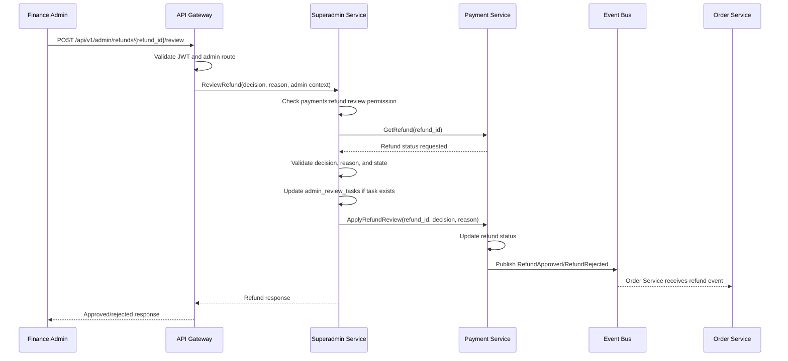
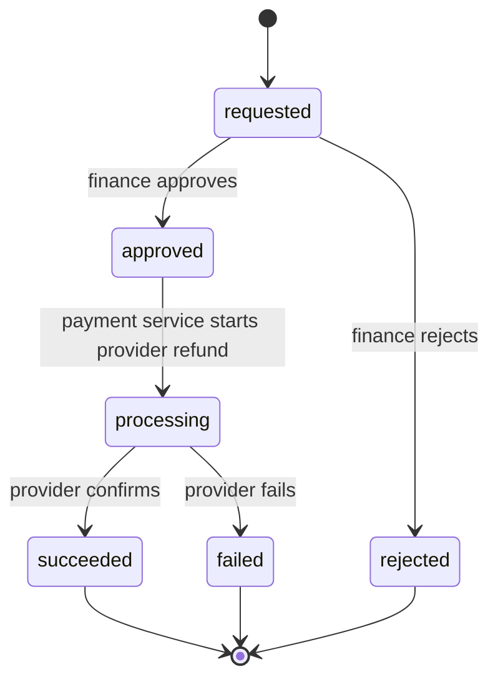
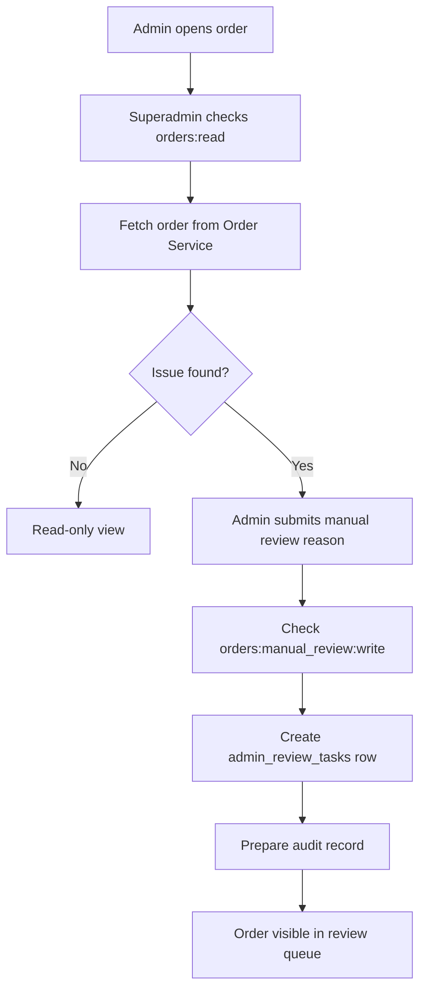
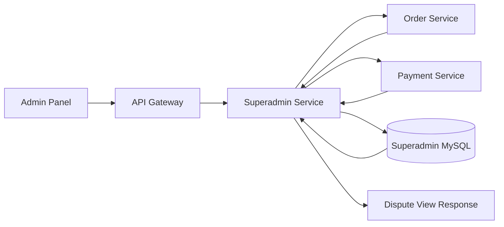

# 🛡️ Superadmin Service - Task 5: Order/Payment Controls


## 📌 Task Summary

| Field | Detail |
|---|---|
| Task Name | Order/payment controls |
| Source | `docs/01-micro-tasks.md` -> `Superadmin Service` -> Task 5 |
| Goal | Refund approve, manual order status review, aur dispute view APIs banana |
| Dependency | Order Service and Payment Service |
| Priority | P1 |
| Output Type | Documentation-only implementation guide |
| Not Included | Session visibility, platform settings, final immutable audit-log service, provider refund SDK implementation, frontend panel |

> **Simple Hinglish goal:** Is task ka kaam Superadmin Service me order aur payment related admin workflows define karna hai. Admin orders/payments dekh sakega, finance admin refund approve/reject kar sakega, operations admin order ko manual review queue me daal sakega, aur dispute view ke liye order + payment context ek jagah mil sakega.

---

## ✅ Final Output Created

```text
TaskImplementation/
└── Superadmin Service/
    ├── task1.md
    ├── task2.md
    ├── task3.md
    ├── task4.md
    └── task5.md
```

### Why this structure?

| Folder/File | Purpose |
|---|---|
| `TaskImplementation/` | Saare task-wise implementation guides ka central location |
| `Superadmin Service/` | Superadmin Service ke tasks ko logically group karta hai |
| `task1.md` | Admin domain boundaries define karta hai |
| `task2.md` | Superadmin Service ke liye MySQL decision explain karta hai |
| `task3.md` | Admin RBAC roles and permissions define karta hai |
| `task4.md` | User/seller controls guide |
| `task5.md` | Sirf **Superadmin Service - Task 5** ka order/payment controls guide |

> 🟢 **Important:** `Superadmin Service` folder already present tha, isliye usko keep kiya gaya. Is task me backend source code, proto files, DB migrations, ya frontend pages create nahi kiye gaye. Ye implementation guide hai.

---

## 📚 Documents Studied

| Document | Kya use kiya gaya |
|---|---|
| `docs/01-micro-tasks.md` | Task 5 ka exact scope: refund approve, manual order status review, dispute view APIs |
| `docs/04-microservice-design.md` | Superadmin, Order, aur Payment Service responsibilities, APIs, internal logic |
| `docs/05-database-design.md` | Order, Payment, Refund, Superadmin review task, audit-log table direction |
| `docs/06-auth-security.md` | `payment:refund:review`, admin mutation rate limit, RBAC enforcement |
| `docs/07-payment-system.md` | Refund flow, payment state machine, idempotency, reconciliation and security |
| `docs/09-cms-superadmin.md` | Superadmin modules, refund review workflow, high-risk controls |
| `api/master-api.json` | Existing admin routes and schema names for orders, payments, and refund review |
| `database/draw.sql` | Reference statuses for `orders`, `payments`, `refunds`, and `admin_review_tasks` |
| `TaskImplementation/Superadmin Service/task1.md` | Domain ownership and high-risk action rules |
| `TaskImplementation/Superadmin Service/task2.md` | MySQL review task and audit storage direction |
| `TaskImplementation/Superadmin Service/task3.md` | RBAC permission keys for order/payment controls |
| `TaskImplementation/Superadmin Service/task4.md` | Existing task documentation style and service boundary style |

---

## 🧭 Implementation Approach

Task 5 ko **admin workflow orchestration** treat kiya gaya. Superadmin Service khud order ya payment ka source of truth nahi banega.

### Final decision

```text
Order source of truth: Order Service
Payment/refund source of truth: Payment Service
Admin workflow owner: Superadmin Service
Review queue storage: Superadmin MySQL admin_review_tasks
Security: Task 3 RBAC permissions
Audit direction: admin mutation audit record, final immutable audit writer Task 8 me
```

### One-line reason

Order/payment workflows financial and operational risk wale hain, isliye Superadmin Service permission check, reason validation, review task update, aur downstream service coordination karegi. Actual order/payment tables ko direct update nahi karegi.

---

## 🪜 Step-by-Step Implementation

## Step 1: Task Boundary Clear Kiya

`docs/01-micro-tasks.md` me Superadmin Service Task 5 ye hai:

| S.No | Task Name | Detail | Dependency | Priority |
|---:|---|---|---|---|
| 5 | Order/payment controls | Refund approve, manual order status review, dispute view APIs banao. | Order and Payment | P1 |

### Is task me allowed work

- Admin order search/list flow define karna
- Admin payment search/list flow define karna
- Refund approve/reject review flow define karna
- Manual order review queue flow define karna
- Dispute view aggregation API design karna
- Order Service and Payment Service ke gRPC/client boundaries explain karna
- RBAC permissions and high-risk guards apply karna
- Reason, validation, idempotency, audit context explain karna
- Code examples dena for handlers, usecases, clients, and tests

### Is task me not allowed work

| Area | Reason |
|---|---|
| User block / seller approve APIs | Ye **Task 4: User/seller controls** ka scope hai |
| Session analytics access | Ye **Task 6: Session visibility** ka scope hai |
| Platform settings | Ye **Task 7: Platform settings** ka scope hai |
| Full immutable audit-log production implementation | Ye **Task 8: Admin audit logs** ka scope hai |
| Payment provider SDK integration | Payment Service ka internal responsibility hai |
| Direct order/payment DB mutation | Microservice ownership rule ke against hai |
| Superadmin frontend pages | Ye Superadmin Panel tasks ka scope hai |

> 🔴 **Boundary rule:** Superadmin Service `order_db` ya `payment_db` me direct SQL update nahi karegi. Order updates Order Service ke through, aur refund/payment updates Payment Service ke through honge.

---

## Step 2: Existing API Surface Identify Kiya

`api/master-api.json` ke according admin order/payment related routes:

| REST API | Service Mapping | gRPC Method | Auth | Purpose |
|---|---|---|---|---|
| `GET /api/v1/admin/orders` | `order-service` | `OrderService.ListOrders` | `admin` | Admin order search/list |
| `GET /api/v1/admin/payments` | `payment-service` | `PaymentService.ListPayments` | `admin` | Admin payment search/list |
| `POST /api/v1/admin/refunds/{refund_id}/review` | `superadmin-service` | `SuperadminService.ReviewRefund` | `admin` | Refund approve/reject |

### Task 5 recommended service-level additions

Existing master API me refund review route already hai. Manual review and dispute view Task 5 ke scope me aate hain, isliye implementation phase me ye APIs add ki ja sakti hain:

| Recommended API | Owner | Purpose |
|---|---|---|
| `POST /api/v1/admin/orders/{order_id}/manual-review` | Superadmin Service | Order ko admin review queue me add karna |
| `GET /api/v1/admin/orders/{order_id}/dispute-view` | Superadmin Service | Order + payment + refund + review context ek response me dena |

> 🟡 **Note:** Is markdown task me `api/master-api.json` modify nahi kiya gaya, kyunki output sirf `task5.md` required hai. Ye routes implementation guide ke proposed Task 5 additions hain.

### Existing schemas

```json
{
  "AdminOrderListRequest": {
    "status": "paid",
    "user_id": "user_123",
    "seller_id": "seller_456",
    "page": 1,
    "page_size": 20
  },
  "AdminPaymentListRequest": {
    "status": "captured",
    "provider": "stripe",
    "order_id": "ord_123",
    "page": 1,
    "page_size": 20
  },
  "RefundReviewRequest": {
    "refund_id": "refund_123",
    "decision": "approved",
    "reason": "Duplicate charge verified by finance team"
  }
}
```

---

## Step 3: Permissions Map Kiye

Task 3 RBAC ke permissions yaha reuse honge.

| Action | Required Permission | Allowed Roles |
|---|---|---|
| List/search orders | `orders:read` | `superadmin`, `operations_admin`, `readonly_admin` |
| View order dispute context | `orders:read` | `superadmin`, `operations_admin`, `readonly_admin` |
| Mark order for manual review | `orders:manual_review:write` | `superadmin`, `operations_admin` |
| List/search payments | `payments:read` | `superadmin`, `finance_admin` |
| Review refund approve/reject | `payments:refund:review` | `superadmin`, `finance_admin` |

### Important RBAC rules

| Role | Allowed | Not Allowed |
|---|---|---|
| `superadmin` | All Task 5 actions | None |
| `operations_admin` | Order read, dispute view, manual review | Refund review, payment lookup |
| `finance_admin` | Payment lookup, refund review | Manual order review |
| `readonly_admin` | Order read/dispute view | Mutations and finance data |
| `catalog_admin` | No Task 5 access by default | Order/payment controls |

> 🟡 **Beginner note:** Admin route access and exact permission same cheez nahi hai. Gateway `admin` check karega, but Superadmin Service exact permission like `payments:refund:review` enforce karegi.

---

## Step 4: Data Ownership Rules Apply Kiye

### Ownership matrix

| Data | Source of Truth | Superadmin Service ka role |
|---|---|---|
| Order status | Order Service | Read context, request safe review/status action |
| Order status history | Order Service | Dispute view me show karna |
| Payment status | Payment Service | Read context |
| Refund record | Payment Service | Review decision coordinate karna |
| Provider refund call | Payment Service | Direct call nahi karega |
| Admin review queue | Superadmin Service | `admin_review_tasks` me store karega |
| Admin audit draft | Superadmin Service | Audit payload prepare karega |

### Correct vs wrong

```text
Correct:
Superadmin Service -> Payment Service gRPC -> Review refund decision

Wrong:
Superadmin Service -> payment_db.refunds table direct update
```

```text
Correct:
Superadmin Service -> Order Service gRPC -> Get order and status history

Wrong:
Superadmin Service -> order_db.orders table direct update
```

---

## Step 5: Status Models Final Kiye

Reference `database/draw.sql` ke status values:

### Order statuses

| Status | Meaning | Admin interpretation |
|---|---|---|
| `created` | Order record created | Early order state |
| `pending_payment` | Payment pending | Payment follow-up possible |
| `paid` | Payment successful | Fulfillment can proceed |
| `packed` | Packed by seller/warehouse | Shipment phase |
| `shipped` | Shipped | Delivery tracking phase |
| `delivered` | Delivered | Refund/return disputes possible |
| `cancelled` | Cancelled | Refund may be required if paid |
| `refunded` | Refunded | Financial closure |
| `payment_failed` | Payment failed | Retry or support |

### Payment statuses

| Status | Meaning |
|---|---|
| `initiated` | Payment flow started |
| `requires_action` | User/provider action needed |
| `authorized` | Payment authorized |
| `captured` | Money captured |
| `failed` | Payment failed |
| `refunded` | Full refund completed |
| `partially_refunded` | Partial refund completed |

### Refund statuses

| Status | Meaning | Review action |
|---|---|---|
| `requested` | Refund request created | Admin can approve/reject |
| `approved` | Admin approved | Payment Service can process |
| `rejected` | Admin rejected | Closed |
| `processing` | Provider refund in progress | No duplicate review |
| `succeeded` | Provider refund success | Closed |
| `failed` | Provider refund failed | Finance follow-up |

### Admin review task statuses

| Status | Meaning |
|---|---|
| `open` | Review pending |
| `approved` | Admin approved |
| `rejected` | Admin rejected |
| `cancelled` | Review task cancelled/no longer needed |

---

## Step 6: Refund Review Flow Build Kiya

Refund review Task 5 ka highest-risk action hai.

### Refund review rules

| Rule | Detail |
|---|---|
| Permission | `payments:refund:review` required |
| Allowed roles | `superadmin`, `finance_admin` |
| Reason | Mandatory, non-empty, audit-friendly |
| Allowed decisions | `approved`, `rejected` |
| Allowed refund status | Only `requested` refund can be reviewed |
| Idempotency | Same refund decision repeat safe hona chahiye |
| Audit | actor, decision, refund id, reason, before/after summary |
| Provider call | Payment Service handles actual provider refund |

### Refund review sequence



### Refund state machine



### Refund review request example

```json
{
  "decision": "approved",
  "reason": "Order cancelled after payment capture, refund verified against support ticket SUP-8842"
}
```

### Refund review response example

```json
{
  "refund_id": "refund_123",
  "payment_id": "pay_123",
  "status": "approved",
  "amount": {
    "currency": "INR",
    "amount": 249900
  },
  "reason": "Order cancelled after payment capture"
}
```

---

## Step 7: Manual Order Status Review Flow Build Kiya

Manual review ka matlab admin direct arbitrary order status overwrite nahi karega. Safer MVP me admin order ko review queue me mark karega, reason dega, aur Order Service se latest context read karega.

### Manual review use cases

| Case | Example |
|---|---|
| Payment mismatch | Payment captured hai but order `pending_payment` me stuck hai |
| Fulfillment delay | Order `paid` hai but long time se packed/shipped nahi hua |
| Dispute | Buyer/seller ne order issue raise kiya |
| Fraud/risk | Suspicious order pattern |
| Refund follow-up | Refund requested but order status unclear hai |

### Manual review rules

| Rule | Detail |
|---|---|
| Permission | `orders:manual_review:write` required |
| Allowed roles | `superadmin`, `operations_admin` |
| Reason | Mandatory |
| Storage | `admin_review_tasks` with `task_type = order_manual_review` |
| Resource | `resource_type = order`, `resource_id = order_id` |
| Direct DB update | Not allowed |
| Actual order correction | Order Service safe API/status transition validator ke through |

### Manual review flow



### Manual review task example

```json
{
  "task_type": "order_manual_review",
  "resource_type": "order",
  "resource_id": "ord_123",
  "status": "open",
  "reason": "Payment captured but order status is still pending_payment",
  "metadata": {
    "current_order_status": "pending_payment",
    "payment_status": "captured",
    "category": "payment_mismatch"
  }
}
```

---

## Step 8: Dispute View API Build Kiya

Dispute view read-only composite response hai. Isme admin ko order, payment, refunds, status history, aur review tasks ek jagah dikhte hain.

### Why dispute view?

Normal order page sirf order data dikha sakta hai. Dispute solve karne ke liye admin ko ye context chahiye:

- Order current status
- Order status history
- Payment status
- Refund requests
- Refund review decisions
- Manual review tasks
- Amount mismatch indicators
- Timeline of important events

### Dispute view architecture



### Recommended dispute view API

```http
GET /api/v1/admin/orders/{order_id}/dispute-view
Authorization: Bearer <admin_access_token>
```

### Response example

```json
{
  "order": {
    "order_id": "ord_123",
    "status": "paid",
    "user_id": "user_123",
    "total_amount": {
      "currency": "INR",
      "amount": 249900
    }
  },
  "payments": [
    {
      "payment_id": "pay_123",
      "status": "captured",
      "amount": {
        "currency": "INR",
        "amount": 249900
      }
    }
  ],
  "refunds": [
    {
      "refund_id": "refund_123",
      "status": "requested",
      "amount": {
        "currency": "INR",
        "amount": 249900
      },
      "reason": "Buyer requested cancellation"
    }
  ],
  "review_tasks": [
    {
      "task_id": "task_123",
      "task_type": "order_manual_review",
      "status": "open",
      "reason": "Payment captured but fulfillment delayed"
    }
  ],
  "risk_flags": [
    "refund_requested",
    "fulfillment_delay"
  ]
}
```

> 🟡 **Beginner note:** Dispute view ke liye new `disputes` table mandatory nahi hai. MVP me existing Order/Payment data + `admin_review_tasks` se enough context mil sakta hai.

---

## Step 9: Service Contracts Design Kiye

### Superadmin Service methods

```text
ReviewRefund
MarkOrderManualReview
GetOrderDisputeView
```

### Downstream clients

```go
package clients

import "context"

type OrderClient interface {
    GetOrder(ctx context.Context, orderID string) (*OrderSnapshot, error)
    GetOrderStatusHistory(ctx context.Context, orderID string) ([]OrderStatusEvent, error)
}

type PaymentClient interface {
    GetRefund(ctx context.Context, refundID string) (*RefundSnapshot, error)
    ApplyRefundReview(ctx context.Context, req ApplyRefundReviewRequest) (*RefundSnapshot, error)
    ListPaymentsForOrder(ctx context.Context, orderID string) ([]PaymentSnapshot, error)
    ListRefundsForPayment(ctx context.Context, paymentID string) ([]RefundSnapshot, error)
}
```

### Explanation

- `OrderClient` order data read karega.
- `PaymentClient` refund/payment data read and refund decision apply karega.
- Superadmin Service downstream DB details nahi jaanta.
- Testing me fake clients use karna easy hoga.

---

## Step 10: Domain Models Banaye

```go
package domain

type RefundDecision string

const (
    RefundDecisionApproved RefundDecision = "approved"
    RefundDecisionRejected RefundDecision = "rejected"
)

type AdminActor struct {
    AdminID       string
    Roles         []string
    Permissions   []string
    SessionID     string
    RequestID     string
    IPHash        string
    MFAVerified   bool
}

type RefundReviewCommand struct {
    RefundID string
    Decision RefundDecision
    Reason   string
    Actor    AdminActor
}

type ManualOrderReviewCommand struct {
    OrderID   string
    Category  string
    Reason    string
    Actor     AdminActor
}
```

### Explanation

- `RefundDecision` enum allowed decision values restrict karta hai.
- `AdminActor` audit and permission ke liye context carry karta hai.
- Command structs handler se usecase tak clean input pass karte hain.

---

## Step 11: Validation Rules Add Kiye

### Refund review validation

```go
func ValidateRefundReview(cmd RefundReviewCommand) error {
    if cmd.RefundID == "" {
        return ErrRefundIDRequired
    }
    if cmd.Decision != RefundDecisionApproved && cmd.Decision != RefundDecisionRejected {
        return ErrInvalidRefundDecision
    }
    if len(cmd.Reason) < 10 {
        return ErrReasonTooShort
    }
    return nil
}
```

### Manual order review validation

```go
func ValidateManualOrderReview(cmd ManualOrderReviewCommand) error {
    if cmd.OrderID == "" {
        return ErrOrderIDRequired
    }
    if len(cmd.Reason) < 10 {
        return ErrReasonTooShort
    }
    switch cmd.Category {
    case "payment_mismatch", "fulfillment_delay", "refund_followup", "fraud_risk", "customer_dispute":
        return nil
    default:
        return ErrInvalidReviewCategory
    }
}
```

### Why validation important hai?

| Validation | Reason |
|---|---|
| ID required | Wrong/empty resource action prevent hota hai |
| Decision enum | Random status value DB/API me nahi jata |
| Reason length | Audit log useful banta hai |
| Category enum | Review queue filterable banti hai |

---

## Step 12: Usecase Logic Implement Kiya

### Refund review usecase example

```go
package usecase

func (uc *OrderPaymentControls) ReviewRefund(ctx context.Context, cmd domain.RefundReviewCommand) (*domain.RefundSnapshot, error) {
    if err := domain.ValidateRefundReview(cmd); err != nil {
        return nil, err
    }

    if !uc.rbac.HasPermission(cmd.Actor, "payments:refund:review") {
        return nil, ErrForbidden
    }

    refund, err := uc.payment.GetRefund(ctx, cmd.RefundID)
    if err != nil {
        return nil, err
    }

    if refund.Status != "requested" {
        return nil, ErrRefundNotReviewable
    }

    reviewed, err := uc.payment.ApplyRefundReview(ctx, clients.ApplyRefundReviewRequest{
        RefundID:  cmd.RefundID,
        Decision:  string(cmd.Decision),
        Reason:    cmd.Reason,
        ReviewedBy: cmd.Actor.AdminID,
        RequestID: cmd.Actor.RequestID,
    })
    if err != nil {
        return nil, err
    }

    _ = uc.audit.Prepare(ctx, AuditDraft{
        ActorAdminID: cmd.Actor.AdminID,
        Action:       "refund.review",
        ResourceType: "refund",
        ResourceID:   cmd.RefundID,
        Reason:       cmd.Reason,
        Before:       refund,
        After:        reviewed,
        RequestID:    cmd.Actor.RequestID,
    })

    return reviewed, nil
}
```

### Explanation

1. Input validate hota hai.
2. RBAC exact permission check hota hai.
3. Refund latest state Payment Service se fetch hoti hai.
4. Sirf `requested` refund reviewable hota hai.
5. Decision Payment Service ko pass hota hai.
6. Audit draft prepare hota hai.

> 🟡 **Note:** `_ = uc.audit.Prepare(...)` sirf example hai. Production me audit failure handling policy Task 8 me final hogi.

---

## Step 13: Manual Review Usecase Implement Kiya

```go
package usecase

func (uc *OrderPaymentControls) MarkOrderManualReview(ctx context.Context, cmd domain.ManualOrderReviewCommand) (*domain.ReviewTask, error) {
    if err := domain.ValidateManualOrderReview(cmd); err != nil {
        return nil, err
    }

    if !uc.rbac.HasPermission(cmd.Actor, "orders:manual_review:write") {
        return nil, ErrForbidden
    }

    order, err := uc.order.GetOrder(ctx, cmd.OrderID)
    if err != nil {
        return nil, err
    }

    task := domain.ReviewTask{
        TaskType:     "order_manual_review",
        ResourceType: "order",
        ResourceID:   cmd.OrderID,
        Status:       "open",
        Reason:       cmd.Reason,
        CreatedBy:    cmd.Actor.AdminID,
        Metadata: map[string]any{
            "category":             cmd.Category,
            "current_order_status": order.Status,
            "order_total":          order.TotalAmount,
        },
    }

    created, err := uc.reviewTasks.Create(ctx, task)
    if err != nil {
        return nil, err
    }

    _ = uc.audit.Prepare(ctx, AuditDraft{
        ActorAdminID: cmd.Actor.AdminID,
        Action:       "order.manual_review.create",
        ResourceType: "order",
        ResourceID:   cmd.OrderID,
        Reason:       cmd.Reason,
        After:        created,
        RequestID:    cmd.Actor.RequestID,
    })

    return created, nil
}
```

### Explanation

Manual review ek safe admin marker hai. Isse order ka actual business status change nahi hota. Review task create hota hai jise operations team investigate kar sakti hai.

---

## Step 14: Dispute View Usecase Implement Kiya

```go
package usecase

func (uc *OrderPaymentControls) GetOrderDisputeView(ctx context.Context, actor domain.AdminActor, orderID string) (*domain.DisputeView, error) {
    if !uc.rbac.HasPermission(actor, "orders:read") {
        return nil, ErrForbidden
    }

    order, err := uc.order.GetOrder(ctx, orderID)
    if err != nil {
        return nil, err
    }

    history, err := uc.order.GetOrderStatusHistory(ctx, orderID)
    if err != nil {
        return nil, err
    }

    payments, err := uc.payment.ListPaymentsForOrder(ctx, orderID)
    if err != nil {
        return nil, err
    }

    reviewTasks, err := uc.reviewTasks.ListByResource(ctx, "order", orderID)
    if err != nil {
        return nil, err
    }

    return domain.BuildDisputeView(order, history, payments, reviewTasks), nil
}
```

### Explanation

Dispute view aggregation me multiple services ka data combine hota hai, but Superadmin Service source data own nahi karta. Ye sirf admin-friendly response assemble karta hai.

---

## Step 15: Repository Layer Define Kiya

Task 5 me Superadmin Service ko mainly `admin_review_tasks` table chahiye.

### Required repository methods

```go
type ReviewTaskRepository interface {
    Create(ctx context.Context, task domain.ReviewTask) (*domain.ReviewTask, error)
    GetByResource(ctx context.Context, resourceType string, resourceID string) ([]domain.ReviewTask, error)
    MarkApproved(ctx context.Context, taskID string, actorID string, reason string) error
    MarkRejected(ctx context.Context, taskID string, actorID string, reason string) error
}
```

### SQL insert example

```sql
INSERT INTO admin_review_tasks (
  task_id,
  task_type,
  resource_type,
  resource_id,
  status,
  created_by,
  reason,
  metadata
) VALUES (?, ?, ?, ?, 'open', ?, ?, ?);
```

### Indexes used

| Index | Purpose |
|---|---|
| `uk_admin_review_tasks_task_id` | Task id duplicate prevent |
| `idx_review_tasks_status_type` | Open review queue fast filter |
| `idx_review_tasks_resource` | Order/refund dispute context lookup |

---

## Step 16: Error Handling Standard Banaya

| Case | HTTP/gRPC style | Message |
|---|---|---|
| Missing reason | `400 INVALID_ARGUMENT` | `reason is required` |
| Invalid refund decision | `400 INVALID_ARGUMENT` | `decision must be approved or rejected` |
| Admin permission missing | `403 PERMISSION_DENIED` | `missing required permission` |
| Refund not found | `404 NOT_FOUND` | `refund not found` |
| Order not found | `404 NOT_FOUND` | `order not found` |
| Refund already reviewed | `409 FAILED_PRECONDITION` | `refund is not in requested state` |
| Downstream service timeout | `503 UNAVAILABLE` | `payment service unavailable` |
| Duplicate manual review task | `409 ALREADY_EXISTS` | `open review task already exists` |

### Error response example

```json
{
  "error": {
    "code": "REFUND_NOT_REVIEWABLE",
    "message": "Refund is already processing and cannot be reviewed again",
    "request_id": "req_123"
  }
}
```

---

## Step 17: Security Controls Add Kiye

| Control | Apply kahan hota hai |
|---|---|
| JWT validation | API Gateway |
| Exact permission check | Superadmin Service |
| Admin mutation rate limit | Gateway/Redis |
| Reason required | Superadmin Service validation |
| MFA recommended | Refund review and high-risk manual action |
| Audit draft | Every mutation |
| PII redaction | Logs and dispute response |
| Provider secrets redaction | Payment Service only |

### High-risk guard example

```go
func RequireHighRiskGuard(actor domain.AdminActor, reason string) error {
    if !actor.MFAVerified {
        return ErrMFARequired
    }
    if len(reason) < 10 {
        return ErrReasonTooShort
    }
    return nil
}
```

> 🔴 **Security note:** Refund review me card data, provider secret, raw webhook payload, ya sensitive payment token Superadmin response me expose nahi hona chahiye.

---

## Step 18: External Libraries / Tools

Is documentation task ke liye koi external library install nahi ki gayi. Actual implementation phase me project ke existing backend stack ke hisaab se ye tools use honge.

| Tool/Library | What it is | Why used | Install | Basic use |
|---|---|---|---|---|
| Go | Backend language | Superadmin, Order, Payment services implement karne ke liye | `go version` se verify, official Go installer se install | `go test ./...` |
| MySQL 8.x | Relational database | `admin_review_tasks`, audit, orders, payments jaise structured data ke liye | Docker Compose ya `mysql:8` image | DSN se service connect karegi |
| gRPC + Protobuf | Internal service contract | Superadmin -> Order/Payment typed calls ke liye | `go install google.golang.org/protobuf/cmd/protoc-gen-go@latest` | `.proto` se Go clients generate |
| `github.com/go-sql-driver/mysql` | Go MySQL driver | MySQL connection ke liye | `go get github.com/go-sql-driver/mysql` | `database/sql` ke saath use |
| `golang-migrate/migrate` | DB migration tool | Schema migrations versioned run karne ke liye | `go install github.com/golang-migrate/migrate/v4/cmd/migrate@latest` | `migrate up` |
| Kafka/RabbitMQ | Event bus | Refund events Order/Notification services tak pahunchane ke liye | Existing local compose stack me run | Payment Service refund events publish karega |
| Redis | Rate limit/cache | Admin mutation rate limit ke liye | Existing local compose stack me run | Gateway/admin limiter use karega |

### Important clarification

Payment provider SDKs like Stripe/Razorpay Superadmin Service me directly use nahi honge. Provider refund API call Payment Service handle karega. Superadmin Service sirf review decision pass karega.

---

## Step 19: Recommended Folder Structure

Actual output sirf markdown guide hai. Future code implementation ke liye clean structure:

```text
backend/services/superadmin-service/
├── cmd/
│   └── server/
│       └── main.go
├── internal/
│   ├── clients/
│   │   ├── order_client.go
│   │   └── payment_client.go
│   ├── domain/
│   │   ├── admin_actor.go
│   │   ├── dispute_view.go
│   │   ├── refund_review.go
│   │   └── review_task.go
│   ├── repository/
│   │   └── review_task_repository.go
│   ├── transport/
│   │   └── grpc/
│   │       └── superadmin_handler.go
│   └── usecase/
│       └── order_payment_controls.go
├── migrations/
│   └── 000x_admin_review_tasks.sql
└── tests/
    ├── refund_review_test.go
    ├── manual_order_review_test.go
    └── dispute_view_test.go
```

### Folder purpose

| Folder | Purpose |
|---|---|
| `clients/` | Order and Payment Service gRPC clients |
| `domain/` | Pure business models and validation |
| `repository/` | Superadmin MySQL review task storage |
| `transport/grpc/` | gRPC handlers |
| `usecase/` | Task 5 workflow orchestration |
| `migrations/` | Future schema changes |
| `tests/` | Unit and integration tests |

---

## Step 20: Testing Plan Banaya

### Unit tests

| Test | Expected |
|---|---|
| `finance_admin` can approve refund | Pass |
| `operations_admin` cannot approve refund | Forbidden |
| Missing refund reason | Validation error |
| Invalid decision `maybe` | Validation error |
| Refund status `processing` reviewed again | Conflict |
| Manual review with valid reason | Review task created |
| Readonly admin creates manual review | Forbidden |
| Dispute view with order permission | Aggregated response |

### Test example

```go
func TestFinanceAdminCanReviewRefund(t *testing.T) {
    actor := domain.AdminActor{
        AdminID:     "admin_fin_1",
        Permissions: []string{"payments:refund:review"},
        MFAVerified: true,
    }

    cmd := domain.RefundReviewCommand{
        RefundID: "refund_123",
        Decision: domain.RefundDecisionApproved,
        Reason:   "Duplicate payment verified",
        Actor:    actor,
    }

    got, err := usecase.ReviewRefund(context.Background(), cmd)

    require.NoError(t, err)
    require.Equal(t, "approved", got.Status)
}
```

### Integration tests

| Test | What to verify |
|---|---|
| Superadmin -> Payment fake service | Refund decision request payload correct |
| Superadmin -> Order fake service | Dispute view fetches order + history |
| Review task DB insert | `admin_review_tasks` row created |
| Audit draft | actor/action/resource/reason present |
| Timeout handling | Downstream unavailable maps to 503 |

---

## Step 21: Observability Add Kiya

| Signal | Fields |
|---|---|
| Log | `request_id`, `actor_admin_id`, `action`, `resource_type`, `resource_id`, `decision` |
| Metric | `superadmin_refund_review_total{decision}` |
| Metric | `superadmin_manual_review_created_total{category}` |
| Metric | `superadmin_dispute_view_latency_ms` |
| Trace | Gateway -> Superadmin -> Order/Payment gRPC |
| Alert | Refund review failures spike |

### Log example

```json
{
  "level": "info",
  "event": "refund_review_completed",
  "request_id": "req_123",
  "actor_admin_id": "admin_fin_1",
  "refund_id": "refund_123",
  "decision": "approved"
}
```

---

## ✅ Final Checklist

| Check | Status |
|---|---|
| Task 5 exact scope identified | ✅ Done |
| Existing `Superadmin Service` folder kept | ✅ Done |
| `task5.md` created | ✅ Done |
| Step-by-step Hinglish guide added | ✅ Done |
| External tools/libraries documented | ✅ Done |
| Folder structure included | ✅ Done |
| Code examples included | ✅ Done |
| Mermaid diagrams included | ✅ Done |
| Scope limited to Superadmin Service Task 5 | ✅ Done |

---

## 🧾 Task 5 Completion Summary

Task 5 me Superadmin Service ke order/payment controls ka complete guide define kiya gaya:

- Admin order and payment read flows
- Refund approve/reject workflow
- Manual order review queue
- Dispute view aggregation
- RBAC permissions
- Data ownership boundaries
- Validation, error handling, security, testing, and observability

> 🟢 **Task 5 complete:** Ab Superadmin Service order/payment workflows ko safely design kar chuka hai. Actual production implementation me Order Service aur Payment Service ke gRPC contracts ke saath ye usecases code me convert kiye ja sakte hain.
