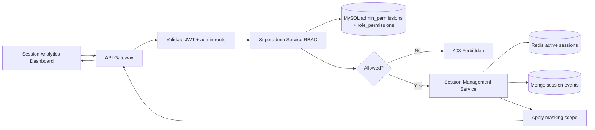
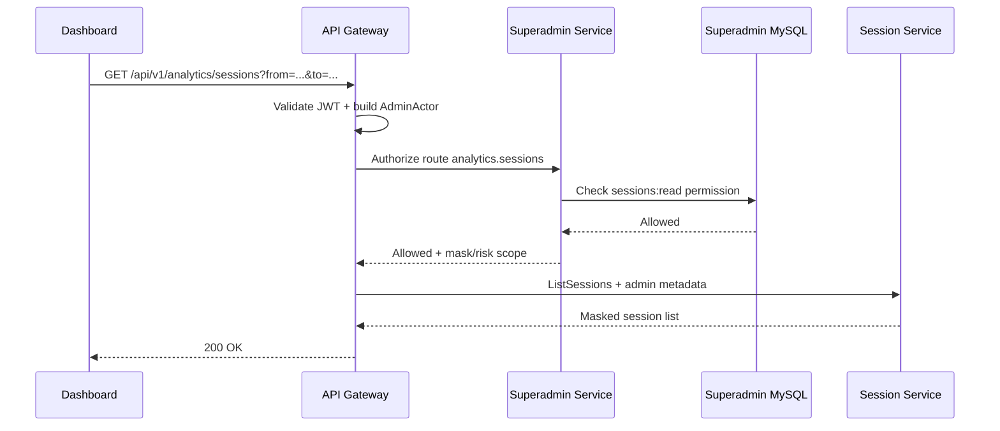
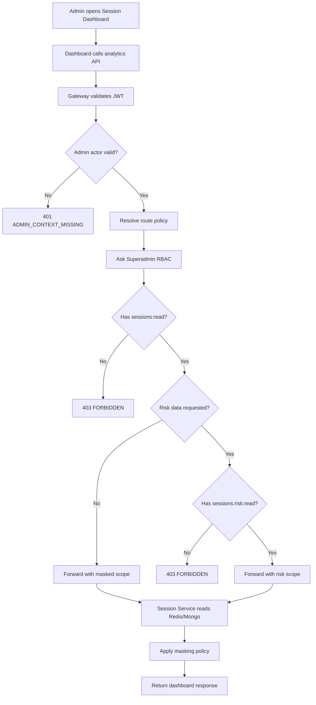

# 🛡️ Superadmin Service - Task 6: Session Visibility


## 📌 Task Summary

| Field | Detail |
|---|---|
| Task Name | Session visibility |
| Source | `docs/01-micro-tasks.md` -> `Superadmin Service` -> Task 6 |
| Goal | Session analytics dashboard ko admin-level access control dena |
| Dependency | Session Management Service |
| Priority | P2 |
| Output Type | Documentation-only implementation guide |
| Not Included | Session event ingestion, analytics aggregation engine, heatmap calculation, frontend dashboard UI, platform settings, final immutable audit-log service |

> **Simple Hinglish goal:** Is task ka kaam ye define karna hai ki Superadmin Service session analytics dashboard ke routes par exact admin permission kaise enforce karegi. Session data ka owner **Session Management Service** rahega, but kaun admin live sessions, journey, funnel, heatmap, ya suspicious activity dekh sakta hai ye control **Superadmin RBAC** karega.

---

## ✅ Final Output Created

```text
TaskImplementation/
└── Superadmin Service/
    ├── task1.md
    ├── task2.md
    ├── task3.md
    ├── task4.md
    ├── task5.md
    └── task6.md
```

### Why this structure?

| Folder/File | Purpose |
|---|---|
| `TaskImplementation/` | Saare task-wise implementation guides ka central location |
| `Superadmin Service/` | Superadmin Service ke tasks ko logically group karta hai |
| `task1.md` | Admin domain boundaries define karta hai |
| `task2.md` | Superadmin Service ke liye MySQL decision explain karta hai |
| `task3.md` | Admin RBAC roles and permissions define karta hai |
| `task4.md` | User/seller controls guide |
| `task5.md` | Order/payment controls guide |
| `task6.md` | Sirf **Superadmin Service - Task 6** ka session visibility access-control guide |

> 🟢 **Important:** `Superadmin Service` folder already present tha, isliye usko keep kiya gaya. Is task me backend source code, DB migration, proto file, ya frontend page create nahi kiye gaye. Ye beginner-friendly implementation guide hai.

---

## 📚 Documents Studied

| Document | Kya use kiya gaya |
|---|---|
| `docs/01-micro-tasks.md` | Task 6 ka exact scope: Session analytics dashboard ko admin level access control dena |
| `docs/08-session-management-system.md` | Session Service concepts, dashboard APIs, privacy, storage strategy |
| `docs/04-microservice-design.md` | Session Service ownership and Superadmin Service responsibilities |
| `docs/06-auth-security.md` | RBAC enforcement, secure session fields, PII masking rules |
| `docs/09-cms-superadmin.md` | Superadmin sessions module, suspicious activity, user journey visibility |
| `docs/10-frontend-implementation.md` | Session Analytics Dashboard and Superadmin Panel module expectations |
| `api/master-api.json` | Existing analytics routes, request schemas, response schemas, and `admin` auth marker |
| `TaskImplementation/Superadmin Service/task3.md` | Existing RBAC permission keys: `sessions:read`, `sessions:risk:read` |
| `TaskImplementation/Superadmin Service/task4.md` | Existing admin metadata forwarding pattern |
| `TaskImplementation/Superadmin Service/task5.md` | Existing cross-service admin workflow style |
| `backend/services/superadmin-service/internal/domain/permission.go` | Current permission constants already include session permissions |
| `backend/services/superadmin-service/internal/rbac/matrix.go` | Current role-permission mapping already grants session visibility to selected roles |
| `backend/services/superadmin-service/migrations/002_seed_admin_rbac.up.sql` | Current RBAC seed already includes session permissions |

---

## 🧭 Implementation Approach

Task 6 ko **session analytics access-control layer** treat kiya gaya. Iska matlab Superadmin Service session events store, aggregate, ya calculate nahi karegi. Wo sirf admin identity, role, permission, masking scope, aur downstream admin context control karegi.

### Final decision

```text
Session data source of truth: Session Management Service
Analytics routes exposed by: API Gateway
Exact admin permission owner: Superadmin Service RBAC
Dashboard consumer: Session Analytics Dashboard / Superadmin Panel
PII masking policy: Session Service response layer, driven by Superadmin permission
Audit direction: read access logs now, immutable audit-log feature Task 8 me
```

### One-line reason

Session analytics me user behavior, device info, journey events, aur risk signals hote hain. Ye sensitive data hai, isliye sirf `admin` route check kaafi nahi hai. Exact permission jaise `sessions:read` aur `sessions:risk:read` enforce karna zaruri hai.

---

## 🪜 Step-by-Step Implementation

## Step 1: Task Boundary Clear Kiya

`docs/01-micro-tasks.md` me Superadmin Service Task 6 ye hai:

| S.No | Task Name | Detail | Dependency | Priority |
|---:|---|---|---|---|
| 6 | Session visibility | Session analytics dashboard ko admin level access control do. | Session Service | P2 |

### Is task me allowed work

- Session analytics routes ke liye Superadmin permission policy define karna
- `sessions:read` and `sessions:risk:read` permissions apply karna
- Role-wise dashboard visibility rules define karna
- Gateway/Superadmin/Session Service flow document karna
- Admin context forwarding rules define karna
- PII masking rules define karna
- Read-only access logs and observability rules define karna
- Code examples dena for policies, usecase, middleware, masking, and tests

### Is task me not allowed work

| Area | Reason |
|---|---|
| Session event ingestion API banana | Ye Session Management Service ka scope hai |
| MongoDB/Redis session schema banana | Ye Session Service Task 1-2 ka scope hai |
| Journey/funnel/heatmap aggregation implement karna | Ye Session Service analytics APIs ka scope hai |
| Superadmin frontend dashboard banana | Ye Session Analytics Dashboard / Superadmin Panel task ka scope hai |
| User block/seller controls | Ye Task 4 ka scope hai |
| Refund/order controls | Ye Task 5 ka scope hai |
| Platform settings | Ye Task 7 ka scope hai |
| Final immutable audit-log table writer | Ye Task 8 ka scope hai |

> 🔴 **Boundary rule:** Superadmin Service session data ko direct MongoDB/Redis se read nahi karegi. Session data hamesha Session Management Service ke API/gRPC contract ke through aayega.

---

## Step 2: Existing Session APIs Identify Kiye

`api/master-api.json` and `docs/08-session-management-system.md` ke according analytics dashboard APIs:

| REST API | Owner Service | gRPC Method | Existing Auth Marker | Dashboard Use |
|---|---|---|---|---|
| `GET /api/v1/analytics/live` | Session Service | `SessionService.GetLiveMetrics` | `admin` | Live active users/sessions |
| `GET /api/v1/analytics/sessions` | Session Service | `SessionService.ListSessions` | `admin` | Session table/search |
| `GET /api/v1/analytics/sessions/{session_id}/journey` | Session Service | `SessionService.GetJourney` | `admin` | Journey explorer |
| `GET /api/v1/analytics/funnels` | Session Service | `SessionService.GetFunnelReport` | `admin` | Funnel report |
| `GET /api/v1/analytics/heatmaps` | Session Service | `SessionService.GetHeatmap` | `admin` | Heatmap view |

### Why existing `admin` marker enough nahi hai?

`admin` sirf broad route entry hai. Task 6 ka kaam exact Superadmin permission enforce karna hai.

Example:

| Admin Role | Should dashboard open? | Risk view allowed? |
|---|---:|---:|
| `superadmin` | ✅ Yes | ✅ Yes |
| `operations_admin` | ✅ Yes | ✅ Yes |
| `readonly_admin` | ✅ Yes | ❌ No |
| `finance_admin` | ❌ No | ❌ No |
| `catalog_admin` | ❌ No | ❌ No |

---

## Step 3: Permission Model Reuse Kiya

Task 3 me session permissions already define hain:

| Permission | Risk | Meaning |
|---|---|---|
| `sessions:read` | Medium | General session analytics dashboard dekh sakta hai |
| `sessions:risk:read` | High | Suspicious session, risk flags, device/IP risk signals dekh sakta hai |

### Role-permission mapping

| Role | `sessions:read` | `sessions:risk:read` | Reason |
|---|---:|---:|---|
| `superadmin` | ✅ | ✅ | Full platform access |
| `operations_admin` | ✅ | ✅ | Support/fraud investigation ke liye session context chahiye |
| `readonly_admin` | ✅ | ❌ | Read-only analytics, but risk/private details nahi |
| `finance_admin` | ❌ | ❌ | Finance ka scope payments/refunds hai |
| `catalog_admin` | ❌ | ❌ | Catalog/search moderation ka scope hai |

### Current code reference

Superadmin Service me ye permissions already present hain:

```go
const (
    PermissionSessionsRead    Permission = "sessions:read"
    PermissionSessionRiskRead Permission = "sessions:risk:read"
)
```

RBAC matrix me:

```go
domain.RoleSuperadmin: domain.KnownPermissions()

domain.RoleOperations: {
    domain.PermissionSessionsRead,
    domain.PermissionSessionRiskRead,
}

domain.RoleReadonly: {
    domain.PermissionSessionsRead,
}
```

> 🟡 **Beginner note:** Permission key exact action ko represent karti hai. Role sirf grouping hai. Isliye dashboard route par final check permission se hoga, sirf role se nahi.

---

## Step 4: Route Policy Define Kiya

Task 6 ka core piece route-policy map hai. Har analytics route ko required permission ke saath map karo.

| Route | Required Permission | Risk Scope | Response Masking |
|---|---|---|---|
| `GET /api/v1/analytics/live` | `sessions:read` | Normal | Aggregate-only, no raw identifiers |
| `GET /api/v1/analytics/sessions` | `sessions:read` | Normal | User/session identifiers masked by default |
| `GET /api/v1/analytics/sessions/{session_id}/journey` | `sessions:read` | Normal | Event properties sanitized |
| `GET /api/v1/analytics/funnels` | `sessions:read` | Normal | Aggregate-only |
| `GET /api/v1/analytics/heatmaps` | `sessions:read` | Normal | Aggregate coordinates only |
| Suspicious/risk filters, for example `risk=true` | `sessions:risk:read` | Sensitive | Risk details visible only to allowed roles |

### Code example: route policy registry

```go
package usecase

import "ecommerce/superadmin-service/internal/domain"

type SessionAnalyticsRoute string

const (
    RouteLiveMetrics SessionAnalyticsRoute = "analytics.live"
    RouteSessions    SessionAnalyticsRoute = "analytics.sessions"
    RouteJourney     SessionAnalyticsRoute = "analytics.journey"
    RouteFunnels     SessionAnalyticsRoute = "analytics.funnels"
    RouteHeatmaps    SessionAnalyticsRoute = "analytics.heatmaps"
)

type SessionVisibilityPolicy struct {
    Route              SessionAnalyticsRoute
    Permission         domain.Permission
    RiskPermission     domain.Permission
    MaskPIIByDefault   bool
    AllowExport        bool
}

var SessionVisibilityPolicies = map[SessionAnalyticsRoute]SessionVisibilityPolicy{
    RouteLiveMetrics: {
        Route:            RouteLiveMetrics,
        Permission:       domain.PermissionSessionsRead,
        RiskPermission:   domain.PermissionSessionRiskRead,
        MaskPIIByDefault: true,
    },
    RouteSessions: {
        Route:            RouteSessions,
        Permission:       domain.PermissionSessionsRead,
        RiskPermission:   domain.PermissionSessionRiskRead,
        MaskPIIByDefault: true,
    },
    RouteJourney: {
        Route:            RouteJourney,
        Permission:       domain.PermissionSessionsRead,
        RiskPermission:   domain.PermissionSessionRiskRead,
        MaskPIIByDefault: true,
    },
    RouteFunnels: {
        Route:            RouteFunnels,
        Permission:       domain.PermissionSessionsRead,
        RiskPermission:   domain.PermissionSessionRiskRead,
        MaskPIIByDefault: true,
    },
    RouteHeatmaps: {
        Route:            RouteHeatmaps,
        Permission:       domain.PermissionSessionsRead,
        RiskPermission:   domain.PermissionSessionRiskRead,
        MaskPIIByDefault: true,
    },
}
```

### Why route policy registry?

| Benefit | Explanation |
|---|---|
| Central control | Saare session dashboard route permissions ek jagah visible rahenge |
| Safer review | Future me route add ho to permission explicitly map karna padega |
| Testable | Unit test se verify kar sakte hain ki har route protected hai |
| Beginner-friendly | New developer ko route-to-permission mapping immediately samajh aayegi |

---

## Step 5: Architecture Flow Set Kiya

Task 6 ke liye recommended flow:



### Flow explanation in Hinglish

1. Dashboard API Gateway ko analytics request bhejta hai.
2. Gateway JWT validate karta hai and admin actor context banata hai.
3. Gateway/Superadmin integration exact permission check karta hai.
4. Superadmin Service MySQL RBAC se verify karti hai ki admin ko `sessions:read` ya `sessions:risk:read` permission hai ya nahi.
5. Agar permission missing hai to `403 Forbidden`.
6. Agar allowed hai to request Session Service ko forward hoti hai.
7. Session Service apne MongoDB/Redis se data laata hai.
8. Response admin permission ke hisaab se mask/sanitize hota hai.
9. Dashboard ko safe response milta hai.

---

## Step 6: Authorization Usecase Banaya

Superadmin Service me existing `AuthorizationService` already `RequirePermission` support karta hai. Task 6 ke liye ek thin usecase layer bana sakte hain jo session dashboard route ko permission se bind kare.

### Code example: session visibility usecase

```go
package usecase

import (
    "context"
    "fmt"

    "ecommerce/superadmin-service/internal/domain"
)

type SessionVisibilityAuthorizer interface {
    RequirePermission(ctx context.Context, actor domain.AdminActor, permission domain.Permission) error
    HasPermission(ctx context.Context, actor domain.AdminActor, permission domain.Permission) (bool, error)
}

type SessionVisibilityService struct {
    authz SessionVisibilityAuthorizer
}

func NewSessionVisibilityService(authz SessionVisibilityAuthorizer) (*SessionVisibilityService, error) {
    if authz == nil {
        return nil, fmt.Errorf("session visibility service requires authorizer")
    }
    return &SessionVisibilityService{authz: authz}, nil
}

type AuthorizeSessionAnalyticsRequest struct {
    Actor       domain.AdminActor
    Route       SessionAnalyticsRoute
    IncludeRisk bool
}

type AuthorizeSessionAnalyticsResult struct {
    Allowed             bool
    Permission          domain.Permission
    RiskAllowed         bool
    MaskPII             bool
    DownstreamHeaders   map[string]string
}

func (s *SessionVisibilityService) AuthorizeSessionAnalytics(
    ctx context.Context,
    req AuthorizeSessionAnalyticsRequest,
) (*AuthorizeSessionAnalyticsResult, error) {
    policy, ok := SessionVisibilityPolicies[req.Route]
    if !ok {
        return nil, domain.NewValidationError("unknown session analytics route")
    }

    if err := s.authz.RequirePermission(ctx, req.Actor, policy.Permission); err != nil {
        return &AuthorizeSessionAnalyticsResult{Allowed: false}, err
    }

    riskAllowed, err := s.authz.HasPermission(ctx, req.Actor, policy.RiskPermission)
    if err != nil {
        return &AuthorizeSessionAnalyticsResult{Allowed: false}, err
    }

    if req.IncludeRisk && !riskAllowed {
        return &AuthorizeSessionAnalyticsResult{Allowed: false}, domain.NewForbidden(policy.RiskPermission)
    }

    return &AuthorizeSessionAnalyticsResult{
        Allowed:     true,
        Permission:  policy.Permission,
        RiskAllowed: riskAllowed,
        MaskPII:     policy.MaskPIIByDefault && !riskAllowed,
        DownstreamHeaders: map[string]string{
            "x-admin-id":             req.Actor.AdminID,
            "x-admin-roles":          joinRoles(req.Actor.Roles),
            "x-admin-session-id":     req.Actor.SessionID,
            "x-admin-request-id":     req.Actor.RequestID,
            "x-admin-permission":     string(policy.Permission),
            "x-admin-risk-allowed":   boolString(riskAllowed),
            "x-admin-mask-pii":       boolString(policy.MaskPIIByDefault && !riskAllowed),
        },
    }, nil
}
```

### Explanation

| Part | Kya karta hai |
|---|---|
| `Route` | Dashboard ka logical route identify karta hai |
| `IncludeRisk` | Request risk/suspicious details maang rahi hai ya nahi |
| `RequirePermission` | Basic session dashboard access validate karta hai |
| `HasPermission` | Risk details ke liye extra permission check karta hai |
| `MaskPII` | Response ko masked mode me bhejna hai ya full-risk mode me |
| `DownstreamHeaders` | Session Service ko admin context and masking decision forward karta hai |

> 🟢 **Important:** Risk details read-only hain, but still sensitive hain. Isliye `sessions:risk:read` ko separate permission rakha gaya.

---

## Step 7: Gateway Integration Define Kiya

Existing master API analytics routes Session Service ko point karte hain. Isliye recommended integration ye hai:

```text
API Gateway:
1. JWT validate kare
2. Admin actor context banaye
3. Superadmin Service se session route permission decision le
4. Allowed hone par Session Service ko request forward kare
5. Masking/risk headers attach kare
```

### Sequence diagram



### Code example: gateway-side middleware shape

```go
type SuperadminAuthorizerClient interface {
    AuthorizeSessionAnalytics(
        ctx context.Context,
        req AuthorizeSessionAnalyticsRequest,
    ) (*AuthorizeSessionAnalyticsResult, error)
}

func RequireSessionAnalyticsAccess(
    authz SuperadminAuthorizerClient,
    route SessionAnalyticsRoute,
    includeRisk func(*http.Request) bool,
    next http.Handler,
) http.Handler {
    return http.HandlerFunc(func(w http.ResponseWriter, r *http.Request) {
        actor, ok := domain.ActorFromContext(r.Context())
        if !ok {
            writeError(w, r, domain.NewAdminContextMissing("admin actor missing"))
            return
        }

        decision, err := authz.AuthorizeSessionAnalytics(r.Context(), AuthorizeSessionAnalyticsRequest{
            Actor:       actor,
            Route:       route,
            IncludeRisk: includeRisk(r),
        })
        if err != nil {
            writeError(w, r, err)
            return
        }
        if !decision.Allowed {
            writeError(w, r, domain.NewForbidden(decision.Permission))
            return
        }

        for key, value := range decision.DownstreamHeaders {
            r.Header.Set(key, value)
        }
        next.ServeHTTP(w, r)
    })
}
```

### Route usage example

```go
mux.Handle(
    "/api/v1/analytics/sessions",
    RequireSessionAnalyticsAccess(
        superadminClient,
        usecase.RouteSessions,
        func(r *http.Request) bool {
            return r.URL.Query().Get("risk") == "true"
        },
        sessionProxy,
    ),
)
```

> 🟡 **Note:** Exact implementation Gateway me hogi, but permission decision ka owner Superadmin Service rahega. Is guide me Gateway integration explain kiya gaya because analytics routes Gateway se Session Service tak jaate hain.

---

## Step 8: Session Service Masking Contract Define Kiya

Session Service ko response banate time admin permission scope respect karna chahiye.

### Masking rules

| Field | `sessions:read` | `sessions:risk:read` |
|---|---|---|
| `session_id` | Visible | Visible |
| `anonymous_id` | Masked/partial | Visible if needed |
| `user_id` | Masked/partial | Visible for investigation |
| `ip_hash` | Hidden or shortened | Visible as hash |
| `device_fingerprint_hash` | Hidden or shortened | Visible as hash |
| `user_agent` | Browser/device summary only | Full parsed details |
| `location` | Country/region | City-level approximate if available |
| `events.properties` | Sanitized | Sanitized plus risk metadata |
| `risk_score` | Hidden | Visible |
| `risk_reasons` | Hidden | Visible |

### Code example: masking helper

```go
type AdminSessionScope struct {
    RiskAllowed bool
    MaskPII     bool
}

type SessionDTO struct {
    SessionID              string
    AnonymousID            string
    UserID                 string
    IPHash                 string
    DeviceFingerprintHash  string
    Device                 map[string]string
    RiskScore              *int
    RiskReasons            []string
}

func MaskSessionForAdmin(session SessionDTO, scope AdminSessionScope) SessionDTO {
    if !scope.MaskPII && scope.RiskAllowed {
        return session
    }

    session.AnonymousID = maskID(session.AnonymousID)
    session.UserID = maskID(session.UserID)
    session.IPHash = ""
    session.DeviceFingerprintHash = ""
    session.RiskScore = nil
    session.RiskReasons = nil
    return session
}

func maskID(value string) string {
    if len(value) <= 8 {
        return "masked"
    }
    return value[:4] + "****" + value[len(value)-4:]
}
```

### Why masking important hai?

- Admin dashboard useful rahega without exposing unnecessary identity details.
- `readonly_admin` analytics dekh sakta hai, but investigation-level risk data nahi.
- Privacy principle follow hota hai: minimum necessary data.
- `docs/06-auth-security.md` me explicitly mention hai: admin session viewing masks PII by default.

---

## Step 9: Admin Context Forwarding Add Kiya

Downstream Session Service ko ye pata hona chahiye ki request kis admin ne ki hai.

### Headers / metadata

| Metadata | Purpose |
|---|---|
| `x-admin-id` | Actor admin identity |
| `x-admin-roles` | Admin roles for downstream logging |
| `x-request-id` | Distributed tracing/debugging |
| `x-session-id` | Admin's own login session trace |
| `x-admin-permission` | Granted permission, for example `sessions:read` |
| `x-admin-risk-allowed` | Risk details allowed hain ya nahi |
| `x-admin-mask-pii` | Session Service response masking decision |

### Existing project pattern

Superadmin Service me already admin metadata helper style present hai:

```go
func AdminMetadata(actor domain.AdminActor, reason string) map[string]string {
    return map[string]string{
        "x-admin-id":      actor.AdminID,
        "x-admin-roles":   strings.Join(domain.RolesToStrings(actor.Roles), ","),
        "x-request-id":    actor.RequestID,
        "x-session-id":    actor.SessionID,
        "x-action-reason": strings.TrimSpace(reason),
    }
}
```

Task 6 me same style follow karna chahiye, but read-only session analytics ke liye `x-action-reason` mandatory nahi hai.

### Recommended metadata extension

```go
func SessionAnalyticsMetadata(
    actor domain.AdminActor,
    permission domain.Permission,
    riskAllowed bool,
    maskPII bool,
) map[string]string {
    values := rbac.AdminMetadata(actor, "")
    values["x-admin-permission"] = string(permission)
    values["x-admin-risk-allowed"] = boolString(riskAllowed)
    values["x-admin-mask-pii"] = boolString(maskPII)
    return values
}
```

---

## Step 10: Request Validation Rules Add Kiye

Analytics APIs read-only hain, but filters validate karna important hai because large date range ya unbounded queries system ko slow kar sakte hain.

### Validation rules

| Input | Rule | Why |
|---|---|---|
| `from` / `to` | Valid RFC3339/date, `from <= to` | Invalid range avoid |
| Date range | Default max 30 days for raw sessions | Heavy queries avoid |
| `page_size` | Max 100 | Large response avoid |
| `session_id` | Non-empty, expected id format | Bad path input avoid |
| `path` for heatmap | Required for heatmap | Ambiguous aggregate avoid |
| `device_type` | Allowed enum: desktop/mobile/tablet | Clean filters |
| `risk=true` | Requires `sessions:risk:read` | Sensitive data protect |
| Export request | Not part of Task 6 unless future `audit:logs:export` style permission added | Scope control |

### Code example: date range validation

```go
func ValidateAnalyticsDateRange(from time.Time, to time.Time, maxRange time.Duration) error {
    if from.IsZero() || to.IsZero() {
        return domain.NewValidationError("from and to are required")
    }
    if from.After(to) {
        return domain.NewValidationError("from must be before to")
    }
    if to.Sub(from) > maxRange {
        return domain.NewValidationError("date range is too large")
    }
    return nil
}
```

---

## Step 11: Error Handling Standardize Kiya

Session visibility authorization errors predictable hone chahiye.

| Scenario | HTTP | Error Code | Message |
|---|---:|---|---|
| Admin context missing | 401 | `ADMIN_CONTEXT_MISSING` | admin actor is missing |
| `sessions:read` missing | 403 | `FORBIDDEN` | admin does not have required permission |
| `sessions:risk:read` missing for risk data | 403 | `FORBIDDEN` | risk session visibility is not allowed |
| Unknown analytics route | 400 | `VALIDATION_ERROR` | unknown session analytics route |
| Invalid date range/filter | 400 | `VALIDATION_ERROR` | invalid analytics filter |
| Session Service down | 503 | `DOWNSTREAM_UNAVAILABLE` | session service unavailable |

### Response example

```json
{
  "error": {
    "code": "FORBIDDEN",
    "message": "admin does not have required permission",
    "details": {
      "permission": "sessions:risk:read"
    }
  },
  "request_id": "req_123"
}
```

> 🟢 **Good practice:** Error message me user/session PII ya internal DB details expose nahi karna.

---

## Step 12: Read Access Logging Define Kiya

Task 8 final immutable audit logs ka scope hai, but Task 6 me minimum access logging define karna useful hai.

### Log fields

| Field | Example |
|---|---|
| `event` | `admin_session_visibility_access` |
| `admin_id` | `admin_123` |
| `route` | `analytics.sessions` |
| `permission` | `sessions:read` |
| `risk_requested` | `false` |
| `risk_allowed` | `false` |
| `request_id` | `req_abc` |
| `admin_session_id` | `sess_admin_123` |
| `result` | `allowed` or `denied` |

### Code example: log access decision

```go
logger.Info(ctx, "admin session analytics access decision",
    "admin_id", actor.AdminID,
    "route", req.Route,
    "permission", result.Permission,
    "risk_requested", req.IncludeRisk,
    "risk_allowed", result.RiskAllowed,
    "request_id", actor.RequestID,
    "result", "allowed",
)
```

### Important logging rule

Logs me raw `anonymous_id`, full `user_id`, full IP, raw user agent, ya event properties dump nahi karne. Sirf metadata and decision logs enough hain.

---

## Step 13: Privacy Controls Define Kiye

Session analytics privacy-sensitive hai. Task 6 me access-control ke saath privacy defaults bhi define honge.

### Privacy checklist

| Control | Required? | Notes |
|---|---:|---|
| PII masked by default | ✅ | `sessions:read` ke liye |
| Risk data separate permission | ✅ | `sessions:risk:read` ke liye |
| Raw input fields never shown | ✅ | Password, OTP, card, private text fields store/show nahi hone chahiye |
| Admin metadata required | ✅ | Every dashboard request traceable hona chahiye |
| Large export disabled | ✅ | Task 6 scope me export nahi |
| Retention respected | ✅ | Session Service TTL/retention policy follow karega |
| Data deletion support | Future | Session Service `DeleteUserSessionData` ka scope |

---

## Step 14: Dashboard Visibility Rules Define Kiye

Frontend dashboard final implementation separate task hai, but Superadmin Task 6 ko menu/API visibility rules provide karne chahiye.

| Dashboard Module | Required Permission | Visible To |
|---|---|---|
| Live sessions | `sessions:read` | `superadmin`, `operations_admin`, `readonly_admin` |
| Session table | `sessions:read` | `superadmin`, `operations_admin`, `readonly_admin` |
| Journey explorer | `sessions:read` | `superadmin`, `operations_admin`, `readonly_admin` |
| Funnel analysis | `sessions:read` | `superadmin`, `operations_admin`, `readonly_admin` |
| Heatmap | `sessions:read` | `superadmin`, `operations_admin`, `readonly_admin` |
| Suspicious activity | `sessions:risk:read` | `superadmin`, `operations_admin` |
| Risk reasons/details | `sessions:risk:read` | `superadmin`, `operations_admin` |

### UI behavior recommendation

```text
If sessions:read missing:
  Hide Session Analytics menu.

If sessions:read present but sessions:risk:read missing:
  Show normal dashboard.
  Hide suspicious activity tab.
  Mask identifiers and risk fields.

If sessions:risk:read present:
  Show suspicious activity tab.
  Show risk metadata with careful masking.
```

---

## Step 15: Testing Strategy Likha

Task 6 ke tests focused hone chahiye because main risk authorization bypass hai.

### Unit tests

| Test | Expected |
|---|---|
| `superadmin` can access all analytics routes | Pass |
| `operations_admin` can access normal and risk session routes | Pass |
| `readonly_admin` can access normal routes | Pass |
| `readonly_admin` cannot access risk data | Forbidden |
| `finance_admin` cannot access session analytics | Forbidden |
| `catalog_admin` cannot access session analytics | Forbidden |
| Unknown route returns validation error | Validation error |
| Missing admin actor returns auth error | Unauthorized |
| Risk request requires `sessions:risk:read` | Forbidden if missing |
| Masking enabled when risk permission missing | Masked response |

### Code example: authorization test table

```go
func TestSessionVisibilityAuthorization(t *testing.T) {
    tests := []struct {
        name        string
        role        domain.AdminRole
        route       usecase.SessionAnalyticsRoute
        includeRisk bool
        wantErr     bool
    }{
        {"superadmin sessions", domain.RoleSuperadmin, usecase.RouteSessions, false, false},
        {"operations risk", domain.RoleOperations, usecase.RouteSessions, true, false},
        {"readonly normal", domain.RoleReadonly, usecase.RouteSessions, false, false},
        {"readonly risk denied", domain.RoleReadonly, usecase.RouteSessions, true, true},
        {"finance denied", domain.RoleFinance, usecase.RouteSessions, false, true},
        {"catalog denied", domain.RoleCatalog, usecase.RouteSessions, false, true},
    }

    for _, tt := range tests {
        t.Run(tt.name, func(t *testing.T) {
            actor := testAdminActor(tt.role)
            service := newTestSessionVisibilityService()

            _, err := service.AuthorizeSessionAnalytics(context.Background(), usecase.AuthorizeSessionAnalyticsRequest{
                Actor:       actor,
                Route:       tt.route,
                IncludeRisk: tt.includeRisk,
            })

            if tt.wantErr && err == nil {
                t.Fatalf("expected error")
            }
            if !tt.wantErr && err != nil {
                t.Fatalf("unexpected error: %v", err)
            }
        })
    }
}
```

### Integration tests

| Test | Expected |
|---|---|
| Gateway forwards allowed request with admin metadata | Session Service receives headers |
| Gateway blocks missing permission before Session Service call | No downstream call |
| Risk query by readonly admin blocked | 403 |
| Normal query by readonly admin returns masked payload | 200 with masked fields |
| Session Service unavailable maps to 503 | Clean error envelope |

---

## Step 16: Recommended Folder Structure for Backend Implementation

Actual code files is task me create nahi kiye gaye, but implementation karte time structure aisa clean rahega:

```text
backend/
└── services/
    └── superadmin-service/
        ├── internal/
        │   ├── domain/
        │   │   ├── admin_actor.go
        │   │   └── permission.go
        │   ├── rbac/
        │   │   ├── admin_context.go
        │   │   └── matrix.go
        │   ├── usecase/
        │   │   ├── authorization.go
        │   │   ├── authorization_test.go
        │   │   ├── session_visibility.go
        │   │   └── session_visibility_test.go
        │   ├── clients/
        │   │   └── session_service_client.go
        │   └── transport/
        │       └── http/
        │           ├── middleware.go
        │           ├── respond.go
        │           └── session_visibility_handler.go
        └── migrations/
            └── 002_seed_admin_rbac.up.sql
```

### Folder explanation

| Path | Purpose |
|---|---|
| `domain/permission.go` | Session permissions constants already present hain |
| `rbac/matrix.go` | Role to permission mapping already present hai |
| `usecase/session_visibility.go` | Route-policy and authorization decision logic |
| `clients/session_service_client.go` | Session Service ko admin metadata ke saath call karne ka client |
| `transport/http/session_visibility_handler.go` | Agar Superadmin Service proxy/authorize endpoint expose kare |
| `migrations/002_seed_admin_rbac.up.sql` | Session permissions seed already present hai |

---

## Step 17: External Libraries / Tools

### New library added in this task

| Library/Tool | Added? | Why |
|---|---:|---|
| New Go dependency | ❌ No | Task 6 documentation-only guide hai |
| New DB migration tool | ❌ No | Existing RBAC seed already includes session permissions |
| New frontend package | ❌ No | Frontend dashboard implementation is separate scope |

### Existing / expected tools in real implementation

| Tool | What it is | Why used | Install | Use |
|---|---|---|---|---|
| Go standard library `net/http`, `context`, `time` | Built-in Go packages | Middleware, request context, validation | Go install ke saath included | `import "net/http"` |
| `github.com/go-sql-driver/mysql` | MySQL driver | Superadmin RBAC permission lookup | Already present. If needed: `go get github.com/go-sql-driver/mysql` | Blank import in server: `_ "github.com/go-sql-driver/mysql"` |
| gRPC / Protobuf | Internal service contract tooling | Gateway/Superadmin/Session typed service calls ke liye | `go get google.golang.org/grpc google.golang.org/protobuf` | Generated Session Service client use karo |
| `protoc-gen-go` | Protobuf Go code generator | `.proto` se Go types generate karna | `go install google.golang.org/protobuf/cmd/protoc-gen-go@latest` | `protoc --go_out=. proto/session/v1/session.proto` |
| `protoc-gen-go-grpc` | gRPC Go generator | gRPC client/server stubs generate karna | `go install google.golang.org/grpc/cmd/protoc-gen-go-grpc@latest` | `protoc --go-grpc_out=. proto/session/v1/session.proto` |
| Mermaid | Markdown diagram syntax | Architecture and flow diagrams readable banane ke liye | GitHub/GitLab usually render automatically | Markdown code fence: <code>```mermaid</code> |
| Shields.io badges | Markdown badge images | Task status visually clear karne ke liye | Install nahi chahiye | Badge URL markdown me use hota hai |

> 🟡 **Note:** Is task ke liye koi command run karke dependency install nahi ki gayi. Ye guide future implementation ke liye installation direction deta hai.

---

## Step 18: API Examples

### Normal session list request

```http
GET /api/v1/analytics/sessions?from=2026-05-01T00:00:00Z&to=2026-05-31T23:59:59Z&page=1&page_size=20
Authorization: Bearer <admin_access_token>
X-Request-Id: req_123
```

Required permission:

```text
sessions:read
```

Response should be masked unless admin also has `sessions:risk:read`:

```json
{
  "sessions": [
    {
      "session_id": "sess_123",
      "anonymous_id": "anon****7890",
      "user_id": "user****1234",
      "started_at": "2026-05-31T10:00:00Z",
      "last_seen_at": "2026-05-31T10:12:00Z",
      "device": {
        "type": "mobile",
        "browser": "Chrome",
        "os": "Android"
      }
    }
  ]
}
```

### Risk session request

```http
GET /api/v1/analytics/sessions?risk=true&from=2026-05-01T00:00:00Z&to=2026-05-31T23:59:59Z
Authorization: Bearer <admin_access_token>
X-Request-Id: req_456
```

Required permissions:

```text
sessions:read
sessions:risk:read
```

If `readonly_admin` tries this:

```json
{
  "error": {
    "code": "FORBIDDEN",
    "message": "admin does not have required permission",
    "details": {
      "permission": "sessions:risk:read"
    }
  },
  "request_id": "req_456"
}
```

---

## Step 19: Full Flow Diagram



---

## Step 20: Security Checklist

| Check | Status | Notes |
|---|---:|---|
| Session routes mapped to exact permissions | ✅ | `sessions:read`, `sessions:risk:read` |
| Data owner remains Session Service | ✅ | No direct Mongo/Redis read from Superadmin |
| Gateway broad auth plus service-level permission | ✅ | Defense in depth |
| Admin metadata forwarded downstream | ✅ | `x-admin-id`, `x-request-id`, `x-session-id` |
| PII masked by default | ✅ | Required by auth-security docs |
| Risk data separate permission | ✅ | `readonly_admin` blocked from risk view |
| Large query validation | ✅ | Date/page limits |
| Logs avoid raw PII | ✅ | Only decision metadata |
| No frontend implementation in this task | ✅ | Separate dashboard task |
| No final audit-log implementation in this task | ✅ | Task 8 |

---

## ✅ Acceptance Criteria

| Requirement | Done? | Evidence |
|---|---:|---|
| `TaskImplementation/` folder exists | ✅ | Existing folder preserved |
| `TaskImplementation/Superadmin Service/` folder exists | ✅ | Existing folder preserved |
| `task6.md` created | ✅ | This file |
| Step-by-step Hinglish guide | ✅ | Steps 1-20 |
| Clear explanation of each part | ✅ | Every step has tables/examples |
| External libraries/tools mentioned | ✅ | External Libraries / Tools section |
| Clean folder structure included | ✅ | Final output and backend recommended structure |
| Code examples included | ✅ | Go middleware/usecase/masking/tests |
| Mermaid diagrams included | ✅ | Architecture, sequence, full flow |
| Proper formatting with badges/emojis | ✅ | Badges, tables, callouts |
| Nothing beyond Task 6 implemented | ✅ | Documentation-only, no backend code changes |

---

## 🧾 Final Task 6 Summary

Superadmin Service Task 6 ka session visibility model ab clearly documented hai:

- Session Service data owner rahega.
- Superadmin Service exact RBAC decision owner rahega.
- `sessions:read` normal analytics dashboard ke liye use hoga.
- `sessions:risk:read` suspicious/risk session details ke liye use hoga.
- `readonly_admin` normal masked analytics dekh sakta hai, but risk details nahi.
- Gateway allowed request ko Session Service tak admin metadata ke saath forward karega.
- Session Service response me PII masking apply karega.
- Final immutable audit logs Task 8 me implement honge.

> 🟢 **Task 6 complete:** Ab Session Analytics Dashboard ko admin-level access control ke saath safely expose karne ka clear Superadmin-side implementation plan ready hai.
