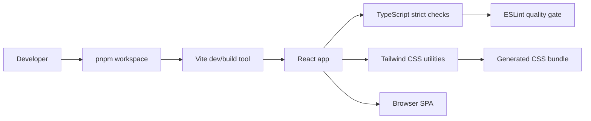
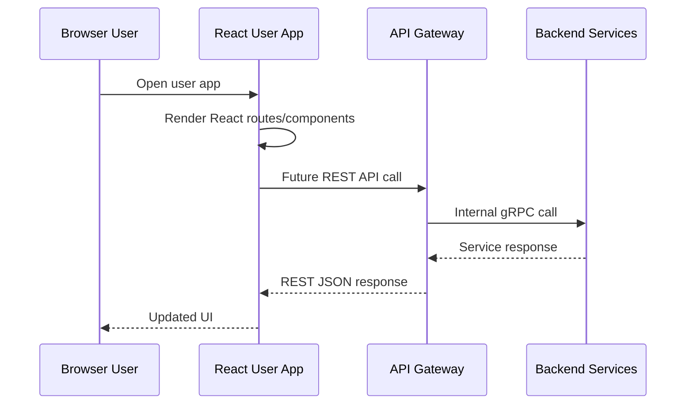
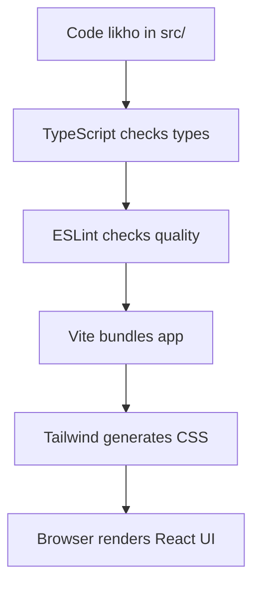

# 🛒 User App Frontend - Task 1: Setup React TS App


## 📌 Task Summary

| Field | Detail |
|---|---|
| Task Name | Setup React TS app |
| Source | `docs/01-micro-tasks.md` → `User App Frontend` → Task 1 |
| Priority | `P0` foundation/blocker |
| Dependency | Repo foundation |
| Main Goal | Vite, React, TypeScript, Tailwind setup karna; strict TS aur linting enable karna |
| Output Type | Documentation-only implementation guide |
| Not Included | Header/nav/search UI, auth screens, product pages, cart, checkout, Zustand, React Query, gRPC-Web |

> **Simple Hinglish goal:** Is task ka kaam hai User App ke liye frontend foundation ready karna. Matlab ek clean React + TypeScript app setup hoga, Tailwind styling pipeline connect hogi, TypeScript strict mode on hoga, aur linting se code quality guard lagega. Is task me koi business screen ya app shell implement nahi kiya gaya, kyunki wo next frontend tasks me aayega.

---

## ✅ Final Output Created

```text
TaskImplementation/
└── User App Frontend/
    └── task1.md
```

### Why this structure?

- `TaskImplementation/` project ke task-wise implementation guides ka central folder hai.
- `User App Frontend/` buyer/user-facing React app ke tasks ko group karta hai.
- `task1.md` sirf **User App Frontend - Task 1** ka guide hai.

> 🟡 **Scope note:** User request ke hisaab se is run me sirf required folder structure aur `task1.md` create kiya gaya. Actual `frontend/user-app` source files yahan create nahi kiye gaye.

---

## 🧭 Implementation Approach

Is guide ko banate time project ke existing docs ko base banaya gaya:

| Document | Kya use kiya gaya |
|---|---|
| `docs/01-micro-tasks.md` | Task 1 ka exact scope: Vite/React/TypeScript/Tailwind, strict TS, linting |
| `docs/03-folder-structure.md` | `frontend/user-app` ka recommended folder structure |
| `docs/10-frontend-implementation.md` | Frontend stack, state rules, API layer direction |
| `docs/13-developer-guide.md` | Node.js 22+, pnpm, strict TypeScript, frontend testing direction |
| `docs/02-system-architecture.md` | Browser → API Gateway → services request flow |

External official references bhi verify kiye gaye:

| Tool | Official Reference |
|---|---|
| Vite | https://vite.dev/guide/ |
| React | https://react.dev/learn/build-a-react-app-from-scratch |
| Tailwind CSS with Vite | https://tailwindcss.com/docs/installation/using-vite |
| ESLint | https://eslint.org/docs/latest/use/getting-started |
| typescript-eslint | https://typescript-eslint.io/getting-started/ |

---

## 🎯 Task Boundary

### Included in Task 1

- `frontend/user-app` React app setup plan
- Vite + React + TypeScript scaffold
- Tailwind CSS integration
- Strict TypeScript configuration
- ESLint setup for React + TypeScript
- Basic scripts: `dev`, `build`, `typecheck`, `lint`, `preview`
- Beginner-friendly folder structure
- Verification checklist

### Not Included in Task 1

| Feature | Kyun nahi? |
|---|---|
| Header, nav, search bar, cart badge | Ye `User App Frontend - Task 2: App shell` ka scope hai |
| Signup/login/OTP screens | Ye `Task 3: Auth screens` ka scope hai |
| Product listing/detail pages | Ye `Task 4: Product browsing` ka scope hai |
| Cart/checkout pages | Ye `Task 5: Cart and checkout` ka scope hai |
| Zustand global store | Ye `Task 7: State management` ka scope hai |
| React Query server cache | Ye `Task 7: State management` ka scope hai |
| gRPC-Web client | Ye `Task 8: gRPC-Web client` ka scope hai |

> 🟢 **Rule:** Task 1 sirf foundation setup karega. Business workflows next tasks me layer-by-layer add honge.

---

## 🧱 Target Implementation Folder Structure

Actual frontend implementation execute karte time recommended structure ye hoga:

```text
frontend/
├── package.json
├── pnpm-workspace.yaml
├── tsconfig.base.json
└── user-app/
    ├── index.html
    ├── package.json
    ├── vite.config.ts
    ├── tsconfig.json
    ├── tsconfig.app.json
    ├── tsconfig.node.json
    ├── eslint.config.js
    ├── public/
    └── src/
        ├── main.tsx
        ├── app.tsx
        ├── styles/
        │   └── globals.css
        ├── components/
        │   └── ui/
        ├── features/
        ├── lib/
        │   └── env.ts
        └── routes/
```

### Folder responsibility

| Path | Responsibility |
|---|---|
| `frontend/package.json` | Workspace-level scripts |
| `frontend/pnpm-workspace.yaml` | User app aur future shared packages ko pnpm workspace me register karega |
| `frontend/tsconfig.base.json` | Shared strict TypeScript rules |
| `frontend/user-app/` | Buyer/user-facing React SPA |
| `src/main.tsx` | React app ka browser entrypoint |
| `src/app.tsx` | Root component |
| `src/styles/globals.css` | Tailwind import aur global styles |
| `src/components/ui/` | Future shared UI primitives |
| `src/features/` | Future feature modules: auth, product, cart, profile |
| `src/lib/` | Shared frontend utilities |
| `src/routes/` | Future route definitions |

---

## 🧩 Architecture Diagram



### Hinglish explanation

- Developer `pnpm` commands run karta hai.
- Vite fast dev server aur production build handle karta hai.
- React UI render karta hai.
- TypeScript strict mode compile-time mistakes catch karta hai.
- Tailwind utility classes se styling fast and consistent hoti hai.
- ESLint code style aur common bugs catch karta hai.

---

## 🌐 Future Runtime Flow

Task 1 me API calls implement nahi honge, but app ka future runtime flow project architecture ke according ye rahega:



> 🟡 **Task 1 boundary:** Is flow me sirf React app setup hota hai. API client, auth token, React Query, aur actual backend calls later tasks me add honge.

---

## 📦 External Libraries and Tools

| Tool/Library | Type | Why Used | Install/Use |
|---|---|---|---|
| Node.js 22+ | Runtime | Vite, React tooling, ESLint, TypeScript run karne ke liye | Install Node 22+ locally |
| pnpm | Package manager | Fast installs, monorepo workspace support | `corepack enable` then `pnpm install` |
| Vite | Build tool/dev server | Fast HMR, optimized production build, React TS template | `pnpm create vite user-app --template react-ts` |
| React | UI library | Component-based user app UI banane ke liye | Vite React template ke saath install hota hai |
| TypeScript | Type system | Compile-time safety, strict contracts, fewer runtime bugs | Vite TS template ke saath install hota hai |
| Tailwind CSS | Utility CSS framework | Fast responsive styling with consistent design tokens | `pnpm add tailwindcss @tailwindcss/vite` |
| `@vitejs/plugin-react` | Vite plugin | React Fast Refresh and JSX support | Vite React template ke saath install hota hai |
| ESLint | Linter | Code quality, unused variables, unsafe patterns detect karne ke liye | Vite template + custom config |
| `typescript-eslint` | ESLint TS support | TypeScript files ko ESLint se properly lint karne ke liye | `pnpm add -D typescript-eslint` |

### Not installed in Task 1

| Library | Later Task |
|---|---|
| React Router | Task 2 or route setup phase |
| React Query | Task 7 |
| Zustand | Task 7 |
| React Hook Form | Task 3 |
| gRPC-Web generated client | Task 8 |

---

## 🪜 Step-by-Step Implementation

## Step 1: Prerequisites Check Karo

Frontend setup se pehle machine par Node.js aur pnpm ready hone chahiye.

```bash
node --version
pnpm --version
```

Expected:

```text
Node.js: 22+
pnpm: installed
```

Agar pnpm installed nahi hai:

```bash
corepack enable
corepack prepare pnpm@latest --activate
```

### Explanation

- `Node.js` JavaScript tooling run karta hai.
- `pnpm` package manager hai jo monorepo me fast aur deterministic installs deta hai.
- Project docs me Node.js 22+ aur pnpm frontend setup ke liye recommended hain.

---

## Step 2: Frontend Workspace Root Create Karo

Repo root se:

```bash
mkdir -p frontend
cd frontend
```

`frontend/package.json`:

```json
{
  "name": "ecommerce-frontend",
  "private": true,
  "packageManager": "pnpm@latest",
  "scripts": {
    "dev:user": "pnpm --filter user-app dev",
    "build:user": "pnpm --filter user-app build",
    "lint:user": "pnpm --filter user-app lint",
    "typecheck:user": "pnpm --filter user-app typecheck"
  }
}
```

`frontend/pnpm-workspace.yaml`:

```yaml
packages:
  - "user-app"
  - "packages/*"
```

### Explanation

- `frontend/` future me multiple apps rakhega: `user-app`, `seller-dashboard`, `superadmin-panel`.
- `pnpm-workspace.yaml` se pnpm ko pata chalega ki kaunse folders workspace packages hain.
- Root scripts se team ek consistent command style follow karegi.

---

## Step 3: Vite React TypeScript App Scaffold Karo

`frontend/` folder ke andar:

```bash
pnpm create vite user-app --template react-ts
cd user-app
pnpm install
```

### What this creates

```text
frontend/user-app/
├── index.html
├── package.json
├── vite.config.ts
├── tsconfig.json
├── tsconfig.app.json
├── tsconfig.node.json
└── src/
    ├── main.tsx
    ├── App.tsx
    └── index.css
```

### Explanation

- `react-ts` template React + TypeScript starter app banata hai.
- `index.html` Vite app ka HTML entrypoint hota hai.
- `src/main.tsx` React app ko DOM me mount karta hai.
- `vite.config.ts` build/dev server configuration rakhta hai.

---

## Step 4: Project Naming Normalize Karo

Vite template me files PascalCase me aa sakti hain, but project docs frontend file naming me kebab-case/lowercase prefer karte hain. Isliye normalize:

```text
src/App.tsx      → src/app.tsx
src/index.css    → src/styles/globals.css
```

`src/main.tsx` update:

```tsx
import { StrictMode } from 'react';
import { createRoot } from 'react-dom/client';
import App from './app';
import './styles/globals.css';

createRoot(document.getElementById('root')!).render(
  <StrictMode>
    <App />
  </StrictMode>,
);
```

### Explanation

- `StrictMode` React development checks enable karta hai.
- `createRoot` React 18+ root API hai.
- `globals.css` Tailwind and global CSS ka single import point banega.

---

## Step 5: Tailwind CSS Install Karo

`frontend/user-app/` ke andar:

```bash
pnpm add tailwindcss @tailwindcss/vite
```

`vite.config.ts`:

```ts
import tailwindcss from '@tailwindcss/vite';
import react from '@vitejs/plugin-react';
import { defineConfig } from 'vite';

export default defineConfig({
  plugins: [react(), tailwindcss()],
});
```

`src/styles/globals.css`:

```css
@import "tailwindcss";

:root {
  color-scheme: light;
  font-family:
    Inter, ui-sans-serif, system-ui, -apple-system, BlinkMacSystemFont,
    "Segoe UI", sans-serif;
}

body {
  margin: 0;
  min-width: 320px;
  min-height: 100vh;
  background: #f8fafc;
  color: #0f172a;
}
```

### Explanation

- Tailwind v4 me Vite plugin recommended setup hai.
- `@import "tailwindcss";` se Tailwind utilities CSS pipeline me aa jati hain.
- Global CSS me sirf base app-level styles rakhe gaye. Component-specific styling later components me Tailwind classes se hogi.

---

## Step 6: Strict TypeScript Enable Karo

`frontend/tsconfig.base.json`:

```json
{
  "compilerOptions": {
    "target": "ES2022",
    "useDefineForClassFields": true,
    "lib": ["DOM", "DOM.Iterable", "ES2022"],
    "allowJs": false,
    "skipLibCheck": true,
    "esModuleInterop": true,
    "allowSyntheticDefaultImports": true,
    "strict": true,
    "forceConsistentCasingInFileNames": true,
    "module": "ESNext",
    "moduleResolution": "Bundler",
    "resolveJsonModule": true,
    "isolatedModules": true,
    "noEmit": true,
    "jsx": "react-jsx",
    "noUncheckedIndexedAccess": true,
    "exactOptionalPropertyTypes": true,
    "noImplicitOverride": true,
    "noFallthroughCasesInSwitch": true
  }
}
```

`frontend/user-app/tsconfig.app.json`:

```json
{
  "extends": "../tsconfig.base.json",
  "compilerOptions": {
    "tsBuildInfoFile": "./node_modules/.tmp/tsconfig.app.tsbuildinfo"
  },
  "include": ["src"]
}
```

### Explanation

| Option | Why important |
|---|---|
| `strict` | TypeScript ke strict checks enable karta hai |
| `noUncheckedIndexedAccess` | Array/object access me `undefined` risk catch karta hai |
| `exactOptionalPropertyTypes` | Optional properties ko safer banata hai |
| `noImplicitOverride` | Class overrides explicit karne padte hain |
| `noFallthroughCasesInSwitch` | Switch case bugs catch karta hai |
| `moduleResolution: Bundler` | Vite/bundler style imports ke saath align karta hai |

> 🟢 **Beginner tip:** Strict TypeScript initially thoda tough lag sakta hai, but e-commerce app me cart, payment, order, auth jaise flows me type mistakes early catch hona bahut valuable hai.

---

## Step 7: ESLint Setup Karo

Vite React TS template ESLint config provide karta hai. Is project ke liye linting ko strict TypeScript ke saath align karna hai.

Install/confirm packages:

```bash
pnpm add -D eslint @eslint/js globals typescript-eslint eslint-plugin-react-hooks eslint-plugin-react-refresh
```

`eslint.config.js`:

```js
import js from '@eslint/js';
import { defineConfig, globalIgnores } from 'eslint/config';
import reactHooks from 'eslint-plugin-react-hooks';
import reactRefresh from 'eslint-plugin-react-refresh';
import globals from 'globals';
import tseslint from 'typescript-eslint';

export default defineConfig([
  globalIgnores(['dist']),
  {
    files: ['**/*.{ts,tsx}'],
    extends: [
      js.configs.recommended,
      tseslint.configs.recommendedTypeChecked,
      reactHooks.configs['recommended-latest'],
      reactRefresh.configs.vite,
    ],
    languageOptions: {
      ecmaVersion: 2022,
      globals: globals.browser,
      parserOptions: {
        projectService: true,
        tsconfigRootDir: import.meta.dirname,
      },
    },
    rules: {
      '@typescript-eslint/no-explicit-any': 'error',
      '@typescript-eslint/no-floating-promises': 'error',
      '@typescript-eslint/consistent-type-imports': 'error',
    },
  },
]);
```

### Explanation

- `eslint` JavaScript/TypeScript code lint karta hai.
- `typescript-eslint` TypeScript-specific rules enable karta hai.
- `eslint-plugin-react-hooks` React Hooks rules enforce karta hai.
- `eslint-plugin-react-refresh` Vite React Fast Refresh compatible exports check karta hai.
- `no-explicit-any` e-commerce domain me unsafe data flow avoid karta hai.
- `no-floating-promises` async calls me missed error handling catch karta hai.

---

## Step 8: Package Scripts Add Karo

`frontend/user-app/package.json` scripts:

```json
{
  "scripts": {
    "dev": "vite",
    "build": "tsc -b && vite build",
    "preview": "vite preview",
    "lint": "eslint .",
    "typecheck": "tsc -b --noEmit"
  }
}
```

### Explanation

| Script | Use |
|---|---|
| `dev` | Local Vite dev server start karta hai |
| `build` | TypeScript check + production build karta hai |
| `preview` | Production build locally preview karta hai |
| `lint` | ESLint checks run karta hai |
| `typecheck` | Sirf TypeScript type checking run karta hai |

---

## Step 9: Minimal Root App Component Banao

Task 1 me app shell nahi banega, but ek simple setup screen useful hai taaki Tailwind, React, aur TypeScript verify ho sake.

`src/app.tsx`:

```tsx
const setupItems = [
  'Vite dev server',
  'React rendering',
  'TypeScript strict mode',
  'Tailwind CSS utilities',
  'ESLint quality checks',
] as const;

export default function App() {
  return (
    <main className="min-h-screen bg-slate-50 px-6 py-10 text-slate-950">
      <section className="mx-auto max-w-3xl rounded-lg border border-slate-200 bg-white p-6 shadow-sm">
        <p className="text-sm font-semibold uppercase tracking-wide text-blue-600">
          User App Frontend
        </p>

        <h1 className="mt-3 text-3xl font-bold">React TS setup ready</h1>

        <p className="mt-3 text-slate-600">
          Task 1 foundation complete: Vite, React, TypeScript, Tailwind, and
          linting are connected.
        </p>

        <ul className="mt-6 grid gap-3 sm:grid-cols-2">
          {setupItems.map((item) => (
            <li
              className="rounded-md border border-slate-200 bg-slate-50 px-4 py-3 text-sm font-medium"
              key={item}
            >
              {item}
            </li>
          ))}
        </ul>
      </section>
    </main>
  );
}
```

### Explanation

- `setupItems` ko `as const` diya gaya so TypeScript literal types infer kare.
- Tailwind classes directly JSX me use hui hain.
- Ye UI sirf setup verification ke liye hai, actual app shell nahi.

---

## Step 10: Environment Variables Pattern Set Karo

Task 1 me API call nahi hai, but Vite env naming rule pehle define karna helpful hai.

`.env.example`:

```bash
VITE_API_BASE_URL=http://localhost:8080
VITE_APP_ENV=local
```

`src/lib/env.ts`:

```ts
type AppEnv = 'local' | 'development' | 'staging' | 'production';

type PublicEnv = {
  apiBaseUrl: string;
  appEnv: AppEnv;
};

function readEnv(): PublicEnv {
  return {
    apiBaseUrl: import.meta.env.VITE_API_BASE_URL ?? 'http://localhost:8080',
    appEnv: (import.meta.env.VITE_APP_ENV ?? 'local') as AppEnv,
  };
}

export const env = readEnv();
```

### Explanation

- Vite browser-exposed env variables `VITE_` prefix ke saath hi expose karta hai.
- `env.ts` future API client ke liye single config source banega.
- Secret values kabhi frontend env me nahi rakhni chahiye, kyunki browser bundle public hota hai.

---

## Step 11: Verification Commands Run Karo

`frontend/` root se:

```bash
pnpm install
pnpm --filter user-app typecheck
pnpm --filter user-app lint
pnpm --filter user-app build
pnpm --filter user-app dev
```

Expected result:

```text
typecheck: pass
lint: pass
build: pass
dev server: http://localhost:5173
```

### Browser verification

Open:

```text
http://localhost:5173
```

Checklist:

- Page render ho raha hai.
- Tailwind styling visible hai.
- Console me TypeScript/runtime error nahi hai.
- `pnpm --filter user-app build` successfully `dist/` create karta hai.

---

## 🧪 Quality Checklist

| Check | Command | Pass Criteria |
|---|---|---|
| Dependencies install | `pnpm install` | No install errors |
| TypeScript strict check | `pnpm --filter user-app typecheck` | No TS errors |
| Lint check | `pnpm --filter user-app lint` | No ESLint errors |
| Production build | `pnpm --filter user-app build` | `dist/` build created |
| Local preview | `pnpm --filter user-app dev` | App opens on Vite dev URL |

---

## 🧠 How Each Part Was Built

| Part | Built By | Reason |
|---|---|---|
| React app foundation | Vite `react-ts` template | Fast, modern SPA starter |
| Type safety | `tsconfig.base.json` strict options | Safer feature development |
| Styling pipeline | Tailwind Vite plugin + `@import "tailwindcss"` | Simple utility-first CSS setup |
| Linting | ESLint + TypeScript ESLint + React Hooks rules | Consistent code quality |
| Workspace | pnpm workspace | Future shared packages and multiple frontend apps support |
| Env pattern | `VITE_` variables + `env.ts` | Future API config cleanly centralize karna |

---

## 🧾 Clean Final Target Structure

After Task 1 implementation, target frontend folders should look like:

```text
frontend/
├── package.json
├── pnpm-workspace.yaml
├── tsconfig.base.json
└── user-app/
    ├── index.html
    ├── package.json
    ├── vite.config.ts
    ├── tsconfig.json
    ├── tsconfig.app.json
    ├── tsconfig.node.json
    ├── eslint.config.js
    ├── .env.example
    └── src/
        ├── main.tsx
        ├── app.tsx
        ├── styles/
        │   └── globals.css
        └── lib/
            └── env.ts
```

Task implementation guide output:

```text
TaskImplementation/
└── User App Frontend/
    └── task1.md
```

---

## 🚦 Do and Don't

### ✅ Do

- Strict TypeScript on rakho.
- Tailwind setup Vite plugin se karo.
- `pnpm` workspace use karo.
- `lint`, `typecheck`, `build` scripts maintain karo.
- Frontend env variables me only public config rakho.

### ❌ Don't

- Task 1 me app shell/header/search/cart badge build mat karo.
- Task 1 me auth/product/cart pages add mat karo.
- `any` use mat karo unless strong reason documented ho.
- Secrets frontend `.env` me mat rakho.
- Generated `dist/` ya `node_modules/` Git me commit mat karo.

---

## 🧩 Beginner Mental Model



### Simple explanation

1. Aap React components `src/` me likhte ho.
2. TypeScript compile-time par type mistakes pakadta hai.
3. ESLint code quality problems pakadta hai.
4. Vite app ko fast dev server ya production bundle me convert karta hai.
5. Tailwind classes final CSS me convert hoti hain.
6. Browser React UI render karta hai.

---

## ✅ Completion Criteria

Task 1 complete tab maana jayega jab:

- `frontend/user-app` Vite React TS app scaffold ho.
- Tailwind CSS app me working ho.
- TypeScript strict options enabled hon.
- ESLint React + TypeScript checks working hon.
- `pnpm --filter user-app typecheck` pass ho.
- `pnpm --filter user-app lint` pass ho.
- `pnpm --filter user-app build` pass ho.
- No Task 2+ features accidentally implement hue hon.

---

## 📚 Quick Command Summary

```bash
# repo root
mkdir -p frontend
cd frontend

# workspace files create karo, then:
pnpm create vite user-app --template react-ts
cd user-app
pnpm install

# Tailwind
pnpm add tailwindcss @tailwindcss/vite

# lint support
pnpm add -D eslint @eslint/js globals typescript-eslint eslint-plugin-react-hooks eslint-plugin-react-refresh

# verify
pnpm typecheck
pnpm lint
pnpm build
pnpm dev
```

> 🟢 **Final note:** Ye guide User App Frontend ke foundation ko clean and scalable banata hai. Next task me isi setup ke upar app shell build hoga.
