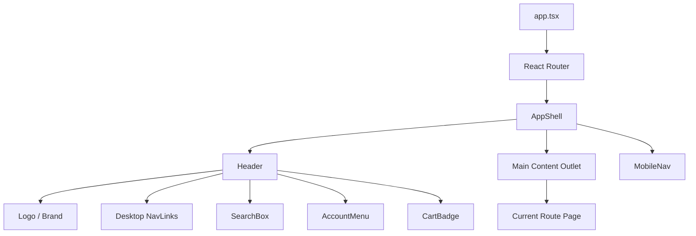
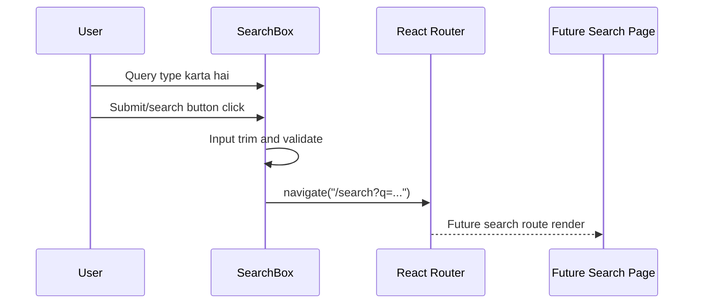
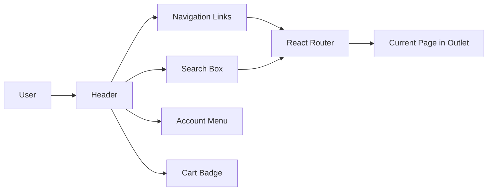

# 🧭 User App Frontend - Task 2: App Shell


## 📌 Task Summary

| Field | Detail |
|---|---|
| Task Name | App shell |
| Source | `docs/01-micro-tasks.md` → `User App Frontend` → Task 2 |
| Priority | `P0` foundation/blocker |
| Dependency | Design system |
| Main Goal | Header, nav, search bar, account menu, cart badge layout banana |
| Output Type | Documentation-only implementation guide |
| Not Included | Auth screens, product listing/detail, cart page, checkout, React Query, Zustand, gRPC-Web |

> **Simple Hinglish goal:** Is task ka kaam hai User App ka reusable outer layout banana. Matlab browser me user ko har page par consistent header, navigation, search box, account menu, cart badge, aur responsive mobile navigation mile. Is task me data fetching, login flow, product results, cart mutations, ya checkout logic implement nahi karna.

---

## ✅ Final Output Created

```text
TaskImplementation/
└── User App Frontend/
    ├── task1.md
    └── task2.md
```

### Why this structure?

- `TaskImplementation/` project ke task-wise implementation guides ka central folder hai.
- `User App Frontend/` buyer/user-facing React app ke implementation guides ko group karta hai.
- `task2.md` sirf **User App Frontend - Task 2: App shell** ka complete step-by-step guide hai.

> 🟡 **Scope note:** Current request ke hisaab se sirf required folder structure aur `task2.md` create kiya gaya. Actual `frontend/user-app` source files yahan create nahi kiye gaye.

---

## 🧭 Source Docs Studied

| Document | Kya use kiya gaya |
|---|---|
| `docs/01-micro-tasks.md` | Task 2 ka exact scope: header, nav, search bar, account menu, cart badge |
| `docs/03-folder-structure.md` | `frontend/user-app/src/app-shell/` recommended folder structure |
| `docs/10-frontend-implementation.md` | Frontend stack, component structure, state management boundaries |
| `docs/13-developer-guide.md` | Node.js 22+, pnpm, frontend testing direction |
| `docs/02-system-architecture.md` | Browser → API Gateway → services future request flow |
| `TaskImplementation/User App Frontend/task1.md` | Task 1 foundation and Task 2 boundary |

---

## 🎯 Task Boundary

### ✅ Included in Task 2

- App shell layout wrapper
- Header with logo/brand area
- Desktop navigation links
- Responsive mobile navigation
- Search bar layout and submit navigation
- Account menu trigger and dropdown layout
- Cart icon with badge count layout
- Accessibility basics: labels, keyboard-friendly controls, focus states
- Route shell wiring with `react-router-dom`
- Tailwind-based styling using Task 1 setup

### ❌ Not Included in Task 2

| Feature | Kyun nahi? |
|---|---|
| Signup/login/OTP pages | Ye `User App Frontend - Task 3: Auth screens` ka scope hai |
| Product listing/search results | Ye `Task 4: Product browsing` ka scope hai |
| Cart page and cart mutations | Ye `Task 5: Cart and checkout` ka scope hai |
| React Query server cache | Ye `Task 7: State management` ka scope hai |
| Zustand global UI/session store | Ye `Task 7: State management` ka scope hai |
| gRPC-Web generated client | Ye `Task 8: gRPC-Web client` ka scope hai |
| Real backend API calls | Gateway/API integration later feature tasks me hoga |

> 🟢 **Rule:** Task 2 app ka reusable frame banata hai. Business pages aur server data later tasks me plug honge.

---

## 🧱 Target Implementation Folder Structure

Actual frontend implementation execute karte time Task 2 ke baad target structure ye hoga:

```text
frontend/
└── user-app/
    └── src/
        ├── app.tsx
        ├── main.tsx
        ├── app-shell/
        │   ├── account-menu.tsx
        │   ├── app-shell.tsx
        │   ├── cart-badge.tsx
        │   ├── header.tsx
        │   ├── mobile-nav.tsx
        │   ├── nav-links.tsx
        │   └── search-box.tsx
        ├── components/
        │   └── ui/
        │       └── icon-button.tsx
        ├── routes/
        │   ├── index.tsx
        │   └── route-paths.ts
        └── styles/
            └── globals.css
```

### Folder responsibility

| Path | Responsibility |
|---|---|
| `src/app.tsx` | React Router provider ko app me mount karega |
| `src/routes/index.tsx` | Route tree define karega; shell ke andar page outlet render hoga |
| `src/routes/route-paths.ts` | Central route constants, taaki paths duplicate na hon |
| `src/app-shell/app-shell.tsx` | Common layout wrapper: header + page content + optional mobile nav |
| `src/app-shell/header.tsx` | Top header composition |
| `src/app-shell/nav-links.tsx` | Reusable nav items for desktop/mobile |
| `src/app-shell/search-box.tsx` | Search input UI and query navigation |
| `src/app-shell/account-menu.tsx` | Account dropdown layout |
| `src/app-shell/cart-badge.tsx` | Cart icon and count badge |
| `src/app-shell/mobile-nav.tsx` | Small-screen navigation |
| `src/components/ui/icon-button.tsx` | Shared accessible icon button primitive |

---

## 🧩 App Shell Architecture



### Hinglish explanation

- `app.tsx` app ko router ke saath start karta hai.
- `AppShell` common wrapper hai jo har route ke around rahega.
- `Header` user ko top-level actions deta hai: browse, search, account, cart.
- `Outlet` ke andar current page render hota hai.
- `MobileNav` small screens ke liye compact navigation provide karta hai.

---

## 🔎 Search Flow

Task 2 me search API call nahi hogi. Search box sirf query ko route me bhejega.



> 🟡 **Boundary:** `/search?q=...` route prepare hota hai, but actual product result fetching Task 4 me add hogi.

---

## 📦 External Libraries and Tools

| Tool/Library | Type | Why Used | Install/Use |
|---|---|---|---|
| React | UI library | Component-based app shell banane ke liye | Task 1 Vite setup me installed |
| TypeScript | Type system | Props, nav items, event handlers type-safe rakhne ke liye | Task 1 Vite setup me installed |
| Tailwind CSS | Styling | Responsive layout, spacing, colors, focus states fast banane ke liye | Task 1 me configured |
| `react-router-dom` | Routing library | App shell ke andar route outlet, `NavLink`, search navigation ke liye | `pnpm --filter user-app add react-router-dom` |
| `lucide-react` | Icon library | Search, user, cart, menu jaise consistent icons ke liye | `pnpm --filter user-app add lucide-react` |
| ESLint | Code quality | App shell components me common mistakes catch karne ke liye | Task 1 me configured |

### Why `react-router-dom`?

- App shell route-based app ke liye natural fit hai.
- `Outlet` se shell ke andar child pages render hote hain.
- `NavLink` active link state easily handle karta hai.
- `useNavigate` search submit par URL update karta hai.

### Why `lucide-react`?

- Header actions me icons expected hote hain: search, user, cart, menu.
- Custom SVG copy-paste karne ke bajay maintained icon set use hota hai.
- Icons accessible labels ke saath button/link me use kiye ja sakte hain.

### Not used in Task 2

| Library | Later Task | Reason |
|---|---|---|
| React Query | Task 7 | Task 2 me server data fetch nahi ho raha |
| Zustand | Task 7 | Header state local `useState` se enough hai |
| React Hook Form | Task 3 | Search box simple form hai, auth forms later |
| MSW | Testing phase | API mocks tab useful honge jab API calls add hongi |
| gRPC-Web client | Task 8 | App shell ko typed service calls ki zarurat nahi |

---

## 🪜 Step-by-Step Implementation

## Step 1: Task 1 Setup Confirm Karo

Task 2 start karne se pehle Task 1 ka frontend foundation ready hona chahiye:

```bash
pnpm --filter user-app typecheck
pnpm --filter user-app lint
pnpm --filter user-app build
```

Expected:

```text
TypeScript, lint, and build checks pass.
```

### Explanation

App shell Task 1 ke React + TypeScript + Tailwind setup ke upar build hota hai. Agar foundation broken hai, shell components debug karna confusing ho jayega.

---

## Step 2: Required Packages Install Karo

`frontend/` workspace root se:

```bash
pnpm --filter user-app add react-router-dom lucide-react
```

### Explanation

- `react-router-dom` se app shell route pages ke around wrap hoga.
- `lucide-react` se header icons clean aur consistent rahenge.
- Ye dono runtime dependencies hain, isliye `add` use hoga, `add -D` nahi.

---

## Step 3: Route Constants Define Karo

`src/routes/route-paths.ts`:

```ts
export const routePaths = {
  home: "/",
  categories: "/categories",
  deals: "/deals",
  orders: "/account/orders",
  profile: "/account/profile",
  wishlist: "/wishlist",
  cart: "/cart",
  login: "/login",
  search: "/search",
} as const;

export type RoutePath = (typeof routePaths)[keyof typeof routePaths];
```

### Explanation

- Paths ek central file me rakhne se duplicate strings avoid hoti hain.
- Later jab auth/product/cart pages implement honge, same constants reuse honge.
- `as const` TypeScript ko exact string values preserve karne ke liye bolta hai.

---

## Step 4: Nav Links Data Banao

`src/app-shell/nav-links.tsx`:

```tsx
import { NavLink } from "react-router-dom";

import { routePaths } from "../routes/route-paths";

const navItems = [
  { label: "Home", to: routePaths.home },
  { label: "Categories", to: routePaths.categories },
  { label: "Deals", to: routePaths.deals },
  { label: "Wishlist", to: routePaths.wishlist },
] as const;

type NavLinksProps = {
  onNavigate?: () => void;
};

export function NavLinks({ onNavigate }: NavLinksProps) {
  return (
    <nav aria-label="Primary navigation" className="flex flex-col gap-1 md:flex-row md:items-center md:gap-2">
      {navItems.map((item) => (
        <NavLink
          key={item.to}
          to={item.to}
          onClick={onNavigate}
          className={({ isActive }) =>
            [
              "rounded-md px-3 py-2 text-sm font-medium transition",
              "focus-visible:outline focus-visible:outline-2 focus-visible:outline-offset-2 focus-visible:outline-blue-600",
              isActive
                ? "bg-blue-50 text-blue-700"
                : "text-slate-700 hover:bg-slate-100 hover:text-slate-950",
            ].join(" ")
          }
        >
          {item.label}
        </NavLink>
      ))}
    </nav>
  );
}
```

### Explanation

- Nav items data-driven rakhe gaye hain.
- Same `NavLinks` desktop aur mobile dono me reuse ho sakta hai.
- `NavLink` active route styling handle karta hai.
- `onNavigate` mobile menu close karne ke kaam aayega.

---

## Step 5: Search Box Component Banao

`src/app-shell/search-box.tsx`:

```tsx
import { FormEvent, useState } from "react";
import { Search } from "lucide-react";
import { useNavigate } from "react-router-dom";

import { routePaths } from "../routes/route-paths";

export function SearchBox() {
  const [query, setQuery] = useState("");
  const navigate = useNavigate();

  function handleSubmit(event: FormEvent<HTMLFormElement>) {
    event.preventDefault();

    const trimmedQuery = query.trim();
    if (!trimmedQuery) {
      return;
    }

    const params = new URLSearchParams({ q: trimmedQuery });
    navigate(`${routePaths.search}?${params.toString()}`);
  }

  return (
    <form onSubmit={handleSubmit} className="relative w-full max-w-xl" role="search">
      <label htmlFor="site-search" className="sr-only">
        Search products
      </label>
      <Search aria-hidden="true" className="pointer-events-none absolute left-3 top-1/2 h-4 w-4 -translate-y-1/2 text-slate-400" />
      <input
        id="site-search"
        type="search"
        value={query}
        onChange={(event) => setQuery(event.target.value)}
        placeholder="Search products, brands, categories"
        className="h-10 w-full rounded-md border border-slate-300 bg-white pl-10 pr-3 text-sm text-slate-950 shadow-sm outline-none transition placeholder:text-slate-400 focus:border-blue-600 focus:ring-2 focus:ring-blue-100"
      />
    </form>
  );
}
```

### Explanation

- Search input controlled component hai.
- Empty search submit ignore hota hai.
- Query URL me encode hoti hai using `URLSearchParams`.
- `role="search"` and hidden label accessibility improve karte hain.
- API call intentionally nahi hai; result fetching Task 4 me hoga.

---

## Step 6: Cart Badge Component Banao

`src/app-shell/cart-badge.tsx`:

```tsx
import { ShoppingCart } from "lucide-react";
import { Link } from "react-router-dom";

import { routePaths } from "../routes/route-paths";

type CartBadgeProps = {
  count?: number;
};

export function CartBadge({ count = 0 }: CartBadgeProps) {
  const displayCount = count > 99 ? "99+" : String(count);

  return (
    <Link
      to={routePaths.cart}
      className="relative inline-flex h-10 w-10 items-center justify-center rounded-md text-slate-700 transition hover:bg-slate-100 hover:text-slate-950 focus-visible:outline focus-visible:outline-2 focus-visible:outline-offset-2 focus-visible:outline-blue-600"
      aria-label={`Cart with ${count} items`}
    >
      <ShoppingCart aria-hidden="true" className="h-5 w-5" />
      {count > 0 ? (
        <span className="absolute -right-1 -top-1 min-w-5 rounded-full bg-blue-600 px-1.5 py-0.5 text-center text-xs font-semibold leading-none text-white">
          {displayCount}
        </span>
      ) : null}
    </Link>
  );
}
```

### Explanation

- `count` prop optional hai, kyunki Task 2 me cart API connected nahi hai.
- Later Task 5/7 me count React Query/Zustand se aa sakta hai.
- `99+` overflow layout ko stable rakhta hai.
- Link accessible label screen readers ke liye cart count batata hai.

---

## Step 7: Account Menu Layout Banao

`src/app-shell/account-menu.tsx`:

```tsx
import { User } from "lucide-react";
import { Link } from "react-router-dom";

import { routePaths } from "../routes/route-paths";

export function AccountMenu() {
  return (
    <details className="relative">
      <summary className="flex h-10 cursor-pointer list-none items-center gap-2 rounded-md px-3 text-sm font-medium text-slate-700 transition hover:bg-slate-100 hover:text-slate-950 focus-visible:outline focus-visible:outline-2 focus-visible:outline-offset-2 focus-visible:outline-blue-600">
        <User aria-hidden="true" className="h-5 w-5" />
        <span className="hidden lg:inline">Account</span>
      </summary>

      <div className="absolute right-0 z-30 mt-2 w-56 rounded-md border border-slate-200 bg-white p-2 shadow-lg">
        <Link className="block rounded px-3 py-2 text-sm text-slate-700 hover:bg-slate-100" to={routePaths.login}>
          Login or signup
        </Link>
        <Link className="block rounded px-3 py-2 text-sm text-slate-700 hover:bg-slate-100" to={routePaths.profile}>
          Profile
        </Link>
        <Link className="block rounded px-3 py-2 text-sm text-slate-700 hover:bg-slate-100" to={routePaths.orders}>
          Orders
        </Link>
      </div>
    </details>
  );
}
```

### Explanation

- Native `<details>` simple dropdown ke liye enough hai.
- Auth state Task 3/7 me aayegi, isliye abhi generic links hain.
- Menu me login, profile, orders ke entry points ready hain.
- Later authenticated/unauthenticated state ke basis par menu items conditionally render honge.

> 🟡 **Production note:** Agar menu behavior complex ho jaaye, tab Headless UI/Radix UI use kar sakte hain. Task 2 me external dropdown library zaruri nahi hai.

---

## Step 8: Header Compose Karo

`src/app-shell/header.tsx`:

```tsx
import { Link } from "react-router-dom";

import { routePaths } from "../routes/route-paths";
import { AccountMenu } from "./account-menu";
import { CartBadge } from "./cart-badge";
import { NavLinks } from "./nav-links";
import { SearchBox } from "./search-box";

type HeaderProps = {
  cartCount?: number;
};

export function Header({ cartCount = 0 }: HeaderProps) {
  return (
    <header className="sticky top-0 z-20 border-b border-slate-200 bg-white/95 backdrop-blur">
      <div className="mx-auto flex min-h-16 w-full max-w-7xl items-center gap-4 px-4 sm:px-6 lg:px-8">
        <Link
          to={routePaths.home}
          className="shrink-0 rounded-md text-xl font-bold tracking-tight text-slate-950 focus-visible:outline focus-visible:outline-2 focus-visible:outline-offset-2 focus-visible:outline-blue-600"
        >
          Ecom
        </Link>

        <div className="hidden md:block">
          <NavLinks />
        </div>

        <div className="ml-auto hidden flex-1 justify-center md:flex">
          <SearchBox />
        </div>

        <div className="ml-auto flex items-center gap-1 md:ml-0">
          <AccountMenu />
          <CartBadge count={cartCount} />
        </div>
      </div>

      <div className="border-t border-slate-100 px-4 py-3 md:hidden">
        <SearchBox />
      </div>
    </header>
  );
}
```

### Explanation

- Header sticky hai, taaki shopping UX me search/cart easily available rahe.
- Desktop nav `md:block`, mobile nav alag component me rahega.
- Search desktop par center area me, mobile par second row me show hota hai.
- `cartCount` prop future data integration ke liye ready hai.

---

## Step 9: Mobile Nav Banao

`src/app-shell/mobile-nav.tsx`:

```tsx
import { Menu, X } from "lucide-react";
import { useState } from "react";

import { NavLinks } from "./nav-links";

export function MobileNav() {
  const [isOpen, setIsOpen] = useState(false);

  return (
    <div className="border-b border-slate-200 bg-white md:hidden">
      <button
        type="button"
        onClick={() => setIsOpen((current) => !current)}
        className="flex w-full items-center justify-between px-4 py-3 text-sm font-medium text-slate-700"
        aria-expanded={isOpen}
        aria-controls="mobile-navigation"
      >
        <span>Browse</span>
        {isOpen ? <X aria-hidden="true" className="h-5 w-5" /> : <Menu aria-hidden="true" className="h-5 w-5" />}
      </button>

      {isOpen ? (
        <div id="mobile-navigation" className="px-4 pb-4">
          <NavLinks onNavigate={() => setIsOpen(false)} />
        </div>
      ) : null}
    </div>
  );
}
```

### Explanation

- Mobile nav local `useState` se open/close hota hai.
- Global Zustand store ki zarurat nahi, kyunki state sirf isi component me use ho rahi hai.
- `aria-expanded` screen readers ko open/close state batata hai.
- Link click ke baad menu close hota hai.

---

## Step 10: App Shell Layout Banao

`src/app-shell/app-shell.tsx`:

```tsx
import { Outlet } from "react-router-dom";

import { Header } from "./header";
import { MobileNav } from "./mobile-nav";

export function AppShell() {
  return (
    <div className="min-h-screen bg-slate-50 text-slate-950">
      <Header cartCount={0} />
      <MobileNav />

      <main className="mx-auto w-full max-w-7xl px-4 py-6 sm:px-6 lg:px-8">
        <Outlet />
      </main>
    </div>
  );
}
```

### Explanation

- `AppShell` har public route ka outer wrapper hai.
- `Header` and `MobileNav` page ke upar common rahenge.
- `Outlet` current route page ko render karta hai.
- `cartCount={0}` placeholder hai; real count later Cart/State tasks me connect hoga.

---

## Step 11: Router Setup Karo

`src/routes/index.tsx`:

```tsx
import { createBrowserRouter } from "react-router-dom";

import { AppShell } from "../app-shell/app-shell";
import { routePaths } from "./route-paths";

function PlaceholderPage({ title }: { title: string }) {
  return (
    <section className="rounded-md border border-dashed border-slate-300 bg-white p-6">
      <h1 className="text-2xl font-semibold text-slate-950">{title}</h1>
      <p className="mt-2 text-sm text-slate-600">This page will be implemented in a later user app frontend task.</p>
    </section>
  );
}

export const router = createBrowserRouter([
  {
    element: <AppShell />,
    children: [
      { path: routePaths.home, element: <PlaceholderPage title="Home" /> },
      { path: routePaths.categories, element: <PlaceholderPage title="Categories" /> },
      { path: routePaths.deals, element: <PlaceholderPage title="Deals" /> },
      { path: routePaths.wishlist, element: <PlaceholderPage title="Wishlist" /> },
      { path: routePaths.cart, element: <PlaceholderPage title="Cart" /> },
      { path: routePaths.search, element: <PlaceholderPage title="Search" /> },
      { path: routePaths.login, element: <PlaceholderPage title="Login" /> },
      { path: routePaths.profile, element: <PlaceholderPage title="Profile" /> },
      { path: routePaths.orders, element: <PlaceholderPage title="Orders" /> },
    ],
  },
]);
```

`src/app.tsx`:

```tsx
import { RouterProvider } from "react-router-dom";

import { router } from "./routes";

export function App() {
  return <RouterProvider router={router} />;
}
```

### Explanation

- `createBrowserRouter` SPA routes define karta hai.
- `AppShell` parent route hai.
- Child route pages `Outlet` ke andar render honge.
- Placeholder pages sirf route wiring verify karne ke liye hain; real screens future tasks me replace honge.

---

## Step 12: Shared Icon Button Optional Primitive

`src/components/ui/icon-button.tsx`:

```tsx
import { ButtonHTMLAttributes, ReactNode } from "react";

type IconButtonProps = ButtonHTMLAttributes<HTMLButtonElement> & {
  children: ReactNode;
  label: string;
};

export function IconButton({ children, label, className = "", ...props }: IconButtonProps) {
  return (
    <button
      type="button"
      aria-label={label}
      className={[
        "inline-flex h-10 w-10 items-center justify-center rounded-md text-slate-700 transition",
        "hover:bg-slate-100 hover:text-slate-950",
        "focus-visible:outline focus-visible:outline-2 focus-visible:outline-offset-2 focus-visible:outline-blue-600",
        className,
      ].join(" ")}
      {...props}
    >
      {children}
    </button>
  );
}
```

### Explanation

- Icon-only buttons ko accessible `aria-label` chahiye.
- Reusable primitive se future buttons consistent rahenge.
- Task 2 me ise menu/search controls ke liye use kar sakte hain, but over-abstraction avoid karne ke liye required nahi hai.

---

## Step 13: Styling Rules Follow Karo

Task 2 me visual style restrained and usable rakhna hai:

| Area | Rule |
|---|---|
| Header height | Desktop par compact, mobile par two-row layout acceptable |
| Radius | `rounded-md` / 6-8px style, overly large cards nahi |
| Colors | Neutral base + blue accent for active/focus states |
| Focus | Har interactive item me visible focus ring |
| Layout | `max-w-7xl`, responsive padding, no overlap |
| Text | Header labels short and scannable |
| Mobile | Search accessible rahe, nav collapsible rahe |

Example `globals.css` mental model:

```css
@import "tailwindcss";

:root {
  color-scheme: light;
  font-family:
    Inter, ui-sans-serif, system-ui, -apple-system, BlinkMacSystemFont, "Segoe UI",
    sans-serif;
}

body {
  margin: 0;
  min-width: 320px;
}
```

### Explanation

- App shell ecommerce workflow ka utility surface hai, marketing hero nahi.
- Header me primary actions visible hone chahiye.
- Mobile me search hidden nahi hona chahiye, kyunki shopping app me search core action hai.

---

## ♿ Accessibility Checklist

| Item | Required |
|---|---|
| Logo link | Home route par le jaata ho |
| Nav | `aria-label="Primary navigation"` |
| Search form | `role="search"` and input label |
| Icon-only actions | `aria-label` required |
| Cart badge | Screen reader count announce kare |
| Mobile menu | `aria-expanded` and `aria-controls` |
| Focus states | Keyboard users ko clearly visible |
| Color contrast | Text/background readable |
| Hit target | Buttons/links around 40px height |

---

## 🧪 Testing and Verification

Task 2 complete hone ke baad checks:

```bash
pnpm --filter user-app typecheck
pnpm --filter user-app lint
pnpm --filter user-app build
pnpm --filter user-app dev
```

Manual browser checks:

| Check | Expected Result |
|---|---|
| Desktop header | Logo, nav, search, account, cart aligned |
| Mobile header | Search visible, nav collapses cleanly |
| Search submit | `/search?q=<query>` route par navigate |
| Cart badge count | `0` par badge hidden, positive count par visible |
| Account menu | Login/profile/orders links visible |
| Keyboard tab | Focus ring visible on all controls |
| Active nav link | Current route highlighted |

Component test examples for later:

```tsx
import { render, screen } from "@testing-library/react";

import { CartBadge } from "./cart-badge";

it("shows cart item count when count is greater than zero", () => {
  render(<CartBadge count={3} />);

  expect(screen.getByLabelText("Cart with 3 items")).toBeInTheDocument();
  expect(screen.getByText("3")).toBeInTheDocument();
});
```

> 🟡 **Note:** Test library setup may be added with frontend testing task/phase. Task 2 guide sirf test direction define karta hai.

---

## 🔐 Security and Privacy Notes

- Account menu me raw JWT, token, email, phone, ya PII render mat karo.
- Header client-side auth state future me sanitized profile summary se aayega.
- Search input ko URL me encode karo; direct HTML render mat karo.
- Cart count server/source-of-truth se later aayega; local badge ko final amount/payment se tie mat karo.
- Protected pages ke guards Task 3/7 ke baad add honge.

---

## 🧠 How Each Part Was Built

| Part | Built By | Reason |
|---|---|---|
| App shell | `AppShell` component | Common layout har route ke around reuse karne ke liye |
| Header | `Header` composition | Logo, nav, search, account, cart ek predictable top area me |
| Navigation | `NavLinks` + route constants | Duplicate route strings avoid, active state easy |
| Search | Controlled form + `useNavigate` | Query ko URL state me convert karna, API later |
| Cart badge | `CartBadge` prop-based component | Data source later change ho sakta hai without layout rewrite |
| Account menu | Native `<details>` dropdown | Simple, dependency-light account entry point |
| Mobile nav | Local `useState` | Component-local UI state ke liye global store avoid |
| Icons | `lucide-react` | Consistent header action visuals |
| Styling | Tailwind classes | Fast responsive UI with readable constraints |

---

## 🧾 Clean Final Target Structure

After Task 2 implementation, frontend target files should look like:

```text
frontend/user-app/
├── package.json
└── src/
    ├── app.tsx
    ├── main.tsx
    ├── app-shell/
    │   ├── account-menu.tsx
    │   ├── app-shell.tsx
    │   ├── cart-badge.tsx
    │   ├── header.tsx
    │   ├── mobile-nav.tsx
    │   ├── nav-links.tsx
    │   └── search-box.tsx
    ├── components/
    │   └── ui/
    │       └── icon-button.tsx
    ├── routes/
    │   ├── index.tsx
    │   └── route-paths.ts
    └── styles/
        └── globals.css
```

Task implementation guide output:

```text
TaskImplementation/
└── User App Frontend/
    ├── task1.md
    └── task2.md
```

---

## 🚦 Do and Don't

### ✅ Do

- Header ko responsive and accessible rakho.
- Search query ko URL me store karo.
- Nav routes constants se use karo.
- Cart badge ko prop-based rakho.
- Mobile nav ke liye local state use karo.
- Focus states and labels zarur add karo.
- Placeholder pages clearly future task label ke saath rakho.

### ❌ Don't

- Task 2 me login/signup forms implement mat karo.
- Task 2 me product search API call mat lagao.
- Task 2 me cart API/state management connect mat karo.
- Task 2 me checkout/payment flow add mat karo.
- Header me secrets, tokens, ya sensitive user data render mat karo.
- Large UI library add mat karo sirf dropdown ke liye.

---

## 🧩 Beginner Mental Model



### Simple explanation

1. User app open karta hai.
2. Header har page par visible hota hai.
3. Nav links route change karte hain.
4. Search query URL me bhejti hai.
5. Account menu future auth pages ka entry point hai.
6. Cart badge future cart state ka visual entry point hai.
7. Current page `Outlet` me render hota hai.

---

## ✅ Completion Criteria

Task 2 complete tab maana jayega jab:

- `src/app-shell/` folder with shell components planned/created ho.
- Header desktop and mobile layouts ready hon.
- Search box `/search?q=...` navigation kare.
- Account menu login/profile/orders links show kare.
- Cart badge count prop support kare.
- React Router shell + outlet configured ho.
- Tailwind styling responsive and accessible ho.
- `typecheck`, `lint`, and `build` pass hon.
- No Task 3+ auth screens, Task 4 product browsing, ya Task 5 cart/checkout logic accidentally implement hua ho.

---

## 📚 Quick Command Summary

```bash
# frontend workspace root
pnpm --filter user-app add react-router-dom lucide-react

# verify
pnpm --filter user-app typecheck
pnpm --filter user-app lint
pnpm --filter user-app build
pnpm --filter user-app dev
```

> 🟢 **Final note:** Task 2 User App ka reusable outer frame ready karta hai. Next task me isi shell ke andar auth screens mount honge, without header/navigation rewrite.
