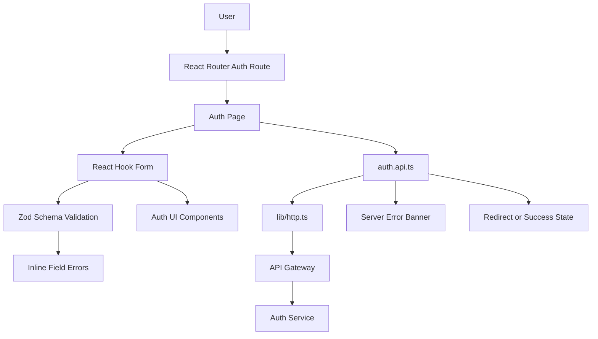
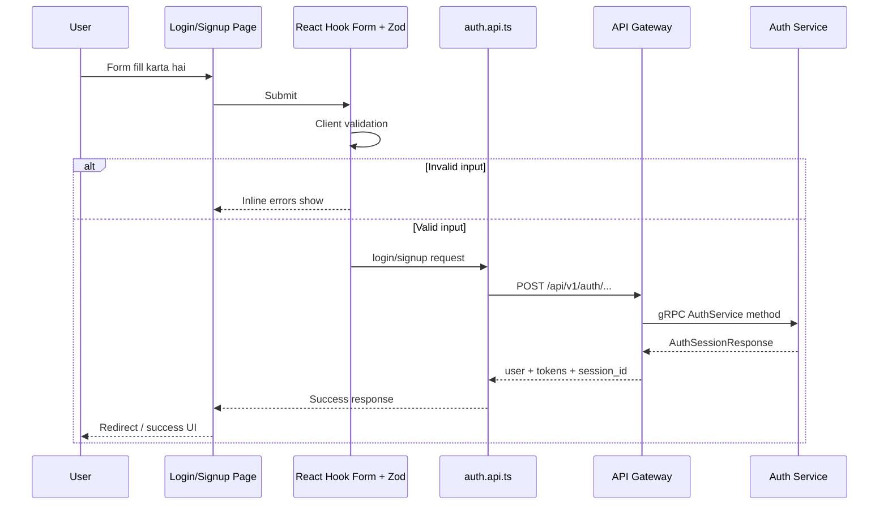
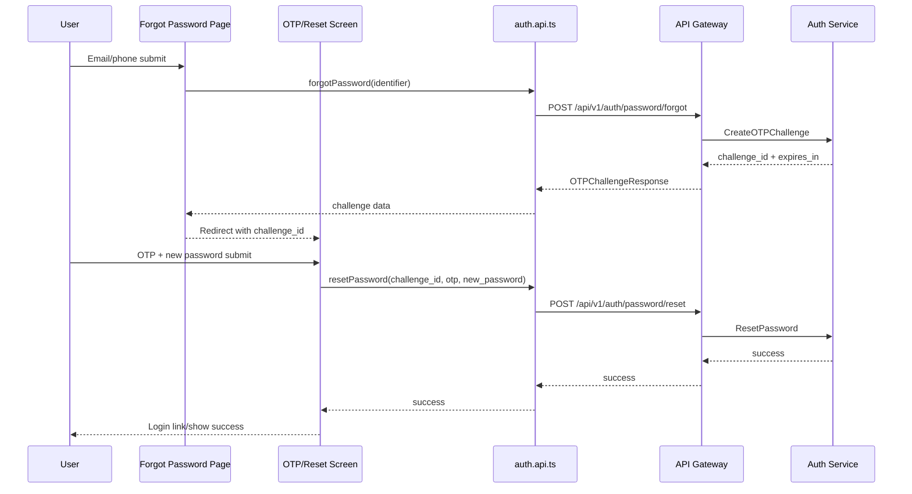
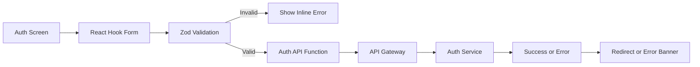

# 🔐 User App Frontend - Task 3: Auth Screens


## 📌 Task Summary

| Field | Detail |
|---|---|
| Task Name | Auth screens |
| Source | `docs/01-micro-tasks.md` → `User App Frontend` → Task 3 |
| Priority | `P0` foundation/blocker |
| Dependency | Auth APIs |
| Main Goal | Signup, login, OTP, forgot password screens banana aur strong form validation rakhna |
| Output Type | Documentation-only implementation guide |
| Not Included | Product browsing, cart/checkout, profile module, Zustand session store, React Query cache, gRPC-Web client |

> **Simple Hinglish goal:** Is task ka kaam User App ke andar authentication screens build karna hai. User signup kar sake, login kar sake, OTP verify kar sake, forgot password flow start kar sake, aur reset password complete kar sake. Forms me validation strong hogi, API calls typed rahenge, errors user-friendly honge, aur sensitive data UI/logs me leak nahi hoga.

---

## ✅ Final Output Created

```text
TaskImplementation/
└── User App Frontend/
    ├── task1.md
    ├── task2.md
    └── task3.md
```

### Why this structure?

- `TaskImplementation/` project ke task-wise implementation guides ka central folder hai.
- `User App Frontend/` buyer/user-facing React app ke implementation guides ko group karta hai.
- `task3.md` sirf **User App Frontend - Task 3: Auth screens** ka complete step-by-step guide hai.

> 🟡 **Scope note:** Current request ke hisaab se sirf required folder structure aur `task3.md` create kiya gaya. Actual `frontend/user-app` source files yahan create nahi kiye gaye.

---

## 🧭 Source Docs Studied

| Document | Kya use kiya gaya |
|---|---|
| `docs/01-micro-tasks.md` | Task 3 ka exact scope: signup, login, OTP, forgot password screens, strong validation |
| `docs/10-frontend-implementation.md` | Frontend stack, form state rule, auth pages list, protected route behavior |
| `docs/03-folder-structure.md` | `frontend/user-app/src/features/auth/` recommended structure |
| `docs/06-auth-security.md` | JWT rules, OTP expiry/attempt rules, secure sessions, validation layers |
| `docs/04-microservice-design.md` | Auth Service REST APIs and internal auth logic |
| `api/master-api.json` | Public auth endpoints, request schemas, response schemas |
| `TaskImplementation/User App Frontend/task1.md` | React TS + Tailwind foundation boundary |
| `TaskImplementation/User App Frontend/task2.md` | App shell, routing, account-menu entry point boundary |

---

## 🎯 Task Boundary

### ✅ Included in Task 3

- Login screen
- Signup screen
- OTP verification screen
- Forgot password screen
- Reset password screen
- Strong client-side validation with schema rules
- Typed Auth API functions for public auth endpoints
- Reusable auth form UI components
- Route wiring under the existing app shell
- Loading, success, empty, and error states for auth forms
- Basic accessibility: labels, descriptions, focus states, error messages
- Security-conscious UX: no password/OTP/token logging

### ❌ Not Included in Task 3

| Feature | Kyun nahi? |
|---|---|
| Product listing/search results | Ye `User App Frontend - Task 4: Product browsing` ka scope hai |
| Cart page, checkout, payment | Ye `Task 5: Cart and checkout` ka scope hai |
| Profile, addresses, orders, wishlist | Ye `Task 6: Profile module` ka scope hai |
| Zustand global session store | Ye `Task 7: State management` ka scope hai |
| React Query server cache | Ye `Task 7: State management` ka scope hai |
| Protected route guards polish | Task 7 me auth state stable hone ke baad final guard add hoga |
| gRPC-Web generated client | Ye `Task 8: gRPC-Web client` ka scope hai |
| Seller/admin auth screens | Ye User App buyer auth task ka part nahi hai |

> 🟢 **Rule:** Task 3 screens aur form/API wiring tak limited rahega. Auth business rules backend ka source of truth hain; frontend sirf UX validation aur API submission karega.

---

## 🧱 Target Implementation Folder Structure

Actual frontend implementation execute karte time Task 3 ke baad target structure ye hoga:

```text
frontend/
└── user-app/
    └── src/
        ├── app.tsx
        ├── app-shell/
        │   ├── account-menu.tsx
        │   └── ...
        ├── components/
        │   └── ui/
        │       ├── alert.tsx
        │       ├── button.tsx
        │       ├── input.tsx
        │       └── password-input.tsx
        ├── features/
        │   └── auth/
        │       ├── api/
        │       │   └── auth.api.ts
        │       ├── components/
        │       │   ├── auth-card.tsx
        │       │   ├── auth-field.tsx
        │       │   ├── auth-submit.tsx
        │       │   ├── password-strength.tsx
        │       │   └── resend-otp-button.tsx
        │       ├── pages/
        │       │   ├── forgot-password-page.tsx
        │       │   ├── login-page.tsx
        │       │   ├── otp-page.tsx
        │       │   ├── reset-password-page.tsx
        │       │   └── signup-page.tsx
        │       ├── schemas.ts
        │       ├── types.ts
        │       └── utils.ts
        ├── lib/
        │   ├── env.ts
        │   └── http.ts
        └── routes/
            ├── index.tsx
            └── route-paths.ts
```

### Folder responsibility

| Path | Responsibility |
|---|---|
| `src/features/auth/pages/` | Route-level auth screens |
| `src/features/auth/components/` | Auth-specific form building blocks |
| `src/features/auth/api/auth.api.ts` | Typed functions for Auth REST endpoints |
| `src/features/auth/schemas.ts` | Zod validation schemas and inferred form types |
| `src/features/auth/types.ts` | API request/response TypeScript types |
| `src/features/auth/utils.ts` | Small helpers like redirect sanitization and target channel detection |
| `src/components/ui/` | Shared UI primitives used by auth screens |
| `src/lib/http.ts` | Minimal fetch wrapper for API Gateway calls |
| `src/routes/` | Route constants and route tree updates |

---

## 🧩 Auth Feature Architecture



### Hinglish explanation

- User route open karta hai, jaise `/login`.
- Page component React Hook Form se form state manage karta hai.
- Zod schema submit se pehle input validate karta hai.
- Valid data `auth.api.ts` ke through API Gateway ko send hota hai.
- API success par user ko next screen par redirect kiya jata hai.
- API failure par safe, readable error banner show hota hai.

---

## 🔐 Auth API Contract

`api/master-api.json` ke according Task 3 screens in public auth endpoints ko use karenge:

| Screen | Method | Endpoint | Request | Response | Auth |
|---|---|---|---|---|---|
| Signup | `POST` | `/api/v1/auth/signup` | `SignupRequest` | `AuthSessionResponse` | public |
| Login | `POST` | `/api/v1/auth/login` | `LoginRequest` | `AuthSessionResponse` | public |
| Send OTP | `POST` | `/api/v1/auth/otp/send` | `SendOTPRequest` | `OTPChallengeResponse` | public |
| Verify OTP | `POST` | `/api/v1/auth/otp/verify` | `VerifyOTPRequest` | `SuccessResponse` | public |
| Forgot Password | `POST` | `/api/v1/auth/password/forgot` | `ForgotPasswordRequest` | `OTPChallengeResponse` | public |
| Reset Password | `POST` | `/api/v1/auth/password/reset` | `ResetPasswordRequest` | `SuccessResponse` | public |

### Important security rules from docs

| Rule | Frontend behavior |
|---|---|
| Access token short-lived | UI should not assume permanent login |
| Refresh token rotates | Full refresh handling belongs to Task 7 |
| OTP expires in around 5 minutes | OTP page shows expiry/resend UX |
| Max OTP attempts enforced by backend | Frontend shows clear error after failed attempt |
| Passwords/OTP/tokens never logged | No `console.log(formData)` for auth forms |
| Validation has multiple layers | Frontend validation improves UX, backend remains source of truth |

---

## 🔁 Login and Signup Flow



> 🟡 **Task 3 boundary:** Login/signup success par session response receive hoga. Long-lived session store, silent refresh, protected route retry, and role-based route guards Task 7 me final honge.

---

## 🔁 OTP and Password Reset Flow



---

## 📦 External Libraries and Tools

| Tool/Library | Type | Why Used | Install/Use |
|---|---|---|---|
| React | UI library | Auth screens component-based banane ke liye | Task 1 Vite setup me installed |
| TypeScript | Type system | Form values, API payloads, responses type-safe rakhne ke liye | Task 1 setup |
| Tailwind CSS | Styling | Responsive, accessible forms fast style karne ke liye | Task 1 setup |
| `react-router-dom` | Routing | `/login`, `/signup`, `/auth/otp`, `/forgot-password`, `/reset-password` routes ke liye | Task 2 me added |
| `lucide-react` | Icons | Password visibility, mail, lock, alert icons ke liye | Task 2 me added |
| `react-hook-form` | Form state | Auth forms me touched/dirty/submitting/errors efficiently manage karne ke liye | `pnpm --filter user-app add react-hook-form` |
| `zod` | Validation schema | Email/password/OTP rules centralize aur type infer karne ke liye | `pnpm --filter user-app add zod` |
| `@hookform/resolvers` | Adapter | Zod schemas ko React Hook Form ke resolver me connect karne ke liye | `pnpm --filter user-app add @hookform/resolvers` |

### Install command

```bash
pnpm --filter user-app add react-hook-form zod @hookform/resolvers
```

### Optional test tools for Task 3 verification

```bash
pnpm --filter user-app add -D vitest jsdom @testing-library/react @testing-library/user-event msw
```

| Tool | Why useful |
|---|---|
| Vitest | Fast unit/component tests |
| jsdom | Browser-like DOM environment |
| Testing Library | User-focused form interaction tests |
| MSW | Auth API responses mock karne ke liye |

> 🟡 **Note:** Test tools optional hain agar Task 1 me testing setup already nahi hua. Auth screens high-risk UX hain, isliye component/API mock tests recommended hain.

### Not used in Task 3

| Library | Later Task | Reason |
|---|---|---|
| Zustand | Task 7 | Global session state later define hoga |
| React Query | Task 7 | Server cache/mutations centralization later |
| gRPC-Web client | Task 8 | Auth screens public REST APIs use karenge |
| Large UI kit | Not needed | Simple shared primitives enough hain |

---

## 🪜 Step-by-Step Implementation

## Step 1: Task 1 and Task 2 Foundation Confirm Karo

Task 3 start karne se pehle React TS setup aur app shell ready hona chahiye.

```bash
pnpm --filter user-app typecheck
pnpm --filter user-app lint
pnpm --filter user-app build
```

Expected:

```text
TypeScript, lint, and build checks pass.
```

### Explanation

Auth screens routing aur shell ke andar mount honge. Agar Task 1/2 foundation broken hai, auth screens debug karna confusing ho jayega.

---

## Step 2: Form Validation Libraries Install Karo

`frontend/` workspace root se:

```bash
pnpm --filter user-app add react-hook-form zod @hookform/resolvers
```

### Explanation

- `react-hook-form` se form state lightweight rahegi.
- `zod` se validation rules ek jagah centralize honge.
- `@hookform/resolvers` se Zod schema directly form validation me plug hoga.

---

## Step 3: Auth Routes Define Karo

Task 2 ke `route-paths.ts` me auth route constants add karo.

```ts
// src/routes/route-paths.ts
export const routePaths = {
  home: "/",
  search: "/search",
  cart: "/cart",
  login: "/login",
  signup: "/signup",
  otp: "/auth/otp",
  forgotPassword: "/forgot-password",
  resetPassword: "/reset-password",
} as const;
```

### Explanation

Route strings ko constants me rakhne se typo bugs kam hote hain. Account menu, redirect logic, and route config same source use karte hain.

---

## Step 4: Auth Types Banao

API contract ke according request/response types define karo.

```ts
// src/features/auth/types.ts
export type AuthRole = "buyer" | "seller";

export type SignupRequest = {
  email: string;
  phone?: string;
  password: string;
  full_name: string;
  role?: AuthRole;
};

export type LoginRequest = {
  identifier: string;
  password: string;
  device?: {
    user_agent?: string;
    timezone?: string;
  };
};

export type TokenResponse = {
  access_token: string;
  refresh_token: string;
  expires_in: number;
};

export type UserProfile = {
  id: string;
  email: string;
  phone?: string;
  full_name: string;
};

export type AuthSessionResponse = {
  user?: UserProfile;
  tokens?: TokenResponse;
  session_id?: string;
};

export type SendOtpRequest = {
  target: string;
  channel: "email" | "phone";
  purpose: "signup" | "login" | "password_reset" | "phone_verify" | "email_verify";
};

export type OtpChallengeResponse = {
  challenge_id: string;
  expires_in: number;
};

export type VerifyOtpRequest = {
  challenge_id: string;
  otp: string;
};

export type ForgotPasswordRequest = {
  identifier: string;
};

export type ResetPasswordRequest = {
  challenge_id: string;
  otp: string;
  new_password: string;
};

export type SuccessResponse = {
  success?: boolean;
  message?: string;
};
```

### Explanation

Types frontend ko API shape ke saath aligned rakhte hain. Backend exact source of truth hai, but typed frontend payload se accidental wrong fields avoid hote hain.

---

## Step 5: Minimal HTTP Client Add Karo

Auth API ke liye ek small `fetch` wrapper use karo.

```ts
// src/lib/http.ts
type ApiEnvelope<T> = {
  data?: T;
  request_id?: string;
  error?: {
    code: string;
    message: string;
    details?: unknown;
  };
};

export class ApiError extends Error {
  code: string;
  requestId?: string;
  details?: unknown;

  constructor(message: string, code: string, requestId?: string, details?: unknown) {
    super(message);
    this.name = "ApiError";
    this.code = code;
    this.requestId = requestId;
    this.details = details;
  }
}

export async function postJson<TResponse, TBody>(
  path: string,
  body: TBody,
  signal?: AbortSignal,
): Promise<TResponse> {
  const response = await fetch(`${import.meta.env.VITE_API_BASE_URL}${path}`, {
    method: "POST",
    headers: {
      "Content-Type": "application/json",
      "X-Request-Source": "user-app",
    },
    body: JSON.stringify(body),
    signal,
  });

  const envelope = (await response.json()) as ApiEnvelope<TResponse>;

  if (!response.ok || envelope.error) {
    throw new ApiError(
      envelope.error?.message ?? "Request failed",
      envelope.error?.code ?? "REQUEST_FAILED",
      envelope.request_id,
      envelope.error?.details,
    );
  }

  if (!envelope.data) {
    throw new ApiError("Empty response from server", "EMPTY_RESPONSE", envelope.request_id);
  }

  return envelope.data;
}
```

### Explanation

- Base URL env se aata hai.
- Gateway response envelope normalize hota hai.
- UI pages ko raw `fetch` details repeat nahi karne padte.
- Token attach/refresh logic intentionally yahan final nahi kiya gaya; wo Task 7 me stable auth state ke saath add hoga.

---

## Step 6: Auth API Functions Banao

```ts
// src/features/auth/api/auth.api.ts
import { postJson } from "../../../lib/http";
import type {
  AuthSessionResponse,
  ForgotPasswordRequest,
  LoginRequest,
  OtpChallengeResponse,
  ResetPasswordRequest,
  SendOtpRequest,
  SignupRequest,
  SuccessResponse,
  VerifyOtpRequest,
} from "../types";

export function signup(payload: SignupRequest, signal?: AbortSignal) {
  return postJson<AuthSessionResponse, SignupRequest>("/api/v1/auth/signup", payload, signal);
}

export function login(payload: LoginRequest, signal?: AbortSignal) {
  return postJson<AuthSessionResponse, LoginRequest>("/api/v1/auth/login", payload, signal);
}

export function sendOtp(payload: SendOtpRequest, signal?: AbortSignal) {
  return postJson<OtpChallengeResponse, SendOtpRequest>("/api/v1/auth/otp/send", payload, signal);
}

export function verifyOtp(payload: VerifyOtpRequest, signal?: AbortSignal) {
  return postJson<SuccessResponse, VerifyOtpRequest>("/api/v1/auth/otp/verify", payload, signal);
}

export function forgotPassword(payload: ForgotPasswordRequest, signal?: AbortSignal) {
  return postJson<OtpChallengeResponse, ForgotPasswordRequest>(
    "/api/v1/auth/password/forgot",
    payload,
    signal,
  );
}

export function resetPassword(payload: ResetPasswordRequest, signal?: AbortSignal) {
  return postJson<SuccessResponse, ResetPasswordRequest>(
    "/api/v1/auth/password/reset",
    payload,
    signal,
  );
}
```

### Explanation

API functions route-level pages ko clean rakhti hain. Page ko sirf `login(payload)` call karna hai, endpoint strings ya response parsing repeat nahi karna.

---

## Step 7: Zod Schemas Add Karo

```ts
// src/features/auth/schemas.ts
import { z } from "zod";

const passwordSchema = z
  .string()
  .min(8, "Password minimum 8 characters ka hona chahiye")
  .max(128, "Password maximum 128 characters ka ho sakta hai")
  .regex(/[A-Z]/, "Password me at least 1 uppercase letter hona chahiye")
  .regex(/[a-z]/, "Password me at least 1 lowercase letter hona chahiye")
  .regex(/[0-9]/, "Password me at least 1 number hona chahiye");

export const loginSchema = z.object({
  identifier: z.string().trim().min(1, "Email ya phone required hai"),
  password: z.string().min(1, "Password required hai"),
});

export const signupSchema = z
  .object({
    full_name: z.string().trim().min(2, "Full name minimum 2 characters ka hona chahiye"),
    email: z.string().trim().email("Valid email enter karo"),
    phone: z.string().trim().optional(),
    password: passwordSchema,
    confirmPassword: z.string().min(1, "Confirm password required hai"),
    role: z.enum(["buyer", "seller"]).default("buyer"),
    acceptTerms: z.literal(true, {
      errorMap: () => ({ message: "Terms accept karna zaruri hai" }),
    }),
  })
  .refine((data) => data.password === data.confirmPassword, {
    path: ["confirmPassword"],
    message: "Passwords match nahi kar rahe",
  });

export const otpSchema = z.object({
  challenge_id: z.string().min(1, "Challenge missing hai"),
  otp: z
    .string()
    .trim()
    .regex(/^[0-9]{6}$/, "OTP 6 digit number hona chahiye"),
});

export const forgotPasswordSchema = z.object({
  identifier: z.string().trim().min(1, "Email ya phone required hai"),
});

export const resetPasswordSchema = z
  .object({
    challenge_id: z.string().min(1, "Challenge missing hai"),
    otp: z
      .string()
      .trim()
      .regex(/^[0-9]{6}$/, "OTP 6 digit number hona chahiye"),
    new_password: passwordSchema,
    confirmPassword: z.string().min(1, "Confirm password required hai"),
  })
  .refine((data) => data.new_password === data.confirmPassword, {
    path: ["confirmPassword"],
    message: "Passwords match nahi kar rahe",
  });

export type LoginFormValues = z.infer<typeof loginSchema>;
export type SignupFormValues = z.infer<typeof signupSchema>;
export type OtpFormValues = z.infer<typeof otpSchema>;
export type ForgotPasswordFormValues = z.infer<typeof forgotPasswordSchema>;
export type ResetPasswordFormValues = z.infer<typeof resetPasswordSchema>;
```

### Explanation

Zod schemas se validation rules reusable ban gaye:

- Login me identifier/password required.
- Signup me email, name, password strength, confirm password, terms.
- OTP me exact 6 digit numeric code.
- Reset password me OTP + new password strength + confirm match.

> 🟡 **Important:** Frontend password rules UX ke liye hain. Backend password policy final authority rahegi.

---

## Step 8: Small Auth Utils Banao

```ts
// src/features/auth/utils.ts
export function getDeviceInfo() {
  return {
    user_agent: navigator.userAgent,
    timezone: Intl.DateTimeFormat().resolvedOptions().timeZone,
  };
}

export function detectOtpChannel(identifier: string): "email" | "phone" {
  return identifier.includes("@") ? "email" : "phone";
}

export function safeRedirectPath(value: string | null, fallback = "/") {
  if (!value || !value.startsWith("/") || value.startsWith("//")) {
    return fallback;
  }

  return value;
}
```

### Explanation

- Device info login request ke optional metadata me ja sakta hai.
- OTP channel email/phone target se infer ho sakta hai.
- Redirect sanitize karne se open redirect type bugs avoid hote hain.

---

## Step 9: Shared Auth UI Components Banao

### Auth card

```tsx
// src/features/auth/components/auth-card.tsx
import type { ReactNode } from "react";

type AuthCardProps = {
  title: string;
  description: string;
  children: ReactNode;
};

export function AuthCard({ title, description, children }: AuthCardProps) {
  return (
    <section className="mx-auto w-full max-w-md rounded-lg border border-slate-200 bg-white p-6 shadow-sm">
      <div className="mb-6">
        <h1 className="text-2xl font-semibold text-slate-950">{title}</h1>
        <p className="mt-2 text-sm text-slate-600">{description}</p>
      </div>
      {children}
    </section>
  );
}
```

### Auth field

```tsx
// src/features/auth/components/auth-field.tsx
import type { InputHTMLAttributes } from "react";

type AuthFieldProps = InputHTMLAttributes<HTMLInputElement> & {
  label: string;
  error?: string;
};

export function AuthField({ label, error, id, ...props }: AuthFieldProps) {
  const fieldId = id ?? props.name;
  const errorId = error && fieldId ? `${fieldId}-error` : undefined;

  return (
    <div className="space-y-1.5">
      <label htmlFor={fieldId} className="text-sm font-medium text-slate-800">
        {label}
      </label>
      <input
        id={fieldId}
        aria-invalid={Boolean(error)}
        aria-describedby={errorId}
        className="w-full rounded-md border border-slate-300 px-3 py-2 text-sm outline-none transition focus:border-sky-500 focus:ring-2 focus:ring-sky-100"
        {...props}
      />
      {error ? (
        <p id={errorId} className="text-sm text-red-600">
          {error}
        </p>
      ) : null}
    </div>
  );
}
```

### Submit button

```tsx
// src/features/auth/components/auth-submit.tsx
type AuthSubmitProps = {
  children: string;
  isSubmitting: boolean;
};

export function AuthSubmit({ children, isSubmitting }: AuthSubmitProps) {
  return (
    <button
      type="submit"
      disabled={isSubmitting}
      className="w-full rounded-md bg-sky-600 px-4 py-2.5 text-sm font-semibold text-white transition hover:bg-sky-700 focus:outline-none focus:ring-2 focus:ring-sky-200 disabled:cursor-not-allowed disabled:bg-slate-400"
    >
      {isSubmitting ? "Please wait..." : children}
    </button>
  );
}
```

### Explanation

Reusable components se all auth pages same spacing, labels, errors, and focus states follow karte hain. Ye beginner-friendly bhi hai kyunki page components me repeated Tailwind classes kam hoti hain.

---

## Step 10: Login Page Build Karo

```tsx
// src/features/auth/pages/login-page.tsx
import { zodResolver } from "@hookform/resolvers/zod";
import { Link, useNavigate, useSearchParams } from "react-router-dom";
import { useState } from "react";
import { useForm } from "react-hook-form";
import { login } from "../api/auth.api";
import { AuthCard } from "../components/auth-card";
import { AuthField } from "../components/auth-field";
import { AuthSubmit } from "../components/auth-submit";
import { loginSchema, type LoginFormValues } from "../schemas";
import { getDeviceInfo, safeRedirectPath } from "../utils";
import { routePaths } from "../../../routes/route-paths";

export function LoginPage() {
  const navigate = useNavigate();
  const [searchParams] = useSearchParams();
  const [serverError, setServerError] = useState<string | null>(null);

  const {
    register,
    handleSubmit,
    formState: { errors, isSubmitting },
  } = useForm<LoginFormValues>({
    resolver: zodResolver(loginSchema),
    defaultValues: {
      identifier: "",
      password: "",
    },
  });

  async function onSubmit(values: LoginFormValues) {
    setServerError(null);

    try {
      await login({
        identifier: values.identifier,
        password: values.password,
        device: getDeviceInfo(),
      });

      navigate(safeRedirectPath(searchParams.get("redirect")));
    } catch (error) {
      setServerError(error instanceof Error ? error.message : "Login failed");
    }
  }

  return (
    <AuthCard title="Welcome back" description="Apne account me login karo.">
      <form className="space-y-4" onSubmit={handleSubmit(onSubmit)} noValidate>
        {serverError ? (
          <div className="rounded-md border border-red-200 bg-red-50 px-3 py-2 text-sm text-red-700">
            {serverError}
          </div>
        ) : null}

        <AuthField
          label="Email or phone"
          type="text"
          autoComplete="username"
          error={errors.identifier?.message}
          {...register("identifier")}
        />

        <AuthField
          label="Password"
          type="password"
          autoComplete="current-password"
          error={errors.password?.message}
          {...register("password")}
        />

        <div className="flex justify-end">
          <Link className="text-sm font-medium text-sky-700 hover:text-sky-800" to={routePaths.forgotPassword}>
            Forgot password?
          </Link>
        </div>

        <AuthSubmit isSubmitting={isSubmitting}>Login</AuthSubmit>
      </form>

      <p className="mt-6 text-center text-sm text-slate-600">
        New user?{" "}
        <Link className="font-medium text-sky-700 hover:text-sky-800" to={routePaths.signup}>
          Create account
        </Link>
      </p>
    </AuthCard>
  );
}
```

### Explanation

- Login page `identifier` + `password` leta hai.
- `zodResolver(loginSchema)` submit se pehle validation run karta hai.
- `login()` API call typed payload ke saath hoti hai.
- Server error banner me show hota hai.
- Success par redirect safe path par hota hai.

---

## Step 11: Signup Page Build Karo

```tsx
// src/features/auth/pages/signup-page.tsx
import { zodResolver } from "@hookform/resolvers/zod";
import { Link, useNavigate } from "react-router-dom";
import { useState } from "react";
import { useForm } from "react-hook-form";
import { signup } from "../api/auth.api";
import { AuthCard } from "../components/auth-card";
import { AuthField } from "../components/auth-field";
import { AuthSubmit } from "../components/auth-submit";
import { signupSchema, type SignupFormValues } from "../schemas";
import { routePaths } from "../../../routes/route-paths";

export function SignupPage() {
  const navigate = useNavigate();
  const [serverError, setServerError] = useState<string | null>(null);

  const {
    register,
    handleSubmit,
    formState: { errors, isSubmitting },
  } = useForm<SignupFormValues>({
    resolver: zodResolver(signupSchema),
    defaultValues: {
      full_name: "",
      email: "",
      phone: "",
      password: "",
      confirmPassword: "",
      role: "buyer",
      acceptTerms: false,
    },
  });

  async function onSubmit(values: SignupFormValues) {
    setServerError(null);

    try {
      await signup({
        full_name: values.full_name,
        email: values.email,
        phone: values.phone || undefined,
        password: values.password,
        role: values.role,
      });

      navigate(routePaths.otp);
    } catch (error) {
      setServerError(error instanceof Error ? error.message : "Signup failed");
    }
  }

  return (
    <AuthCard title="Create your account" description="Shopping start karne ke liye account banao.">
      <form className="space-y-4" onSubmit={handleSubmit(onSubmit)} noValidate>
        {serverError ? (
          <div className="rounded-md border border-red-200 bg-red-50 px-3 py-2 text-sm text-red-700">
            {serverError}
          </div>
        ) : null}

        <AuthField label="Full name" type="text" autoComplete="name" error={errors.full_name?.message} {...register("full_name")} />
        <AuthField label="Email" type="email" autoComplete="email" error={errors.email?.message} {...register("email")} />
        <AuthField label="Phone optional" type="tel" autoComplete="tel" error={errors.phone?.message} {...register("phone")} />
        <AuthField label="Password" type="password" autoComplete="new-password" error={errors.password?.message} {...register("password")} />
        <AuthField label="Confirm password" type="password" autoComplete="new-password" error={errors.confirmPassword?.message} {...register("confirmPassword")} />

        <label className="flex gap-2 text-sm text-slate-700">
          <input type="checkbox" className="mt-1 rounded border-slate-300" {...register("acceptTerms")} />
          <span>I agree to the terms and privacy policy.</span>
        </label>
        {errors.acceptTerms?.message ? <p className="text-sm text-red-600">{errors.acceptTerms.message}</p> : null}

        <AuthSubmit isSubmitting={isSubmitting}>Create account</AuthSubmit>
      </form>

      <p className="mt-6 text-center text-sm text-slate-600">
        Already have an account?{" "}
        <Link className="font-medium text-sky-700 hover:text-sky-800" to={routePaths.login}>
          Login
        </Link>
      </p>
    </AuthCard>
  );
}
```

### Explanation

- Signup page required fields validate karta hai.
- Password + confirm password match check hota hai.
- Default role `buyer` rakha gaya hai because ye User App hai.
- Success ke baad OTP verification page par ja sakte hain.

> 🟡 **Boundary note:** Seller signup option API me possible hai, but User App Task 3 ka primary role buyer hai. Seller onboarding/dashboard separate module me polish hoga.

---

## Step 12: OTP Page Build Karo

```tsx
// src/features/auth/pages/otp-page.tsx
import { zodResolver } from "@hookform/resolvers/zod";
import { useState } from "react";
import { useForm } from "react-hook-form";
import { useNavigate, useSearchParams } from "react-router-dom";
import { sendOtp, verifyOtp } from "../api/auth.api";
import { AuthCard } from "../components/auth-card";
import { AuthField } from "../components/auth-field";
import { AuthSubmit } from "../components/auth-submit";
import { otpSchema, type OtpFormValues } from "../schemas";
import { detectOtpChannel } from "../utils";
import { routePaths } from "../../../routes/route-paths";

export function OtpPage() {
  const navigate = useNavigate();
  const [searchParams] = useSearchParams();
  const target = searchParams.get("target") ?? "";
  const [serverError, setServerError] = useState<string | null>(null);
  const [success, setSuccess] = useState<string | null>(null);

  const {
    register,
    handleSubmit,
    formState: { errors, isSubmitting },
  } = useForm<OtpFormValues>({
    resolver: zodResolver(otpSchema),
    defaultValues: {
      challenge_id: searchParams.get("challenge_id") ?? "",
      otp: "",
    },
  });

  async function onSubmit(values: OtpFormValues) {
    setServerError(null);
    setSuccess(null);

    try {
      await verifyOtp(values);
      setSuccess("OTP verify ho gaya.");
      navigate(routePaths.login);
    } catch (error) {
      setServerError(error instanceof Error ? error.message : "OTP verification failed");
    }
  }

  async function handleResend() {
    if (!target) {
      setServerError("Resend ke liye email ya phone missing hai.");
      return;
    }

    const challenge = await sendOtp({
      target,
      channel: detectOtpChannel(target),
      purpose: "signup",
    });

    setSuccess(`New OTP sent. Expires in ${challenge.expires_in} seconds.`);
  }

  return (
    <AuthCard title="Verify OTP" description="Email ya phone par received 6 digit code enter karo.">
      <form className="space-y-4" onSubmit={handleSubmit(onSubmit)} noValidate>
        {serverError ? (
          <div className="rounded-md border border-red-200 bg-red-50 px-3 py-2 text-sm text-red-700">
            {serverError}
          </div>
        ) : null}

        {success ? (
          <div className="rounded-md border border-emerald-200 bg-emerald-50 px-3 py-2 text-sm text-emerald-700">
            {success}
          </div>
        ) : null}

        <input type="hidden" {...register("challenge_id")} />

        <AuthField
          label="OTP"
          inputMode="numeric"
          autoComplete="one-time-code"
          maxLength={6}
          error={errors.otp?.message}
          {...register("otp")}
        />

        <AuthSubmit isSubmitting={isSubmitting}>Verify OTP</AuthSubmit>

        <button type="button" className="w-full text-sm font-medium text-sky-700 hover:text-sky-800" onClick={handleResend}>
          Resend OTP
        </button>
      </form>
    </AuthCard>
  );
}
```

### Explanation

- OTP input numeric mode use karta hai mobile keyboard ke liye.
- Hidden `challenge_id` backend verification ke liye required hai.
- Resend button `sendOtp()` call karta hai.
- Backend cooldown/rate-limit enforce karega; frontend error politely show karega.

---

## Step 13: Forgot Password Page Build Karo

```tsx
// src/features/auth/pages/forgot-password-page.tsx
import { zodResolver } from "@hookform/resolvers/zod";
import { Link, useNavigate } from "react-router-dom";
import { useState } from "react";
import { useForm } from "react-hook-form";
import { forgotPassword } from "../api/auth.api";
import { AuthCard } from "../components/auth-card";
import { AuthField } from "../components/auth-field";
import { AuthSubmit } from "../components/auth-submit";
import { forgotPasswordSchema, type ForgotPasswordFormValues } from "../schemas";
import { routePaths } from "../../../routes/route-paths";

export function ForgotPasswordPage() {
  const navigate = useNavigate();
  const [serverError, setServerError] = useState<string | null>(null);

  const {
    register,
    handleSubmit,
    formState: { errors, isSubmitting },
  } = useForm<ForgotPasswordFormValues>({
    resolver: zodResolver(forgotPasswordSchema),
    defaultValues: {
      identifier: "",
    },
  });

  async function onSubmit(values: ForgotPasswordFormValues) {
    setServerError(null);

    try {
      const challenge = await forgotPassword({ identifier: values.identifier });
      const params = new URLSearchParams({
        challenge_id: challenge.challenge_id,
        target: values.identifier,
      });

      navigate(`${routePaths.resetPassword}?${params.toString()}`);
    } catch (error) {
      setServerError(error instanceof Error ? error.message : "Could not start password reset");
    }
  }

  return (
    <AuthCard title="Forgot password" description="Email ya phone enter karo, hum OTP challenge start karenge.">
      <form className="space-y-4" onSubmit={handleSubmit(onSubmit)} noValidate>
        {serverError ? (
          <div className="rounded-md border border-red-200 bg-red-50 px-3 py-2 text-sm text-red-700">
            {serverError}
          </div>
        ) : null}

        <AuthField
          label="Email or phone"
          type="text"
          autoComplete="username"
          error={errors.identifier?.message}
          {...register("identifier")}
        />

        <AuthSubmit isSubmitting={isSubmitting}>Send reset OTP</AuthSubmit>
      </form>

      <p className="mt-6 text-center text-sm text-slate-600">
        Remember password?{" "}
        <Link className="font-medium text-sky-700 hover:text-sky-800" to={routePaths.login}>
          Login
        </Link>
      </p>
    </AuthCard>
  );
}
```

### Explanation

- User email/phone submit karta hai.
- Backend `challenge_id` return karta hai.
- Page reset password route par redirect karta hai.
- Challenge ID visible query me rakhna acceptable ho sakta hai, but sensitive OTP/password kabhi query me nahi jana chahiye.

---

## Step 14: Reset Password Page Build Karo

```tsx
// src/features/auth/pages/reset-password-page.tsx
import { zodResolver } from "@hookform/resolvers/zod";
import { Link, useNavigate, useSearchParams } from "react-router-dom";
import { useState } from "react";
import { useForm } from "react-hook-form";
import { resetPassword } from "../api/auth.api";
import { AuthCard } from "../components/auth-card";
import { AuthField } from "../components/auth-field";
import { AuthSubmit } from "../components/auth-submit";
import { resetPasswordSchema, type ResetPasswordFormValues } from "../schemas";
import { routePaths } from "../../../routes/route-paths";

export function ResetPasswordPage() {
  const navigate = useNavigate();
  const [searchParams] = useSearchParams();
  const [serverError, setServerError] = useState<string | null>(null);
  const [success, setSuccess] = useState<string | null>(null);

  const {
    register,
    handleSubmit,
    formState: { errors, isSubmitting },
  } = useForm<ResetPasswordFormValues>({
    resolver: zodResolver(resetPasswordSchema),
    defaultValues: {
      challenge_id: searchParams.get("challenge_id") ?? "",
      otp: "",
      new_password: "",
      confirmPassword: "",
    },
  });

  async function onSubmit(values: ResetPasswordFormValues) {
    setServerError(null);
    setSuccess(null);

    try {
      await resetPassword({
        challenge_id: values.challenge_id,
        otp: values.otp,
        new_password: values.new_password,
      });

      setSuccess("Password reset ho gaya. Ab login kar sakte ho.");
      navigate(routePaths.login);
    } catch (error) {
      setServerError(error instanceof Error ? error.message : "Password reset failed");
    }
  }

  return (
    <AuthCard title="Reset password" description="OTP aur new password enter karo.">
      <form className="space-y-4" onSubmit={handleSubmit(onSubmit)} noValidate>
        {serverError ? (
          <div className="rounded-md border border-red-200 bg-red-50 px-3 py-2 text-sm text-red-700">
            {serverError}
          </div>
        ) : null}

        {success ? (
          <div className="rounded-md border border-emerald-200 bg-emerald-50 px-3 py-2 text-sm text-emerald-700">
            {success}
          </div>
        ) : null}

        <input type="hidden" {...register("challenge_id")} />

        <AuthField label="OTP" inputMode="numeric" autoComplete="one-time-code" maxLength={6} error={errors.otp?.message} {...register("otp")} />
        <AuthField label="New password" type="password" autoComplete="new-password" error={errors.new_password?.message} {...register("new_password")} />
        <AuthField label="Confirm new password" type="password" autoComplete="new-password" error={errors.confirmPassword?.message} {...register("confirmPassword")} />

        <AuthSubmit isSubmitting={isSubmitting}>Reset password</AuthSubmit>
      </form>

      <p className="mt-6 text-center text-sm text-slate-600">
        Back to{" "}
        <Link className="font-medium text-sky-700 hover:text-sky-800" to={routePaths.login}>
          login
        </Link>
      </p>
    </AuthCard>
  );
}
```

### Explanation

- Reset page `challenge_id`, OTP, new password submit karta hai.
- New password schema same strong rules follow karta hai.
- Password reset success ke baad user login screen par jaata hai.

---

## Step 15: Routes Wire Karo

Task 2 route tree me auth pages add karo.

```tsx
// src/routes/index.tsx
import { createBrowserRouter } from "react-router-dom";
import { AppShell } from "../app-shell/app-shell";
import { ForgotPasswordPage } from "../features/auth/pages/forgot-password-page";
import { LoginPage } from "../features/auth/pages/login-page";
import { OtpPage } from "../features/auth/pages/otp-page";
import { ResetPasswordPage } from "../features/auth/pages/reset-password-page";
import { SignupPage } from "../features/auth/pages/signup-page";
import { routePaths } from "./route-paths";

export const router = createBrowserRouter([
  {
    element: <AppShell />,
    children: [
      {
        path: routePaths.login,
        element: <LoginPage />,
      },
      {
        path: routePaths.signup,
        element: <SignupPage />,
      },
      {
        path: routePaths.otp,
        element: <OtpPage />,
      },
      {
        path: routePaths.forgotPassword,
        element: <ForgotPasswordPage />,
      },
      {
        path: routePaths.resetPassword,
        element: <ResetPasswordPage />,
      },
    ],
  },
]);
```

### Explanation

Auth screens app shell ke andar render honge, so user ko same header/navigation milega. Protected routes abhi final nahi banenge kyunki global auth/session state Task 7 me aayegi.

---

## Step 16: Account Menu Links Update Karo

Task 2 ke account menu me login/signup links actual routes se connect karo.

```tsx
// src/app-shell/account-menu.tsx
import { Link } from "react-router-dom";
import { routePaths } from "../routes/route-paths";

export function AccountMenu() {
  return (
    <details className="relative">
      <summary className="cursor-pointer rounded-md px-3 py-2 text-sm font-medium text-slate-700 hover:bg-slate-100">
        Account
      </summary>

      <div className="absolute right-0 z-20 mt-2 w-48 rounded-md border border-slate-200 bg-white p-2 shadow-lg">
        <Link className="block rounded px-3 py-2 text-sm text-slate-700 hover:bg-slate-50" to={routePaths.login}>
          Login
        </Link>
        <Link className="block rounded px-3 py-2 text-sm text-slate-700 hover:bg-slate-50" to={routePaths.signup}>
          Create account
        </Link>
      </div>
    </details>
  );
}
```

### Explanation

Task 2 me account menu placeholder tha. Task 3 me login/signup actual screens available hain, so menu links real routes par point karenge.

---

## Step 17: Auth Page Layout Polish Karo

Auth pages ko centered responsive layout me show karna recommended hai.

```tsx
// Example wrapper if route page needs consistent spacing
export function AuthPageFrame({ children }: { children: React.ReactNode }) {
  return (
    <div className="min-h-[calc(100vh-5rem)] bg-slate-50 px-4 py-8 sm:py-12">
      {children}
    </div>
  );
}
```

### UI rules

- Form width mobile par full, desktop par max `md`.
- Error text red but readable.
- Success state green but subtle.
- Buttons disabled during submit.
- Every input has visible label.
- Password fields use `autoComplete` correctly.
- OTP field uses `autoComplete="one-time-code"`.

---

## Step 18: Error Handling Standard Karo

Auth forms me 3 levels ke errors handle karo:

| Error Type | Example | UI Behavior |
|---|---|---|
| Client validation | Invalid email, short password | Inline field error |
| Server validation | Wrong password, OTP expired | Form-level error banner |
| Network/server failure | Gateway unreachable | Form-level retry message |

### Error banner example

```tsx
function AuthErrorBanner({ message }: { message: string }) {
  return (
    <div role="alert" className="rounded-md border border-red-200 bg-red-50 px-3 py-2 text-sm text-red-700">
      {message}
    </div>
  );
}
```

### Explanation

Error messages user ko action batayen, internal stack trace nahi. Request ID agar gateway response me aaye to support/debug ke liye optionally small text me show kar sakte hain.

---

## Step 19: Security and Privacy Checks Add Karo

Auth screens sensitive hote hain, isliye ye rules mandatory hain:

### ✅ Do

- Password/OTP/token ko console me log mat karo.
- `noValidate` use karo so custom schema errors consistent rahein.
- Backend errors ko safe message me show karo.
- OTP resend button me loading/cooldown state rakho.
- Redirect URL sanitize karo.
- Inputs me proper `autoComplete` attributes use karo.
- Access token storage final decision Task 7 me centralize karo.

### ❌ Don't

- Password ya OTP query params me mat bhejo.
- Raw JWT UI me render mat karo.
- Refresh token local component state me unnecessarily mat rakho.
- Frontend validation ko security source of truth mat samjho.
- Protected checkout/profile route abhi implement mat karo.
- Auth forms me product/cart/order calls add mat karo.

---

## Step 20: Component Tests Add Karo

Auth forms ke liye minimum tests useful rahenge.

```tsx
// src/features/auth/pages/login-page.test.tsx
import { render, screen } from "@testing-library/react";
import userEvent from "@testing-library/user-event";
import { RouterProvider, createMemoryRouter } from "react-router-dom";
import { LoginPage } from "./login-page";

function renderLogin() {
  const router = createMemoryRouter([{ path: "/login", element: <LoginPage /> }], {
    initialEntries: ["/login"],
  });

  return render(<RouterProvider router={router} />);
}

test("shows validation errors for empty login form", async () => {
  const user = userEvent.setup();
  renderLogin();

  await user.click(screen.getByRole("button", { name: /login/i }));

  expect(screen.getByText(/email ya phone required/i)).toBeInTheDocument();
  expect(screen.getByText(/password required/i)).toBeInTheDocument();
});
```

### Explanation

Test user behavior ke through form submit karta hai. Ye ensure karta hai ki validation screen par actually visible hai.

---

## Step 21: Verification Commands Run Karo

```bash
pnpm --filter user-app typecheck
pnpm --filter user-app lint
pnpm --filter user-app test
pnpm --filter user-app build
pnpm --filter user-app dev
```

Expected:

```text
typecheck: pass
lint: pass
test: pass
build: pass
dev server: auth routes render correctly
```

Manual browser checks:

| Route | Check |
|---|---|
| `/login` | Empty submit shows inline errors |
| `/signup` | Weak password and mismatch show errors |
| `/auth/otp` | OTP accepts 6 digit numeric input |
| `/forgot-password` | Identifier required before submit |
| `/reset-password` | OTP + password validation works |

---

## 🧠 How Each Part Was Built

| Part | Built By | Reason |
|---|---|---|
| Auth route constants | `routePaths` | One source of truth for URLs |
| Login screen | `LoginPage` + `loginSchema` | Existing users can authenticate |
| Signup screen | `SignupPage` + `signupSchema` | New buyer account creation |
| OTP screen | `OtpPage` + `otpSchema` | Email/phone verification |
| Forgot password screen | `ForgotPasswordPage` | Starts password reset challenge |
| Reset password screen | `ResetPasswordPage` | Completes password reset with OTP |
| Validation | Zod schemas | Strong, reusable, typed rules |
| Form state | React Hook Form | Efficient form state and errors |
| API calls | `auth.api.ts` | Typed public auth endpoint access |
| Error handling | `ApiError` + banners | Predictable user feedback |
| Styling | Tailwind CSS | Clean responsive form layout |
| Accessibility | Labels, aria-invalid, role alert | Screen-reader and keyboard friendly |

---

## 🧾 Clean Final Target Structure

After Task 3 implementation, frontend target files should look like:

```text
frontend/user-app/
├── package.json
└── src/
    ├── app-shell/
    │   ├── account-menu.tsx
    │   └── ...
    ├── components/
    │   └── ui/
    │       ├── alert.tsx
    │       ├── button.tsx
    │       ├── input.tsx
    │       └── password-input.tsx
    ├── features/
    │   └── auth/
    │       ├── api/
    │       │   └── auth.api.ts
    │       ├── components/
    │       │   ├── auth-card.tsx
    │       │   ├── auth-field.tsx
    │       │   ├── auth-submit.tsx
    │       │   ├── password-strength.tsx
    │       │   └── resend-otp-button.tsx
    │       ├── pages/
    │       │   ├── forgot-password-page.tsx
    │       │   ├── login-page.tsx
    │       │   ├── otp-page.tsx
    │       │   ├── reset-password-page.tsx
    │       │   └── signup-page.tsx
    │       ├── schemas.ts
    │       ├── types.ts
    │       └── utils.ts
    ├── lib/
    │   ├── env.ts
    │   └── http.ts
    └── routes/
        ├── index.tsx
        └── route-paths.ts
```

Task implementation guide output:

```text
TaskImplementation/
└── User App Frontend/
    ├── task1.md
    ├── task2.md
    └── task3.md
```

---

## 🚦 Do and Don't

### ✅ Do

- Strong validation schemas use karo.
- Form submit ke dauran button disable karo.
- Server errors user-friendly message me show karo.
- OTP expiry/resend UX clearly dikhayo.
- Routes constants se use karo.
- Auth API functions typed rakho.
- Accessibility labels and error descriptions add karo.
- Sensitive fields ko logs, URL, analytics me avoid karo.

### ❌ Don't

- Product browsing UI Task 3 me add mat karo.
- Cart/checkout/auth merge flows abhi add mat karo.
- Zustand auth store abhi finalize mat karo.
- React Query mutations abhi force mat karo.
- Refresh-token rotation UI logic scattered components me mat likho.
- Backend security rules frontend me duplicate business logic ke form me mat banao.
- Password, OTP, full token, refresh token, ya raw secret log mat karo.

---

## 🧩 Beginner Mental Model



### Simple explanation

1. User auth page open karta hai.
2. User form fill karke submit karta hai.
3. Zod validation pehle local input check karta hai.
4. Valid input API Gateway ko send hota hai.
5. Backend final auth decision leta hai.
6. Success par next page/redirect hota hai.
7. Error par readable message show hota hai.

---

## ✅ Completion Criteria

Task 3 complete tab maana jayega jab:

- `/login` screen ready ho.
- `/signup` screen ready ho.
- `/auth/otp` screen ready ho.
- `/forgot-password` screen ready ho.
- `/reset-password` screen ready ho.
- Auth forms React Hook Form + Zod validation use karein.
- Auth API functions gateway endpoints se aligned hon.
- Server and client errors visibly handle hon.
- Inputs accessible labels, autocomplete, and focus states ke saath hon.
- Account menu login/signup routes par point kare.
- `typecheck`, `lint`, `test`, and `build` pass hon.
- No Task 4 product browsing, Task 5 cart/checkout, Task 6 profile, Task 7 global state, ya Task 8 gRPC-Web accidentally implement hua ho.

---

## 📚 Quick Command Summary

```bash
# install Task 3 form dependencies
pnpm --filter user-app add react-hook-form zod @hookform/resolvers

# optional test dependencies
pnpm --filter user-app add -D vitest jsdom @testing-library/react @testing-library/user-event msw

# verify
pnpm --filter user-app typecheck
pnpm --filter user-app lint
pnpm --filter user-app test
pnpm --filter user-app build
pnpm --filter user-app dev
```

> 🟢 **Final note:** Task 3 User App ke auth entry points ready karta hai. Next frontend tasks me product browsing, cart/checkout, profile, and global session state is foundation ke upar safely add honge.
