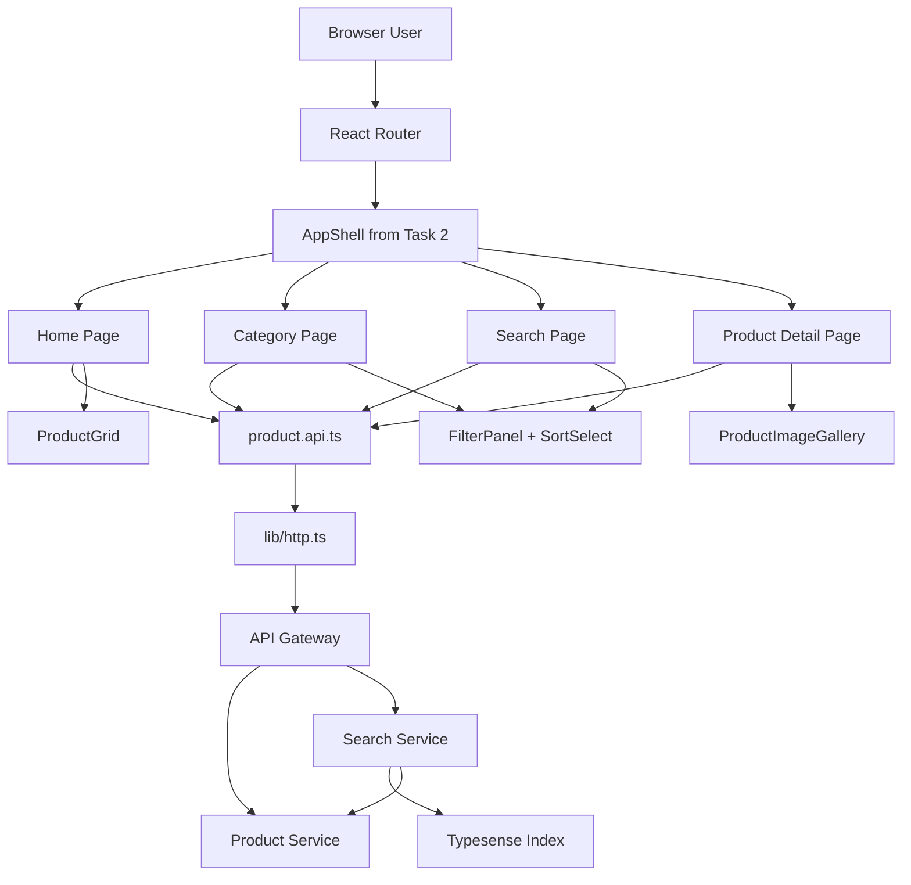
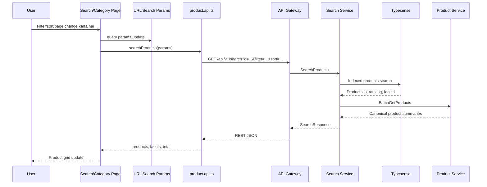
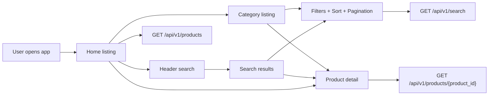

# 🛍️ User App Frontend - Task 4: Product Browsing


## 📌 Task Summary

| Field | Detail |
|---|---|
| Task Name | Product browsing |
| Source | `docs/01-micro-tasks.md` → `User App Frontend` → Task 4 |
| Priority | `P1` |
| Dependency | Product/Search APIs |
| Main Goal | Home listing, category listing, filters, sort, aur product detail pages banana |
| Output Type | Documentation-only implementation guide |
| Not Included | Cart mutations, checkout, wishlist mutations, profile pages, React Query/Zustand global state, recommendations, gRPC-Web |

> **Simple Hinglish goal:** Is task ka kaam buyer ko products browse karne ka complete frontend experience dena hai. User home page par products dekh sake, category page open kar sake, search result page me filters/sort apply kar sake, pagination use kar sake, aur product detail page par product information read kar sake. Is task me cart add, buy now, wishlist save, checkout, ya global server cache implement nahi karna.

---

## ✅ Final Output Created

```text
TaskImplementation/
└── User App Frontend/
    ├── task1.md
    ├── task2.md
    ├── task3.md
    └── task4.md
```

### Why this structure?

- `TaskImplementation/` project ke task-wise implementation guides ka central folder hai.
- `User App Frontend/` buyer/user-facing React app ke implementation guides ko group karta hai.
- `task4.md` sirf **User App Frontend - Task 4: Product browsing** ka complete step-by-step guide hai.

> 🟡 **Scope note:** Current request ke hisaab se sirf required folder structure aur `task4.md` create kiya gaya. Actual `frontend/user-app` source files yahan create nahi kiye gaye.

---

## 🧭 Source Docs Studied

| Document | Kya use kiya gaya |
|---|---|
| `docs/01-micro-tasks.md` | Task 4 ka exact scope: home listing, category listing, filters, sort, product detail pages |
| `docs/10-frontend-implementation.md` | Product pages list, API/state boundaries, performance guidance |
| `docs/03-folder-structure.md` | `frontend/user-app/src/features/product/` and `src/features/search/` structure |
| `docs/04-microservice-design.md` | Product Service and Search Service responsibilities, public REST APIs |
| `docs/05-database-design.md` | Search facets and sort fields: brand, category, seller, price, rating, stock, popularity, created_at |
| `docs/02-system-architecture.md` | Browser → API Gateway → Search Service → Typesense → Product Service flow |
| `api/master-api.json` | Product/search/category endpoint contracts and response schemas |
| `TaskImplementation/User App Frontend/task1.md` | React TS + Tailwind foundation boundary |
| `TaskImplementation/User App Frontend/task2.md` | App shell, routing, search bar route boundary |
| `TaskImplementation/User App Frontend/task3.md` | Auth screens boundary and shared `lib/http.ts` direction |

---

## 🎯 Task Boundary

### ✅ Included in Task 4

- Home product listing page
- Category listing page
- Search results page using query from `/search?q=...`
- Filter panel for facets like brand, category, seller, price, rating, stock
- Sort select for price, rating, popularity, and new arrivals
- Product detail page
- Product card, product grid, empty/loading/error states
- Pagination with URL state
- Typed API functions for public Product/Search endpoints
- Responsive layout for mobile and desktop
- Accessibility basics: semantic links/buttons, labels, focus states, readable empty/error messages

### ❌ Not Included in Task 4

| Feature | Kyun nahi? |
|---|---|
| Add to cart / quantity update | Ye `User App Frontend - Task 5: Cart and checkout` ka scope hai |
| Checkout/payment/order success | Ye Task 5 ka scope hai |
| Wishlist add/remove | Profile/wishlist module Task 6 me aayega |
| Profile/orders/address pages | Ye `Task 6: Profile module` ka scope hai |
| Zustand global stores | Ye `Task 7: State management` ka scope hai |
| React Query server cache | Ye `Task 7: State management` ka scope hai |
| gRPC-Web generated clients | Ye `Task 8: gRPC-Web client` ka scope hai |
| Seller product manager | Seller Dashboard ka separate task hai |
| Recommendations/recently viewed | Product browsing ke core Task 4 me required nahi; later personalization/recommendation flow me add hoga |

> 🟢 **Rule:** Task 4 sirf public product discovery aur detail read experience tak limited rahega. User action mutations, checkout, wishlist, and global cache later tasks me layer honge.

---

## 🧱 Target Implementation Folder Structure

Actual frontend implementation execute karte time Task 4 ke baad target structure ye hoga:

```text
frontend/
└── user-app/
    └── src/
        ├── app.tsx
        ├── app-shell/
        │   ├── app-shell.tsx
        │   ├── search-box.tsx
        │   └── ...
        ├── components/
        │   └── ui/
        │       ├── alert.tsx
        │       ├── button.tsx
        │       ├── empty-state.tsx
        │       ├── skeleton.tsx
        │       └── spinner.tsx
        ├── features/
        │   ├── product/
        │   │   ├── api/
        │   │   │   └── product.api.ts
        │   │   ├── components/
        │   │   │   ├── category-strip.tsx
        │   │   │   ├── filter-panel.tsx
        │   │   │   ├── pagination.tsx
        │   │   │   ├── price.tsx
        │   │   │   ├── product-card.tsx
        │   │   │   ├── product-detail-skeleton.tsx
        │   │   │   ├── product-grid.tsx
        │   │   │   ├── product-image-gallery.tsx
        │   │   │   ├── product-list-skeleton.tsx
        │   │   │   ├── rating.tsx
        │   │   │   ├── sort-select.tsx
        │   │   │   └── variant-picker.tsx
        │   │   ├── hooks/
        │   │   │   ├── use-categories.ts
        │   │   │   ├── use-product-detail.ts
        │   │   │   └── use-product-list.ts
        │   │   ├── pages/
        │   │   │   ├── category-page.tsx
        │   │   │   ├── home-page.tsx
        │   │   │   └── product-detail-page.tsx
        │   │   ├── product-url-state.ts
        │   │   └── types.ts
        │   └── search/
        │       ├── components/
        │       │   └── facet-summary.tsx
        │       └── pages/
        │           └── search-page.tsx
        ├── lib/
        │   ├── env.ts
        │   └── http.ts
        └── routes/
            ├── index.tsx
            └── route-paths.ts
```

### Folder responsibility

| Path | Responsibility |
|---|---|
| `features/product/api/product.api.ts` | Product, category, search REST functions |
| `features/product/types.ts` | Product, variant, category, search response TypeScript types |
| `features/product/product-url-state.ts` | URL search params parse/build helpers |
| `features/product/hooks/` | Feature-local data loading with `fetch`, `useEffect`, and `AbortController` |
| `features/product/pages/home-page.tsx` | Home listing route |
| `features/product/pages/category-page.tsx` | Category-specific listing route |
| `features/search/pages/search-page.tsx` | Search results route from `/search?q=...` |
| `features/product/pages/product-detail-page.tsx` | Product detail route |
| `features/product/components/` | Reusable product browsing UI |
| `components/ui/` | Generic UI states like skeleton, empty state, alert |
| `routes/index.tsx` | Route tree updates for Task 4 pages |

---

## 🧩 Product Browsing Architecture



### Hinglish explanation

- User route open karta hai: home, category, search, ya product detail.
- React Router correct page render karta hai inside existing `AppShell`.
- Page component URL params read karta hai.
- Page API helper call karta hai.
- API Gateway request ko Product Service ya Search Service tak forward karta hai.
- UI loading, empty, error, and success states cleanly render karta hai.

---

## 🔁 Search and Filter Flow



> 🟡 **Boundary:** Task 4 me filters URL-driven rahenge. Global store ki zarurat nahi hai; Zustand Task 7 me aayega.

---

## 🗺️ Route Map

| Route | Page | API Used | Purpose |
|---|---|---|---|
| `/` | `HomePage` | `GET /api/v1/products`, `GET /api/v1/categories` | Home listing and category strip |
| `/category/:categoryId` | `CategoryPage` | `GET /api/v1/search`, `GET /api/v1/categories` | Category listing with filters/sort |
| `/search?q=shoes` | `SearchPage` | `GET /api/v1/search` | Search results from Task 2 search box |
| `/products/:productId` | `ProductDetailPage` | `GET /api/v1/products/{product_id}` | Product detail |

### Route constants

```ts
export const routePaths = {
  home: "/",
  search: "/search",
  category: (categoryId: string) => `/category/${categoryId}`,
  productDetail: (productId: string) => `/products/${productId}`,
  cart: "/cart",
  login: "/login",
} as const;
```

---

## 🔌 API Contract Used in Task 4

`api/master-api.json` ke according product browsing public APIs ye hain:

| Feature | Method | Endpoint | Service | Auth | Response |
|---|---|---|---|---|---|
| Product list | `GET` | `/api/v1/products` | `product-service` | public | `ProductListResponse` |
| Product detail | `GET` | `/api/v1/products/{product_id}` | `product-service` | public | `Product` |
| Category list | `GET` | `/api/v1/categories` | `product-service` | public | `CategoryListResponse` |
| Search products | `GET` | `/api/v1/search` | `search-service` | public | `SearchResponse` |
| Autocomplete | `GET` | `/api/v1/search/autocomplete` | `search-service` | public | `AutocompleteResponse` |

### Request fields

```ts
type ProductListRequest = {
  category_id?: string;
  seller_id?: string;
  status?: string;
  page?: number;
  page_size?: number;
};

type SearchRequest = {
  q?: string;
  filters?: Record<string, unknown>;
  sort?: string;
  page?: number;
  page_size?: number;
};
```

### Response fields

```ts
type Product = {
  product_id: string;
  seller_id?: string;
  title: string;
  description?: string;
  brand?: string;
  category_id?: string;
  status?: string;
  variants?: ProductVariant[];
};

type ProductVariant = {
  sku: string;
  attributes?: Record<string, unknown>;
  price: Money;
  stock_quantity: number;
};

type Money = {
  amount?: number;
  currency?: string;
};

type ProductListResponse = {
  products: Product[];
  total: number;
};

type SearchResponse = {
  products: Product[];
  facets?: Record<string, unknown>;
  total: number;
};
```

> 🟡 **API note:** Current `Product` schema me image URLs explicitly nahi hain, but product input/media docs future image metadata mention karte hain. UI code ko optional `images?: string[]` handle karna chahiye, aur images absent hone par clean placeholder render karna chahiye. External random stock images use mat karo.

---

## 📦 External Libraries and Tools

| Tool/Library | Type | Why Used | Install/Use |
|---|---|---|---|
| React | UI library | Product pages and reusable components build karne ke liye | Task 1 setup me installed |
| TypeScript | Type system | Product/search API contracts type-safe rakhne ke liye | Task 1 setup |
| Tailwind CSS | Styling | Responsive product grid, filters, skeleton, badges style karne ke liye | Task 1 setup |
| `react-router-dom` | Routing | `/`, `/category/:id`, `/search`, `/products/:id` routes ke liye | Task 2 me installed: `pnpm --filter user-app add react-router-dom` |
| `lucide-react` | Icons | Filter, sort, search, star, grid, chevron icons ke liye | Task 2 me installed: `pnpm --filter user-app add lucide-react` |
| Fetch API | Browser API | Product/Search REST calls ke liye; extra install nahi chahiye | `fetch(url, options)` |
| `AbortController` | Browser API | Route/filter change par old API request cancel karne ke liye | Built-in browser API |
| Vitest + Testing Library | Dev tools | Component/helper tests ke liye, agar Task 3 testing setup follow kiya gaya ho | `pnpm --filter user-app add -D vitest jsdom @testing-library/react @testing-library/user-event msw` |
| MSW | Dev test mock server | Product/Search API responses mock karne ke liye tests me | Same dev dependency command above |

### Why React Query nahi use kiya?

`docs/10-frontend-implementation.md` long-term me server data ke liye React Query recommend karta hai, but `docs/01-micro-tasks.md` me **User App Frontend - Task 7** specifically state management ke liye hai:

> Zustand for UI/session state, React Query for server cache.

Isliye Task 4 me feature-local `useEffect` + typed API helpers use kiye gaye. Task 7 me same `product.api.ts` functions ko React Query hooks ke andar reuse karna easy hoga.

### Install commands recap

Task 4 ke core implementation ke liye usually new runtime package required nahi hai, kyunki router/icons previous tasks me aa chuke hain:

```bash
pnpm --filter user-app add react-router-dom lucide-react
```

Testing setup agar project me abhi missing ho:

```bash
pnpm --filter user-app add -D vitest jsdom @testing-library/react @testing-library/user-event msw
```

---

## 🪜 Step-by-Step Implementation

## Step 1: Previous Tasks Confirm Karo

Task 4 start karne se pehle Task 1-3 ka baseline working hona chahiye.

```bash
pnpm --filter user-app typecheck
pnpm --filter user-app lint
pnpm --filter user-app build
```

Expected:

```text
TypeScript, lint, and build checks pass.
```

### Explanation

Product pages app shell ke andar render honge. Agar routing, Tailwind, ya auth screens ke shared UI primitives broken hain, product browsing implement karte time errors mix ho jayenge.

---

## Step 2: Product Route Paths Add Karo

`src/routes/route-paths.ts` me product browsing routes centralize karo.

```ts
export const routePaths = {
  home: "/",
  search: "/search",
  login: "/login",
  signup: "/signup",
  category: (categoryId: string) => `/category/${categoryId}`,
  productDetail: (productId: string) => `/products/${productId}`,
  cart: "/cart",
} as const;
```

### Explanation

- Hardcoded strings duplicate nahi honge.
- Product card, category strip, search page, and breadcrumbs same route helper use karenge.
- Future refactor me route path change karna easy rahega.

---

## Step 3: Product Types Define Karo

`src/features/product/types.ts` create karo.

```ts
export type Money = {
  amount?: number;
  currency?: string;
};

export type ProductVariant = {
  sku: string;
  attributes?: Record<string, unknown>;
  price?: Money;
  stock_quantity?: number;
};

export type Product = {
  product_id: string;
  seller_id?: string;
  title: string;
  description?: string;
  brand?: string;
  category_id?: string;
  status?: string;
  variants?: ProductVariant[];
  images?: string[];
};

export type Category = {
  category_id: string;
  name: string;
  parent_id?: string;
};

export type ProductListResponse = {
  products: Product[];
  total: number;
};

export type CategoryListResponse = {
  categories: Category[];
};

export type SearchResponse = {
  products: Product[];
  facets?: Record<string, unknown>;
  total: number;
};

export type SortOption =
  | "popularity_score:desc"
  | "created_at:desc"
  | "price:asc"
  | "price:desc"
  | "rating:desc";

export type ProductFilters = {
  q?: string;
  categoryId?: string;
  brand?: string;
  sellerId?: string;
  minPrice?: string;
  maxPrice?: string;
  minRating?: string;
  inStock?: boolean;
  sort?: SortOption;
  page: number;
  pageSize: number;
};
```

### Explanation

- Types API contract ke close rakhe gaye.
- `images?: string[]` optional hai, kyunki response schema me image field absent ho sakta hai.
- `SortOption` frontend me allowed sort values restrict karta hai.
- `ProductFilters` URL state aur API call ke beech shared type hai.

---

## Step 4: API Helpers Build Karo

`src/features/product/api/product.api.ts` create karo.

```ts
import { apiGet } from "../../../lib/http";
import type {
  CategoryListResponse,
  Product,
  ProductFilters,
  ProductListResponse,
  SearchResponse,
} from "../types";

type RequestOptions = {
  signal?: AbortSignal;
};

function appendIfPresent(params: URLSearchParams, key: string, value?: string | number | boolean) {
  if (value === undefined || value === null || value === "") {
    return;
  }

  params.set(key, String(value));
}

function appendSearchFilters(params: URLSearchParams, filters: ProductFilters) {
  if (filters.categoryId) {
    params.append("filter", `category_ids:${filters.categoryId}`);
  }

  if (filters.brand) {
    params.append("filter", `brand:${filters.brand}`);
  }

  if (filters.sellerId) {
    params.append("filter", `seller_id:${filters.sellerId}`);
  }

  if (filters.minPrice) {
    params.append("filter", `price:>=${filters.minPrice}`);
  }

  if (filters.maxPrice) {
    params.append("filter", `price:<=${filters.maxPrice}`);
  }

  if (filters.minRating) {
    params.append("filter", `rating:>=${filters.minRating}`);
  }

  if (filters.inStock) {
    params.append("filter", "in_stock:true");
  }
}

export async function listProducts(
  input: { page: number; pageSize: number; categoryId?: string },
  options: RequestOptions = {},
) {
  const params = new URLSearchParams();

  appendIfPresent(params, "page", input.page);
  appendIfPresent(params, "page_size", input.pageSize);
  appendIfPresent(params, "category_id", input.categoryId);
  appendIfPresent(params, "status", "published");

  return apiGet<ProductListResponse>(`/api/v1/products?${params.toString()}`, options);
}

export async function getProduct(productId: string, options: RequestOptions = {}) {
  return apiGet<Product>(`/api/v1/products/${encodeURIComponent(productId)}`, options);
}

export async function listCategories(options: RequestOptions = {}) {
  return apiGet<CategoryListResponse>("/api/v1/categories", options);
}

export async function searchProducts(filters: ProductFilters, options: RequestOptions = {}) {
  const params = new URLSearchParams();

  appendIfPresent(params, "q", filters.q);
  appendIfPresent(params, "sort", filters.sort);
  appendIfPresent(params, "page", filters.page);
  appendIfPresent(params, "page_size", filters.pageSize);
  appendSearchFilters(params, filters);

  return apiGet<SearchResponse>(`/api/v1/search?${params.toString()}`, options);
}
```

### Explanation

- `listProducts` home page ke simple published listing ke liye use hoga.
- `searchProducts` filters/sort/category/search result ke liye use hoga.
- `filter=key:value` format architecture doc ke example se match karta hai: `/api/v1/search?q=shoes&filter=brand:nike`.
- `AbortSignal` route change par old requests cancel karne ke liye pass hota hai.

> 🟡 **API serialization note:** `api/master-api.json` me `SearchRequest.filters` object hai, while architecture example flat `filter=brand:nike` dikhata hai. Frontend helper repeated `filter` query params use karega; API Gateway/Search Service isse internal `filters` object me map kar sakta hai.

---

## Step 5: URL State Helpers Add Karo

`src/features/product/product-url-state.ts` create karo.

```ts
import type { ProductFilters, SortOption } from "./types";

const DEFAULT_PAGE = 1;
const DEFAULT_PAGE_SIZE = 24;

const sortOptions = new Set<SortOption>([
  "popularity_score:desc",
  "created_at:desc",
  "price:asc",
  "price:desc",
  "rating:desc",
]);

function readPositiveInt(value: string | null, fallback: number) {
  const parsed = Number(value);
  return Number.isInteger(parsed) && parsed > 0 ? parsed : fallback;
}

function readSort(value: string | null): SortOption | undefined {
  if (!value || !sortOptions.has(value as SortOption)) {
    return undefined;
  }

  return value as SortOption;
}

export function readProductFilters(searchParams: URLSearchParams): ProductFilters {
  return {
    q: searchParams.get("q")?.trim() || undefined,
    categoryId: searchParams.get("category_id") || undefined,
    brand: searchParams.get("brand") || undefined,
    sellerId: searchParams.get("seller_id") || undefined,
    minPrice: searchParams.get("min_price") || undefined,
    maxPrice: searchParams.get("max_price") || undefined,
    minRating: searchParams.get("min_rating") || undefined,
    inStock: searchParams.get("in_stock") === "true",
    sort: readSort(searchParams.get("sort")),
    page: readPositiveInt(searchParams.get("page"), DEFAULT_PAGE),
    pageSize: readPositiveInt(searchParams.get("page_size"), DEFAULT_PAGE_SIZE),
  };
}

export function writeProductFilters(filters: ProductFilters) {
  const params = new URLSearchParams();

  if (filters.q) params.set("q", filters.q);
  if (filters.categoryId) params.set("category_id", filters.categoryId);
  if (filters.brand) params.set("brand", filters.brand);
  if (filters.sellerId) params.set("seller_id", filters.sellerId);
  if (filters.minPrice) params.set("min_price", filters.minPrice);
  if (filters.maxPrice) params.set("max_price", filters.maxPrice);
  if (filters.minRating) params.set("min_rating", filters.minRating);
  if (filters.inStock) params.set("in_stock", "true");
  if (filters.sort) params.set("sort", filters.sort);
  if (filters.page > DEFAULT_PAGE) params.set("page", String(filters.page));
  if (filters.pageSize !== DEFAULT_PAGE_SIZE) params.set("page_size", String(filters.pageSize));

  return params;
}
```

### Explanation

- Filters URL me store honge, isliye page refresh/share/back button naturally work karega.
- Invalid page/sort values safe fallback par aa jayenge.
- `page=1` URL me unnecessary show nahi hoga, URL clean rahega.

---

## Step 6: Feature-Local Data Hooks Banao

Task 7 tak React Query use nahi kar rahe, isliye simple local hook enough hai.

`src/features/product/hooks/use-product-list.ts`:

```ts
import { useEffect, useState } from "react";
import { listProducts, searchProducts } from "../api/product.api";
import type { ProductFilters, ProductListResponse, SearchResponse } from "../types";

type ProductListState = {
  data?: ProductListResponse | SearchResponse;
  isLoading: boolean;
  error?: string;
};

export function useProductList(filters: ProductFilters, mode: "home" | "search") {
  const [state, setState] = useState<ProductListState>({ isLoading: true });

  useEffect(() => {
    const controller = new AbortController();

    async function loadProducts() {
      setState({ isLoading: true });

      try {
        const data =
          mode === "home"
            ? await listProducts(
                {
                  page: filters.page,
                  pageSize: filters.pageSize,
                  categoryId: filters.categoryId,
                },
                { signal: controller.signal },
              )
            : await searchProducts(filters, { signal: controller.signal });

        setState({ data, isLoading: false });
      } catch (error) {
        if (controller.signal.aborted) {
          return;
        }

        setState({
          isLoading: false,
          error: error instanceof Error ? error.message : "Products load nahi ho paaye.",
        });
      }
    }

    void loadProducts();

    return () => controller.abort();
  }, [filters, mode]);

  return state;
}
```

`src/features/product/hooks/use-product-detail.ts`:

```ts
import { useEffect, useState } from "react";
import { getProduct } from "../api/product.api";
import type { Product } from "../types";

type ProductDetailState = {
  product?: Product;
  isLoading: boolean;
  error?: string;
};

export function useProductDetail(productId: string | undefined) {
  const [state, setState] = useState<ProductDetailState>({ isLoading: true });

  useEffect(() => {
    if (!productId) {
      setState({ isLoading: false, error: "Product id missing hai." });
      return;
    }

    const controller = new AbortController();

    async function loadProduct() {
      setState({ isLoading: true });

      try {
        const product = await getProduct(productId, { signal: controller.signal });
        setState({ product, isLoading: false });
      } catch (error) {
        if (controller.signal.aborted) {
          return;
        }

        setState({
          isLoading: false,
          error: error instanceof Error ? error.message : "Product detail load nahi ho paayi.",
        });
      }
    }

    void loadProduct();

    return () => controller.abort();
  }, [productId]);

  return state;
}
```

### Explanation

- Hook page ko simple loading/error/data state deta hai.
- `AbortController` duplicate/outdated requests avoid karta hai.
- React Query later Task 7 me introduce hoga; tab API helpers same rahenge.

> 🟡 **Dependency warning:** `filters` object stable hona chahiye. Page me `useMemo` use karo, warna unnecessary refetch ho sakta hai.

---

## Step 7: Categories Hook Add Karo

`src/features/product/hooks/use-categories.ts`:

```ts
import { useEffect, useState } from "react";
import { listCategories } from "../api/product.api";
import type { Category } from "../types";

type CategoryState = {
  categories: Category[];
  isLoading: boolean;
  error?: string;
};

export function useCategories() {
  const [state, setState] = useState<CategoryState>({
    categories: [],
    isLoading: true,
  });

  useEffect(() => {
    const controller = new AbortController();

    async function loadCategories() {
      try {
        const data = await listCategories({ signal: controller.signal });
        setState({ categories: data.categories, isLoading: false });
      } catch (error) {
        if (controller.signal.aborted) {
          return;
        }

        setState({
          categories: [],
          isLoading: false,
          error: error instanceof Error ? error.message : "Categories load nahi ho paayi.",
        });
      }
    }

    void loadCategories();

    return () => controller.abort();
  }, []);

  return state;
}
```

### Explanation

Home page aur category page dono category navigation show kar sakte hain. Hook ko shared rakhne se duplicate fetch logic avoid hota hai.

---

## Step 8: Product Price Component Banao

`src/features/product/components/price.tsx`:

```tsx
import type { Money } from "../types";

type PriceProps = {
  value?: Money;
};

export function Price({ value }: PriceProps) {
  if (value?.amount === undefined) {
    return <span className="text-sm text-slate-500">Price unavailable</span>;
  }

  const formatted = new Intl.NumberFormat("en-IN", {
    style: "currency",
    currency: value.currency || "INR",
    maximumFractionDigits: 0,
  }).format(value.amount);

  return <span className="font-semibold text-slate-950">{formatted}</span>;
}
```

### Explanation

- Price formatting ek jagah central ho gaya.
- Currency fallback `INR` rakha gaya for India-oriented ecommerce UX.
- Missing price par page break nahi hoga.

---

## Step 9: Rating Component Banao

`src/features/product/components/rating.tsx`:

```tsx
import { Star } from "lucide-react";

type RatingProps = {
  value?: number;
};

export function Rating({ value }: RatingProps) {
  if (!value) {
    return <span className="text-xs text-slate-500">No ratings yet</span>;
  }

  return (
    <span className="inline-flex items-center gap-1 rounded-full bg-amber-50 px-2 py-1 text-xs font-medium text-amber-700">
      <Star aria-hidden="true" className="h-3.5 w-3.5 fill-current" />
      {value.toFixed(1)}
    </span>
  );
}
```

### Explanation

Current `Product` API response me rating directly nahi hai, but search index docs rating facet mention karte hain. Component optional value support karta hai, taaki future response me rating aaye to UI ready ho.

---

## Step 10: Product Card Banao

`src/features/product/components/product-card.tsx`:

```tsx
import { Link } from "react-router-dom";
import { routePaths } from "../../../routes/route-paths";
import type { Product } from "../types";
import { Price } from "./price";

type ProductCardProps = {
  product: Product;
};

function getPrimaryVariant(product: Product) {
  return product.variants?.[0];
}

export function ProductCard({ product }: ProductCardProps) {
  const primaryVariant = getPrimaryVariant(product);
  const imageUrl = product.images?.[0];
  const inStock = (primaryVariant?.stock_quantity ?? 0) > 0;

  return (
    <article className="group overflow-hidden rounded-lg border border-slate-200 bg-white transition hover:border-slate-300 hover:shadow-sm">
      <Link to={routePaths.productDetail(product.product_id)} className="block">
        <div className="aspect-square bg-slate-100">
          {imageUrl ? (
            
          ) : (
            <div className="flex h-full w-full items-center justify-center px-4 text-center text-sm text-slate-500">
              Product image coming soon
            </div>
          )}
        </div>

        <div className="space-y-2 p-3">
          <div>
            {product.brand ? (
              <p className="text-xs font-medium uppercase tracking-wide text-slate-500">{product.brand}</p>
            ) : null}
            <h3 className="line-clamp-2 text-sm font-medium text-slate-950">{product.title}</h3>
          </div>

          <div className="flex items-center justify-between gap-2">
            <Price value={primaryVariant?.price} />
            <span className={inStock ? "text-xs text-emerald-700" : "text-xs text-rose-700"}>
              {inStock ? "In stock" : "Out of stock"}
            </span>
          </div>
        </div>
      </Link>
    </article>
  );
}
```

### Explanation

- Card clickable link hai, button nahi. Product detail navigation semantic rahegi.
- Image optional hai; missing image par layout stable placeholder show hota hai.
- `line-clamp-2` long title ko clean rakhta hai.
- Cart button intentionally nahi add kiya, kyunki cart Task 5 ka scope hai.

---

## Step 11: Product Grid Banao

`src/features/product/components/product-grid.tsx`:

```tsx
import type { Product } from "../types";
import { ProductCard } from "./product-card";

type ProductGridProps = {
  products: Product[];
};

export function ProductGrid({ products }: ProductGridProps) {
  return (
    <div className="grid grid-cols-2 gap-3 sm:grid-cols-3 lg:grid-cols-4 xl:grid-cols-5">
      {products.map((product) => (
        <ProductCard key={product.product_id} product={product} />
      ))}
    </div>
  );
}
```

### Explanation

- Mobile pe 2 columns, large desktop pe 5 columns.
- Product cards repeated items hain, isliye card UI allowed and useful hai.
- Grid responsive hai, overlap/clipping avoid hota hai.

---

## Step 12: Loading Skeleton Banao

`src/features/product/components/product-list-skeleton.tsx`:

```tsx
export function ProductListSkeleton() {
  return (
    <div className="grid grid-cols-2 gap-3 sm:grid-cols-3 lg:grid-cols-4 xl:grid-cols-5" aria-label="Loading products">
      {Array.from({ length: 10 }).map((_, index) => (
        <div key={index} className="overflow-hidden rounded-lg border border-slate-200 bg-white">
          <div className="aspect-square animate-pulse bg-slate-100" />
          <div className="space-y-2 p-3">
            <div className="h-3 w-1/3 animate-pulse rounded bg-slate-100" />
            <div className="h-4 w-full animate-pulse rounded bg-slate-100" />
            <div className="h-4 w-2/3 animate-pulse rounded bg-slate-100" />
          </div>
        </div>
      ))}
    </div>
  );
}
```

### Explanation

Skeleton se layout shift kam hota hai aur user ko clear signal milta hai ki products load ho rahe hain.

---

## Step 13: Empty and Error States Add Karo

`src/components/ui/empty-state.tsx`:

```tsx
import type { ReactNode } from "react";

type EmptyStateProps = {
  title: string;
  description: string;
  action?: ReactNode;
};

export function EmptyState({ title, description, action }: EmptyStateProps) {
  return (
    <section className="rounded-lg border border-dashed border-slate-300 bg-white px-4 py-10 text-center">
      <h2 className="text-base font-semibold text-slate-950">{title}</h2>
      <p className="mx-auto mt-2 max-w-md text-sm text-slate-600">{description}</p>
      {action ? <div className="mt-4">{action}</div> : null}
    </section>
  );
}
```

`src/components/ui/alert.tsx`:

```tsx
type AlertProps = {
  title: string;
  message: string;
};

export function Alert({ title, message }: AlertProps) {
  return (
    <div className="rounded-lg border border-rose-200 bg-rose-50 px-4 py-3 text-rose-900" role="alert">
      <p className="font-medium">{title}</p>
      <p className="mt-1 text-sm">{message}</p>
    </div>
  );
}
```

### Explanation

- Empty state zero-result search ke liye important hai.
- Error state user ko retry/issue samajhne me help karta hai.
- Components generic hain, future modules bhi reuse kar sakte hain.

---

## Step 14: Sort Select Banao

`src/features/product/components/sort-select.tsx`:

```tsx
import type { SortOption } from "../types";

type SortSelectProps = {
  value?: SortOption;
  onChange: (value?: SortOption) => void;
};

const sortOptions: Array<{ label: string; value: SortOption }> = [
  { label: "Popular", value: "popularity_score:desc" },
  { label: "Newest", value: "created_at:desc" },
  { label: "Price: Low to High", value: "price:asc" },
  { label: "Price: High to Low", value: "price:desc" },
  { label: "Top Rated", value: "rating:desc" },
];

export function SortSelect({ value, onChange }: SortSelectProps) {
  return (
    <label className="flex items-center gap-2 text-sm text-slate-700">
      Sort
      <select
        value={value ?? ""}
        onChange={(event) => onChange((event.target.value || undefined) as SortOption | undefined)}
        className="rounded-md border border-slate-300 bg-white px-3 py-2 text-sm text-slate-950 shadow-sm focus:border-slate-900 focus:outline-none focus:ring-2 focus:ring-slate-200"
      >
        <option value="">Relevance</option>
        {sortOptions.map((option) => (
          <option key={option.value} value={option.value}>
            {option.label}
          </option>
        ))}
      </select>
    </label>
  );
}
```

### Explanation

- Sort values search index sort fields se aligned hain.
- Default blank value relevance/ranking ko represent karta hai.
- Select accessible label ke saath render hota hai.

---

## Step 15: Filter Panel Banao

`src/features/product/components/filter-panel.tsx`:

```tsx
import type { ProductFilters } from "../types";

type FilterPanelProps = {
  value: ProductFilters;
  onChange: (nextFilters: ProductFilters) => void;
  onClear: () => void;
};

export function FilterPanel({ value, onChange, onClear }: FilterPanelProps) {
  function update(next: Partial<ProductFilters>) {
    onChange({
      ...value,
      ...next,
      page: 1,
    });
  }

  return (
    <aside className="space-y-5 rounded-lg border border-slate-200 bg-white p-4">
      <div className="flex items-center justify-between gap-2">
        <h2 className="font-semibold text-slate-950">Filters</h2>
        <button type="button" onClick={onClear} className="text-sm font-medium text-slate-700 hover:text-slate-950">
          Clear
        </button>
      </div>

      <label className="block space-y-1 text-sm">
        <span className="font-medium text-slate-700">Brand</span>
        <input
          value={value.brand ?? ""}
          onChange={(event) => update({ brand: event.target.value || undefined })}
          className="w-full rounded-md border border-slate-300 px-3 py-2 focus:border-slate-900 focus:outline-none focus:ring-2 focus:ring-slate-200"
          placeholder="Nike, Apple..."
        />
      </label>

      <div className="grid grid-cols-2 gap-3">
        <label className="block space-y-1 text-sm">
          <span className="font-medium text-slate-700">Min price</span>
          <input
            inputMode="numeric"
            value={value.minPrice ?? ""}
            onChange={(event) => update({ minPrice: event.target.value || undefined })}
            className="w-full rounded-md border border-slate-300 px-3 py-2 focus:border-slate-900 focus:outline-none focus:ring-2 focus:ring-slate-200"
          />
        </label>

        <label className="block space-y-1 text-sm">
          <span className="font-medium text-slate-700">Max price</span>
          <input
            inputMode="numeric"
            value={value.maxPrice ?? ""}
            onChange={(event) => update({ maxPrice: event.target.value || undefined })}
            className="w-full rounded-md border border-slate-300 px-3 py-2 focus:border-slate-900 focus:outline-none focus:ring-2 focus:ring-slate-200"
          />
        </label>
      </div>

      <label className="block space-y-1 text-sm">
        <span className="font-medium text-slate-700">Minimum rating</span>
        <select
          value={value.minRating ?? ""}
          onChange={(event) => update({ minRating: event.target.value || undefined })}
          className="w-full rounded-md border border-slate-300 px-3 py-2 focus:border-slate-900 focus:outline-none focus:ring-2 focus:ring-slate-200"
        >
          <option value="">Any rating</option>
          <option value="4">4★ and above</option>
          <option value="3">3★ and above</option>
          <option value="2">2★ and above</option>
        </select>
      </label>

      <label className="flex items-center gap-2 text-sm font-medium text-slate-700">
        <input
          type="checkbox"
          checked={value.inStock ?? false}
          onChange={(event) => update({ inStock: event.target.checked })}
          className="h-4 w-4 rounded border-slate-300 text-slate-950 focus:ring-slate-300"
        />
        In stock only
      </label>
    </aside>
  );
}
```

### Explanation

- Filter panel local form state nahi rakhta; parent URL state own karta hai.
- Filter change par page reset to `1`, warna user page 8 par filter apply karke empty result dekh sakta hai.
- Facet values API response se dynamic render karna future polish ho sakta hai; Task 4 base version stable filter controls provide karta hai.

---

## Step 16: Pagination Component Banao

`src/features/product/components/pagination.tsx`:

```tsx
type PaginationProps = {
  page: number;
  pageSize: number;
  total: number;
  onPageChange: (page: number) => void;
};

export function Pagination({ page, pageSize, total, onPageChange }: PaginationProps) {
  const totalPages = Math.max(1, Math.ceil(total / pageSize));

  if (totalPages <= 1) {
    return null;
  }

  return (
    <nav className="flex items-center justify-between gap-3" aria-label="Product pagination">
      <button
        type="button"
        disabled={page <= 1}
        onClick={() => onPageChange(page - 1)}
        className="rounded-md border border-slate-300 px-3 py-2 text-sm font-medium disabled:cursor-not-allowed disabled:opacity-50"
      >
        Previous
      </button>

      <span className="text-sm text-slate-600">
        Page {page} of {totalPages}
      </span>

      <button
        type="button"
        disabled={page >= totalPages}
        onClick={() => onPageChange(page + 1)}
        className="rounded-md border border-slate-300 px-3 py-2 text-sm font-medium disabled:cursor-not-allowed disabled:opacity-50"
      >
        Next
      </button>
    </nav>
  );
}
```

### Explanation

- Simple previous/next pagination beginner-friendly hai.
- Full numeric pagination later add ho sakta hai, but Task 4 ke liye total/page/pageSize enough hai.
- Buttons disabled state handle karte hain.

---

## Step 17: Category Strip Banao

`src/features/product/components/category-strip.tsx`:

```tsx
import { Link } from "react-router-dom";
import { routePaths } from "../../../routes/route-paths";
import type { Category } from "../types";

type CategoryStripProps = {
  categories: Category[];
};

export function CategoryStrip({ categories }: CategoryStripProps) {
  if (categories.length === 0) {
    return null;
  }

  return (
    <nav className="flex gap-2 overflow-x-auto pb-2" aria-label="Product categories">
      {categories.map((category) => (
        <Link
          key={category.category_id}
          to={routePaths.category(category.category_id)}
          className="whitespace-nowrap rounded-full border border-slate-200 bg-white px-4 py-2 text-sm font-medium text-slate-700 hover:border-slate-400 hover:text-slate-950"
        >
          {category.name}
        </Link>
      ))}
    </nav>
  );
}
```

### Explanation

- Category strip horizontal scroll support karta hai, mobile pe layout break nahi hota.
- Category link directly category page par le jata hai.
- Empty categories par blank nav render nahi hota.

---

## Step 18: Home Page Build Karo

`src/features/product/pages/home-page.tsx`:

```tsx
import { useMemo } from "react";
import { Link, useSearchParams } from "react-router-dom";
import { Alert } from "../../../components/ui/alert";
import { EmptyState } from "../../../components/ui/empty-state";
import { routePaths } from "../../../routes/route-paths";
import { CategoryStrip } from "../components/category-strip";
import { Pagination } from "../components/pagination";
import { ProductGrid } from "../components/product-grid";
import { ProductListSkeleton } from "../components/product-list-skeleton";
import { useCategories } from "../hooks/use-categories";
import { useProductList } from "../hooks/use-product-list";
import { readProductFilters, writeProductFilters } from "../product-url-state";
import type { ProductFilters } from "../types";

export function HomePage() {
  const [searchParams, setSearchParams] = useSearchParams();
  const filters = useMemo<ProductFilters>(() => readProductFilters(searchParams), [searchParams]);

  const categories = useCategories();
  const products = useProductList(filters, "home");

  function updatePage(page: number) {
    setSearchParams(writeProductFilters({ ...filters, page }));
  }

  return (
    <div className="mx-auto w-full max-w-7xl space-y-6 px-4 py-6 sm:px-6 lg:px-8">
      <section className="space-y-2">
        <h1 className="text-2xl font-semibold text-slate-950">Shop products</h1>
        <p className="max-w-2xl text-sm text-slate-600">
          Latest published products browse karo, category choose karo, ya search bar se exact item find karo.
        </p>
      </section>

      <CategoryStrip categories={categories.categories} />

      {products.isLoading ? <ProductListSkeleton /> : null}

      {products.error ? <Alert title="Products load nahi hue" message={products.error} /> : null}

      {products.data && products.data.products.length === 0 ? (
        <EmptyState
          title="Abhi products available nahi hain"
          description="Thodi der baad try karo ya search se specific product find karo."
          action={
            <Link to={routePaths.search} className="text-sm font-semibold text-slate-950 underline">
              Search products
            </Link>
          }
        />
      ) : null}

      {products.data && products.data.products.length > 0 ? (
        <>
          <ProductGrid products={products.data.products} />
          <Pagination
            page={filters.page}
            pageSize={filters.pageSize}
            total={products.data.total}
            onPageChange={updatePage}
          />
        </>
      ) : null}
    </div>
  );
}
```

### Explanation

- Home page simple published listing show karta hai.
- Category strip discovery improve karta hai.
- Pagination URL state se connected hai, isliye refresh/share/back button expected tarah work karta hai.
- No cart/wishlist action yahan add nahi kiya gaya.

---

## Step 19: Listing Page Shared Layout Socho

Category aur search pages ka layout similar hai:

```text
Page title / result count
├── mobile filter button
├── left filter panel on desktop
└── right content
    ├── sort select
    ├── product grid
    └── pagination
```

Responsive target:

```text
Desktop:
┌───────────────┬─────────────────────────────────────┐
│ Filters       │ Sort + Product Grid                 │
│               │                                     │
└───────────────┴─────────────────────────────────────┘

Mobile:
┌─────────────────────────────────────────────────────┐
│ Sort / Filter controls                              │
├─────────────────────────────────────────────────────┤
│ Product Grid                                        │
└─────────────────────────────────────────────────────┘
```

### Explanation

Task 4 me desktop filters visible rahenge. Mobile ke liye initially filter panel content top stack me show kar sakte hain; drawer/persistent UI polish Task 7 state management ke baad improve ho sakta hai.

---

## Step 20: Category Page Build Karo

`src/features/product/pages/category-page.tsx`:

```tsx
import { useMemo } from "react";
import { useParams, useSearchParams } from "react-router-dom";
import { Alert } from "../../../components/ui/alert";
import { EmptyState } from "../../../components/ui/empty-state";
import { FilterPanel } from "../components/filter-panel";
import { Pagination } from "../components/pagination";
import { ProductGrid } from "../components/product-grid";
import { ProductListSkeleton } from "../components/product-list-skeleton";
import { SortSelect } from "../components/sort-select";
import { useProductList } from "../hooks/use-product-list";
import { readProductFilters, writeProductFilters } from "../product-url-state";
import type { ProductFilters } from "../types";

export function CategoryPage() {
  const { categoryId } = useParams();
  const [searchParams, setSearchParams] = useSearchParams();

  const filters = useMemo<ProductFilters>(() => {
    return {
      ...readProductFilters(searchParams),
      categoryId,
    };
  }, [categoryId, searchParams]);

  const products = useProductList(filters, "search");

  function updateFilters(nextFilters: ProductFilters) {
    setSearchParams(writeProductFilters(nextFilters));
  }

  function clearFilters() {
    setSearchParams(writeProductFilters({ page: 1, pageSize: filters.pageSize, categoryId }));
  }

  return (
    <div className="mx-auto w-full max-w-7xl space-y-6 px-4 py-6 sm:px-6 lg:px-8">
      <div className="space-y-1">
        <h1 className="text-2xl font-semibold text-slate-950">Category products</h1>
        <p className="text-sm text-slate-600">{products.data?.total ?? 0} products found</p>
      </div>

      <div className="grid gap-6 lg:grid-cols-[280px_1fr]">
        <FilterPanel value={filters} onChange={updateFilters} onClear={clearFilters} />

        <section className="space-y-4">
          <div className="flex justify-end">
            <SortSelect
              value={filters.sort}
              onChange={(sort) => updateFilters({ ...filters, sort, page: 1 })}
            />
          </div>

          {products.isLoading ? <ProductListSkeleton /> : null}
          {products.error ? <Alert title="Category products load nahi hue" message={products.error} /> : null}

          {products.data && products.data.products.length === 0 ? (
            <EmptyState
              title="Is category me matching products nahi mile"
              description="Filters clear karke ya broader search query ke saath dobara try karo."
            />
          ) : null}

          {products.data && products.data.products.length > 0 ? (
            <>
              <ProductGrid products={products.data.products} />
              <Pagination
                page={filters.page}
                pageSize={filters.pageSize}
                total={products.data.total}
                onPageChange={(page) => updateFilters({ ...filters, page })}
              />
            </>
          ) : null}
        </section>
      </div>
    </div>
  );
}
```

### Explanation

- `categoryId` route params se aata hai.
- Other filters URL search params se aate hain.
- API call Search Service ko hit karti hai, kyunki category listing me filters and sort chahiye.
- Empty state helpful message deta hai.

---

## Step 21: Search Page Build Karo

`src/features/search/pages/search-page.tsx`:

```tsx
import { useMemo } from "react";
import { useSearchParams } from "react-router-dom";
import { Alert } from "../../../components/ui/alert";
import { EmptyState } from "../../../components/ui/empty-state";
import { FilterPanel } from "../../product/components/filter-panel";
import { Pagination } from "../../product/components/pagination";
import { ProductGrid } from "../../product/components/product-grid";
import { ProductListSkeleton } from "../../product/components/product-list-skeleton";
import { SortSelect } from "../../product/components/sort-select";
import { useProductList } from "../../product/hooks/use-product-list";
import { readProductFilters, writeProductFilters } from "../../product/product-url-state";
import type { ProductFilters } from "../../product/types";

export function SearchPage() {
  const [searchParams, setSearchParams] = useSearchParams();

  const filters = useMemo<ProductFilters>(() => {
    return readProductFilters(searchParams);
  }, [searchParams]);

  const products = useProductList(filters, "search");
  const queryLabel = filters.q ? `"${filters.q}"` : "all products";

  function updateFilters(nextFilters: ProductFilters) {
    setSearchParams(writeProductFilters(nextFilters));
  }

  function clearFilters() {
    setSearchParams(writeProductFilters({ q: filters.q, page: 1, pageSize: filters.pageSize }));
  }

  return (
    <div className="mx-auto w-full max-w-7xl space-y-6 px-4 py-6 sm:px-6 lg:px-8">
      <div className="space-y-1">
        <h1 className="text-2xl font-semibold text-slate-950">Search results for {queryLabel}</h1>
        <p className="text-sm text-slate-600">{products.data?.total ?? 0} products found</p>
      </div>

      <div className="grid gap-6 lg:grid-cols-[280px_1fr]">
        <FilterPanel value={filters} onChange={updateFilters} onClear={clearFilters} />

        <section className="space-y-4">
          <div className="flex justify-end">
            <SortSelect
              value={filters.sort}
              onChange={(sort) => updateFilters({ ...filters, sort, page: 1 })}
            />
          </div>

          {products.isLoading ? <ProductListSkeleton /> : null}
          {products.error ? <Alert title="Search results load nahi hue" message={products.error} /> : null}

          {products.data && products.data.products.length === 0 ? (
            <EmptyState
              title="No matching products"
              description="Spelling check karo, filters clear karo, ya shorter search query try karo."
            />
          ) : null}

          {products.data && products.data.products.length > 0 ? (
            <>
              <ProductGrid products={products.data.products} />
              <Pagination
                page={filters.page}
                pageSize={filters.pageSize}
                total={products.data.total}
                onPageChange={(page) => updateFilters({ ...filters, page })}
              />
            </>
          ) : null}
        </section>
      </div>
    </div>
  );
}
```

### Explanation

- Task 2 ka `SearchBox` `/search?q=...` route par navigate karta tha; ab Task 4 me us route ka actual page implemented hoga.
- Query, filters, sort, and page all URL-driven hain.
- Clear filters search query preserve karta hai.

---

## Step 22: Product Image Gallery Banao

`src/features/product/components/product-image-gallery.tsx`:

```tsx
type ProductImageGalleryProps = {
  title: string;
  images?: string[];
};

export function ProductImageGallery({ title, images = [] }: ProductImageGalleryProps) {
  const primaryImage = images[0];

  return (
    <section aria-label={`${title} images`} className="space-y-3">
      <div className="aspect-square overflow-hidden rounded-lg border border-slate-200 bg-slate-100">
        {primaryImage ? (
          
        ) : (
          <div className="flex h-full w-full items-center justify-center px-6 text-center text-sm text-slate-500">
            Product image coming soon
          </div>
        )}
      </div>

      {images.length > 1 ? (
        <div className="grid grid-cols-4 gap-2">
          {images.slice(0, 4).map((image) => (
            
          ))}
        </div>
      ) : null}
    </section>
  );
}
```

### Explanation

- Gallery optional images handle karti hai.
- Missing image par layout broken nahi hota.
- Thumbnail images decorative hain, isliye `alt=""` rakha gaya. Main image ka alt product title hai.

---

## Step 23: Variant Picker Banao

`src/features/product/components/variant-picker.tsx`:

```tsx
import type { ProductVariant } from "../types";
import { Price } from "./price";

type VariantPickerProps = {
  variants: ProductVariant[];
  selectedSku?: string;
  onChange: (sku: string) => void;
};

export function VariantPicker({ variants, selectedSku, onChange }: VariantPickerProps) {
  if (variants.length === 0) {
    return <p className="text-sm text-slate-600">Variant information unavailable.</p>;
  }

  return (
    <fieldset className="space-y-3">
      <legend className="font-medium text-slate-950">Choose variant</legend>

      <div className="grid gap-2 sm:grid-cols-2">
        {variants.map((variant) => {
          const isSelected = selectedSku === variant.sku;
          const stock = variant.stock_quantity ?? 0;

          return (
            <label
              key={variant.sku}
              className={
                isSelected
                  ? "rounded-lg border border-slate-950 bg-slate-50 p-3"
                  : "rounded-lg border border-slate-200 bg-white p-3 hover:border-slate-400"
              }
            >
              <input
                type="radio"
                name="variant"
                value={variant.sku}
                checked={isSelected}
                onChange={() => onChange(variant.sku)}
                className="sr-only"
              />
              <span className="block text-sm font-medium text-slate-950">{variant.sku}</span>
              <span className="mt-1 block text-sm">
                <Price value={variant.price} />
              </span>
              <span className={stock > 0 ? "mt-1 block text-xs text-emerald-700" : "mt-1 block text-xs text-rose-700"}>
                {stock > 0 ? `${stock} in stock` : "Out of stock"}
              </span>
            </label>
          );
        })}
      </div>
    </fieldset>
  );
}
```

### Explanation

- Product detail me variant selection display-only hai.
- Add to cart action Task 5 me add hoga.
- Radio input accessible hai, visual card style user-friendly hai.

---

## Step 24: Product Detail Page Build Karo

`src/features/product/pages/product-detail-page.tsx`:

```tsx
import { useEffect, useMemo, useState } from "react";
import { Link, useParams } from "react-router-dom";
import { Alert } from "../../../components/ui/alert";
import { EmptyState } from "../../../components/ui/empty-state";
import { routePaths } from "../../../routes/route-paths";
import { Price } from "../components/price";
import { ProductImageGallery } from "../components/product-image-gallery";
import { VariantPicker } from "../components/variant-picker";
import { useProductDetail } from "../hooks/use-product-detail";

export function ProductDetailPage() {
  const { productId } = useParams();
  const { product, isLoading, error } = useProductDetail(productId);
  const variants = useMemo(() => product?.variants ?? [], [product]);
  const [selectedSku, setSelectedSku] = useState<string | undefined>(variants[0]?.sku);

  useEffect(() => {
    if (!selectedSku && variants[0]?.sku) {
      setSelectedSku(variants[0].sku);
    }
  }, [selectedSku, variants]);

  const selectedVariant = variants.find((variant) => variant.sku === selectedSku) ?? variants[0];

  if (isLoading) {
    return (
      <div className="mx-auto grid w-full max-w-7xl gap-8 px-4 py-6 sm:px-6 lg:grid-cols-2 lg:px-8">
        <div className="aspect-square animate-pulse rounded-lg bg-slate-100" />
        <div className="space-y-4">
          <div className="h-8 w-2/3 animate-pulse rounded bg-slate-100" />
          <div className="h-5 w-1/3 animate-pulse rounded bg-slate-100" />
          <div className="h-24 w-full animate-pulse rounded bg-slate-100" />
        </div>
      </div>
    );
  }

  if (error) {
    return (
      <div className="mx-auto w-full max-w-3xl px-4 py-8">
        <Alert title="Product detail load nahi hui" message={error} />
      </div>
    );
  }

  if (!product) {
    return (
      <div className="mx-auto w-full max-w-3xl px-4 py-8">
        <EmptyState
          title="Product nahi mila"
          description="Ye product remove ho chuka ho sakta hai ya link invalid ho sakta hai."
          action={
            <Link to={routePaths.home} className="text-sm font-semibold text-slate-950 underline">
              Back to home
            </Link>
          }
        />
      </div>
    );
  }

  return (
    <div className="mx-auto grid w-full max-w-7xl gap-8 px-4 py-6 sm:px-6 lg:grid-cols-2 lg:px-8">
      <ProductImageGallery title={product.title} images={product.images} />

      <section className="space-y-6">
        <div className="space-y-2">
          {product.brand ? <p className="text-sm font-medium uppercase tracking-wide text-slate-500">{product.brand}</p> : null}
          <h1 className="text-3xl font-semibold text-slate-950">{product.title}</h1>
          <Price value={selectedVariant?.price} />
        </div>

        {product.description ? <p className="text-sm leading-6 text-slate-700">{product.description}</p> : null}

        <VariantPicker variants={variants} selectedSku={selectedVariant?.sku} onChange={setSelectedSku} />

        <div className="rounded-lg border border-slate-200 bg-slate-50 p-4 text-sm text-slate-700">
          Cart and checkout actions next task me add honge. Abhi ye page product details read karne ke liye hai.
        </div>
      </section>
    </div>
  );
}
```

### Explanation

- Product detail route `productId` read karta hai.
- Detail page API se single product fetch karta hai.
- Price selected variant se show hota hai.
- Cart button intentionally placeholder note hai; real cart action Task 5 me add hoga.

> 🔴 **Bug prevention note:** `variants` async product load ke baad change hota hai, isliye selected variant initialize/update karne ke liye `useEffect` code example me included hai.

---

## Step 25: Routes Wire Karo

`src/routes/index.tsx` update karo.

```tsx
import { createBrowserRouter } from "react-router-dom";
import { AppShell } from "../app-shell/app-shell";
import { CategoryPage } from "../features/product/pages/category-page";
import { HomePage } from "../features/product/pages/home-page";
import { ProductDetailPage } from "../features/product/pages/product-detail-page";
import { SearchPage } from "../features/search/pages/search-page";
import { LoginPage } from "../features/auth/pages/login-page";
import { SignupPage } from "../features/auth/pages/signup-page";
import { routePaths } from "./route-paths";

export const router = createBrowserRouter([
  {
    element: <AppShell />,
    children: [
      {
        path: routePaths.home,
        element: <HomePage />,
      },
      {
        path: "/category/:categoryId",
        element: <CategoryPage />,
      },
      {
        path: routePaths.search,
        element: <SearchPage />,
      },
      {
        path: "/products/:productId",
        element: <ProductDetailPage />,
      },
      {
        path: routePaths.login,
        element: <LoginPage />,
      },
      {
        path: routePaths.signup,
        element: <SignupPage />,
      },
    ],
  },
]);
```

### Explanation

- Product browsing pages existing `AppShell` ke under render honge.
- Auth pages remain available from Task 3.
- Route constants dynamic paths ke helper ke liye use hote hain, route patterns direct string ho sakte hain.

---

## Step 26: Search Box Integration Verify Karo

Task 2 ka `SearchBox` expected behavior:

```ts
navigate(`/search?q=${encodeURIComponent(query)}`);
```

Task 4 me `/search` route available ho gaya hai, isliye:

```text
Header search submit → /search?q=laptop → SearchPage → GET /api/v1/search?q=laptop
```

### Explanation

Yahan search result fetching add hoti hai. Search box ke UI ko unnecessary change karne ki zarurat nahi, unless autocomplete explicitly add karna ho.

---

## Step 27: Optional Autocomplete Hook Prepare Karo

Autocomplete API documented hai, but Task 4 core requirement nahi hai. Agar search UX me suggestions chahiye, minimal helper add kar sakte ho:

```ts
export async function autocompleteProducts(q: string, limit = 6, options: RequestOptions = {}) {
  const params = new URLSearchParams();
  appendIfPresent(params, "q", q);
  appendIfPresent(params, "limit", limit);

  return apiGet<{ suggestions: string[] }>(`/api/v1/search/autocomplete?${params.toString()}`, options);
}
```

### Explanation

- Isse Task 2 search box me suggestions aa sakte hain.
- Debounce required hoga, but external debounce library avoid kar sakte ho with `setTimeout`.
- Agar deadline tight hai, autocomplete skip karo; listing/detail/filter/sort Task 4 ka core hai.

---

## Step 28: HTTP Client Expectations Confirm Karo

Task 3 me `lib/http.ts` pattern introduce hua tha. Product browsing ke liye same helper use hona chahiye.

```ts
type ApiResponse<T> = {
  data: T;
  request_id: string;
  error?: {
    code: string;
    message: string;
    details?: unknown;
  };
};

export async function apiGet<T>(path: string, options: { signal?: AbortSignal } = {}) {
  const response = await fetch(`${import.meta.env.VITE_API_BASE_URL}${path}`, {
    method: "GET",
    headers: {
      Accept: "application/json",
      "X-Client": "user-app",
    },
    signal: options.signal,
  });

  const body = (await response.json()) as ApiResponse<T>;

  if (!response.ok || body.error) {
    throw new Error(body.error?.message || "Request failed");
  }

  return body.data;
}
```

### Explanation

- Product APIs public hain, so access token optional hai.
- `request_id` logging/debugging ke liye response envelope me available hota hai.
- Error normalize karke UI simple message show kar sakta hai.

---

## Step 29: Styling Guidelines Apply Karo

Product browsing UI ke liye recommended styling:

| Area | Rule |
|---|---|
| Product grid | Responsive grid, stable aspect ratio images |
| Filters | Compact panel, no nested cards |
| Product cards | Radius `8px` or less, clear title/price/stock |
| Empty states | Helpful, short message |
| Loading states | Skeleton grid to reduce layout shift |
| Mobile | Filters stack cleanly; no overlap/clipping |
| Detail page | Product subject first viewport me clearly visible |
| Colors | Neutral base, meaningful stock/error colors only |

Example page container:

```tsx
<div className="mx-auto w-full max-w-7xl px-4 py-6 sm:px-6 lg:px-8">
  {/* page content */}
</div>
```

### Explanation

Ecommerce browsing me speed and clarity more important hai. Hero-style marketing layout avoid karo; user ko product grid, filters, and detail information quickly milni chahiye.

---

## Step 30: Accessibility Checklist Follow Karo

| UI Part | Accessibility requirement |
|---|---|
| Product card | Link should have meaningful product title |
| Product image | Main product image `alt={product.title}` |
| Decorative thumbnails | `alt=""` |
| Filter inputs | Visible labels |
| Sort select | Visible label |
| Pagination | `aria-label="Product pagination"` |
| Loading state | Optional `aria-label` |
| Error state | `role="alert"` |
| Buttons | Disabled state and keyboard accessible |

### Explanation

Task 4 public buyer pages hain. Keyboard and screen-reader usability base level se hi maintain karna important hai.

---

## Step 31: Testing Plan Add Karo

Recommended tests:

| Test Type | What to test |
|---|---|
| Unit | `readProductFilters`, `writeProductFilters`, price formatting |
| Component | `ProductCard`, `FilterPanel`, `SortSelect`, `Pagination` |
| Page with MSW | Search page loading/success/empty/error states |
| Routing | Product card click route, `/search?q=...` renders search page |

Example URL helper test:

```ts
import { describe, expect, it } from "vitest";
import { readProductFilters, writeProductFilters } from "./product-url-state";

describe("product-url-state", () => {
  it("reads filters from URL params", () => {
    const params = new URLSearchParams("q=shoes&brand=Nike&page=2&in_stock=true");

    expect(readProductFilters(params)).toMatchObject({
      q: "shoes",
      brand: "Nike",
      page: 2,
      inStock: true,
    });
  });

  it("writes clean URL params", () => {
    const params = writeProductFilters({
      q: "laptop",
      page: 1,
      pageSize: 24,
      sort: "price:asc",
    });

    expect(params.toString()).toBe("q=laptop&sort=price%3Aasc");
  });
});
```

Example ProductCard test:

```tsx
import { render, screen } from "@testing-library/react";
import { MemoryRouter } from "react-router-dom";
import { ProductCard } from "./product-card";

it("renders product title and detail link", () => {
  render(
    <MemoryRouter>
      <ProductCard
        product={{
          product_id: "prod_1",
          title: "Running Shoes",
          brand: "Acme",
          variants: [{ sku: "SKU1", price: { amount: 1999, currency: "INR" }, stock_quantity: 8 }],
        }}
      />
    </MemoryRouter>,
  );

  expect(screen.getByRole("link", { name: /running shoes/i })).toHaveAttribute("href", "/products/prod_1");
});
```

### Explanation

Task 4 me API-driven pages hain. MSW ke through backend absent hone par bhi UI states confidently test ho sakte hain.

---

## Step 32: Manual Verification Checklist

Run:

```bash
pnpm --filter user-app typecheck
pnpm --filter user-app lint
pnpm --filter user-app test
pnpm --filter user-app build
```

Manual browser checks:

| Check | Expected |
|---|---|
| `/` open | Home product listing or clean empty state |
| Header search `shoes` submit | `/search?q=shoes` opens |
| `/search?q=shoes` | Search results page calls search API |
| Filter brand | URL updates with `brand=...`, results reload |
| Sort price | URL updates with `sort=price%3Aasc`, results reload |
| Pagination next | URL/page state updates, results reload |
| Category link | `/category/:categoryId` opens and category filter applies |
| Product card click | `/products/:productId` opens |
| Product detail missing image | Stable placeholder shown |
| Product detail variants | Variant picker visible if variants exist |
| Mobile width | Grid, filters, and detail layout do not overlap |
| API failure | Error alert shown |
| Empty result | Empty state shown |

---

## 🧪 Mock API Examples

During local UI work, MSW handlers can mock product APIs.

```ts
import { http, HttpResponse } from "msw";

export const productHandlers = [
  http.get("/api/v1/products", () => {
    return HttpResponse.json({
      data: {
        products: [
          {
            product_id: "prod_1",
            title: "Everyday Running Shoes",
            brand: "Acme",
            variants: [
              {
                sku: "RUN-BLK-8",
                price: { amount: 2499, currency: "INR" },
                stock_quantity: 12,
              },
            ],
          },
        ],
        total: 1,
      },
      request_id: "req_mock_products",
    });
  }),

  http.get("/api/v1/search", ({ request }) => {
    const url = new URL(request.url);
    const query = url.searchParams.get("q");

    return HttpResponse.json({
      data: {
        products: query
          ? [
              {
                product_id: "prod_2",
                title: `${query} Search Result`,
                brand: "Demo",
                variants: [
                  {
                    sku: "DEMO-1",
                    price: { amount: 1599, currency: "INR" },
                    stock_quantity: 5,
                  },
                ],
              },
            ]
          : [],
        facets: {},
        total: query ? 1 : 0,
      },
      request_id: "req_mock_search",
    });
  }),
];
```

### Explanation

- Backend ready na ho tab bhi frontend states verify ho sakte hain.
- Response envelope `data + request_id` project docs ke common API response style se align karta hai.

---

## 🔐 Security and Data Rules

| Rule | Frontend behavior |
|---|---|
| Public product APIs | No auth required for browsing |
| Do not trust URL params | Parse and validate page/sort/filter values |
| Avoid XSS | React text rendering use karo; `dangerouslySetInnerHTML` mat use karo for product description |
| API errors | Raw stack traces UI me show mat karo |
| Request cancellation | Old filter/search requests abort karo |
| Product availability | UI stock display helpful hai, but checkout stock backend source of truth hai |
| Price | Display API price as-is; frontend price calculation business authority nahi hai |

---

## ⚡ Performance Notes

| Area | Recommendation |
|---|---|
| Images | `loading="lazy"`, `object-cover`, stable `aspect-square` |
| Search/filter changes | URL updates controlled rakho; future debounce for text filters |
| Pagination | Page size 24 default; huge lists render mat karo |
| Product detail | Only fetch detail endpoint for current product id |
| Code splitting | Route-level lazy loading future optimization me add ho sakta hai |
| Server cache | React Query Task 7 me add hoga |

### Future React Query migration idea

Task 7 me hook aisa ban sakta hai:

```ts
useQuery({
  queryKey: ["products", filters],
  queryFn: ({ signal }) => searchProducts(filters, { signal }),
});
```

Task 4 me API functions clean rakhne ka benefit ye hai ki later cache layer plug karna simple rahega.

---

## 🧯 Common Issues and Fixes

| Issue | Likely cause | Fix |
|---|---|---|
| Filters change but results reload nahi hote | `filters` dependency stable nahi ya URL update missing | `useSearchParams` + `useMemo` verify karo |
| Infinite refetch | New object every render passed to hook | `useMemo` use karo |
| Product detail price missing | Product variants absent | Fallback text show karo |
| Images broken | API response me image URL nahi | Optional image placeholder render karo |
| Sort ignored | Backend sort string mismatch | API team ke accepted sort values confirm karo; frontend constants update karo |
| Empty page after filter | Page old high value par stuck | Filter change par `page: 1` set karo |
| Mobile filter overlap | Fixed width/sidebar classes | Mobile stack layout use karo, desktop grid only `lg:` pe |
| Build fails on `line-clamp-2` | Tailwind line clamp utility unavailable in version/config | CSS fallback add karo or plugin/config verify karo |

---

## 📊 Final Product Browsing Flow



---

## ✅ Completion Checklist

| Requirement | Status |
|---|---|
| `TaskImplementation/` folder exists | ✅ Done |
| `TaskImplementation/User App Frontend/` folder exists | ✅ Done |
| `task4.md` created | ✅ Done |
| Step-by-step implementation in Hinglish | ✅ Done |
| Clear explanation of each part | ✅ Done |
| External libraries/tools mentioned with why/install/use | ✅ Done |
| Clean implementation folder structure included | ✅ Done |
| Code examples included | ✅ Done |
| Mermaid diagrams included | ✅ Done |
| Proper formatting with headings, badges, emojis, tables | ✅ Done |
| Scope limited to User App Frontend Task 4 | ✅ Done |

---

## 🏁 Final Notes

Task 4 ke baad User App me product discovery ka readable, route-driven foundation ready hoga:

- Home page products show karega.
- Category page filters/sort ke saath browse karne dega.
- Search page Task 2 search box ko real results se connect karega.
- Product detail page product information and variants show karega.

> 🟢 **Next logical task:** `User App Frontend - Task 5` me cart, address select, coupon, payment intent, and order success/failure flows add honge. Task 4 me un actions ko intentionally implement nahi kiya gaya.
