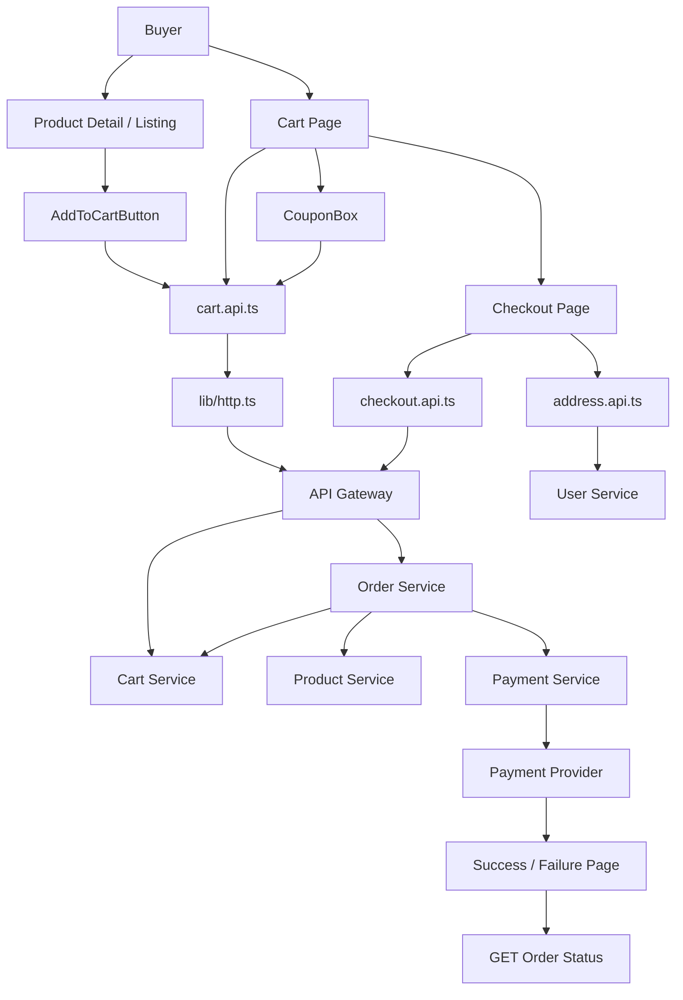
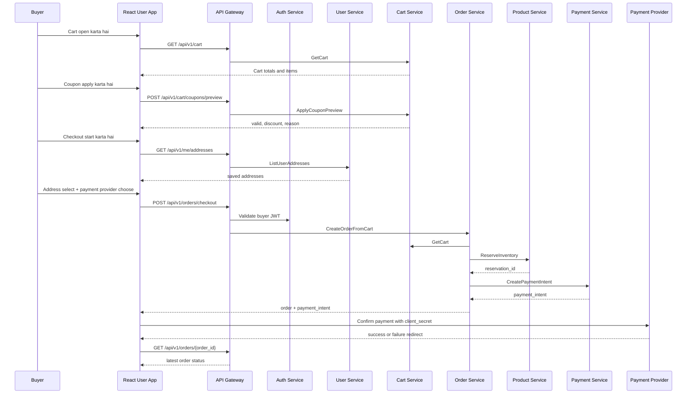
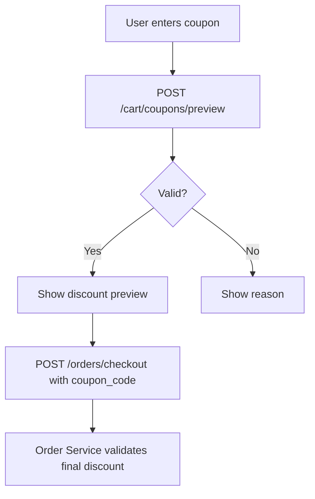

# 🛒 User App Frontend - Task 5: Cart and Checkout


## 📌 Task Summary

| Field | Detail |
|---|---|
| Task Name | Cart and checkout |
| Source | `docs/01-micro-tasks.md` → `User App Frontend` → Task 5 |
| Priority | `P0` |
| Dependency | Cart/Order/Payment |
| Main Goal | Cart, address select, coupon, payment intent, aur order success/failure flows banana |
| Output Type | Documentation-only implementation guide |
| Not Included | Full profile/address book CRUD, order history page, wishlist module, refunds, seller/admin flows, React Query/Zustand global state, gRPC-Web |

> **Simple Hinglish goal:** Is task ka kaam buyer ke shopping flow ko product se order tak le jaana hai. User product add to cart kare, cart me quantity update/remove kare, coupon preview kare, checkout me saved address select kare, backend se payment intent banaye, provider payment UI complete kare, aur final success/failure page dekhe. Amount, stock, discount, order status, and payment status ka source of truth backend hi rahega.

---

## ✅ Final Output Created

```text
TaskImplementation/
└── User App Frontend/
    ├── task1.md
    ├── task2.md
    ├── task3.md
    ├── task4.md
    └── task5.md
```

### Why this structure?

- `TaskImplementation/` project ke task-wise implementation guides ka central folder hai.
- `User App Frontend/` buyer/user-facing React app ke implementation guides ko group karta hai.
- `task5.md` sirf **User App Frontend - Task 5: Cart and checkout** ka complete step-by-step guide hai.

> 🟡 **Scope note:** Current request ke hisaab se sirf required folder structure aur `task5.md` create kiya gaya. Actual `frontend/user-app` source files yahan create nahi kiye gaye.

---

## 🧭 Source Docs Studied

| Document | Kya use kiya gaya |
|---|---|
| `docs/01-micro-tasks.md` | Task 5 ka exact scope: cart, address select, coupon, payment intent, success/failure |
| `docs/10-frontend-implementation.md` | Cart/checkout modules, state management boundaries, API layer direction |
| `docs/03-folder-structure.md` | `features/cart/`, `features/checkout/`, shared API/client structure |
| `docs/04-microservice-design.md` | Cart, Order, Payment, User Service responsibilities and REST endpoints |
| `docs/02-system-architecture.md` | Browser → API Gateway → Cart/Order/Payment checkout sequence |
| `docs/05-database-design.md` | Checkout saga, idempotency, inventory reservation, payment consistency rules |
| `docs/07-payment-system.md` | Payment intent, webhook source of truth, success/failure/retry rules |
| `api/master-api.json` | Cart, address, checkout, payment retry schemas and endpoints |
| `TaskImplementation/User App Frontend/task1.md` | Vite + React + TypeScript + Tailwind foundation boundary |
| `TaskImplementation/User App Frontend/task2.md` | App shell, cart badge route, account menu, route constants |
| `TaskImplementation/User App Frontend/task3.md` | Auth screens, form validation, minimal `lib/http.ts` pattern |
| `TaskImplementation/User App Frontend/task4.md` | Product browsing pages and add-to-cart integration points |

---

## 🎯 Task Boundary

### ✅ Included in Task 5

- Product detail/listing se `Add to cart` action connect karna
- Cart page: item list, quantity stepper, remove item, subtotal/discount/total
- Coupon preview UI: valid/invalid message and discount preview
- Checkout page with steps: address select → review → payment
- Saved address selection using buyer address list API
- Checkout request with `address_id`, optional `coupon_code`, `payment_provider`, and `idempotency_key`
- Payment intent response handle karna
- Provider payment handoff UI shell
- Order success page and payment failure page
- Payment retry entry point if backend route enabled ho
- Loading, empty, error, disabled, and optimistic-looking-but-server-confirmed UI states
- Basic tests direction for cart helpers, coupon UI, checkout flow, and payment result pages

### ❌ Not Included in Task 5

| Feature | Kyun nahi? |
|---|---|
| Full address book CRUD | Ye `User App Frontend - Task 6: Profile module` ka scope hai |
| Order history/list page | Task 6 profile/orders module me aayega |
| Wishlist move-to-cart UI | Wishlist/Profile module Task 6 me aayega |
| Refund request UI | Admin/Superadmin/Payment operations scope hai |
| Seller order management | Seller Dashboard task ka scope hai |
| React Query global server cache | `User App Frontend - Task 7: State management` ka scope hai |
| Zustand cart/session store | Task 7 me global state strategy finalize hogi |
| gRPC-Web generated clients | Task 8 ka scope hai |
| Real provider-specific card UI hardcoding | Provider final choice ke baad SDK integrate hoga; Task 5 provider-neutral shell define karta hai |

> 🟢 **Rule:** Task 5 checkout UX banata hai, but pricing, stock, inventory reserve, coupon final apply, order status, and payment final confirmation backend ke through hi decide honge.

---

## 🧱 Target Implementation Folder Structure

Actual frontend implementation execute karte time Task 5 ke baad recommended structure ye hoga:

```text
frontend/
└── user-app/
    └── src/
        ├── app-shell/
        │   ├── cart-badge.tsx
        │   └── header.tsx
        ├── components/
        │   └── ui/
        │       ├── alert.tsx
        │       ├── button.tsx
        │       ├── empty-state.tsx
        │       ├── input.tsx
        │       ├── skeleton.tsx
        │       └── spinner.tsx
        ├── features/
        │   ├── cart/
        │   │   ├── api/
        │   │   │   └── cart.api.ts
        │   │   ├── components/
        │   │   │   ├── add-to-cart-button.tsx
        │   │   │   ├── cart-empty-state.tsx
        │   │   │   ├── cart-item-row.tsx
        │   │   │   ├── cart-summary.tsx
        │   │   │   ├── coupon-box.tsx
        │   │   │   └── quantity-stepper.tsx
        │   │   ├── hooks/
        │   │   │   └── use-cart.ts
        │   │   ├── pages/
        │   │   │   └── cart-page.tsx
        │   │   └── types.ts
        │   ├── checkout/
        │   │   ├── api/
        │   │   │   ├── address.api.ts
        │   │   │   ├── checkout.api.ts
        │   │   │   └── payment.api.ts
        │   │   ├── components/
        │   │   │   ├── address-step.tsx
        │   │   │   ├── checkout-progress.tsx
        │   │   │   ├── order-review-step.tsx
        │   │   │   ├── payment-step.tsx
        │   │   │   └── payment-status-card.tsx
        │   │   ├── pages/
        │   │   │   ├── checkout-page.tsx
        │   │   │   └── payment-result-page.tsx
        │   │   ├── checkout-idempotency.ts
        │   │   ├── checkout-schema.ts
        │   │   └── types.ts
        │   ├── product/
        │   │   └── components/
        │   │       └── product-detail-actions.tsx
        │   └── auth/
        │       └── components/
        │           └── require-auth.tsx
        ├── lib/
        │   ├── env.ts
        │   └── http.ts
        └── routes/
            ├── index.tsx
            └── route-paths.ts
```

### Folder responsibility

| Path | Responsibility |
|---|---|
| `features/cart/api/cart.api.ts` | Cart REST calls: get, add, update, remove, coupon preview |
| `features/cart/hooks/use-cart.ts` | Cart page ke liye feature-local loading/mutation state |
| `features/cart/components/` | Cart-specific UI building blocks |
| `features/cart/pages/cart-page.tsx` | `/cart` route page |
| `features/checkout/api/address.api.ts` | Checkout ke liye saved addresses read karna |
| `features/checkout/api/checkout.api.ts` | `POST /api/v1/orders/checkout` and order detail read |
| `features/checkout/api/payment.api.ts` | Payment retry call, provider handoff helpers |
| `features/checkout/components/` | Address/review/payment step UI |
| `features/checkout/pages/checkout-page.tsx` | `/checkout` route page |
| `features/checkout/pages/payment-result-page.tsx` | Success/failure route UI |
| `features/checkout/checkout-idempotency.ts` | Client idempotency key generate/reuse helper |
| `features/checkout/checkout-schema.ts` | Checkout form validation schema |
| `lib/http.ts` | Authenticated API Gateway JSON calls |
| `routes/route-paths.ts` | Cart/checkout/result route constants |

> 🟡 **Address boundary:** Task 5 me address list/select use hoga. Address create/edit/delete ka full UX Task 6 me profile module ke saath aayega.

---

## 🧩 Cart and Checkout Architecture



### Hinglish explanation

- Product page/listing se user cart me item add karta hai.
- Cart page backend cart ko load karta hai. Quantity update/remove ke baad backend se fresh cart response aata hai.
- Coupon preview backend se validate hota hai; frontend discount khud calculate nahi karta.
- Checkout page saved addresses read karta hai, selected address ke saath checkout submit karta hai.
- Order Service cart validate karta hai, inventory reserve karta hai, Payment Service se payment intent leta hai.
- Frontend provider UI ko `client_secret` deta hai.
- Success/failure page user feedback hai; final payment source of truth webhook + backend order status hai.

---

## 🔁 Checkout Sequence Flow



> 🟡 **Important payment rule:** Client callback ko final truth mat samjho. `docs/07-payment-system.md` ke according provider webhook payment final status decide karega.

---

## 🗺️ Route Map

| Route | Page | Auth | API Used | Purpose |
|---|---|---|---|---|
| `/cart` | `CartPage` | buyer | `GET /api/v1/cart` | Cart items, quantity, remove, coupon preview |
| `/checkout` | `CheckoutPage` | buyer | `GET /api/v1/cart`, `GET /api/v1/me/addresses`, `POST /api/v1/orders/checkout` | Address select, review, payment intent |
| `/checkout/success?order_id=...&payment_id=...` | `PaymentResultPage` | buyer | `GET /api/v1/orders/{order_id}` | Order/payment feedback after provider success |
| `/checkout/failure?order_id=...&payment_id=...` | `PaymentResultPage` | buyer | `GET /api/v1/orders/{order_id}`, optional `POST /api/v1/payments/{payment_id}/retry` | Failed payment feedback and retry |
| `/products/:productId` | Existing Task 4 page | public/buyer action | `POST /api/v1/cart/items` | Add selected variant to cart |

### Route constants

```ts
export const routePaths = {
  home: "/",
  cart: "/cart",
  checkout: "/checkout",
  checkoutSuccess: "/checkout/success",
  checkoutFailure: "/checkout/failure",
  login: "/login",
  productDetail: (productId: string) => `/products/${productId}`,
  orderDetail: (orderId: string) => `/account/orders/${orderId}`,
} as const;
```

### Explanation

- Cart route buyer-facing hai.
- Checkout route protected hona chahiye.
- Success/failure routes provider redirect ke baad user ko clear status dikhate hain.
- `orderDetail` route Task 6 me actual profile/orders page ke saath implement hoga; Task 5 me result page enough hai.

---

## 🔌 API Contract Used in Task 5

`api/master-api.json` ke according Task 5 ke core endpoints ye hain:

| Feature | Method | Endpoint | Service | Auth | Request | Response |
|---|---|---|---|---|---|---|
| Get cart | `GET` | `/api/v1/cart` | `cart-service` | buyer | `Empty` | `Cart` |
| Add item | `POST` | `/api/v1/cart/items` | `cart-service` | buyer | `CartItemInput` | `Cart` |
| Update quantity | `PATCH` | `/api/v1/cart/items/{item_id}` | `cart-service` | buyer | `CartItemQuantityInput` | `Cart` |
| Remove item | `DELETE` | `/api/v1/cart/items/{item_id}` | `cart-service` | buyer | `IdPathRequest` | `Cart` |
| Coupon preview | `POST` | `/api/v1/cart/coupons/preview` | `cart-service` | buyer | `CouponPreviewRequest` | `CouponPreviewResponse` |
| Address list | `GET` | `/api/v1/me/addresses` | `user-service` | buyer | `PaginationRequest` | `AddressListResponse` |
| Checkout | `POST` | `/api/v1/orders/checkout` | `order-service` | buyer | `CheckoutRequest` | `CheckoutResponse` |
| Order detail | `GET` | `/api/v1/orders/{order_id}` | `order-service` | buyer | `IdPathRequest` | `Order` |
| Payment retry | `POST` | `/api/v1/payments/{payment_id}/retry` | `payment-service` | buyer | `RetryPaymentRequest` | provider/payment response |

### Important schema fields

```ts
type Money = {
  amount?: number;
  currency?: string;
};

type CartItemInput = {
  product_id: string;
  variant_id: string;
  quantity: number;
};

type CartItemQuantityInput = {
  quantity: number;
};

type CouponPreviewRequest = {
  coupon_code: string;
  cart_id?: string;
  order_id?: string;
};

type CheckoutRequest = {
  address_id: string;
  coupon_code?: string;
  payment_provider: string;
  idempotency_key: string;
};

type PaymentIntentResponse = {
  payment_id?: string;
  provider?: string;
  client_secret?: string;
  amount?: Money;
  status?: string;
};
```

### Frontend-safe cart item shape

`Cart.items` schema currently generic `object[]` hai, so frontend ko tolerant type banana chahiye:

```ts
export type CartItem = {
  item_id: string;
  product_id: string;
  variant_id: string;
  title?: string;
  image_url?: string;
  variant_label?: string;
  unit_price?: Money;
  line_total?: Money;
  quantity: number;
  stock_status?: "in_stock" | "low_stock" | "out_of_stock";
};

export type Cart = {
  cart_id?: string;
  user_id?: string;
  items?: CartItem[];
  subtotal?: Money;
  discount?: Money;
  total?: Money;
};
```

> 🟡 **Backend source note:** Cart item price/title/image snapshot UI display ke liye useful hai, but checkout ke time Order Service fresh price and stock validate karega.

---

## 📦 External Libraries and Tools

| Tool/Library | Type | Why Used | Install/Use |
|---|---|---|---|
| React | UI library | Cart and checkout pages component-based banane ke liye | Task 1 setup me installed |
| TypeScript | Type system | Cart/order/payment API payloads type-safe rakhne ke liye | Task 1 setup |
| Tailwind CSS | Styling | Responsive cart rows, checkout steps, badges, alerts, skeletons ke liye | Task 1 setup |
| `react-router-dom` | Routing | `/cart`, `/checkout`, success/failure result routes ke liye | Task 2 me installed: `pnpm --filter user-app add react-router-dom` |
| `lucide-react` | Icons | Cart, trash, coupon, shield, check, warning, payment icons ke liye | Task 2 me installed: `pnpm --filter user-app add lucide-react` |
| `react-hook-form` | Form state | Coupon input and checkout form state manage karne ke liye | Task 3 me installed: `pnpm --filter user-app add react-hook-form` |
| `zod` | Validation | Address/payment provider/coupon form validation ke liye | Task 3 me installed: `pnpm --filter user-app add zod` |
| `@hookform/resolvers` | Form adapter | Zod schemas ko React Hook Form se connect karne ke liye | Task 3 me installed: `pnpm --filter user-app add @hookform/resolvers` |
| Fetch API | Browser API | API Gateway REST calls ke liye; extra package nahi chahiye | `fetch(url, options)` |
| `AbortController` | Browser API | Page unmount/route change par old requests cancel karne ke liye | Built-in browser API |
| Web Crypto `crypto.randomUUID()` | Browser API | Checkout idempotency key generate karne ke liye | Built-in browser API |
| Vitest + Testing Library | Dev tools | Cart/checkout component/helper tests ke liye | `pnpm --filter user-app add -D vitest jsdom @testing-library/react @testing-library/user-event msw` |
| MSW | Test mock server | Cart/checkout/payment APIs mock karne ke liye | Same dev dependency command above |

### Payment provider SDK note

Task 5 provider-neutral shell define karta hai. Real provider choose hone ke baad SDK install hoga:

| Provider | Example package/tool | Kab use hoga |
|---|---|---|
| Stripe-like | `@stripe/stripe-js` | Agar Payment Service `provider = "stripe"` and `client_secret` return kare |
| Razorpay-like | Checkout script/package | Agar Payment Service `provider = "razorpay"` return kare |

```bash
# Example only, provider final hone ke baad:
pnpm --filter user-app add @stripe/stripe-js
```

> 🟡 **Security rule:** Card data app ke server ya frontend state me store nahi hoga. Provider SDK secure hosted/payment element flow handle karega.

### Install commands recap

Task 5 ke core implementation ke liye usually new mandatory runtime package required nahi hai, kyunki router/icons/forms previous tasks me aa chuke hain:

```bash
pnpm --filter user-app add react-router-dom lucide-react
pnpm --filter user-app add react-hook-form zod @hookform/resolvers
```

Testing setup agar missing ho:

```bash
pnpm --filter user-app add -D vitest jsdom @testing-library/react @testing-library/user-event msw
```

---

## 🪜 Step-by-Step Implementation

## Step 1: Previous Tasks Confirm Karo

Task 5 start karne se pehle Task 1-4 ka baseline ready hona chahiye:

```bash
pnpm --filter user-app typecheck
pnpm --filter user-app lint
pnpm --filter user-app build
```

### Expected baseline

| Previous Task | Required for Task 5 |
|---|---|
| Task 1 | React + TypeScript + Tailwind app foundation |
| Task 2 | App shell, cart route entry point, route constants |
| Task 3 | Auth screens, form validation libs, minimal HTTP client pattern |
| Task 4 | Product detail/listing pages where add-to-cart action attach hoga |

### Explanation

Checkout buyer-only flow hai, isliye auth/token handling ka baseline important hai. Product browsing pages ready honge to `AddToCartButton` naturally attach ho sakta hai.

---

## Step 2: Route Constants Update Karo

`src/routes/route-paths.ts`:

```ts
export const routePaths = {
  home: "/",
  search: "/search",
  cart: "/cart",
  checkout: "/checkout",
  checkoutSuccess: "/checkout/success",
  checkoutFailure: "/checkout/failure",
  login: "/login",
  productDetail: (productId: string) => `/products/${productId}`,
} as const;
```

### Explanation

- Routes ek jagah centralize rahenge.
- Cart page se checkout navigation consistent hoga.
- Provider redirect URLs success/failure constants se banenge.

---

## Step 3: Protected Checkout Boundary Define Karo

`src/features/auth/components/require-auth.tsx`:

```tsx
import { Navigate, useLocation } from "react-router-dom";
import { routePaths } from "../../../routes/route-paths";

type RequireAuthProps = {
  children: React.ReactNode;
};

function hasAccessToken() {
  return Boolean(localStorage.getItem("access_token"));
}

export function RequireAuth({ children }: RequireAuthProps) {
  const location = useLocation();

  if (!hasAccessToken()) {
    const redirectTo = encodeURIComponent(location.pathname + location.search);
    return <Navigate replace to={`${routePaths.login}?redirect=${redirectTo}`} />;
  }

  return <>{children}</>;
}
```

### Explanation

- Checkout/cart mutation buyer APIs hain, so login required hai.
- Task 7 me final auth/session store aayega. Tab ye `localStorage` helper store selector se replace ho sakta hai.
- Abhi guard simple hai, but route-level protection UX ko clean banata hai.

> 🟡 **Security note:** Frontend guard sirf UX ke liye hai. Real auth API Gateway/Auth Service enforce karega.

---

## Step 4: HTTP Client Buyer Endpoints Ke Liye Extend Karo

Task 3/4 ke `lib/http.ts` pattern ko buyer endpoints ke liye methods ke saath extend karo.

```ts
// src/lib/http.ts
type ApiEnvelope<T> = {
  data?: T;
  request_id?: string;
  error?: {
    code: string;
    message: string;
    details?: unknown;
  };
};

type HttpOptions = {
  signal?: AbortSignal;
  auth?: boolean;
};

export class ApiError extends Error {
  code: string;
  requestId?: string;
  details?: unknown;

  constructor(message: string, code: string, requestId?: string, details?: unknown) {
    super(message);
    this.name = "ApiError";
    this.code = code;
    this.requestId = requestId;
    this.details = details;
  }
}

function getAccessToken() {
  return localStorage.getItem("access_token");
}

async function apiRequest<TResponse, TBody = unknown>(
  path: string,
  init: RequestInit & { body?: TBody } = {},
  options: HttpOptions = {},
) {
  const token = options.auth ? getAccessToken() : null;

  const response = await fetch(`${import.meta.env.VITE_API_BASE_URL}${path}`, {
    ...init,
    headers: {
      Accept: "application/json",
      "Content-Type": "application/json",
      "X-Client": "user-app",
      ...(token ? { Authorization: `Bearer ${token}` } : {}),
      ...init.headers,
    },
    body: init.body ? JSON.stringify(init.body) : undefined,
    signal: options.signal,
  });

  const envelope = (await response.json()) as ApiEnvelope<TResponse>;

  if (!response.ok || envelope.error) {
    throw new ApiError(
      envelope.error?.message ?? "Request failed",
      envelope.error?.code ?? "REQUEST_FAILED",
      envelope.request_id,
      envelope.error?.details,
    );
  }

  if (!envelope.data) {
    throw new ApiError("Empty response from server", "EMPTY_RESPONSE", envelope.request_id);
  }

  return envelope.data;
}

export function apiGet<TResponse>(path: string, options: HttpOptions = {}) {
  return apiRequest<TResponse>(path, { method: "GET" }, options);
}

export function apiPost<TResponse, TBody>(path: string, body: TBody, options: HttpOptions = {}) {
  return apiRequest<TResponse, TBody>(path, { method: "POST", body }, options);
}

export function apiPatch<TResponse, TBody>(path: string, body: TBody, options: HttpOptions = {}) {
  return apiRequest<TResponse, TBody>(path, { method: "PATCH", body }, options);
}

export function apiDelete<TResponse>(path: string, options: HttpOptions = {}) {
  return apiRequest<TResponse>(path, { method: "DELETE" }, options);
}
```

### Explanation

- Cart/checkout endpoints buyer-auth required hain, so `auth: true` option add hua.
- `Authorization` header only protected calls me attach hota hai.
- API Gateway response envelope normalize hota hai.
- Task 7 me refresh-token retry logic add ho sakta hai.

---

## Step 5: Cart Types Define Karo

`src/features/cart/types.ts`:

```ts
export type Money = {
  amount?: number;
  currency?: string;
};

export type CartItem = {
  item_id: string;
  product_id: string;
  variant_id: string;
  title?: string;
  image_url?: string;
  variant_label?: string;
  unit_price?: Money;
  line_total?: Money;
  quantity: number;
  stock_status?: "in_stock" | "low_stock" | "out_of_stock";
};

export type Cart = {
  cart_id?: string;
  user_id?: string;
  items?: CartItem[];
  subtotal?: Money;
  discount?: Money;
  total?: Money;
};

export type AddCartItemRequest = {
  product_id: string;
  variant_id: string;
  quantity: number;
};

export type UpdateCartItemRequest = {
  quantity: number;
};

export type CouponPreviewRequest = {
  coupon_code: string;
  cart_id?: string;
};

export type CouponPreviewResponse = {
  valid?: boolean;
  coupon_id?: string;
  discount?: Money;
  reason?: string;
};
```

### Explanation

- Backend schema me cart items generic object hain, so frontend item fields optional/tolerant rakhta hai.
- Money display always backend values se hoga.
- Coupon preview response frontend ko clear valid/invalid message dikhane me help karta hai.

---

## Step 6: Money Formatting Helper Banao

`src/features/cart/components/price.ts`:

```ts
import type { Money } from "../types";

export function formatMoney(money?: Money) {
  const amount = money?.amount ?? 0;
  const currency = money?.currency ?? "INR";

  return new Intl.NumberFormat("en-IN", {
    style: "currency",
    currency,
    maximumFractionDigits: 2,
  }).format(amount / 100);
}
```

### Explanation

- Agar backend amount paise/cents minor unit me bhejta hai, UI `amount / 100` format karega.
- Currency fallback `INR` hai, but backend `currency` source of truth rahega.
- Helper duplicate price formatting avoid karta hai.

> 🟡 **Amount unit note:** Backend contract me `Money.amount` integer/number hai. Team ko final minor-unit convention confirm karna chahiye. Financial UI me hardcoded calculations avoid karo.

---

## Step 7: Cart API Functions Banao

`src/features/cart/api/cart.api.ts`:

```ts
import { apiDelete, apiGet, apiPatch, apiPost } from "../../../lib/http";
import type {
  AddCartItemRequest,
  Cart,
  CouponPreviewRequest,
  CouponPreviewResponse,
  UpdateCartItemRequest,
} from "../types";

export function getCart(signal?: AbortSignal) {
  return apiGet<Cart>("/api/v1/cart", { auth: true, signal });
}

export function addCartItem(body: AddCartItemRequest) {
  return apiPost<Cart, AddCartItemRequest>("/api/v1/cart/items", body, { auth: true });
}

export function updateCartItem(itemId: string, body: UpdateCartItemRequest) {
  return apiPatch<Cart, UpdateCartItemRequest>(
    `/api/v1/cart/items/${encodeURIComponent(itemId)}`,
    body,
    { auth: true },
  );
}

export function removeCartItem(itemId: string) {
  return apiDelete<Cart>(`/api/v1/cart/items/${encodeURIComponent(itemId)}`, { auth: true });
}

export function previewCoupon(body: CouponPreviewRequest) {
  return apiPost<CouponPreviewResponse, CouponPreviewRequest>(
    "/api/v1/cart/coupons/preview",
    body,
    { auth: true },
  );
}
```

### Explanation

- API logic components me scatter nahi hota.
- `encodeURIComponent` item id path-safe banata hai.
- Mutations backend se fresh `Cart` response leti hain, so UI local total calculate nahi karta.

---

## Step 8: Feature-Local `useCart` Hook Banao

`src/features/cart/hooks/use-cart.ts`:

```ts
import { useCallback, useEffect, useState } from "react";
import { addCartItem, getCart, removeCartItem, updateCartItem } from "../api/cart.api";
import type { AddCartItemRequest, Cart } from "../types";

type CartState = {
  cart?: Cart;
  loading: boolean;
  error?: string;
  mutatingItemId?: string;
};

export function useCart() {
  const [state, setState] = useState<CartState>({ loading: true });

  const loadCart = useCallback(async (signal?: AbortSignal) => {
    setState((current) => ({ ...current, loading: true, error: undefined }));

    try {
      const cart = await getCart(signal);
      setState({ cart, loading: false });
    } catch (error) {
      if (error instanceof DOMException && error.name === "AbortError") return;
      setState({ loading: false, error: error instanceof Error ? error.message : "Cart load failed" });
    }
  }, []);

  useEffect(() => {
    const controller = new AbortController();
    void loadCart(controller.signal);
    return () => controller.abort();
  }, [loadCart]);

  async function addItem(body: AddCartItemRequest) {
    const cart = await addCartItem(body);
    setState({ cart, loading: false });
  }

  async function changeQuantity(itemId: string, quantity: number) {
    setState((current) => ({ ...current, mutatingItemId: itemId }));
    const cart = await updateCartItem(itemId, { quantity });
    setState({ cart, loading: false });
  }

  async function removeItem(itemId: string) {
    setState((current) => ({ ...current, mutatingItemId: itemId }));
    const cart = await removeCartItem(itemId);
    setState({ cart, loading: false });
  }

  return {
    ...state,
    reload: loadCart,
    addItem,
    changeQuantity,
    removeItem,
  };
}
```

### Explanation

- Task 5 me React Query intentionally nahi use kar rahe, kyunki Task 7 state management ka scope hai.
- Hook page-level server state handle karta hai.
- Mutations ke baad backend response se cart replace hota hai.

---

## Step 9: Add-to-Cart Button Banao

`src/features/cart/components/add-to-cart-button.tsx`:

```tsx
import { ShoppingCart } from "lucide-react";
import { useState } from "react";
import { useNavigate } from "react-router-dom";
import { addCartItem } from "../api/cart.api";

type AddToCartButtonProps = {
  productId: string;
  variantId: string;
  quantity?: number;
};

export function AddToCartButton({ productId, variantId, quantity = 1 }: AddToCartButtonProps) {
  const navigate = useNavigate();
  const [status, setStatus] = useState<"idle" | "loading" | "success" | "error">("idle");

  async function handleAddToCart() {
    setStatus("loading");

    try {
      await addCartItem({
        product_id: productId,
        variant_id: variantId,
        quantity,
      });
      setStatus("success");
    } catch {
      setStatus("error");
    }
  }

  return (
    <div className="space-y-2">
      <button
        className="inline-flex items-center justify-center gap-2 rounded-md bg-slate-950 px-4 py-2 text-sm font-medium text-white hover:bg-slate-800 disabled:cursor-not-allowed disabled:opacity-60"
        disabled={status === "loading"}
        type="button"
        onClick={handleAddToCart}
      >
        <ShoppingCart aria-hidden="true" size={18} />
        {status === "loading" ? "Adding..." : "Add to cart"}
      </button>

      {status === "success" ? (
        <button className="text-sm font-medium text-emerald-700 underline" type="button" onClick={() => navigate("/cart")}>
          Added. View cart
        </button>
      ) : null}

      {status === "error" ? (
        <p className="text-sm text-red-700">Item add nahi ho paya. Please login ya retry karo.</p>
      ) : null}
    </div>
  );
}
```

### Explanation

- Product browsing Task 4 ke placeholder action ko real cart mutation se connect karta hai.
- Success ke baad user cart page ja sakta hai.
- Failure message generic hai; API error mapping se later exact message show ho sakta hai.

> 🟡 **Auth behavior:** Agar API `401` return kare, HTTP client ya page user ko login redirect kara sakta hai. Final token refresh/redirect polish Task 7 me improve hoga.

---

## Step 10: Product Detail Page Me Cart Action Attach Karo

Task 4 ke `ProductDetailPage` me selected variant milne ke baad CTA add karo:

```tsx
import { AddToCartButton } from "../../cart/components/add-to-cart-button";

// Product detail component ke andar:
{selectedVariant ? (
  <AddToCartButton
    productId={product.product_id}
    variantId={selectedVariant.sku}
    quantity={1}
  />
) : (
  <p className="text-sm text-slate-600">Please variant select karo.</p>
)}
```

### Explanation

- Product detail page product read UX hi maintain karta hai.
- Cart mutation separate `features/cart` me rehti hai.
- Variant id ke liye current API schema me variant `sku` available hai; backend agar separate `variant_id` introduce kare to mapping update hogi.

---

## Step 11: Quantity Stepper Component Banao

`src/features/cart/components/quantity-stepper.tsx`:

```tsx
type QuantityStepperProps = {
  value: number;
  disabled?: boolean;
  onChange: (nextQuantity: number) => void;
};

export function QuantityStepper({ value, disabled, onChange }: QuantityStepperProps) {
  return (
    <div className="inline-flex items-center overflow-hidden rounded-md border border-slate-300">
      <button
        aria-label="Decrease quantity"
        className="px-3 py-2 text-sm disabled:opacity-40"
        disabled={disabled || value <= 1}
        type="button"
        onClick={() => onChange(value - 1)}
      >
        -
      </button>
      <span className="min-w-10 px-3 py-2 text-center text-sm font-medium">{value}</span>
      <button
        aria-label="Increase quantity"
        className="px-3 py-2 text-sm disabled:opacity-40"
        disabled={disabled}
        type="button"
        onClick={() => onChange(value + 1)}
      >
        +
      </button>
    </div>
  );
}
```

### Explanation

- Quantity zero nahi hoti; remove action separate rakha gaya.
- Backend quantity limit/stock final enforce karega.
- Buttons accessible labels ke saath clear hain.

---

## Step 12: Cart Item Row Banao

`src/features/cart/components/cart-item-row.tsx`:

```tsx
import { Trash2 } from "lucide-react";
import { formatMoney } from "./price";
import { QuantityStepper } from "./quantity-stepper";
import type { CartItem } from "../types";

type CartItemRowProps = {
  item: CartItem;
  disabled?: boolean;
  onQuantityChange: (itemId: string, quantity: number) => void;
  onRemove: (itemId: string) => void;
};

export function CartItemRow({ item, disabled, onQuantityChange, onRemove }: CartItemRowProps) {
  return (
    <article className="grid gap-4 border-b border-slate-200 py-4 sm:grid-cols-[96px_1fr_auto]">
      <div className="aspect-square overflow-hidden rounded-md bg-slate-100">
        {item.image_url ? (
          
        ) : (
          <div className="flex h-full items-center justify-center text-xs text-slate-500">No image</div>
        )}
      </div>

      <div className="min-w-0">
        <h3 className="text-sm font-semibold text-slate-950">{item.title ?? "Product"}</h3>
        {item.variant_label ? <p className="mt-1 text-sm text-slate-600">{item.variant_label}</p> : null}
        {item.stock_status === "out_of_stock" ? (
          <p className="mt-2 text-sm font-medium text-red-700">Out of stock</p>
        ) : null}
        <button
          className="mt-3 inline-flex items-center gap-1 text-sm text-red-700 hover:text-red-800"
          disabled={disabled}
          type="button"
          onClick={() => onRemove(item.item_id)}
        >
          <Trash2 aria-hidden="true" size={16} />
          Remove
        </button>
      </div>

      <div className="flex items-center justify-between gap-4 sm:flex-col sm:items-end">
        <QuantityStepper
          disabled={disabled}
          value={item.quantity}
          onChange={(quantity) => onQuantityChange(item.item_id, quantity)}
        />
        <p className="text-sm font-semibold text-slate-950">{formatMoney(item.line_total ?? item.unit_price)}</p>
      </div>
    </article>
  );
}
```

### Explanation

- Row responsive grid use karta hai.
- Image absent ho to clean placeholder show hota hai.
- Quantity and remove API mutation parent page handle karega.

---

## Step 13: Coupon Box Banao

`src/features/cart/components/coupon-box.tsx`:

```tsx
import { zodResolver } from "@hookform/resolvers/zod";
import { TicketPercent } from "lucide-react";
import { useState } from "react";
import { useForm } from "react-hook-form";
import { z } from "zod";
import { previewCoupon } from "../api/cart.api";
import { formatMoney } from "./price";
import type { CouponPreviewResponse } from "../types";

const couponSchema = z.object({
  coupon_code: z.string().trim().min(2, "Coupon code enter karo").max(40),
});

type CouponForm = z.infer<typeof couponSchema>;

type CouponBoxProps = {
  cartId?: string;
  onCouponAccepted: (couponCode: string) => void;
};

export function CouponBox({ cartId, onCouponAccepted }: CouponBoxProps) {
  const [preview, setPreview] = useState<CouponPreviewResponse>();
  const [error, setError] = useState<string>();
  const form = useForm<CouponForm>({
    resolver: zodResolver(couponSchema),
    defaultValues: { coupon_code: "" },
  });

  async function handleApply(values: CouponForm) {
    setError(undefined);
    setPreview(undefined);

    try {
      const result = await previewCoupon({
        coupon_code: values.coupon_code.toUpperCase(),
        cart_id: cartId,
      });
      setPreview(result);

      if (result.valid) {
        onCouponAccepted(values.coupon_code.toUpperCase());
      }
    } catch (apiError) {
      setError(apiError instanceof Error ? apiError.message : "Coupon validate nahi ho paya");
    }
  }

  return (
    <section className="rounded-md border border-slate-200 p-4">
      <div className="mb-3 flex items-center gap-2">
        <TicketPercent aria-hidden="true" size={18} />
        <h2 className="text-sm font-semibold text-slate-950">Apply coupon</h2>
      </div>

      <form className="flex gap-2" onSubmit={form.handleSubmit(handleApply)}>
        <input
          className="min-w-0 flex-1 rounded-md border border-slate-300 px-3 py-2 text-sm"
          placeholder="SAVE10"
          {...form.register("coupon_code")}
        />
        <button
          className="rounded-md bg-slate-950 px-4 py-2 text-sm font-medium text-white disabled:opacity-60"
          disabled={form.formState.isSubmitting}
          type="submit"
        >
          Apply
        </button>
      </form>

      {form.formState.errors.coupon_code ? (
        <p className="mt-2 text-sm text-red-700">{form.formState.errors.coupon_code.message}</p>
      ) : null}

      {error ? <p className="mt-2 text-sm text-red-700">{error}</p> : null}

      {preview?.valid ? (
        <p className="mt-2 text-sm text-emerald-700">
          Coupon valid. Discount: {formatMoney(preview.discount)}
        </p>
      ) : null}

      {preview && !preview.valid ? (
        <p className="mt-2 text-sm text-amber-700">{preview.reason ?? "Coupon applicable nahi hai."}</p>
      ) : null}
    </section>
  );
}
```

### Explanation

- Coupon code frontend validate karta hai, but real validity backend preview API decide karti hai.
- Accepted coupon code checkout request me pass hota hai.
- Invalid coupon me reason show hota hai.

---

## Step 14: Cart Summary Banao

`src/features/cart/components/cart-summary.tsx`:

```tsx
import { Link } from "react-router-dom";
import { routePaths } from "../../../routes/route-paths";
import { formatMoney } from "./price";
import type { Cart } from "../types";

type CartSummaryProps = {
  cart?: Cart;
  checkoutDisabled?: boolean;
};

export function CartSummary({ cart, checkoutDisabled }: CartSummaryProps) {
  return (
    <aside className="rounded-md border border-slate-200 p-4">
      <h2 className="text-base font-semibold text-slate-950">Order summary</h2>

      <dl className="mt-4 space-y-3 text-sm">
        <div className="flex justify-between">
          <dt className="text-slate-600">Subtotal</dt>
          <dd className="font-medium">{formatMoney(cart?.subtotal)}</dd>
        </div>
        <div className="flex justify-between">
          <dt className="text-slate-600">Discount</dt>
          <dd className="font-medium text-emerald-700">- {formatMoney(cart?.discount)}</dd>
        </div>
        <div className="border-t border-slate-200 pt-3">
          <div className="flex justify-between text-base font-semibold">
            <dt>Total</dt>
            <dd>{formatMoney(cart?.total)}</dd>
          </div>
        </div>
      </dl>

      <Link
        aria-disabled={checkoutDisabled}
        className="mt-5 block rounded-md bg-slate-950 px-4 py-2 text-center text-sm font-medium text-white aria-disabled:pointer-events-none aria-disabled:opacity-50"
        to={routePaths.checkout}
      >
        Proceed to checkout
      </Link>
    </aside>
  );
}
```

### Explanation

- Summary totals backend response se aate hain.
- Checkout disabled empty/out-of-stock state me use ho sakta hai.
- Layout card radius `8px` ke andar rakha gaya.

---

## Step 15: Cart Page Compose Karo

`src/features/cart/pages/cart-page.tsx`:

```tsx
import { Link } from "react-router-dom";
import { CartItemRow } from "../components/cart-item-row";
import { CartSummary } from "../components/cart-summary";
import { CouponBox } from "../components/coupon-box";
import { useCart } from "../hooks/use-cart";

export function CartPage() {
  const { cart, loading, error, mutatingItemId, changeQuantity, removeItem } = useCart();
  const items = cart?.items ?? [];
  const isEmpty = !loading && items.length === 0;

  if (loading) {
    return <main className="mx-auto max-w-6xl px-4 py-8">Loading cart...</main>;
  }

  if (error) {
    return (
      <main className="mx-auto max-w-6xl px-4 py-8">
        <h1 className="text-2xl font-semibold text-slate-950">Cart</h1>
        <p className="mt-3 rounded-md bg-red-50 p-3 text-sm text-red-700">{error}</p>
      </main>
    );
  }

  if (isEmpty) {
    return (
      <main className="mx-auto max-w-6xl px-4 py-8">
        <h1 className="text-2xl font-semibold text-slate-950">Your cart is empty</h1>
        <p className="mt-2 text-slate-600">Products browse karo aur cart me add karo.</p>
        <Link className="mt-4 inline-block rounded-md bg-slate-950 px-4 py-2 text-sm font-medium text-white" to="/">
          Continue shopping
        </Link>
      </main>
    );
  }

  return (
    <main className="mx-auto max-w-6xl px-4 py-8">
      <h1 className="text-2xl font-semibold text-slate-950">Cart</h1>

      <div className="mt-6 grid gap-8 lg:grid-cols-[1fr_360px]">
        <section aria-label="Cart items">
          {items.map((item) => (
            <CartItemRow
              key={item.item_id}
              disabled={mutatingItemId === item.item_id}
              item={item}
              onQuantityChange={changeQuantity}
              onRemove={removeItem}
            />
          ))}
        </section>

        <div className="space-y-4">
          <CouponBox cartId={cart?.cart_id} onCouponAccepted={() => undefined} />
          <CartSummary cart={cart} checkoutDisabled={items.length === 0} />
        </div>
      </div>
    </main>
  );
}
```

### Explanation

- Cart page loading/error/empty/success states handle karta hai.
- Quantity/remove ke baad hook backend response se UI update karta hai.
- Coupon accepted value checkout me persist karna ho to query param/session storage use kar sakte ho; final reliable apply checkout request me `coupon_code` se hota hai.

> 🟡 **Task 7 note:** Global cart count and React Query cache invalidation Task 7 me cleaner hoga. Task 5 me cart page feature-local state enough hai.

---

## Step 16: Checkout Types Define Karo

`src/features/checkout/types.ts`:

```ts
import type { Cart, Money } from "../cart/types";

export type Address = {
  address_id?: string;
  name: string;
  phone?: string;
  line1: string;
  line2?: string;
  city: string;
  state: string;
  postal_code: string;
  country: string;
  is_default?: boolean;
};

export type AddressListResponse = {
  addresses?: Address[];
};

export type CheckoutRequest = {
  address_id: string;
  coupon_code?: string;
  payment_provider: string;
  idempotency_key: string;
};

export type Order = {
  order_id?: string;
  user_id?: string;
  status?: string;
  items?: unknown[];
  total?: Money;
  created_at?: string;
};

export type PaymentIntentResponse = {
  payment_id?: string;
  provider?: string;
  client_secret?: string;
  amount?: Money;
  status?: string;
};

export type CheckoutResponse = {
  order?: Order;
  payment_intent?: PaymentIntentResponse;
};

export type CheckoutPageData = {
  cart?: Cart;
  addresses?: Address[];
};
```

### Explanation

- Checkout uses cart totals and address list.
- Order response success/failure route ke liye enough information deta hai.
- Payment intent provider-specific details ko generic shape me hold karta hai.

---

## Step 17: Checkout Validation Schema Banao

`src/features/checkout/checkout-schema.ts`:

```ts
import { z } from "zod";

export const checkoutSchema = z.object({
  address_id: z.string().min(1, "Delivery address select karo"),
  coupon_code: z.string().trim().max(40).optional(),
  payment_provider: z.string().min(1, "Payment method select karo"),
});

export type CheckoutFormValues = z.infer<typeof checkoutSchema>;
```

### Explanation

- User ko empty address/payment submit karne se roka jaata hai.
- Coupon optional hai.
- Backend still final validation karega.

---

## Step 18: Idempotency Key Helper Banao

`src/features/checkout/checkout-idempotency.ts`:

```ts
const CHECKOUT_KEY = "checkout_idempotency_key";

export function getCheckoutIdempotencyKey() {
  const existing = sessionStorage.getItem(CHECKOUT_KEY);
  if (existing) return existing;

  const nextKey = crypto.randomUUID();
  sessionStorage.setItem(CHECKOUT_KEY, nextKey);
  return nextKey;
}

export function clearCheckoutIdempotencyKey() {
  sessionStorage.removeItem(CHECKOUT_KEY);
}
```

### Explanation

- Checkout double-click/retry se duplicate order avoid karne me idempotency key help karti hai.
- Same checkout attempt ke liye key reuse hoti hai.
- Successful payment ke baad key clear kar sakte ho.

> 🟡 **Backend rule:** `docs/05-database-design.md` me `order_idempotency_keys(user_id, idempotency_key)` unique index recommended hai. Frontend key helpful hai, but duplicate prevention backend enforce karega.

---

## Step 19: Address API Helper Banao

`src/features/checkout/api/address.api.ts`:

```ts
import { apiGet } from "../../../lib/http";
import type { AddressListResponse } from "../types";

export async function listCheckoutAddresses(signal?: AbortSignal) {
  const response = await apiGet<AddressListResponse>("/api/v1/me/addresses", {
    auth: true,
    signal,
  });

  return response.addresses ?? [];
}
```

### Explanation

- Task 5 read-only address selection karta hai.
- Address create/edit/delete full UX Task 6 profile module me hoga.
- Checkout page empty address state show karega.

---

## Step 20: Checkout API Helper Banao

`src/features/checkout/api/checkout.api.ts`:

```ts
import { apiGet, apiPost } from "../../../lib/http";
import type { CheckoutRequest, CheckoutResponse, Order } from "../types";

export function createCheckout(body: CheckoutRequest) {
  return apiPost<CheckoutResponse, CheckoutRequest>("/api/v1/orders/checkout", body, {
    auth: true,
  });
}

export function getOrder(orderId: string, signal?: AbortSignal) {
  return apiGet<Order>(`/api/v1/orders/${encodeURIComponent(orderId)}`, {
    auth: true,
    signal,
  });
}
```

### Explanation

- `createCheckout` cart ko order/payment intent me convert karta hai.
- `getOrder` payment result page par latest order status dikhata hai.
- Frontend direct Payment Service se intent create nahi karta; Order Service checkout orchestrate karta hai.

---

## Step 21: Payment Retry API Helper Banao

`src/features/checkout/api/payment.api.ts`:

```ts
import { apiPost } from "../../../lib/http";

type RetryPaymentRequest = {
  payment_id?: string;
  idempotency_key: string;
};

type RetryPaymentResponse = {
  payment_id?: string;
  client_secret?: string;
  status?: string;
};

export function retryPayment(paymentId: string, body: RetryPaymentRequest) {
  return apiPost<RetryPaymentResponse, RetryPaymentRequest>(
    `/api/v1/payments/${encodeURIComponent(paymentId)}/retry`,
    body,
    { auth: true },
  );
}
```

### Explanation

- Failure page retry button ke liye helper ready hai.
- Backend max retry count/idempotency enforce karega.
- Agar backend retry temporarily unavailable ho, UI user ko cart/checkout par wapas bhej sakta hai.

---

## Step 22: Address Step Component Banao

`src/features/checkout/components/address-step.tsx`:

```tsx
import type { Address } from "../types";

type AddressStepProps = {
  addresses: Address[];
  selectedAddressId?: string;
  onSelect: (addressId: string) => void;
};

export function AddressStep({ addresses, selectedAddressId, onSelect }: AddressStepProps) {
  if (addresses.length === 0) {
    return (
      <section className="rounded-md border border-amber-200 bg-amber-50 p-4">
        <h2 className="text-base font-semibold text-amber-950">No saved address</h2>
        <p className="mt-1 text-sm text-amber-800">
          Checkout continue karne ke liye saved address chahiye. Address book UI Task 6 me add hoga.
        </p>
      </section>
    );
  }

  return (
    <section>
      <h2 className="text-base font-semibold text-slate-950">Delivery address</h2>
      <div className="mt-3 grid gap-3">
        {addresses.map((address) => (
          <label
            key={address.address_id}
            className="flex cursor-pointer gap-3 rounded-md border border-slate-200 p-4 has-[:checked]:border-slate-950"
          >
            <input
              checked={selectedAddressId === address.address_id}
              className="mt-1"
              name="address_id"
              type="radio"
              value={address.address_id}
              onChange={() => address.address_id && onSelect(address.address_id)}
            />
            <span className="text-sm">
              <span className="block font-semibold text-slate-950">
                {address.name} {address.is_default ? "(Default)" : ""}
              </span>
              <span className="mt-1 block text-slate-600">
                {address.line1}, {address.line2 ? `${address.line2}, ` : ""}
                {address.city}, {address.state} {address.postal_code}, {address.country}
              </span>
              {address.phone ? <span className="mt-1 block text-slate-600">Phone: {address.phone}</span> : null}
            </span>
          </label>
        ))}
      </div>
    </section>
  );
}
```

### Explanation

- Saved addresses readable cards me show hote hain.
- Full address form yahan add nahi kiya, kyunki Task 6 profile/address module ka scope hai.
- Default address clear label ke saath show hota hai.

---

## Step 23: Order Review Step Banao

`src/features/checkout/components/order-review-step.tsx`:

```tsx
import { formatMoney } from "../../cart/components/price";
import type { Cart } from "../../cart/types";

type OrderReviewStepProps = {
  cart?: Cart;
  couponCode?: string;
};

export function OrderReviewStep({ cart, couponCode }: OrderReviewStepProps) {
  const items = cart?.items ?? [];

  return (
    <section>
      <h2 className="text-base font-semibold text-slate-950">Review order</h2>

      <div className="mt-3 divide-y divide-slate-200 rounded-md border border-slate-200">
        {items.map((item) => (
          <div key={item.item_id} className="flex justify-between gap-4 p-3 text-sm">
            <div>
              <p className="font-medium text-slate-950">{item.title ?? "Product"}</p>
              <p className="text-slate-600">Qty: {item.quantity}</p>
            </div>
            <p className="font-medium">{formatMoney(item.line_total ?? item.unit_price)}</p>
          </div>
        ))}
      </div>

      <dl className="mt-4 space-y-2 text-sm">
        <div className="flex justify-between">
          <dt>Subtotal</dt>
          <dd>{formatMoney(cart?.subtotal)}</dd>
        </div>
        <div className="flex justify-between">
          <dt>Discount {couponCode ? `(${couponCode})` : ""}</dt>
          <dd className="text-emerald-700">- {formatMoney(cart?.discount)}</dd>
        </div>
        <div className="flex justify-between border-t border-slate-200 pt-2 font-semibold">
          <dt>Total</dt>
          <dd>{formatMoney(cart?.total)}</dd>
        </div>
      </dl>
    </section>
  );
}
```

### Explanation

- Review step user ko final cart snapshot dikhata hai.
- Totals backend se aate hain.
- Coupon code label display-only hai; discount value backend response se hi aati hai.

---

## Step 24: Payment Step Component Banao

`src/features/checkout/components/payment-step.tsx`:

```tsx
type PaymentStepProps = {
  selectedProvider: string;
  onProviderChange: (provider: string) => void;
};

const providers = [
  { id: "stripe", label: "Card / Stripe-like" },
  { id: "razorpay", label: "UPI / Razorpay-like" },
];

export function PaymentStep({ selectedProvider, onProviderChange }: PaymentStepProps) {
  return (
    <section>
      <h2 className="text-base font-semibold text-slate-950">Payment method</h2>
      <div className="mt-3 grid gap-3">
        {providers.map((provider) => (
          <label
            key={provider.id}
            className="flex cursor-pointer gap-3 rounded-md border border-slate-200 p-4 has-[:checked]:border-slate-950"
          >
            <input
              checked={selectedProvider === provider.id}
              name="payment_provider"
              type="radio"
              value={provider.id}
              onChange={() => onProviderChange(provider.id)}
            />
            <span className="text-sm font-medium text-slate-950">{provider.label}</span>
          </label>
        ))}
      </div>
      <p className="mt-2 text-xs text-slate-500">
        Card/UPI details provider secure UI me enter honge. Platform card data store nahi karega.
      </p>
    </section>
  );
}
```

### Explanation

- Payment provider user choose karta hai.
- Provider ids backend supported providers se match hone chahiye.
- Real SDK UI `client_secret` milne ke baad render hoga.

---

## Step 25: Provider Payment Handoff Define Karo

`src/features/checkout/components/provider-payment-widget.tsx`:

```tsx
import type { PaymentIntentResponse } from "../types";

type ProviderPaymentWidgetProps = {
  paymentIntent: PaymentIntentResponse;
  onSuccess: () => void;
  onFailure: () => void;
};

export function ProviderPaymentWidget({ paymentIntent, onSuccess, onFailure }: ProviderPaymentWidgetProps) {
  if (!paymentIntent.client_secret) {
    return (
      <p className="rounded-md bg-red-50 p-3 text-sm text-red-700">
        Payment intent incomplete hai. Please retry checkout.
      </p>
    );
  }

  return (
    <section className="rounded-md border border-slate-200 p-4">
      <h2 className="text-base font-semibold text-slate-950">Complete payment</h2>
      <p className="mt-2 text-sm text-slate-600">
        Provider: {paymentIntent.provider}. Secure provider UI yahan mount hoga.
      </p>

      <div className="mt-4 flex gap-3">
        <button className="rounded-md bg-slate-950 px-4 py-2 text-sm font-medium text-white" type="button" onClick={onSuccess}>
          Simulate success
        </button>
        <button className="rounded-md border border-slate-300 px-4 py-2 text-sm font-medium" type="button" onClick={onFailure}>
          Simulate failure
        </button>
      </div>
    </section>
  );
}
```

### Explanation

- Ye provider-neutral shell hai.
- Real implementation me `Simulate` buttons replace honge provider SDK callbacks se.
- Provider-specific secrets frontend me expose nahi honge; `client_secret` intended public client token hota hai.

> 🟡 **Production note:** Stripe/Razorpay-like SDK integrate karte time success callback ke baad bhi backend order status poll/read karna hai. UI success webhook confirmation ka substitute nahi hai.

---

## Step 26: Checkout Page Compose Karo

`src/features/checkout/pages/checkout-page.tsx`:

```tsx
import { zodResolver } from "@hookform/resolvers/zod";
import { useEffect, useState } from "react";
import { useForm } from "react-hook-form";
import { useNavigate } from "react-router-dom";
import { getCart } from "../../cart/api/cart.api";
import type { Cart } from "../../cart/types";
import { routePaths } from "../../../routes/route-paths";
import { listCheckoutAddresses } from "../api/address.api";
import { createCheckout } from "../api/checkout.api";
import { AddressStep } from "../components/address-step";
import { OrderReviewStep } from "../components/order-review-step";
import { PaymentStep } from "../components/payment-step";
import { ProviderPaymentWidget } from "../components/provider-payment-widget";
import { checkoutSchema, type CheckoutFormValues } from "../checkout-schema";
import { getCheckoutIdempotencyKey } from "../checkout-idempotency";
import type { Address, PaymentIntentResponse } from "../types";

export function CheckoutPage() {
  const navigate = useNavigate();
  const [cart, setCart] = useState<Cart>();
  const [addresses, setAddresses] = useState<Address[]>([]);
  const [loading, setLoading] = useState(true);
  const [paymentIntent, setPaymentIntent] = useState<PaymentIntentResponse>();
  const [orderId, setOrderId] = useState<string>();
  const [error, setError] = useState<string>();

  const form = useForm<CheckoutFormValues>({
    resolver: zodResolver(checkoutSchema),
    defaultValues: {
      address_id: "",
      coupon_code: "",
      payment_provider: "stripe",
    },
  });

  useEffect(() => {
    const controller = new AbortController();

    async function loadCheckoutData() {
      try {
        const [nextCart, nextAddresses] = await Promise.all([
          getCart(controller.signal),
          listCheckoutAddresses(controller.signal),
        ]);

        setCart(nextCart);
        setAddresses(nextAddresses);

        const defaultAddress = nextAddresses.find((address) => address.is_default) ?? nextAddresses[0];
        if (defaultAddress?.address_id) {
          form.setValue("address_id", defaultAddress.address_id);
        }
      } catch (loadError) {
        if (loadError instanceof DOMException && loadError.name === "AbortError") return;
        setError(loadError instanceof Error ? loadError.message : "Checkout load failed");
      } finally {
        setLoading(false);
      }
    }

    void loadCheckoutData();
    return () => controller.abort();
  }, [form]);

  async function handleSubmit(values: CheckoutFormValues) {
    setError(undefined);

    try {
      const response = await createCheckout({
        address_id: values.address_id,
        coupon_code: values.coupon_code || undefined,
        payment_provider: values.payment_provider,
        idempotency_key: getCheckoutIdempotencyKey(),
      });

      setOrderId(response.order?.order_id);
      setPaymentIntent(response.payment_intent);
    } catch (submitError) {
      setError(submitError instanceof Error ? submitError.message : "Checkout failed");
    }
  }

  if (loading) {
    return <main className="mx-auto max-w-5xl px-4 py-8">Loading checkout...</main>;
  }

  if (error) {
    return <main className="mx-auto max-w-5xl px-4 py-8 text-red-700">{error}</main>;
  }

  if (paymentIntent) {
    return (
      <main className="mx-auto max-w-3xl px-4 py-8">
        <ProviderPaymentWidget
          paymentIntent={paymentIntent}
          onSuccess={() => navigate(`${routePaths.checkoutSuccess}?order_id=${orderId ?? ""}&payment_id=${paymentIntent.payment_id ?? ""}`)}
          onFailure={() => navigate(`${routePaths.checkoutFailure}?order_id=${orderId ?? ""}&payment_id=${paymentIntent.payment_id ?? ""}`)}
        />
      </main>
    );
  }

  return (
    <main className="mx-auto max-w-5xl px-4 py-8">
      <h1 className="text-2xl font-semibold text-slate-950">Checkout</h1>

      <form className="mt-6 grid gap-8 lg:grid-cols-[1fr_360px]" onSubmit={form.handleSubmit(handleSubmit)}>
        <div className="space-y-8">
          <AddressStep
            addresses={addresses}
            selectedAddressId={form.watch("address_id")}
            onSelect={(addressId) => form.setValue("address_id", addressId, { shouldValidate: true })}
          />

          <PaymentStep
            selectedProvider={form.watch("payment_provider")}
            onProviderChange={(provider) => form.setValue("payment_provider", provider, { shouldValidate: true })}
          />
        </div>

        <aside className="space-y-4">
          <OrderReviewStep cart={cart} couponCode={form.watch("coupon_code")} />
          <button
            className="w-full rounded-md bg-slate-950 px-4 py-2 text-sm font-medium text-white disabled:opacity-60"
            disabled={form.formState.isSubmitting || addresses.length === 0}
            type="submit"
          >
            {form.formState.isSubmitting ? "Creating payment..." : "Create payment intent"}
          </button>
        </aside>
      </form>
    </main>
  );
}
```

### Explanation

- Checkout page parallel me cart and address list load karta hai.
- Selected address and payment provider form state me managed hain.
- Submit par `orders/checkout` call hota hai, direct payment call nahi.
- Response me order + payment intent aata hai.
- Provider payment UI shell display hota hai.

---

## Step 27: Payment Result Page Banao

`src/features/checkout/pages/payment-result-page.tsx`:

```tsx
import { CheckCircle2, XCircle } from "lucide-react";
import { useEffect, useState } from "react";
import { Link, useLocation, useSearchParams } from "react-router-dom";
import { routePaths } from "../../../routes/route-paths";
import { getOrder } from "../api/checkout.api";
import { retryPayment } from "../api/payment.api";
import { clearCheckoutIdempotencyKey, getCheckoutIdempotencyKey } from "../checkout-idempotency";
import type { Order } from "../types";

type PaymentResultPageProps = {
  result: "success" | "failure";
};

export function PaymentResultPage({ result }: PaymentResultPageProps) {
  const location = useLocation();
  const [params] = useSearchParams();
  const orderId = params.get("order_id") ?? "";
  const paymentId = params.get("payment_id") ?? "";
  const [order, setOrder] = useState<Order>();
  const [error, setError] = useState<string>();

  useEffect(() => {
    if (!orderId) return;
    const controller = new AbortController();

    async function loadOrder() {
      try {
        const nextOrder = await getOrder(orderId, controller.signal);
        setOrder(nextOrder);

        if (result === "success") {
          clearCheckoutIdempotencyKey();
        }
      } catch (loadError) {
        if (loadError instanceof DOMException && loadError.name === "AbortError") return;
        setError(loadError instanceof Error ? loadError.message : "Order status load failed");
      }
    }

    void loadOrder();
    return () => controller.abort();
  }, [orderId, result]);

  async function handleRetry() {
    if (!paymentId) return;
    await retryPayment(paymentId, {
      payment_id: paymentId,
      idempotency_key: getCheckoutIdempotencyKey(),
    });
  }

  const isSuccess = result === "success";

  return (
    <main className="mx-auto max-w-2xl px-4 py-12">
      <div className="rounded-md border border-slate-200 p-6 text-center">
        {isSuccess ? (
          <CheckCircle2 className="mx-auto text-emerald-600" size={44} />
        ) : (
          <XCircle className="mx-auto text-red-600" size={44} />
        )}

        <h1 className="mt-4 text-2xl font-semibold text-slate-950">
          {isSuccess ? "Order placed" : "Payment failed"}
        </h1>
        <p className="mt-2 text-sm text-slate-600">
          {isSuccess
            ? "Payment provider se response receive hua. Backend webhook final payment status confirm karega."
            : "Payment complete nahi hua. Aap retry kar sakte ho ya cart par wapas ja sakte ho."}
        </p>

        {order?.status ? <p className="mt-3 text-sm font-medium">Current order status: {order.status}</p> : null}
        {error ? <p className="mt-3 text-sm text-amber-700">{error}</p> : null}

        <div className="mt-6 flex justify-center gap-3">
          {isSuccess ? (
            <Link className="rounded-md bg-slate-950 px-4 py-2 text-sm font-medium text-white" to="/">
              Continue shopping
            </Link>
          ) : (
            <>
              <button className="rounded-md bg-slate-950 px-4 py-2 text-sm font-medium text-white" type="button" onClick={handleRetry}>
                Retry payment
              </button>
              <Link className="rounded-md border border-slate-300 px-4 py-2 text-sm font-medium" to={routePaths.cart} state={{ from: location }}>
                Back to cart
              </Link>
            </>
          )}
        </div>
      </div>
    </main>
  );
}
```

### Explanation

- Result page route query se `order_id` and `payment_id` read karta hai.
- Success page order status read karta hai, but payment finality backend webhook par depend karti hai.
- Failure page retry option provide karta hai.
- Successful payment ke baad checkout idempotency key clear hoti hai.

---

## Step 28: Routes Register Karo

`src/routes/index.tsx`:

```tsx
import { createBrowserRouter } from "react-router-dom";
import { AppShell } from "../app-shell/app-shell";
import { RequireAuth } from "../features/auth/components/require-auth";
import { CartPage } from "../features/cart/pages/cart-page";
import { CheckoutPage } from "../features/checkout/pages/checkout-page";
import { PaymentResultPage } from "../features/checkout/pages/payment-result-page";
import { HomePage } from "../features/product/pages/home-page";
import { ProductDetailPage } from "../features/product/pages/product-detail-page";
import { routePaths } from "./route-paths";

export const router = createBrowserRouter([
  {
    element: <AppShell />,
    children: [
      { path: routePaths.home, element: <HomePage /> },
      { path: "/products/:productId", element: <ProductDetailPage /> },
      {
        path: routePaths.cart,
        element: (
          <RequireAuth>
            <CartPage />
          </RequireAuth>
        ),
      },
      {
        path: routePaths.checkout,
        element: (
          <RequireAuth>
            <CheckoutPage />
          </RequireAuth>
        ),
      },
      {
        path: routePaths.checkoutSuccess,
        element: (
          <RequireAuth>
            <PaymentResultPage result="success" />
          </RequireAuth>
        ),
      },
      {
        path: routePaths.checkoutFailure,
        element: (
          <RequireAuth>
            <PaymentResultPage result="failure" />
          </RequireAuth>
        ),
      },
    ],
  },
]);
```

### Explanation

- Cart and checkout buyer-only routes hain.
- App shell still common header/nav provide karta hai.
- Payment result pages protected hain so user apna order status dekh sake.

---

## Step 29: UI State Matrix Define Karo

| Area | Loading | Empty | Error | Success |
|---|---|---|---|---|
| Cart page | Skeleton/list placeholder | Empty cart + continue shopping | API error alert | Items + coupon + summary |
| Add to cart | Button disabled "Adding..." | Not applicable | Inline retry/login hint | "Added. View cart" |
| Coupon | Button loading | Empty input validation | Invalid reason/API error | Discount preview |
| Address step | Checkout loading | No saved address warning | Address load error | Selectable address list |
| Checkout submit | Button loading | Disabled if no items/address | Checkout failed alert | Payment intent widget |
| Payment result | Order status loading | Missing order id message | Status load warning | Clear success/failure feedback |

### Explanation

E-commerce checkout me uncertainty common hai: stock change, coupon invalid, payment fail, token expire. Har state ka UI pehle define karna user trust ke liye important hai.

---

## Step 30: Coupon Handling Rules



### Rules

- Coupon preview cart page par UX ke liye hai.
- Final coupon apply checkout/order creation me backend karega.
- Coupon code local UI me uppercase normalize kar sakte ho.
- Discount math frontend me manually calculate mat karo.
- Invalid coupon checkout submit ko block kar sakta hai, but backend still final authority hai.

---

## Step 31: Checkout Idempotency Rules

| Rule | Frontend behavior |
|---|---|
| User double-click submit | Same `idempotency_key` reuse |
| Network retry | Same session key reuse |
| Payment failure retry | Same logical checkout key or backend retry key use |
| Successful order | Clear key |
| User changes cart after failure | New checkout key generate karna safer hai |

### Explanation

Duplicate orders high-risk bug hain. Frontend idempotency key accidental duplicate requests reduce karti hai; backend unique constraint actual protection karta hai.

---

## Step 32: Payment Security Rules

| Rule | Frontend behavior |
|---|---|
| Amount source | Backend `Cart.total` / `PaymentIntent.amount` display karo |
| Card data | Provider SDK/hosted UI me collect karo |
| Payment success | Provider callback ke baad backend order status read karo |
| Final status | Webhook/backend source of truth |
| Secrets | Provider secret/API key frontend me kabhi nahi |
| Logs | `client_secret`, tokens, card data console me log mat karo |

### Explanation

Payment UX me frontend convenience layer hai. Financial correctness, capture/refund, reconciliation, and webhook validation backend services handle karenge.

---

## Step 33: Accessibility and UX Guidelines

| Area | Rule |
|---|---|
| Quantity stepper | Buttons ke `aria-label` clear rakho |
| Coupon form | Validation message input ke paas show karo |
| Address cards | Radio group keyboard accessible ho |
| Payment method | Label click se radio select ho |
| Errors | Red/amber text ke saath readable message |
| Mobile layout | Summary sticky mat banao agar overlap risk ho; natural stacking better |
| Buttons | Loading state me disabled and text change |
| Totals | Currency consistently formatted |

### Explanation

Checkout flow me clarity speed se zyada important hai. User ko har step me pata hona chahiye ki kya selected hai, total kya hai, aur next action kya karega.

---

## Step 34: Testing Plan

### Unit tests

| Test | Expected |
|---|---|
| `formatMoney` | Correct currency output |
| `getCheckoutIdempotencyKey` | Same session key reuse |
| `clearCheckoutIdempotencyKey` | Key remove hoti hai |
| Checkout schema | Missing address/payment invalid |

### Component tests

| Component | Test |
|---|---|
| `QuantityStepper` | Decrease disabled at quantity 1 |
| `CouponBox` | Valid coupon message show hota hai |
| `CartItemRow` | Remove callback item id ke saath call hota hai |
| `AddressStep` | Default address selected/displayed |
| `PaymentResultPage` | Success and failure states render |

### API mock tests with MSW

```ts
import { http, HttpResponse } from "msw";

export const handlers = [
  http.get("/api/v1/cart", () =>
    HttpResponse.json({
      data: {
        cart_id: "cart_123",
        items: [],
        subtotal: { amount: 0, currency: "INR" },
        discount: { amount: 0, currency: "INR" },
        total: { amount: 0, currency: "INR" },
      },
      request_id: "req_cart",
    }),
  ),
  http.post("/api/v1/orders/checkout", () =>
    HttpResponse.json({
      data: {
        order: { order_id: "ord_123", status: "pending_payment" },
        payment_intent: {
          payment_id: "pay_123",
          provider: "stripe",
          client_secret: "client_secret_test",
          status: "initiated",
        },
      },
      request_id: "req_checkout",
    }),
  ),
];
```

### Verification commands

```bash
pnpm --filter user-app typecheck
pnpm --filter user-app lint
pnpm --filter user-app test
pnpm --filter user-app build
```

---

## Step 35: Performance Notes

| Concern | Frontend solution |
|---|---|
| Cart route load | Fetch cart once on page mount |
| Quantity rapid clicks | Disable row while mutation in flight |
| Duplicate checkout | Idempotency key + submit button disabled |
| Provider SDK weight | Lazy load only after payment intent |
| Mobile checkout | Single-column layout, no layout shift |
| Images | Stable square thumbnail placeholder |

### Explanation

Checkout should feel stable, not flashy. Fast feedback, disabled duplicate actions, and predictable layout reduce accidental wrong orders.

---

## Step 36: Common Failure Handling

| Failure | UI handling |
|---|---|
| `401 Unauthorized` | Redirect to login with `redirect=/cart` or `/checkout` |
| Cart empty | Show empty state and block checkout |
| Item out of stock | Show stock warning and block/let backend reject checkout |
| Coupon invalid | Show backend reason |
| Address missing | Show no-address warning, block checkout |
| Checkout timeout | Show retry message, keep same idempotency key |
| Payment provider failure | Failure page + retry/back to cart |
| Order status pending | Show "Payment processing" style neutral status |

### Explanation

Backend rejection normal hai, especially cart and payment flows me. UI ko defensive aur clear hona chahiye.

---

## ✅ Completion Checklist

| Requirement | Status |
|---|---|
| `TaskImplementation/` folder exists | ✅ Done |
| `TaskImplementation/User App Frontend/` folder exists | ✅ Done |
| `task5.md` created | ✅ Done |
| Step-by-step implementation in Hinglish | ✅ Done |
| Clear explanation of each part | ✅ Done |
| External libraries/tools mentioned with why/install/use | ✅ Done |
| Clean implementation folder structure included | ✅ Done |
| Code examples included | ✅ Done |
| Mermaid diagrams included | ✅ Done |
| Proper formatting with headings, badges, emojis, tables | ✅ Done |
| Scope limited to User App Frontend Task 5 | ✅ Done |

---

## 🏁 Final Notes

Task 5 ke baad User App ka buyer checkout path conceptually complete ho jayega:

- Product se cart me item add hota hai.
- Cart page quantity/remove/coupon preview handle karta hai.
- Checkout saved address select karta hai.
- Backend checkout API order + payment intent create karti hai.
- Provider payment handoff ke baad success/failure page user ko clear feedback deta hai.

> 🟢 **Next logical task:** `User App Frontend - Task 6` me profile module add hoga: profile details, address book CRUD, order history, and wishlist pages. Task 5 me address list sirf checkout select ke liye read-only rakhi gayi hai.
