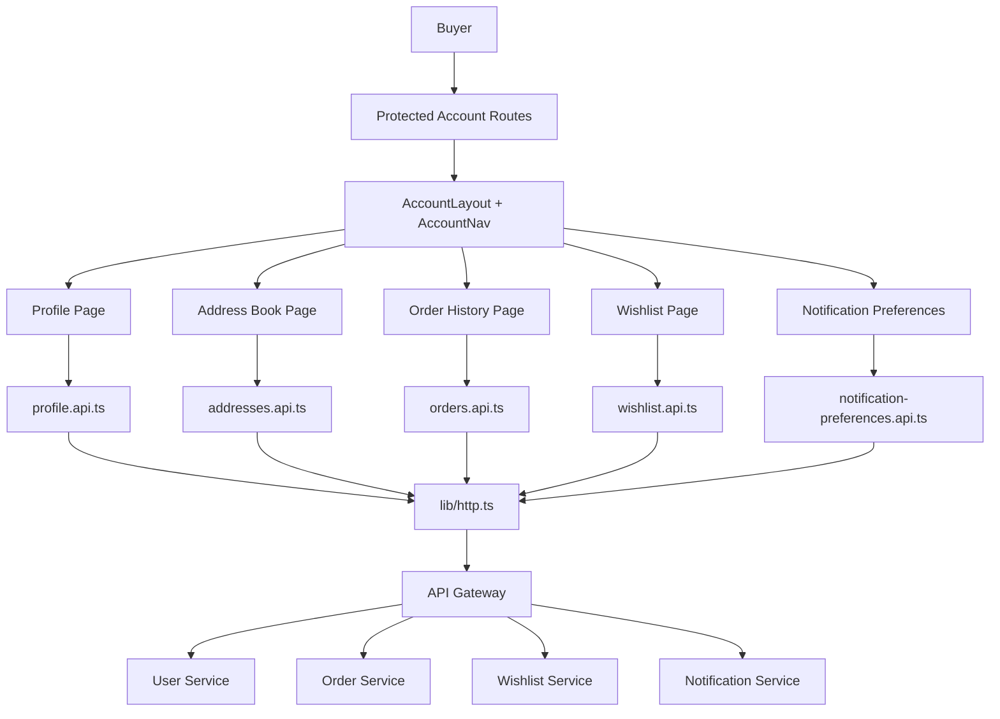
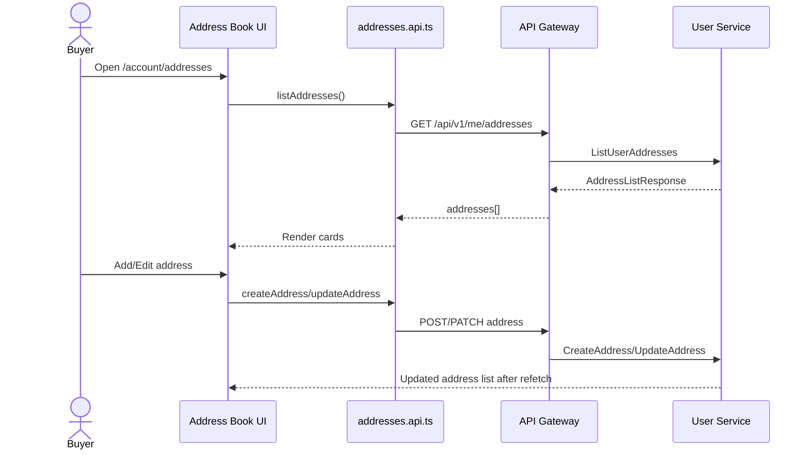
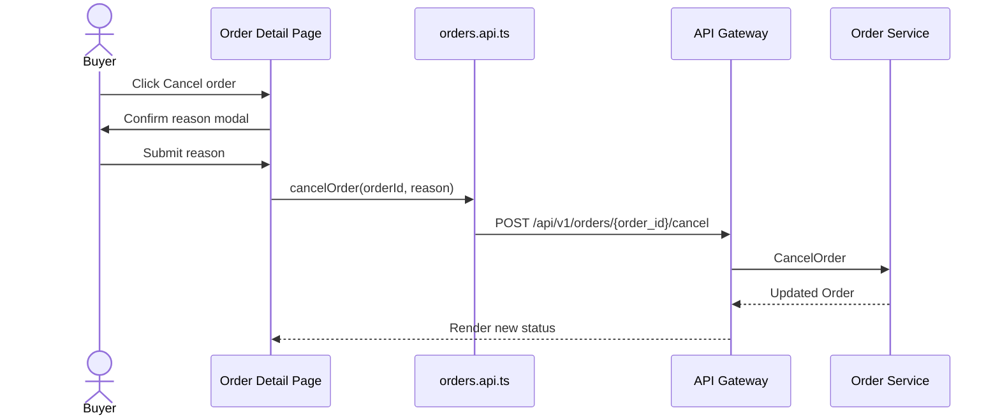
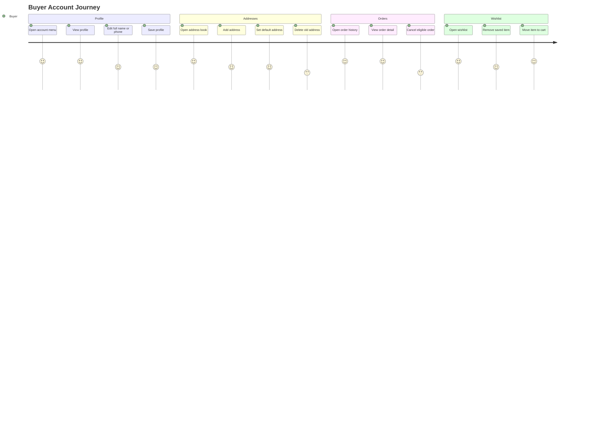

# 👤 User App Frontend - Task 6: Profile Module


## 📌 Task Summary

| Field | Detail |
|---|---|
| Task Name | Profile module |
| Source | `docs/01-micro-tasks.md` → `User App Frontend` → Task 6 |
| Priority | `P1` |
| Dependency | User/Order/Wishlist |
| Main Goal | Profile, addresses, orders, aur wishlist pages banana |
| Output Type | Documentation-only implementation guide |
| Not Included | React Query/Zustand global state, gRPC-Web client, seller/admin order screens, refunds, backend implementation |

> **Simple Hinglish goal:** Is task me buyer ka account area complete hota hai. User apni profile details dekh/update karega, address book manage karega, order history/detail dekhega, allowed orders cancel karega, wishlist items manage karega, aur wishlist item ko cart me move kar sakega. Backend source of truth rahega; frontend sirf clean, protected, typed, user-friendly UI provide karega.

---

## ✅ Final Output Created

```text
TaskImplementation/
└── User App Frontend/
    ├── task1.md
    ├── task2.md
    ├── task3.md
    ├── task4.md
    ├── task5.md
    └── task6.md
```

### Why this structure?

- `TaskImplementation/` project ke task-wise implementation guides ka central folder hai.
- `User App Frontend/` buyer/user-facing React app ke implementation guides ko group karta hai.
- `task6.md` sirf **User App Frontend - Task 6: Profile module** ka complete step-by-step guide hai.

> 🟡 **Scope note:** Current request ke hisaab se sirf required folder structure aur `task6.md` create kiya gaya. Actual `frontend/user-app` source files yahan create nahi kiye gaye.

---

## 🧭 Source Docs Studied

| Document | Kya use kiya gaya |
|---|---|
| `docs/01-micro-tasks.md` | Task 6 ka exact scope: profile, addresses, orders, wishlist pages |
| `docs/10-frontend-implementation.md` | Frontend stack, profile pages, API layer, protected routes |
| `docs/03-folder-structure.md` | User app feature folders: `profile/`, `orders/`, `wishlist/` |
| `docs/04-microservice-design.md` | User, Order, Wishlist, Notification service REST responsibilities |
| `docs/05-database-design.md` | User addresses, orders, order status history, immutable order snapshots |
| `docs/06-auth-security.md` | Buyer permissions like `profile:read:self` and `order:read:self` |
| `api/master-api.json` | API endpoints and schemas for profile/address/order/wishlist/preferences |
| `TaskImplementation/User App Frontend/task1.md` | React TS + Tailwind foundation boundary |
| `TaskImplementation/User App Frontend/task2.md` | App shell, account menu, route constants |
| `TaskImplementation/User App Frontend/task3.md` | Auth forms, validation libraries, protected-route direction |
| `TaskImplementation/User App Frontend/task4.md` | Product card/detail wishlist entry point boundary |
| `TaskImplementation/User App Frontend/task5.md` | Checkout address read-only boundary and order result flow |

---

## 🎯 Task Boundary

### ✅ Included in Task 6

- Protected account/profile routes
- Profile details page:
  - `GET /api/v1/me`
  - `PATCH /api/v1/me`
- Address book page:
  - list addresses
  - create address
  - edit address
  - delete address
  - default address badge/selection
- Orders page:
  - order history list
  - order detail page
  - status badge
  - item summary
  - payment/fulfillment friendly display
  - cancel action where backend allows it
- Wishlist page:
  - list wishlist items
  - remove item
  - move item to cart
  - empty/loading/error states
- Product page/card wishlist toggle integration point
- Optional profile settings area for notification preferences if API is available:
  - `GET /api/v1/me/notification-preferences`
  - `PATCH /api/v1/me/notification-preferences`
- Beginner-friendly form validation with `react-hook-form` + `zod`
- Feature-local API hooks using `useEffect`/`useState` until Task 7

### ❌ Not Included in Task 6

| Feature | Kyun nahi? |
|---|---|
| React Query server cache | Ye `User App Frontend - Task 7: State management` ka scope hai |
| Zustand session/UI store | Task 7 me global state strategy finalize hogi |
| gRPC-Web generated client | Task 8 ka scope hai |
| Seller order management | Seller Dashboard ka task hai |
| Admin refund/dispute operations | Superadmin/Admin panel scope hai |
| Checkout/payment intent creation | Task 5 me covered hai |
| Backend API implementation | Current task sirf User App frontend guide hai |
| Direct DB access | Browser kabhi service DB ko direct read/write nahi karega |

> 🟢 **Rule:** Task 6 user account UX banata hai. Profile, address, order, wishlist data ka final source of truth backend services hi rahenge.

---

## 🧱 Target Implementation Folder Structure

Actual frontend implementation karte time recommended structure:

```text
frontend/
└── user-app/
    └── src/
        ├── components/
        │   └── ui/
        │       ├── alert.tsx
        │       ├── badge.tsx
        │       ├── button.tsx
        │       ├── confirm-dialog.tsx
        │       ├── empty-state.tsx
        │       ├── input.tsx
        │       ├── modal.tsx
        │       ├── skeleton.tsx
        │       └── switch.tsx
        ├── features/
        │   ├── account/
        │   │   ├── components/
        │   │   │   ├── account-layout.tsx
        │   │   │   └── account-nav.tsx
        │   │   └── pages/
        │   │       └── account-overview-page.tsx
        │   ├── profile/
        │   │   ├── api/
        │   │   │   ├── notification-preferences.api.ts
        │   │   │   └── profile.api.ts
        │   │   ├── components/
        │   │   │   ├── notification-preferences-form.tsx
        │   │   │   └── profile-form.tsx
        │   │   ├── pages/
        │   │   │   ├── notification-preferences-page.tsx
        │   │   │   └── profile-page.tsx
        │   │   ├── profile-schema.ts
        │   │   └── types.ts
        │   ├── addresses/
        │   │   ├── api/
        │   │   │   └── addresses.api.ts
        │   │   ├── components/
        │   │   │   ├── address-card.tsx
        │   │   │   ├── address-form.tsx
        │   │   │   └── address-list.tsx
        │   │   ├── pages/
        │   │   │   └── addresses-page.tsx
        │   │   ├── address-schema.ts
        │   │   └── types.ts
        │   ├── orders/
        │   │   ├── api/
        │   │   │   └── orders.api.ts
        │   │   ├── components/
        │   │   │   ├── cancel-order-dialog.tsx
        │   │   │   ├── order-card.tsx
        │   │   │   ├── order-item-list.tsx
        │   │   │   ├── order-status-badge.tsx
        │   │   │   └── order-timeline.tsx
        │   │   ├── pages/
        │   │   │   ├── order-detail-page.tsx
        │   │   │   └── order-list-page.tsx
        │   │   ├── order-rules.ts
        │   │   └── types.ts
        │   └── wishlist/
        │       ├── api/
        │       │   └── wishlist.api.ts
        │       ├── components/
        │       │   ├── wishlist-button.tsx
        │       │   ├── wishlist-grid.tsx
        │       │   └── wishlist-item-card.tsx
        │       ├── pages/
        │       │   └── wishlist-page.tsx
        │       └── types.ts
        ├── lib/
        │   ├── format-money.ts
        │   └── http.ts
        └── routes/
            ├── index.tsx
            └── route-paths.ts
```

### Folder responsibility

| Path | Responsibility |
|---|---|
| `features/account/` | Account area layout, tabs/sidebar, account overview |
| `features/profile/` | Profile details and notification preferences screens |
| `features/addresses/` | Address book CRUD screens and forms |
| `features/orders/` | Order history, detail, timeline, cancel action |
| `features/wishlist/` | Wishlist list, remove, move-to-cart, product card heart button |
| `lib/http.ts` | Authenticated API Gateway calls with normalized errors |
| `lib/format-money.ts` | Minor-unit money display helper |
| `routes/route-paths.ts` | Account route constants |

---

## 🧩 Profile Module Architecture



### Data flow in simple words

1. User `/account/profile`, `/account/addresses`, `/account/orders`, ya `/wishlist` route open karta hai.
2. `RequireAuth` guard check karta hai ki user logged in hai.
3. Page apne feature API helper ko call karta hai.
4. `lib/http.ts` API Gateway ko request bhejta hai with auth token.
5. Gateway correct backend service ko call karta hai.
6. UI loading, success, empty, and error states show karta hai.

---

## 🔌 API Contract Summary

| UI Area | Method | Endpoint | Response |
|---|---:|---|---|
| Profile view | `GET` | `/api/v1/me` | `UserProfile` |
| Profile update | `PATCH` | `/api/v1/me` | `UserProfile` |
| Address list | `GET` | `/api/v1/me/addresses` | `AddressListResponse` |
| Address create | `POST` | `/api/v1/me/addresses` | `Address` |
| Address update | `PATCH` | `/api/v1/me/addresses/{address_id}` | `Address` |
| Address delete | `DELETE` | `/api/v1/me/addresses/{address_id}` | `SuccessResponse` |
| Order list | `GET` | `/api/v1/orders` | `OrderListResponse` |
| Order detail | `GET` | `/api/v1/orders/{order_id}` | `Order` |
| Order cancel | `POST` | `/api/v1/orders/{order_id}/cancel` | `Order` |
| Wishlist get | `GET` | `/api/v1/wishlist` | `Wishlist` |
| Wishlist add | `POST` | `/api/v1/wishlist/items` | `Wishlist` |
| Wishlist remove | `DELETE` | `/api/v1/wishlist/items/{product_id}` | `Wishlist` |
| Wishlist move to cart | `POST` | `/api/v1/wishlist/items/{product_id}/move-to-cart` | `Cart` |
| Preferences get | `GET` | `/api/v1/me/notification-preferences` | `NotificationPreference` |
| Preferences update | `PATCH` | `/api/v1/me/notification-preferences` | `NotificationPreference` |

> 🟡 **Preferences note:** `docs/10-frontend-implementation.md` profile module me notification preferences page mention karta hai. Agar current sprint strictly User/Order/Wishlist dependency tak limited ho, to preferences route ko feature flag ke peeche rakho ya next small follow-up me enable karo.

---

## 📦 External Libraries and Tools

| Library/Tool | Type | Why used | Install |
|---|---|---|---|
| React + TypeScript | Core app stack | Typed component-based frontend banane ke liye | Task 1 foundation |
| Vite | Build tool | Fast dev server and production build ke liye | Task 1 foundation |
| Tailwind CSS | Styling | Responsive utility-first UI quickly build karne ke liye | Task 1 foundation |
| `react-router-dom` | Routing | Account/profile/orders/wishlist routes ke liye | `pnpm --filter user-app add react-router-dom` |
| `lucide-react` | Icons | User, map pin, package, heart, edit, trash icons ke liye | `pnpm --filter user-app add lucide-react` |
| `react-hook-form` | Form state | Profile, address, cancel reason, preferences forms efficiently manage karne ke liye | `pnpm --filter user-app add react-hook-form` |
| `zod` | Validation | Profile/address form rules centralize karne ke liye | `pnpm --filter user-app add zod` |
| `@hookform/resolvers` | Form adapter | Zod schemas ko React Hook Form se connect karne ke liye | `pnpm --filter user-app add @hookform/resolvers` |
| Vitest + Testing Library | Dev tools | Component/helper/API mock tests ke liye | `pnpm --filter user-app add -D vitest jsdom @testing-library/react @testing-library/user-event msw` |

### Install commands

```bash
cd frontend
pnpm --filter user-app add react-router-dom lucide-react
pnpm --filter user-app add react-hook-form zod @hookform/resolvers
pnpm --filter user-app add -D vitest jsdom @testing-library/react @testing-library/user-event msw
```

### Why React Query/Zustand nahi?

`docs/10-frontend-implementation.md` long-term me React Query and Zustand recommend karta hai, but `docs/01-micro-tasks.md` me **Task 7** specifically state management ke liye hai:

> Zustand for UI/session state, React Query for server cache.

Isliye Task 6 me feature-local `useState`, `useEffect`, and typed API helpers use karna enough hai. Task 7 me same API functions ko React Query hooks me wrap karna easy rahega.

---

## 🚦 Step-by-Step Implementation

## Step 1: Routes and Account Layout Define Karo

Task 2 me app shell and account menu base already define hua. Task 6 me account routes ko proper protected area me organize karo.

### Route constants

```ts
export const routePaths = {
  home: "/",
  cart: "/cart",
  login: "/login",
  wishlist: "/wishlist",
  account: "/account",
  profile: "/account/profile",
  addresses: "/account/addresses",
  orders: "/account/orders",
  orderDetail: "/account/orders/:orderId",
  notificationPreferences: "/account/notifications",
} as const;

export const buildOrderDetailPath = (orderId: string) =>
  `/account/orders/${orderId}`;
```

### Account navigation

```tsx
import { Heart, MapPin, Package, UserRound } from "lucide-react";
import { NavLink } from "react-router-dom";
import { routePaths } from "../../../routes/route-paths";

const accountLinks = [
  { label: "Profile", href: routePaths.profile, icon: UserRound },
  { label: "Addresses", href: routePaths.addresses, icon: MapPin },
  { label: "Orders", href: routePaths.orders, icon: Package },
  { label: "Wishlist", href: routePaths.wishlist, icon: Heart },
];

export function AccountNav() {
  return (
    <nav aria-label="Account navigation" className="grid gap-2">
      {accountLinks.map((link) => {
        const Icon = link.icon;

        return (
          <NavLink
            key={link.href}
            to={link.href}
            className={({ isActive }) =>
              [
                "flex items-center gap-2 rounded-md px-3 py-2 text-sm font-medium",
                isActive
                  ? "bg-slate-950 text-white"
                  : "text-slate-700 hover:bg-slate-100",
              ].join(" ")
            }
          >
            <Icon aria-hidden="true" className="h-4 w-4" />
            {link.label}
          </NavLink>
        );
      })}
    </nav>
  );
}
```

### Explanation

- Account pages ko ek shared layout me rakhne se sidebar/tabs repeat nahi hote.
- `NavLink` active route ko highlight karta hai.
- Mobile par same links top horizontal tabs ban sakte hain.
- `RequireAuth` wrapper account routes ke bahar lagao, taaki unauthenticated user login pe redirect ho.

---

## Step 2: Shared Types Define Karo

API contract se TypeScript types banao. Ye types frontend ko predictable data shape dete hain.

```ts
export type Money = {
  amount: number;
  currency: string;
};

export type UserProfile = {
  user_id: string;
  email: string;
  phone?: string;
  full_name: string;
  status?: string;
  roles?: string[];
  avatar_url?: string;
};

export type Address = {
  address_id: string;
  name: string;
  phone?: string;
  line1: string;
  line2?: string;
  city: string;
  state: string;
  postal_code: string;
  country: string;
  is_default?: boolean;
};

export type Order = {
  order_id: string;
  user_id: string;
  status: string;
  items: Array<{
    product_id?: string;
    variant_id?: string;
    title?: string;
    quantity?: number;
    price?: Money;
    image_url?: string;
  }>;
  total: Money;
  created_at: string;
};

export type Wishlist = {
  wishlist_id: string;
  user_id: string;
  items: Array<{
    product_id: string;
    variant_id?: string;
    title?: string;
    image_url?: string;
    price?: Money;
    availability?: "in_stock" | "out_of_stock" | "deleted";
  }>;
};
```

### Explanation

- API schemas me kuch nested fields `object` hain, isliye frontend defensive optional fields rakhega.
- Order item snapshot immutable hota hai, so product title/image price order ke time ka show karo.
- Money `minor unit` me aata hai, jaise paise/cents. Display helper required hai.

```ts
export function formatMoney(money?: Money) {
  if (!money) return "N/A";

  return new Intl.NumberFormat("en-IN", {
    style: "currency",
    currency: money.currency,
  }).format(money.amount / 100);
}
```

---

## Step 3: API Helpers Banao

Har feature apna typed API file rakhega. Isse components clean rahenge.

### Profile API

```ts
import { http } from "../../../lib/http";
import type { UserProfile } from "../types";

export type UpdateUserProfileInput = {
  full_name?: string;
  phone?: string;
  avatar_url?: string;
};

export function getMyProfile() {
  return http<UserProfile>("/api/v1/me");
}

export function updateMyProfile(input: UpdateUserProfileInput) {
  return http<UserProfile>("/api/v1/me", {
    method: "PATCH",
    body: JSON.stringify(input),
  });
}
```

### Address API

```ts
import { http } from "../../../lib/http";
import type { Address } from "../types";

export type AddressInput = Omit<Address, "address_id">;

export function listAddresses() {
  return http<{ addresses: Address[] }>("/api/v1/me/addresses");
}

export function createAddress(input: AddressInput) {
  return http<Address>("/api/v1/me/addresses", {
    method: "POST",
    body: JSON.stringify(input),
  });
}

export function updateAddress(addressId: string, input: AddressInput) {
  return http<Address>(`/api/v1/me/addresses/${addressId}`, {
    method: "PATCH",
    body: JSON.stringify(input),
  });
}

export function deleteAddress(addressId: string) {
  return http<{ success: boolean }>(`/api/v1/me/addresses/${addressId}`, {
    method: "DELETE",
  });
}
```

### Orders API

```ts
import { http } from "../../../lib/http";
import type { Order } from "../types";

export function listOrders(params: { page?: number; page_size?: number } = {}) {
  const search = new URLSearchParams();

  if (params.page) search.set("page", String(params.page));
  if (params.page_size) search.set("page_size", String(params.page_size));

  return http<{ orders: Order[]; total: number }>(
    `/api/v1/orders?${search.toString()}`,
  );
}

export function getOrder(orderId: string) {
  return http<Order>(`/api/v1/orders/${orderId}`);
}

export function cancelOrder(orderId: string, reason: string) {
  return http<Order>(`/api/v1/orders/${orderId}/cancel`, {
    method: "POST",
    body: JSON.stringify({ reason }),
  });
}
```

### Wishlist API

```ts
import { http } from "../../../lib/http";
import type { Wishlist } from "../types";

export function getWishlist() {
  return http<Wishlist>("/api/v1/wishlist");
}

export function addWishlistItem(input: {
  product_id: string;
  variant_id?: string;
}) {
  return http<Wishlist>("/api/v1/wishlist/items", {
    method: "POST",
    body: JSON.stringify(input),
  });
}

export function removeWishlistItem(productId: string) {
  return http<Wishlist>(`/api/v1/wishlist/items/${productId}`, {
    method: "DELETE",
  });
}

export function moveWishlistItemToCart(productId: string) {
  return http("/api/v1/wishlist/items/" + productId + "/move-to-cart", {
    method: "POST",
  });
}
```

### Explanation

- Components direct `fetch` nahi karenge.
- API helpers route, method, and payload ko ek jagah centralize karte hain.
- Task 7 me in helpers ko React Query hooks me reuse kar sakte ho.

---

## Step 4: Profile Details Page Build Karo

Profile page me user ki identity details show hongi. Email read-only rahega, kyunki email verification/auth ownership backend se tied hoti hai.

### Validation schema

```ts
import { z } from "zod";

export const profileSchema = z.object({
  full_name: z.string().trim().min(2, "Full name minimum 2 characters hona chahiye"),
  phone: z.string().trim().optional(),
  avatar_url: z.string().url("Valid avatar URL enter karo").optional().or(z.literal("")),
});

export type ProfileFormValues = z.infer<typeof profileSchema>;
```

### Profile form behavior

| State | UI behavior |
|---|---|
| Loading | Skeleton rows show karo |
| Success | Form prefill karo |
| Editing | Save and cancel buttons show karo |
| Saving | Submit button disabled + spinner |
| Error | Error alert with retry |
| Saved | Success toast/banner |

### Example form

```tsx
import { zodResolver } from "@hookform/resolvers/zod";
import { useForm } from "react-hook-form";
import { profileSchema, type ProfileFormValues } from "../profile-schema";
import type { UserProfile } from "../types";

type ProfileFormProps = {
  profile: UserProfile;
  onSubmit: (values: ProfileFormValues) => Promise<void>;
};

export function ProfileForm({ profile, onSubmit }: ProfileFormProps) {
  const form = useForm<ProfileFormValues>({
    resolver: zodResolver(profileSchema),
    defaultValues: {
      full_name: profile.full_name,
      phone: profile.phone ?? "",
      avatar_url: profile.avatar_url ?? "",
    },
  });

  return (
    <form className="grid gap-4" onSubmit={form.handleSubmit(onSubmit)}>
      <label className="grid gap-1">
        <span className="text-sm font-medium text-slate-700">Email</span>
        <input
          readOnly
          value={profile.email}
          className="rounded-md border bg-slate-50 px-3 py-2 text-slate-500"
        />
      </label>

      <label className="grid gap-1">
        <span className="text-sm font-medium text-slate-700">Full name</span>
        <input
          {...form.register("full_name")}
          className="rounded-md border px-3 py-2"
        />
        {form.formState.errors.full_name ? (
          <span className="text-sm text-red-600">
            {form.formState.errors.full_name.message}
          </span>
        ) : null}
      </label>

      <label className="grid gap-1">
        <span className="text-sm font-medium text-slate-700">Phone</span>
        <input {...form.register("phone")} className="rounded-md border px-3 py-2" />
      </label>

      <button
        type="submit"
        disabled={form.formState.isSubmitting}
        className="rounded-md bg-slate-950 px-4 py-2 text-white disabled:opacity-60"
      >
        {form.formState.isSubmitting ? "Saving..." : "Save profile"}
      </button>
    </form>
  );
}
```

### Explanation

- `email` read-only hai.
- `full_name`, `phone`, `avatar_url` update allowed hai.
- Frontend validation UX improve karta hai, but backend final validation authority rahega.
- Error message field ke paas show karo, page top me generic error alert.

---

## Step 5: Address Book CRUD Build Karo

Address book Task 6 ka important part hai, kyunki Task 5 checkout me saved address select already use hota hai. Ab user addresses create/edit/delete kar sakta hai.

### Address flow



### Address schema

```ts
import { z } from "zod";

export const addressSchema = z.object({
  name: z.string().trim().min(2, "Name required hai"),
  phone: z.string().trim().min(8, "Valid phone enter karo").optional().or(z.literal("")),
  line1: z.string().trim().min(5, "Address line 1 required hai"),
  line2: z.string().trim().optional(),
  city: z.string().trim().min(2, "City required hai"),
  state: z.string().trim().min(2, "State required hai"),
  postal_code: z.string().trim().min(4, "Postal code required hai"),
  country: z.string().trim().min(2, "Country required hai"),
  is_default: z.boolean().default(false),
});

export type AddressFormValues = z.infer<typeof addressSchema>;
```

### Address card

```tsx
import { Edit3, Star, Trash2 } from "lucide-react";
import type { Address } from "../types";

type AddressCardProps = {
  address: Address;
  onEdit: (address: Address) => void;
  onDelete: (address: Address) => void;
};

export function AddressCard({ address, onEdit, onDelete }: AddressCardProps) {
  return (
    <article className="rounded-lg border border-slate-200 p-4">
      <div className="flex items-start justify-between gap-3">
        <div>
          <div className="flex items-center gap-2">
            <h3 className="font-semibold text-slate-950">{address.name}</h3>
            {address.is_default ? (
              <span className="inline-flex items-center gap-1 rounded-full bg-emerald-50 px-2 py-1 text-xs font-medium text-emerald-700">
                <Star className="h-3 w-3" aria-hidden="true" />
                Default
              </span>
            ) : null}
          </div>
          <p className="mt-2 text-sm text-slate-600">
            {address.line1}
            {address.line2 ? `, ${address.line2}` : ""}
            <br />
            {address.city}, {address.state} {address.postal_code}
            <br />
            {address.country}
          </p>
          {address.phone ? (
            <p className="mt-2 text-sm text-slate-500">Phone: {address.phone}</p>
          ) : null}
        </div>

        <div className="flex gap-1">
          <button type="button" aria-label="Edit address" onClick={() => onEdit(address)}>
            <Edit3 className="h-4 w-4" />
          </button>
          <button type="button" aria-label="Delete address" onClick={() => onDelete(address)}>
            <Trash2 className="h-4 w-4" />
          </button>
        </div>
      </div>
    </article>
  );
}
```

### Address UX rules

| Rule | Frontend behavior |
|---|---|
| No addresses | Empty state with `Add address` button |
| Address limit reached | Disable add button if backend says max limit reached |
| Delete clicked | Confirmation dialog show karo |
| Default address | Badge show karo; backend final default logic handle karega |
| Save failed | Form values preserve karo, error show karo |
| Checkout dependency | Checkout page same address APIs use kar sakta hai |

---

## Step 6: Order History Page Build Karo

Order list user ko recent and past orders dikhata hai. Backend pagination supported hai, so frontend page/page_size params bhej sakta hai.

### Order list flow

```mermaid
flowchart LR
    Page[/account/orders] --> Fetch[listOrders]
    Fetch --> Gateway[GET /api/v1/orders]
    Gateway --> Service[Order Service]
    Service --> List[orders + total]
    List --> Cards[Order Cards]
    Cards --> Detail[/account/orders/:orderId]
```

### Order status badge

```tsx
const statusStyles: Record<string, string> = {
  created: "bg-slate-100 text-slate-700",
  pending_payment: "bg-amber-50 text-amber-700",
  paid: "bg-emerald-50 text-emerald-700",
  packed: "bg-blue-50 text-blue-700",
  shipped: "bg-indigo-50 text-indigo-700",
  delivered: "bg-emerald-100 text-emerald-800",
  cancelled: "bg-red-50 text-red-700",
  refunded: "bg-purple-50 text-purple-700",
};

export function OrderStatusBadge({ status }: { status: string }) {
  return (
    <span
      className={[
        "rounded-full px-2 py-1 text-xs font-semibold uppercase tracking-wide",
        statusStyles[status] ?? "bg-slate-100 text-slate-700",
      ].join(" ")}
    >
      {status.replaceAll("_", " ")}
    </span>
  );
}
```

### Order card

```tsx
import { Link } from "react-router-dom";
import { buildOrderDetailPath } from "../../../routes/route-paths";
import { formatMoney } from "../../../lib/format-money";
import type { Order } from "../types";
import { OrderStatusBadge } from "./order-status-badge";

export function OrderCard({ order }: { order: Order }) {
  return (
    <article className="rounded-lg border border-slate-200 p-4">
      <div className="flex flex-wrap items-start justify-between gap-3">
        <div>
          <p className="text-sm text-slate-500">Order #{order.order_id}</p>
          <h3 className="mt-1 font-semibold text-slate-950">
            {order.items.length} item{order.items.length === 1 ? "" : "s"}
          </h3>
          <p className="mt-1 text-sm text-slate-500">
            Placed on {new Date(order.created_at).toLocaleDateString("en-IN")}
          </p>
        </div>

        <div className="text-right">
          <OrderStatusBadge status={order.status} />
          <p className="mt-2 font-semibold">{formatMoney(order.total)}</p>
        </div>
      </div>

      <Link
        to={buildOrderDetailPath(order.order_id)}
        className="mt-4 inline-flex text-sm font-semibold text-slate-950 underline"
      >
        View details
      </Link>
    </article>
  );
}
```

### Explanation

- Order card summary fast scan ke liye hai.
- Full details separate page me rakho, list ko heavy mat banao.
- Status display frontend ka UX hai; allowed transitions backend decide karega.

---

## Step 7: Order Detail and Cancel Flow Build Karo

Order detail page me order items, total, status, address snapshot, and timeline show ho sakte hain. API schema currently minimal hai, isliye optional fields gracefully handle karo.

### Cancel rule helper

```ts
const cancellableStatuses = new Set([
  "created",
  "pending_payment",
  "paid",
  "packed",
]);

export function canCancelOrder(status: string) {
  return cancellableStatuses.has(status);
}
```

### Cancel flow



### Cancel dialog schema

```ts
import { z } from "zod";

export const cancelOrderSchema = z.object({
  reason: z.string().trim().min(5, "Cancel reason minimum 5 characters hona chahiye"),
});
```

### UX rules

| Scenario | UI behavior |
|---|---|
| Delivered order | Cancel button hide/disable karo |
| Already cancelled | Status badge show karo, action hide |
| Backend rejects cancel | Error alert show karo; local status change mat karo |
| Cancel success | Refetch or replace order from response |
| Refund needed | Refund details admin/payment flow me handled hoga, frontend note show kar sakta hai |

> 🟡 **Important:** Frontend `canCancelOrder` sirf UX hint hai. Backend final authority hai, kyunki payment/fulfillment state race conditions ho sakti hain.

---

## Step 8: Wishlist Page Build Karo

Wishlist user ke saved products dikhata hai. Task 4 product browsing me wishlist action intentionally postpone hua tha; Task 6 me heart button and wishlist page add honge.

### Wishlist flow

```mermaid
flowchart TD
    ProductCard[Product Card / Detail] --> Heart[Wishlist Button]
    Heart --> Add[POST /api/v1/wishlist/items]
    Heart --> Remove[DELETE /api/v1/wishlist/items/:productId]
    WishlistPage[/wishlist] --> List[GET /api/v1/wishlist]
    WishlistPage --> Move[Move to cart]
    Move --> MoveAPI[POST /api/v1/wishlist/items/:productId/move-to-cart]
    MoveAPI --> Cart[Cart Service]
```

### Wishlist item card

```tsx
import { ShoppingCart, Trash2 } from "lucide-react";
import { formatMoney } from "../../../lib/format-money";
import type { Wishlist } from "../types";

type WishlistItem = Wishlist["items"][number];

type WishlistItemCardProps = {
  item: WishlistItem;
  onRemove: (productId: string) => void;
  onMoveToCart: (productId: string) => void;
  busy?: boolean;
};

export function WishlistItemCard({
  item,
  onRemove,
  onMoveToCart,
  busy,
}: WishlistItemCardProps) {
  const isUnavailable =
    item.availability === "out_of_stock" || item.availability === "deleted";

  return (
    <article className="rounded-lg border border-slate-200 p-4">
      <div className="aspect-square rounded-md bg-slate-100">
        {item.image_url ? (
          
        ) : null}
      </div>

      <h3 className="mt-3 line-clamp-2 font-semibold text-slate-950">
        {item.title ?? "Saved product"}
      </h3>
      <p className="mt-1 text-sm font-medium text-slate-700">
        {formatMoney(item.price)}
      </p>

      {isUnavailable ? (
        <p className="mt-2 text-sm text-red-600">Currently unavailable</p>
      ) : null}

      <div className="mt-4 flex gap-2">
        <button
          type="button"
          disabled={busy || isUnavailable}
          onClick={() => onMoveToCart(item.product_id)}
          className="inline-flex flex-1 items-center justify-center gap-2 rounded-md bg-slate-950 px-3 py-2 text-sm font-semibold text-white disabled:opacity-60"
        >
          <ShoppingCart className="h-4 w-4" />
          Move to cart
        </button>
        <button
          type="button"
          disabled={busy}
          aria-label="Remove from wishlist"
          onClick={() => onRemove(item.product_id)}
          className="rounded-md border px-3 py-2"
        >
          <Trash2 className="h-4 w-4" />
        </button>
      </div>
    </article>
  );
}
```

### Wishlist UX rules

| Rule | Frontend behavior |
|---|---|
| Empty wishlist | Friendly empty state with `Browse products` CTA |
| Duplicate add | Backend blocks duplicate; frontend can show already saved state |
| Move to cart success | Remove item from wishlist view or refetch wishlist |
| Product unavailable | Disable move-to-cart |
| Remove failed | Keep item visible and show error |
| Guest user clicks heart | Redirect to login with return URL |

---

## Step 9: Notification Preferences Page Add Karo

This sub-page profile module ka optional settings part hai. API contract already available hai, and docs profile pages me preferences mention karta hai.

### Types and API

```ts
export type NotificationPreference = {
  email_enabled?: boolean;
  sms_enabled?: boolean;
  push_enabled?: boolean;
  marketing_enabled?: boolean;
};

export function getNotificationPreferences() {
  return http<NotificationPreference>("/api/v1/me/notification-preferences");
}

export function updateNotificationPreferences(input: NotificationPreference) {
  return http<NotificationPreference>("/api/v1/me/notification-preferences", {
    method: "PATCH",
    body: JSON.stringify(input),
  });
}
```

### UX rules

| Preference | Meaning |
|---|---|
| `email_enabled` | Order/payment/account emails receive karna |
| `sms_enabled` | Important SMS alerts receive karna |
| `push_enabled` | Browser/app push alerts receive karna |
| `marketing_enabled` | Offers and price drop promotional notifications |

> 🟢 **User trust rule:** Transactional order/payment updates ko marketing toggle ke saath confuse mat karo. Labels clear rakho.

---

## Step 10: Page-Level Loading, Empty, Error States

Profile module me data personal hai, so UI ko stable and predictable feel hona chahiye.

| Page | Loading | Empty | Error |
|---|---|---|---|
| Profile | Form skeleton | Not applicable | Retry profile load |
| Addresses | Address card skeletons | Add first address CTA | Retry address list |
| Orders | Order card skeletons | No orders yet CTA to home | Retry order list |
| Order detail | Detail skeleton | Invalid order id message | Retry or back to orders |
| Wishlist | Product card skeletons | Browse products CTA | Retry wishlist |
| Preferences | Toggle skeleton | Defaults disabled/clear | Retry preferences |

### Reusable async state type

```ts
type AsyncState<T> =
  | { status: "idle" | "loading"; data?: T; error?: undefined }
  | { status: "success"; data: T; error?: undefined }
  | { status: "error"; data?: T; error: string };
```

### Simple local data hook pattern

```tsx
import { useEffect, useState } from "react";

export function useAsyncData<T>(load: () => Promise<T>) {
  const [state, setState] = useState<AsyncState<T>>({ status: "loading" });

  useEffect(() => {
    let active = true;

    load()
      .then((data) => {
        if (active) setState({ status: "success", data });
      })
      .catch((error: unknown) => {
        if (active) {
          setState({
            status: "error",
            error: error instanceof Error ? error.message : "Something went wrong",
          });
        }
      });

    return () => {
      active = false;
    };
  }, [load]);

  return state;
}
```

> 🟡 **Task 7 migration note:** Is pattern ko Task 7 me React Query ke `useQuery` and `useMutation` se replace karna easy hoga.

---

## Step 11: Protected Routes Wire Karo

Account module sirf logged-in buyer ke liye accessible hona chahiye.

```tsx
import { Navigate, Outlet } from "react-router-dom";
import { routePaths } from "./route-paths";

export function RequireAuth() {
  const accessToken = window.localStorage.getItem("access_token");

  if (!accessToken) {
    return <Navigate to={routePaths.login} replace />;
  }

  return <Outlet />;
}
```

### Route tree example

```tsx
import { createBrowserRouter } from "react-router-dom";
import { AccountLayout } from "../features/account/components/account-layout";
import { AddressesPage } from "../features/addresses/pages/addresses-page";
import { OrderDetailPage } from "../features/orders/pages/order-detail-page";
import { OrderListPage } from "../features/orders/pages/order-list-page";
import { ProfilePage } from "../features/profile/pages/profile-page";
import { WishlistPage } from "../features/wishlist/pages/wishlist-page";
import { RequireAuth } from "./require-auth";
import { routePaths } from "./route-paths";

export const router = createBrowserRouter([
  {
    element: <RequireAuth />,
    children: [
      {
        element: <AccountLayout />,
        children: [
          { path: routePaths.profile, element: <ProfilePage /> },
          { path: routePaths.addresses, element: <AddressesPage /> },
          { path: routePaths.orders, element: <OrderListPage /> },
          { path: routePaths.orderDetail, element: <OrderDetailPage /> },
        ],
      },
      { path: routePaths.wishlist, element: <WishlistPage /> },
    ],
  },
]);
```

### Explanation

- `RequireAuth` protected route parent hai.
- Account layout nested pages ko shared nav deta hai.
- Wishlist app shell me top-level route reh sakta hai, but auth protected rahega.
- Real auth store Task 7 me better centralize hoga; Task 6 me existing auth helper reuse karo.

---

## Step 12: Security and Privacy Rules Follow Karo

| Concern | Frontend solution |
|---|---|
| PII exposure | Profile/address pages protected rakho |
| Token leakage | Tokens UI logs me print mat karo |
| Unauthorized access | Missing/expired token pe login redirect |
| Order ownership | Frontend sirf own order route call kare; backend ownership verify kare |
| Address deletion | Confirm destructive action |
| Phone/email changes | Backend validation and verification source of truth |
| Error details | User-friendly error show karo, raw stack trace nahi |

> 🔐 **Security note:** Frontend guard UX ke liye hai. Real authorization API Gateway/Auth Service enforce karega.

---

## Step 13: Accessibility and Responsive UX

### Accessibility checklist

- Buttons ke `aria-label` meaningful hon.
- Icon-only buttons me tooltip/title ya hidden label ho.
- Form errors field ke paas render hon.
- Confirmation dialog focus trap kare.
- Status badges color ke saath text bhi show kare.
- Keyboard se account nav, modal, form submit usable ho.

### Responsive layout

| Screen | Layout |
|---|---|
| Mobile | Account nav horizontal scroll/tabs, cards single column |
| Tablet | Account nav top or left compact, cards two columns where useful |
| Desktop | Account sidebar + main content, order/address cards readable width |

---

## Step 14: Testing Strategy

### Unit tests

| Helper | Test cases |
|---|---|
| `formatMoney` | minor unit conversion, missing money fallback |
| `canCancelOrder` | cancellable and non-cancellable statuses |
| schemas | valid/invalid profile/address/cancel inputs |

### Component tests

| Component | What to test |
|---|---|
| `ProfileForm` | prefilled values, validation error, submit |
| `AddressCard` | default badge, edit/delete callbacks |
| `OrderStatusBadge` | readable status text |
| `WishlistItemCard` | unavailable disables move-to-cart |
| `CancelOrderDialog` | reason required, submit callback |

### API mock tests

Use MSW to mock:

- `GET /api/v1/me`
- `PATCH /api/v1/me`
- `GET /api/v1/me/addresses`
- `GET /api/v1/orders`
- `GET /api/v1/wishlist`
- `POST /api/v1/wishlist/items/{product_id}/move-to-cart`

### Verification commands

```bash
cd frontend
pnpm --filter user-app typecheck
pnpm --filter user-app lint
pnpm --filter user-app test
pnpm --filter user-app build
```

> 🟡 **If test script absent:** Task guide me test command mention hai for future setup. Agar `package.json` me `test` script nahi hai, pehle Vitest setup add karo ya only `typecheck`, `lint`, and `build` run karo.

---

## 🧪 Manual QA Checklist

| Check | Expected result |
|---|---|
| Logged-out user opens `/account/profile` | Login page redirect |
| Profile load succeeds | Form shows name/email/phone |
| Profile update succeeds | Updated profile visible |
| Profile update fails | Error alert, form data preserved |
| Address list empty | Add first address CTA visible |
| Address create/edit/delete | List refreshes correctly |
| Default address | Default badge visible |
| Orders empty | No orders empty state visible |
| Order list loaded | Order cards show id/status/date/total |
| Order detail loaded | Items and total visible |
| Cancel allowed order | Confirmation flow updates status |
| Cancel blocked order | Button hidden/disabled |
| Wishlist empty | Browse products CTA visible |
| Wishlist item remove | Item disappears after success |
| Move wishlist item to cart | Cart response handled and item removed/refetched |
| Mobile layout | No overlap, no clipped buttons |

---

## 🧠 Beginner-Friendly Build Explanation

### Profile page kaise built hai?

Profile page pehle `getMyProfile()` se current user ka data fetch karta hai. Data aane ke baad `ProfileForm` prefill hota hai. User save karta hai to `updateMyProfile()` call hota hai. Email read-only rakha hai because email auth identity se tied hota hai.

### Address book kaise built hai?

Address page `listAddresses()` call karta hai. Har address `AddressCard` me show hota hai. Add/Edit ke liye same `AddressForm` reuse hota hai. Create, update, delete ke baad list refetch hoti hai, so UI backend ke latest state ke saath sync rehta hai.

### Orders kaise built hain?

Order list API se paginated orders aate hain. Each order card status, date, items count, and total show karta hai. Detail route order id se `getOrder(orderId)` call karta hai. Cancel action status ke basis pe button show karta hai, but backend final decision leta hai.

### Wishlist kaise built hai?

Wishlist page `getWishlist()` se saved items fetch karta hai. Remove button `removeWishlistItem()` call karta hai. Move-to-cart button `moveWishlistItemToCart()` call karta hai, jo Wishlist Service se Cart Service flow trigger karta hai. Product card/detail page heart button same API helpers use karega.

### Preferences kaise built hain?

Preferences page simple toggles render karta hai. User save karta hai to `PATCH /api/v1/me/notification-preferences` call hota hai. Marketing preference ko transactional notifications se clearly separate label karo.

---

## 🧭 Full User Flow Diagram



---

## 🔁 Future Task 7 Migration Notes

Task 6 me feature-local state use hua. Task 7 me:

| Current Task 6 | Task 7 Upgrade |
|---|---|
| `useEffect` data fetch | `useQuery` |
| manual loading/error state | React Query status |
| manual refetch after mutation | query invalidation |
| auth token local helper | Zustand/session store integration |
| wishlist item count local | shared wishlist/cart derived state |

Example future hook:

```ts
export function useProfileQuery() {
  return useQuery({
    queryKey: ["profile", "me"],
    queryFn: getMyProfile,
  });
}
```

> 🟢 **Good news:** Agar Task 6 me API helpers clean rakhe, Task 7 migration mostly hook layer me hoga. Components ka major rewrite nahi chahiye.

---

## ✅ Completion Checklist

| Requirement | Status |
|---|---|
| `TaskImplementation/` folder exists | ✅ Done |
| `TaskImplementation/User App Frontend/` folder exists | ✅ Done |
| `task6.md` created | ✅ Done |
| Step-by-step implementation in Hinglish | ✅ Done |
| Clear explanation of each part | ✅ Done |
| External libraries/tools with why/install/use | ✅ Done |
| Clean implementation folder structure | ✅ Done |
| Code examples included | ✅ Done |
| Mermaid diagrams included | ✅ Done |
| Beginner-friendly formatting with badges/emojis | ✅ Done |
| Scope limited to User App Frontend Task 6 | ✅ Done |

---

## 🟢 Final Notes

User App Frontend Task 6 ke liye profile module ka guide ready hai:

- Profile details page
- Address book CRUD
- Order history and detail
- Order cancellation UX
- Wishlist list/remove/move-to-cart
- Optional notification preferences
- Protected account routing
- API helper structure
- Loading/empty/error/security/testing guidance

> ✅ **Task 6 complete:** Documentation-level implementation guide ready hai. Actual frontend source files, backend APIs, React Query/Zustand setup, and gRPC-Web clients intentionally create nahi kiye gaye, kyunki current requested output sirf required folder structure aur `task6.md` content hai.
