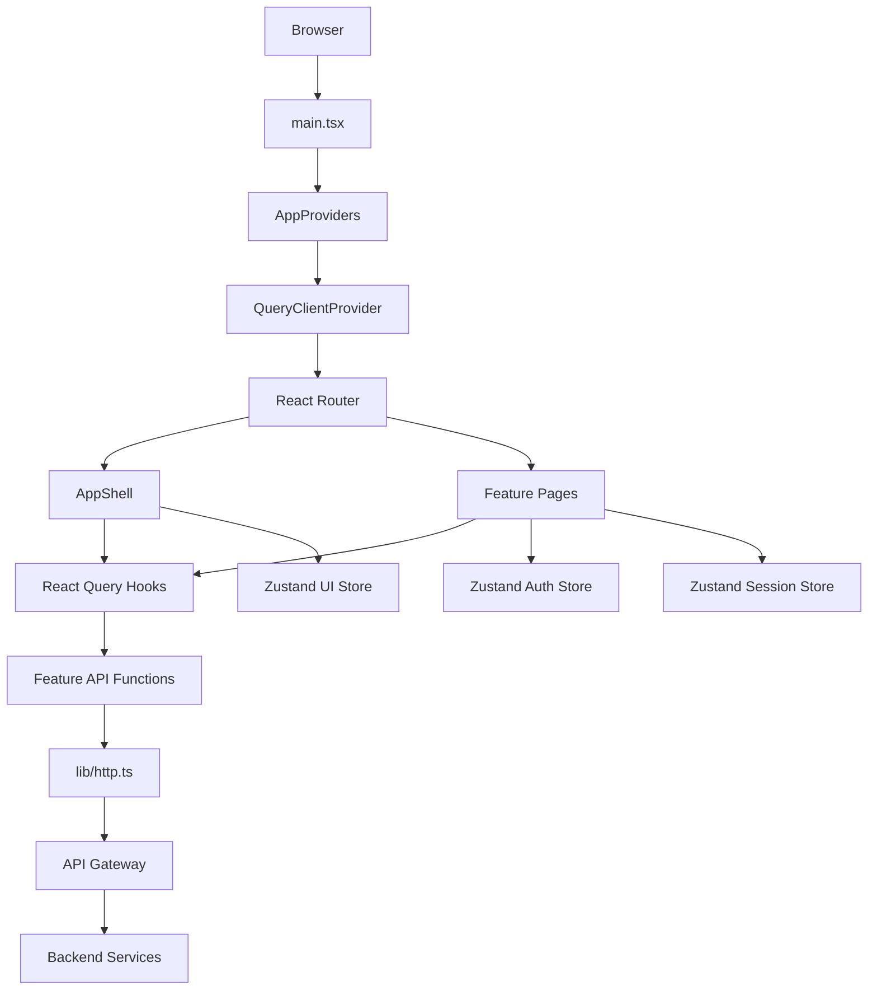
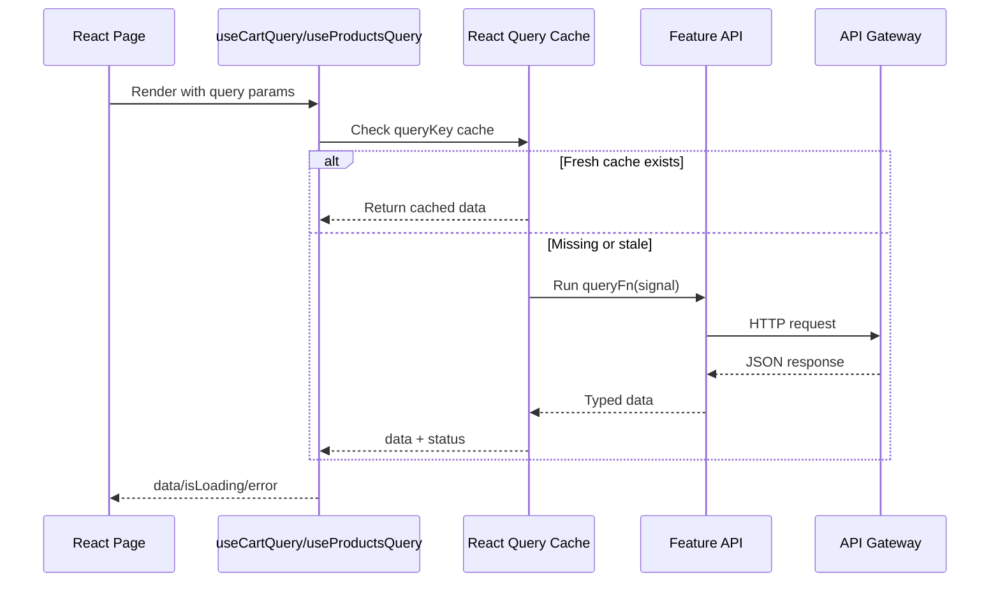
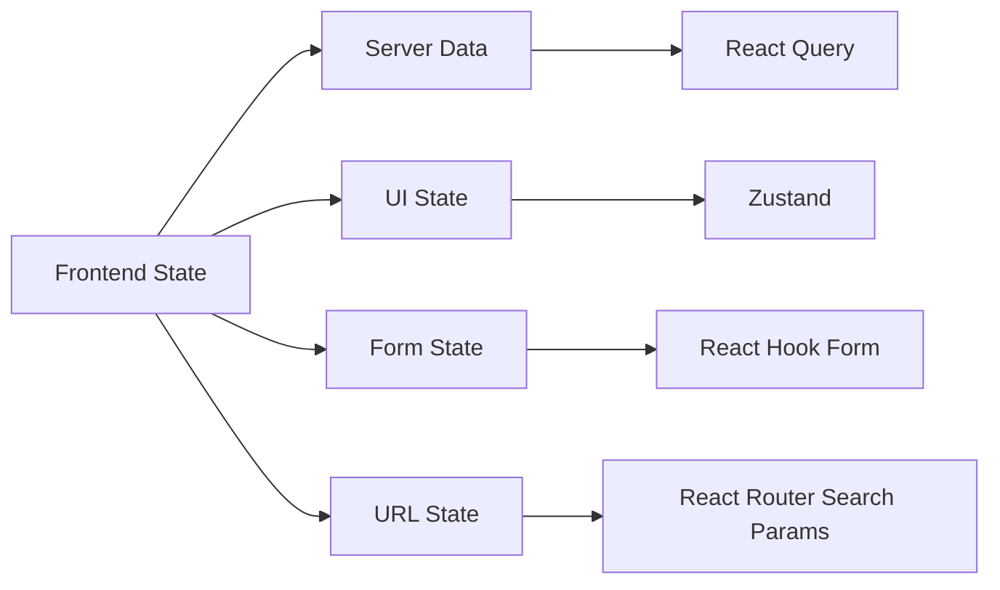

# 🧠 User App Frontend - Task 7: State Management


## 📌 Task Summary

| Field | Detail |
|---|---|
| Task Name | State management |
| Source | `docs/01-micro-tasks.md` → `User App Frontend` → Task 7 |
| Priority | `P1` |
| Dependency | App shell |
| Main Goal | Zustand for UI/session state, React Query for server cache. Global state minimal rakhna |
| Output Type | Documentation-only implementation guide |
| Not Included | gRPC-Web generated client, backend APIs, seller/admin dashboards, Redux migration, new business screens |

> **Simple Hinglish goal:** Is task ka kaam frontend state ko clean, predictable, aur scalable banana hai. Jo data backend se aata hai, jaise products, cart, wishlist, profile, orders, wo **React Query** manage karega. Jo chhota client-side state hai, jaise mobile menu open hai ya user session metadata, wo **Zustand** manage karega. Har cheez ko global store me daalne ki zarurat nahi hai.

---

## ✅ Final Output Created

```text
TaskImplementation/
└── User App Frontend/
    ├── task1.md
    ├── task2.md
    ├── task3.md
    ├── task4.md
    ├── task5.md
    ├── task6.md
    └── task7.md
```

### Why this structure?

- `TaskImplementation/` project ke task-wise implementation guides ka central folder hai.
- `User App Frontend/` buyer/user-facing React app ke guides ko group karta hai.
- `task7.md` sirf **User App Frontend - Task 7: State management** ka complete step-by-step guide hai.

> 🟡 **Scope note:** Current request ke hisaab se sirf required folder structure aur `task7.md` create kiya gaya. Actual `frontend/user-app` source files yahan create nahi kiye gaye.

---

## 🧭 Source Docs Studied

| Document | Kya use kiya gaya |
|---|---|
| `docs/01-micro-tasks.md` | Task 7 ka exact scope: Zustand + React Query, minimal global state |
| `docs/10-frontend-implementation.md` | State management rule: server data, UI state, form state, URL state separation |
| `docs/03-folder-structure.md` | `src/stores/`, `src/lib/query-client.ts`, feature-local hooks ka recommended structure |
| `docs/06-auth-security.md` | Session/token safety, logout, refresh, role/session claims |
| `docs/08-session-management-system.md` | Anonymous/session id, frontend tracking state boundaries |
| `api/master-api.json` | Product, cart, wishlist, profile, order, auth endpoints for query keys and cache invalidation |
| `TaskImplementation/User App Frontend/task1.md` | React TS + Tailwind foundation |
| `TaskImplementation/User App Frontend/task2.md` | App shell, header, account menu, cart badge |
| `TaskImplementation/User App Frontend/task3.md` | Auth screens and token/session boundary |
| `TaskImplementation/User App Frontend/task4.md` | Product browsing hooks currently feature-local |
| `TaskImplementation/User App Frontend/task5.md` | Cart/checkout local state migration target |
| `TaskImplementation/User App Frontend/task6.md` | Profile/orders/wishlist local state migration target |

---

## 🎯 Task Boundary

### ✅ Included in Task 7

- Install state libraries:
  - `@tanstack/react-query`
  - `@tanstack/react-query-devtools`
  - `zustand`
- Add Query Client setup.
- Wrap app with `QueryClientProvider`.
- Create central query key factory.
- Migrate server data hooks to React Query:
  - product list/detail/categories/search/autocomplete
  - cart get/add/update/remove/coupon preview
  - wishlist get/add/remove/move-to-cart
  - profile get/update
  - addresses list/create/update/delete
  - orders list/detail/cancel
- Add mutation invalidation rules.
- Add Zustand stores for minimal client state:
  - auth/session metadata
  - UI shell state
  - anonymous/session analytics ids if needed
- Add protected-route state strategy.
- Define loading/error/empty state pattern with React Query.
- Add testing and verification plan.

### ❌ Not Included in Task 7

| Feature | Kyun nahi? |
|---|---|
| gRPC-Web generated clients | Ye `User App Frontend - Task 8` ka scope hai |
| Backend API implementation | Browser sirf API Gateway ko call karega |
| Redux Toolkit | Current state complexity ke liye unnecessary hai |
| New product/cart/profile UI screens | Screens Task 4, 5, 6 me defined hain |
| Seller dashboard state | Seller Dashboard alag module hai |
| Superadmin state | Superadmin Panel alag module hai |
| Persisting sensitive tokens in localStorage | Security risk; avoid karo |

> 🟢 **Rule:** Server se aane wala data React Query me. Browser ka chhota UI/session state Zustand me. Form state React Hook Form me. Filters/search URL params me.

---

## 🧠 State Management Decision Matrix

| State Type | Tool | Examples | Kyun? |
|---|---|---|---|
| Server data | React Query | products, categories, cart, wishlist, profile, addresses, orders | Cache, refetch, retry, dedupe, invalidation |
| Local UI state | Zustand | mobile nav open, account menu open, toast queue, recently viewed drawer | Lightweight shared client state |
| Session metadata | Zustand | user summary, roles, session id, anonymous id | Multiple components ko same small state chahiye |
| Form state | React Hook Form | login form, address form, profile form, checkout form | Field validation and submit state ke liye best fit |
| URL state | React Router search params | search query, filters, sort, page | Shareable URLs and browser back/forward |
| Component-only state | `useState` | one modal open, local tab, hover detail | Global store avoid karne ke liye |

---

## 📦 External Libraries / Tools Used

### 1. `@tanstack/react-query`

| Field | Detail |
|---|---|
| What | React ke liye async server-state/cache library |
| Why | API data cache, loading/error states, request dedupe, background refetch, mutation invalidation |
| Used for | Products, cart, wishlist, profile, addresses, orders, auth user |

Install:

```bash
cd frontend
pnpm --filter user-app add @tanstack/react-query
```

Basic use:

```tsx
const { data, isLoading, error } = useQuery({
  queryKey: ["products", "list", filters],
  queryFn: ({ signal }) => listProducts(filters, { signal }),
});
```

### 2. `@tanstack/react-query-devtools`

| Field | Detail |
|---|---|
| What | Browser dev panel for React Query cache |
| Why | Query keys, stale status, refetch, cache data debug karne ke liye |
| Used for | Development-only debugging |

Install:

```bash
cd frontend
pnpm --filter user-app add -D @tanstack/react-query-devtools
```

Basic use:

```tsx
{import.meta.env.DEV ? <ReactQueryDevtools initialIsOpen={false} /> : null}
```

### 3. `zustand`

| Field | Detail |
|---|---|
| What | Small, simple global client-state store |
| Why | Redux boilerplate ke bina UI/session state share karne ke liye |
| Used for | Auth metadata, mobile nav, account menu, anonymous/session ids |

Install:

```bash
cd frontend
pnpm --filter user-app add zustand
```

Basic use:

```tsx
const isMobileNavOpen = useUiStore((state) => state.isMobileNavOpen);
const setMobileNavOpen = useUiStore((state) => state.setMobileNavOpen);
```

---

## 🧱 Target Implementation Folder Structure

Actual frontend implementation karte time Task 7 ke baad recommended structure:

```text
frontend/
└── user-app/
    └── src/
        ├── app.tsx
        ├── main.tsx
        ├── providers/
        │   └── app-providers.tsx
        ├── lib/
        │   ├── http.ts
        │   ├── query-client.ts
        │   └── query-keys.ts
        ├── stores/
        │   ├── auth-store.ts
        │   ├── session-store.ts
        │   └── ui-store.ts
        ├── app-shell/
        │   ├── account-menu.tsx
        │   ├── cart-badge.tsx
        │   ├── header.tsx
        │   └── mobile-nav.tsx
        ├── routes/
        │   ├── index.tsx
        │   ├── protected-route.tsx
        │   └── route-paths.ts
        └── features/
            ├── auth/
            │   ├── api/
            │   │   └── auth.api.ts
            │   └── hooks/
            │       ├── use-current-user-query.ts
            │       ├── use-login-mutation.ts
            │       └── use-logout-mutation.ts
            ├── product/
            │   ├── api/
            │   │   └── product.api.ts
            │   └── hooks/
            │       ├── use-categories-query.ts
            │       ├── use-product-detail-query.ts
            │       └── use-product-list-query.ts
            ├── cart/
            │   ├── api/
            │   │   └── cart.api.ts
            │   └── hooks/
            │       ├── use-cart-mutations.ts
            │       └── use-cart-query.ts
            ├── wishlist/
            │   ├── api/
            │   │   └── wishlist.api.ts
            │   └── hooks/
            │       ├── use-wishlist-mutations.ts
            │       └── use-wishlist-query.ts
            ├── profile/
            │   ├── api/
            │   │   └── profile.api.ts
            │   └── hooks/
            │       ├── use-profile-mutation.ts
            │       └── use-profile-query.ts
            ├── addresses/
            │   ├── api/
            │   │   └── addresses.api.ts
            │   └── hooks/
            │       ├── use-address-mutations.ts
            │       └── use-addresses-query.ts
            └── orders/
                ├── api/
                │   └── orders.api.ts
                └── hooks/
                    ├── use-order-detail-query.ts
                    ├── use-order-mutations.ts
                    └── use-orders-query.ts
```

### Folder responsibility

| Path | Responsibility |
|---|---|
| `providers/app-providers.tsx` | React Query provider and devtools wrapper |
| `lib/query-client.ts` | QueryClient default cache/retry behavior |
| `lib/query-keys.ts` | Central, typed query key factory |
| `stores/auth-store.ts` | Safe auth user/session metadata, no sensitive refresh token storage |
| `stores/session-store.ts` | Anonymous/session analytics ids |
| `stores/ui-store.ts` | App shell UI state |
| `features/*/hooks/` | Feature-local React Query hooks |
| `routes/protected-route.tsx` | Auth-aware route guard |

---

## 🧩 Architecture Diagram



### Hinglish explanation

- `main.tsx` app start karta hai.
- `AppProviders` React Query ko app ke around mount karta hai.
- Pages and app shell React Query hooks se server data read karte hain.
- Feature API functions existing `lib/http.ts` ko use karte hain.
- Zustand stores sirf browser-side small state rakhte hain.
- Backend data ka source of truth API Gateway/services hain, frontend store nahi.

---

## 🔄 Server Cache Flow



---

## 🛠 Step-by-Step Implementation

## Step 1: Dependencies install karo

`frontend/user-app/package.json` me Task 7 dependencies add karni hongi.

```bash
cd frontend
pnpm --filter user-app add @tanstack/react-query zustand
pnpm --filter user-app add -D @tanstack/react-query-devtools
```

Verification:

```bash
cd frontend
pnpm --filter user-app typecheck
pnpm --filter user-app test
```

> 🟡 **Current repo note:** Abhi `frontend/user-app/package.json` me React, React Router, React Hook Form, Zod, Tailwind, Vitest already available hain. React Query and Zustand add karna Task 7 ka first actual code step hoga.

---

## Step 2: Query Client setup banao

`src/lib/query-client.ts`:

```ts
import { QueryClient } from "@tanstack/react-query";

import { ApiError } from "./http";

function shouldRetry(failureCount: number, error: unknown) {
  if (error instanceof ApiError) {
    if (error.status === 401 || error.status === 403 || error.status === 404) {
      return false;
    }

    if (error.status >= 400 && error.status < 500) {
      return false;
    }
  }

  return failureCount < 2;
}

export const queryClient = new QueryClient({
  defaultOptions: {
    queries: {
      gcTime: 10 * 60 * 1000,
      refetchOnWindowFocus: false,
      retry: shouldRetry,
      staleTime: 60 * 1000,
    },
    mutations: {
      retry: false,
    },
  },
});
```

### Explanation

- `staleTime`: 1 minute tak data fresh mana jayega.
- `gcTime`: unused query cache 10 minutes baad cleanup ho sakti hai.
- `refetchOnWindowFocus: false`: har tab focus pe surprise API request avoid hoti hai.
- `retry`: network/5xx issues retry ho sakte hain, but `401/403/404/4xx` retry nahi honge.
- `mutations.retry: false`: cart/profile/order action duplicate run nahi honge.

---

## Step 3: App Providers add karo

`src/providers/app-providers.tsx`:

```tsx
import type { PropsWithChildren } from "react";
import { QueryClientProvider } from "@tanstack/react-query";
import { ReactQueryDevtools } from "@tanstack/react-query-devtools";

import { queryClient } from "../lib/query-client";

export function AppProviders({ children }: PropsWithChildren) {
  return (
    <QueryClientProvider client={queryClient}>
      {children}
      {import.meta.env.DEV ? (
        <ReactQueryDevtools initialIsOpen={false} />
      ) : null}
    </QueryClientProvider>
  );
}
```

`src/main.tsx` update:

```tsx
import { StrictMode } from "react";
import { createRoot } from "react-dom/client";

import App from "./app";
import { AppProviders } from "./providers/app-providers";
import "./styles/globals.css";

const rootElement = document.getElementById("root");

if (!rootElement) {
  throw new Error('Root element with id "root" was not found.');
}

createRoot(rootElement).render(
  <StrictMode>
    <AppProviders>
      <App />
    </AppProviders>
  </StrictMode>,
);
```

### Explanation

- `QueryClientProvider` ke bina `useQuery`/`useMutation` hooks kaam nahi karenge.
- Devtools only local dev me show honge.
- `RouterProvider` existing `App` ke andar reh sakta hai; provider outer layer me rahega.

---

## Step 4: Central query keys define karo

`src/lib/query-keys.ts`:

```ts
import type { ProductFilters } from "../features/product/types";

export const queryKeys = {
  auth: {
    all: ["auth"] as const,
    me: () => [...queryKeys.auth.all, "me"] as const,
  },
  products: {
    all: ["products"] as const,
    lists: () => [...queryKeys.products.all, "list"] as const,
    list: (filters: ProductFilters, mode: "home" | "search") =>
      [...queryKeys.products.lists(), mode, filters] as const,
    detail: (productId: string) =>
      [...queryKeys.products.all, "detail", productId] as const,
    categories: () => [...queryKeys.products.all, "categories"] as const,
    autocomplete: (q: string) =>
      [...queryKeys.products.all, "autocomplete", q.trim()] as const,
  },
  cart: {
    all: ["cart"] as const,
    detail: () => [...queryKeys.cart.all, "detail"] as const,
  },
  wishlist: {
    all: ["wishlist"] as const,
    detail: () => [...queryKeys.wishlist.all, "detail"] as const,
  },
  profile: {
    all: ["profile"] as const,
    detail: () => [...queryKeys.profile.all, "detail"] as const,
    addresses: () => [...queryKeys.profile.all, "addresses"] as const,
  },
  orders: {
    all: ["orders"] as const,
    list: (page: number, pageSize: number) =>
      [...queryKeys.orders.all, "list", { page, pageSize }] as const,
    detail: (orderId: string) =>
      [...queryKeys.orders.all, "detail", orderId] as const,
  },
} as const;
```

### Explanation

- Query keys central hone se invalidation reliable hoti hai.
- Same endpoint ke liye duplicate keys avoid hote hain.
- Feature hooks readable bante hain.
- Filters ko URL params se derive karo, phir query key me pass karo.

---

## Step 5: Product hooks React Query me migrate karo

Current app me product hooks `useEffect/useState` pattern use karte hain. Task 7 me same API helpers ko React Query me wrap karna hai.

`src/features/product/hooks/use-product-list-query.ts`:

```ts
import { keepPreviousData, useQuery } from "@tanstack/react-query";

import { queryKeys } from "../../../lib/query-keys";
import { listProducts, searchProducts } from "../api/product.api";
import type { ProductFilters } from "../types";

type ProductListMode = "home" | "search";

export function useProductListQuery(
  filters: ProductFilters,
  mode: ProductListMode,
) {
  return useQuery({
    queryKey: queryKeys.products.list(filters, mode),
    queryFn: ({ signal }) =>
      mode === "home"
        ? listProducts(
            {
              categoryId: filters.categoryId,
              page: filters.page,
              pageSize: filters.pageSize,
            },
            { signal },
          )
        : searchProducts(filters, { signal }),
    placeholderData: keepPreviousData,
    staleTime: 60 * 1000,
  });
}
```

`src/features/product/hooks/use-product-detail-query.ts`:

```ts
import { useQuery } from "@tanstack/react-query";

import { queryKeys } from "../../../lib/query-keys";
import { getProduct } from "../api/product.api";

export function useProductDetailQuery(productId?: string) {
  return useQuery({
    queryKey: queryKeys.products.detail(productId ?? ""),
    queryFn: ({ signal }) => getProduct(productId ?? "", { signal }),
    enabled: Boolean(productId),
    staleTime: 2 * 60 * 1000,
  });
}
```

`src/features/product/hooks/use-categories-query.ts`:

```ts
import { useQuery } from "@tanstack/react-query";

import { queryKeys } from "../../../lib/query-keys";
import { listCategories } from "../api/product.api";

export function useCategoriesQuery() {
  return useQuery({
    queryKey: queryKeys.products.categories(),
    queryFn: ({ signal }) => listCategories({ signal }),
    staleTime: 5 * 60 * 1000,
  });
}
```

### Explanation

- Product list pagination/filter change pe old data briefly visible reh sakta hai with `keepPreviousData`.
- Detail query `enabled` use karti hai, taaki empty product id ke saath request na jaaye.
- Categories zyada stable hoti hain, isliye stale time longer ho sakta hai.

---

## Step 6: Cart cache and mutations banao

Cart server-owned hai. Frontend total/discount manually calculate nahi karega.

`src/features/cart/hooks/use-cart-query.ts`:

```ts
import { useQuery } from "@tanstack/react-query";

import { queryKeys } from "../../../lib/query-keys";
import { getCart } from "../api/cart.api";

export function useCartQuery() {
  return useQuery({
    queryKey: queryKeys.cart.detail(),
    queryFn: ({ signal }) => getCart(signal),
    staleTime: 30 * 1000,
  });
}
```

`src/features/cart/hooks/use-cart-mutations.ts`:

```ts
import { useMutation, useQueryClient } from "@tanstack/react-query";

import { queryKeys } from "../../../lib/query-keys";
import {
  addCartItem,
  removeCartItem,
  updateCartItem,
} from "../api/cart.api";
import type { AddCartItemRequest } from "../types";

export function useCartMutations() {
  const queryClient = useQueryClient();

  const addItem = useMutation({
    mutationFn: (body: AddCartItemRequest) => addCartItem(body),
    onSuccess: (cart) => {
      queryClient.setQueryData(queryKeys.cart.detail(), cart);
      void queryClient.invalidateQueries({ queryKey: queryKeys.wishlist.all });
    },
  });

  const updateItem = useMutation({
    mutationFn: (input: { itemId: string; quantity: number }) =>
      updateCartItem(input.itemId, { quantity: input.quantity }),
    onSuccess: (cart) => {
      queryClient.setQueryData(queryKeys.cart.detail(), cart);
    },
  });

  const removeItem = useMutation({
    mutationFn: (itemId: string) => removeCartItem(itemId),
    onSuccess: (cart) => {
      queryClient.setQueryData(queryKeys.cart.detail(), cart);
    },
  });

  return {
    addItem,
    updateItem,
    removeItem,
  };
}
```

### Explanation

- Mutation success response me updated cart aata hai, so `setQueryData` direct cache update kar sakta hai.
- Add/move actions wishlist state ko affect kar sakte hain, so wishlist invalidate karna useful hai.
- Optimistic update optional hai. Cart totals money-sensitive hain, isliye first version server response based rakho.

---

## Step 7: Wishlist mutations and cart sync

`src/features/wishlist/hooks/use-wishlist-query.ts`:

```ts
import { useQuery } from "@tanstack/react-query";

import { queryKeys } from "../../../lib/query-keys";
import { getWishlist } from "../api/wishlist.api";

export function useWishlistQuery() {
  return useQuery({
    queryKey: queryKeys.wishlist.detail(),
    queryFn: ({ signal }) => getWishlist(signal),
    staleTime: 60 * 1000,
  });
}
```

`src/features/wishlist/hooks/use-wishlist-mutations.ts`:

```ts
import { useMutation, useQueryClient } from "@tanstack/react-query";

import { queryKeys } from "../../../lib/query-keys";
import {
  addWishlistItem,
  moveWishlistItemToCart,
  removeWishlistItem,
} from "../api/wishlist.api";

export function useWishlistMutations() {
  const queryClient = useQueryClient();

  const addItem = useMutation({
    mutationFn: (productId: string) => addWishlistItem({ product_id: productId }),
    onSuccess: (wishlist) => {
      queryClient.setQueryData(queryKeys.wishlist.detail(), wishlist);
    },
  });

  const removeItem = useMutation({
    mutationFn: (productId: string) => removeWishlistItem(productId),
    onSuccess: (wishlist) => {
      queryClient.setQueryData(queryKeys.wishlist.detail(), wishlist);
    },
  });

  const moveToCart = useMutation({
    mutationFn: (productId: string) => moveWishlistItemToCart(productId),
    onSuccess: (cart) => {
      queryClient.setQueryData(queryKeys.cart.detail(), cart);
      void queryClient.invalidateQueries({ queryKey: queryKeys.wishlist.all });
    },
  });

  return {
    addItem,
    removeItem,
    moveToCart,
  };
}
```

### Explanation

- Wishlist list backend response se replace hoti hai.
- Move-to-cart cart ko update karta hai and wishlist ko refetch karta hai.
- Product card heart state wishlist cache se derive ho sakti hai.

---

## Step 8: Profile, addresses, and orders ko cache karo

Profile module Task 6 me local state se planned tha. Task 7 me ye React Query hooks banenge.

`src/features/profile/hooks/use-profile-query.ts`:

```ts
import { useQuery } from "@tanstack/react-query";

import { queryKeys } from "../../../lib/query-keys";
import { getProfile } from "../api/profile.api";

export function useProfileQuery() {
  return useQuery({
    queryKey: queryKeys.profile.detail(),
    queryFn: ({ signal }) => getProfile(signal),
    staleTime: 60 * 1000,
  });
}
```

`src/features/profile/hooks/use-profile-mutation.ts`:

```ts
import { useMutation, useQueryClient } from "@tanstack/react-query";

import { queryKeys } from "../../../lib/query-keys";
import { useAuthStore } from "../../../stores/auth-store";
import { updateProfile } from "../api/profile.api";
import type { UpdateProfileRequest } from "../types";

export function useProfileMutation() {
  const queryClient = useQueryClient();
  const setUser = useAuthStore((state) => state.setUser);

  return useMutation({
    mutationFn: (body: UpdateProfileRequest) => updateProfile(body),
    onSuccess: (profile) => {
      queryClient.setQueryData(queryKeys.profile.detail(), profile);
      queryClient.setQueryData(queryKeys.auth.me(), profile);
      setUser({
        userId: profile.user_id,
        email: profile.email,
        name: profile.name,
        roles: profile.roles ?? ["buyer"],
      });
    },
  });
}
```

`src/features/addresses/hooks/use-address-mutations.ts`:

```ts
import { useMutation, useQueryClient } from "@tanstack/react-query";

import { queryKeys } from "../../../lib/query-keys";
import {
  createAddress,
  deleteAddress,
  updateAddress,
} from "../api/addresses.api";
import type { AddressInput } from "../types";

export function useAddressMutations() {
  const queryClient = useQueryClient();

  const refreshAddresses = () =>
    queryClient.invalidateQueries({ queryKey: queryKeys.profile.addresses() });

  return {
    createAddress: useMutation({
      mutationFn: (body: AddressInput) => createAddress(body),
      onSuccess: refreshAddresses,
    }),
    updateAddress: useMutation({
      mutationFn: (input: { addressId: string; body: AddressInput }) =>
        updateAddress(input.addressId, input.body),
      onSuccess: refreshAddresses,
    }),
    deleteAddress: useMutation({
      mutationFn: (addressId: string) => deleteAddress(addressId),
      onSuccess: refreshAddresses,
    }),
  };
}
```

`src/features/orders/hooks/use-order-mutations.ts`:

```ts
import { useMutation, useQueryClient } from "@tanstack/react-query";

import { queryKeys } from "../../../lib/query-keys";
import { cancelOrder } from "../api/orders.api";

export function useOrderMutations(orderId?: string) {
  const queryClient = useQueryClient();

  const cancel = useMutation({
    mutationFn: (reason?: string) => cancelOrder(orderId ?? "", { reason }),
    onSuccess: (order) => {
      queryClient.setQueryData(queryKeys.orders.detail(order.order_id), order);
      void queryClient.invalidateQueries({ queryKey: queryKeys.orders.all });
    },
  });

  return { cancel };
}
```

### Explanation

- Profile update auth menu ko bhi update kar sakta hai.
- Address CRUD ke baad list invalidate karo, kyunki default address rules backend decide karega.
- Order cancel ke baad detail cache update and order list invalidate karo.

---

## Step 9: Zustand auth store banao

Sensitive tokens ko browser storage me persist mat karo. Agar backend `httpOnly` cookies use karta hai, Zustand me sirf user/session summary rakho. Agar access token manually use karna pade, to access token memory me rakho; refresh token secure cookie me backend manage kare.

`src/stores/auth-store.ts`:

```ts
import { create } from "zustand";
import { persist } from "zustand/middleware";

type AuthUser = {
  userId: string;
  email?: string;
  name?: string;
  roles: string[];
};

type AuthState = {
  user?: AuthUser;
  sessionId?: string;
  isHydrated: boolean;
  setUser: (user: AuthUser, sessionId?: string) => void;
  clearUser: () => void;
  markHydrated: () => void;
};

export const useAuthStore = create<AuthState>()(
  persist(
    (set) => ({
      isHydrated: false,
      setUser: (user, sessionId) => set({ user, sessionId }),
      clearUser: () => set({ user: undefined, sessionId: undefined }),
      markHydrated: () => set({ isHydrated: true }),
    }),
    {
      name: "user-app-auth",
      partialize: (state) => ({
        user: state.user,
        sessionId: state.sessionId,
      }),
      onRehydrateStorage: () => (state) => {
        state?.markHydrated();
      },
    },
  ),
);
```

### Explanation

- `persist` page reload ke baad header/account menu ko user summary de sakta hai.
- Password, OTP, refresh token, payment data yahan kabhi nahi jayega.
- `isHydrated` initial reload flicker avoid karne me help karta hai.

---

## Step 10: Current user query and login/logout mutations

`src/features/auth/hooks/use-current-user-query.ts`:

```ts
import { useQuery } from "@tanstack/react-query";

import { queryKeys } from "../../../lib/query-keys";
import { getProfile } from "../../profile/api/profile.api";

export function useCurrentUserQuery(enabled = true) {
  return useQuery({
    queryKey: queryKeys.auth.me(),
    queryFn: ({ signal }) => getProfile(signal),
    enabled,
    retry: false,
    staleTime: 60 * 1000,
  });
}
```

`src/features/auth/hooks/use-login-mutation.ts`:

```ts
import { useMutation, useQueryClient } from "@tanstack/react-query";

import { queryKeys } from "../../../lib/query-keys";
import { useAuthStore } from "../../../stores/auth-store";
import { login } from "../api/auth.api";
import type { LoginRequest } from "../types";

export function useLoginMutation() {
  const queryClient = useQueryClient();
  const setUser = useAuthStore((state) => state.setUser);

  return useMutation({
    mutationFn: (body: LoginRequest) => login(body),
    onSuccess: (session) => {
      if (session.user) {
        setUser(
          {
            userId: session.user.user_id,
            email: session.user.email,
            name: session.user.name,
            roles: session.user.roles ?? ["buyer"],
          },
          session.session_id,
        );

        queryClient.setQueryData(queryKeys.auth.me(), session.user);
      }

      void queryClient.invalidateQueries({ queryKey: queryKeys.cart.all });
      void queryClient.invalidateQueries({ queryKey: queryKeys.wishlist.all });
    },
  });
}
```

`src/features/auth/hooks/use-logout-mutation.ts`:

```ts
import { useMutation, useQueryClient } from "@tanstack/react-query";

import { queryKeys } from "../../../lib/query-keys";
import { useAuthStore } from "../../../stores/auth-store";
import { logout } from "../api/auth.api";

export function useLogoutMutation() {
  const queryClient = useQueryClient();
  const clearUser = useAuthStore((state) => state.clearUser);

  return useMutation({
    mutationFn: logout,
    onSettled: () => {
      clearUser();
      queryClient.removeQueries({ queryKey: queryKeys.auth.all });
      queryClient.removeQueries({ queryKey: queryKeys.cart.all });
      queryClient.removeQueries({ queryKey: queryKeys.wishlist.all });
      queryClient.removeQueries({ queryKey: queryKeys.profile.all });
      queryClient.removeQueries({ queryKey: queryKeys.orders.all });
    },
  });
}
```

### Explanation

- Login success ke baad auth cache and store dono update hote hain.
- Cart/wishlist invalidate hote hain, kyunki guest vs logged-in state change ho sakti hai.
- Logout me private data caches remove karna zaruri hai.

---

## Step 11: UI store banao

`src/stores/ui-store.ts`:

```ts
import { create } from "zustand";

type ToastTone = "success" | "error" | "info";

type Toast = {
  id: string;
  message: string;
  tone: ToastTone;
};

type UiState = {
  isMobileNavOpen: boolean;
  isAccountMenuOpen: boolean;
  toasts: Toast[];
  setMobileNavOpen: (isOpen: boolean) => void;
  setAccountMenuOpen: (isOpen: boolean) => void;
  pushToast: (toast: Omit<Toast, "id">) => void;
  removeToast: (toastId: string) => void;
};

export const useUiStore = create<UiState>((set) => ({
  isMobileNavOpen: false,
  isAccountMenuOpen: false,
  toasts: [],
  setMobileNavOpen: (isMobileNavOpen) => set({ isMobileNavOpen }),
  setAccountMenuOpen: (isAccountMenuOpen) => set({ isAccountMenuOpen }),
  pushToast: (toast) =>
    set((state) => ({
      toasts: [
        ...state.toasts,
        {
          ...toast,
          id: crypto.randomUUID(),
        },
      ],
    })),
  removeToast: (toastId) =>
    set((state) => ({
      toasts: state.toasts.filter((toast) => toast.id !== toastId),
    })),
}));
```

### Explanation

- Header/mobile nav ko prop drilling ke bina shared state milta hai.
- Toast queue generic UI state hai, server data nahi.
- Filters, selected category, search query yahan mat rakho; wo URL state hai.

---

## Step 12: Session store banao

Session Management docs ke hisaab se anonymous id and session id frontend generate/persist kar sakta hai. Iska relation auth token se alag hai.

`src/stores/session-store.ts`:

```ts
import { create } from "zustand";
import { persist } from "zustand/middleware";

type SessionState = {
  anonymousId: string;
  sessionId: string;
  startedAt: string;
  resetSession: () => void;
};

function createSession() {
  return {
    sessionId: crypto.randomUUID(),
    startedAt: new Date().toISOString(),
  };
}

export const useSessionStore = create<SessionState>()(
  persist(
    (set) => ({
      anonymousId: crypto.randomUUID(),
      ...createSession(),
      resetSession: () => set(createSession()),
    }),
    {
      name: "user-app-session",
    },
  ),
);
```

### Explanation

- `anonymousId` browser identity ke liye hai before login.
- `sessionId` visit window ke liye hai.
- PII store nahi karna.
- Password, OTP, card data, private text, raw IP kabhi collect/store nahi karna.

---

## Step 13: Protected route strategy

`src/routes/protected-route.tsx`:

```tsx
import type { PropsWithChildren } from "react";
import { Navigate, useLocation } from "react-router-dom";

import { useCurrentUserQuery } from "../features/auth/hooks/use-current-user-query";
import { routePaths } from "./route-paths";

type ProtectedRouteProps = PropsWithChildren<{
  roles?: string[];
}>;

export function ProtectedRoute({ children, roles }: ProtectedRouteProps) {
  const location = useLocation();
  const { data: user, isError, isLoading } = useCurrentUserQuery();

  if (isLoading) {
    return (
      <main className="mx-auto max-w-5xl px-4 py-8">
        Loading your account...
      </main>
    );
  }

  if (isError || !user) {
    return (
      <Navigate
        replace
        to={`${routePaths.login}?redirect=${encodeURIComponent(
          location.pathname + location.search,
        )}`}
      />
    );
  }

  if (roles?.length && !roles.some((role) => user.roles?.includes(role))) {
    return (
      <main className="mx-auto max-w-5xl px-4 py-8">
        You do not have permission to open this page.
      </main>
    );
  }

  return children;
}
```

### Explanation

- Protected routes auth state ko server se confirm karte hain.
- Zustand ka persisted user fast UI ke liye useful hai, but permission ka final source server/current-user query hai.
- Unauthorized case me simple permission message show hota hai.

---

## Step 14: App shell ko stores/cache se connect karo

### Cart badge

`src/app-shell/cart-badge.tsx`:

```tsx
import { ShoppingCart } from "lucide-react";
import { Link } from "react-router-dom";

import { useCartQuery } from "../features/cart/hooks/use-cart-query";
import { routePaths } from "../routes/route-paths";

export function CartBadge() {
  const { data: cart } = useCartQuery();
  const count = cart?.items?.length ?? 0;

  return (
    <Link
      aria-label={`Cart with ${count} items`}
      className="relative inline-flex h-10 w-10 items-center justify-center rounded-md border border-slate-200"
      to={routePaths.cart}
    >
      <ShoppingCart className="h-5 w-5" aria-hidden="true" />
      {count > 0 ? (
        <span className="absolute -right-1 -top-1 rounded-full bg-emerald-600 px-1.5 text-xs font-semibold text-white">
          {count}
        </span>
      ) : null}
    </Link>
  );
}
```

### Mobile nav

```tsx
import { useUiStore } from "../stores/ui-store";

export function MobileNavToggle() {
  const isOpen = useUiStore((state) => state.isMobileNavOpen);
  const setOpen = useUiStore((state) => state.setMobileNavOpen);

  return (
    <button
      aria-expanded={isOpen}
      aria-label="Toggle navigation"
      type="button"
      onClick={() => setOpen(!isOpen)}
    >
      Menu
    </button>
  );
}
```

### Explanation

- Cart badge backend cart cache se derive hota hai.
- Mobile nav pure UI state hai, so Zustand fit hai.
- Cart count ko separate global store me duplicate mat karo.

---

## Step 15: Mutation invalidation rules define karo

| Action | Cache update |
|---|---|
| Login | set `auth.me`, invalidate `cart`, `wishlist` |
| Logout | remove `auth`, `cart`, `wishlist`, `profile`, `orders` caches |
| Add cart item | set `cart.detail`, optionally invalidate `wishlist` |
| Update cart quantity | set `cart.detail` |
| Remove cart item | set `cart.detail` |
| Coupon preview | usually mutation result local to coupon box; cart invalidate only if backend applies it |
| Checkout success | invalidate/remove `cart`, invalidate `orders` |
| Wishlist add/remove | set `wishlist.detail` |
| Wishlist move-to-cart | set `cart.detail`, invalidate `wishlist` |
| Profile update | set `profile.detail`, set `auth.me`, update auth store summary |
| Address create/update/delete | invalidate `profile.addresses` |
| Order cancel | set `orders.detail(orderId)`, invalidate `orders.all` |

> 🟢 **Important:** Money totals, discounts, stock, and permissions backend se aaye response par trust karo. Frontend optimistic math avoid karo.

---

## Step 16: Loading, error, and empty state pattern

React Query status ko UI me consistent map karo.

```tsx
import { Alert } from "../../../components/ui/alert";
import { EmptyState } from "../../../components/ui/empty-state";
import { ProductGrid } from "../components/product-grid";
import { ProductListSkeleton } from "../components/product-list-skeleton";
import { useProductListQuery } from "../hooks/use-product-list-query";

export function ProductListSection() {
  const query = useProductListQuery(
    { page: 1, pageSize: 24 },
    "home",
  );

  if (query.isLoading) {
    return <ProductListSkeleton />;
  }

  if (query.isError) {
    return (
      <Alert tone="error">
        Products load nahi ho paaye. Please retry.
      </Alert>
    );
  }

  const products = query.data?.products ?? [];

  if (products.length === 0) {
    return (
      <EmptyState
        title="No products found"
        description="Filters change karke dobara try karo."
      />
    );
  }

  return <ProductGrid products={products} />;
}
```

### State mapping

| Query state | UI |
|---|---|
| `isLoading` | Skeleton or compact loading text |
| `isFetching` with old data | Subtle refresh indicator |
| `isError` | Error alert with retry button where useful |
| `data` empty | Empty state with CTA |
| mutation `isPending` | Disable submit/action button |
| mutation `isError` | Inline or toast error |
| mutation success | Cache update + toast/navigation if needed |

---

## Step 17: URL state remains URL state

Product filters and search should remain in URL params, then React Query key should use parsed filters.

```tsx
import { useSearchParams } from "react-router-dom";

export function useProductUrlFilters() {
  const [searchParams] = useSearchParams();

  return {
    q: searchParams.get("q") ?? "",
    brand: searchParams.get("brand") ?? undefined,
    page: Number(searchParams.get("page") ?? 1),
    pageSize: Number(searchParams.get("page_size") ?? 24),
    sort: searchParams.get("sort") ?? "relevance",
  };
}
```

### Explanation

- URL shareable hota hai.
- Browser back/forward naturally kaam karta hai.
- Zustand me filters rakhoge to refresh/share behavior weak ho jayega.

---

## Step 18: Data ownership rules

| Data | Owner | Frontend behavior |
|---|---|---|
| Product list/detail | Product/Search Service | React Query cache |
| Cart totals/items | Cart Service | React Query cache; mutation response se update |
| Coupon validity | CMS/Cart/Order backend | Frontend only preview/result show kare |
| Checkout/order creation | Order Service | Mutation + idempotency |
| Payment status | Payment/Order backend | Result page refetch/confirm kare |
| Profile/addresses | User Service | React Query cache |
| Wishlist | Wishlist Service | React Query cache |
| Auth permissions | Auth/Gateway/User endpoint | Protected route checks current user query |
| Mobile nav/account menu | Browser UI | Zustand |
| Form drafts | Component/form | React Hook Form |

---

## Step 19: Testing plan

### Query hook tests

Use a fresh QueryClient per test to avoid cache bleed.

```tsx
import type { PropsWithChildren } from "react";
import { QueryClient, QueryClientProvider } from "@tanstack/react-query";

export function createTestQueryWrapper() {
  const queryClient = new QueryClient({
    defaultOptions: {
      queries: { retry: false },
      mutations: { retry: false },
    },
  });

  return function TestQueryWrapper({ children }: PropsWithChildren) {
    return (
      <QueryClientProvider client={queryClient}>
        {children}
      </QueryClientProvider>
    );
  };
}
```

### Zustand store tests

```ts
import { describe, expect, it } from "vitest";

import { useUiStore } from "./ui-store";

describe("useUiStore", () => {
  it("toggles mobile navigation state", () => {
    useUiStore.getState().setMobileNavOpen(true);

    expect(useUiStore.getState().isMobileNavOpen).toBe(true);
  });
});
```

### Component test checklist

| Component | Test |
|---|---|
| `CartBadge` | shows count from cart query |
| `ProtectedRoute` | redirects guest to login |
| `AccountMenu` | reads user summary from auth/current-user state |
| `WishlistButton` | disables while mutation pending |
| `ProductListPage` | keeps previous data during page/filter change |
| `LogoutButton` | clears private query caches |

### Commands

```bash
cd frontend
pnpm --filter user-app typecheck
pnpm --filter user-app lint
pnpm --filter user-app test
pnpm --filter user-app build
```

---

## 🧪 Manual QA Checklist

| Scenario | Expected behavior |
|---|---|
| Product list open | Initial skeleton, then product grid |
| Change filters/page | URL changes, query refetches, previous data can remain briefly |
| Product detail open twice | Second open uses cache if fresh |
| Add item to cart | Cart badge updates after mutation success |
| Remove item from cart | Cart summary and badge update |
| Login | Auth user set, cart/wishlist refetch |
| Logout | User summary clears, private caches removed |
| Wishlist add/remove | Heart/list update after mutation success |
| Move wishlist item to cart | Cart cache updates and wishlist refetches |
| Profile update | Account menu name updates |
| Address set default | Address list refetches from backend |
| Cancel order | Order detail updates and order list refetches |
| Refresh page | Persisted safe user/session metadata rehydrates |

---

## 🔐 Security Notes

| Risk | Rule |
|---|---|
| Token leakage | Refresh token/local secrets localStorage me mat rakho |
| Private cache after logout | Auth/cart/wishlist/profile/orders queries remove karo |
| Permission drift | Protected routes current user query se confirm karo |
| Sensitive analytics | OTP/password/card/private text track mat karo |
| Duplicate checkout/cart actions | Mutation buttons `isPending` me disable karo |
| Backend rejection | UI friendly error show kare, backend source of truth rahe |

---

## 🚦 Recommended Cache Timings

| Query | Stale Time | Reason |
|---|---:|---|
| Product list/search | 1 minute | Catalog changes possible, but frequent browsing needs cache |
| Product detail | 2 minutes | Detail page revisit common |
| Categories | 5 minutes | Categories relatively stable |
| Cart | 30 seconds | User expects recent cart |
| Wishlist | 1 minute | Medium freshness |
| Profile | 1 minute | Low churn |
| Addresses | 1 minute | User-controlled, invalidated on mutation |
| Orders list | 30 seconds | Status can change |
| Order detail | 30 seconds | Fulfillment/payment state can change |
| Current user | 1 minute | Auth state should stay fresh |

---

## 🧾 API Endpoint Mapping

| Feature | Method | Endpoint | Query Key |
|---|---|---|---|
| Current user/profile | `GET` | `/api/v1/me` | `queryKeys.auth.me()` / `queryKeys.profile.detail()` |
| Profile update | `PATCH` | `/api/v1/me` | update profile + auth cache |
| Addresses | `GET` | `/api/v1/me/addresses` | `queryKeys.profile.addresses()` |
| Product list | `GET` | `/api/v1/products` | `queryKeys.products.list(...)` |
| Product detail | `GET` | `/api/v1/products/{product_id}` | `queryKeys.products.detail(productId)` |
| Categories | `GET` | `/api/v1/categories` | `queryKeys.products.categories()` |
| Search | `GET` | `/api/v1/search` | `queryKeys.products.list(filters, "search")` |
| Cart get | `GET` | `/api/v1/cart` | `queryKeys.cart.detail()` |
| Cart add/update/remove | `POST/PATCH/DELETE` | `/api/v1/cart/items...` | set/invalidate cart |
| Wishlist get | `GET` | `/api/v1/wishlist` | `queryKeys.wishlist.detail()` |
| Wishlist mutations | `POST/DELETE` | `/api/v1/wishlist/items...` | set/invalidate wishlist/cart |
| Orders list | `GET` | `/api/v1/orders` | `queryKeys.orders.list(page, pageSize)` |
| Order detail | `GET` | `/api/v1/orders/{order_id}` | `queryKeys.orders.detail(orderId)` |
| Order cancel | `POST` | `/api/v1/orders/{order_id}/cancel` | update detail + invalidate list |

---

## 🧯 Common Mistakes Avoid Karna

| Mistake | Better approach |
|---|---|
| Cart count separate Zustand store me rakhna | Cart query data se derive karo |
| Product filters Zustand me rakhna | URL search params use karo |
| Server data manually copy karke multiple stores me rakhna | React Query cache use karo |
| Logout par cache clear na karna | Private query caches remove karo |
| Every query key string manually likhna | `queryKeys` factory use karo |
| All queries infinite stale time rakhna | Feature freshness ke hisaab se stale time set karo |
| Refresh token localStorage me rakhna | HttpOnly cookie/backend-managed flow prefer karo |
| Optimistic cart totals calculate karna | Backend response se cart replace karo |

---

## 📘 Beginner-Friendly Mental Model

Think of app state as 4 buckets:



### Simple explanation

- **Server data:** Backend ka data hai. Cache karo, refetch karo, invalidate karo.
- **UI state:** Browser UI ka mood hai. Drawer open, menu open, toast visible.
- **Form state:** User abhi input bhar raha hai. Ye form library handle kare.
- **URL state:** Jo user share/bookmark kar sake. Search, filters, sort, page.

---

## ✅ Definition of Done

| Check | Status |
|---|---|
| `TaskImplementation/` folder exists | ✅ Done |
| `TaskImplementation/User App Frontend/` folder exists | ✅ Done |
| `task7.md` created | ✅ Done |
| Task 7 scope from docs captured | ✅ Done |
| React Query install/use explained | ✅ Done |
| Zustand install/use explained | ✅ Done |
| Query client and provider examples added | ✅ Done |
| Query keys and invalidation strategy added | ✅ Done |
| Zustand store examples added | ✅ Done |
| Mermaid diagrams added | ✅ Done |
| Folder structure included | ✅ Done |
| Scope limited to User App Frontend Task 7 | ✅ Done |

---

## 🏁 Final Notes

Task 7 ke baad User App frontend ka state layer clean ho jayega:

- Server data React Query me cache hoga.
- UI/session metadata Zustand me rahega.
- Forms React Hook Form me rahenge.
- Filters/search URL state me rahenge.
- Logout private cache clean karega.
- Mutations correct queries invalidate/update karengi.

> ✅ **Task 7 complete:** Documentation-level implementation guide ready hai. Actual React source files, package install, backend APIs, and gRPC-Web client intentionally create nahi kiye gaye, kyunki current requested output sirf required folder structure aur `task7.md` content hai.
