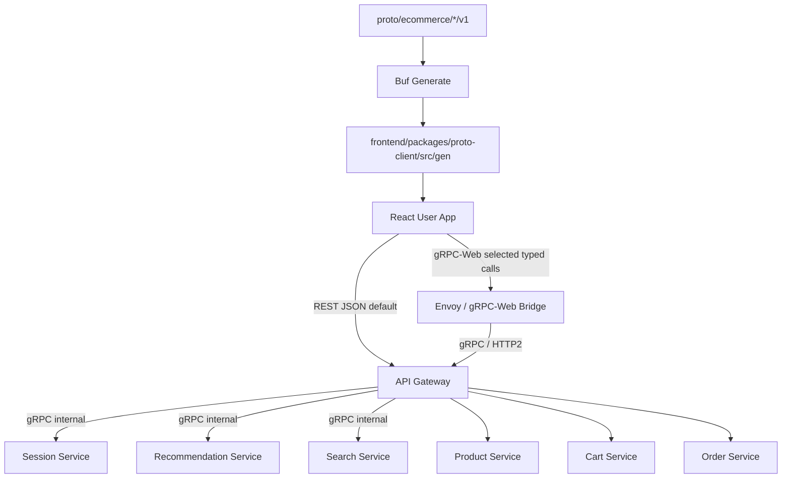
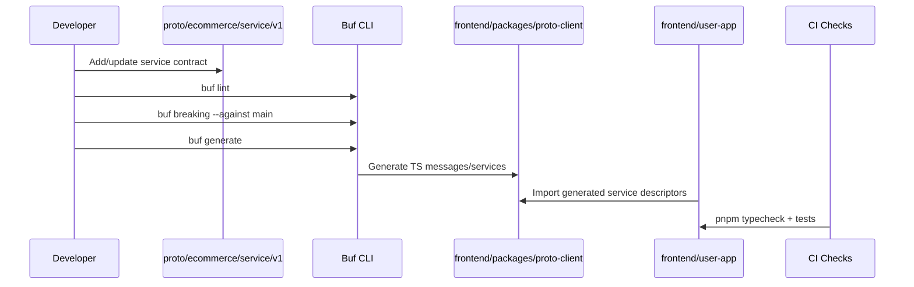
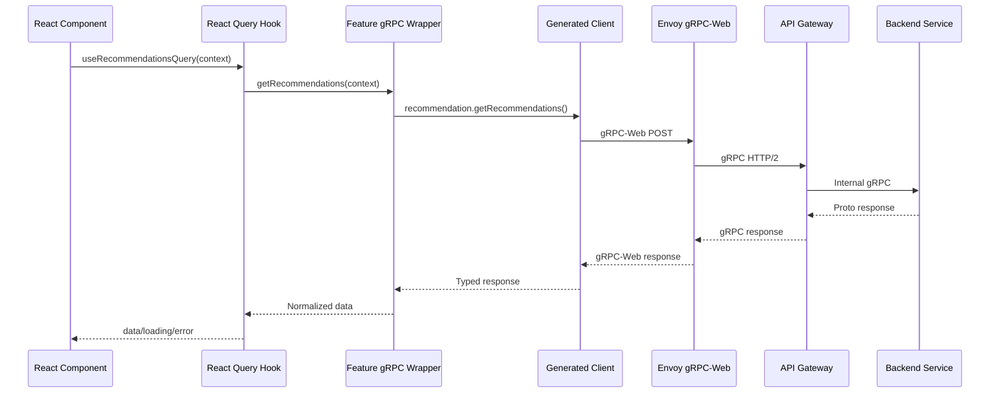
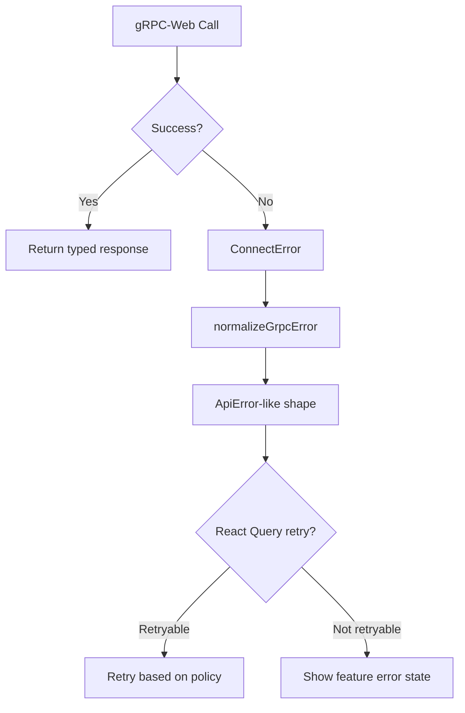

# 🌐 User App Frontend - Task 8: gRPC-Web Client


## 📌 Task Summary

| Field | Detail |
|---|---|
| Task Name | gRPC-Web client |
| Source | `docs/01-micro-tasks.md` → `User App Frontend` → Task 8 |
| Priority | `P2` |
| Dependency | Proto and Envoy |
| Main Goal | Proto generated TypeScript client integrate karna for selected typed browser calls |
| Output Type | Documentation-only implementation guide |
| Not Included | Backend service implementation, real proto files, Envoy deployment, seller/admin dashboards, replacing all REST APIs |

> **Simple Hinglish goal:** Is task ka kaam buyer-facing React app me **typed gRPC-Web client layer** ka clean integration plan banana hai. REST API abhi bhi primary browser API rahegi. gRPC-Web sirf selected calls ke liye use hoga jahan typed proto contract, streaming-like behavior, ya high-frequency event calls useful hain, jaise session event ingestion, recommendations, ya autocomplete.

---

## ✅ Final Output Created

```text
TaskImplementation/
└── User App Frontend/
    ├── task1.md
    ├── task2.md
    ├── task3.md
    ├── task4.md
    ├── task5.md
    ├── task6.md
    ├── task7.md
    └── task8.md
```

### Why this structure?

- `TaskImplementation/` project ke task-wise implementation guides ka central folder hai.
- `User App Frontend/` buyer/user-facing React app ke implementation guides ko group karta hai.
- `task8.md` sirf **User App Frontend - Task 8: gRPC-Web client** ka complete step-by-step guide hai.

> 🟡 **Scope note:** Current request ke hisaab se sirf required folder structure aur `task8.md` create kiya gaya. Actual `frontend/user-app` source files, proto contracts, generated code, ya Envoy config yahan create nahi kiye gaye.

---

## 🧭 Source Docs Studied

| Document | Kya use kiya gaya |
|---|---|
| `docs/01-micro-tasks.md` | Task 8 ka exact scope: proto generated TS client integrate karo for typed internal calls |
| `docs/10-frontend-implementation.md` | Frontend stack me REST primary, gRPC-Web selected typed calls ke liye |
| `docs/03-folder-structure.md` | `frontend/packages/proto-client/src/gen/...` and `src/lib/grpc-client.ts` target structure |
| `docs/02-system-architecture.md` | Browser → API Gateway/Envoy → services communication boundary |
| `docs/04-microservice-design.md` | REST public APIs and internal gRPC service contract ownership |
| `docs/13-developer-guide.md` | Proto update → generate Go/TS clients → implement flow |
| `api/master-api.json` | Public route to gRPC method mapping and `browser_typed_api` direction |
| `TaskImplementation/Platform Foundation/task2.md` | Proto strategy, Buf generation, TS generated output path |
| `TaskImplementation/Platform Foundation/task5.md` | API Gateway REST → gRPC boundary |
| `TaskImplementation/User App Frontend/task7.md` | React Query server-state layer that gRPC calls can plug into |

### Official tool references

| Source | Why referenced |
|---|---|
| [Buf code generation docs](https://buf.build/docs/generate/) | `buf generate` and `buf.gen.yaml` based TS generation |
| [Connect / Connect-Web docs](https://connectrpc.com/) | Browser-friendly protobuf RPC client approach |
| [@connectrpc/connect-web package](https://www.npmjs.com/package/%40connectrpc/connect-web) | `createGrpcWebTransport` / browser transport package |
| [Envoy gRPC-Web filter docs](https://www.envoyproxy.io/docs/envoy/latest/configuration/http/http_filters/grpc_web_filter) | Envoy bridge required for gRPC-Web to backend gRPC services |

---

## 🎯 Task Boundary

### ✅ Included in Task 8

- gRPC-Web client architecture for `frontend/user-app`.
- Shared `frontend/packages/proto-client` package plan.
- Buf TypeScript generation workflow.
- Browser transport setup using Connect-ES / gRPC-Web.
- Env variable design for gRPC-Web base URL.
- Auth, request id, session id, and timeout interceptor strategy.
- Typed service client factory.
- Error normalization from Connect/gRPC errors to UI-friendly app errors.
- React Query integration pattern for selected gRPC calls.
- Recommended selected user-app gRPC-Web use cases:
  - session event ingestion
  - recommendations
  - autocomplete or typed read calls where backend explicitly allows it
- Envoy bridge config concept.
- Testing and verification checklist.

### ❌ Not Included in Task 8

| Feature | Kyun nahi? |
|---|---|
| All REST APIs ko gRPC-Web me migrate karna | Docs ke according REST most public browser APIs ke liye primary rahega |
| Auth/login/signup over gRPC-Web | Auth screens already REST flow use karte hain; security/session flow stable rehna chahiye |
| Checkout/payment critical flow migration | Payment/order flows REST + idempotency pattern par rahenge |
| Backend service proto implementation | Ye service-specific backend tasks ka scope hai |
| Envoy production deployment | Platform/API Gateway/DevOps task ka scope hai |
| Seller dashboard and superadmin clients | Ye User App Frontend task nahi hai |
| Generated code manually edit karna | Generated files hamesha proto se regenerate honge |

> 🟢 **Rule:** Task 8 REST ko replace nahi karta. Ye ek typed gRPC-Web lane add karta hai, sirf allowlisted browser-safe calls ke liye.

---

## 🧠 REST vs gRPC-Web Decision Matrix

| Use case | Recommended protocol | Reason |
|---|---|---|
| Login/signup/logout | REST | Existing auth/session envelope simple and stable |
| Product list/detail | REST by default | SEO-ish browser routes and cache-friendly public API |
| Cart and checkout | REST | Idempotency, payment provider flow, and gateway validation clear |
| Profile/address/order history | REST | Standard CRUD shape, predictable errors |
| Session event ingestion | gRPC-Web candidate | Typed high-frequency event payloads useful |
| Recommendations | gRPC-Web candidate | Proto typed request context can evolve safely |
| Autocomplete | Optional gRPC-Web | Low-latency typed calls, if gateway allowlists it |
| Admin live metrics | gRPC-Web candidate, but not User App | Mentioned in frontend docs, but outside this task |

### Simple rule

```text
Normal CRUD and payment UX = REST
Typed event/recommendation/internal-style browser call = gRPC-Web
```

---

## 🧱 Clean Folder Structure

### Current documentation output

```text
TaskImplementation/
└── User App Frontend/
    └── task8.md
```

### Target future implementation structure

```text
frontend/
├── package.json
├── pnpm-workspace.yaml
├── packages/
│   └── proto-client/
│       ├── package.json
│       ├── tsconfig.json
│       └── src/
│           ├── gen/
│           │   └── ecommerce/
│           │       ├── common/v1/
│           │       ├── recommendation/v1/
│           │       ├── search/v1/
│           │       └── session/v1/
│           ├── grpc-web.ts
│           └── index.ts
└── user-app/
    ├── .env.example
    └── src/
        ├── lib/
        │   ├── env.ts
        │   ├── grpc-client.ts
        │   ├── grpc-errors.ts
        │   ├── grpc-interceptors.ts
        │   └── query-keys.ts
        ├── features/
        │   ├── analytics/
        │   │   ├── api/
        │   │   │   └── session-events.grpc.ts
        │   │   └── hooks/
        │   │       └── use-track-event.ts
        │   ├── recommendation/
        │   │   ├── api/
        │   │   │   └── recommendation.grpc.ts
        │   │   └── hooks/
        │   │       └── use-recommendations-query.ts
        │   └── search/
        │       ├── api/
        │       │   └── autocomplete.grpc.ts
        │       └── hooks/
        │           └── use-autocomplete-query.ts
        └── test/
            └── grpc/
                └── mock-transport.ts
```

### Folder responsibility

| Path | Responsibility |
|---|---|
| `frontend/packages/proto-client/` | Generated TypeScript proto messages and service descriptors |
| `proto-client/src/gen/` | Buf-generated code; manually edit nahi karna |
| `proto-client/src/grpc-web.ts` | Shared transport/client helper exports |
| `user-app/src/lib/grpc-client.ts` | User app specific service clients create karna |
| `user-app/src/lib/grpc-interceptors.ts` | Auth, request id, session id, timeout headers |
| `user-app/src/lib/grpc-errors.ts` | Connect/gRPC errors ko app-friendly errors me convert karna |
| `features/*/api/*.grpc.ts` | Feature-specific typed RPC wrapper functions |
| `features/*/hooks/` | React Query hooks wrapping selected gRPC calls |

---

## 🧩 High-Level Architecture



### Hinglish explanation

1. Normal buyer app REST APIs still API Gateway ke through jayengi.
2. Selected gRPC-Web calls browser se Envoy/gateway bridge tak jayengi.
3. Envoy `grpc_web` filter use karke browser-compatible request ko backend-compatible gRPC request me bridge karega.
4. Proto contracts se TypeScript client generate hoga, jisse frontend me request/response strongly typed rahenge.
5. Generated code manually edit nahi hoga; proto update ke baad `buf generate` run hoga.

---

## 🔄 Code Generation Flow



### Important

| Rule | Why |
|---|---|
| Proto is source of truth | Frontend and backend contract same rahega |
| Generated code commit policy decide karo | Team ko same generated code milega |
| Generated code manually edit mat karo | Next generate me changes overwrite ho jayenge |
| Breaking check mandatory | Old clients accidentally break nahi honge |

---

## 📦 External Libraries / Tools Used

### 1. Buf CLI

| Field | Detail |
|---|---|
| What | Protobuf linting, breaking-change check, and code generation tool |
| Why used | Go and TypeScript generated clients consistent tarike se banane ke liye |
| Used for | `buf lint`, `buf breaking`, `buf generate` |

Install:

```bash
# macOS
brew install bufbuild/buf/buf

# Linux/other environments
# Official Buf install docs follow karo:
# https://buf.build/docs/installation/
```

Use:

```bash
buf lint
buf breaking --against ".git#branch=main"
buf generate
```

---

### 2. `@bufbuild/protobuf`

| Field | Detail |
|---|---|
| What | TypeScript runtime for generated protobuf messages |
| Why used | Generated proto classes/messages browser me run karne ke liye |
| Used for | Message serialization, types, generated code runtime |

Install:

```bash
cd frontend
pnpm --filter @ecommerce/proto-client add @bufbuild/protobuf
```

Use:

```ts
import type { ProductContext } from '@ecommerce/proto-client/gen/ecommerce/recommendation/v1/recommendation_pb';

const context: ProductContext = {
  productId: 'prod_123',
  categoryId: 'cat_shoes',
};
```

---

### 3. `@connectrpc/connect`

| Field | Detail |
|---|---|
| What | Type-safe RPC client core for generated service descriptors |
| Why used | `createClient`, interceptors, ConnectError, Code handling ke liye |
| Used for | Service client creation and error handling |

Install:

```bash
cd frontend
pnpm --filter user-app add @connectrpc/connect
```

Use:

```ts
import { createClient } from '@connectrpc/connect';
import { RecommendationService } from '@ecommerce/proto-client/gen/ecommerce/recommendation/v1/recommendation_pb';

const recommendationClient = createClient(RecommendationService, transport);
```

---

### 4. `@connectrpc/connect-web`

| Field | Detail |
|---|---|
| What | Browser transport adapters for Connect/gRPC-Web |
| Why used | Browser se Envoy/gateway gRPC-Web endpoint call karne ke liye |
| Used for | `createGrpcWebTransport` or `createConnectTransport` |

Install:

```bash
cd frontend
pnpm --filter user-app add @connectrpc/connect-web
```

Use:

```ts
import { createGrpcWebTransport } from '@connectrpc/connect-web';

export const transport = createGrpcWebTransport({
  baseUrl: 'http://localhost:8082',
});
```

> 🟡 **Protocol choice:** Agar backend Connect protocol support kare, `createConnectTransport` use ho sakta hai. Agar Envoy gRPC-Web bridge hai, `createGrpcWebTransport` use karo.

---

### 5. Envoy gRPC-Web filter

| Field | Detail |
|---|---|
| What | Envoy HTTP filter jo browser gRPC-Web request ko backend gRPC server ke liye bridge karta hai |
| Why used | Browser native gRPC HTTP/2 direct call nahi kar sakta, so bridge chahiye |
| Used for | `envoy.extensions.filters.http.grpc_web.v3.GrpcWeb` |

Use:

```yaml
http_filters:
  - name: envoy.filters.http.grpc_web
    typed_config:
      '@type': type.googleapis.com/envoy.extensions.filters.http.grpc_web.v3.GrpcWeb
  - name: envoy.filters.http.cors
    typed_config:
      '@type': type.googleapis.com/envoy.extensions.filters.http.cors.v3.Cors
  - name: envoy.filters.http.router
    typed_config:
      '@type': type.googleapis.com/envoy.extensions.filters.http.router.v3.Router
```

---

## 🛠️ Step-by-Step Implementation Guide

## Step 1: Task Folder and File Ready Karo

Required documentation structure:

```text
TaskImplementation/
└── User App Frontend/
    └── task8.md
```

### Kya build hua?

- `TaskImplementation/` already project me present tha.
- `TaskImplementation/User App Frontend/` already present tha, so folder keep kiya gaya.
- New `task8.md` add kiya gaya.

### Why?

Project me task-wise implementation guides alag folder me maintain ho rahe hain. Isse beginner developer sequentially `task1.md` se `task8.md` tak padh sakta hai.

---

## Step 2: Existing Architecture Boundary Samjho

Docs ke according frontend API strategy:

```text
Browser REST calls      -> API Gateway
Browser gRPC-Web calls  -> Envoy or gateway bridge
Internal service calls  -> gRPC
```

### Hinglish explanation

Frontend ko directly random microservices se connect nahi karna. Browser public boundary ke through hi calls karega:

- REST ke liye `VITE_API_BASE_URL`.
- gRPC-Web ke liye `VITE_GRPC_WEB_BASE_URL`.
- Auth, rate limit, request id, and observability gateway/edge pe enforce honge.

---

## Step 3: Proto Client Package Add Karo

Recommended future package:

```text
frontend/packages/proto-client/
├── package.json
├── tsconfig.json
└── src/
    ├── gen/
    ├── grpc-web.ts
    └── index.ts
```

### `package.json` example

```json
{
  "name": "@ecommerce/proto-client",
  "private": true,
  "version": "0.1.0",
  "type": "module",
  "exports": {
    ".": "./src/index.ts",
    "./gen/*": "./src/gen/*"
  },
  "dependencies": {
    "@bufbuild/protobuf": "^2.0.0",
    "@connectrpc/connect": "^2.0.0"
  },
  "devDependencies": {
    "typescript": "^6.0.0"
  }
}
```

### Why separate package?

| Reason | Benefit |
|---|---|
| Generated code app se separate rahega | User app clean rahegi |
| Future seller/admin apps reuse kar sakte hain | Duplication avoid hoga |
| Proto generation target stable rahega | Buf config simple rahega |
| Generated imports predictable honge | TypeScript paths manageable rahenge |

---

## Step 4: Workspace me Package Register Karo

`frontend/pnpm-workspace.yaml` me packages include hone chahiye:

```yaml
packages:
  - 'user-app'
  - 'packages/*'
```

### Hinglish explanation

Pnpm workspace ko batana padega ki `packages/proto-client` bhi monorepo ka local package hai. Phir `user-app` usko dependency ki tarah import kar sakta hai:

```json
{
  "dependencies": {
    "@ecommerce/proto-client": "workspace:*"
  }
}
```

Install command:

```bash
cd frontend
pnpm install
```

---

## Step 5: Buf Generation Config Define Karo

Root-level future structure:

```text
proto/
├── buf.yaml
├── buf.gen.yaml
└── ecommerce/
    ├── common/v1/
    ├── session/v1/session.proto
    ├── recommendation/v1/recommendation.proto
    └── search/v1/search.proto
```

### `buf.gen.yaml` example

```yaml
version: v2
clean: true
plugins:
  - remote: buf.build/bufbuild/es
    out: frontend/packages/proto-client/src/gen
    opt:
      - target=ts
```

### Commands

```bash
# Proto style check
buf lint

# Breaking change check
buf breaking --against ".git#branch=main"

# TypeScript generated code create/update
buf generate
```

### Why?

Buf config checked-in rahega, so every developer and CI same output generate karega. Manual `protoc` command ya local plugin setup ka confusion kam hota hai.

---

## Step 6: Browser-Safe Proto Services Select Karo

Task 8 me har service expose nahi karni. Sirf selected browser-safe calls allowlist karni hain.

### Recommended allowlist for User App

| Service | RPC | User App use |
|---|---|---|
| `SessionService` | `IngestEvent` | page view, product view, cart action, search action events |
| `RecommendationService` | `GetRecommendations` | home/product detail personalized or fallback recommendations |
| `SearchService` | `Autocomplete` | typed autocomplete if REST endpoint not enough |

### Avoid for User App gRPC-Web

| Service/RPC | Reason |
|---|---|
| `AuthService.Login` | Auth flow already REST and security-sensitive |
| `OrderService.CreateOrderFromCart` | Checkout idempotency and payment flow stable over REST |
| `PaymentService.CreatePaymentIntent` | Payment provider browser SDK flow REST/client-secret based |
| Admin/seller RPCs | User app should not expose those clients |

> 🔐 **Security note:** Generated client package may contain many service definitions, but runtime transport/gateway should allow only browser-safe RPC routes.

---

## Step 7: Environment Variables Add Karo

`frontend/user-app/.env.example` future update:

```bash
VITE_API_BASE_URL=http://localhost:8080
VITE_GRPC_WEB_BASE_URL=http://localhost:8082
VITE_APP_ENV=local
VITE_PAYMENT_PROVIDERS=stripe,razorpay
```

### `env.ts` future shape

```ts
export type PublicEnv = Readonly<{
  apiBaseUrl: string;
  grpcWebBaseUrl: string;
  appEnv: AppEnv;
  paymentProviders: readonly string[];
}>;

const DEFAULT_GRPC_WEB_BASE_URL = 'http://localhost:8082';

function readEnv(): PublicEnv {
  return {
    apiBaseUrl: readOptionalEnv(import.meta.env.VITE_API_BASE_URL) ?? DEFAULT_API_BASE_URL,
    grpcWebBaseUrl:
      readOptionalEnv(import.meta.env.VITE_GRPC_WEB_BASE_URL) ?? DEFAULT_GRPC_WEB_BASE_URL,
    appEnv,
    paymentProviders,
  };
}
```

### Why separate URL?

REST gateway and gRPC-Web bridge local dev me different ports pe ho sakte hain. Production me dono same domain ke different paths ho sakte hain:

```text
https://api.example.com/api/v1
https://api.example.com/grpc
```

---

## Step 8: gRPC-Web Transport Banao

`frontend/user-app/src/lib/grpc-client.ts`:

```ts
import { createClient } from '@connectrpc/connect';
import { createGrpcWebTransport } from '@connectrpc/connect-web';
import { env } from './env';
import { grpcInterceptors } from './grpc-interceptors';

import { SessionService } from '@ecommerce/proto-client/gen/ecommerce/session/v1/session_pb';
import { RecommendationService } from '@ecommerce/proto-client/gen/ecommerce/recommendation/v1/recommendation_pb';
import { SearchService } from '@ecommerce/proto-client/gen/ecommerce/search/v1/search_pb';

const transport = createGrpcWebTransport({
  baseUrl: env.grpcWebBaseUrl,
  interceptors: grpcInterceptors,
});

export const grpcClients = {
  session: createClient(SessionService, transport),
  recommendation: createClient(RecommendationService, transport),
  search: createClient(SearchService, transport),
};
```

### Hinglish explanation

- `createGrpcWebTransport` browser-compatible transport banata hai.
- `baseUrl` Envoy/gateway bridge ka URL hota hai.
- `createClient` generated service descriptor se typed client banata hai.
- Feature code directly transport create nahi karega; central `grpcClients` use karega.

---

## Step 9: Interceptors Add Karo

`frontend/user-app/src/lib/grpc-interceptors.ts`:

```ts
import type { Interceptor } from '@connectrpc/connect';
import { getAccessToken } from './auth-session';

function createRequestId(): string {
  if (typeof crypto !== 'undefined' && 'randomUUID' in crypto) {
    return crypto.randomUUID();
  }

  return `req_${Date.now()}_${Math.random().toString(16).slice(2)}`;
}

export const authInterceptor: Interceptor = (next) => async (request) => {
  const token = getAccessToken();

  request.header.set('x-request-id', createRequestId());
  request.header.set('x-request-source', 'user-app');

  if (token) {
    request.header.set('authorization', `Bearer ${token}`);
  }

  return next(request);
};

export const grpcInterceptors: Interceptor[] = [authInterceptor];
```

### Interceptor responsibilities

| Header/behavior | Why |
|---|---|
| `authorization` | Protected typed calls ke liye JWT/session auth |
| `x-request-id` | Gateway logs/traces correlate karne ke liye |
| `x-request-source` | Backend ko source app identify karne ke liye |
| session/anonymous id | Analytics event stitching ke liye, if available |
| timeout/deadline | Slow RPCs UI ko hang na karein |

> 🟡 **Important:** Sensitive token storage strategy Task 3/6/7 ke auth-session rules follow karegi. gRPC-Web layer new token storage introduce nahi karega.

---

## Step 10: gRPC Error Normalization Karo

React UI ko raw `ConnectError` directly show nahi karna. REST `ApiError` jaisa predictable shape use karo.

`frontend/user-app/src/lib/grpc-errors.ts`:

```ts
import { Code, ConnectError } from '@connectrpc/connect';
import { ApiError } from './http';

function grpcCodeToStatus(code: Code): number {
  switch (code) {
    case Code.Unauthenticated:
      return 401;
    case Code.PermissionDenied:
      return 403;
    case Code.NotFound:
      return 404;
    case Code.InvalidArgument:
      return 400;
    case Code.ResourceExhausted:
      return 429;
    case Code.Unavailable:
      return 503;
    default:
      return 500;
  }
}

export function normalizeGrpcError(error: unknown): ApiError {
  if (error instanceof ConnectError) {
    return new ApiError(
      error.rawMessage || 'Request failed. Please try again.',
      Code[error.code] ?? 'GRPC_ERROR',
      grpcCodeToStatus(error.code),
    );
  }

  return new ApiError(
    'Network error. Please check your connection and try again.',
    'NETWORK_ERROR',
    0,
  );
}
```

### Why?

| Problem | Solution |
|---|---|
| Different error formats | Normalize to app-level `ApiError` |
| UI duplicated error parsing | Central helper |
| Auth/permission handling | Map gRPC code to HTTP-like status |
| Retry decisions | React Query can inspect status/code |

---

## Step 11: Session Event RPC Wrapper Banao

`frontend/user-app/src/features/analytics/api/session-events.grpc.ts`:

```ts
import { grpcClients } from '../../../lib/grpc-client';
import { normalizeGrpcError } from '../../../lib/grpc-errors';

type TrackEventInput = {
  eventName: string;
  pageUrl: string;
  productId?: string;
  cartId?: string;
  metadata?: Record<string, string>;
};

export async function trackSessionEvent(input: TrackEventInput): Promise<void> {
  try {
    await grpcClients.session.ingestEvent({
      eventName: input.eventName,
      pageUrl: input.pageUrl,
      productId: input.productId,
      cartId: input.cartId,
      metadata: input.metadata ?? {},
      occurredAt: new Date().toISOString(),
    });
  } catch (error) {
    throw normalizeGrpcError(error);
  }
}
```

### Hinglish explanation

UI component ko proto details nahi pata honi chahiye. Component simple `trackSessionEvent({ eventName })` call karega. Wrapper generated client ko call karega and error normalize karega.

---

## Step 12: Analytics Hook Add Karo

`frontend/user-app/src/features/analytics/hooks/use-track-event.ts`:

```ts
import { useCallback } from 'react';
import { trackSessionEvent } from '../api/session-events.grpc';

export function useTrackEvent() {
  return useCallback((eventName: string, metadata?: Record<string, string>) => {
    void trackSessionEvent({
      eventName,
      pageUrl: window.location.pathname + window.location.search,
      metadata,
    }).catch(() => {
      // Analytics failure user-facing flow ko block nahi karega.
    });
  }, []);
}
```

### Why fire-and-forget?

Analytics event fail hone par product page, cart, ya checkout UX break nahi honi chahiye. Error silently log/observe ho sakta hai, but user ko block nahi karna.

---

## Step 13: Recommendations RPC Wrapper Banao

`frontend/user-app/src/features/recommendation/api/recommendation.grpc.ts`:

```ts
import { grpcClients } from '../../../lib/grpc-client';
import { normalizeGrpcError } from '../../../lib/grpc-errors';

export type RecommendationContext = {
  pageType: 'home' | 'product_detail' | 'cart';
  productId?: string;
  categoryId?: string;
};

export async function getRecommendations(context: RecommendationContext) {
  try {
    return await grpcClients.recommendation.getRecommendations({
      context: {
        pageType: context.pageType,
        productId: context.productId,
        categoryId: context.categoryId,
      },
      limit: 12,
    });
  } catch (error) {
    throw normalizeGrpcError(error);
  }
}
```

### React Query hook

```ts
import { useQuery } from '@tanstack/react-query';
import { getRecommendations, type RecommendationContext } from '../api/recommendation.grpc';

export function useRecommendationsQuery(context: RecommendationContext) {
  return useQuery({
    queryKey: ['recommendations', context],
    queryFn: () => getRecommendations(context),
    staleTime: 5 * 60 * 1000,
  });
}
```

### Why React Query?

Task 7 me server state ke liye React Query selected hai. gRPC-Web response bhi server data hai, so cache/refetch/loading/error state React Query se manage hoga.

---

## Step 14: Autocomplete RPC Wrapper Banao

`frontend/user-app/src/features/search/api/autocomplete.grpc.ts`:

```ts
import { grpcClients } from '../../../lib/grpc-client';
import { normalizeGrpcError } from '../../../lib/grpc-errors';

export async function getAutocompleteSuggestions(query: string) {
  if (query.trim().length < 2) {
    return { suggestions: [] };
  }

  try {
    return await grpcClients.search.autocomplete({
      query,
      limit: 8,
    });
  } catch (error) {
    throw normalizeGrpcError(error);
  }
}
```

### Hook example

```ts
import { useQuery } from '@tanstack/react-query';
import { getAutocompleteSuggestions } from '../api/autocomplete.grpc';

export function useAutocompleteQuery(query: string) {
  return useQuery({
    queryKey: ['search', 'autocomplete', query],
    queryFn: () => getAutocompleteSuggestions(query),
    enabled: query.trim().length >= 2,
    staleTime: 60 * 1000,
  });
}
```

### UX rule

Autocomplete fail ho jaye to full search page still REST search se work karna chahiye. gRPC-Web autocomplete is enhancement, not dependency.

---

## Step 15: Envoy gRPC-Web Bridge Configure Karo

Task 8 frontend guide me Envoy deploy nahi karna, but expected shape samajhna zaruri hai.

### Conceptual local Envoy route

```yaml
static_resources:
  listeners:
    - name: grpc_web_listener
      address:
        socket_address:
          address: 0.0.0.0
          port_value: 8082
      filter_chains:
        - filters:
            - name: envoy.filters.network.http_connection_manager
              typed_config:
                '@type': type.googleapis.com/envoy.extensions.filters.network.http_connection_manager.v3.HttpConnectionManager
                stat_prefix: grpc_web
                route_config:
                  name: local_route
                  virtual_hosts:
                    - name: ecommerce_grpc_web
                      domains: ['*']
                      cors:
                        allow_origin_string_match:
                          - prefix: http://localhost:5173
                        allow_methods: GET,POST,OPTIONS
                        allow_headers: authorization,content-type,x-grpc-web,x-request-id,x-request-source
                        expose_headers: grpc-status,grpc-message,x-request-id
                      routes:
                        - match:
                            prefix: /ecommerce.session.v1.SessionService/
                          route:
                            cluster: api_gateway_grpc
                        - match:
                            prefix: /ecommerce.recommendation.v1.RecommendationService/
                          route:
                            cluster: api_gateway_grpc
                        - match:
                            prefix: /ecommerce.search.v1.SearchService/
                          route:
                            cluster: api_gateway_grpc
                http_filters:
                  - name: envoy.filters.http.grpc_web
                    typed_config:
                      '@type': type.googleapis.com/envoy.extensions.filters.http.grpc_web.v3.GrpcWeb
                  - name: envoy.filters.http.cors
                    typed_config:
                      '@type': type.googleapis.com/envoy.extensions.filters.http.cors.v3.Cors
                  - name: envoy.filters.http.router
                    typed_config:
                      '@type': type.googleapis.com/envoy.extensions.filters.http.router.v3.Router
  clusters:
    - name: api_gateway_grpc
      connect_timeout: 2s
      type: LOGICAL_DNS
      lb_policy: ROUND_ROBIN
      typed_extension_protocol_options:
        envoy.extensions.upstreams.http.v3.HttpProtocolOptions:
          '@type': type.googleapis.com/envoy.extensions.upstreams.http.v3.HttpProtocolOptions
          explicit_http_config:
            http2_protocol_options: {}
      load_assignment:
        cluster_name: api_gateway_grpc
        endpoints:
          - lb_endpoints:
              - endpoint:
                  address:
                    socket_address:
                      address: api-gateway
                      port_value: 9090
```

### Hinglish explanation

- Browser `localhost:8082` par gRPC-Web request bhejta hai.
- Envoy `grpc_web` filter se request translate karta hai.
- Route allowlist only selected services ko forward karti hai.
- Backend/gateway side gRPC endpoint HTTP/2 support karta hai.

---

## Step 16: Request Flow Samjho



---

## Step 17: Error Flow Samjho



### Retry recommendation

| Error | Retry? | Reason |
|---|---:|---|
| `Unavailable` | ✅ | Temporary network/service issue |
| `DeadlineExceeded` | ✅ once | Slow network can recover |
| `Unauthenticated` | ❌ | Needs login/refresh handling |
| `PermissionDenied` | ❌ | User not allowed |
| `InvalidArgument` | ❌ | Request bug/validation issue |
| `NotFound` | ❌ | Resource missing |

---

## Step 18: React Query Integration Rules

Task 7 ka state strategy yahin apply hoga.

| Data | Tool | Rule |
|---|---|---|
| Recommendations | React Query | cache by context |
| Autocomplete | React Query | enabled after min query length |
| Analytics event mutation | fire-and-forget or mutation | user flow block nahi karna |
| Current session ids | Zustand/session store | small client state |
| Search input | local state + URL state | route shareable rahe |

### Example query keys

```ts
export const grpcQueryKeys = {
  recommendations: (context: RecommendationContext) =>
    ['grpc', 'recommendations', context] as const,
  autocomplete: (query: string) =>
    ['grpc', 'search', 'autocomplete', query] as const,
};
```

---

## Step 19: Security Rules

| Rule | Implementation |
|---|---|
| Allowlist RPCs | Envoy/gateway route only selected services expose kare |
| Auth headers centralized | Interceptor me token attach ho |
| No secrets in frontend env | Only public base URLs use karo |
| CORS strict | Local/staging/prod origins explicitly allow karo |
| No admin RPC in user app | Admin service descriptors import/use mat karo |
| Backend remains source of truth | Frontend generated types validation ka replacement nahi |
| Rate limiting | Gateway/Envoy per user/IP limits apply kare |
| Observability | `x-request-id` and trace headers forward karo |

> 🔴 **Important:** Generated TypeScript types browser me hone ka matlab ye nahi ki browser trusted hai. Backend auth, RBAC, validation, and rate limit mandatory rahenge.

---

## Step 20: Performance Rules

| Concern | Solution |
|---|---|
| Bundle size | Sirf required services import karo |
| Generated code bloat | Avoid wildcard imports from full proto package |
| Autocomplete spam | Debounce input and use React Query `enabled` |
| Analytics noise | Batch or throttle events if volume high |
| Slow RPC | Deadline/timeout strategy add karo |
| Duplicate requests | React Query dedupe use karo |

### Import rule

```ts
// ✅ Good: specific service import
import { SearchService } from '@ecommerce/proto-client/gen/ecommerce/search/v1/search_pb';

// ❌ Avoid: package-level import that pulls too much
import * as ProtoClient from '@ecommerce/proto-client';
```

---

## Step 21: Testing Plan

### Unit tests

| Test | What to verify |
|---|---|
| `normalizeGrpcError` | gRPC code → app error mapping |
| `grpc-interceptors` | auth/request headers set correctly |
| feature wrappers | generated client called with correct payload |
| query keys | stable and scoped keys |

### Component/hook tests

| Test | What to verify |
|---|---|
| recommendations loading | skeleton/empty/data states |
| autocomplete | disabled under 2 chars, fetches after valid query |
| analytics hook | does not throw into UI |
| auth expired | proper error handling/redirect strategy |

### Contract checks

```bash
buf lint
buf breaking --against ".git#branch=main"
buf generate
```

### Frontend checks

```bash
cd frontend
pnpm --filter user-app typecheck
pnpm --filter user-app test
pnpm --filter user-app build
```

### Browser/manual checks

| Check | Expected |
|---|---|
| Network tab | `application/grpc-web+proto` or compatible gRPC-Web request |
| Request headers | auth/request source/request id present |
| CORS preflight | Passes for allowed origin |
| Failed Envoy | UI falls back or shows friendly error |
| Analytics failure | User flow continues |

---

## 🧪 Example Mock Transport for Tests

For hooks/wrappers, direct network avoid karo.

```ts
type MockRecommendationClient = {
  getRecommendations: ReturnType<typeof vi.fn>;
};

export function createMockRecommendationClient(): MockRecommendationClient {
  return {
    getRecommendations: vi.fn().mockResolvedValue({
      items: [
        {
          productId: 'prod_123',
          title: 'Running Shoes',
          reason: 'Trending in your category',
        },
      ],
    }),
  };
}
```

### Hinglish explanation

Test me actual Envoy ya backend start karna zaruri nahi. Feature wrapper ko mock client ke saath verify karo. Real bridge verification integration/e2e level par hogi.

---

## 🧾 Example Proto Shape

Future `proto/ecommerce/session/v1/session.proto` idea:

```proto
syntax = "proto3";

package ecommerce.session.v1;

service SessionService {
  rpc IngestEvent(IngestEventRequest) returns (IngestEventResponse);
}

message IngestEventRequest {
  string event_name = 1;
  string page_url = 2;
  string product_id = 3;
  string cart_id = 4;
  map<string, string> metadata = 5;
  string occurred_at = 6;
}

message IngestEventResponse {
  string event_id = 1;
  bool accepted = 2;
}
```

Future `proto/ecommerce/recommendation/v1/recommendation.proto` idea:

```proto
syntax = "proto3";

package ecommerce.recommendation.v1;

service RecommendationService {
  rpc GetRecommendations(GetRecommendationsRequest) returns (GetRecommendationsResponse);
}

message GetRecommendationsRequest {
  RecommendationContext context = 1;
  int32 limit = 2;
}

message RecommendationContext {
  string page_type = 1;
  string product_id = 2;
  string category_id = 3;
}

message GetRecommendationsResponse {
  repeated RecommendationItem items = 1;
}

message RecommendationItem {
  string product_id = 1;
  string title = 2;
  string image_url = 3;
  string reason = 4;
}
```

> 🟣 **Note:** Ye proto examples Task 8 guide ke explanation ke liye hain. Actual proto files service implementation tasks me finalize honge.

---

## 🔌 Integration With Existing User App Tasks

| Previous task | Task 8 relation |
|---|---|
| Task 1 Setup | Vite/TS strict mode generated clients compile karega |
| Task 2 App shell | Search bar autocomplete optional gRPC-Web use kar sakta hai |
| Task 3 Auth screens | Auth token/session source interceptors me reuse hoga |
| Task 4 Product browsing | Product detail recommendations typed RPC se aa sakti hain |
| Task 5 Cart/checkout | Cart events analytics RPC se track ho sakte hain, checkout REST rahega |
| Task 6 Profile | Profile REST rahega; notification preferences REST unless typed RPC needed |
| Task 7 State management | React Query gRPC responses ko cache/manage karega |

---

## ✅ Implementation Checklist

| Checklist Item | Status |
|---|---:|
| `TaskImplementation/` folder exists | ✅ Done |
| `TaskImplementation/User App Frontend/` folder exists | ✅ Done |
| `task8.md` created | ✅ Done |
| Source docs reviewed | ✅ Done |
| Task boundary defined | ✅ Done |
| External tools/libraries documented | ✅ Done |
| Clean folder structure included | ✅ Done |
| Step-by-step Hinglish guide included | ✅ Done |
| Mermaid architecture diagrams included | ✅ Done |
| Code examples included | ✅ Done |
| Scope limited to User App Frontend Task 8 | ✅ Done |

---

## 🚫 Out of Scope for Task 8

```text
No backend service code
No proto files actually generated
No Envoy runtime deployment
No REST-to-gRPC migration for all APIs
No payment/auth flow rewrite
No seller dashboard or superadmin panel work
```

### Reason

User ne specifically required folder structure aur `task8.md` content generate karne ko bola. Isliye Task 8 ka output documentation-only guide tak limited rakha gaya hai, with future implementation examples.

---

## ✅ Final Task 8 Standard

User App Frontend Task 8 ke liye gRPC-Web client integration strategy ready hai:

- REST remains default for normal buyer APIs.
- gRPC-Web is reserved for selected typed browser-safe calls.
- Buf generates TypeScript proto clients into `frontend/packages/proto-client`.
- User app creates a central `grpc-client.ts` transport and service client factory.
- Interceptors attach auth, request id, and source headers.
- Errors normalize into app-friendly errors.
- React Query manages gRPC server state.
- Envoy/gateway allowlists browser-safe RPC routes.
- Security and performance boundaries are clearly defined.

> ✅ **Conclusion:** Task 8 frontend ko typed proto-powered capability deta hai without disturbing existing REST-based product, cart, checkout, auth, and profile flows. Yeh approach scalable hai, but controlled hai.
