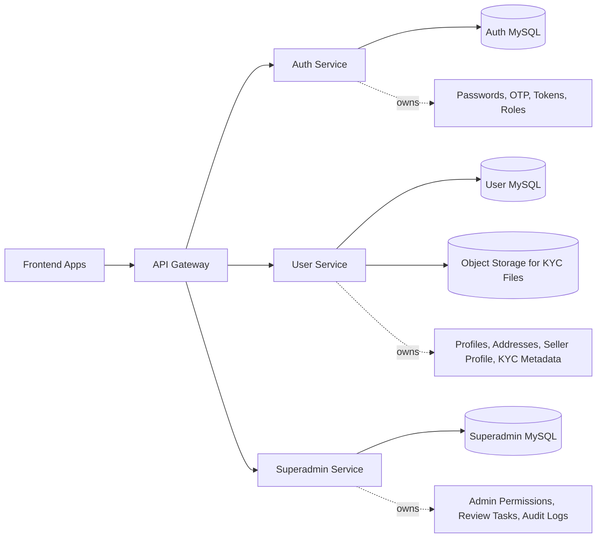
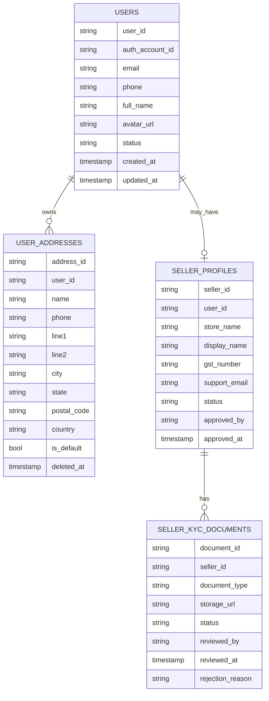
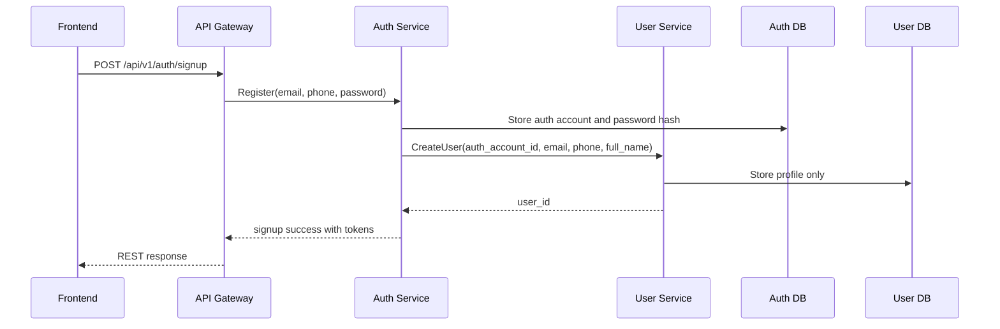
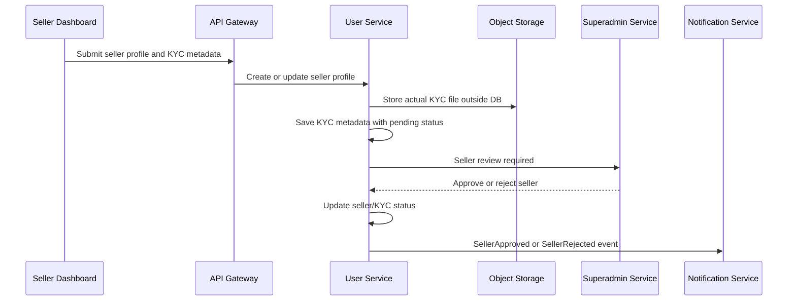
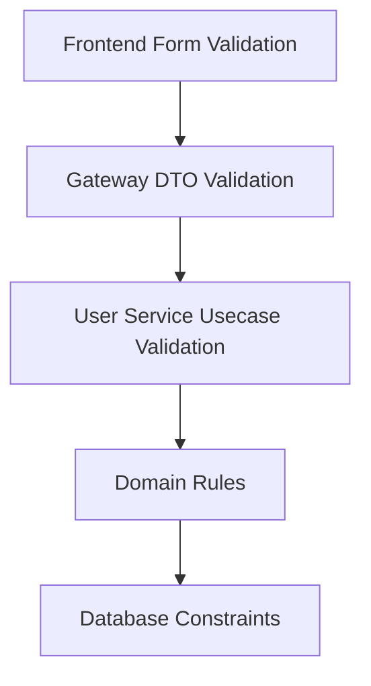
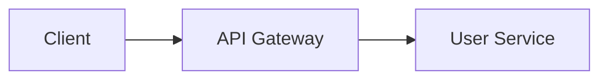

# 👤 User Service - Task 1: Define User Domain


## 📌 Task Summary

| Field | Detail |
|---|---|
| Task Name | Define user domain |
| Source | `docs/01-micro-tasks.md` → `User Service` → Task 1 |
| Priority | `P0` core domain foundation |
| Dependency | Platform foundation |
| Main Goal | Buyer, seller, aur admin profile fields final karna |
| Core Boundary | User Service sirf profile ownership rakhega. Password, credentials, OTP, tokens Auth Service me rahenge. |
| Output Type | Structured implementation guide |
| Not Included | MySQL migrations, repository code, gRPC service implementation, REST APIs, validation library setup, events |

> **Simple Hinglish goal:** Is task ka purpose User Service ke domain ko clearly define karna hai. Matlab platform me buyer, seller, aur admin profile ka kaunsa data User Service own karega, kaunsa data Auth/Superadmin/Notification services own karenge, aur future implementation ke liye clean entity boundary kya hogi.

---

## ✅ Final Output Created

```text
TaskImplementation/
├── Auth Service/
│   ├── task1.md
│   ├── task2.md
│   ├── task3.md
│   ├── task4.md
│   ├── task5.md
│   ├── task6.md
│   ├── task7.md
│   └── task8.md
├── Platform Foundation/
│   ├── task1.md
│   ├── task2.md
│   ├── task3.md
│   ├── task4.md
│   ├── task5.md
│   ├── task6.md
│   ├── task7.md
│   └── task8.md
└── User Service/
    └── task1.md
```

### Why this structure?

- `TaskImplementation/` project ke task-wise guides ka central folder hai.
- `User Service/` folder User Service ke implementation guides ko group karega.
- `task1.md` sirf **User Service - Task 1** ka guide hai.
- Existing `Auth Service/` aur `Platform Foundation/` guides ko untouched rakha gaya.
- Actual backend files, migrations, proto files, ya API implementation create nahi ki gayi, kyunki ye Task 1 ke scope ke bahar hai.

---

## 🧭 Implementation Approach

Is guide ko banate time project ke official docs ko source of truth maana gaya:

| Document | Kya use kiya gaya |
|---|---|
| `docs/01-micro-tasks.md` | User Service Task 1 ka exact scope, priority, dependency |
| `docs/02-system-architecture.md` | Service ownership, gRPC, REST via API Gateway, direct DB access ban |
| `docs/03-folder-structure.md` | Future `backend/services/user-service/` folder convention |
| `docs/04-microservice-design.md` | User Service responsibilities, tables, APIs, internal logic |
| `docs/05-database-design.md` | User DB table names, relationships, indexes |
| `database/draw.sql` | Future schema fields for `users`, `user_addresses`, `seller_profiles`, `seller_kyc_documents` |
| `api/master-api.json` | User Service REST/gRPC boundary and DTO fields |
| `docs/06-auth-security.md` | Password/Auth ownership, JWT roles, audit/security boundaries |
| `docs/09-cms-superadmin.md` | Seller KYC approval workflow and Superadmin interaction |
| `docs/10-frontend-implementation.md` | Profile pages, address book, seller/admin access expectations |
| `docs/13-developer-guide.md` | Backend layer rules and future implementation flow |

---

## 🧱 Task Boundary

### ✅ Included in Task 1

- User Service ka domain boundary define karna
- Buyer profile fields final karna
- Address profile fields final karna
- Seller profile fields final karna
- Seller KYC metadata fields final karna
- Admin profile boundary define karna
- Auth Service ke saath ownership split clear karna
- Superadmin Service ke saath seller/admin control split clear karna
- Future folder structure recommend karna
- Conceptual Go domain examples dena
- Mermaid diagrams add karna
- External tools/libraries ka clear explanation dena

### 🚫 Not Included in Task 1

- MySQL migration files banana
- `backend/services/user-service/` code create karna
- Repository implementation
- gRPC server implementation
- REST endpoint implementation
- Validation rules ka runtime code
- Kafka/RabbitMQ event publisher
- Redis cache
- Admin approval implementation
- KYC file upload implementation
- Notification preferences implementation

> 🟢 **Rule:** Task 1 domain contract finalize karega. Actual DB schema Task 2, repository Task 3, gRPC Task 4, REST APIs Task 5 me implement honge.

---

## 🪜 Step-by-Step Implementation

## Step 1: User Service ka purpose define kiya

User Service ka kaam authentication karna nahi hai. Iska kaam user ke profile-related data ko manage karna hai.

### User Service owns

| Area | Ownership |
|---|---|
| Base user profile | `user_id`, `auth_account_id`, email mirror, phone mirror, full name, avatar, status |
| Buyer profile | Same base user profile plus addresses |
| Address book | User ke shipping/billing addresses |
| Seller profile | Store name, display name, GST, support email, seller status |
| Seller KYC metadata | Document type, storage URL, review status, rejection reason |
| User status | `active`, `blocked`, `deleted` |

### User Service does not own

| Area | Owner Service | Reason |
|---|---|---|
| Password hash | Auth Service | Credentials high-risk security data hain |
| OTP | Auth Service + Notification Service | OTP generation/verification Auth me, delivery Notification me |
| JWT tokens | Auth Service | Token lifecycle centralized rahega |
| Role assignment | Auth Service | RBAC claims and role lookup Auth boundary me rahega |
| Admin permissions | Superadmin Service/Auth Service | Admin permission matrix User profile se alag concern hai |
| Notification preferences | Notification Service | Channel opt-in/opt-out notification domain ka part hai |
| Actual KYC file binary | Object storage/CDN | DB me sirf metadata rahega |

### Hinglish Explanation

User Service ko ek profile manager samjho. Auth Service user ko prove karta hai, "ye user kaun hai". User Service batata hai, "is user ka profile kya hai". Dono ka data mix karna security aur maintainability ke liye risky hota hai.

---

## Step 2: Core identity model finalize kiya

Har platform user ka ek stable `user_id` hoga. Auth Service ke account se link ke liye `auth_account_id` store hoga.

| Field | Type Idea | Required | Owner | Notes |
|---|---|---:|---|---|
| `user_id` | string | ✅ | User Service | Public/internal stable profile id |
| `auth_account_id` | string | ✅ | Auth Service reference | Auth account se one-to-one link |
| `email` | string | ✅ | Auth source, User mirror | Profile display/contact ke liye mirror |
| `phone` | string/null | ❌ | Auth source, User mirror | Optional contact number |
| `full_name` | string | ✅ | User Service | Buyer/admin/seller person name |
| `avatar_url` | string/null | ❌ | User Service | CDN/object URL |
| `status` | enum | ✅ | User Service | `active`, `blocked`, `deleted` |
| `created_at` | timestamp | ✅ | User Service | Audit field |
| `updated_at` | timestamp | ✅ | User Service | Audit field |

### Important rule

`email` aur `phone` User Service me profile convenience ke liye mirror ho sakte hain, but login identity ka source of truth Auth Service hi rahega.

### Conceptual Go domain example

> Ye code example guide ke liye hai. Is task me actual Go file create nahi ki gayi.

```go
package domain

import "time"

type UserStatus string

const (
    UserStatusActive  UserStatus = "active"
    UserStatusBlocked UserStatus = "blocked"
    UserStatusDeleted UserStatus = "deleted"
)

type User struct {
    UserID        string
    AuthAccountID string
    Email         string
    Phone         *string
    FullName      string
    AvatarURL     *string
    Status        UserStatus
    CreatedAt     time.Time
    UpdatedAt     time.Time
}
```

### Why `auth_account_id` important hai?

- Signup Auth Service se start hoga.
- Auth Service password, OTP, roles, tokens manage karega.
- Signup success ke baad Auth Service User Service ko profile create karne ke liye call karega.
- `auth_account_id` se dono services ka mapping stable rahega.

---

## Step 3: Buyer profile fields finalize kiye

Buyer ke liye separate heavy profile table ki zarurat abhi nahi hai. Buyer profile base `users` entity se cover ho jata hai.

### Buyer Profile

| Field | Required | Detail |
|---|---:|---|
| `user_id` | ✅ | Buyer ka stable profile id |
| `full_name` | ✅ | Checkout, account page, invoice display ke liye |
| `email` | ✅ | Contact/display mirror |
| `phone` | ❌ | Delivery/contact ke liye optional |
| `avatar_url` | ❌ | Account UI ke liye optional |
| `status` | ✅ | Active/blocked/deleted |
| `addresses` | ❌ | Address book relation |

### Buyer use cases

- Profile page me details dikhana
- Checkout ke time address select karna
- Order Service ko buyer id provide karna
- Wishlist/Cart/Session services ko stable `user_id` dena

### Buyer profile JSON example

```json
{
  "user_id": "user_123",
  "email": "buyer@example.com",
  "phone": "+919999999999",
  "full_name": "Aarav Sharma",
  "avatar_url": "https://cdn.example.com/avatars/user_123.png",
  "status": "active"
}
```

### Hinglish Explanation

Buyer ke profile me sirf woh data rakhna chahiye jo shopping experience ke liye directly useful hai. Password, login attempts, refresh token, OTP jaise security fields yahan bilkul nahi aayenge.

---

## Step 4: Address domain fields finalize kiye

Address buyer checkout flow ka important part hai. Ek user ke multiple addresses ho sakte hain.

### Address Fields

| Field | Required | Detail |
|---|---:|---|
| `address_id` | ✅ | Stable address id |
| `user_id` | ✅ | Address owner |
| `name` | ✅ | Receiver name |
| `phone` | ❌ | Receiver contact number |
| `line1` | ✅ | House/building/street |
| `line2` | ❌ | Area/landmark optional |
| `city` | ✅ | City |
| `state` | ✅ | State/region |
| `postal_code` | ✅ | PIN/ZIP code |
| `country` | ✅ | Country |
| `is_default` | ✅ | Default checkout address flag |
| `created_at` | ✅ | Created timestamp |
| `updated_at` | ✅ | Updated timestamp |
| `deleted_at` | ❌ | Soft delete support |

### Address business rules

| Rule | Detail |
|---|---|
| Ownership | User sirf apne addresses manage kar sakta hai |
| Default address | Ek user ka ideally ek active default address hoga |
| Soft delete | Address delete karne par old orders break nahi hone chahiye |
| Address limit | Future usecase me max 20 addresses per user enforce ho sakta hai |
| Order snapshot | Order Service checkout ke time address snapshot store karega |

### Conceptual Go domain example

```go
package domain

import "time"

type Address struct {
    AddressID  string
    UserID     string
    Name       string
    Phone      *string
    Line1      string
    Line2      *string
    City       string
    State      string
    PostalCode string
    Country    string
    IsDefault  bool
    CreatedAt  time.Time
    UpdatedAt  time.Time
    DeletedAt  *time.Time
}
```

---

## Step 5: Seller profile fields finalize kiye

Seller ek normal user ka extension hai. Matlab seller ke paas base `users` profile bhi hoga, aur ek separate `seller_profiles` record bhi hoga.

### Seller Profile Fields

| Field | Required | Detail |
|---|---:|---|
| `seller_id` | ✅ | Stable seller/business id |
| `user_id` | ✅ | Owner user id |
| `store_name` | ✅ | Legal/store name |
| `display_name` | ❌ | Customer-facing seller display name |
| `gst_number` | ❌ | India tax identifier, seller category ke according required ho sakta hai |
| `support_email` | ❌ | Customer support contact |
| `status` | ✅ | `draft`, `pending_review`, `active`, `suspended`, `rejected` |
| `approved_by` | ❌ | Admin id who approved seller |
| `approved_at` | ❌ | Approval timestamp |
| `created_at` | ✅ | Created timestamp |
| `updated_at` | ✅ | Updated timestamp |

### Seller statuses

| Status | Meaning |
|---|---|
| `draft` | Seller profile started but not submitted |
| `pending_review` | KYC submitted, admin review pending |
| `active` | Seller approved and allowed to sell |
| `suspended` | Seller temporarily blocked from selling |
| `rejected` | Seller application rejected |

### Seller profile JSON example

```json
{
  "seller_id": "seller_456",
  "user_id": "user_123",
  "store_name": "Aarav Retail Pvt Ltd",
  "display_name": "Aarav Retail",
  "gst_number": "27ABCDE1234F1Z5",
  "support_email": "support@aaravretail.example",
  "status": "pending_review"
}
```

### Conceptual Go domain example

```go
package domain

import "time"

type SellerStatus string

const (
    SellerStatusDraft         SellerStatus = "draft"
    SellerStatusPendingReview SellerStatus = "pending_review"
    SellerStatusActive        SellerStatus = "active"
    SellerStatusSuspended     SellerStatus = "suspended"
    SellerStatusRejected      SellerStatus = "rejected"
)

type SellerProfile struct {
    SellerID     string
    UserID       string
    StoreName    string
    DisplayName  *string
    GSTNumber    *string
    SupportEmail *string
    Status       SellerStatus
    ApprovedBy   *string
    ApprovedAt   *time.Time
    CreatedAt    time.Time
    UpdatedAt    time.Time
}
```

### Hinglish Explanation

Seller profile ko buyer profile ke andar mix nahi karna chahiye. Har seller ek user hai, but har user seller nahi hai. Isliye `users` base profile rahega, aur seller-specific business data `seller_profiles` me rahega.

---

## Step 6: Seller KYC metadata fields finalize kiye

KYC ka actual file binary database me store nahi karna hai. Database me sirf metadata and storage URL rahega.

### KYC Document Fields

| Field | Required | Detail |
|---|---:|---|
| `document_id` | ✅ | Stable document id |
| `seller_id` | ✅ | Seller owner |
| `document_type` | ✅ | `gst_certificate`, `pan_card`, `address_proof`, etc. |
| `storage_url` | ✅ | Object storage/CDN path |
| `status` | ✅ | `pending`, `approved`, `rejected` |
| `reviewed_by` | ❌ | Admin id |
| `reviewed_at` | ❌ | Review timestamp |
| `rejection_reason` | ❌ | Rejection explanation |
| `created_at` | ✅ | Upload metadata timestamp |

### KYC status rules

| Status | Meaning |
|---|---|
| `pending` | Seller ne document upload kiya, review pending |
| `approved` | Admin ne document approve kar diya |
| `rejected` | Admin ne document reject kiya with reason |

### Conceptual Go domain example

```go
package domain

import "time"

type KYCStatus string

const (
    KYCStatusPending  KYCStatus = "pending"
    KYCStatusApproved KYCStatus = "approved"
    KYCStatusRejected KYCStatus = "rejected"
)

type KYCDocument struct {
    DocumentID      string
    SellerID        string
    DocumentType    string
    StorageURL      string
    Status          KYCStatus
    ReviewedBy      *string
    ReviewedAt      *time.Time
    RejectionReason *string
    CreatedAt       time.Time
}
```

### Important security note

KYC documents sensitive hote hain. Logs me `storage_url` bhi carefully handle karna hoga. Public URL ke bajay signed/private URL pattern future task me better hoga.

---

## Step 7: Admin profile boundary define kiya

Task detail me admin profile fields bhi mention hain, but project docs ke according admin permissions and admin workflows Superadmin Service/Auth Service ke concern hain.

### Admin profile in User Service

Admin bhi platform user hi hai, isliye User Service me admin ke liye base `users` profile fields enough hain:

| Field | Required | Detail |
|---|---:|---|
| `user_id` | ✅ | Admin ka user profile id |
| `auth_account_id` | ✅ | Auth account mapping |
| `email` | ✅ | Admin contact/login mirror |
| `phone` | ❌ | Optional contact |
| `full_name` | ✅ | Admin UI display |
| `avatar_url` | ❌ | Optional admin avatar |
| `status` | ✅ | Active/blocked/deleted |

### Admin data not owned by User Service

| Field/Concern | Owner | Reason |
|---|---|---|
| `role` | Auth Service | JWT claims and RBAC source |
| `permissions` | Auth/Superadmin Service | Fine-grained access rules |
| `admin_user_id` | Superadmin Service | Admin domain table |
| `department` | Superadmin Service | Admin operations metadata |
| `audit_logs` | Superadmin Service | High-risk admin actions audit |

### Admin profile JSON example

```json
{
  "user_id": "user_admin_001",
  "email": "ops.admin@example.com",
  "phone": "+911111111111",
  "full_name": "Operations Admin",
  "avatar_url": null,
  "status": "active"
}
```

### Hinglish Explanation

Admin ka naam, email, phone User Service me profile ke roop me aa sakta hai. Lekin admin kya kar sakta hai, kaunsa permission hai, seller approve kar sakta hai ya refund review kar sakta hai - ye User Service decide nahi karega.

---

## Step 8: Ownership matrix finalize kiya



### Service ownership table

| Data | User Service | Auth Service | Superadmin Service |
|---|---:|---:|---:|
| Base profile | ✅ | ❌ | ❌ |
| Address book | ✅ | ❌ | ❌ |
| Seller profile | ✅ | ❌ | Reads/controls via service APIs |
| KYC metadata | ✅ | ❌ | Reviews via workflow |
| Password hash | ❌ | ✅ | ❌ |
| OTP challenge | ❌ | ✅ | ❌ |
| JWT refresh token | ❌ | ✅ | ❌ |
| Role assignment | ❌ | ✅ | May request/control depending on flow |
| Admin permissions | ❌ | ✅/shared | ✅ |
| Admin audit logs | ❌ | ❌ | ✅ |

---

## Step 9: Domain relationships define kiye



### Relationship explanation

- One `User` ke multiple `Address` ho sakte hain.
- One `User` ka zero ya one `SellerProfile` ho sakta hai.
- One `SellerProfile` ke multiple `KYCDocument` ho sakte hain.
- Admin users separate table ke through User Service me model nahi honge; base `User` profile reuse hoga.

---

## Step 10: Signup to profile creation flow define kiya



### Hinglish Explanation

Signup Auth Service se hota hai kyunki password uske paas hai. Auth Service jab account bana deta hai, tab User Service ko profile create karne ke liye call karta hai. User Service password kabhi receive ya store nahi karega.

---

## Step 11: Seller onboarding flow define kiya



### Boundary note

Task 1 me ye sirf flow define hua hai. Actual upload API, storage integration, review task, events, and notification implementation later tasks me aayenge.

---

## 🗂️ Future User Service Folder Structure

Task 1 ke current output me backend code create nahi hua. Future User Service implementation ke liye docs ke according recommended structure ye rahega:

```text
backend/
└── services/
    └── user-service/
        ├── cmd/
        │   └── server/
        │       └── main.go
        ├── internal/
        │   ├── domain/
        │   │   ├── user.go
        │   │   ├── address.go
        │   │   ├── seller_profile.go
        │   │   └── kyc_document.go
        │   ├── usecase/
        │   │   ├── create_user.go
        │   │   ├── update_profile.go
        │   │   ├── manage_address.go
        │   │   └── seller_kyc.go
        │   ├── repository/
        │   │   └── mysql_user_repository.go
        │   ├── transport/
        │   │   └── grpc/
        │   │       ├── server.go
        │   │       └── user_handler.go
        │   └── config/
        │       └── config.go
        ├── migrations/
        │   ├── 001_create_user_tables.up.sql
        │   └── 001_create_user_tables.down.sql
        └── deploy/
            ├── Dockerfile
            └── k8s.yaml
```

### Folder responsibility

| Path | Responsibility |
|---|---|
| `domain/` | Core entities and enums: User, Address, SellerProfile, KYCDocument |
| `usecase/` | Business flows: create user, update profile, manage address, seller KYC |
| `repository/` | MySQL implementation, future Task 3 |
| `transport/grpc/` | gRPC handlers, future Task 4 |
| `migrations/` | MySQL schema, future Task 2 |
| `deploy/` | Docker/Kubernetes deploy files, future DevOps tasks |

> 🟡 **Important:** Ye folder structure future target hai. Is Task 1 me create nahi kiya gaya because requested output sirf `TaskImplementation/User Service/task1.md` hai.

---

## 🧩 Domain Model Summary

### Entity list

| Entity | Purpose | Future Table |
|---|---|---|
| `User` | Base profile for buyer, seller owner, admin person | `users` |
| `Address` | User address book | `user_addresses` |
| `SellerProfile` | Seller business profile | `seller_profiles` |
| `KYCDocument` | Seller document metadata | `seller_kyc_documents` |

### Enum list

| Enum | Values |
|---|---|
| `UserStatus` | `active`, `blocked`, `deleted` |
| `SellerStatus` | `draft`, `pending_review`, `active`, `suspended`, `rejected` |
| `KYCStatus` | `pending`, `approved`, `rejected` |

---

## 🧪 Validation Rules Planned for Later Tasks

Task 1 me validation implement nahi hui, but domain ke rules define karna useful hai.

| Field | Rule Idea |
|---|---|
| `email` | Valid email format, max 255 chars |
| `phone` | E.164 preferred, optional |
| `full_name` | Required, trimmed, sensible length |
| `avatar_url` | URL format if present |
| `postal_code` | Country-specific format later |
| `country` | ISO country code or normalized country name |
| `gst_number` | India GST format if seller is India-based |
| `support_email` | Valid email if present |
| `document_type` | Allowed document type list |
| `storage_url` | Private object storage URL/path |

### Validation layer plan



### Hinglish Explanation

Frontend validation UX ke liye hoti hai. Real protection backend me hota hai. Isliye Gateway, Usecase, Domain, aur DB constraints saath me kaam karenge.

---

## 🔐 Security and Privacy Notes

| Concern | Decision |
|---|---|
| Password storage | User Service me kabhi nahi |
| OTP storage | User Service me nahi |
| Token storage | User Service me nahi |
| KYC files | DB me binary nahi, object storage me |
| KYC metadata | User Service DB me |
| PII logs | Email/phone/KYC URLs logs me avoid/mask karne hain |
| Soft delete | `deleted` status and address `deleted_at` future use ke liye |
| Blocked users | User Service status expose karega, Auth/Gateway access enforce karenge |

### PII handling rule

Logs me ye data avoid karna chahiye:

- Full phone number
- Full email if not needed
- Raw KYC URL
- Address full lines
- Tokens, OTP, password, secret keys

---

## 🌐 API and gRPC Boundary Preview

Actual gRPC methods Task 4 me implement honge. Task 1 ke liye conceptual boundary:

| Method | Purpose | Task |
|---|---|---|
| `CreateUser` | Auth signup ke baad base profile create | Future Task 4 |
| `GetUser` | Profile fetch | Future Task 4 |
| `BatchGetUsers` | Other services ke liye profile summaries | Future Task 4 |
| `UpdateUserProfile` | Name/avatar/phone update | Future Task 4 |
| `ListUserAddresses` | Address book fetch | Future Task 4 |
| `CreateAddress` | New address add | Future Task 4 |
| `UpdateAddress` | Address update | Future Task 4 |
| `DeleteAddress` | Soft delete address | Future Task 4 |
| `GetSellerProfile` | Seller profile fetch | Future Task 4 |
| `UpdateSellerProfile` | Seller profile/KYC update | Future Task 4 |
| `UpdateUserStatus` | Block/delete status change | Future Task 4 |

### Current public route preview

| REST route | gRPC target | Auth level |
|---|---|---|
| `GET /api/v1/me` | `UserService.GetUser` | buyer |
| `PATCH /api/v1/me` | `UserService.UpdateUserProfile` | buyer |
| `GET /api/v1/me/addresses` | `UserService.ListUserAddresses` | buyer |
| `POST /api/v1/me/addresses` | `UserService.CreateAddress` | buyer |
| `PATCH /api/v1/me/addresses/{address_id}` | `UserService.UpdateAddress` | buyer |
| `DELETE /api/v1/me/addresses/{address_id}` | `UserService.DeleteAddress` | buyer |
| `GET /api/v1/sellers/me` | `UserService.GetSellerProfile` | seller |
| `PATCH /api/v1/sellers/me` | `UserService.UpdateSellerProfile` | seller |

### Conceptual proto sketch

> Ye proto sirf explanation ke liye hai. Is task me `proto/` file create nahi ki gayi.

```proto
syntax = "proto3";

package ecommerce.user.v1;

message UserProfile {
  string user_id = 1;
  string auth_account_id = 2;
  string email = 3;
  string phone = 4;
  string full_name = 5;
  string avatar_url = 6;
  string status = 7;
}
```

---

## 📦 External Libraries / Tools Used

### Used in this documentation task

| Tool | Used? | Why |
|---|---:|---|
| Markdown | ✅ | `task1.md` guide likhne ke liye |
| Mermaid | ✅ | Architecture, flow, validation, and ER diagrams ke liye |
| Shields.io badges | ✅ | Visual status/priority badges ke liye |

### Installation and usage

#### Markdown

Markdown ke liye usually koi install required nahi hota. GitHub, GitLab, VS Code, and many IDEs directly render karte hain.

```bash
# VS Code me Markdown preview
# Open file -> Ctrl+Shift+V
```

#### Mermaid

Mermaid diagrams GitHub/GitLab style Markdown viewers me directly render ho jate hain. Local PNG/SVG export ke liye optional CLI use kar sakte ho:

```bash
npm install -g @mermaid-js/mermaid-cli
mmdc -i diagram.mmd -o diagram.png
```

Markdown ke andar Mermaid use karne ka format:

````md

````

#### Shields.io badges

Badges simple image URLs hain. Install required nahi hai.

```md

```

### Not used in Task 1, but planned for future implementation

| Tool/Library | Future Use | Install/Use Hint |
|---|---|---|
| Go 1.24+ | User Service backend implementation | `go test ./...`, `go run ./cmd/server` |
| MySQL | User DB tables in Task 2 | Local Docker Compose stack |
| Protobuf + buf | gRPC contract generation in Task 4 | `buf generate` |
| Docker | Local dependencies and service images | `docker compose up -d` |
| golangci-lint | Future code quality checks | `golangci-lint run` |

> 🟢 **Important:** Is task ke liye koi external runtime dependency install nahi ki gayi. Ye documentation-only domain implementation hai.

---

## 🧾 Future Database Mapping Preview

Task 2 me SQL schema implement hoga. Task 1 me sirf mapping define ki gayi hai.

| Domain Entity | Future Table | Key Fields |
|---|---|---|
| `User` | `users` | `user_id`, `auth_account_id`, `email`, `phone`, `full_name`, `avatar_url`, `status` |
| `Address` | `user_addresses` | `address_id`, `user_id`, `line1`, `city`, `postal_code`, `is_default`, `deleted_at` |
| `SellerProfile` | `seller_profiles` | `seller_id`, `user_id`, `store_name`, `gst_number`, `status`, `approved_by` |
| `KYCDocument` | `seller_kyc_documents` | `document_id`, `seller_id`, `document_type`, `storage_url`, `status` |

### Future index expectations

| Table | Index |
|---|---|
| `users` | Unique `user_id`, unique `auth_account_id`, unique `email`, index `status` |
| `user_addresses` | Unique `address_id`, index `(user_id, is_default)` |
| `seller_profiles` | Unique `seller_id`, unique `user_id`, index `status` |
| `seller_kyc_documents` | Unique `document_id`, index `(seller_id, status)` |

---

## ✅ Acceptance Checklist

| Requirement | Status |
|---|---:|
| `TaskImplementation/` exists | ✅ |
| `TaskImplementation/User Service/` exists | ✅ |
| `task1.md` created inside `User Service` | ✅ |
| Step-by-step implementation in Hinglish | ✅ |
| Buyer profile fields finalized | ✅ |
| Seller profile fields finalized | ✅ |
| Admin profile boundary finalized | ✅ |
| Auth/User ownership split explained | ✅ |
| External tools/libraries explained | ✅ |
| Folder structure included | ✅ |
| Code examples included | ✅ |
| Mermaid diagrams included | ✅ |
| Scope limited to User Service Task 1 | ✅ |

---

## 🚫 Out of Scope for Task 1

Ye cheezein intentionally implement nahi ki gayi:

- `backend/services/user-service/` code
- `proto/ecommerce/user/v1/user.proto`
- MySQL migration SQL files
- Repository interfaces or implementations
- gRPC handlers
- API Gateway routes
- Seller approval workflow implementation
- KYC upload API
- Notification events
- Unit tests
- Docker/Kubernetes deployment files

> 🔴 **Reason:** Ye sab User Service ke later tasks ya Platform/Foundation tasks me aayenge. Task 1 ka kaam sirf domain define karna hai.

---

## ✅ Final User Domain Standard

User Service ka domain ab clear hai:

- `User` base profile sab account types ke liye common hai.
- Buyer profile `User + Addresses` se cover hota hai.
- Seller profile `User + SellerProfile + KYCDocument metadata` se cover hota hai.
- Admin profile User Service me sirf base `User` profile tak limited hai.
- Password, OTP, tokens, and roles Auth Service me rahenge.
- Admin permissions, review tasks, and audit logs Superadmin Service me rahenge.
- Actual KYC files object storage me rahenge, User DB me sirf metadata rahega.

Task 1 complete hai as a domain documentation guide. Ab Task 2 me is finalized domain ke basis par MySQL schema cleanly implement kiya ja sakta hai.
