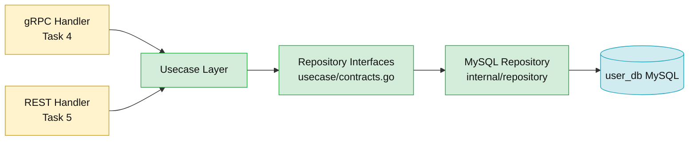
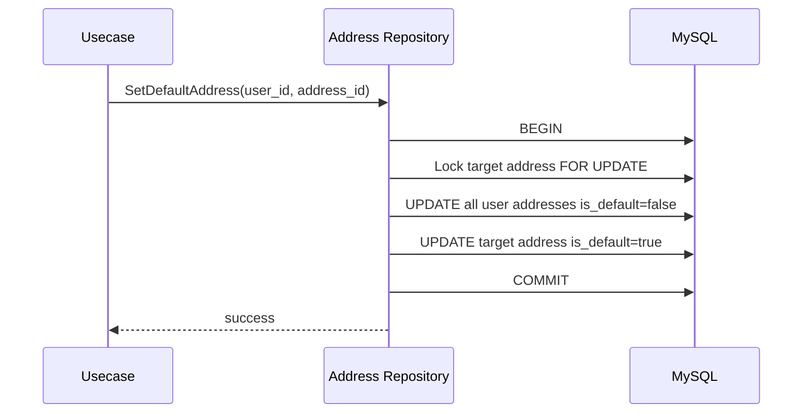
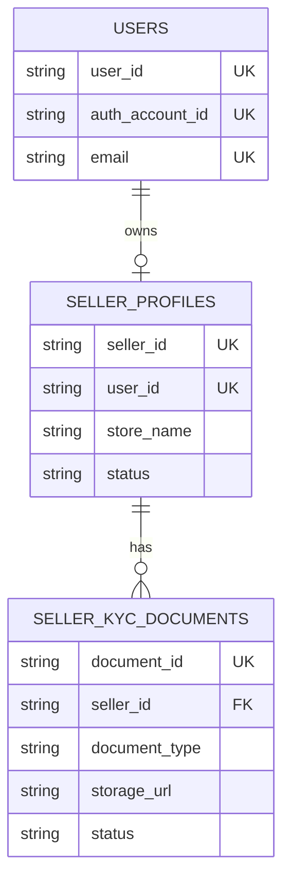
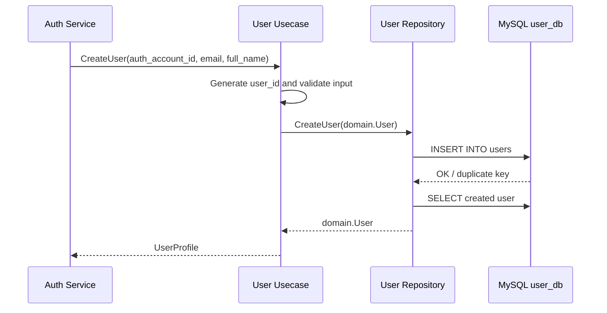
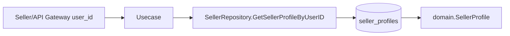

# 👤 User Service - Task 3: Implement Repository


## 📌 Task Summary

| Field | Detail |
|---|---|
| Task Name | Implement repository |
| Source | `docs/01-micro-tasks.md` → `User Service` → Task 3 |
| Priority | `P0` core persistence layer |
| Dependency | User Service Task 2: Create MySQL schema |
| Main Goal | DB queries ko repository layer me rakhna |
| Core Boundary | Business logic ko MySQL details se independent rakhna |
| Output Type | Structured implementation guide |
| Not Included | gRPC service, REST APIs, validation middleware, event publisher, Redis cache |

> **Simple Hinglish goal:** Is task ka purpose User Service ke liye repository layer design aur implement karna hai. Repository ka kaam MySQL queries chalana, rows ko domain objects me map karna, duplicate/not-found errors ko clean domain errors me convert karna, aur transactions handle karna hai. Usecase layer ko SQL, table names, joins, null handling, ya MySQL error codes ke baare me direct knowledge nahi honi chahiye.

---

## ✅ Final Output Created

```text
TaskImplementation/
├── Auth Service/
├── Platform Foundation/
└── User Service/
    ├── task1.md
    ├── task2.md
    └── task3.md
```

### Why this structure?

- `TaskImplementation/` project ke task-wise implementation guides ka central folder hai.
- `User Service/` folder already present tha, isliye usko preserve kiya gaya.
- `task3.md` sirf **User Service - Task 3** ka guide hai.
- Existing `task1.md`, `task2.md`, Auth Service guides, Platform Foundation guides, aur backend code untouched rakhe gaye.
- Actual `backend/services/user-service/` code files create nahi kiye gaye, kyunki requested output sirf folder structure aur `task3.md` content generate karna hai.

---

## 🧭 Implementation Approach

Is guide ko banate time project ke official docs aur existing Auth Service implementation ko source of truth maana gaya:

| Document/File | Kya use kiya gaya |
|---|---|
| `docs/01-micro-tasks.md` | User Service Task 3 ka exact scope: repository layer |
| `TaskImplementation/User Service/task1.md` | User domain ownership and Auth/User boundary |
| `TaskImplementation/User Service/task2.md` | MySQL schema, table names, indexes, FK relationships |
| `docs/03-folder-structure.md` | Future `backend/services/user-service/internal/repository/` convention |
| `docs/04-microservice-design.md` | User Service responsibilities and gRPC methods |
| `docs/05-database-design.md` | User DB indexes and scalability notes |
| `database/draw.sql` | Final table DDL for `users`, `user_addresses`, `seller_profiles`, `seller_kyc_documents` |
| `api/master-api.json` | DTO expectations for user, address, and seller profile APIs |
| `backend/services/auth-service/internal/repository/` | Existing Go repository style: `database/sql`, constructor checks, domain error mapping |

---

## 🧱 Task Boundary

### ✅ Included in Task 3

- Repository interfaces define karna
- MySQL repository structs design karna
- `users` table ke create/read/update queries
- `user_addresses` table ke list/create/update/delete queries
- Default address update ke liye transaction flow
- `seller_profiles` table ke read/update queries
- `seller_kyc_documents` ke basic persistence queries
- SQL row scan helpers
- `sql.ErrNoRows` ko domain `not found` errors me map karna
- MySQL duplicate key errors ko domain duplicate errors me map karna
- Null handling helpers
- Unit/integration test strategy
- Mermaid diagrams and beginner-friendly explanation

### 🚫 Not Included in Task 3

- gRPC server implementation
- REST API handlers
- Request validation middleware
- Auth/JWT/RBAC middleware
- Event publishing like `UserCreated`, `SellerApproved`, `AddressUpdated`
- Redis profile cache
- Audit fields beyond existing `created_at` and `updated_at`
- Superadmin approval workflow implementation
- KYC file upload or object storage integration

> 🟢 **Rule:** Task 3 repository layer tak limited rahega. gRPC Task 4, REST APIs Task 5, validation Task 6, audit fields Task 7, aur events Task 8 me aayenge.

---

## 🗂️ Target Implementation Folder Structure

Future me actual repository implementation yahan rahegi:

```text
backend/
└── services/
    └── user-service/
        ├── cmd/
        │   └── server/
        │       └── main.go
        ├── internal/
        │   ├── domain/
        │   │   ├── errors.go
        │   │   ├── user.go
        │   │   ├── address.go
        │   │   └── seller_profile.go
        │   ├── usecase/
        │   │   └── contracts.go
        │   ├── repository/
        │   │   ├── mysql_user_repository.go
        │   │   ├── mysql_address_repository.go
        │   │   ├── mysql_seller_repository.go
        │   │   └── mysql_helpers.go
        │   └── config/
        │       └── config.go
        ├── migrations/
        │   ├── 001_create_user_tables.up.sql
        │   └── 001_create_user_tables.down.sql
        └── go.mod
```

### Folder responsibility

| Path | Responsibility |
|---|---|
| `internal/domain/` | User, address, seller, KYC entities and domain errors |
| `internal/usecase/contracts.go` | Repository interfaces jinke through usecases DB se baat karenge |
| `internal/repository/mysql_user_repository.go` | `users` table queries |
| `internal/repository/mysql_address_repository.go` | `user_addresses` table queries and address transactions |
| `internal/repository/mysql_seller_repository.go` | `seller_profiles` and `seller_kyc_documents` queries |
| `internal/repository/mysql_helpers.go` | Scan helpers, duplicate key helper, null helpers, affected row helper |
| `migrations/` | Task 2 ke MySQL tables |

---

## 🧩 Repository Architecture



### Hinglish explanation

Usecase layer ko sirf interface dikhega, concrete MySQL implementation nahi. Isse kal ko repository MySQL se read replica, cache-backed repository, ya test fake repository me change ho jaye, to business logic ka code stable rahega.

---

## 🔌 External Libraries / Tools

| Tool/Library | Type | Why used | Install | Use |
|---|---|---|---|---|
| Go `database/sql` | Standard library | DB access ke liye stable, lightweight interface | Install nahi karna hota | `sql.DB`, `QueryRowContext`, `ExecContext`, transactions |
| `github.com/go-sql-driver/mysql` | Go MySQL driver | MySQL se connect karne aur duplicate key error `1062` detect karne ke liye | `go get github.com/go-sql-driver/mysql` | Blank import in main/config, typed error check in repository |
| MySQL 8+ | Database | User profile structured relational data ke liye | Docker Compose ya local MySQL | `user_db` schema run karke repository queries test karo |
| `golang-migrate/migrate` | Migration tool | Task 2 ke `.up.sql`/`.down.sql` safely apply/rollback karne ke liye | `go install github.com/golang-migrate/migrate/v4/cmd/migrate@latest` | `migrate -path migrations -database "$USER_DB_DSN" up` |
| `github.com/DATA-DOG/go-sqlmock` | Test helper | Unit tests me real MySQL ke bina expected SQL behavior verify karne ke liye | `go get github.com/DATA-DOG/go-sqlmock` | Repository methods ke duplicate/not-found/transaction tests |

### Important decision

Is repository layer me ORM use nahi karna. Project ke existing Auth Service repository style ke according explicit SQL + `database/sql` use karna better hai:

- SQL queries visible rahengi.
- Index usage easily reason kiya ja sakta hai.
- Hidden ORM behavior avoid hoga.
- Transactions predictable rahenge.

---

## 🪜 Step-by-Step Implementation

## Step 1: Repository contract define karo

Usecase layer ko concrete MySQL struct directly import nahi karna chahiye. Iske liye interfaces `internal/usecase/contracts.go` me define honge.

```go
package usecase

import (
    "context"

    "github.com/example/ecommerce-platform/backend/services/user-service/internal/domain"
)

type UserRepository interface {
    CreateUser(ctx context.Context, user domain.User) (domain.User, error)
    FindUserByID(ctx context.Context, userID string) (domain.User, error)
    FindUserByAuthAccountID(ctx context.Context, authAccountID string) (domain.User, error)
    BatchFindUsers(ctx context.Context, userIDs []string) ([]domain.User, error)
    UpdateUserProfile(ctx context.Context, userID string, patch domain.UserProfilePatch) (domain.User, error)
}

type AddressRepository interface {
    ListAddresses(ctx context.Context, userID string, limit int, offset int) ([]domain.Address, error)
    CreateAddress(ctx context.Context, address domain.Address) (domain.Address, error)
    UpdateAddress(ctx context.Context, address domain.Address) (domain.Address, error)
    DeleteAddress(ctx context.Context, userID string, addressID string) error
    SetDefaultAddress(ctx context.Context, userID string, addressID string) error
}

type SellerRepository interface {
    GetSellerProfileByUserID(ctx context.Context, userID string) (domain.SellerProfile, error)
    GetSellerProfileBySellerID(ctx context.Context, sellerID string) (domain.SellerProfile, error)
    UpdateSellerProfile(ctx context.Context, seller domain.SellerProfilePatch) (domain.SellerProfile, error)
    AddKYCDocument(ctx context.Context, document domain.KYCDocument) (domain.KYCDocument, error)
    ListKYCDocuments(ctx context.Context, sellerID string) ([]domain.KYCDocument, error)
}
```

### Why interfaces?

| Benefit | Explanation |
|---|---|
| Loose coupling | Usecase ko MySQL package import nahi karna padega |
| Easy testing | Unit tests me fake repository inject ho sakti hai |
| Future flexibility | Cache/read-replica wrapper add karna easy hoga |
| Clean architecture | Domain/usecase outer infrastructure se independent rahenge |

---

## Step 2: Domain errors define karo

Repository raw SQL errors return nahi karegi. Clean domain errors return karegi, jise usecase/gRPC/REST layer properly map kar sake.

```go
package domain

import "errors"

var (
    ErrUserNotFound        = errors.New("user not found")
    ErrDuplicateUser       = errors.New("user already exists")
    ErrAddressNotFound     = errors.New("address not found")
    ErrDuplicateAddress    = errors.New("address already exists")
    ErrSellerNotFound      = errors.New("seller profile not found")
    ErrDuplicateSeller     = errors.New("seller profile already exists")
    ErrKYCDocumentNotFound = errors.New("kyc document not found")
    ErrDuplicateKYCDocument = errors.New("kyc document already exists")
)
```

### Error mapping rule

| DB Error | Domain Error |
|---|---|
| `sql.ErrNoRows` while finding user | `domain.ErrUserNotFound` |
| MySQL duplicate key while inserting user | `domain.ErrDuplicateUser` |
| `RowsAffected() == 0` while updating address | `domain.ErrAddressNotFound` |
| MySQL duplicate key while inserting seller | `domain.ErrDuplicateSeller` |

---

## Step 3: Domain structs ready karo

Repository row scan karne ke liye domain structs clear hone chahiye. Ye structs Task 1 domain aur Task 2 schema ke according honge.

```go
package domain

import "time"

type UserStatus string

const (
    UserStatusActive  UserStatus = "active"
    UserStatusBlocked UserStatus = "blocked"
    UserStatusDeleted UserStatus = "deleted"
)

type User struct {
    UserID        string
    AuthAccountID string
    Email         string
    Phone         *string
    FullName      string
    AvatarURL     *string
    Status        UserStatus
    CreatedAt     time.Time
    UpdatedAt     time.Time
}

type UserProfilePatch struct {
    FullName  *string
    Phone     *string
    AvatarURL *string
}
```

Address domain:

```go
type Address struct {
    AddressID  string
    UserID     string
    Name       string
    Phone      *string
    Line1      string
    Line2      *string
    City       string
    State      string
    PostalCode string
    Country    string
    IsDefault  bool
    CreatedAt  time.Time
    UpdatedAt  time.Time
    DeletedAt  *time.Time
}
```

Seller profile domain:

```go
type SellerStatus string

const (
    SellerStatusDraft         SellerStatus = "draft"
    SellerStatusPendingReview SellerStatus = "pending_review"
    SellerStatusActive        SellerStatus = "active"
    SellerStatusSuspended     SellerStatus = "suspended"
    SellerStatusRejected      SellerStatus = "rejected"
)

type SellerProfile struct {
    SellerID     string
    UserID       string
    StoreName    string
    DisplayName  *string
    GSTNumber    *string
    SupportEmail *string
    Status       SellerStatus
    ApprovedBy   *string
    ApprovedAt   *time.Time
    CreatedAt    time.Time
    UpdatedAt    time.Time
}

type SellerProfilePatch struct {
    SellerID     string
    StoreName    *string
    DisplayName  *string
    GSTNumber    *string
    SupportEmail *string
}
```

---

## Step 4: MySQL repository constructor banao

Project ke existing Auth Service pattern ke according constructor nil DB guard ke saath banana chahiye.

```go
package repository

import (
    "database/sql"
    "errors"
)

type MySQLUserRepository struct {
    db *sql.DB
}

func NewMySQLUserRepository(db *sql.DB) (*MySQLUserRepository, error) {
    if db == nil {
        return nil, errors.New("db is required")
    }
    return &MySQLUserRepository{db: db}, nil
}
```

### Hinglish explanation

Constructor me `db == nil` check simple lagta hai, but ye production bugs prevent karta hai. Agar config galat ho aur DB initialize na hua ho, service startup pe hi clear error mil jayega.

---

## Step 5: `CreateUser` query implement karo

`CreateUser` Auth Service signup ke baad internal call se use hoga. Repository ko pre-generated `user_id` receive karna chahiye. ID generation usecase/shared ID package ka concern rahega.

```go
func (r *MySQLUserRepository) CreateUser(ctx context.Context, user domain.User) (domain.User, error) {
    _, err := r.db.ExecContext(ctx, `
        INSERT INTO users (
            user_id,
            auth_account_id,
            email,
            phone,
            full_name,
            avatar_url,
            status
        ) VALUES (?, ?, ?, ?, ?, ?, ?)
    `,
        user.UserID,
        user.AuthAccountID,
        user.Email,
        nullableStringPtr(user.Phone),
        user.FullName,
        nullableStringPtr(user.AvatarURL),
        user.Status,
    )
    if err != nil {
        if isDuplicateKey(err) {
            return domain.User{}, domain.ErrDuplicateUser
        }
        return domain.User{}, fmt.Errorf("insert user: %w", err)
    }

    return r.FindUserByID(ctx, user.UserID)
}
```

### Why insert ke baad `FindUserByID`?

- DB-generated `created_at` and `updated_at` fresh values mil jaate hain.
- Response domain object consistent rahta hai.
- Future me DB defaults add hon to repository response automatically accurate rahega.

---

## Step 6: `FindUserByID` aur scan helper banao

Repeated scan logic ko helper me rakhna clean rahega.

```go
func (r *MySQLUserRepository) FindUserByID(ctx context.Context, userID string) (domain.User, error) {
    row := r.db.QueryRowContext(ctx, `
        SELECT
            user_id,
            auth_account_id,
            email,
            phone,
            full_name,
            avatar_url,
            status,
            created_at,
            updated_at
        FROM users
        WHERE user_id = ?
        LIMIT 1
    `, userID)

    user, err := scanUser(row)
    if err != nil {
        if errors.Is(err, sql.ErrNoRows) {
            return domain.User{}, domain.ErrUserNotFound
        }
        return domain.User{}, fmt.Errorf("query user by id: %w", err)
    }
    return user, nil
}
```

```go
func scanUser(row sqlScanner) (domain.User, error) {
    var (
        user      domain.User
        phone     sql.NullString
        avatarURL sql.NullString
        status    string
    )

    err := row.Scan(
        &user.UserID,
        &user.AuthAccountID,
        &user.Email,
        &phone,
        &user.FullName,
        &avatarURL,
        &status,
        &user.CreatedAt,
        &user.UpdatedAt,
    )
    if err != nil {
        return domain.User{}, err
    }

    user.Phone = nullStringPtr(phone)
    user.AvatarURL = nullStringPtr(avatarURL)
    user.Status = domain.UserStatus(status)
    user.CreatedAt = user.CreatedAt.UTC()
    user.UpdatedAt = user.UpdatedAt.UTC()

    return user, nil
}
```

### Why scan helper?

- `FindUserByID`, `FindUserByAuthAccountID`, aur `BatchFindUsers` same columns scan karenge.
- Null handling duplicate nahi hoga.
- Agar kal `avatar_url` ya status mapping change ho, one place update karna hoga.

---

## Step 7: `FindUserByAuthAccountID` implement karo

Auth Service ke account id se User profile resolve karna signup/session linking flows me useful hoga.

```go
func (r *MySQLUserRepository) FindUserByAuthAccountID(ctx context.Context, authAccountID string) (domain.User, error) {
    row := r.db.QueryRowContext(ctx, `
        SELECT
            user_id,
            auth_account_id,
            email,
            phone,
            full_name,
            avatar_url,
            status,
            created_at,
            updated_at
        FROM users
        WHERE auth_account_id = ?
        LIMIT 1
    `, authAccountID)

    user, err := scanUser(row)
    if err != nil {
        if errors.Is(err, sql.ErrNoRows) {
            return domain.User{}, domain.ErrUserNotFound
        }
        return domain.User{}, fmt.Errorf("query user by auth account id: %w", err)
    }
    return user, nil
}
```

### Index used

```sql
UNIQUE KEY uk_users_auth_account_id (auth_account_id)
```

Is index ke wajah se lookup fast and deterministic rahega.

---

## Step 8: `BatchFindUsers` implement karo

Order, cart, wishlist, recommendation jaise internal services ko kabhi multiple user profiles ek saath chahiye honge. Iske liye batch query useful hai.

```go
func (r *MySQLUserRepository) BatchFindUsers(ctx context.Context, userIDs []string) ([]domain.User, error) {
    if len(userIDs) == 0 {
        return []domain.User{}, nil
    }

    args := make([]any, 0, len(userIDs))
    for _, id := range userIDs {
        args = append(args, id)
    }

    query := `
        SELECT
            user_id,
            auth_account_id,
            email,
            phone,
            full_name,
            avatar_url,
            status,
            created_at,
            updated_at
        FROM users
        WHERE user_id IN (` + placeholders(len(userIDs)) + `)
        ORDER BY user_id
    `

    rows, err := r.db.QueryContext(ctx, query, args...)
    if err != nil {
        return nil, fmt.Errorf("query batch users: %w", err)
    }
    defer rows.Close()

    users := make([]domain.User, 0, len(userIDs))
    for rows.Next() {
        user, err := scanUser(rows)
        if err != nil {
            return nil, fmt.Errorf("scan batch user: %w", err)
        }
        users = append(users, user)
    }
    if err := rows.Err(); err != nil {
        return nil, fmt.Errorf("iterate batch users: %w", err)
    }

    return users, nil
}
```

```go
func placeholders(n int) string {
    if n <= 0 {
        return ""
    }
    parts := make([]string, n)
    for i := range parts {
        parts[i] = "?"
    }
    return strings.Join(parts, ",")
}
```

### Safety note

Yahan values SQL string me directly inject nahi ho rahi. Sirf `?` placeholders dynamic ban rahe hain, aur actual values `args` ke through parameterized query me ja rahi hain. Isse SQL injection risk avoid hota hai.

---

## Step 9: `UpdateUserProfile` implement karo

Profile update partial ho sakta hai: `full_name`, `phone`, `avatar_url`. Repository dynamic `SET` safely build karegi.

```go
func (r *MySQLUserRepository) UpdateUserProfile(ctx context.Context, userID string, patch domain.UserProfilePatch) (domain.User, error) {
    sets := make([]string, 0, 3)
    args := make([]any, 0, 4)

    if patch.FullName != nil {
        sets = append(sets, "full_name = ?")
        args = append(args, *patch.FullName)
    }
    if patch.Phone != nil {
        sets = append(sets, "phone = ?")
        args = append(args, *patch.Phone)
    }
    if patch.AvatarURL != nil {
        sets = append(sets, "avatar_url = ?")
        args = append(args, *patch.AvatarURL)
    }

    if len(sets) == 0 {
        return r.FindUserByID(ctx, userID)
    }

    args = append(args, userID)
    query := `
        UPDATE users
        SET ` + strings.Join(sets, ", ") + `
        WHERE user_id = ?
          AND status <> 'deleted'
    `

    result, err := r.db.ExecContext(ctx, query, args...)
    if err != nil {
        return domain.User{}, fmt.Errorf("update user profile: %w", err)
    }
    if err := ensureAffected(result, domain.ErrUserNotFound); err != nil {
        return domain.User{}, err
    }

    return r.FindUserByID(ctx, userID)
}
```

### Hinglish explanation

Usecase layer validate karegi ki name empty na ho, phone format sahi ho, avatar URL valid ho. Repository ka kaam sirf validated values ko DB me persist karna hai. Repository validation ka replacement nahi hai.

---

## Step 10: Address repository create karo

Address table soft delete use karta hai via `deleted_at`. Isliye list/update queries me `deleted_at IS NULL` condition mandatory hai.

```go
type MySQLAddressRepository struct {
    db *sql.DB
}

func NewMySQLAddressRepository(db *sql.DB) (*MySQLAddressRepository, error) {
    if db == nil {
        return nil, errors.New("db is required")
    }
    return &MySQLAddressRepository{db: db}, nil
}
```

### `ListAddresses`

```go
func (r *MySQLAddressRepository) ListAddresses(ctx context.Context, userID string, limit int, offset int) ([]domain.Address, error) {
    rows, err := r.db.QueryContext(ctx, `
        SELECT
            address_id,
            user_id,
            name,
            phone,
            line1,
            line2,
            city,
            state,
            postal_code,
            country,
            is_default,
            created_at,
            updated_at,
            deleted_at
        FROM user_addresses
        WHERE user_id = ?
          AND deleted_at IS NULL
        ORDER BY is_default DESC, updated_at DESC
        LIMIT ? OFFSET ?
    `, userID, limit, offset)
    if err != nil {
        return nil, fmt.Errorf("query user addresses: %w", err)
    }
    defer rows.Close()

    addresses := make([]domain.Address, 0, limit)
    for rows.Next() {
        address, err := scanAddress(rows)
        if err != nil {
            return nil, fmt.Errorf("scan address: %w", err)
        }
        addresses = append(addresses, address)
    }
    if err := rows.Err(); err != nil {
        return nil, fmt.Errorf("iterate addresses: %w", err)
    }

    return addresses, nil
}
```

### Index used

```sql
KEY idx_user_addresses_user_default (user_id, is_default)
```

Isse user ke addresses aur default address read fast rahega.

---

## Step 11: Address default update transaction banao

Ek user ke multiple default addresses nahi hone chahiye. Task 2 schema me filtered unique index nahi hai, isliye repository transaction se atomic update karegi.



```go
func (r *MySQLAddressRepository) SetDefaultAddress(ctx context.Context, userID string, addressID string) error {
    tx, err := r.db.BeginTx(ctx, &sql.TxOptions{Isolation: sql.LevelReadCommitted})
    if err != nil {
        return fmt.Errorf("begin set default address: %w", err)
    }
    defer func() {
        _ = tx.Rollback()
    }()

    var lockedAddressID string
    err = tx.QueryRowContext(ctx, `
        SELECT address_id
        FROM user_addresses
        WHERE user_id = ?
          AND address_id = ?
          AND deleted_at IS NULL
        LIMIT 1
        FOR UPDATE
    `, userID, addressID).Scan(&lockedAddressID)
    if err != nil {
        if errors.Is(err, sql.ErrNoRows) {
            return domain.ErrAddressNotFound
        }
        return fmt.Errorf("lock address: %w", err)
    }

    if _, err := tx.ExecContext(ctx, `
        UPDATE user_addresses
        SET is_default = FALSE
        WHERE user_id = ?
          AND deleted_at IS NULL
    `, userID); err != nil {
        return fmt.Errorf("clear default addresses: %w", err)
    }

    result, err := tx.ExecContext(ctx, `
        UPDATE user_addresses
        SET is_default = TRUE
        WHERE user_id = ?
          AND address_id = ?
          AND deleted_at IS NULL
    `, userID, addressID)
    if err != nil {
        return fmt.Errorf("set default address: %w", err)
    }
    if err := ensureAffected(result, domain.ErrAddressNotFound); err != nil {
        return err
    }

    if err := tx.Commit(); err != nil {
        return fmt.Errorf("commit set default address: %w", err)
    }
    return nil
}
```

### Why transaction zaruri hai?

Without transaction, race condition me two addresses default ban sakte hain. Transaction ensure karta hai ki clear-default and set-default ek atomic operation rahe.

---

## Step 12: Address create/update/delete implement karo

### Create address

```go
func (r *MySQLAddressRepository) CreateAddress(ctx context.Context, address domain.Address) (domain.Address, error) {
    _, err := r.db.ExecContext(ctx, `
        INSERT INTO user_addresses (
            address_id,
            user_id,
            name,
            phone,
            line1,
            line2,
            city,
            state,
            postal_code,
            country,
            is_default
        ) VALUES (?, ?, ?, ?, ?, ?, ?, ?, ?, ?, ?)
    `,
        address.AddressID,
        address.UserID,
        address.Name,
        nullableStringPtr(address.Phone),
        address.Line1,
        nullableStringPtr(address.Line2),
        address.City,
        address.State,
        address.PostalCode,
        address.Country,
        address.IsDefault,
    )
    if err != nil {
        if isDuplicateKey(err) {
            return domain.Address{}, domain.ErrDuplicateAddress
        }
        return domain.Address{}, fmt.Errorf("insert address: %w", err)
    }

    return r.findAddress(ctx, address.UserID, address.AddressID)
}
```

### Soft delete address

```go
func (r *MySQLAddressRepository) DeleteAddress(ctx context.Context, userID string, addressID string) error {
    result, err := r.db.ExecContext(ctx, `
        UPDATE user_addresses
        SET
            deleted_at = CURRENT_TIMESTAMP,
            is_default = FALSE
        WHERE user_id = ?
          AND address_id = ?
          AND deleted_at IS NULL
    `, userID, addressID)
    if err != nil {
        return fmt.Errorf("soft delete address: %w", err)
    }
    return ensureAffected(result, domain.ErrAddressNotFound)
}
```

### Important note

Delete ke baad agar deleted address default tha, to usecase layer decide karegi ki next default address auto-select karna hai ya user ko manually choose karne dena hai. Repository sirf safe persistence operation karegi.

---

## Step 13: Seller repository implement karo

Seller profile user se one-to-one linked hai.



### `GetSellerProfileByUserID`

```go
func (r *MySQLSellerRepository) GetSellerProfileByUserID(ctx context.Context, userID string) (domain.SellerProfile, error) {
    row := r.db.QueryRowContext(ctx, `
        SELECT
            seller_id,
            user_id,
            store_name,
            display_name,
            gst_number,
            support_email,
            status,
            approved_by,
            approved_at,
            created_at,
            updated_at
        FROM seller_profiles
        WHERE user_id = ?
        LIMIT 1
    `, userID)

    seller, err := scanSellerProfile(row)
    if err != nil {
        if errors.Is(err, sql.ErrNoRows) {
            return domain.SellerProfile{}, domain.ErrSellerNotFound
        }
        return domain.SellerProfile{}, fmt.Errorf("query seller by user id: %w", err)
    }
    return seller, nil
}
```

### `UpdateSellerProfile`

```go
func (r *MySQLSellerRepository) UpdateSellerProfile(ctx context.Context, patch domain.SellerProfilePatch) (domain.SellerProfile, error) {
    sets := make([]string, 0, 4)
    args := make([]any, 0, 5)

    if patch.StoreName != nil {
        sets = append(sets, "store_name = ?")
        args = append(args, *patch.StoreName)
    }
    if patch.DisplayName != nil {
        sets = append(sets, "display_name = ?")
        args = append(args, *patch.DisplayName)
    }
    if patch.GSTNumber != nil {
        sets = append(sets, "gst_number = ?")
        args = append(args, *patch.GSTNumber)
    }
    if patch.SupportEmail != nil {
        sets = append(sets, "support_email = ?")
        args = append(args, *patch.SupportEmail)
    }

    if len(sets) == 0 {
        return r.GetSellerProfileBySellerID(ctx, patch.SellerID)
    }

    args = append(args, patch.SellerID)
    query := `
        UPDATE seller_profiles
        SET ` + strings.Join(sets, ", ") + `
        WHERE seller_id = ?
    `

    result, err := r.db.ExecContext(ctx, query, args...)
    if err != nil {
        return domain.SellerProfile{}, fmt.Errorf("update seller profile: %w", err)
    }
    if err := ensureAffected(result, domain.ErrSellerNotFound); err != nil {
        return domain.SellerProfile{}, err
    }

    return r.GetSellerProfileBySellerID(ctx, patch.SellerID)
}
```

### Boundary note

Seller approval/rejection ka final workflow Superadmin se connected hoga. Repository seller status update support kar sakti hai, but approval business rules Task 7/Task 8 ya Superadmin integration me handle honge.

---

## Step 14: KYC document persistence add karo

Task 2 schema me actual file binary store nahi hoti. Repository sirf metadata store karegi.

```go
func (r *MySQLSellerRepository) AddKYCDocument(ctx context.Context, doc domain.KYCDocument) (domain.KYCDocument, error) {
    _, err := r.db.ExecContext(ctx, `
        INSERT INTO seller_kyc_documents (
            document_id,
            seller_id,
            document_type,
            storage_url,
            status
        ) VALUES (?, ?, ?, ?, ?)
    `, doc.DocumentID, doc.SellerID, doc.DocumentType, doc.StorageURL, doc.Status)
    if err != nil {
        if isDuplicateKey(err) {
            return domain.KYCDocument{}, domain.ErrDuplicateKYCDocument
        }
        return domain.KYCDocument{}, fmt.Errorf("insert kyc document: %w", err)
    }

    return r.getKYCDocument(ctx, doc.DocumentID)
}
```

```go
func (r *MySQLSellerRepository) ListKYCDocuments(ctx context.Context, sellerID string) ([]domain.KYCDocument, error) {
    rows, err := r.db.QueryContext(ctx, `
        SELECT
            document_id,
            seller_id,
            document_type,
            storage_url,
            status,
            reviewed_by,
            reviewed_at,
            rejection_reason,
            created_at
        FROM seller_kyc_documents
        WHERE seller_id = ?
        ORDER BY created_at DESC
    `, sellerID)
    if err != nil {
        return nil, fmt.Errorf("query kyc documents: %w", err)
    }
    defer rows.Close()

    documents := []domain.KYCDocument{}
    for rows.Next() {
        document, err := scanKYCDocument(rows)
        if err != nil {
            return nil, fmt.Errorf("scan kyc document: %w", err)
        }
        documents = append(documents, document)
    }
    if err := rows.Err(); err != nil {
        return nil, fmt.Errorf("iterate kyc documents: %w", err)
    }
    return documents, nil
}
```

### Hinglish explanation

KYC file upload ka kaam repository ka nahi hai. File S3/MinIO/CDN-like object storage me jayegi. Repository sirf `storage_url`, `document_type`, aur review metadata save karegi.

---

## Step 15: Common helper functions add karo

Existing Auth Service repository me bhi similar helpers use ho rahe hain. User Service me bhi same pattern follow karna chahiye.

```go
type sqlScanner interface {
    Scan(dest ...any) error
}
```

```go
func nullableStringPtr(value *string) any {
    if value == nil {
        return nil
    }
    return *value
}

func nullStringPtr(value sql.NullString) *string {
    if !value.Valid {
        return nil
    }
    return &value.String
}

func nullTimePtr(value sql.NullTime) *time.Time {
    if !value.Valid {
        return nil
    }
    t := value.Time.UTC()
    return &t
}
```

```go
func ensureAffected(result sql.Result, notFound error) error {
    affected, err := result.RowsAffected()
    if err != nil {
        return fmt.Errorf("read rows affected: %w", err)
    }
    if affected == 0 {
        return notFound
    }
    return nil
}
```

```go
func isDuplicateKey(err error) bool {
    var mysqlErr *mysql.MySQLError
    return errors.As(err, &mysqlErr) && mysqlErr.Number == 1062
}
```

### Why helper file?

- Null handling repeated nahi hota.
- Duplicate key handling consistent hoti hai.
- Update/delete operations ka `RowsAffected` behavior same rahta hai.
- Repository code readable banta hai.

---

## Step 16: Repository transaction rules follow karo

| Operation | Transaction? | Why |
|---|---:|---|
| `CreateUser` | ❌ | Single insert, unique keys enough |
| `FindUserByID` | ❌ | Single read |
| `UpdateUserProfile` | ❌ | Single update + read |
| `SetDefaultAddress` | ✅ | Multiple rows update, atomic default selection needed |
| `DeleteAddress` | ❌ | Single soft delete |
| `CreateSellerProfile` | ❌/✅ | Single insert no transaction, profile + initial KYC together ho to transaction |
| `AddKYCDocument` | ❌ | Single insert |

### Transaction pattern

```go
tx, err := r.db.BeginTx(ctx, &sql.TxOptions{Isolation: sql.LevelReadCommitted})
if err != nil {
    return fmt.Errorf("begin transaction: %w", err)
}
defer func() {
    _ = tx.Rollback()
}()

// queries...

if err := tx.Commit(); err != nil {
    return fmt.Errorf("commit transaction: %w", err)
}
```

### Why deferred rollback safe hai?

Commit ke baad rollback no-op/fail ho sakta hai, but ignored hai. Agar beech me error return hua, rollback connection ko clean state me laata hai.

---

## Step 17: Query and index alignment check karo

Repository queries ko Task 2 indexes ke saath align rakhna zaruri hai.

| Query | Index |
|---|---|
| `FindUserByID(user_id)` | `uk_users_user_id` |
| `FindUserByAuthAccountID(auth_account_id)` | `uk_users_auth_account_id` |
| `ListAddresses(user_id, is_default)` | `idx_user_addresses_user_default` |
| `GetSellerProfileByUserID(user_id)` | `uk_seller_profiles_user_id` |
| `GetSellerProfileBySellerID(seller_id)` | `uk_seller_profiles_seller_id` |
| `ListKYCDocuments(seller_id, status)` | `idx_kyc_seller_status` |

### Performance rule

Repository me aise queries avoid karo jo table scan karenge:

```sql
-- Avoid
SELECT * FROM users WHERE full_name LIKE '%abc%';
```

User search/admin filtering later Superadmin/read-model/search feature me aayega. Task 3 repository core profile lookup ke liye optimized rahe.

---

## Step 18: Testing strategy add karo

Repository tests do layers me useful hain:

| Test Type | Tool | Purpose |
|---|---|---|
| Unit test | `go-sqlmock` | SQL call, args, duplicate key, no rows, transaction behavior |
| Integration test | Real MySQL/Testcontainers/Docker Compose | Schema + real driver + FK/index behavior verify |

### Unit test example

```go
func TestMySQLUserRepositoryFindUserByIDNotFound(t *testing.T) {
    db, mock, err := sqlmock.New()
    require.NoError(t, err)
    defer db.Close()

    repo, err := repository.NewMySQLUserRepository(db)
    require.NoError(t, err)

    mock.ExpectQuery("SELECT(.+)FROM users").
        WithArgs("user_missing").
        WillReturnError(sql.ErrNoRows)

    _, err = repo.FindUserByID(context.Background(), "user_missing")
    require.ErrorIs(t, err, domain.ErrUserNotFound)
    require.NoError(t, mock.ExpectationsWereMet())
}
```

### Transaction test cases

| Method | Test |
|---|---|
| `SetDefaultAddress` | Begin → lock target → clear defaults → set target → commit |
| `SetDefaultAddress` not found | Begin → lock target returns `sql.ErrNoRows` → rollback |
| `CreateUser` duplicate | MySQL `1062` error → `domain.ErrDuplicateUser` |
| `DeleteAddress` no rows | `RowsAffected() == 0` → `domain.ErrAddressNotFound` |

---

## 🔁 Repository Flow Diagrams

### Create user flow



### Address list flow

```mermaid
flowchart TD
    A[Usecase ListAddresses] --> B[Repository ListAddresses]
    B --> C{Valid limit/offset?}
    C -->|Usecase validated| D[SELECT active addresses]
    D --> E[Scan rows into domain.Address]
    E --> F[Return []Address]
```

### Seller profile read flow



---

## 🧪 Verification Commands

Actual backend files create hone ke baad ye commands use karne chahiye:

```bash
cd backend/services/user-service
go test ./...
```

Repository package targeted test:

```bash
go test ./internal/repository -run TestMySQLUserRepository
```

Migration apply check:

```bash
migrate -path migrations -database "$USER_DB_DSN" up
```

Manual MySQL sanity checks:

```sql
SELECT user_id, auth_account_id, email, status
FROM users
WHERE user_id = 'user_123';

SELECT address_id, is_default
FROM user_addresses
WHERE user_id = 'user_123'
  AND deleted_at IS NULL
ORDER BY is_default DESC, updated_at DESC;

SELECT seller_id, user_id, store_name, status
FROM seller_profiles
WHERE user_id = 'user_123';
```

---

## ✅ Acceptance Checklist

| Check | Expected Result |
|---|---|
| Repository interfaces exist | Usecase layer interfaces depend on `domain`, not MySQL |
| MySQL repositories exist | Concrete structs use `*sql.DB` |
| Constructor validates DB | Nil DB returns clear error |
| Create user handles duplicate | MySQL `1062` maps to `domain.ErrDuplicateUser` |
| User lookup handles not found | `sql.ErrNoRows` maps to `domain.ErrUserNotFound` |
| Address list excludes deleted rows | `deleted_at IS NULL` present |
| Default address is atomic | Transaction clears old default and sets new default |
| Seller profile lookup works | Supports lookup by `user_id` and `seller_id` |
| KYC metadata persists | Stores document metadata, not file binary |
| Tests cover repository behavior | Not-found, duplicate, update no rows, transaction success/failure |

---

## 🟢 Final Beginner-Friendly Summary

User Service Task 3 me hum repository layer banate hain. Ye layer MySQL aur business logic ke beech adapter ka kaam karti hai.

- Usecase bolega: "user create karo" ya "address list lao".
- Repository decide karegi kaunsi SQL query chalani hai.
- MySQL result ko repository domain object me convert karegi.
- Raw DB errors ko clean domain errors me map karegi.
- Multi-step DB operation, jaise default address change, transaction me run hoga.

Is approach se code clean, testable, aur scalable rahega. Future me gRPC, REST, validation, events, ya cache add karne par repository contract stable rahega.

---

## 📦 Scope Completion

```text
User Service Task 1: Domain defined ✅
User Service Task 2: MySQL schema documented ✅
User Service Task 3: Repository implementation guide documented ✅

Next task:
User Service Task 4: Implement gRPC service
```

