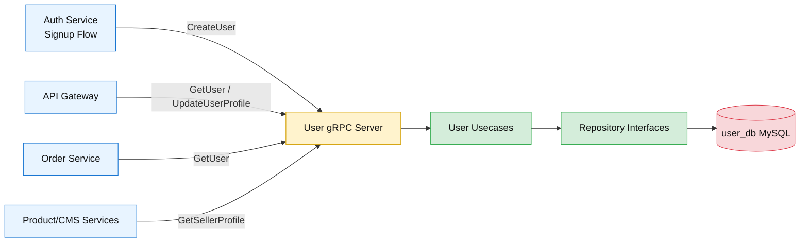
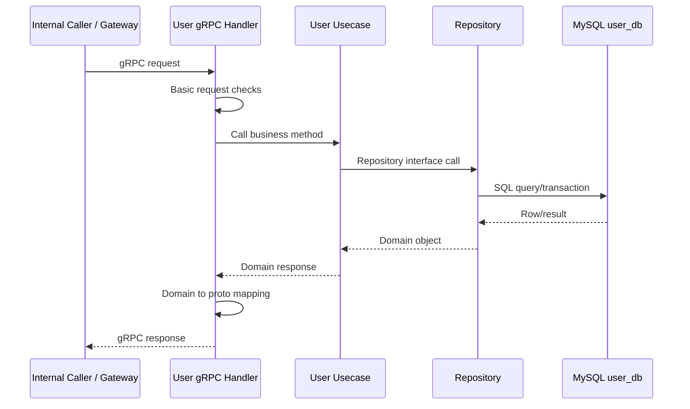
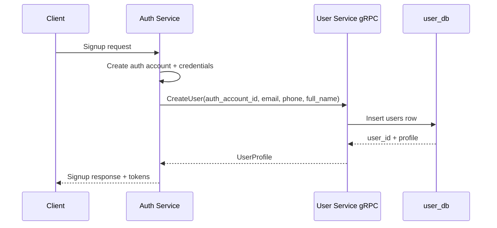
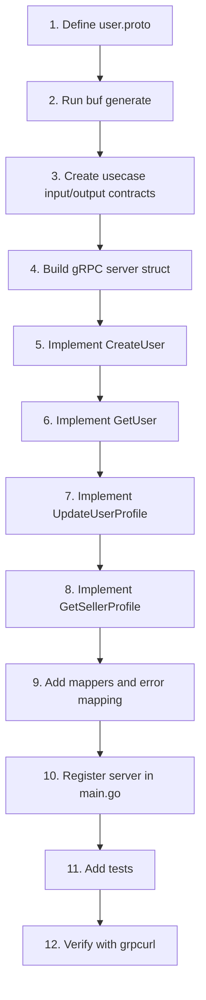

# 👤 User Service - Task 4: Implement gRPC Service


## 📌 Task Summary

| Field | Detail |
|---|---|
| Task Name | Implement gRPC service |
| Source | `docs/01-micro-tasks.md` → `User Service` → Task 4 |
| Priority | `P0` internal service contract |
| Dependency | Platform Foundation proto strategy + User Service Task 3 repository |
| Main Goal | `GetUser`, `CreateUser`, `UpdateUser`, `GetSellerProfile` methods banana |
| Project Method Name | `UpdateUser` ko project API me `UpdateUserProfile` name se align kiya gaya hai |
| Core Boundary | gRPC layer request/response mapping karega, business logic usecase layer me rahegi |
| Output Type | Structured implementation guide |
| Not Included | REST profile APIs, address CRUD gRPC methods, validation task, audit task, user events |

> **Simple Hinglish goal:** Is task ka purpose User Service ke internal gRPC endpoints banana hai, jisse Auth Service, API Gateway, Order Service, Product Service, Superadmin Service jaise internal consumers direct profile data le sakein. gRPC handler sirf transport layer hai: request validate-lite karega, auth context read karega, usecase call karega, domain object ko proto response me map karega, aur errors ko proper gRPC status codes me convert karega.

---

## ✅ Final Output Created

```text
TaskImplementation/
├── Auth Service/
├── Platform Foundation/
└── User Service/
    ├── task1.md
    ├── task2.md
    ├── task3.md
    └── task4.md
```

### Why this structure?

- `TaskImplementation/` project ke task-wise implementation guides ka central folder hai.
- `User Service/` folder already present tha, isliye usko preserve kiya gaya.
- `task4.md` sirf **User Service - Task 4** ka guide hai.
- Existing `task1.md`, `task2.md`, `task3.md`, Auth Service guides, Platform Foundation guides, aur backend code untouched rakhe gaye.
- Actual `backend/services/user-service/` source code create nahi kiya gaya, kyunki requested output folder structure aur `task4.md` content hai.

---

## 🧭 Implementation Approach

Is guide ko banate time project ke official docs aur existing User Service task docs ko source of truth maana gaya:

| Document/File | Kya use kiya gaya |
|---|---|
| `docs/01-micro-tasks.md` | User Service Task 4 ka exact scope: gRPC service |
| `TaskImplementation/User Service/task1.md` | User domain boundary and Auth/User ownership split |
| `TaskImplementation/User Service/task2.md` | MySQL schema and entity fields |
| `TaskImplementation/User Service/task3.md` | Repository contracts and persistence layer |
| `docs/02-system-architecture.md` | Internal gRPC rules, service deadlines, no cross-service DB access |
| `docs/03-folder-structure.md` | `proto/ecommerce/user/v1/user.proto` and generated code conventions |
| `docs/04-microservice-design.md` | User Service methods and responsibilities |
| `docs/13-developer-guide.md` | Backend flow: proto → generated clients → usecase → repository → gRPC handler |
| `api/master-api.json` | UserService package, method names, request/response schemas |

---

## 🧱 Task Boundary

### ✅ Included in Task 4

- `proto/ecommerce/user/v1/user.proto` contract design
- `CreateUser` gRPC method
- `GetUser` gRPC method
- `UpdateUserProfile` gRPC method, Task wording me `UpdateUser`
- `GetSellerProfile` gRPC method
- Request/response proto message examples
- Go gRPC server structure
- Usecase dependency interface
- Domain-to-proto mapper examples
- gRPC status code error mapping
- Auth context and internal caller boundary
- Server registration and reflection setup
- Unit and handler test strategy
- Mermaid diagrams and beginner-friendly explanation
- External libraries/tools explanation with install commands

### 🚫 Not Included in Task 4

- REST APIs like `GET /api/v1/me` and `PATCH /api/v1/me`
- Address methods: `ListUserAddresses`, `CreateAddress`, `UpdateAddress`, `DeleteAddress`
- Runtime validation task for email, phone, GST, address
- Audit fields beyond existing domain timestamps
- Events like `UserCreated`, `SellerApproved`, `AddressUpdated`
- Redis profile cache
- Superadmin approval workflow implementation
- KYC file upload/object storage integration
- API Gateway route implementation

> 🟢 **Rule:** Task 4 gRPC transport tak limited rahega. REST APIs Task 5, validation Task 6, audit fields Task 7, aur user events Task 8 me aayenge.

---

## 🗂️ Target Implementation Folder Structure

Future me actual gRPC implementation ka clean structure ye hoga:

```text
proto/
└── ecommerce/
    └── user/
        └── v1/
            └── user.proto

backend/
├── shared/
│   └── gen/
│       └── go/
│           └── ecommerce/
│               └── user/
│                   └── v1/
│                       ├── user.pb.go
│                       └── user_grpc.pb.go
└── services/
    └── user-service/
        ├── cmd/
        │   └── server/
        │       └── main.go
        ├── internal/
        │   ├── domain/
        │   │   ├── errors.go
        │   │   ├── user.go
        │   │   └── seller_profile.go
        │   ├── usecase/
        │   │   ├── contracts.go
        │   │   ├── create_user.go
        │   │   ├── get_user.go
        │   │   ├── update_profile.go
        │   │   └── seller_profile.go
        │   ├── repository/
        │   │   ├── mysql_user_repository.go
        │   │   └── mysql_seller_repository.go
        │   ├── transport/
        │   │   └── grpc/
        │   │       ├── server.go
        │   │       ├── mapper.go
        │   │       ├── errors.go
        │   │       └── server_test.go
        │   └── config/
        │       └── config.go
        ├── migrations/
        │   ├── 001_create_user_tables.up.sql
        │   └── 001_create_user_tables.down.sql
        └── go.mod
```

### Folder responsibility

| Path | Responsibility |
|---|---|
| `proto/ecommerce/user/v1/user.proto` | User Service ka versioned gRPC contract |
| `backend/shared/gen/go/...` | `buf generate` se generated Go proto code |
| `internal/transport/grpc/server.go` | Actual gRPC method handlers |
| `internal/transport/grpc/mapper.go` | Domain structs ko proto messages me convert karega |
| `internal/transport/grpc/errors.go` | Domain errors ko gRPC status codes me map karega |
| `internal/usecase/` | Business workflows: create, get, update, seller profile read |
| `internal/repository/` | Task 3 ka MySQL persistence implementation |
| `cmd/server/main.go` | gRPC server start, dependency wiring, graceful shutdown |

> 🟡 **Important:** Ye target implementation structure hai. Is Task 4 me documentation guide create ki gayi hai, service code nahi.

---

## 🏗️ gRPC Architecture



### Hinglish explanation

Browser directly User Service ke gRPC server ko call nahi karega. Browser REST API Gateway ko call karega. Gateway JWT validate karega, user context inject karega, aur phir User Service gRPC call karega. Internal services bhi profile data chahiye hone par gRPC use karenge, direct `user_db` read nahi karenge.

---

## 🔌 External Libraries / Tools

| Library/Tool | What it is | Why used | Install | Use |
|---|---|---|---|---|
| `buf` CLI | Protobuf build/generation tool | Proto lint, breaking checks, aur Go/TS clients generate karne ke liye | `go install github.com/bufbuild/buf/cmd/buf@latest` | `buf generate` |
| `google.golang.org/grpc` | Go gRPC runtime | Unary RPC server, status codes, interceptors ke liye | `go get google.golang.org/grpc` | `grpc.NewServer(...)` |
| `google.golang.org/protobuf` | Go protobuf runtime | Generated messages, timestamps, field masks ke liye | `go get google.golang.org/protobuf` | `timestamppb.New(...)` |
| `protoc-gen-go` | Go protobuf code generator | `.proto` se `*.pb.go` generate karne ke liye | `go install google.golang.org/protobuf/cmd/protoc-gen-go@latest` | `buf generate` ke through |
| `protoc-gen-go-grpc` | Go gRPC code generator | `.proto` se `*_grpc.pb.go` generate karne ke liye | `go install google.golang.org/grpc/cmd/protoc-gen-go-grpc@latest` | `buf generate` ke through |
| `grpcurl` | gRPC manual testing CLI | Local gRPC methods ko curl-like test karne ke liye | `go install github.com/fullstorydev/grpcurl/cmd/grpcurl@latest` | `grpcurl -plaintext localhost:50052 list` |
| `grpc/reflection` | Go gRPC reflection package | Local debugging ke liye service methods discoverable banane ke liye | gRPC module ke saath available | `reflection.Register(server)` |

### Install commands

```bash
go install github.com/bufbuild/buf/cmd/buf@latest
go install google.golang.org/protobuf/cmd/protoc-gen-go@latest
go install google.golang.org/grpc/cmd/protoc-gen-go-grpc@latest
go install github.com/fullstorydev/grpcurl/cmd/grpcurl@latest
go get google.golang.org/grpc
go get google.golang.org/protobuf
```

### Why these tools?

- `buf` proto files ko consistent rakhta hai.
- `grpc-go` actual gRPC server chalata hai.
- `protobuf` strongly typed request/response messages deta hai.
- `grpcurl` se frontend/gateway ready hone se pehle bhi gRPC service manually test ho sakti hai.

---

## 🧩 Proto Contract

Task 4 ka first real step proto contract define karna hai. Project convention ke according file path:

```text
proto/ecommerce/user/v1/user.proto
```

### Recommended `user.proto`

```proto
syntax = "proto3";

package ecommerce.user.v1;

option go_package = "github.com/example/ecommerce-platform/backend/shared/gen/go/ecommerce/user/v1;userv1";

import "google/protobuf/field_mask.proto";
import "google/protobuf/timestamp.proto";

service UserService {
  rpc CreateUser(CreateUserRequest) returns (UserProfile);
  rpc GetUser(GetUserRequest) returns (UserProfile);
  rpc UpdateUserProfile(UpdateUserProfileRequest) returns (UserProfile);
  rpc GetSellerProfile(GetSellerProfileRequest) returns (SellerProfile);
}

message CreateUserRequest {
  string auth_account_id = 1;
  string email = 2;
  string phone = 3;
  string full_name = 4;
}

message GetUserRequest {
  string user_id = 1;
}

message UpdateUserProfileRequest {
  string user_id = 1;
  string full_name = 2;
  string phone = 3;
  string avatar_url = 4;
  google.protobuf.FieldMask update_mask = 5;
}

message GetSellerProfileRequest {
  string seller_id = 1;
  string user_id = 2;
}

message UserProfile {
  string user_id = 1;
  string auth_account_id = 2;
  string email = 3;
  string phone = 4;
  string full_name = 5;
  string avatar_url = 6;
  string status = 7;
  google.protobuf.Timestamp created_at = 8;
  google.protobuf.Timestamp updated_at = 9;
}

message SellerProfile {
  string seller_id = 1;
  string user_id = 2;
  string store_name = 3;
  string display_name = 4;
  string gst_number = 5;
  string support_email = 6;
  string status = 7;
  google.protobuf.Timestamp approved_at = 8;
  google.protobuf.Timestamp created_at = 9;
  google.protobuf.Timestamp updated_at = 10;
}
```

### Why `UpdateUserProfile` instead of `UpdateUser`?

`docs/01-micro-tasks.md` me short wording `UpdateUser` hai, but `api/master-api.json` aur `docs/04-microservice-design.md` me official method name `UpdateUserProfile` hai. Isliye implementation project contract ke saath align karegi.

### Why `FieldMask`?

Partial update me sirf changed fields update hone chahiye. Agar client sirf `full_name` update kare, to empty `phone` accidentally DB me overwrite nahi hona chahiye.

Example:

```json
{
  "user_id": "user_123",
  "full_name": "Aarav Sharma",
  "update_mask": {
    "paths": ["full_name"]
  }
}
```

---

## 🔄 gRPC Method Flow



### Layer rule

| Layer | Kya karega | Kya nahi karega |
|---|---|---|
| gRPC handler | Request mapping, auth context read, error mapping | SQL query, business decision |
| Usecase | Business rules and repository orchestration | Proto import nahi karega |
| Repository | MySQL queries and row mapping | gRPC status return nahi karega |
| Domain | Entities and domain errors | DB/transport packages import nahi karega |

---

## 🪜 Step-by-Step Implementation

## Step 1: Proto file create karo

Sabse pehle `proto/ecommerce/user/v1/user.proto` create/update karo. Is file me service methods and request/response messages define honge.

### Important rules

- Package versioned hoga: `ecommerce.user.v1`
- Breaking change future me `v2` package me jayega.
- Existing fields delete/rename nahi karne.
- New optional fields add karte time new tag number use karna.
- `user_id`, `seller_id`, `auth_account_id` string IDs rahenge.

### Hinglish explanation

Proto contract ek agreement hai. Gateway, Auth Service, User Service, aur future clients sab isi agreement ko follow karenge. Contract stable hoga to services independently deploy ho sakengi.

---

## Step 2: Generated Go code banao

Proto update ke baad generated clients create karo.

```bash
buf generate
```

Expected generated files:

```text
backend/shared/gen/go/ecommerce/user/v1/user.pb.go
backend/shared/gen/go/ecommerce/user/v1/user_grpc.pb.go
```

### Generated files ka role

| File | Role |
|---|---|
| `user.pb.go` | Request/response Go structs |
| `user_grpc.pb.go` | `UserServiceServer` interface and registration helpers |

### Important

Generated files ko manually edit nahi karna. Proto change karo, phir `buf generate` run karo.

---

## Step 3: Usecase interface define karo

gRPC server ko usecase layer ke through business logic call karni chahiye. Handler direct repository use nahi karega.

```go
package grpc

import (
    "context"

    "github.com/example/ecommerce-platform/backend/services/user-service/internal/domain"
    "github.com/example/ecommerce-platform/backend/services/user-service/internal/usecase"
)

type UserUsecase interface {
    CreateUser(ctx context.Context, input usecase.CreateUserInput) (domain.User, error)
    GetUser(ctx context.Context, input usecase.GetUserInput) (domain.User, error)
    UpdateUserProfile(ctx context.Context, input usecase.UpdateUserProfileInput) (domain.User, error)
    GetSellerProfile(ctx context.Context, input usecase.GetSellerProfileInput) (domain.SellerProfile, error)
}
```

### Why interface?

- gRPC tests me fake usecase inject ho sakta hai.
- Transport layer loosely coupled rahegi.
- Future me tracing/logging wrapper add karna easy rahega.

---

## Step 4: gRPC server struct banao

`internal/transport/grpc/server.go` me server struct define karo.

```go
package grpc

import (
    userv1 "github.com/example/ecommerce-platform/backend/shared/gen/go/ecommerce/user/v1"
)

type Server struct {
    userv1.UnimplementedUserServiceServer
    users UserUsecase
}

func NewServer(users UserUsecase) *Server {
    if users == nil {
        panic("user usecase is required")
    }

    return &Server{users: users}
}
```

### Why `UnimplementedUserServiceServer` embed karte hain?

gRPC Go generated code forward compatibility ke liye ye expect karta hai. Agar future me proto me new method add ho aur handler implement na ho, to server compile/runtime behavior safer rahega.

---

## Step 5: `CreateUser` method implement karo

`CreateUser` mostly Auth Service signup ke baad call karega. Auth Service credentials create karega, phir User Service profile create karega.



### Handler code example

```go
func (s *Server) CreateUser(ctx context.Context, req *userv1.CreateUserRequest) (*userv1.UserProfile, error) {
    if req.GetAuthAccountId() == "" {
        return nil, status.Error(codes.InvalidArgument, "auth_account_id is required")
    }
    if req.GetEmail() == "" {
        return nil, status.Error(codes.InvalidArgument, "email is required")
    }
    if req.GetFullName() == "" {
        return nil, status.Error(codes.InvalidArgument, "full_name is required")
    }

    user, err := s.users.CreateUser(ctx, usecase.CreateUserInput{
        AuthAccountID: req.GetAuthAccountId(),
        Email:         req.GetEmail(),
        Phone:         req.GetPhone(),
        FullName:      req.GetFullName(),
    })
    if err != nil {
        return nil, mapError(err)
    }

    return mapUserProfile(user), nil
}
```

### Hinglish explanation

Handler basic required fields check karta hai. Deep validation, jaise email format, phone format, length limits, Task 6 me centralized validation layer ke through aayega. Yahan ka goal request ko usecase input me convert karke profile create karna hai.

---

## Step 6: `GetUser` method implement karo

`GetUser` profile lookup ke liye use hoga. Gateway `/api/v1/me`, Order Service buyer info, aur internal services ye call kar sakti hain.

```go
func (s *Server) GetUser(ctx context.Context, req *userv1.GetUserRequest) (*userv1.UserProfile, error) {
    if req.GetUserId() == "" {
        return nil, status.Error(codes.InvalidArgument, "user_id is required")
    }

    user, err := s.users.GetUser(ctx, usecase.GetUserInput{
        UserID: req.GetUserId(),
    })
    if err != nil {
        return nil, mapError(err)
    }

    return mapUserProfile(user), nil
}
```

### Access boundary

| Caller | Allowed? | Rule |
|---|---:|---|
| API Gateway for current buyer | ✅ | JWT user id should match requested `user_id` |
| Internal Order Service | ✅ | Service identity should be trusted by mTLS/service auth |
| Random public client | ❌ | Direct public access banned |
| Another service reading `user_db` directly | ❌ | Cross-service DB access banned |

### Hinglish explanation

`GetUser` ek simple read method lagta hai, but security boundary important hai. User Service internal gRPC hai. Public browser ko direct access nahi milega. Gateway ya trusted service hi call karegi.

---

## Step 7: `UpdateUserProfile` method implement karo

Task wording me `UpdateUser` hai, but project API name `UpdateUserProfile` hai. Is method se user apna profile name, phone, avatar update karega.

```go
func (s *Server) UpdateUserProfile(ctx context.Context, req *userv1.UpdateUserProfileRequest) (*userv1.UserProfile, error) {
    if req.GetUserId() == "" {
        return nil, status.Error(codes.InvalidArgument, "user_id is required")
    }

    input := usecase.UpdateUserProfileInput{
        UserID:    req.GetUserId(),
        FullName:  req.GetFullName(),
        Phone:     req.GetPhone(),
        AvatarURL: req.GetAvatarUrl(),
        Mask:      req.GetUpdateMask().GetPaths(),
    }

    user, err := s.users.UpdateUserProfile(ctx, input)
    if err != nil {
        return nil, mapError(err)
    }

    return mapUserProfile(user), nil
}
```

### Field mask handling

| `update_mask.paths` | Result |
|---|---|
| `["full_name"]` | Sirf full name update |
| `["phone"]` | Sirf phone update |
| `["avatar_url"]` | Sirf avatar URL update |
| `["full_name", "phone"]` | Name and phone update |
| Empty mask | Reject as `InvalidArgument` ya usecase policy ke according no-op reject |

### Hinglish explanation

Patch request me empty string ka matlab clear nahi hota: user field clear karna chahta hai ya client ne field bheja hi nahi? `FieldMask` ye ambiguity solve karta hai. Jo paths mask me honge, sirf wahi update honge.

---

## Step 8: `GetSellerProfile` method implement karo

Seller profile `seller_id` ya `user_id` se fetch ho sakta hai. CMS/Product/Order side ko seller details chahiye ho sakti hain.

```go
func (s *Server) GetSellerProfile(ctx context.Context, req *userv1.GetSellerProfileRequest) (*userv1.SellerProfile, error) {
    if req.GetSellerId() == "" && req.GetUserId() == "" {
        return nil, status.Error(codes.InvalidArgument, "seller_id or user_id is required")
    }

    seller, err := s.users.GetSellerProfile(ctx, usecase.GetSellerProfileInput{
        SellerID: req.GetSellerId(),
        UserID:   req.GetUserId(),
    })
    if err != nil {
        return nil, mapError(err)
    }

    return mapSellerProfile(seller), nil
}
```

### Lookup rule

| Input | Behavior |
|---|---|
| Only `seller_id` | Seller profile by `seller_id` |
| Only `user_id` | Seller profile by owner user |
| Both provided | Prefer strict policy: both must match same seller |
| Neither provided | `InvalidArgument` |

### Hinglish explanation

Seller profile user se linked hota hai, but platform flows me kabhi `seller_id` available hota hai, kabhi `user_id`. Isliye request dono support kar sakti hai. Usecase strict check karega ki mismatch data leak na ho.

---

## Step 9: Domain-to-proto mapper banao

Transport layer ka mapper domain objects ko generated proto messages me convert karega.

```go
package grpc

import (
    "time"

    userv1 "github.com/example/ecommerce-platform/backend/shared/gen/go/ecommerce/user/v1"
    "github.com/example/ecommerce-platform/backend/services/user-service/internal/domain"
    "google.golang.org/protobuf/types/known/timestamppb"
)

func mapUserProfile(user domain.User) *userv1.UserProfile {
    return &userv1.UserProfile{
        UserId:        user.UserID,
        AuthAccountId: user.AuthAccountID,
        Email:         user.Email,
        Phone:         stringValue(user.Phone),
        FullName:      user.FullName,
        AvatarUrl:     stringValue(user.AvatarURL),
        Status:        string(user.Status),
        CreatedAt:     toProtoTime(user.CreatedAt),
        UpdatedAt:     toProtoTime(user.UpdatedAt),
    }
}

func mapSellerProfile(seller domain.SellerProfile) *userv1.SellerProfile {
    return &userv1.SellerProfile{
        SellerId:     seller.SellerID,
        UserId:       seller.UserID,
        StoreName:    seller.StoreName,
        DisplayName:  seller.DisplayName,
        GstNumber:    stringValue(seller.GSTNumber),
        SupportEmail: stringValue(seller.SupportEmail),
        Status:       string(seller.Status),
        ApprovedAt:   toProtoTimePtr(seller.ApprovedAt),
        CreatedAt:    toProtoTime(seller.CreatedAt),
        UpdatedAt:    toProtoTime(seller.UpdatedAt),
    }
}

func stringValue(value *string) string {
    if value == nil {
        return ""
    }
    return *value
}

func toProtoTime(value time.Time) *timestamppb.Timestamp {
    if value.IsZero() {
        return nil
    }
    return timestamppb.New(value)
}

func toProtoTimePtr(value *time.Time) *timestamppb.Timestamp {
    if value == nil {
        return nil
    }
    return toProtoTime(*value)
}
```

### Why mapper separate file me?

- Handler readable rahega.
- Mapping tests separately likhe ja sakte hain.
- Future REST DTO/proto differences easily handle honge.

---

## Step 10: Domain errors ko gRPC status me map karo

Repository/usecase domain errors return karenge. gRPC handler unko status codes me convert karega.

```go
package grpc

import (
    "errors"

    "github.com/example/ecommerce-platform/backend/services/user-service/internal/domain"
    "google.golang.org/grpc/codes"
    "google.golang.org/grpc/status"
)

func mapError(err error) error {
    switch {
    case errors.Is(err, domain.ErrUserNotFound):
        return status.Error(codes.NotFound, "user not found")
    case errors.Is(err, domain.ErrDuplicateUser):
        return status.Error(codes.AlreadyExists, "user already exists")
    case errors.Is(err, domain.ErrSellerNotFound):
        return status.Error(codes.NotFound, "seller profile not found")
    case errors.Is(err, domain.ErrDuplicateSeller):
        return status.Error(codes.AlreadyExists, "seller profile already exists")
    case errors.Is(err, domain.ErrForbidden):
        return status.Error(codes.PermissionDenied, "permission denied")
    case errors.Is(err, domain.ErrInvalidArgument):
        return status.Error(codes.InvalidArgument, "invalid request")
    default:
        return status.Error(codes.Internal, "internal error")
    }
}
```

### Error mapping table

| Domain Error | gRPC Code | Meaning |
|---|---|---|
| `ErrUserNotFound` | `NotFound` | Requested user exist nahi karta |
| `ErrDuplicateUser` | `AlreadyExists` | Same auth account/email already profile se linked hai |
| `ErrSellerNotFound` | `NotFound` | Seller profile exist nahi karta |
| `ErrForbidden` | `PermissionDenied` | Caller allowed nahi hai |
| `ErrInvalidArgument` | `InvalidArgument` | Request invalid hai |
| Unknown error | `Internal` | Unexpected server issue |

### Hinglish explanation

Raw SQL error ya internal error message caller ko leak nahi karna. gRPC status code consistent rahega, message short and safe rahega. Detailed error structured logs me jayega.

---

## Step 11: gRPC server register karo

`cmd/server/main.go` me DB, repository, usecase, and gRPC server wire honge.

```go
package main

import (
    "log"
    "net"

    userv1 "github.com/example/ecommerce-platform/backend/shared/gen/go/ecommerce/user/v1"
    transportgrpc "github.com/example/ecommerce-platform/backend/services/user-service/internal/transport/grpc"
    "google.golang.org/grpc"
    "google.golang.org/grpc/reflection"
)

func main() {
    listener, err := net.Listen("tcp", ":50052")
    if err != nil {
        log.Fatalf("listen: %v", err)
    }

    userUsecase := buildUserUsecase()

    grpcServer := grpc.NewServer(
        // Unary interceptors yahan add honge: request id, recovery, logging, tracing, auth.
    )

    userv1.RegisterUserServiceServer(grpcServer, transportgrpc.NewServer(userUsecase))
    reflection.Register(grpcServer)

    log.Println("user-service gRPC listening on :50052")
    if err := grpcServer.Serve(listener); err != nil {
        log.Fatalf("serve: %v", err)
    }
}
```

### Production notes

- Local dev me reflection useful hai.
- Production me reflection policy environment based honi chahiye.
- gRPC server graceful shutdown support karega.
- Interceptors add honge: request ID, panic recovery, logging, tracing, auth/service identity.

---

## Step 12: Auth context and caller identity handle karo

User Service internal gRPC hai, but phir bhi caller context important hai.

### Caller types

| Caller | Example | Required context |
|---|---|---|
| Auth Service | `CreateUser` after signup | service identity |
| API Gateway | `GetUser`, `UpdateUserProfile` | `user_id`, roles, request id |
| Superadmin Service | status/admin flows in future | admin user id, role |
| Order/Product/CMS | read profile/seller info | service identity |

### Metadata example

```text
x-request-id: req_123
x-user-id: user_123
x-roles: buyer,seller
x-service-name: api-gateway
```

### Hinglish explanation

JWT validation Gateway/Auth boundary me hoti hai. User Service ko trusted metadata milega. Service fir bhi ownership checks karega, jaise buyer apna profile update kar raha hai ya nahi.

---

## Step 13: Deadlines and timeouts enforce karo

`docs/02-system-architecture.md` ke according gRPC deadlines mandatory hain.

### Recommended deadlines

| Method | Suggested timeout | Reason |
|---|---:|---|
| `GetUser` | `300ms-700ms` | Simple indexed DB read |
| `CreateUser` | `1s-1.5s` | Insert + unique checks |
| `UpdateUserProfile` | `700ms-1s` | Patch update + readback |
| `GetSellerProfile` | `300ms-700ms` | Indexed seller/user lookup |

### Client-side example

```go
ctx, cancel := context.WithTimeout(parentCtx, 700*time.Millisecond)
defer cancel()

profile, err := userClient.GetUser(ctx, &userv1.GetUserRequest{
    UserId: "user_123",
})
```

### Server-side rule

Handler incoming `ctx` ko repository tak pass karega. Agar client deadline exceed ho gayi, DB query cancel ho sakti hai.

---

## Step 14: Manual testing with `grpcurl`

Local server run hone ke baad `grpcurl` se test kar sakte ho.

### List services

```bash
grpcurl -plaintext localhost:50052 list
```

### Describe service

```bash
grpcurl -plaintext localhost:50052 describe ecommerce.user.v1.UserService
```

### Create user

```bash
grpcurl -plaintext \
  -d '{"auth_account_id":"auth_123","email":"buyer@example.com","phone":"+919999999999","full_name":"Aarav Sharma"}' \
  localhost:50052 ecommerce.user.v1.UserService/CreateUser
```

### Get user

```bash
grpcurl -plaintext \
  -d '{"user_id":"user_123"}' \
  localhost:50052 ecommerce.user.v1.UserService/GetUser
```

### Update user profile

```bash
grpcurl -plaintext \
  -d '{"user_id":"user_123","full_name":"Aarav S.","update_mask":{"paths":["full_name"]}}' \
  localhost:50052 ecommerce.user.v1.UserService/UpdateUserProfile
```

### Get seller profile

```bash
grpcurl -plaintext \
  -d '{"seller_id":"seller_123"}' \
  localhost:50052 ecommerce.user.v1.UserService/GetSellerProfile
```

---

## 🧪 Testing Strategy

### Handler unit tests

| Test Case | Expected Result |
|---|---|
| `CreateUser` missing `auth_account_id` | `InvalidArgument` |
| `CreateUser` duplicate user | `AlreadyExists` |
| `GetUser` missing `user_id` | `InvalidArgument` |
| `GetUser` unknown user | `NotFound` |
| `UpdateUserProfile` with valid mask | Updated `UserProfile` |
| `UpdateUserProfile` unknown user | `NotFound` |
| `GetSellerProfile` missing ids | `InvalidArgument` |
| `GetSellerProfile` unknown seller | `NotFound` |

### Example test structure

```go
func TestGetUserReturnsNotFound(t *testing.T) {
    fake := &fakeUserUsecase{
        getUserErr: domain.ErrUserNotFound,
    }

    server := NewServer(fake)
    _, err := server.GetUser(context.Background(), &userv1.GetUserRequest{
        UserId: "user_missing",
    })

    if status.Code(err) != codes.NotFound {
        t.Fatalf("status.Code() = %v, want %v", status.Code(err), codes.NotFound)
    }
}
```

### Integration tests

Integration tests me actual MySQL test container ya local DB ke saath flow test hoga:

1. Migration apply karo.
2. User gRPC server start karo.
3. `CreateUser` call karo.
4. `GetUser` se verify karo.
5. `UpdateUserProfile` call karo.
6. `GetSellerProfile` seeded seller ke saath verify karo.

### Contract tests

- `buf lint`
- `buf breaking`
- Generated Go code compile
- API Gateway client generated code ke saath compile

---

## 🧯 Security and Reliability Checklist

| Check | Why important |
|---|---|
| Direct public gRPC access block | User Service internal-only service hai |
| Request ID metadata pass-through | Debugging and tracing easy hota hai |
| Deadlines required | Hanging calls resource exhaust kar sakte hain |
| Domain errors sanitized | Internal SQL/details leak nahi honge |
| Update ownership check | Buyer dusre user ka profile update na kar sake |
| Service identity check | Sirf trusted internal services `CreateUser` call karein |
| No password fields in proto | Auth/User ownership clean rahega |
| No KYC binary in response | Sensitive files object storage/CDN policy ke through access honge |
| Logs structured and PII-safe | Email/phone masking production logs me zaruri hai |

---

## ✅ Method-by-Method Acceptance Criteria

### `CreateUser`

- Required fields: `auth_account_id`, `email`, `full_name`
- Creates a new `users` row through usecase/repository
- Duplicate auth account/email ko `AlreadyExists` return kare
- Response me `UserProfile` return ho
- Password/token/role data accept na kare

### `GetUser`

- Required field: `user_id`
- Indexed lookup through repository
- Missing user par `NotFound`
- Blocked/deleted users ke visibility rules usecase me apply hon
- Response me profile fields only hon

### `UpdateUserProfile`

- Required field: `user_id`
- Patch fields: `full_name`, `phone`, `avatar_url`
- `update_mask` ke through partial update
- Unknown user par `NotFound`
- Caller ownership/RBAC check supported ho

### `GetSellerProfile`

- At least one of `seller_id` or `user_id` required
- Seller profile lookup repository se ho
- Missing seller par `NotFound`
- If both ids provided, mismatch par `InvalidArgument` ya `PermissionDenied`
- Response me seller metadata ho, KYC document binaries nahi

---

## 🚦 Implementation Order



### Beginner-friendly explanation

Pehle contract banta hai, phir generated code. Generated code ke baad handler compile ho sakta hai. Handler usecase ko call karta hai. Usecase Task 3 repository ko call karta hai. Finally test se verify hota hai ki gRPC method correct response aur correct error code de raha hai.

---

## 🧾 Clean Code Rules

- Handler me SQL query nahi likhni.
- Usecase me proto package import nahi karna.
- Repository me gRPC status code return nahi karna.
- Domain errors reusable hone chahiye.
- Mapper functions small and testable hone chahiye.
- Required field checks handler me okay hain, deep validation Task 6 me centralize hogi.
- All outbound/inbound calls context-aware hone chahiye.
- Unknown internal errors caller ko sanitized `Internal` code ke saath milne chahiye.

---

## 🧠 Final Hinglish Summary

User Service Task 4 me humne User Service ko internal gRPC contract diya. Is contract ke through Auth Service signup ke baad profile create karega, Gateway user profile read/update karega, aur internal services seller/user profile data safely fetch karenge.

Sabse important architecture decision ye hai ki gRPC handler business logic ka owner nahi hai. Handler sirf request ko usecase input me convert karega, usecase ko call karega, domain output ko proto response me map karega, aur errors ko proper gRPC status codes me convert karega. Isse service maintainable, testable, aur future REST/API Gateway integration ke liye ready rahegi.

