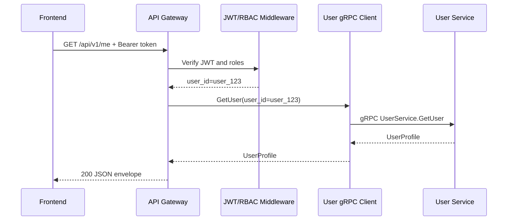
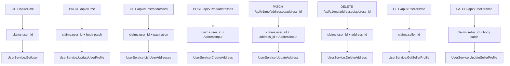

# 👤 User Service - Task 5: Add REST Profile APIs


## 📌 Task Summary

| Field | Detail |
|---|---|
| Task Name | Add REST profile APIs |
| Source | `docs/01-micro-tasks.md` → `User Service` → Task 5 |
| Priority | `P1` frontend-facing profile access |
| Dependency | User Service Task 4: Implement gRPC service |
| Main Goal | Gateway ke through profile view/update aur address CRUD REST APIs expose karna |
| Core Boundary | Browser REST call karega, API Gateway JWT/RBAC check karega, aur Gateway User Service ko gRPC se call karega |
| Output Type | Structured implementation guide |
| Not Included | Deep validation rules, audit expansion, user events, Redis cache, DB schema changes |

> **Simple Hinglish goal:** Is task ka purpose frontend ke liye simple REST APIs banana hai. User app ko profile dekhna/update karna, addresses manage karna, aur seller dashboard ko seller profile dekhna/update karna easy REST endpoints ke through milega. Actual profile business logic User Service me rahegi, aur public traffic API Gateway se pass hoga.

---

## ✅ Final Output Created

```text
TaskImplementation/
├── Auth Service/
├── Platform Foundation/
└── User Service/
    ├── task1.md
    ├── task2.md
    ├── task3.md
    ├── task4.md
    └── task5.md
```

### Why this structure?

- `TaskImplementation/` already project ke task-wise guides ka central folder hai.
- `User Service/` folder already present tha, isliye usko preserve kiya gaya.
- `task5.md` sirf **User Service - Task 5** ka implementation guide hai.
- Existing `task1.md` to `task4.md`, Auth Service guides, Platform Foundation guides, aur backend source files untouched rakhe gaye.
- Actual backend source code create nahi kiya gaya, kyunki requested output folder structure aur complete `task5.md` content hai.

---

## 🧭 Implementation Approach

Is guide ko banate time project ke official docs aur existing User Service task guides ko source of truth maana gaya:

| Document/File | Kya use kiya gaya |
|---|---|
| `docs/01-micro-tasks.md` | User Service Task 5 ka exact scope: REST profile APIs |
| `TaskImplementation/User Service/task1.md` | User domain boundary and Auth/User ownership split |
| `TaskImplementation/User Service/task2.md` | User, address, seller tables and relationships |
| `TaskImplementation/User Service/task3.md` | Repository contracts and domain errors |
| `TaskImplementation/User Service/task4.md` | gRPC service dependency and proto mapping style |
| `docs/02-system-architecture.md` | Browser → API Gateway REST → internal gRPC service flow |
| `docs/03-folder-structure.md` | API Gateway handlers/clients and User Service folder conventions |
| `docs/04-microservice-design.md` | User Service REST route list and address limit rule |
| `docs/06-auth-security.md` | JWT claims, RBAC, validation layers, route-level security |
| `docs/10-frontend-implementation.md` | Frontend REST client expectations and response envelope idea |
| `docs/13-developer-guide.md` | Backend layer rules, REST response convention, testing strategy |
| `api/master-api.json` | Final REST paths, schema names, auth labels, and gRPC method mapping |
| `backend/services/auth-service/internal/transport/http/` | Existing Go HTTP style using `net/http`, DTOs, middleware, and error helpers |

---

## 🧱 Task Boundary

### ✅ Included in Task 5

- `GET /api/v1/me` profile view endpoint
- `PATCH /api/v1/me` profile update endpoint
- `GET /api/v1/me/addresses` address list endpoint
- `POST /api/v1/me/addresses` address create endpoint
- `PATCH /api/v1/me/addresses/{address_id}` address update endpoint
- `DELETE /api/v1/me/addresses/{address_id}` address delete endpoint
- `GET /api/v1/sellers/me` seller profile view endpoint
- `PATCH /api/v1/sellers/me` seller profile update endpoint
- API Gateway route mapping to User Service gRPC client
- Auth context usage from JWT claims
- REST request/response DTO examples
- REST error mapping from gRPC/domain errors
- Handler and router structure
- Mermaid architecture and flow diagrams
- External tools/libraries explanation
- Test and manual verification strategy

### 🚫 Not Included in Task 5

- MySQL table changes
- Repository implementation changes
- Password, OTP, JWT, or role assignment logic
- Deep email/phone/address/GST validation rules, which are Task 6
- Audit field expansion like `created_by` / `updated_by`, which is Task 7
- Event publishing like `AddressUpdated`, which is Task 8
- Redis profile cache
- Superadmin seller approval workflow
- KYC upload and document review implementation
- Frontend UI implementation

> 🟢 **Rule:** Task 5 REST transport layer tak limited rahega. Gateway REST request receive karega, user identity context set karega, User Service gRPC method call karega, aur frontend-friendly JSON response return karega.

---

## 🗂️ Target Implementation Folder Structure

Future me actual REST implementation ka clean target structure ye hoga:

```text
backend/
├── shared/
│   ├── authctx/
│   │   ├── claims.go
│   │   └── context.go
│   ├── errors/
│   │   ├── grpc_mapping.go
│   │   └── http_mapping.go
│   └── middleware/
│       ├── request_id.go
│       └── recovery.go
└── services/
    ├── api-gateway/
    │   ├── cmd/
    │   │   └── server/
    │   │       └── main.go
    │   └── internal/
    │       ├── clients/
    │       │   └── user_client.go
    │       ├── handlers/
    │       │   ├── user_handler.go
    │       │   ├── user_dto.go
    │       │   ├── response.go
    │       │   └── errors.go
    │       ├── middleware/
    │       │   ├── jwt.go
    │       │   └── rbac.go
    │       └── routes/
    │           └── routes.go
    └── user-service/
        └── internal/
            └── transport/
                └── grpc/
                    ├── server.go
                    ├── mapper.go
                    └── errors.go
```

### Folder responsibility

| Path | Responsibility |
|---|---|
| `api-gateway/internal/handlers/user_handler.go` | REST route handlers: profile, address, seller self profile |
| `api-gateway/internal/handlers/user_dto.go` | REST request and response DTO structs |
| `api-gateway/internal/handlers/response.go` | Standard `data/request_id/error` JSON envelope helper |
| `api-gateway/internal/handlers/errors.go` | gRPC/domain errors ko HTTP status + API error code me map karega |
| `api-gateway/internal/clients/user_client.go` | Generated User Service gRPC client wrapper |
| `api-gateway/internal/middleware/jwt.go` | JWT verify karke claims context me inject karega |
| `api-gateway/internal/middleware/rbac.go` | Buyer/seller route-level permission check karega |
| `api-gateway/internal/routes/routes.go` | Public REST routes register karega |
| `user-service/internal/transport/grpc/` | Task 4 ka internal gRPC server, jisko Gateway call karega |

> 🟡 **Important:** Public REST API ka primary owner API Gateway hai. User Service business logic and DB ownership rakhega, but browser direct User Service DB ya internal gRPC ko access nahi karega.

---

## 🏗️ REST Architecture

```mermaid
flowchart LR
    Browser[React User App<br/>Seller Dashboard] -->|REST JSON| GW[API Gateway]
    GW --> JWT[JWT Middleware<br/>Auth/RBAC]
    JWT --> Handler[User REST Handler]
    Handler --> Client[User gRPC Client]
    Client --> UserGRPC[User Service gRPC]
    UserGRPC --> Usecase[User Usecases]
    Usecase --> Repo[Repository Interfaces]
    Repo --> DB[(user_db MySQL)]

    classDef client fill:#e8f4ff,stroke:#1976d2,color:#111;
    classDef gateway fill:#fff3cd,stroke:#d39e00,color:#111;
    classDef service fill:#d4edda,stroke:#28a745,color:#111;
    classDef db fill:#f8d7da,stroke:#dc3545,color:#111;

    class Browser client;
    class GW,JWT,Handler,Client gateway;
    class UserGRPC,Usecase,Repo service;
    class DB db;
```



### Hinglish explanation

Frontend ko REST easy lagta hai, isliye browser `/api/v1/me` jaisi URLs call karega. Gateway token verify karega, `user_id` aur `seller_id` claims context me rakhega, phir User Service gRPC call karega. User Service apni DB own karega. Gateway kabhi `user_db` directly read/write nahi karega.

---

## 🔌 External Libraries / Tools

| Library/Tool | What it is | Why used | Install | Use |
|---|---|---|---|---|
| Go `net/http` | Standard HTTP server/router package | Existing Auth Service style ke saath consistent simple REST handlers ke liye | Install nahi karna hota | `http.ServeMux`, `http.HandlerFunc`, `httptest` |
| Go `encoding/json` | Standard JSON package | Request body decode aur response encode ke liye | Install nahi karna hota | `json.Decoder`, `DisallowUnknownFields`, `json.Encoder` |
| `google.golang.org/grpc` | Go gRPC runtime | API Gateway se User Service ko internal typed call karne ke liye | `go get google.golang.org/grpc` | Generated `UserServiceClient` call |
| `google.golang.org/protobuf` | Protobuf runtime | Generated proto messages, timestamps, field masks ke liye | `go get google.golang.org/protobuf` | `fieldmaskpb.FieldMask`, generated DTOs |
| `buf` CLI | Proto generation/linting tool | User Service gRPC client code generate karne ke liye | `go install github.com/bufbuild/buf/cmd/buf@latest` | `buf generate` |
| `grpcurl` | gRPC testing CLI | Gateway issue debug karne ke liye direct User Service gRPC call test kar sakte ho | `go install github.com/fullstorydev/grpcurl/cmd/grpcurl@latest` | `grpcurl -plaintext localhost:50052 list` |
| `curl` | HTTP testing CLI | REST endpoints manually verify karne ke liye | Usually OS me available | `curl -H "Authorization: Bearer ..."` |

### Install commands

```bash
go get google.golang.org/grpc
go get google.golang.org/protobuf
go install github.com/bufbuild/buf/cmd/buf@latest
go install github.com/fullstorydev/grpcurl/cmd/grpcurl@latest
```

### Important library decision

Is task me separate router framework like `chi` ya `gorilla/mux` add karna zaruri nahi hai. Project ke existing Auth Service HTTP transport me `net/http` use ho raha hai, aur Go 1.24+ project prerequisite me already hai. Isliye standard library router enough hai.

> 🟡 **Validation note:** `go-playground/validator` jaisi validation library Task 6 me useful ho sakti hai. Task 5 me sirf REST transport, JSON decoding, auth context, path extraction, and gRPC mapping cover hoga.

---

## 🧾 REST API Contract

`api/master-api.json` ke according Task 5 endpoints:

| REST API | Auth | gRPC Method | Request Schema | Response Schema | Purpose |
|---|---|---|---|---|---|
| `GET /api/v1/me` | buyer | `UserService.GetUser` | `Empty` | `UserProfile` | Logged-in user ka profile fetch |
| `PATCH /api/v1/me` | buyer | `UserService.UpdateUserProfile` | `UpdateUserProfileRequest` | `UserProfile` | Logged-in user ka profile update |
| `GET /api/v1/me/addresses` | buyer | `UserService.ListUserAddresses` | `PaginationRequest` | `AddressListResponse` | User addresses list |
| `POST /api/v1/me/addresses` | buyer | `UserService.CreateAddress` | `AddressInput` | `Address` | New address create |
| `PATCH /api/v1/me/addresses/{address_id}` | buyer | `UserService.UpdateAddress` | `AddressInput` | `Address` | Existing address update |
| `DELETE /api/v1/me/addresses/{address_id}` | buyer | `UserService.DeleteAddress` | `IdPathRequest` | `SuccessResponse` | Address soft delete |
| `GET /api/v1/sellers/me` | seller | `UserService.GetSellerProfile` | `Empty` | `SellerProfile` | Logged-in seller profile fetch |
| `PATCH /api/v1/sellers/me` | seller | `UserService.UpdateSellerProfile` | `UpdateSellerProfileRequest` | `SellerProfile` | Seller profile self-update |

### Security rule

Self endpoints me `user_id` request body ya path se accept nahi karna. `user_id` JWT claim se aayega:

```json
{
  "sub": "user_123",
  "sid": "sess_123",
  "roles": ["buyer"],
  "seller_id": "seller_456",
  "token_type": "access"
}
```

### Why?

Agar client body me `user_id` bhej sakta hai, to malicious user kisi aur ka profile update karne ki koshish kar sakta hai. Isliye REST handler authenticated context se user identity lega.

---

## 📦 Response Envelope

`docs/13-developer-guide.md` ke according recommended REST success response:

```json
{
  "data": {
    "user_id": "user_123",
    "email": "buyer@example.com",
    "phone": "+919999999999",
    "full_name": "Aarav Sharma",
    "status": "active"
  },
  "request_id": "req_123",
  "error": null
}
```

Recommended REST error response:

```json
{
  "data": null,
  "request_id": "req_123",
  "error": {
    "code": "VALIDATION_ERROR",
    "message": "Invalid request",
    "details": []
  }
}
```

### Hinglish explanation

Consistent envelope se frontend ka API client simple ho jata hai. React Query ya common HTTP client har response me same shape expect kar sakta hai: `data`, `request_id`, aur `error`.

---

## 🪜 Step-by-Step Implementation

## Step 1: API Gateway ko REST entrypoint banao

Task wording me "Gateway ke through" clearly bola gaya hai. Isliye public REST routes API Gateway me register honge, aur User Service ko internal gRPC se call kiya jayega.

### Request flow



### Gateway responsibilities

| Responsibility | Detail |
|---|---|
| JWT verify | Access token valid hai ya nahi |
| RBAC | Buyer/seller route allowed role check |
| Request parsing | JSON body, query params, path params |
| Identity binding | `user_id` / `seller_id` context se lena |
| gRPC call | User Service generated client call |
| Error mapping | gRPC status ko HTTP response me convert |
| Response envelope | Frontend-friendly JSON shape |

### User Service responsibilities

| Responsibility | Detail |
|---|---|
| Business logic | Profile update, address CRUD, seller profile update |
| Ownership checks | User apna address hi manage kare |
| DB writes | `user_db` ke repository through |
| Domain rules | Default address transaction, max address count |
| Domain errors | Not found, duplicate, invalid state |

---

## Step 2: Route registration define karo

Go 1.24+ me `net/http` `ServeMux` method-based patterns support karta hai. Route setup clean aur dependency-free rahega.

```go
package routes

import (
    "net/http"

    "github.com/example/ecommerce-platform/backend/services/api-gateway/internal/handlers"
    "github.com/example/ecommerce-platform/backend/services/api-gateway/internal/middleware"
)

func RegisterUserRoutes(
    mux *http.ServeMux,
    userHandler *handlers.UserHandler,
    auth middleware.AuthMiddleware,
    rbac middleware.RBACMiddleware,
) {
    buyer := auth.Required(rbac.RequireAnyRole("buyer", "seller", "admin", "superadmin"))
    seller := auth.Required(rbac.RequireAnyRole("seller", "seller_manager", "superadmin"))

    mux.Handle("GET /api/v1/me", buyer(http.HandlerFunc(userHandler.GetMe)))
    mux.Handle("PATCH /api/v1/me", buyer(http.HandlerFunc(userHandler.UpdateMe)))

    mux.Handle("GET /api/v1/me/addresses", buyer(http.HandlerFunc(userHandler.ListAddresses)))
    mux.Handle("POST /api/v1/me/addresses", buyer(http.HandlerFunc(userHandler.CreateAddress)))
    mux.Handle("PATCH /api/v1/me/addresses/{address_id}", buyer(http.HandlerFunc(userHandler.UpdateAddress)))
    mux.Handle("DELETE /api/v1/me/addresses/{address_id}", buyer(http.HandlerFunc(userHandler.DeleteAddress)))

    mux.Handle("GET /api/v1/sellers/me", seller(http.HandlerFunc(userHandler.GetSellerMe)))
    mux.Handle("PATCH /api/v1/sellers/me", seller(http.HandlerFunc(userHandler.UpdateSellerMe)))
}
```

### Hinglish explanation

Routes clearly method + path ke saath register honge. Isse `GET /api/v1/me` aur `PATCH /api/v1/me` same path hone ke baad bhi different handlers me ja sakte hain. Buyer routes self profile/address ke liye hain. Seller routes seller dashboard ke profile ke liye hain.

---

## Step 3: REST DTOs define karo

DTO ka kaam external JSON shape ko stable rakhna hai. Domain structs ya proto messages direct HTTP body me expose karna avoid karna better hai.

```go
package handlers

type updateUserProfileRequest struct {
    FullName  *string `json:"full_name,omitempty"`
    Phone     *string `json:"phone,omitempty"`
    AvatarURL *string `json:"avatar_url,omitempty"`
}

type addressInputRequest struct {
    Name       string  `json:"name"`
    Phone      *string `json:"phone,omitempty"`
    Line1      string  `json:"line1"`
    Line2      *string `json:"line2,omitempty"`
    City       string  `json:"city"`
    State      string  `json:"state"`
    PostalCode string  `json:"postal_code"`
    Country    string  `json:"country"`
    IsDefault  bool    `json:"is_default"`
}

type updateSellerProfileRequest struct {
    StoreName    *string `json:"store_name,omitempty"`
    DisplayName  *string `json:"display_name,omitempty"`
    GSTNumber    *string `json:"gst_number,omitempty"`
    SupportEmail *string `json:"support_email,omitempty"`
}

type successResponse struct {
    Success bool `json:"success"`
}

type apiResponse[T any] struct {
    Data      T         `json:"data"`
    RequestID string    `json:"request_id"`
    Error     *apiError `json:"error"`
}

type apiError struct {
    Code    string `json:"code"`
    Message string `json:"message"`
    Details []any  `json:"details,omitempty"`
}
```

### Why pointer fields in update DTOs?

`PATCH` me client partial update bhejta hai. Agar `phone` missing hai, iska matlab "phone ko change mat karo". Agar `phone` empty string bheja gaya hai, wo alag case ho sakta hai. Pointer se missing vs provided detect ho sakta hai.

### Basic decoder helper

```go
const maxRequestBodyBytes = 1 << 20 // 1 MiB

func decodeJSON(w http.ResponseWriter, r *http.Request, dst any) error {
    r.Body = http.MaxBytesReader(w, r.Body, maxRequestBodyBytes)
    decoder := json.NewDecoder(r.Body)
    decoder.DisallowUnknownFields()
    return decoder.Decode(dst)
}
```

### Hinglish explanation

`DisallowUnknownFields()` se typo fields silently ignore nahi honge. Example: frontend galti se `fullName` bhej de instead of `full_name`, to API bad request return karegi. Ye developer experience improve karta hai.

---

## Step 4: Auth context se identity nikalo

Self APIs ka sabse important security rule: user identity request body se nahi, verified JWT context se aayegi.

```go
package handlers

import (
    "errors"
    "net/http"
)

var (
    errMissingUserID   = errors.New("missing user id in auth context")
    errMissingSellerID = errors.New("missing seller id in auth context")
)

func userIDFromRequest(r *http.Request) (string, error) {
    claims, ok := authctx.ClaimsFromContext(r.Context())
    if !ok || claims.UserID == "" {
        return "", errMissingUserID
    }
    return claims.UserID, nil
}

func sellerIDFromRequest(r *http.Request) (string, error) {
    claims, ok := authctx.ClaimsFromContext(r.Context())
    if !ok || claims.SellerID == "" {
        return "", errMissingSellerID
    }
    return claims.SellerID, nil
}
```

### Rules

| API | Identity source |
|---|---|
| `/api/v1/me` | `claims.user_id` |
| `/api/v1/me/addresses` | `claims.user_id` |
| `/api/v1/sellers/me` | `claims.seller_id` and `claims.user_id` |

### Hinglish explanation

Client sirf "mera profile" bolta hai. Server decide karta hai "mera ka matlab kaunsa user" based on verified token. Ye IDOR bugs se bachata hai.

---

## Step 5: User gRPC client wrapper banao

Gateway handlers generated proto client ko directly use kar sakte hain, but wrapper interface se tests easy ho jate hain.

```go
package clients

import (
    "context"

    userv1 "github.com/example/ecommerce-platform/backend/shared/gen/go/ecommerce/user/v1"
)

type UserClient interface {
    GetUser(ctx context.Context, req *userv1.GetUserRequest) (*userv1.UserProfile, error)
    UpdateUserProfile(ctx context.Context, req *userv1.UpdateUserProfileRequest) (*userv1.UserProfile, error)
    ListUserAddresses(ctx context.Context, req *userv1.ListUserAddressesRequest) (*userv1.AddressListResponse, error)
    CreateAddress(ctx context.Context, req *userv1.CreateAddressRequest) (*userv1.Address, error)
    UpdateAddress(ctx context.Context, req *userv1.UpdateAddressRequest) (*userv1.Address, error)
    DeleteAddress(ctx context.Context, req *userv1.DeleteAddressRequest) (*userv1.SuccessResponse, error)
    GetSellerProfile(ctx context.Context, req *userv1.GetSellerProfileRequest) (*userv1.SellerProfile, error)
    UpdateSellerProfile(ctx context.Context, req *userv1.UpdateSellerProfileRequest) (*userv1.SellerProfile, error)
}
```

### Timeout rule

Gateway outbound gRPC calls me deadline lagni chahiye:

```go
ctx, cancel := context.WithTimeout(r.Context(), 2*time.Second)
defer cancel()
```

### Why wrapper?

| Benefit | Explanation |
|---|---|
| Testability | Handler tests me fake user client inject kar sakte ho |
| Clean handler | Handler ka code generated client details se lighter rahega |
| Observability | Wrapper me metrics/tracing later add ho sakta hai |
| Resilience | Retry/circuit breaker future me one place pe add hoga |

---

## Step 6: `GET /api/v1/me` implement karo

### Behavior

- JWT required.
- `user_id` token se niklega.
- Handler `UserService.GetUser` call karega.
- Response `UserProfile` JSON envelope me return hoga.

```go
func (h *UserHandler) GetMe(w http.ResponseWriter, r *http.Request) {
    userID, err := userIDFromRequest(r)
    if err != nil {
        writeAPIError(w, r, http.StatusUnauthorized, "AUTHENTICATION_REQUIRED", "Authentication required")
        return
    }

    ctx, cancel := context.WithTimeout(r.Context(), 2*time.Second)
    defer cancel()

    profile, err := h.userClient.GetUser(ctx, &userv1.GetUserRequest{
        UserId: userID,
    })
    if err != nil {
        h.writeGRPCError(w, r, err)
        return
    }

    writeData(w, r, http.StatusOK, profile)
}
```

### Example response

```json
{
  "data": {
    "user_id": "user_123",
    "email": "buyer@example.com",
    "phone": "+919999999999",
    "full_name": "Aarav Sharma",
    "avatar_url": "https://cdn.example.com/avatars/user_123.png",
    "status": "active"
  },
  "request_id": "req_123",
  "error": null
}
```

### Hinglish explanation

`GET /api/v1/me` ka route simple read operation hai. Frontend ko user id pass karne ki zarurat nahi, kyunki token me already user identity hai.

---

## Step 7: `PATCH /api/v1/me` implement karo

### Behavior

- JWT required.
- Body partial update hogi.
- Allowed fields: `full_name`, `phone`, `avatar_url`.
- Handler `UpdateUserProfile` gRPC method call karega.
- Field mask use karna best hai taaki missing fields overwrite na hon.

```go
func (h *UserHandler) UpdateMe(w http.ResponseWriter, r *http.Request) {
    userID, err := userIDFromRequest(r)
    if err != nil {
        writeAPIError(w, r, http.StatusUnauthorized, "AUTHENTICATION_REQUIRED", "Authentication required")
        return
    }

    var req updateUserProfileRequest
    if err := decodeJSON(w, r, &req); err != nil {
        writeAPIError(w, r, http.StatusBadRequest, "INVALID_REQUEST", err.Error())
        return
    }

    grpcReq := &userv1.UpdateUserProfileRequest{
        UserId: userID,
    }

    var paths []string
    if req.FullName != nil {
        grpcReq.FullName = *req.FullName
        paths = append(paths, "full_name")
    }
    if req.Phone != nil {
        grpcReq.Phone = *req.Phone
        paths = append(paths, "phone")
    }
    if req.AvatarURL != nil {
        grpcReq.AvatarUrl = *req.AvatarURL
        paths = append(paths, "avatar_url")
    }
    grpcReq.UpdateMask = &fieldmaskpb.FieldMask{Paths: paths}

    ctx, cancel := context.WithTimeout(r.Context(), 2*time.Second)
    defer cancel()

    profile, err := h.userClient.UpdateUserProfile(ctx, grpcReq)
    if err != nil {
        h.writeGRPCError(w, r, err)
        return
    }

    writeData(w, r, http.StatusOK, profile)
}
```

### Example request

```json
{
  "full_name": "Aarav S. Sharma",
  "phone": "+919999999999",
  "avatar_url": "https://cdn.example.com/avatars/user_123.png"
}
```

### Validation boundary

Task 5 me handler empty/malformed body jaise basic transport errors handle karega. Phone format, avatar URL format, name length jaise deep validation Task 6 me formalize honge.

---

## Step 8: Address list API implement karo

### `GET /api/v1/me/addresses`

Query params:

| Param | Default | Detail |
|---|---:|---|
| `page` | `1` | Frontend pagination page |
| `page_size` | `20` | Max recommended 50 |

```go
func (h *UserHandler) ListAddresses(w http.ResponseWriter, r *http.Request) {
    userID, err := userIDFromRequest(r)
    if err != nil {
        writeAPIError(w, r, http.StatusUnauthorized, "AUTHENTICATION_REQUIRED", "Authentication required")
        return
    }

    page := parsePositiveInt(r.URL.Query().Get("page"), 1)
    pageSize := parseBoundedInt(r.URL.Query().Get("page_size"), 20, 1, 50)

    ctx, cancel := context.WithTimeout(r.Context(), 2*time.Second)
    defer cancel()

    addresses, err := h.userClient.ListUserAddresses(ctx, &userv1.ListUserAddressesRequest{
        UserId:   userID,
        Page:     int32(page),
        PageSize: int32(pageSize),
    })
    if err != nil {
        h.writeGRPCError(w, r, err)
        return
    }

    writeData(w, r, http.StatusOK, addresses)
}
```

### Example response

```json
{
  "data": {
    "addresses": [
      {
        "address_id": "addr_123",
        "name": "Aarav Sharma",
        "phone": "+919999999999",
        "line1": "221B MG Road",
        "line2": "Near Metro Station",
        "city": "Bengaluru",
        "state": "Karnataka",
        "postal_code": "560001",
        "country": "IN",
        "is_default": true
      }
    ]
  },
  "request_id": "req_123",
  "error": null
}
```

### Hinglish explanation

Address list sirf authenticated user ke addresses return karegi. Kisi aur user ka address list karne ke liye public REST route nahi diya jayega.

---

## Step 9: Address create API implement karo

### `POST /api/v1/me/addresses`

Request schema `AddressInput`:

```json
{
  "name": "Aarav Sharma",
  "phone": "+919999999999",
  "line1": "221B MG Road",
  "line2": "Near Metro Station",
  "city": "Bengaluru",
  "state": "Karnataka",
  "postal_code": "560001",
  "country": "IN",
  "is_default": true
}
```

Handler example:

```go
func (h *UserHandler) CreateAddress(w http.ResponseWriter, r *http.Request) {
    userID, err := userIDFromRequest(r)
    if err != nil {
        writeAPIError(w, r, http.StatusUnauthorized, "AUTHENTICATION_REQUIRED", "Authentication required")
        return
    }

    var req addressInputRequest
    if err := decodeJSON(w, r, &req); err != nil {
        writeAPIError(w, r, http.StatusBadRequest, "INVALID_REQUEST", err.Error())
        return
    }

    ctx, cancel := context.WithTimeout(r.Context(), 2*time.Second)
    defer cancel()

    address, err := h.userClient.CreateAddress(ctx, &userv1.CreateAddressRequest{
        UserId: userID,
        Address: &userv1.AddressInput{
            Name:       req.Name,
            Phone:      stringValue(req.Phone),
            Line1:      req.Line1,
            Line2:      stringValue(req.Line2),
            City:       req.City,
            State:      req.State,
            PostalCode: req.PostalCode,
            Country:    req.Country,
            IsDefault:  req.IsDefault,
        },
    })
    if err != nil {
        h.writeGRPCError(w, r, err)
        return
    }

    writeData(w, r, http.StatusCreated, address)
}
```

### Business rules handled by User Service

| Rule | Where |
|---|---|
| Max 20 addresses per user | User Service usecase |
| If first address, make default | User Service usecase |
| If `is_default=true`, unset previous default atomically | User Service repository transaction |
| Soft delete support | User Service repository |

### Hinglish explanation

Gateway body parse karega, but address domain rules User Service ke andar rahenge. Ye important hai kyunki mobile app, web app, ya future admin tool sab same gRPC business rules reuse kar sakenge.

---

## Step 10: Address update API implement karo

### `PATCH /api/v1/me/addresses/{address_id}`

Path param `address_id` required hai. `user_id` token se aayega.

```go
func (h *UserHandler) UpdateAddress(w http.ResponseWriter, r *http.Request) {
    userID, err := userIDFromRequest(r)
    if err != nil {
        writeAPIError(w, r, http.StatusUnauthorized, "AUTHENTICATION_REQUIRED", "Authentication required")
        return
    }

    addressID := strings.TrimSpace(r.PathValue("address_id"))
    if addressID == "" {
        writeAPIError(w, r, http.StatusBadRequest, "VALIDATION_ERROR", "address_id is required")
        return
    }

    var req addressInputRequest
    if err := decodeJSON(w, r, &req); err != nil {
        writeAPIError(w, r, http.StatusBadRequest, "INVALID_REQUEST", err.Error())
        return
    }

    ctx, cancel := context.WithTimeout(r.Context(), 2*time.Second)
    defer cancel()

    address, err := h.userClient.UpdateAddress(ctx, &userv1.UpdateAddressRequest{
        UserId:    userID,
        AddressId: addressID,
        Address: &userv1.AddressInput{
            Name:       req.Name,
            Phone:      stringValue(req.Phone),
            Line1:      req.Line1,
            Line2:      stringValue(req.Line2),
            City:       req.City,
            State:      req.State,
            PostalCode: req.PostalCode,
            Country:    req.Country,
            IsDefault:  req.IsDefault,
        },
    })
    if err != nil {
        h.writeGRPCError(w, r, err)
        return
    }

    writeData(w, r, http.StatusOK, address)
}
```

### Security note

`UpdateAddressRequest` me `user_id` aur `address_id` dono pass karo. User Service verify kare ki ye address same user ka hai. Sirf `address_id` pe update karna risky ho sakta hai agar address ids guessable ya leaked ho jayein.

---

## Step 11: Address delete API implement karo

### `DELETE /api/v1/me/addresses/{address_id}`

```go
func (h *UserHandler) DeleteAddress(w http.ResponseWriter, r *http.Request) {
    userID, err := userIDFromRequest(r)
    if err != nil {
        writeAPIError(w, r, http.StatusUnauthorized, "AUTHENTICATION_REQUIRED", "Authentication required")
        return
    }

    addressID := strings.TrimSpace(r.PathValue("address_id"))
    if addressID == "" {
        writeAPIError(w, r, http.StatusBadRequest, "VALIDATION_ERROR", "address_id is required")
        return
    }

    ctx, cancel := context.WithTimeout(r.Context(), 2*time.Second)
    defer cancel()

    _, err = h.userClient.DeleteAddress(ctx, &userv1.DeleteAddressRequest{
        UserId:    userID,
        AddressId: addressID,
    })
    if err != nil {
        h.writeGRPCError(w, r, err)
        return
    }

    writeData(w, r, http.StatusOK, successResponse{Success: true})
}
```

### Delete behavior

Task 2 schema me `deleted_at` field tha, isliye recommended behavior soft delete hai:

- `deleted_at = NOW()` set karo.
- Future list query deleted addresses exclude kare.
- Agar deleted address default tha, User Service next default decide kare ya no default state allow kare.

### Hinglish explanation

Delete REST route frontend ko simple success response dega. Actual deletion hard delete nahi hona chahiye, kyunki orders/history ke references future me address snapshots se compare ho sakte hain.

---

## Step 12: Seller profile REST APIs implement karo

Seller self profile APIs seller dashboard ke liye hain.

### `GET /api/v1/sellers/me`

```go
func (h *UserHandler) GetSellerMe(w http.ResponseWriter, r *http.Request) {
    sellerID, err := sellerIDFromRequest(r)
    if err != nil {
        writeAPIError(w, r, http.StatusForbidden, "PERMISSION_DENIED", "Seller profile is required")
        return
    }

    ctx, cancel := context.WithTimeout(r.Context(), 2*time.Second)
    defer cancel()

    seller, err := h.userClient.GetSellerProfile(ctx, &userv1.GetSellerProfileRequest{
        SellerId: sellerID,
    })
    if err != nil {
        h.writeGRPCError(w, r, err)
        return
    }

    writeData(w, r, http.StatusOK, seller)
}
```

### `PATCH /api/v1/sellers/me`

```go
func (h *UserHandler) UpdateSellerMe(w http.ResponseWriter, r *http.Request) {
    sellerID, err := sellerIDFromRequest(r)
    if err != nil {
        writeAPIError(w, r, http.StatusForbidden, "PERMISSION_DENIED", "Seller profile is required")
        return
    }

    var req updateSellerProfileRequest
    if err := decodeJSON(w, r, &req); err != nil {
        writeAPIError(w, r, http.StatusBadRequest, "INVALID_REQUEST", err.Error())
        return
    }

    grpcReq := &userv1.UpdateSellerProfileRequest{
        SellerId: sellerID,
    }

    var paths []string
    if req.StoreName != nil {
        grpcReq.StoreName = *req.StoreName
        paths = append(paths, "store_name")
    }
    if req.DisplayName != nil {
        grpcReq.DisplayName = *req.DisplayName
        paths = append(paths, "display_name")
    }
    if req.GSTNumber != nil {
        grpcReq.GstNumber = *req.GSTNumber
        paths = append(paths, "gst_number")
    }
    if req.SupportEmail != nil {
        grpcReq.SupportEmail = *req.SupportEmail
        paths = append(paths, "support_email")
    }
    grpcReq.UpdateMask = &fieldmaskpb.FieldMask{Paths: paths}

    ctx, cancel := context.WithTimeout(r.Context(), 2*time.Second)
    defer cancel()

    seller, err := h.userClient.UpdateSellerProfile(ctx, grpcReq)
    if err != nil {
        h.writeGRPCError(w, r, err)
        return
    }

    writeData(w, r, http.StatusOK, seller)
}
```

### Seller update restrictions

| Field | Seller self-update? | Note |
|---|---:|---|
| `store_name` | ✅ | Normal seller profile field |
| `display_name` | ✅ | Public display field |
| `gst_number` | ✅/review required | Change may push profile to `pending_review` |
| `support_email` | ✅ | Seller support contact |
| `status` | ❌ | Superadmin/User Service workflow controls this |
| `approved_by` | ❌ | Superadmin audit/admin flow |
| `approved_at` | ❌ | System/admin generated |

### Hinglish explanation

Seller apna public profile update kar sakta hai, but seller khud ko `active` ya `approved` nahi bana sakta. Status changes Superadmin approval workflow ka part hain.

---

## Step 13: Error mapping implement karo

Gateway ko gRPC errors ko HTTP errors me convert karna hoga.

| gRPC Code | HTTP Status | API Code | Example |
|---|---:|---|---|
| `InvalidArgument` | `400` | `VALIDATION_ERROR` | Bad field value |
| `Unauthenticated` | `401` | `AUTHENTICATION_REQUIRED` | Missing/invalid token |
| `PermissionDenied` | `403` | `PERMISSION_DENIED` | Seller route without seller role |
| `NotFound` | `404` | `NOT_FOUND` | Address not found |
| `AlreadyExists` | `409` | `CONFLICT` | Duplicate profile/address |
| `FailedPrecondition` | `409` | `FAILED_PRECONDITION` | Seller status cannot be updated |
| `ResourceExhausted` | `429` | `RATE_LIMITED` | Address limit exceeded |
| `DeadlineExceeded` | `504` | `UPSTREAM_TIMEOUT` | User Service timeout |
| `Unavailable` | `503` | `UPSTREAM_UNAVAILABLE` | User Service down |
| `Internal` / unknown | `500` | `INTERNAL_ERROR` | Unexpected failure |

```go
func (h *UserHandler) writeGRPCError(w http.ResponseWriter, r *http.Request, err error) {
    st, ok := status.FromError(err)
    if !ok {
        h.logger.ErrorContext(r.Context(), "gateway.user_http_error", slog.String("error", err.Error()))
        writeAPIError(w, r, http.StatusInternalServerError, "INTERNAL_ERROR", "Internal server error")
        return
    }

    switch st.Code() {
    case codes.InvalidArgument:
        writeAPIError(w, r, http.StatusBadRequest, "VALIDATION_ERROR", st.Message())
    case codes.NotFound:
        writeAPIError(w, r, http.StatusNotFound, "NOT_FOUND", "Resource not found")
    case codes.AlreadyExists:
        writeAPIError(w, r, http.StatusConflict, "CONFLICT", st.Message())
    case codes.PermissionDenied:
        writeAPIError(w, r, http.StatusForbidden, "PERMISSION_DENIED", "Permission denied")
    case codes.ResourceExhausted:
        writeAPIError(w, r, http.StatusTooManyRequests, "RATE_LIMITED", st.Message())
    case codes.DeadlineExceeded:
        writeAPIError(w, r, http.StatusGatewayTimeout, "UPSTREAM_TIMEOUT", "User service timed out")
    case codes.Unavailable:
        writeAPIError(w, r, http.StatusServiceUnavailable, "UPSTREAM_UNAVAILABLE", "User service is temporarily unavailable")
    default:
        h.logger.ErrorContext(r.Context(), "gateway.user_grpc_error",
            slog.String("code", st.Code().String()),
            slog.String("message", st.Message()),
        )
        writeAPIError(w, r, http.StatusInternalServerError, "INTERNAL_ERROR", "Internal server error")
    }
}
```

### Security note

Internal errors ka raw message frontend ko return nahi karna. Logs me request id ke saath detail rakho, response me generic message do.

---

## Step 14: Response helpers banao

```go
func writeData[T any](w http.ResponseWriter, r *http.Request, status int, data T) {
    writeJSON(w, status, apiResponse[T]{
        Data:      data,
        RequestID: requestID(r),
        Error:     nil,
    })
}

func writeAPIError(w http.ResponseWriter, r *http.Request, status int, code string, message string) {
    writeJSON(w, status, apiResponse[any]{
        Data:      nil,
        RequestID: requestID(r),
        Error: &apiError{
            Code:    code,
            Message: message,
        },
    })
}

func writeJSON(w http.ResponseWriter, status int, body any) {
    w.Header().Set("Content-Type", "application/json")
    w.WriteHeader(status)
    _ = json.NewEncoder(w).Encode(body)
}

func requestID(r *http.Request) string {
    return strings.TrimSpace(r.Header.Get("X-Request-ID"))
}
```

### Hinglish explanation

Response helper repeat code kam karega. Har handler me manually JSON shape banana avoid hoga. Request id frontend logs and backend logs correlate karne me kaam aata hai.

---

## Step 15: Manual verification with curl

### Get profile

```bash
curl -sS \
  -H "Authorization: Bearer $ACCESS_TOKEN" \
  -H "X-Request-ID: req_get_me_001" \
  http://localhost:8080/api/v1/me
```

Expected:

```text
HTTP 200
data.user_id should match JWT sub/user_id
error should be null
```

### Update profile

```bash
curl -sS -X PATCH \
  -H "Authorization: Bearer $ACCESS_TOKEN" \
  -H "Content-Type: application/json" \
  -d '{"full_name":"Aarav S. Sharma"}' \
  http://localhost:8080/api/v1/me
```

### Create address

```bash
curl -sS -X POST \
  -H "Authorization: Bearer $ACCESS_TOKEN" \
  -H "Content-Type: application/json" \
  -d '{
    "name":"Aarav Sharma",
    "phone":"+919999999999",
    "line1":"221B MG Road",
    "city":"Bengaluru",
    "state":"Karnataka",
    "postal_code":"560001",
    "country":"IN",
    "is_default":true
  }' \
  http://localhost:8080/api/v1/me/addresses
```

### Delete address

```bash
curl -sS -X DELETE \
  -H "Authorization: Bearer $ACCESS_TOKEN" \
  http://localhost:8080/api/v1/me/addresses/addr_123
```

### Get seller profile

```bash
curl -sS \
  -H "Authorization: Bearer $SELLER_ACCESS_TOKEN" \
  http://localhost:8080/api/v1/sellers/me
```

---

## Step 16: Handler tests add karo

Recommended tests:

| Test | Expected |
|---|---|
| `GET /api/v1/me` without token | `401 AUTHENTICATION_REQUIRED` |
| `GET /api/v1/me` with valid buyer token | calls fake `GetUser` with token user id |
| `PATCH /api/v1/me` with unknown JSON field | `400 INVALID_REQUEST` |
| `POST /api/v1/me/addresses` | passes token user id to `CreateAddress` |
| `PATCH /api/v1/me/addresses/{address_id}` | passes token user id and path address id |
| `DELETE /api/v1/me/addresses/{address_id}` not found | `404 NOT_FOUND` |
| `GET /api/v1/sellers/me` with buyer-only token | `403 PERMISSION_DENIED` |
| User Service unavailable | `503 UPSTREAM_UNAVAILABLE` |
| User Service timeout | `504 UPSTREAM_TIMEOUT` |

Example `httptest` style:

```go
func TestGetMeUsesAuthenticatedUserID(t *testing.T) {
    fakeClient := &fakeUserClient{
        getUserFunc: func(ctx context.Context, req *userv1.GetUserRequest) (*userv1.UserProfile, error) {
            if req.UserId != "user_123" {
                t.Fatalf("user_id = %q, want user_123", req.UserId)
            }
            return &userv1.UserProfile{UserId: "user_123", FullName: "Aarav Sharma"}, nil
        },
    }

    handler := NewUserHandler(fakeClient, slog.Default())
    req := httptest.NewRequest(http.MethodGet, "/api/v1/me", nil)
    req = req.WithContext(authctx.WithClaims(req.Context(), authctx.Claims{
        UserID: "user_123",
        Roles:  []string{"buyer"},
    }))
    rr := httptest.NewRecorder()

    handler.GetMe(rr, req)

    if rr.Code != http.StatusOK {
        t.Fatalf("status = %d, want %d", rr.Code, http.StatusOK)
    }
}
```

### Hinglish explanation

Most important test ye hai ki handler body/path se user id nahi leta. Token context ka user id use hona chahiye. Ye self-profile APIs ki main security guarantee hai.

---

## 🧩 REST to gRPC Mapping Details



### Mapping table

| REST field | gRPC field | Source |
|---|---|---|
| `user_id` | `user_id` | JWT claims |
| `seller_id` | `seller_id` | JWT claims |
| `address_id` | `address_id` | Path param |
| `full_name` | `full_name` | JSON body |
| `avatar_url` | `avatar_url` | JSON body |
| `is_default` | `is_default` | JSON body |
| `page`, `page_size` | pagination fields | Query params |

---

## 🧪 Verification Checklist

### Functional checks

- [ ] `GET /api/v1/me` returns logged-in user profile.
- [ ] `PATCH /api/v1/me` updates only provided fields.
- [ ] `GET /api/v1/me/addresses` returns only current user's non-deleted addresses.
- [ ] `POST /api/v1/me/addresses` creates address for current user.
- [ ] `PATCH /api/v1/me/addresses/{address_id}` updates only current user's address.
- [ ] `DELETE /api/v1/me/addresses/{address_id}` soft deletes current user's address.
- [ ] `GET /api/v1/sellers/me` requires seller context.
- [ ] `PATCH /api/v1/sellers/me` does not allow self-approval/status override.

### Security checks

- [ ] Missing token returns `401`.
- [ ] Invalid token returns `401`.
- [ ] Buyer-only token cannot access seller route.
- [ ] Request body cannot override `user_id`.
- [ ] Path `address_id` is always checked with token `user_id`.
- [ ] Internal gRPC errors do not leak stack traces or SQL details.
- [ ] Authorization header/token is never logged.

### Reliability checks

- [ ] gRPC calls have timeout.
- [ ] User Service unavailable maps to `503`.
- [ ] Timeout maps to `504`.
- [ ] Request id is included in response and logs.
- [ ] JSON body size limit is enforced.

---

## 🧠 Beginner-Friendly Build Explanation

### REST handler kya karta hai?

REST handler ek translator hai:

```text
HTTP JSON request
  → auth context read
  → request DTO parse
  → gRPC request build
  → User Service call
  → gRPC response ko JSON response me wrap
```

Handler ko SQL queries ya DB tables ke baare me pata nahi hona chahiye.

### API Gateway kyun?

Gateway public edge hai:

- Browser se REST receive karta hai.
- JWT validate karta hai.
- Rate limiting, request id, logging, CORS, RBAC yahin centralize ho sakte hain.
- Internal services ko gRPC se call karta hai.

### User Service kyun separate?

User Service profile domain ka owner hai:

- `users`
- `user_addresses`
- `seller_profiles`
- `seller_kyc_documents`

Business rule wahi rahegi. Gateway sirf transport adapter hai.

---

## 🚦 Common Mistakes Avoid Karna

| Mistake | Problem | Correct Approach |
|---|---|---|
| REST body me `user_id` accept karna | User kisi aur ka id bhej sakta hai | JWT claims se `user_id` lo |
| Gateway se `user_db` query karna | Microservice ownership break hoti hai | User Service gRPC call karo |
| Seller status self-update allow karna | Seller khud ko approved bana sakta hai | Status Superadmin/usecase workflow se change ho |
| Missing vs empty PATCH fields confuse karna | Accidental overwrite ho sakta hai | Pointer DTO + field mask use karo |
| Raw gRPC error frontend ko bhejna | Internal detail leak ho sakti hai | Controlled HTTP error mapping |
| No timeout on gRPC calls | Gateway requests hang kar sakte hain | `context.WithTimeout` use karo |
| Validation Task 5 me overbuild karna | Scope creep | Deep validation Task 6 me rakho |

---

## 📚 Final Endpoint Summary

| Endpoint | Status on Success | Main Response |
|---|---:|---|
| `GET /api/v1/me` | `200` | `UserProfile` |
| `PATCH /api/v1/me` | `200` | `UserProfile` |
| `GET /api/v1/me/addresses` | `200` | `AddressListResponse` |
| `POST /api/v1/me/addresses` | `201` | `Address` |
| `PATCH /api/v1/me/addresses/{address_id}` | `200` | `Address` |
| `DELETE /api/v1/me/addresses/{address_id}` | `200` | `SuccessResponse` |
| `GET /api/v1/sellers/me` | `200` | `SellerProfile` |
| `PATCH /api/v1/sellers/me` | `200` | `SellerProfile` |

---

## ✅ Task 5 Completion Criteria

Task 5 complete tab maana jayega jab:

- API Gateway me User profile REST routes documented/implemented hon.
- REST routes authenticated context se `user_id`/`seller_id` use karein.
- Gateway User Service ko gRPC se call kare.
- Address CRUD endpoints current user ke scope me operate karein.
- Seller self-profile endpoints seller role/context require karein.
- JSON response envelope consistent ho.
- gRPC errors properly HTTP responses me map hon.
- Handler tests auth, path params, gRPC error mapping, and identity binding cover karein.

> 🟢 **Final Hinglish takeaway:** Task 5 frontend ke liye REST door open karta hai, lekin domain ka ghar User Service hi rehta hai. Gateway request ko authenticate/translate karta hai, User Service actual profile/address/seller logic execute karta hai, aur response clean JSON me frontend ko milta hai.
