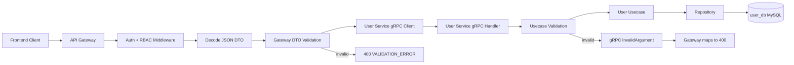
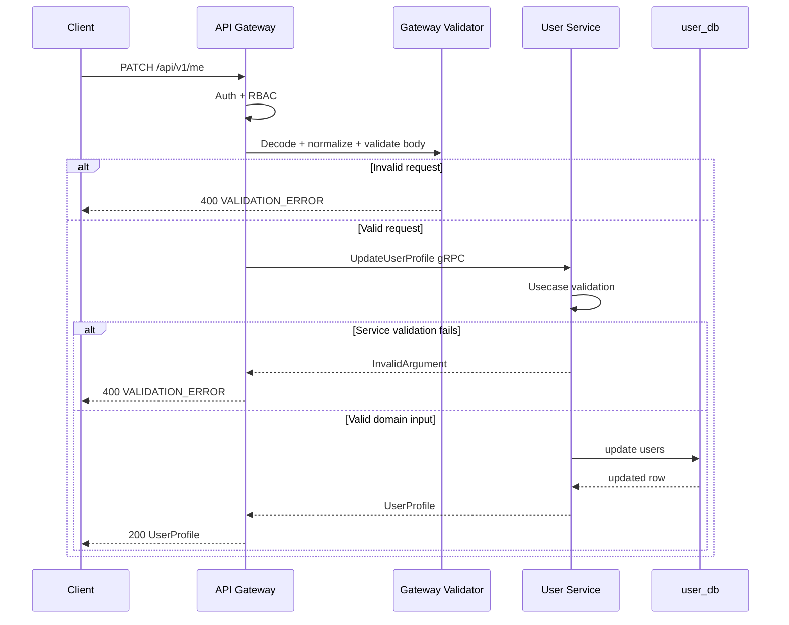
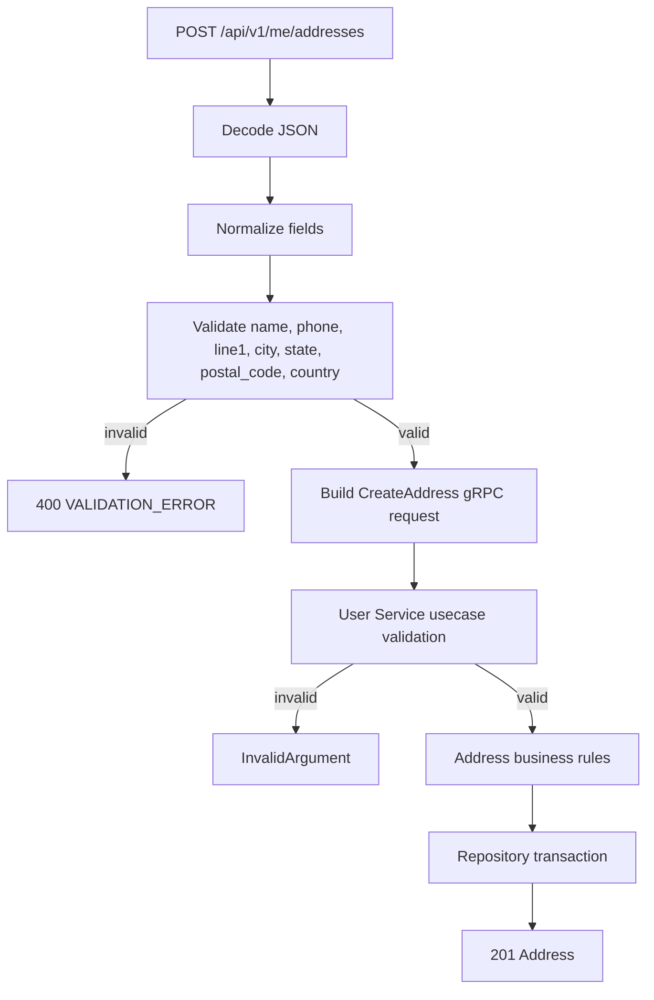
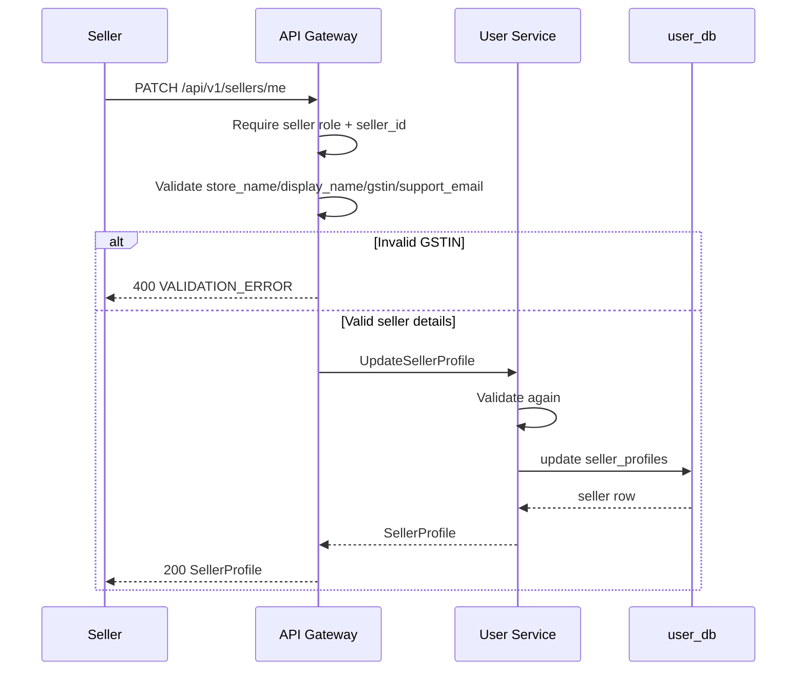

# 👤 User Service - Task 6: Add Validation


## 📌 Task Summary

| Field | Detail |
|---|---|
| Task Name | Add validation |
| Source | `docs/01-micro-tasks.md` → `User Service` → Task 6 |
| Priority | `P1` data quality and safety |
| Dependency | User Service Task 5: Add REST profile APIs |
| Main Goal | Email, phone, address, GST, aur seller details validate karna |
| Core Boundary | Bad data Gateway ya User Service usecase layer me reject hoga; DB ko last safety net maana jayega |
| Output Type | Structured implementation guide |
| Not Included | DB schema changes, audit field expansion, event publishing, seller approval workflow, frontend UI |

> **Simple Hinglish goal:** Is task ka purpose ye ensure karna hai ki User Service me galat email, invalid phone, incomplete address, wrong GST number, ya unsafe seller details DB tak na pahunch sakein. Validation Gateway pe bhi hogi for fast feedback, aur User Service usecase layer me bhi hogi for defense-in-depth.

---

## ✅ Final Output Created

```text
TaskImplementation/
├── Auth Service/
├── Platform Foundation/
└── User Service/
    ├── task1.md
    ├── task2.md
    ├── task3.md
    ├── task4.md
    ├── task5.md
    └── task6.md
```

### Why this structure?

- `TaskImplementation/` project ke task-wise guides ka central folder hai.
- `User Service/` folder already present tha, isliye usko preserve kiya gaya.
- `task6.md` sirf **User Service - Task 6** ka implementation guide hai.
- Existing `task1.md` to `task5.md`, Auth Service guides, Platform Foundation guides, docs, aur backend source files untouched rakhe gaye.
- Actual backend source code create nahi kiya gaya, kyunki current request ka output required folder structure aur complete `task6.md` content hai.

---

## 🧭 Implementation Approach

Is guide ko banate time project ke official docs aur existing User Service task guides ko source of truth maana gaya:

| Document/File | Kya use kiya gaya |
|---|---|
| `docs/01-micro-tasks.md` | User Service Task 6 ka exact scope: email, phone, address, GST, seller validation |
| `TaskImplementation/User Service/task1.md` | User domain boundary: profile data User Service me, credentials Auth Service me |
| `TaskImplementation/User Service/task2.md` | MySQL table fields: `users`, `user_addresses`, `seller_profiles`, `seller_kyc_documents` |
| `TaskImplementation/User Service/task3.md` | Repository layer ko clean validated input milna chahiye |
| `TaskImplementation/User Service/task4.md` | gRPC handler/usecase boundary and `InvalidArgument` error mapping |
| `TaskImplementation/User Service/task5.md` | REST DTOs, Gateway routes, and note that deep validation Task 6 me aayegi |
| `docs/03-folder-structure.md` | `backend/shared/validation/validator.go` convention |
| `docs/04-microservice-design.md` | User Service responsibilities and REST/gRPC route list |
| `docs/06-auth-security.md` | Validation layers: frontend, Gateway DTO, service usecase, DB constraints |
| `docs/13-developer-guide.md` | Production readiness checklist me input validation required hai |
| `api/master-api.json` | REST schemas: `CreateUserRequest`, `UpdateUserProfileRequest`, `AddressInput`, `UpdateSellerProfileRequest` |
| `database/draw.sql` | Actual column lengths and enum values for validation limits |

---

## 🧱 Task Boundary

### ✅ Included in Task 6

- Gateway request DTO validation design
- User Service usecase validation design
- Email validation and normalization
- Phone validation and E.164 normalization
- Profile update validation
- Address create/update validation
- Postal code validation by country where possible
- GSTIN validation for seller profiles
- Seller details validation: store name, display name, support email
- KYC metadata validation guidance
- Validation error response format
- gRPC `InvalidArgument` mapping
- Code examples in Go
- External library/tool explanation with install commands
- Mermaid architecture and request flow diagrams
- Unit, handler, and usecase test strategy

### 🚫 Not Included in Task 6

- New MySQL migrations
- Repository query changes except consuming already-valid input
- Audit fields like `created_by` / `updated_by`, which are Task 7
- Event publishing like `UserCreated`, `SellerApproved`, `AddressUpdated`, which is Task 8
- Seller approval/rejection workflow
- KYC file upload implementation
- Frontend form implementation
- External GST government API integration
- Production source file creation in this current output

> 🟢 **Rule:** Task 6 validation layer tak limited rahega. Validation bad input reject karegi, but seller approval, audit, events, uploads, ya schema expansion ko implement nahi karegi.

---

## 🗂️ Target Implementation Folder Structure

Future me actual validation implementation ka clean target structure ye hoga:

```text
backend/
├── shared/
│   └── validation/
│       ├── validator.go
│       ├── errors.go
│       ├── email.go
│       ├── phone.go
│       ├── gstin.go
│       ├── address.go
│       └── text.go
└── services/
    ├── api-gateway/
    │   └── internal/
    │       ├── handlers/
    │       │   ├── user_dto.go
    │       │   ├── user_validation.go
    │       │   ├── user_handler.go
    │       │   └── response.go
    │       └── routes/
    │           └── routes.go
    └── user-service/
        └── internal/
            ├── validation/
            │   ├── user_validator.go
            │   └── user_validator_test.go
            ├── usecase/
            │   ├── create_user.go
            │   ├── update_profile.go
            │   ├── manage_address.go
            │   └── seller_profile.go
            └── transport/
                └── grpc/
                    ├── errors.go
                    └── server.go
```

### Folder responsibility

| Path | Responsibility |
|---|---|
| `shared/validation/validator.go` | Common validator setup, custom tags, field error conversion |
| `shared/validation/email.go` | Email trim, lowercase, format validation |
| `shared/validation/phone.go` | Phone parse and E.164 normalization |
| `shared/validation/gstin.go` | Indian GSTIN format and state-code validation |
| `shared/validation/address.go` | Postal code and address field rules |
| `api-gateway/internal/handlers/user_validation.go` | REST DTO validation before gRPC call |
| `user-service/internal/validation/user_validator.go` | Service-side usecase input validation |
| `user-service/internal/usecase/` | Validation call before repository write |
| `user-service/internal/transport/grpc/errors.go` | Validation errors ko `codes.InvalidArgument` me map karna |

> 🟡 **Important:** Ye target structure hai. Is Task 6 me sirf `TaskImplementation/User Service/task6.md` create kiya gaya.

---

## 🧠 Validation Concept

Validation ka simple meaning hai: request ke fields ko business rules ke against check karna before data DB me save ho.

### Example

```text
Wrong input:
{
  "phone": "abc",
  "postal_code": "12",
  "gst_number": "hello"
}

Correct response:
400 VALIDATION_ERROR
phone must be a valid phone number
postal_code must be valid for country
gst_number must be a valid GSTIN
```

### Why validation important hai?

| Reason | Explanation |
|---|---|
| Data quality | DB me incomplete ya inconsistent profile data nahi jayega |
| Security | Unsafe URLs, huge strings, HTML/script inputs reject honge |
| User experience | Frontend ko clear field-level errors milenge |
| Service safety | Repository ko clean input milega, SQL/domain edge cases kam honge |
| Compliance | Seller GST/KYC metadata garbage state me nahi jayega |

---

## 🏗️ Validation Architecture



### Hinglish explanation

Gateway pe validation user ko fast feedback deta hai. Lekin sirf Gateway validation enough nahi hai, kyunki kal ko koi internal service direct gRPC call karegi. Isliye User Service usecase layer me same important validation dobara run hogi. DB constraints final safety net rahenge, but DB ko primary validator nahi banana chahiye.

---

## 🪜 Step-by-Step Implementation

## Step 1: Validation Layers Decide Kiye

`docs/06-auth-security.md` ke according validation 4 levels pe honi chahiye:

| Layer | Responsibility | Example |
|---|---|---|
| Frontend form validation | UX ke liye instant feedback | Phone input red border |
| API Gateway DTO validation | Public REST request reject karna | `PATCH /api/v1/me` invalid body |
| User Service usecase validation | Domain safety | Internal gRPC bad request reject |
| Database constraints | Last safety net | `NOT NULL`, `UNIQUE`, enum |

### Task 6 ka actual focus

```text
API Gateway DTO validation + User Service usecase validation
```

Frontend aur DB already separate concerns hain. Frontend validation useful hai, but trusted nahi. DB constraints useful hain, but user-friendly error nahi dete.

---

## Step 2: External Libraries/Tools Choose Kiye

### Libraries

| Library/Tool | What it is | Why used | Install |
|---|---|---|---|
| `github.com/go-playground/validator/v10` | Go struct tag validator | DTO fields ko declarative tags se validate karne ke liye | `go get github.com/go-playground/validator/v10` |
| `github.com/nyaruka/phonenumbers` | Go phone number parser based on libphonenumber ideas | Phone ko country-aware parse and E.164 normalize karne ke liye | `go get github.com/nyaruka/phonenumbers` |
| Go `regexp` | Standard regex package | GSTIN, postal code, safe text patterns ke liye | Built-in |
| Go `net/mail` | Standard email parser | Email sanity check ke liye | Built-in |
| Go `net/url` | Standard URL parser | `avatar_url` / document URL validate karne ke liye | Built-in |
| `grpc/status` + `codes` | gRPC error utilities | Service validation errors ko `InvalidArgument` banane ke liye | Existing gRPC dependency |

### Install commands

Actual implementation ke time relevant Go module ke andar ye commands chalenge:

```bash
cd backend/services/api-gateway
go get github.com/go-playground/validator/v10
go get github.com/nyaruka/phonenumbers
```

```bash
cd backend/services/user-service
go get github.com/go-playground/validator/v10
go get github.com/nyaruka/phonenumbers
```

### How to use

- DTO structs me tags add karo, jaise `validate:"required,min=2,max=120"`.
- Custom validators register karo, jaise `phone_e164`, `gstin`, `https_url`.
- Handler me `ValidateStruct(req)` call karo.
- Usecase me domain input validate karo before repository call.

> 🟡 **Note:** Agar future me `backend/shared` ek separate Go module banega, common validation package wahan rahega. Agar shared module nahi hai, pehle Gateway aur User Service dono me same package copy karne ke bajay internal shared module setup karo.

---

## Step 3: Common Validation Error Model Banaya

Frontend ko readable field errors chahiye. Isliye validation errors ko simple JSON shape me return karna best hai.

### Error shape

```json
{
  "error": {
    "code": "VALIDATION_ERROR",
    "message": "Request validation failed",
    "fields": [
      {
        "field": "phone",
        "code": "phone",
        "message": "phone must be a valid E.164 phone number"
      }
    ]
  },
  "request_id": "req_123"
}
```

### Go model

```go
package validation

type FieldError struct {
    Field   string `json:"field"`
    Code    string `json:"code"`
    Message string `json:"message"`
}

type Error struct {
    Fields []FieldError
}

func (e Error) Error() string {
    return "validation failed"
}

func (e Error) HasErrors() bool {
    return len(e.Fields) > 0
}
```

### Hinglish explanation

`message` human-friendly hai, `code` frontend logic ke liye useful hai, aur `field` batata hai exact problem kahan hai. Isse frontend per-field messages show kar sakta hai.

---

## Step 4: Validator Wrapper Create Kiya

Direct `validator.New()` har handler me create nahi karna chahiye. Ek wrapper banao jahan common custom rules register hon.

### Code example

```go
package validation

import (
    "github.com/go-playground/validator/v10"
)

type Validator struct {
    v *validator.Validate
}

func NewValidator() (*Validator, error) {
    v := validator.New()

    if err := v.RegisterValidation("phone_e164", validatePhoneE164); err != nil {
        return nil, err
    }
    if err := v.RegisterValidation("gstin", validateGSTIN); err != nil {
        return nil, err
    }
    if err := v.RegisterValidation("https_url", validateHTTPSURL); err != nil {
        return nil, err
    }
    if err := v.RegisterValidation("safe_text", validateSafeText); err != nil {
        return nil, err
    }

    return &Validator{v: v}, nil
}

func (v *Validator) Struct(value any) Error {
    err := v.v.Struct(value)
    if err == nil {
        return Error{}
    }

    validationErrors, ok := err.(validator.ValidationErrors)
    if !ok {
        return Error{
            Fields: []FieldError{{
                Field:   "request",
                Code:    "invalid",
                Message: "request validation failed",
            }},
        }
    }

    fields := make([]FieldError, 0, len(validationErrors))
    for _, fieldErr := range validationErrors {
        fields = append(fields, FieldError{
            Field:   jsonFieldName(fieldErr),
            Code:    fieldErr.Tag(),
            Message: fieldMessage(fieldErr),
        })
    }

    return Error{Fields: fields}
}
```

### Why wrapper useful hai?

| Without wrapper | With wrapper |
|---|---|
| Har handler custom rules repeat karega | Rules central place me rahenge |
| Error format inconsistent ho sakta hai | Same `FieldError` shape everywhere |
| Testing difficult hoti hai | Validator unit tests easy |

---

## Step 5: Input Normalization Rules Add Kiye

Validation ke pehle normalization karna important hai. Example: `"  Test@Email.COM "` ko `"test@email.com"` banana.

### Normalization table

| Field | Normalize kaise | Why |
|---|---|---|
| `email` | trim + lowercase | Duplicate/case mismatch avoid |
| `phone` | trim + E.164 format | Same number multiple formats me save na ho |
| `full_name` | trim + repeated spaces collapse | Clean display |
| `avatar_url` | trim | Accidental spaces reject/clean |
| `country` | trim + uppercase if ISO code | Postal validation easier |
| `gst_number` | trim + uppercase | GSTIN uppercase standard hai |
| `support_email` | trim + lowercase | Email consistency |

### Code example

```go
package validation

import (
    "strings"
)

func NormalizeEmail(email string) string {
    return strings.ToLower(strings.TrimSpace(email))
}

func NormalizeOptionalString(value *string) *string {
    if value == nil {
        return nil
    }
    normalized := strings.TrimSpace(*value)
    return &normalized
}

func NormalizeUpper(value string) string {
    return strings.ToUpper(strings.TrimSpace(value))
}
```

### PATCH semantics

PATCH me `nil` aur empty string ka difference important hai:

| Value | Meaning |
|---|---|
| `nil` pointer | Client ne field send hi nahi kiya, update mat karo |
| `""` empty string | Client ne field clear/set empty karna chaha |

Profile fields jaise `full_name` empty string allow nahi honi chahiye. Optional fields jaise `avatar_url` clear karna future me explicit nullable contract se handle karna better hai.

---

## Step 6: Email Validation Add Kiya

Email User Service me profile mirror field hai. Login identity ka source Auth Service rahega, but User Service ko profile email garbage nahi rakhna chahiye.

### Rules

| Rule | Value |
|---|---|
| Required in `CreateUserRequest` | ✅ |
| Optional in profile update | Usually no, because Task 5 update fields me email nahi hai |
| Max length | `254` |
| Normalize | trim + lowercase |
| Format | valid email-like address |
| Spaces | Not allowed |

### Code example

```go
package validation

import (
    "net/mail"
    "strings"
)

func IsValidEmail(email string) bool {
    email = NormalizeEmail(email)
    if email == "" || len(email) > 254 {
        return false
    }
    if strings.ContainsAny(email, " \t\r\n") {
        return false
    }
    parsed, err := mail.ParseAddress(email)
    return err == nil && parsed.Address == email
}
```

### Create user input example

```go
type CreateUserRequest struct {
    AuthAccountID string  `json:"auth_account_id" validate:"required,min=3,max=64"`
    Email         string  `json:"email" validate:"required,email,max=254"`
    Phone         *string `json:"phone,omitempty" validate:"omitempty,phone_e164"`
    FullName      string  `json:"full_name" validate:"required,min=2,max=120,safe_text"`
}
```

### Hinglish explanation

Auth Service email verify karega, but User Service ko bhi email format validate karna chahiye kyunki profile mirror field reports, receipts, seller/admin screens me show ho sakta hai.

---

## Step 7: Phone Validation Add Kiya

Phone number ka common issue ye hota hai ki users alag-alag formats bhejte hain:

```text
9999999999
09999999999
+91 99999 99999
abc
```

DB me ek canonical format store karna best hai: **E.164**, example `+919999999999`.

### Rules

| Rule | Value |
|---|---|
| Optional in user profile | ✅ |
| Optional in address | ✅ but recommended for delivery |
| Format | E.164 preferred |
| Max length | `16` including `+` |
| Normalize | parse and format to E.164 |

### Code example

```go
package validation

import (
    "github.com/go-playground/validator/v10"
    "github.com/nyaruka/phonenumbers"
)

func NormalizePhone(raw string, defaultRegion string) (string, bool) {
    number, err := phonenumbers.Parse(raw, defaultRegion)
    if err != nil {
        return "", false
    }
    if !phonenumbers.IsValidNumber(number) {
        return "", false
    }
    return phonenumbers.Format(number, phonenumbers.E164), true
}

func validatePhoneE164(fl validator.FieldLevel) bool {
    raw := fl.Field().String()
    _, ok := NormalizePhone(raw, "IN")
    return ok
}
```

### Handler usage

```go
if req.Phone != nil {
    phone, ok := validation.NormalizePhone(*req.Phone, "IN")
    if !ok {
        writeValidationErrors(w, r, []validation.FieldError{{
            Field:   "phone",
            Code:    "phone",
            Message: "phone must be a valid phone number",
        }})
        return
    }
    req.Phone = &phone
}
```

### Hinglish explanation

Phone parse karne ke liye regex alone weak hota hai. `phonenumbers` country rules samajh sakta hai, isliye India aur future international numbers ke liye safer hai.

---

## Step 8: Profile Update Validation Add Kiya

Task 5 me `PATCH /api/v1/me` fields define hue:

- `full_name`
- `phone`
- `avatar_url`

### Rules

| Field | Required? | Rule |
|---|---:|---|
| `full_name` | Optional in PATCH | If present: `2-120` chars, safe text |
| `phone` | Optional | If present: valid phone, normalized to E.164 |
| `avatar_url` | Optional | If present: HTTPS URL, max `1024`, no `javascript:` / `data:` |

### DTO with validation tags

```go
type UpdateUserProfileRequest struct {
    FullName  *string `json:"full_name,omitempty" validate:"omitempty,min=2,max=120,safe_text"`
    Phone     *string `json:"phone,omitempty" validate:"omitempty,phone_e164"`
    AvatarURL *string `json:"avatar_url,omitempty" validate:"omitempty,https_url,max=1024"`
}
```

### HTTPS URL validator

```go
package validation

import (
    "net/url"

    "github.com/go-playground/validator/v10"
)

func validateHTTPSURL(fl validator.FieldLevel) bool {
    raw := fl.Field().String()
    parsed, err := url.ParseRequestURI(raw)
    if err != nil {
        return false
    }
    return parsed.Scheme == "https" && parsed.Host != ""
}
```

### Empty patch reject karo

```go
func (req UpdateUserProfileRequest) IsEmpty() bool {
    return req.FullName == nil && req.Phone == nil && req.AvatarURL == nil
}
```

```go
if req.IsEmpty() {
    writeValidationErrors(w, r, []validation.FieldError{{
        Field:   "request",
        Code:    "empty_patch",
        Message: "at least one profile field is required",
    }})
    return
}
```

### Hinglish explanation

Empty PATCH ka matlab kuch update hi nahi hua. Aise request ko silently success dena confusing hota hai. Better hai clear validation error return karo.

---

## Step 9: Address Validation Add Kiya

Task 5 address APIs:

- `POST /api/v1/me/addresses`
- `PATCH /api/v1/me/addresses/{address_id}`

### Address rules

| Field | Required? | Rule |
|---|---:|---|
| `name` | ✅ create | `2-120`, safe text |
| `phone` | ❌ | Valid phone if present |
| `line1` | ✅ create | `5-255`, safe text |
| `line2` | ❌ | Max `255`, safe text |
| `city` | ✅ create | `2-128`, safe text |
| `state` | ✅ create | `2-128`, safe text |
| `postal_code` | ✅ create | Country-aware validation |
| `country` | ✅ create | `2-64`, safe text; ISO-2 preferred |
| `is_default` | ❌ | Boolean |

### DTO

```go
type AddressInputRequest struct {
    Name       string  `json:"name" validate:"required,min=2,max=120,safe_text"`
    Phone      *string `json:"phone,omitempty" validate:"omitempty,phone_e164"`
    Line1      string  `json:"line1" validate:"required,min=5,max=255,safe_text"`
    Line2      *string `json:"line2,omitempty" validate:"omitempty,max=255,safe_text"`
    City       string  `json:"city" validate:"required,min=2,max=128,safe_text"`
    State      string  `json:"state" validate:"required,min=2,max=128,safe_text"`
    PostalCode string  `json:"postal_code" validate:"required,max=32"`
    Country    string  `json:"country" validate:"required,min=2,max=64,safe_text"`
    IsDefault  bool    `json:"is_default"`
}
```

### Postal code validator

```go
package validation

import (
    "regexp"
    "strings"
)

var (
    indiaPIN = regexp.MustCompile(`^[1-9][0-9]{5}$`)
    usZIP    = regexp.MustCompile(`^[0-9]{5}(-[0-9]{4})?$`)
    generic  = regexp.MustCompile(`^[A-Za-z0-9][A-Za-z0-9 -]{1,31}$`)
)

func IsValidPostalCode(country string, postalCode string) bool {
    country = strings.ToUpper(strings.TrimSpace(country))
    postalCode = strings.TrimSpace(postalCode)

    switch country {
    case "IN", "INDIA":
        return indiaPIN.MatchString(postalCode)
    case "US", "USA", "UNITED STATES":
        return usZIP.MatchString(postalCode)
    default:
        return generic.MatchString(postalCode)
    }
}
```

### Create vs update address

Create address me required fields mandatory honge. Update address me same DTO use karna hai ya partial DTO? Task 5 me `AddressInput` same shape use hua hai, isliye safest approach:

| API | Validation style |
|---|---|
| `POST /api/v1/me/addresses` | Required full address |
| `PATCH /api/v1/me/addresses/{address_id}` | Existing Task 5 DTO full address style continue kare, unless proto update mask partial update supports |

### Address ID validation

Path param bhi validate karo:

```go
func ValidateID(field string, value string) validation.FieldError {
    value = strings.TrimSpace(value)
    if value == "" || len(value) > 64 {
        return validation.FieldError{
            Field:   field,
            Code:    "id",
            Message: field + " must be a valid id",
        }
    }
    return validation.FieldError{}
}
```

### Hinglish explanation

Address validation sirf "required hai ya nahi" tak limited nahi hai. Delivery ke liye postal code, receiver name, city/state, phone sab meaningful hone chahiye. Bad address save hoga to checkout, shipping, refund, support sab me issue aayega.

---

## Step 10: Safe Text Validation Add Kiya

Names, city, state, store name, display name jaise fields me HTML/script ya control characters allow nahi karne chahiye.

### Rules

| Rule | Why |
|---|---|
| No `<` or `>` | HTML injection risk kam hota hai |
| No control characters | Logs/UI safe rahte hain |
| Trim spaces | Clean display |
| Length limit | DB and UI protection |

### Code example

```go
package validation

import (
    "strings"
    "unicode"

    "github.com/go-playground/validator/v10"
)

func validateSafeText(fl validator.FieldLevel) bool {
    value := strings.TrimSpace(fl.Field().String())
    if value == "" {
        return false
    }

    for _, r := range value {
        if unicode.IsControl(r) {
            return false
        }
        if r == '<' || r == '>' {
            return false
        }
    }

    return true
}
```

### Hinglish explanation

Ye HTML sanitizer ka replacement nahi hai. Ye basic input guard hai. Output rendering ke time frontend ko still escape/sanitize karna hoga.

---

## Step 11: GSTIN Validation Add Kiya

Seller profile me `gst_number` optional hai, but agar seller provide karta hai to format validate hona chahiye.

### GSTIN format

GSTIN usually 15 characters hota hai:

```text
22AAAAA0000A1Z5
```

Breakdown:

| Part | Meaning |
|---|---|
| `22` | State code |
| `AAAAA0000A` | PAN-like section |
| `1` | Entity number |
| `Z` | Fixed character |
| `5` | Check character |

### Rules

| Rule | Value |
|---|---|
| Optional | ✅ |
| Normalize | trim + uppercase |
| Length | `15` |
| Pattern | Indian GSTIN pattern |
| State code | Known GST state code |
| External verification | Not in Task 6 |

### GSTIN validator

```go
package validation

import (
    "regexp"
    "strings"

    "github.com/go-playground/validator/v10"
)

var gstinPattern = regexp.MustCompile(`^[0-9]{2}[A-Z]{5}[0-9]{4}[A-Z][1-9A-Z]Z[0-9A-Z]$`)

var validGSTStateCodes = map[string]bool{
    "01": true, "02": true, "03": true, "04": true, "05": true,
    "06": true, "07": true, "08": true, "09": true, "10": true,
    "11": true, "12": true, "13": true, "14": true, "15": true,
    "16": true, "17": true, "18": true, "19": true, "20": true,
    "21": true, "22": true, "23": true, "24": true, "25": true,
    "26": true, "27": true, "28": true, "29": true, "30": true,
    "31": true, "32": true, "33": true, "34": true, "35": true,
    "36": true, "37": true, "38": true, "97": true,
}

func IsValidGSTIN(raw string) bool {
    value := strings.ToUpper(strings.TrimSpace(raw))
    if len(value) != 15 {
        return false
    }
    if !gstinPattern.MatchString(value) {
        return false
    }
    return validGSTStateCodes[value[:2]]
}

func validateGSTIN(fl validator.FieldLevel) bool {
    return IsValidGSTIN(fl.Field().String())
}
```

### Hinglish explanation

Ye validation format-level hai. Matlab obvious invalid GSTIN reject hoga. Real government registration active hai ya nahi, woh external GST verification API se check hoga, jo Task 6 ka part nahi hai.

---

## Step 12: Seller Details Validation Add Kiya

Task 5 seller self profile fields:

- `store_name`
- `display_name`
- `gst_number`
- `support_email`

### Rules

| Field | Required? | Rule |
|---|---:|---|
| `store_name` | Optional in PATCH, required in create/onboarding | `3-120`, safe text |
| `display_name` | Optional | `2-120`, safe text |
| `gst_number` | Optional | valid GSTIN if present |
| `support_email` | Optional | valid email, max `254` |
| `status` | ❌ self update not allowed | Superadmin/User workflow controls this |
| `approved_by` | ❌ | System/admin generated |
| `approved_at` | ❌ | System/admin generated |

### DTO

```go
type UpdateSellerProfileRequest struct {
    StoreName    *string `json:"store_name,omitempty" validate:"omitempty,min=3,max=120,safe_text"`
    DisplayName  *string `json:"display_name,omitempty" validate:"omitempty,min=2,max=120,safe_text"`
    GSTNumber    *string `json:"gst_number,omitempty" validate:"omitempty,gstin"`
    SupportEmail *string `json:"support_email,omitempty" validate:"omitempty,email,max=254"`
}
```

### Empty seller patch reject karo

```go
func (req UpdateSellerProfileRequest) IsEmpty() bool {
    return req.StoreName == nil &&
        req.DisplayName == nil &&
        req.GSTNumber == nil &&
        req.SupportEmail == nil
}
```

### Seller status safety

Seller self-update request body me `status` accept hi mat karo. Agar client send karta bhi hai to strict JSON decoder unknown fields reject kare.

```go
decoder := json.NewDecoder(r.Body)
decoder.DisallowUnknownFields()
```

### Hinglish explanation

Seller apne store details update kar sakta hai, but khud ko `active`, `approved`, ya `suspended` set nahi kar sakta. Ye Superadmin/audit workflow ka part hai.

---

## Step 13: KYC Metadata Validation Guidance Add Kiya

Task 6 KYC upload implement nahi karta, but User Service schema me `seller_kyc_documents` table hai. Jab future KYC metadata endpoint banega, validation rules ready honi chahiye.

### KYC metadata rules

| Field | Rule |
|---|---|
| `document_id` | Required, max `64` |
| `seller_id` | Required, max `64` |
| `document_type` | Enum: `gst_certificate`, `pan_card`, `address_proof`, `bank_proof` |
| `storage_url` | HTTPS URL, max `1024` |
| `status` | System-controlled enum |
| `rejection_reason` | Max `512`, safe text, admin-only |

### DTO idea

```go
type KYCDocumentMetadataRequest struct {
    DocumentType string `json:"document_type" validate:"required,oneof=gst_certificate pan_card address_proof bank_proof"`
    StorageURL   string `json:"storage_url" validate:"required,https_url,max=1024"`
}
```

> 🔵 **Scope note:** KYC metadata validation yahan documented hai, but actual upload/review flow Task 6 me implement nahi hota.

---

## Step 14: Gateway Handler Me Validation Wire Kiya

Gateway public REST request receive karta hai. Validation ka order:

1. Body size limit
2. JSON decode with unknown field reject
3. Normalize
4. Validate
5. Auth context bind
6. gRPC request build

### Handler example

```go
func (h *UserHandler) UpdateMe(w http.ResponseWriter, r *http.Request) {
    var req UpdateUserProfileRequest
    if err := decodeJSON(w, r, &req); err != nil {
        writeAPIError(w, r, http.StatusBadRequest, "INVALID_REQUEST", err.Error())
        return
    }

    normalizeUpdateProfile(&req)

    if req.IsEmpty() {
        writeValidationErrors(w, r, []validation.FieldError{{
            Field:   "request",
            Code:    "empty_patch",
            Message: "at least one profile field is required",
        }})
        return
    }

    if validationErr := h.validator.Struct(req); validationErr.HasErrors() {
        writeValidationErrors(w, r, validationErr.Fields)
        return
    }

    userID, err := userIDFromRequest(r)
    if err != nil {
        writeAPIError(w, r, http.StatusUnauthorized, "UNAUTHENTICATED", "Authentication required")
        return
    }

    grpcReq := buildUpdateUserProfileGRPCRequest(userID, req)
    profile, err := h.userClient.UpdateUserProfile(r.Context(), grpcReq)
    if err != nil {
        h.writeGRPCError(w, r, err)
        return
    }

    writeData(w, r, http.StatusOK, profile)
}
```

### Write validation errors

```go
func writeValidationErrors(w http.ResponseWriter, r *http.Request, fields []validation.FieldError) {
    writeJSON(w, http.StatusBadRequest, map[string]any{
        "error": map[string]any{
            "code":    "VALIDATION_ERROR",
            "message": "Request validation failed",
            "fields":  fields,
        },
        "request_id": requestIDFromContext(r.Context()),
    })
}
```

### Hinglish explanation

Malformed JSON aur invalid field alag cheezein hain. Malformed JSON ke liye `INVALID_REQUEST`, valid JSON but wrong values ke liye `VALIDATION_ERROR`.

---

## Step 15: User Service Usecase Me Validation Wire Kiya

Gateway validation helpful hai, but User Service ko apni boundary protect karni hogi.

### Usecase example

```go
func (uc *Usecase) UpdateProfile(ctx context.Context, input UpdateProfileInput) (*domain.User, error) {
    validationErr := uc.validator.ValidateUpdateProfile(input)
    if validationErr.HasErrors() {
        return nil, domain.NewValidationError(validationErr.Fields)
    }

    return uc.users.UpdateProfile(ctx, input)
}
```

### Service validator example

```go
type UserValidator struct {
    validator *validation.Validator
}

func (v *UserValidator) ValidateUpdateProfile(input UpdateProfileInput) validation.Error {
    req := UpdateUserProfileRequest{
        FullName:  input.FullName,
        Phone:     input.Phone,
        AvatarURL: input.AvatarURL,
    }
    return v.validator.Struct(req)
}
```

### Why usecase validation zaruri hai?

| Scenario | Without usecase validation | With usecase validation |
|---|---|---|
| Internal service direct gRPC call | Bad data DB tak ja sakta hai | `InvalidArgument` return hoga |
| Gateway bug | User Service still protected | Double safety |
| Future cron/admin job | Inconsistent data risk | Same domain rules apply |

---

## Step 16: gRPC Error Mapping Add Kiya

User Service gRPC handler validation errors ko `codes.InvalidArgument` me convert karega.

### Domain error

```go
package domain

import "backend/shared/validation"

type ValidationError struct {
    Fields []validation.FieldError
}

func (e ValidationError) Error() string {
    return "validation failed"
}

func NewValidationError(fields []validation.FieldError) error {
    return ValidationError{Fields: fields}
}
```

### gRPC mapping

```go
func mapDomainError(err error) error {
    var validationErr domain.ValidationError
    if errors.As(err, &validationErr) {
        return status.Error(codes.InvalidArgument, "validation failed")
    }

    // existing mappings:
    // not found -> codes.NotFound
    // duplicate -> codes.AlreadyExists
    // forbidden -> codes.PermissionDenied
    return status.Error(codes.Internal, "internal error")
}
```

### Better future option

For rich gRPC validation errors, future me `google.rpc.BadRequest` details attach kar sakte ho. MVP me Gateway JSON error fields enough hain.

---

## Step 17: REST to gRPC Error Mapping Align Kiya

Gateway already gRPC errors ko HTTP me map karta hai. Validation ke liye mapping:

| gRPC Code | HTTP Status | REST Code | Meaning |
|---|---:|---|---|
| `InvalidArgument` | `400` | `VALIDATION_ERROR` | Request field invalid |
| `Unauthenticated` | `401` | `UNAUTHENTICATED` | Token missing/invalid |
| `PermissionDenied` | `403` | `PERMISSION_DENIED` | Role/scope missing |
| `NotFound` | `404` | `NOT_FOUND` | User/address/seller not found |
| `AlreadyExists` | `409` | `CONFLICT` | Duplicate record |

### Hinglish explanation

Validation error user ki request ki problem hai, server ki problem nahi. Isliye `500` nahi dena. Clear `400 VALIDATION_ERROR` return karo.

---

## 🔁 Request Flow Diagrams

## Profile Update Flow



## Address Create Flow



## Seller Profile Update Flow



---

## 🧪 Validation Test Strategy

### Unit tests

| Test | Expected |
|---|---|
| Valid email `test@example.com` | Pass |
| Email with spaces | Fail |
| Valid phone `+919999999999` | Pass |
| Phone `abc` | Fail |
| Valid India PIN `560001` with `IN` | Pass |
| Invalid India PIN `012345` | Fail |
| Valid GSTIN `22AAAAA0000A1Z5` | Pass |
| GSTIN with wrong state code `99AAAAA0000A1Z5` | Fail |
| `avatar_url` with `https://...` | Pass |
| `avatar_url` with `javascript:...` | Fail |
| Safe text with `<script>` | Fail |

### Unit test example

```go
func TestIsValidGSTIN(t *testing.T) {
    tests := []struct {
        name string
        gst  string
        want bool
    }{
        {name: "valid", gst: "22AAAAA0000A1Z5", want: true},
        {name: "lowercase normalized", gst: "22aaaaa0000a1z5", want: true},
        {name: "bad state", gst: "99AAAAA0000A1Z5", want: false},
        {name: "too short", gst: "22AAAAA0000A1Z", want: false},
    }

    for _, tt := range tests {
        t.Run(tt.name, func(t *testing.T) {
            got := validation.IsValidGSTIN(tt.gst)
            if got != tt.want {
                t.Fatalf("expected %v, got %v", tt.want, got)
            }
        })
    }
}
```

### Handler tests

| Endpoint | Test |
|---|---|
| `PATCH /api/v1/me` | Invalid phone returns `400 VALIDATION_ERROR` |
| `PATCH /api/v1/me` | Empty body returns `400 VALIDATION_ERROR` |
| `POST /api/v1/me/addresses` | Missing `line1` returns field error |
| `POST /api/v1/me/addresses` | Invalid postal code returns field error |
| `PATCH /api/v1/sellers/me` | Invalid GSTIN returns field error |
| `PATCH /api/v1/sellers/me` | Unknown field `status` rejected |

### Usecase tests

| Usecase | Test |
|---|---|
| `CreateUser` | Invalid email rejected before repository |
| `UpdateProfile` | Invalid avatar URL rejected before repository |
| `CreateAddress` | Invalid postal code rejected before repository |
| `UpdateSellerProfile` | Invalid support email rejected before repository |

---

## 🧾 Manual Verification Examples

### Invalid phone

```bash
curl -X PATCH http://localhost:8080/api/v1/me \
  -H "Authorization: Bearer $ACCESS_TOKEN" \
  -H "Content-Type: application/json" \
  -d '{"phone":"abc"}'
```

Expected:

```json
{
  "error": {
    "code": "VALIDATION_ERROR",
    "message": "Request validation failed",
    "fields": [
      {
        "field": "phone",
        "code": "phone_e164",
        "message": "phone must be a valid phone number"
      }
    ]
  },
  "request_id": "req_123"
}
```

### Invalid address

```bash
curl -X POST http://localhost:8080/api/v1/me/addresses \
  -H "Authorization: Bearer $ACCESS_TOKEN" \
  -H "Content-Type: application/json" \
  -d '{
    "name": "A",
    "line1": "x",
    "city": "B",
    "state": "Karnataka",
    "postal_code": "012345",
    "country": "IN"
  }'
```

Expected:

```text
400 VALIDATION_ERROR
name too short
line1 too short
city too short
postal_code invalid for country IN
```

### Invalid seller GSTIN

```bash
curl -X PATCH http://localhost:8080/api/v1/sellers/me \
  -H "Authorization: Bearer $SELLER_ACCESS_TOKEN" \
  -H "Content-Type: application/json" \
  -d '{"gst_number":"BADGST"}'
```

Expected:

```text
400 VALIDATION_ERROR
gst_number must be a valid GSTIN
```

---

## 🧩 Validation Rule Matrix

### User profile

| Field | Create | Update | DB column | Validation |
|---|---:|---:|---|---|
| `auth_account_id` | Required | Not updatable | `VARCHAR(64)` | required, max 64 |
| `email` | Required | Not in Task 5 update | `VARCHAR(255)` | email, max 254 |
| `phone` | Optional | Optional | `VARCHAR(32)` | E.164 valid |
| `full_name` | Required | Optional | `VARCHAR(255)` | 2-120 safe text |
| `avatar_url` | Optional | Optional | `VARCHAR(1024)` | HTTPS URL |

### Address

| Field | Create | Update | DB column | Validation |
|---|---:|---:|---|---|
| `name` | Required | Required/full update | `VARCHAR(255)` | 2-120 safe text |
| `phone` | Optional | Optional | `VARCHAR(32)` | E.164 valid |
| `line1` | Required | Required/full update | `VARCHAR(255)` | 5-255 safe text |
| `line2` | Optional | Optional | `VARCHAR(255)` | max 255 safe text |
| `city` | Required | Required/full update | `VARCHAR(128)` | 2-128 safe text |
| `state` | Required | Required/full update | `VARCHAR(128)` | 2-128 safe text |
| `postal_code` | Required | Required/full update | `VARCHAR(32)` | country-aware |
| `country` | Required | Required/full update | `VARCHAR(64)` | 2-64 safe text |

### Seller profile

| Field | Create/onboarding | Self update | DB column | Validation |
|---|---:|---:|---|---|
| `store_name` | Required | Optional | `VARCHAR(255)` | 3-120 safe text |
| `display_name` | Optional | Optional | `VARCHAR(255)` | 2-120 safe text |
| `gst_number` | Optional | Optional | `VARCHAR(64)` | GSTIN format |
| `support_email` | Optional | Optional | `VARCHAR(255)` | email, max 254 |
| `status` | System | Not allowed | enum | No client input |
| `approved_by` | System/admin | Not allowed | `VARCHAR(64)` | No client input |
| `approved_at` | System/admin | Not allowed | timestamp | No client input |

---

## 🧯 Security Considerations

| Concern | Validation control |
|---|---|
| HTML/script in names | `safe_text` rejects `<`, `>`, control chars |
| Huge body payload | Gateway max body size middleware |
| Unknown JSON fields | `DisallowUnknownFields` |
| Invalid URL schemes | `https_url` only |
| Phone spoof formatting | phonenumbers parse + E.164 normalize |
| Seller self-approval | DTO does not expose `status`, strict decoder rejects unknown field |
| Internal bypass | Usecase validation repeats Gateway checks |
| DB enum/length errors | Validation catches before repository |

---

## 🚫 Common Mistakes Avoid Karna

| Mistake | Problem | Correct Approach |
|---|---|---|
| Sirf frontend validation pe trust karna | Frontend bypass ho sakta hai | Gateway and service validation mandatory |
| Sirf Gateway validation karna | Internal gRPC caller bad data bhej sakta hai | Usecase validation bhi rakho |
| Regex-only phone validation | Country rules miss honge | `phonenumbers` use karo |
| Seller update DTO me `status` rakhna | Seller self-approval risk | Status field expose mat karo |
| Unknown JSON fields allow karna | Silent bugs/security issue | `DisallowUnknownFields` |
| Empty PATCH success karna | Client bug hide hota hai | `empty_patch` validation error |
| Raw GST lowercase save karna | Inconsistent data | uppercase normalize karo |
| DB constraints ko validator banana | Error UX poor hota hai | Application validation pehle karo |

---

## ✅ Task 6 Validation Checklist

| Rule | Status |
|---|---|
| `TaskImplementation/User Service/task6.md` created | ✅ |
| Scope limited to User Service Task 6 | ✅ |
| Gateway DTO validation documented | ✅ |
| User Service usecase validation documented | ✅ |
| Email validation documented | ✅ |
| Phone validation documented | ✅ |
| Address validation documented | ✅ |
| Postal code validation documented | ✅ |
| GSTIN validation documented | ✅ |
| Seller details validation documented | ✅ |
| KYC metadata validation guidance included | ✅ |
| External libraries/tools explained | ✅ |
| Install commands included | ✅ |
| Code examples included | ✅ |
| Mermaid diagrams included | ✅ |
| Testing strategy included | ✅ |
| Existing task files untouched | ✅ |

---

## 🧩 Final Validation Summary

User Service Task 6 ke liye validation design complete hai:

- Gateway public REST input ko decode, normalize, validate karega.
- User Service usecase layer same critical rules dobara enforce karegi.
- Email trim/lowercase and format validate hoga.
- Phone E.164 normalized hoga.
- Address fields required, length-bounded, safe-text, and postal-code aware honge.
- GSTIN uppercase format and valid state-code ke saath validate hoga.
- Seller self-update me only safe profile fields allowed honge.
- Validation errors clean `400 VALIDATION_ERROR` shape me frontend ko milenge.
- gRPC boundary pe validation failures `InvalidArgument` banenge.

> ✅ **Task 6 complete:** Documentation-level implementation guide ready hai. Actual backend, migration, frontend, ya test files intentionally create nahi kiye gaye, kyunki current requested output sirf required folder structure aur `task6.md` content hai.
