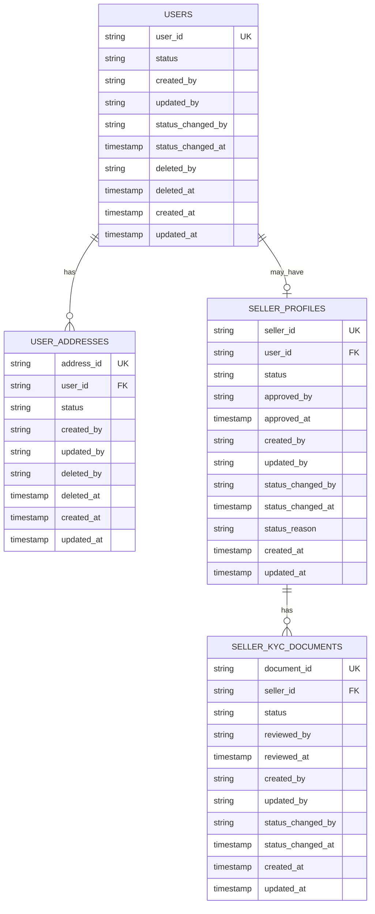
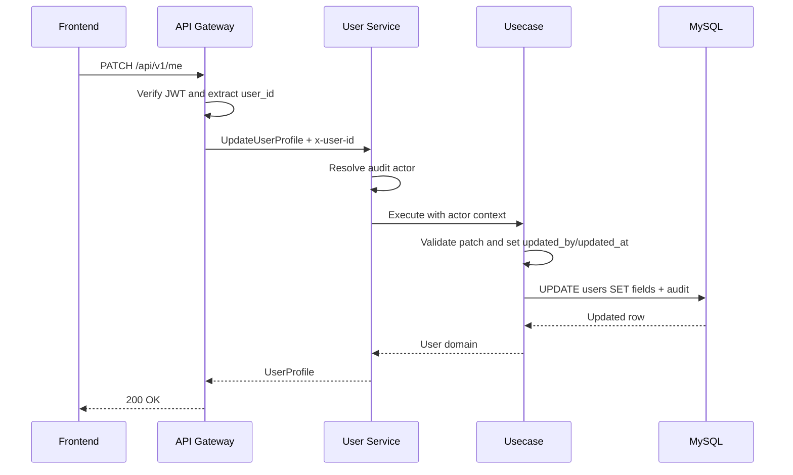
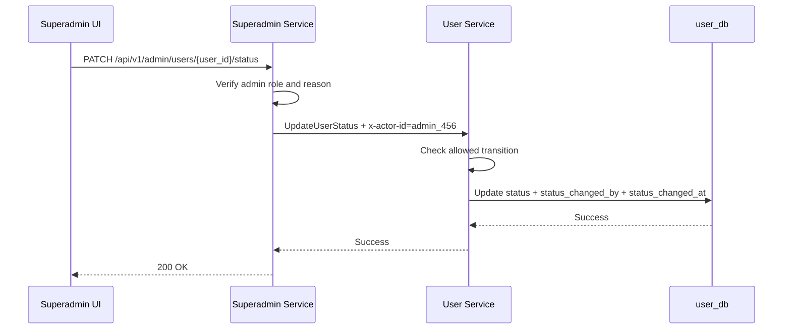

# 👤 User Service - Task 7: Add Audit Fields


## 📌 Task Summary

| Field | Detail |
|---|---|
| Task Name | Add audit fields |
| Source | `docs/01-micro-tasks.md` → `User Service` → Task 7 |
| Priority | `P1` compliance, debugging, and operational safety |
| Dependency | User Service Task 2: Create MySQL schema |
| Main Goal | `created_by`, `updated_by`, status, aur timestamps maintain karna |
| Core Boundary | Audit metadata server-side generate hoga. Client request body se audit fields trust nahi honge. |
| Output Type | Structured implementation guide |
| Not Included | User events publishing, immutable admin audit-log service, notification triggers, frontend UI |

> **Simple Hinglish goal:** Is task ka purpose User Service ke records ko traceable banana hai. Jab profile create/update ho, address add/delete ho, seller status change ho, ya KYC review ho, system ko pata hona chahiye ki action kis actor ne kiya, kab kiya, aur record ka current status kya hai.

---

## ✅ Final Output Created

```text
TaskImplementation/
├── Auth Service/
├── Platform Foundation/
└── User Service/
    ├── task1.md
    ├── task2.md
    ├── task3.md
    ├── task4.md
    ├── task5.md
    ├── task6.md
    └── task7.md
```

### Why this structure?

- `TaskImplementation/` project ke task-wise guides ka central folder hai.
- `User Service/` folder already present tha, isliye usko preserve kiya gaya.
- `task7.md` sirf **User Service - Task 7** ka implementation guide hai.
- Existing `task1.md` to `task6.md`, Auth Service guides, Platform Foundation guides, docs, aur backend source files untouched rakhe gaye.
- Actual backend source code create nahi kiya gaya, kyunki current request ka output required folder structure aur complete `task7.md` content hai.

---

## 🧭 Implementation Approach

Is guide ko banate time project ke official docs aur existing User Service task guides ko source of truth maana gaya:

| Document/File | Kya use kiya gaya |
|---|---|
| `docs/01-micro-tasks.md` | User Service Task 7 ka exact scope: created by, updated by, status, timestamps |
| `TaskImplementation/User Service/task1.md` | User/Auth ownership split and domain boundary |
| `TaskImplementation/User Service/task2.md` | Existing MySQL tables: `users`, `user_addresses`, `seller_profiles`, `seller_kyc_documents` |
| `TaskImplementation/User Service/task3.md` | Repository layer pattern and SQL update style |
| `TaskImplementation/User Service/task4.md` | gRPC handler, metadata, and service boundary |
| `TaskImplementation/User Service/task5.md` | Gateway REST routes and JWT context usage |
| `TaskImplementation/User Service/task6.md` | Validation boundary and note that audit expansion belongs to Task 7 |
| `docs/04-microservice-design.md` | User Service status responsibilities and `UpdateUserStatus` gRPC method |
| `docs/05-database-design.md` | User DB relationships, indexes, and scalability notes |
| `docs/06-auth-security.md` | High-risk operations require actor context and audit discipline |
| `docs/09-cms-superadmin.md` | Admin user/seller controls need audit notes |
| `api/master-api.json` | Admin status APIs and status update request shape |
| `database/draw.sql` | Current baseline DDL before Task 7 audit-field migration |

---

## 🧱 Task Boundary

### ✅ Included in Task 7

- Audit field policy define karna
- `created_by`, `updated_by`, `deleted_by`, `status_changed_by`, and timestamp fields ka design
- Existing `status`, `created_at`, `updated_at`, `deleted_at`, `approved_by`, `reviewed_by` fields ko consistent audit model me map karna
- MySQL migration examples for audit columns
- Domain structs me audit metadata add karna
- Request context se actor resolve karna
- gRPC metadata and Gateway context propagation explain karna
- Repository insert/update queries me audit fields maintain karna
- User, address, seller profile, and KYC status audit examples
- Mermaid architecture, ER, and sequence diagrams
- Test plan and verification queries
- External tools/libraries ka install/use explanation

### 🚫 Not Included in Task 7

- `UserCreated`, `SellerApproved`, `AddressUpdated` events publish karna, kyunki wo Task 8 ka scope hai
- Full immutable admin audit log service banana, kyunki Superadmin Service ka separate audit-log scope hai
- Notification Service trigger karna
- Seller approval UI ya frontend changes
- KYC file upload implementation
- RBAC middleware dobara implement karna
- Auth credential/token audit fields modify karna
- Cross-service DB foreign keys banana

> 🟢 **Rule:** Task 7 ka focus record-level audit metadata hai. Event-driven workflows Task 8 me aayenge, aur admin-wide immutable audit logs Superadmin Service ke scope me rahenge.

---

## 🗂️ Target Implementation Folder Structure

Future me actual audit implementation ka clean target structure ye hoga:

```text
backend/
└── services/
    └── user-service/
        ├── internal/
        │   ├── audit/
        │   │   ├── actor.go
        │   │   ├── context.go
        │   │   └── clock.go
        │   ├── domain/
        │   │   ├── audit.go
        │   │   ├── user.go
        │   │   ├── address.go
        │   │   └── seller_profile.go
        │   ├── usecase/
        │   │   ├── create_user.go
        │   │   ├── update_profile.go
        │   │   ├── manage_address.go
        │   │   ├── seller_profile.go
        │   │   └── status.go
        │   ├── repository/
        │   │   ├── mysql_user_repository.go
        │   │   ├── mysql_address_repository.go
        │   │   ├── mysql_seller_repository.go
        │   │   └── mysql_audit_helpers.go
        │   └── transport/
        │       └── grpc/
        │           ├── actor_interceptor.go
        │           ├── mapper.go
        │           └── server.go
        └── migrations/
            ├── 002_add_user_audit_fields.up.sql
            └── 002_add_user_audit_fields.down.sql
```

### Folder responsibility

| Path | Responsibility |
|---|---|
| `internal/audit/actor.go` | Actor model: user, admin, service, system |
| `internal/audit/context.go` | `context.Context` se actor extract/inject karna |
| `internal/audit/clock.go` | Testable UTC clock abstraction |
| `internal/domain/audit.go` | Reusable audit metadata structs |
| `internal/usecase/status.go` | User/seller/KYC status transition logic |
| `internal/repository/mysql_audit_helpers.go` | SQL audit column helpers and scanner helpers |
| `internal/transport/grpc/actor_interceptor.go` | gRPC metadata se audit actor resolve karna |
| `migrations/002_add_user_audit_fields.*.sql` | Existing User DB tables me audit columns add/drop karna |

> 🟡 **Important:** Ye target source structure hai. Is current task output me sirf `TaskImplementation/User Service/task7.md` create kiya gaya.

---

## 🧠 Audit Fields Concept

Audit fields ka simple meaning hai: record me "kisne", "kab", and "kis state me" ka metadata maintain karna.

### Audit field categories

| Category | Fields | Purpose |
|---|---|---|
| Creation audit | `created_by`, `created_at` | Record kis actor ne create kiya aur kab |
| Update audit | `updated_by`, `updated_at` | Last mutation kis actor ne ki aur kab |
| Delete audit | `deleted_by`, `deleted_at` | Soft delete kis actor ne ki aur kab |
| Status audit | `status`, `status_changed_by`, `status_changed_at`, `status_reason` | Lifecycle state kisne change ki and why |
| Review audit | `approved_by`, `approved_at`, `reviewed_by`, `reviewed_at` | Seller/KYC review traceability |

### Actor values

Audit actor ko string form me store karna simple rahega:

| Actor Type | Example Value | Kab use hoga |
|---|---|---|
| User | `user_123` | Buyer profile/address self-update |
| Seller owner | `user_123` | Seller self profile update |
| Admin | `admin_456` | User block, seller approve/suspend, KYC review |
| Service | `service:auth-service` | Signup ke baad User profile create |
| System | `system:migration` | Backfill or maintenance job |

> 🟠 **Security rule:** `created_by`, `updated_by`, `deleted_by`, ya `status_changed_by` request body se accept nahi karna. Ye fields Gateway/Auth/Superadmin validated context se server-side set honge.

---

## 🏗️ Audit Architecture

```mermaid
flowchart LR
    Client[Frontend / Internal Service] --> Gateway[API Gateway or Superadmin Service]
    Gateway --> Auth[Auth + RBAC Context]
    Auth --> GRPC[User Service gRPC]
    GRPC --> Actor[Audit Actor Resolver]
    Actor --> Usecase[User Usecase]
    Usecase --> Repo[Repository]
    Repo --> DB[(user_db MySQL)]

    Usecase --> Clock[UTC Clock]
    Actor --> Fields[created_by / updated_by / status_changed_by]
    Clock --> Fields
    Fields --> Repo

    classDef client fill:#e8f4ff,stroke:#1976d2,color:#111;
    classDef gateway fill:#fff3cd,stroke:#d39e00,color:#111;
    classDef service fill:#d4edda,stroke:#28a745,color:#111;
    classDef db fill:#f8d7da,stroke:#dc3545,color:#111;

    class Client client;
    class Gateway,Auth gateway;
    class GRPC,Actor,Usecase,Repo,Clock,Fields service;
    class DB db;
```



### Hinglish explanation

Client sirf action request karta hai. Gateway/Auth layer user identity verify karti hai. User Service actor context read karta hai, usecase business rule check karta hai, aur repository DB write ke time audit columns set karta hai. Isse audit fields client-tampering se safe rehte hain.

---

## 🔌 External Libraries / Tools

Task 7 ke liye koi brand-new business library mandatory nahi hai. Existing stack ke tools enough hain.

| Tool/Library | What it is | Why used | Install | Use |
|---|---|---|---|---|
| MySQL 8+ | Relational database | Audit fields and status indexes strongly consistent store karne ke liye | Docker Compose ya native MySQL | `ALTER TABLE`, transactions, timestamp columns |
| `golang-migrate/migrate` | Migration CLI | Audit column migration versioned and rollbackable rakhne ke liye | `go install github.com/golang-migrate/migrate/v4/cmd/migrate@latest` | `migrate -path migrations -database "$USER_DB_DSN" up` |
| Go `database/sql` | Standard DB package | Repository update queries and transactions ke liye | Built-in | `ExecContext`, `QueryRowContext`, `Tx` |
| `github.com/go-sql-driver/mysql` | MySQL driver | Go service ko MySQL se connect karne ke liye | `go get github.com/go-sql-driver/mysql` | DSN based MySQL connection |
| `google.golang.org/grpc/metadata` | gRPC metadata helper | `x-user-id`, `x-actor-id`, `x-request-id` extract karne ke liye | `go get google.golang.org/grpc` | `metadata.FromIncomingContext(ctx)` |
| `google.golang.org/protobuf/types/known/timestamppb` | Proto timestamp helper | Audit timestamps ko gRPC responses me map karne ke liye | `go get google.golang.org/protobuf` | `timestamppb.New(t)` |

### Install commands

```bash
go get github.com/go-sql-driver/mysql
go get google.golang.org/grpc
go get google.golang.org/protobuf
go install github.com/golang-migrate/migrate/v4/cmd/migrate@latest
```

### Migration usage

```bash
migrate -path backend/services/user-service/migrations \
  -database "$USER_DB_DSN" \
  up
```

---

## 🧩 Audit Data Model



---

## 🪜 Step-by-Step Implementation

## Step 1: Audit Policy Final Karo

Sabse pehle decide karo ki har table me kaunse audit fields honge.

| Table | Existing fields | Task 7 additions |
|---|---|---|
| `users` | `status`, `created_at`, `updated_at` | `created_by`, `updated_by`, `status_changed_by`, `status_changed_at`, `deleted_by`, `deleted_at` |
| `user_addresses` | `created_at`, `updated_at`, `deleted_at` | `status`, `created_by`, `updated_by`, `deleted_by` |
| `seller_profiles` | `status`, `approved_by`, `approved_at`, `created_at`, `updated_at` | `created_by`, `updated_by`, `status_changed_by`, `status_changed_at`, `status_reason` |
| `seller_kyc_documents` | `status`, `reviewed_by`, `reviewed_at`, `created_at` | `created_by`, `updated_by`, `updated_at`, `status_changed_by`, `status_changed_at` |

### Why `status` address table me add karna useful hai?

Task 2 me address soft delete ke liye `deleted_at` already hai. Task 7 me `status` add karne se queries readable ho jaati hain:

```sql
WHERE user_id = ? AND status = 'active'
```

`deleted_at` historical timestamp rahega, aur `status` current lifecycle state batayega.

### Status values

| Entity | Status values |
|---|---|
| User | `active`, `blocked`, `deleted` |
| Address | `active`, `deleted` |
| Seller profile | `draft`, `pending_review`, `active`, `suspended`, `rejected` |
| KYC document | `pending`, `approved`, `rejected` |

---

## Step 2: MySQL Up Migration Banao

Future migration file:

```text
backend/services/user-service/migrations/002_add_user_audit_fields.up.sql
```

### SQL example

```sql
ALTER TABLE users
  ADD COLUMN created_by VARCHAR(64) NULL AFTER status,
  ADD COLUMN updated_by VARCHAR(64) NULL AFTER created_by,
  ADD COLUMN status_changed_by VARCHAR(64) NULL AFTER updated_by,
  ADD COLUMN status_changed_at TIMESTAMP NULL AFTER status_changed_by,
  ADD COLUMN deleted_by VARCHAR(64) NULL AFTER status_changed_at,
  ADD COLUMN deleted_at TIMESTAMP NULL AFTER deleted_by,
  ADD KEY idx_users_status_updated (status, updated_at),
  ADD KEY idx_users_deleted_at (deleted_at);

ALTER TABLE user_addresses
  ADD COLUMN status ENUM('active', 'deleted') NOT NULL DEFAULT 'active' AFTER is_default,
  ADD COLUMN created_by VARCHAR(64) NULL AFTER status,
  ADD COLUMN updated_by VARCHAR(64) NULL AFTER created_by,
  ADD COLUMN deleted_by VARCHAR(64) NULL AFTER updated_by,
  ADD KEY idx_user_addresses_user_status (user_id, status, updated_at);

ALTER TABLE seller_profiles
  ADD COLUMN created_by VARCHAR(64) NULL AFTER approved_at,
  ADD COLUMN updated_by VARCHAR(64) NULL AFTER created_by,
  ADD COLUMN status_changed_by VARCHAR(64) NULL AFTER updated_by,
  ADD COLUMN status_changed_at TIMESTAMP NULL AFTER status_changed_by,
  ADD COLUMN status_reason VARCHAR(512) NULL AFTER status_changed_at,
  ADD KEY idx_seller_profiles_status_updated (status, updated_at);

ALTER TABLE seller_kyc_documents
  ADD COLUMN created_by VARCHAR(64) NULL AFTER rejection_reason,
  ADD COLUMN updated_by VARCHAR(64) NULL AFTER created_by,
  ADD COLUMN updated_at TIMESTAMP NOT NULL DEFAULT CURRENT_TIMESTAMP ON UPDATE CURRENT_TIMESTAMP AFTER created_at,
  ADD COLUMN status_changed_by VARCHAR(64) NULL AFTER updated_at,
  ADD COLUMN status_changed_at TIMESTAMP NULL AFTER status_changed_by,
  ADD KEY idx_kyc_documents_status_updated (status, updated_at);
```

### Hinglish explanation

- Existing data ke liye `created_by` nullable rakha gaya, taaki migration old rows ke saath safely run ho sake.
- New service writes ke liye usecase layer `created_by` and `updated_by` set karegi.
- `status_changed_at` sirf status change hone par set hoga.
- `deleted_at` and `deleted_by` soft delete trace ke liye hain.
- New indexes admin filters and operational debugging me help karenge.

---

## Step 3: Existing Rows Backfill Karo

Migration ke baad purane rows me actor missing hoga. Backfill safe default use karega.

```sql
UPDATE users
SET created_by = COALESCE(created_by, 'system:backfill'),
    updated_by = COALESCE(updated_by, 'system:backfill'),
    status_changed_at = COALESCE(status_changed_at, updated_at)
WHERE created_by IS NULL
   OR updated_by IS NULL
   OR status_changed_at IS NULL;

UPDATE user_addresses
SET created_by = COALESCE(created_by, 'system:backfill'),
    updated_by = COALESCE(updated_by, 'system:backfill'),
    status = CASE
      WHEN deleted_at IS NULL THEN 'active'
      ELSE 'deleted'
    END
WHERE created_by IS NULL
   OR updated_by IS NULL;

UPDATE seller_profiles
SET created_by = COALESCE(created_by, 'system:backfill'),
    updated_by = COALESCE(updated_by, 'system:backfill'),
    status_changed_at = COALESCE(status_changed_at, updated_at)
WHERE created_by IS NULL
   OR updated_by IS NULL
   OR status_changed_at IS NULL;

UPDATE seller_kyc_documents
SET created_by = COALESCE(created_by, 'system:backfill'),
    updated_by = COALESCE(updated_by, 'system:backfill'),
    status_changed_at = COALESCE(status_changed_at, created_at)
WHERE created_by IS NULL
   OR updated_by IS NULL
   OR status_changed_at IS NULL;
```

### Why backfill needed hai?

Production me existing rows hote hain. Agar migration ke turant baad code `created_by` expect kare aur old rows me null ho, reports confusing ban sakti hain. `system:backfill` clearly batata hai ki ye historical value migration time fill hui thi.

---

## Step 4: Down Migration Ready Rakho

Future rollback file:

```text
backend/services/user-service/migrations/002_add_user_audit_fields.down.sql
```

```sql
ALTER TABLE seller_kyc_documents
  DROP KEY idx_kyc_documents_status_updated,
  DROP COLUMN status_changed_at,
  DROP COLUMN status_changed_by,
  DROP COLUMN updated_at,
  DROP COLUMN updated_by,
  DROP COLUMN created_by;

ALTER TABLE seller_profiles
  DROP KEY idx_seller_profiles_status_updated,
  DROP COLUMN status_reason,
  DROP COLUMN status_changed_at,
  DROP COLUMN status_changed_by,
  DROP COLUMN updated_by,
  DROP COLUMN created_by;

ALTER TABLE user_addresses
  DROP KEY idx_user_addresses_user_status,
  DROP COLUMN deleted_by,
  DROP COLUMN updated_by,
  DROP COLUMN created_by,
  DROP COLUMN status;

ALTER TABLE users
  DROP KEY idx_users_deleted_at,
  DROP KEY idx_users_status_updated,
  DROP COLUMN deleted_at,
  DROP COLUMN deleted_by,
  DROP COLUMN status_changed_at,
  DROP COLUMN status_changed_by,
  DROP COLUMN updated_by,
  DROP COLUMN created_by;
```

> 🟡 **Rollback note:** Down migration audit data delete karega. Production me rollback se pehle snapshot/backup mandatory hai.

---

## Step 5: Domain Audit Structs Add Karo

Future file:

```text
backend/services/user-service/internal/domain/audit.go
```

```go
package domain

import "time"

type AuditFields struct {
    CreatedBy string
    UpdatedBy string
    CreatedAt time.Time
    UpdatedAt time.Time
}

type SoftDeleteFields struct {
    DeletedBy *string
    DeletedAt *time.Time
}

type StatusAuditFields struct {
    Status          string
    StatusChangedBy *string
    StatusChangedAt *time.Time
    StatusReason    *string
}
```

### Entity usage example

```go
type User struct {
    UserID        string
    AuthAccountID string
    Email         string
    Phone         *string
    FullName      string
    AvatarURL     *string
    Status        UserStatus
    Audit         AuditFields
    StatusAudit   StatusAuditFields
    SoftDelete    SoftDeleteFields
}
```

### Why reusable structs?

- Same audit pattern har entity me repeat nahi hoga.
- Tests me audit assertions easy rahengi.
- Future event payloads Task 8 me same fields reuse kar sakte hain.

---

## Step 6: Audit Actor Model Add Karo

Future file:

```text
backend/services/user-service/internal/audit/actor.go
```

```go
package audit

import "errors"

type ActorType string

const (
    ActorTypeUser    ActorType = "user"
    ActorTypeAdmin   ActorType = "admin"
    ActorTypeService ActorType = "service"
    ActorTypeSystem  ActorType = "system"
)

type Actor struct {
    ID   string
    Type ActorType
}

var ErrMissingActor = errors.New("audit actor is required")

func (a Actor) AuditID() string {
    if a.Type == ActorTypeService || a.Type == ActorTypeSystem {
        return string(a.Type) + ":" + a.ID
    }
    return a.ID
}
```

### Actor examples

```go
audit.Actor{ID: "user_123", Type: audit.ActorTypeUser}.AuditID()
// "user_123"

audit.Actor{ID: "auth-service", Type: audit.ActorTypeService}.AuditID()
// "service:auth-service"
```

### Hinglish explanation

Audit columns simple `VARCHAR(64)` rahenge. Service/system actors prefix ke saath store honge. User/admin IDs direct store honge because existing platform IDs already stable hain.

---

## Step 7: Context Se Actor Resolve Karo

Future file:

```text
backend/services/user-service/internal/audit/context.go
```

```go
package audit

import "context"

type contextKey struct{}

func WithActor(ctx context.Context, actor Actor) context.Context {
    return context.WithValue(ctx, contextKey{}, actor)
}

func ActorFromContext(ctx context.Context) (Actor, error) {
    actor, ok := ctx.Value(contextKey{}).(Actor)
    if !ok || actor.ID == "" {
        return Actor{}, ErrMissingActor
    }
    return actor, nil
}
```

### Metadata mapping

| gRPC metadata | Meaning | Example |
|---|---|---|
| `x-user-id` | Logged-in user id | `user_123` |
| `x-actor-id` | Admin/service actor id | `admin_456` |
| `x-actor-type` | Actor type | `user`, `admin`, `service`, `system` |
| `x-request-id` | Trace/debug id | `req_abc` |
| `x-roles` | RBAC roles | `buyer,seller` |

### Interceptor example

```go
func actorFromMetadata(ctx context.Context) (audit.Actor, bool) {
    md, ok := metadata.FromIncomingContext(ctx)
    if !ok {
        return audit.Actor{}, false
    }

    actorID := first(md.Get("x-actor-id"))
    actorType := first(md.Get("x-actor-type"))

    if actorID == "" {
        actorID = first(md.Get("x-user-id"))
        actorType = string(audit.ActorTypeUser)
    }

    if actorID == "" || actorType == "" {
        return audit.Actor{}, false
    }

    return audit.Actor{ID: actorID, Type: audit.ActorType(actorType)}, true
}
```

> 🟢 **Rule:** Mutating usecases actor ke bina write reject karenge. Read-only methods actor optional rakh sakte hain, but logs me request id useful rahega.

---

## Step 8: UTC Clock Use Karo

Audit timestamps hamesha UTC me store karo.

```go
package audit

import "time"

type Clock interface {
    Now() time.Time
}

type UTCClock struct{}

func (UTCClock) Now() time.Time {
    return time.Now().UTC()
}
```

### Why clock abstraction?

| Benefit | Explanation |
|---|---|
| Testable | Unit tests fixed time inject kar sakte hain |
| Consistent timezone | DB and app dono UTC use karenge |
| Clean audit assertions | `updated_at` exact compare possible hoga |

---

## Step 9: Create User Me Audit Set Karo

Signup ke baad Auth Service User Service ko `CreateUser` call karega. Actor usually `service:auth-service` hoga.

```go
func (uc *CreateUserUsecase) Execute(ctx context.Context, in CreateUserInput) (domain.User, error) {
    actor, err := audit.ActorFromContext(ctx)
    if err != nil {
        return domain.User{}, err
    }

    now := uc.clock.Now()
    user := domain.User{
        UserID:        in.UserID,
        AuthAccountID: in.AuthAccountID,
        Email:         in.Email,
        Phone:         in.Phone,
        FullName:      in.FullName,
        AvatarURL:     in.AvatarURL,
        Status:        domain.UserStatusActive,
        Audit: domain.AuditFields{
            CreatedBy: actor.AuditID(),
            UpdatedBy: actor.AuditID(),
            CreatedAt: now,
            UpdatedAt: now,
        },
        StatusAudit: domain.StatusAuditFields{
            Status:          string(domain.UserStatusActive),
            StatusChangedBy: ptr(actor.AuditID()),
            StatusChangedAt: &now,
        },
    }

    return uc.users.CreateUser(ctx, user)
}
```

### SQL insert example

```sql
INSERT INTO users (
  user_id,
  auth_account_id,
  email,
  phone,
  full_name,
  avatar_url,
  status,
  created_by,
  updated_by,
  status_changed_by,
  status_changed_at,
  created_at,
  updated_at
) VALUES (?, ?, ?, ?, ?, ?, ?, ?, ?, ?, ?, ?, ?);
```

### Hinglish explanation

Create ke time `created_by` and `updated_by` same actor hoga. `status_changed_by` bhi same actor hoga because initial status set hua hai.

---

## Step 10: Profile Update Me `updated_by` Maintain Karo

Profile update self-service action hai. User apna name, phone, avatar update karega. Audit actor JWT `sub` se aayega.

```go
func (uc *UpdateProfileUsecase) Execute(ctx context.Context, in UpdateProfileInput) (domain.User, error) {
    actor, err := audit.ActorFromContext(ctx)
    if err != nil {
        return domain.User{}, err
    }

    if actor.Type != audit.ActorTypeUser && actor.Type != audit.ActorTypeAdmin {
        return domain.User{}, domain.ErrPermissionDenied
    }

    patch := domain.UserProfilePatch{
        FullName:  in.FullName,
        Phone:     in.Phone,
        AvatarURL: in.AvatarURL,
        UpdatedBy: actor.AuditID(),
        UpdatedAt: uc.clock.Now(),
    }

    return uc.users.UpdateUserProfile(ctx, in.UserID, patch)
}
```

### SQL update example

```sql
UPDATE users
SET full_name = ?,
    phone = ?,
    avatar_url = ?,
    updated_by = ?,
    updated_at = ?
WHERE user_id = ?
  AND status = 'active'
  AND deleted_at IS NULL;
```

### Important rule

Profile update se `created_by`, `created_at`, `status`, `status_changed_by`, ya `status_changed_at` change nahi hoga. Sirf profile fields plus `updated_by/updated_at` update honge.

---

## Step 11: Address Create/Update/Delete Audit Karo

### Create address

```sql
INSERT INTO user_addresses (
  address_id,
  user_id,
  name,
  phone,
  line1,
  line2,
  city,
  state,
  postal_code,
  country,
  is_default,
  status,
  created_by,
  updated_by,
  created_at,
  updated_at
) VALUES (?, ?, ?, ?, ?, ?, ?, ?, ?, ?, ?, 'active', ?, ?, ?, ?);
```

Create address me `created_by` and `updated_by` logged-in `user_id` hoga.

### Update address

```sql
UPDATE user_addresses
SET name = ?,
    phone = ?,
    line1 = ?,
    line2 = ?,
    city = ?,
    state = ?,
    postal_code = ?,
    country = ?,
    is_default = ?,
    updated_by = ?,
    updated_at = ?
WHERE user_id = ?
  AND address_id = ?
  AND status = 'active';
```

### Delete address

```sql
UPDATE user_addresses
SET status = 'deleted',
    deleted_by = ?,
    deleted_at = ?,
    updated_by = ?,
    updated_at = ?,
    is_default = FALSE
WHERE user_id = ?
  AND address_id = ?
  AND status = 'active';
```

### Hinglish explanation

Address delete physical delete nahi hoga. Soft delete se old order delivery references and support debugging safe rehte hain. `deleted_by` batayega ki address kis actor ne remove kiya.

---

## Step 12: Seller Profile Audit Karo

Seller self-update aur admin status update alag workflows hain.

### Seller self-update allowed fields

| Field | Self-update allowed? |
|---|---:|
| `store_name` | ✅ |
| `display_name` | ✅ |
| `gst_number` | ✅ after Task 6 validation |
| `support_email` | ✅ after Task 6 validation |
| `status` | ❌ |
| `approved_by` | ❌ |
| `approved_at` | ❌ |

### Seller self-update SQL

```sql
UPDATE seller_profiles
SET store_name = ?,
    display_name = ?,
    gst_number = ?,
    support_email = ?,
    updated_by = ?,
    updated_at = ?
WHERE seller_id = ?
  AND user_id = ?;
```

### Admin seller status update SQL

```sql
UPDATE seller_profiles
SET status = ?,
    approved_by = CASE WHEN ? = 'active' THEN ? ELSE approved_by END,
    approved_at = CASE WHEN ? = 'active' THEN ? ELSE approved_at END,
    status_changed_by = ?,
    status_changed_at = ?,
    status_reason = ?,
    updated_by = ?,
    updated_at = ?
WHERE seller_id = ?;
```

### Seller status transition rules

| From | To | Allowed actor | Extra rule |
|---|---|---|---|
| `draft` | `pending_review` | seller owner | Required profile and KYC present |
| `pending_review` | `active` | admin | `approved_by`, `approved_at` required |
| `pending_review` | `rejected` | admin | `status_reason` required |
| `active` | `suspended` | admin | `status_reason` required |
| `suspended` | `active` | admin | `status_reason` recommended |
| `rejected` | `pending_review` | seller owner | Updated KYC/profile required |

> 🟠 **Security rule:** Seller self API kabhi `status` accept nahi karegi. Seller khud ko `active` ya `approved` nahi bana sakta.

---

## Step 13: KYC Document Audit Karo

KYC documents compliance-sensitive hote hain. Review action actor and timestamp ke bina save nahi hona chahiye.

### KYC upload metadata insert

```sql
INSERT INTO seller_kyc_documents (
  document_id,
  seller_id,
  document_type,
  storage_url,
  status,
  created_by,
  updated_by,
  created_at,
  updated_at,
  status_changed_by,
  status_changed_at
) VALUES (?, ?, ?, ?, 'pending', ?, ?, ?, ?, ?, ?);
```

### KYC review update

```sql
UPDATE seller_kyc_documents
SET status = ?,
    reviewed_by = ?,
    reviewed_at = ?,
    rejection_reason = ?,
    status_changed_by = ?,
    status_changed_at = ?,
    updated_by = ?,
    updated_at = ?
WHERE document_id = ?
  AND seller_id = ?;
```

### Review rules

| Status | Required fields |
|---|---|
| `approved` | `reviewed_by`, `reviewed_at` |
| `rejected` | `reviewed_by`, `reviewed_at`, `rejection_reason` |
| `pending` | no reviewer yet |

---

## Step 14: Status Update Usecase Centralize Karo

Status transitions scattered nahi hone chahiye. Ek usecase/service function me transition rules rakho.

```go
func canChangeUserStatus(from, to domain.UserStatus, actor audit.Actor) bool {
    if actor.Type != audit.ActorTypeAdmin && actor.Type != audit.ActorTypeService {
        return false
    }

    switch from {
    case domain.UserStatusActive:
        return to == domain.UserStatusBlocked || to == domain.UserStatusDeleted
    case domain.UserStatusBlocked:
        return to == domain.UserStatusActive || to == domain.UserStatusDeleted
    case domain.UserStatusDeleted:
        return false
    default:
        return false
    }
}
```

### User status update SQL

```sql
UPDATE users
SET status = ?,
    status_changed_by = ?,
    status_changed_at = ?,
    updated_by = ?,
    updated_at = ?,
    deleted_by = CASE WHEN ? = 'deleted' THEN ? ELSE deleted_by END,
    deleted_at = CASE WHEN ? = 'deleted' THEN ? ELSE deleted_at END
WHERE user_id = ?
  AND status <> 'deleted';
```

### Why centralize?

- Same rules gRPC, admin API, and tests me consistent rahenge.
- Invalid transition jaise `deleted` → `active` accidentally allow nahi hoga.
- Audit fields always status changes ke saath update honge.

---

## Step 15: gRPC/REST Response Mapping Decide Karo

Audit fields ka exposure carefully decide karo.

| API surface | Show `created_at/updated_at`? | Show `created_by/updated_by`? | Reason |
|---|---:|---:|---|
| `GET /api/v1/me` | ✅ optional | ❌ | Buyer ko actor IDs ki zarurat nahi |
| `GET /api/v1/me/addresses` | ✅ optional | ❌ | Useful for sorting, but actor private |
| `GET /api/v1/sellers/me` | ✅ | ❌ | Seller ko status timestamps useful ho sakte hain |
| Admin user/seller APIs | ✅ | ✅ | Compliance/debugging ke liye admin needs actor trace |
| Internal gRPC | ✅ | ✅ when trusted | Superadmin/ops services ko audit metadata chahiye |

### Proto example

```proto
message AuditInfo {
  string created_by = 1;
  string updated_by = 2;
  google.protobuf.Timestamp created_at = 3;
  google.protobuf.Timestamp updated_at = 4;
  string status_changed_by = 5;
  google.protobuf.Timestamp status_changed_at = 6;
  string status_reason = 7;
}
```

### Mapping example

```go
func auditToProto(a domain.AuditFields) *userv1.AuditInfo {
    return &userv1.AuditInfo{
        CreatedBy: a.CreatedBy,
        UpdatedBy: a.UpdatedBy,
        CreatedAt: timestamppb.New(a.CreatedAt),
        UpdatedAt: timestamppb.New(a.UpdatedAt),
    }
}
```

> 🟡 **Privacy note:** Public self APIs me actor IDs hide rakhna safer hai. Admin/Internal APIs me controlled access ke saath expose kiya ja sakta hai.

---

## Step 16: Request Body Se Audit Fields Block Karo

Task 6 validation already strict DTO pattern recommend karta hai. Task 7 me same rule audit fields ke liye apply karo.

### Wrong request

```json
{
  "full_name": "Aarav Sharma",
  "updated_by": "admin_999",
  "status": "active"
}
```

### Correct behavior

```json
{
  "error": {
    "code": "VALIDATION_ERROR",
    "message": "unknown field: updated_by"
  }
}
```

### Why?

Client-supplied audit fields trust karna audit ko useless bana deta hai. Malicious client apne action ko kisi admin ke naam pe fake kar sakta hai. Isliye audit fields always server-side context se generate honge.

---

## Step 17: Repository Scanning Update Karo

Existing repository scan helpers me audit columns include honge.

```go
func scanUser(row scanner) (domain.User, error) {
    var user domain.User
    var statusChangedBy sql.NullString
    var statusChangedAt sql.NullTime
    var deletedBy sql.NullString
    var deletedAt sql.NullTime

    err := row.Scan(
        &user.UserID,
        &user.AuthAccountID,
        &user.Email,
        &user.Phone,
        &user.FullName,
        &user.AvatarURL,
        &user.Status,
        &user.Audit.CreatedBy,
        &user.Audit.UpdatedBy,
        &statusChangedBy,
        &statusChangedAt,
        &deletedBy,
        &deletedAt,
        &user.Audit.CreatedAt,
        &user.Audit.UpdatedAt,
    )
    if err != nil {
        return domain.User{}, err
    }

    user.StatusAudit.StatusChangedBy = nullStringPtr(statusChangedBy)
    user.StatusAudit.StatusChangedAt = nullTimePtr(statusChangedAt)
    user.SoftDelete.DeletedBy = nullStringPtr(deletedBy)
    user.SoftDelete.DeletedAt = nullTimePtr(deletedAt)

    return user, nil
}
```

### Select example

```sql
SELECT
  user_id,
  auth_account_id,
  email,
  phone,
  full_name,
  avatar_url,
  status,
  created_by,
  updated_by,
  status_changed_by,
  status_changed_at,
  deleted_by,
  deleted_at,
  created_at,
  updated_at
FROM users
WHERE user_id = ?
  AND deleted_at IS NULL;
```

---

## Step 18: Update Flow Diagram



### Status change flow



---

## Step 19: Logging and Observability

Audit writes ke saath structured logs helpful rahenge.

```go
logger.Info("user profile updated",
    "user_id", in.UserID,
    "actor_id", actor.AuditID(),
    "request_id", requestID,
)
```

### Metrics

| Metric | Type | Labels | Purpose |
|---|---|---|---|
| `user_audit_write_total` | counter | `entity`, `operation`, `status` | Audit write success/failure count |
| `user_status_change_total` | counter | `entity`, `from`, `to` | Status transition tracking |
| `user_audit_missing_actor_total` | counter | `method` | Missing actor bug detect karna |

### Important logging rule

KYC `storage_url`, full address, phone, email, ya rejection details ko unnecessary logs me dump mat karo. Logs me IDs and status enough hain.

---

## Step 20: Test Plan

### Unit tests

| Test | Expected result |
|---|---|
| `CreateUser` with actor | `created_by`, `updated_by`, `status_changed_by` same actor |
| `CreateUser` without actor | returns `ErrMissingActor` |
| `UpdateUserProfile` | updates `updated_by/updated_at`, leaves `created_by` unchanged |
| `DeleteAddress` | sets `status=deleted`, `deleted_by`, `deleted_at`, `is_default=false` |
| Seller self update with `status` | rejected by DTO/validation |
| Admin seller approve | sets `status=active`, `approved_by`, `approved_at`, `status_changed_by` |
| KYC reject without reason | validation error |
| User `deleted` to `active` | transition blocked |

### Repository tests

```go
func TestUpdateUserProfileSetsAuditFields(t *testing.T) {
    fixedNow := time.Date(2026, 5, 21, 10, 0, 0, 0, time.UTC)

    patch := domain.UserProfilePatch{
        FullName:  ptr("Aarav Sharma"),
        UpdatedBy: "user_123",
        UpdatedAt: fixedNow,
    }

    got, err := repo.UpdateUserProfile(ctx, "user_123", patch)
    if err != nil {
        t.Fatal(err)
    }

    if got.Audit.UpdatedBy != "user_123" {
        t.Fatalf("updated_by = %q, want user_123", got.Audit.UpdatedBy)
    }
}
```

### Integration tests

| Flow | Check |
|---|---|
| Profile create then fetch | audit fields present in DB |
| Address create/update/delete | actor and timestamp fields update correctly |
| Seller approve | `approved_by` and `status_changed_by` set to admin id |
| Missing metadata gRPC call | mutating method fails safely |
| Backfilled row update | old `system:backfill` created_by remains, updated_by changes |

---

## Step 21: Manual Verification Queries

### User audit check

```sql
SELECT user_id, status, created_by, updated_by, status_changed_by,
       status_changed_at, created_at, updated_at
FROM users
WHERE user_id = 'user_123';
```

### Address delete audit check

```sql
SELECT address_id, status, deleted_by, deleted_at, updated_by, updated_at
FROM user_addresses
WHERE address_id = 'addr_123';
```

### Seller status audit check

```sql
SELECT seller_id, status, approved_by, approved_at,
       status_changed_by, status_changed_at, status_reason
FROM seller_profiles
WHERE seller_id = 'seller_123';
```

### KYC review audit check

```sql
SELECT document_id, status, reviewed_by, reviewed_at,
       status_changed_by, status_changed_at, rejection_reason
FROM seller_kyc_documents
WHERE document_id = 'kyc_123';
```

---

## Step 22: Deployment and Rollout Plan

| Phase | Action | Why |
|---|---|---|
| 1 | Add nullable audit columns | Existing rows break nahi honge |
| 2 | Backfill old rows with `system:backfill` | Reports me blank actor kam hoga |
| 3 | Deploy code that writes audit fields | New writes traceable honge |
| 4 | Monitor missing actor metric | Gateway/gRPC metadata bugs catch honge |
| 5 | Later make required fields stricter | Jab confidence ho tab `created_by`/`updated_by` NOT NULL consider karo |

### Production safety checklist

- [ ] Migration staging DB pe test hui
- [ ] Rollback migration available hai
- [ ] Existing rows ka backup/snapshot hai
- [ ] Mutating gRPC methods actor metadata receive kar rahe hain
- [ ] Gateway/Superadmin Service `x-actor-id` and `x-actor-type` pass kar raha hai
- [ ] Missing actor writes fail safely
- [ ] Public REST responses actor IDs leak nahi kar rahe
- [ ] Logs PII dump nahi kar rahe

---

## 🧾 Example End-to-End Scenarios

### Scenario 1: Auth signup creates user profile

```text
Actor: service:auth-service
Action: Create user profile
Result:
  users.created_by = service:auth-service
  users.updated_by = service:auth-service
  users.status = active
  users.status_changed_by = service:auth-service
```

### Scenario 2: Buyer updates profile

```text
Actor: user_123
Action: PATCH /api/v1/me
Result:
  users.updated_by = user_123
  users.updated_at = current UTC time
  users.created_by unchanged
  users.status unchanged
```

### Scenario 3: Buyer deletes address

```text
Actor: user_123
Action: DELETE /api/v1/me/addresses/addr_123
Result:
  user_addresses.status = deleted
  user_addresses.deleted_by = user_123
  user_addresses.deleted_at = current UTC time
  user_addresses.is_default = false
```

### Scenario 4: Admin approves seller

```text
Actor: admin_456
Action: Update seller status pending_review -> active
Result:
  seller_profiles.status = active
  seller_profiles.approved_by = admin_456
  seller_profiles.approved_at = current UTC time
  seller_profiles.status_changed_by = admin_456
```

---

## ✅ Completion Checklist

User Service Task 7 complete maana jayega jab:

- [x] `TaskImplementation/User Service/task7.md` created
- [x] Scope only User Service Task 7 tak limited hai
- [x] Audit field policy documented hai
- [x] MySQL migration examples included hain
- [x] Actor context and gRPC metadata approach explained hai
- [x] User, address, seller, and KYC audit flows documented hain
- [x] Status transition and timestamp rules clear hain
- [x] External tools/libraries install/use documented hain
- [x] Mermaid diagrams added hain
- [x] Test and rollout plan included hai

---

## ⚠️ Common Mistakes to Avoid

| Mistake | Risk | Correct approach |
|---|---|---|
| Client body se `updated_by` accept karna | Audit spoofing | Actor context se server-side set karo |
| Local timezone timestamps store karna | Debugging confusion | UTC everywhere |
| Physical delete addresses/users | Historical trace lost | Soft delete with `deleted_at/deleted_by` |
| Seller self-update me `status` allow karna | Self-approval risk | Status only admin/usecase workflow se |
| Audit fields nullable forever chhodna | Missing traceability | Backfill and later stricter constraints consider karo |
| Logs me PII dump karna | Privacy risk | IDs/status/request_id log karo, sensitive fields avoid karo |
| Status update and audit update separate queries me karna | Inconsistent state | Same transaction/query me update karo |

---

## 🧩 Final Audit Summary

User Service Task 7 me record-level traceability ka design complete hai:

- `users`, `user_addresses`, `seller_profiles`, and `seller_kyc_documents` audit metadata maintain karenge.
- `created_by`, `updated_by`, status fields, and timestamps server-side set honge.
- Mutating requests actor context ke bina reject honge.
- Status changes actor, time, and reason ke saath traceable rahenge.
- Public APIs actor IDs hide rakhenge, while admin/internal APIs controlled audit metadata access kar sakte hain.
- Task 8 me ye audited writes future `UserCreated`, `SellerApproved`, and `AddressUpdated` events publish karne ke liye clean foundation banayenge.
