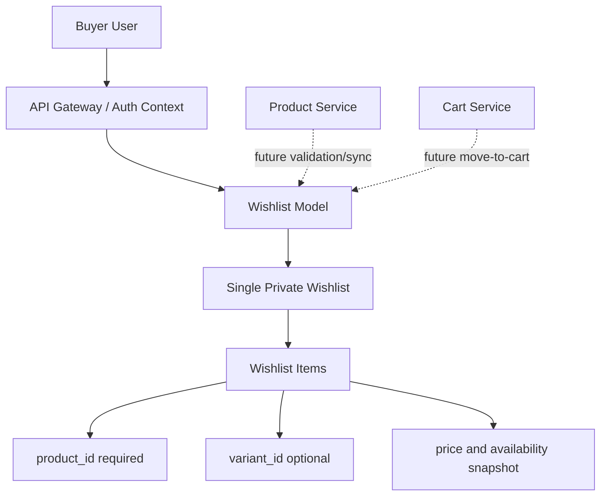
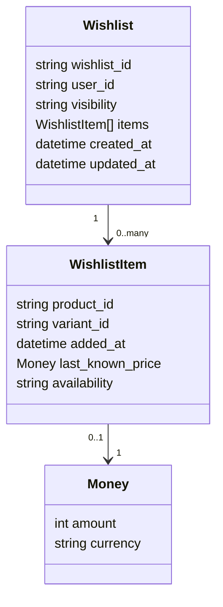
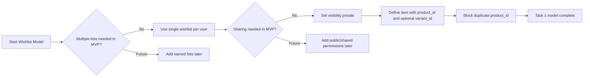
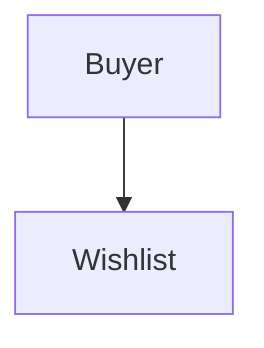

# 💖 Wishlist Service - Task 1: Define Wishlist Model


---

## 📌 Task Summary

| Field | Detail |
|---|---|
| Service | Wishlist Service |
| Task | Task 1 - Define wishlist model |
| Source | `docs/01-micro-tasks.md` → `Wishlist Service` → Task 1 |
| Requirement | User multiple wishlists rakhe ya single list, sharing allowed hai ya nahi decide karo |
| Dependency | Platform foundation |
| Priority | P1 |
| Final Decision | **Single private wishlist per buyer for MVP** |
| Output | Documentation-only model decision guide |

> **Simple Hinglish goal:** Is task ka kaam wishlist ka base model decide karna hai. Matlab ek user ke paas kitni wishlists hongi, wishlist private hogi ya shareable, item ka structure kya hoga, aur future tasks ke liye clear boundary kya rahegi.

---

## ✅ Final Output Created

```text
TaskImplementation/
└── Wishlist Service/
    └── task1.md
```

### Why this structure?

| Folder/File | Purpose |
|---|---|
| `TaskImplementation/` | Saare task-wise implementation guides ka central folder |
| `Wishlist Service/` | Wishlist service ke task guides ko group karta hai |
| `task1.md` | Sirf **Wishlist Service - Task 1** ka model decision guide |

> 🟢 **Note:** Is task me backend service code, MongoDB collection, API, ya gRPC implementation create nahi kiya gaya. Ye sirf Task 1 ka model-definition output hai.

---

## 🧭 Documents Studied

Is guide ko banane se pehle project ke existing docs check kiye gaye, taaki model repo ke architecture se aligned rahe.

| Document | Kya use kiya gaya |
|---|---|
| `docs/01-micro-tasks.md` | Wishlist Service Task 1 ka exact scope, dependency, priority |
| `docs/04-microservice-design.md` | Wishlist Service purpose, responsibilities, APIs, MongoDB direction |
| `docs/03-folder-structure.md` | Future `wishlist-service` folder layout reference |
| `docs/05-database-design.md` | Wishlist indexing summary: user id, product id |
| `database/mongodb-schema-design.md` | Existing wishlist document example and unique `user_id` index |
| `api/master-api.json` | Future API/gRPC contract reference for wishlist operations |

---

## 🧱 Final Model Decision

### ✅ Decision 1: Single wishlist per user

**Final rule:** Har authenticated buyer ke paas MVP me **one wishlist** hogi.

```text
1 buyer user_id  →  1 wishlist document
```

### Why single wishlist?

| Reason | Explanation |
|---|---|
| Existing DB direction | `database/mongodb-schema-design.md` me `user_id` par unique index suggested hai |
| Simple UX | Buyer ko ek simple "My Wishlist" experience milta hai |
| Fast reads | Ek user ki wishlist ek document me read ho sakti hai |
| Lower complexity | Multiple named lists, collaboration, sharing permissions abhi avoid honge |
| Future compatible | Later `visibility`, `name`, ya `shared_with` fields add kiye ja sakte hain |

> 🟡 **Future note:** Multiple wishlists, public sharing, shared family list, ya collection-style wishlist later advanced feature ho sakta hai. Task 1 me woh implement nahi hoga.

---

### ✅ Decision 2: Wishlist private by default

**Final rule:** Wishlist MVP me **private** hogi. Sirf owner buyer apni wishlist dekh aur modify kar sakta hai.

| Visibility | Task 1 Support | Meaning |
|---|---:|---|
| `private` | ✅ Yes | Only wishlist owner can access |
| `public` | ❌ No | Public share link not supported in Task 1 |
| `shared` | ❌ No | Specific users ke saath sharing not supported in Task 1 |

Recommended field:

```json
{
  "visibility": "private"
}
```

**Why `visibility` field abhi bhi rakha?**  
Kyuki future me public/shared wishlist support add karna easy hoga, but current business rule simple rahega: `private` only.

---

### ✅ Decision 3: Wishlist belongs to buyer user

Wishlist ka owner `user_id` hoga.

Important rule:

```text
user_id request body se nahi aayega.
user_id auth context / JWT claims se aayega.
```

**Why?**  
Security ke liye buyer apne request body me kisi aur ka `user_id` bhej kar wishlist access na kar sake. Gateway/Auth middleware authenticated user context inject karega.

---

### ✅ Decision 4: Item identity product-level hogi

Wishlist item ka required identifier:

```text
product_id
```

Optional identifier:

```text
variant_id
```

### Duplicate rule

MVP me same user ke wishlist me same `product_id` duplicate add nahi hoga.

| Scenario | Result |
|---|---|
| Same product first time add | Allowed |
| Same product dobara add | Block / no duplicate |
| Product with selected variant | `variant_id` optional snapshot ke roop me store ho sakta hai |

> 🔵 **Reason:** Existing microservice docs me rule hai: "Same product duplicate add nahi hoga." Isliye Task 1 model product-level wishlist ko primary behavior banata hai.

---

## 🧩 Wishlist Domain Model

### Wishlist entity

| Field | Type | Required | Explanation |
|---|---|---:|---|
| `wishlist_id` | string | ✅ | Wishlist ka unique id |
| `user_id` | string | ✅ | Wishlist owner buyer ka id |
| `visibility` | enum/string | ✅ | MVP me only `private` |
| `items` | array | ✅ | Wishlist items list |
| `created_at` | timestamp | ✅ | Wishlist create time |
| `updated_at` | timestamp | ✅ | Last change time |

### Wishlist item entity

| Field | Type | Required | Explanation |
|---|---|---:|---|
| `product_id` | string | ✅ | Product jo wishlist me add hua |
| `variant_id` | string/null | ❌ | Selected variant, agar applicable ho |
| `added_at` | timestamp | ✅ | Item add time |
| `last_known_price` | object/null | ❌ | Product ka last seen price snapshot |
| `availability` | string | ❌ | `in_stock`, `out_of_stock`, `unknown` |

### Money snapshot

| Field | Type | Example |
|---|---|---|
| `amount` | integer | `299900` |
| `currency` | string | `INR` |

> 🟣 **Price note:** `last_known_price` source of truth nahi hai. Final price Product/Order flow me fresh validate hoga. Wishlist me ye sirf display aur future price-drop notification ke liye useful snapshot hai.

---

## 🧾 Example Wishlist Document

Ye model `database/mongodb-schema-design.md` ke existing direction se aligned hai.

```json
{
  "wishlist_id": "wish_123",
  "user_id": "user_123",
  "visibility": "private",
  "items": [
    {
      "product_id": "prod_123",
      "variant_id": "var_1",
      "added_at": "2026-05-18T00:00:00Z",
      "last_known_price": {
        "amount": 299900,
        "currency": "INR"
      },
      "availability": "in_stock"
    }
  ],
  "created_at": "2026-05-18T00:00:00Z",
  "updated_at": "2026-05-18T00:00:00Z"
}
```

### Beginner explanation

- `wishlist_id`: Wishlist ka unique identifier.
- `user_id`: Jis buyer ki wishlist hai.
- `visibility`: Abhi `private`, future me public/shared possible.
- `items`: Products ki list jo user ne save kiye hain.
- `last_known_price`: Display ke liye price snapshot.
- `availability`: Product available hai ya nahi, ye future sync task me update hoga.

---

## 🧠 Conceptual Go Domain Example

> ⚠️ Ye code example sirf model samjhane ke liye hai. Task 1 me actual Go file create nahi ki gayi.

```go
package domain

import "time"

type WishlistVisibility string

const (
    WishlistVisibilityPrivate WishlistVisibility = "private"
)

type Money struct {
    Amount   int64
    Currency string
}

type WishlistItem struct {
    ProductID      string
    VariantID      string
    AddedAt        time.Time
    LastKnownPrice *Money
    Availability   string
}

type Wishlist struct {
    ID         string
    UserID     string
    Visibility WishlistVisibility
    Items      []WishlistItem
    CreatedAt  time.Time
    UpdatedAt  time.Time
}
```

### Is code ka meaning

| Part | Explanation |
|---|---|
| `WishlistVisibilityPrivate` | MVP me only private wishlist supported |
| `Money` | Price snapshot ko structured rakhta hai |
| `WishlistItem` | Ek saved product ka data |
| `Wishlist` | Buyer ki complete wishlist |

---

## 🧱 Business Rules

| Rule | Decision |
|---|---|
| Wishlist count | One wishlist per buyer |
| Owner | Authenticated buyer user |
| Visibility | Private only |
| Sharing | Not allowed in Task 1 |
| Public link | Not allowed in Task 1 |
| Item uniqueness | Same `product_id` duplicate nahi hoga |
| `product_id` | Required |
| `variant_id` | Optional |
| Price | Snapshot only, source of truth nahi |
| Availability | Snapshot/status only, source of truth Product Service hai |
| Timestamps | UTC ISO-8601 format |

---

## 🧭 Architecture Diagram



### Diagram explanation

- Buyer direct `user_id` pass nahi karega; auth context se user identify hoga.
- Wishlist model ek single private list maintain karega.
- Product/Cart integration future tasks me aayegi, Task 1 me nahi.

---

## 🗂️ Data Model Diagram



---

## 🔄 Model Decision Flow



---

## 🪜 Step-by-Step Implementation Guide

### Step 1: Requirement read kiya

`docs/01-micro-tasks.md` me Wishlist Service Task 1 ye bolta hai:

```text
Define wishlist model:
User multiple wishlists rakhe ya single list,
sharing allowed hai ya nahi decide karo.
```

Iska matlab pehle model-level decisions finalize karne hain. API, DB collection, add/remove logic, move-to-cart, events, analytics ye sab later tasks ke liye rakhe gaye.

---

### Step 2: Existing architecture se align kiya

`docs/04-microservice-design.md` ke according Wishlist Service ka purpose hai:

- User wishlist and save-for-later flows manage karna
- Add/remove wishlist items
- Move wishlist item to cart
- Price drop and availability track karna
- Wishlist analytics events emit karna

Task 1 me in responsibilities ka sirf **model base** define hua. Actual flows later tasks me implement honge.

---

### Step 3: Single wishlist choose ki

`database/mongodb-schema-design.md` me suggested index hai:

```javascript
db.wishlists.createIndex({ user_id: 1 }, { unique: true })
```

Ye clearly indicate karta hai ki ek `user_id` ke liye ek hi wishlist document hoga.

Final decision:

```text
One buyer = One wishlist
```

---

### Step 4: Private visibility choose ki

Task requirement me sharing decision maanga gaya tha. MVP ke liye sharing disable rakhi gayi.

Final decision:

```text
visibility = private
```

Reason:

- Access control simple rahega.
- Security risk kam hoga.
- Public/share permissions ka complex model abhi avoid hoga.
- Future me field expand karna easy rahega.

---

### Step 5: Item model define kiya

Wishlist item ko product-level save action maana gaya.

Required:

```text
product_id
```

Optional:

```text
variant_id
```

Reason:

- Product wishlist ka core object product hi hai.
- Variant selected ho to store kar sakte hain.
- Same product duplicate add karna block hoga.

---

### Step 6: Snapshot fields add kiye

Wishlist item me `last_known_price` aur `availability` optional snapshot fields rakhe gaye.

Why useful?

| Field | Why useful |
|---|---|
| `last_known_price` | User ko last seen price dikhane aur future price-drop notification ke liye |
| `availability` | Product out-of-stock/deleted status display karne ke liye |

Important:

```text
Wishlist price/availability final truth nahi hai.
Product Service final source of truth hoga.
```

---

### Step 7: Ownership rule define kiya

Wishlist ka owner authenticated buyer hoga.

Correct approach:

```text
Auth token → user_id → wishlist lookup
```

Avoid:

```text
Request body → user_id
```

Reason:

- Buyer kisi aur user ki wishlist access na kar sake.
- Access control centralized rahe.
- Gateway/Auth middleware ke saath clean integration possible ho.

---

### Step 8: Task boundary lock ki

Task 1 ke baad sirf model decision complete hua. Neeche wale features intentionally implement nahi kiye gaye:

| Feature | Reason |
|---|---|
| MongoDB setup | Task 2/3 ka scope |
| `wishlists` collection create | Task 3 ka scope |
| Add/remove APIs | Task 4 ka scope |
| Product validation | Task 4 ka scope |
| Move to cart | Task 5 ka scope |
| Availability sync | Task 6 ka scope |
| Price drop events | Task 7 ka scope |
| Analytics events | Task 8 ka scope |

---

## 📁 Future Service Folder Reference

> ⚠️ Ye folder structure docs me future implementation reference ke liye hai. Task 1 me ye service code create nahi kiya gaya.

```text
backend/
└── services/
    └── wishlist-service/
        ├── cmd/
        │   └── server/
        │       └── main.go
        ├── internal/
        │   ├── domain/
        │   │   └── wishlist.go
        │   ├── usecase/
        │   ├── repository/
        │   │   └── mongo_wishlist_repository.go
        │   └── transport/
        │       └── grpc/
        └── deploy/
```

---

## 🧰 External Libraries / Tools Used

### 1. Markdown

| Field | Detail |
|---|---|
| What | Documentation format used for `task1.md` |
| Why | GitHub/GitLab/VS Code me easily readable hota hai |
| Install | Usually install karne ki zarurat nahi hoti |
| Use | `.md` file create karke headings, tables, code blocks likho |

Example:

```markdown
## Heading

| Column | Value |
|---|---|
| Example | Data |
```

---

### 2. Mermaid

| Field | Detail |
|---|---|
| What | Markdown-friendly diagram syntax |
| Why | Architecture aur flow diagrams text ke form me maintain ho jate hain |
| Install | GitHub automatically render karta hai; VS Code me Mermaid preview extension optional hai |
| Use | Markdown me fenced code block with `mermaid` use karo |

Example:

````markdown

````

> 🟢 **Note:** Mermaid sirf documentation diagram ke liye use hua. Application dependency nahi hai.

---

### 3. Shields.io Badges

| Field | Detail |
|---|---|
| What | Badge images generate karne ki free service |
| Why | Task status, priority, dependency visually clear dikhte hain |
| Install | No install required |
| Use | Markdown image URL add karo |

Example:

```markdown

```

> 🟡 **Note:** Ye badges external image URLs hain. Offline preview me badges load na hon to documentation content still readable rahega.

---

## 🚫 Out of Scope for Task 1

Task 1 me ye kaam **nahi** kiye gaye:

- MongoDB database create nahi kiya
- Collection/index create nahi kiya
- Go service code create nahi kiya
- gRPC proto create/update nahi kiya
- REST route implement nahi kiya
- Product Service validation call nahi banaya
- Cart Service integration nahi banaya
- Events, analytics, notification logic nahi banaya
- Frontend wishlist page nahi banaya

> 🔴 **Reason:** Ye sab Wishlist Service ke later tasks me covered hain. Task 1 ka purpose sirf model decision finalize karna hai.

---

## ✅ Definition of Done

| Check | Status |
|---|---:|
| `TaskImplementation/` folder available hai | ✅ |
| `TaskImplementation/Wishlist Service/` folder available hai | ✅ |
| `task1.md` create hua | ✅ |
| Wishlist model single vs multiple decide hua | ✅ |
| Sharing/private decision documented hai | ✅ |
| Item model fields documented hain | ✅ |
| Business rules documented hain | ✅ |
| Mermaid diagrams added hain | ✅ |
| External tools/libraries explained hain | ✅ |
| Scope Task 1 tak limited hai | ✅ |

---

## 🏁 Final Task 1 Standard

Wishlist Service ka MVP model ye hoga:

```text
One authenticated buyer has one private wishlist.
Wishlist contains unique product-level items.
Each item requires product_id and may store optional variant_id.
Price and availability are snapshots, not source of truth.
Sharing, multiple lists, APIs, DB implementation, and events are future tasks.
```

Task 1 complete hai as a documentation-first model decision. Ab Task 2 me MongoDB choice ko formally document/implement kiya ja sakta hai, aur Task 3 me `wishlists` collection design banega.
