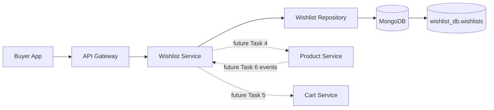
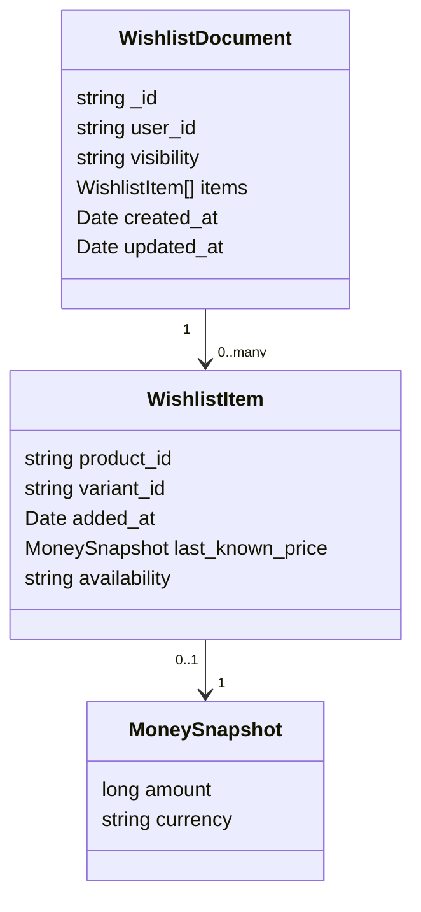
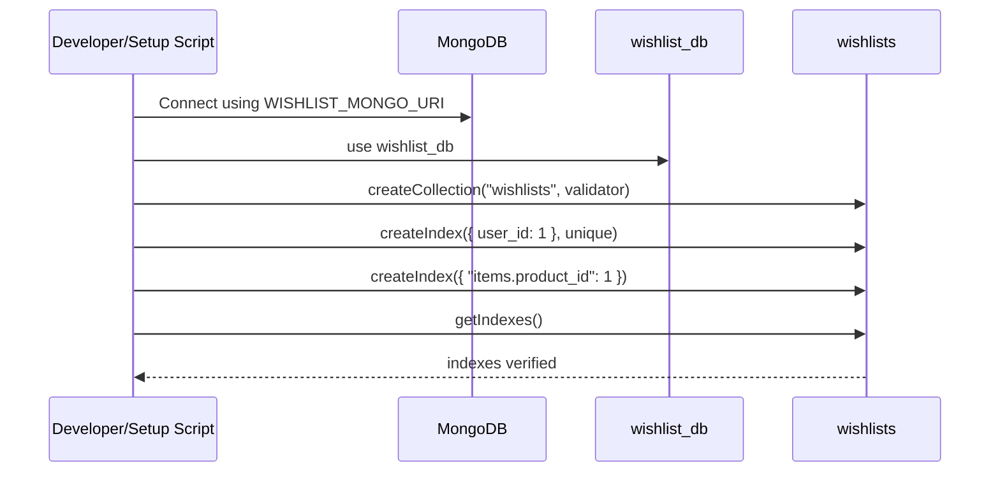

# 💖 Wishlist Service - Task 3: Collections Design


---

## 📌 Task Summary

| Field | Detail |
|---|---|
| Service | Wishlist Service |
| Task | Task 3 - Collections design |
| Source | `docs/01-micro-tasks.md` -> `Wishlist Service` -> Task 3 |
| Requirement | `wishlists` collection with user id, items, visibility, timestamps banao |
| Dependency | Wishlist Service Task 2: Choose MongoDB |
| Priority | P1 |
| Final Decision | **MongoDB `wishlist_db.wishlists` collection design finalized** |
| Output | Documentation-only collection design guide |

> **Simple Hinglish goal:** Is task ka kaam Wishlist Service ke MongoDB collection ka exact shape finalize karna hai. Matlab `wishlists` collection me kaunse fields rahenge, items array ka structure kya hoga, indexes kaise banenge, timestamps kaise store honge, aur future code is schema ko kaise use karega.

---

## ✅ Final Output Created

```text
TaskImplementation/
└── Wishlist Service/
    ├── task1.md
    ├── task2.md
    └── task3.md
```

### Why this structure?

| Folder/File | Purpose |
|---|---|
| `TaskImplementation/` | Saare task-wise implementation guides ka central folder |
| `Wishlist Service/` | Wishlist service ke task guides ko group karta hai |
| `task1.md` | Wishlist model decision guide |
| `task2.md` | Wishlist MongoDB choice guide |
| `task3.md` | Sirf **Wishlist Service - Task 3** ka collection design guide |

> 🟢 **Note:** Is task me actual backend service folder, API, gRPC handler, repository file, migration runner, ya event consumer create nahi kiya gaya. Ye Task 3 ka database collection design output hai.

---

## 🧭 Documents Studied

| Document | Kya use kiya gaya |
|---|---|
| `docs/01-micro-tasks.md` | Task 3 ka exact scope: `wishlists` collection with user id, items, visibility, timestamps |
| `TaskImplementation/Wishlist Service/task1.md` | Single private wishlist per buyer model |
| `TaskImplementation/Wishlist Service/task2.md` | MongoDB as primary Wishlist DB decision |
| `database/mongodb-schema-design.md` | Existing `wishlist_db`, `wishlists` collection example, indexes |
| `docs/04-microservice-design.md` | Wishlist purpose, responsibilities, APIs, MongoDB direction |
| `docs/05-database-design.md` | Wishlist high-value indexes: user id, product id |
| `docs/03-folder-structure.md` | Future `backend/services/wishlist-service` folder layout reference |
| `api/master-api.json` | Future `Wishlist`, `WishlistItemInput`, and WishlistService contract names |

---

## 🧱 Task Boundary

### ✅ Included in Task 3

| Included | Explanation |
|---|---|
| Database name | `wishlist_db` finalize kiya |
| Collection name | `wishlists` finalize kiya |
| Document schema | `_id`, `user_id`, `visibility`, `items`, `created_at`, `updated_at` define kiya |
| Item schema | `product_id`, `variant_id`, `added_at`, `last_known_price`, `availability` define kiya |
| Timestamp rules | UTC date storage and update behavior document kiya |
| MongoDB validator | `$jsonSchema` based collection validation example diya |
| Indexes | `user_id` unique and `items.product_id` multikey index define kiya |
| Query examples | Collection design verify karne ke liye read/check examples diye |
| Go mapping examples | Future implementation ke liye BSON structs and index setup sample diya |
| Diagrams | Architecture, document model, and setup flow Mermaid me add kiye |

### ❌ Not Included in Task 3

| Not Included | Future Task |
|---|---|
| Add/remove wishlist item API implementation | Wishlist Service Task 4 |
| Product ID validation through Product Service | Wishlist Service Task 4 |
| Duplicate item blocking implementation | Wishlist Service Task 4 |
| Move wishlist item to cart | Wishlist Service Task 5 |
| Product availability event consumer | Wishlist Service Task 6 |
| Price drop notification flow | Wishlist Service Task 7 |
| Analytics event publishing and `wishlist_events` design | Wishlist Service Task 8 |
| Frontend wishlist page | User App Frontend tasks |

> 🔴 **Important:** `docs/04-microservice-design.md` me `wishlist_events` collection mention hai, but Task 3 ka requirement specifically `wishlists` collection hai. Isliye `wishlist_events` ko yahan design nahi kiya gaya.

---

## 🪜 Step-by-Step Implementation

## Step 1: Previous Decisions Ko Base Banaya

Task 1 me model decide hua:

```text
One authenticated buyer -> One private wishlist -> Many wishlist items
```

Task 2 me database decide hua:

```text
Wishlist Service primary database -> MongoDB
```

Task 3 in dono decisions ko combine karta hai:

```text
MongoDB database -> wishlist_db
MongoDB collection -> wishlists
One user_id -> one wishlist document
```

### Why this matters?

| Previous Decision | Task 3 Impact |
|---|---|
| Single wishlist per buyer | `user_id` par unique index lagega |
| Private by default | `visibility` field default `private` rahega |
| Product-level wishlist item | `items.product_id` required hoga |
| MongoDB chosen | Embedded `items` array natural fit hai |
| Read-heavy access | User ki full wishlist one document me read hogi |

---

## Step 2: Database Aur Collection Naming Final Kiya

### Final database

```text
wishlist_db
```

### Final collection

```text
wishlists
```

### Naming reason

| Name | Reason |
|---|---|
| `wishlist_db` | Service-owned database, clear microservice boundary |
| `wishlists` | One document represents one user's wishlist |

> 🟢 **Ownership rule:** Wishlist Service apni database own karega. Ye Product Service, Cart Service, ya User Service ke database ko directly read/write nahi karega.

---

## Step 3: Document Identity Strategy Final Ki

MongoDB me har document ka primary identifier `_id` hota hai. API layer me same value `wishlist_id` ke naam se expose hogi.

### Final rule

```text
MongoDB document field -> _id
API/domain response field -> wishlist_id
```

### Example mapping

| MongoDB | API Response |
|---|---|
| `_id: "wish_123"` | `wishlist_id: "wish_123"` |

### Why separate `wishlist_id` field DB me nahi rakha?

Duplicate ID fields se confusion hota hai. Agar `_id` aur `wishlist_id` dono DB me store kiye gaye, future me mismatch ka risk aa sakta hai. Isliye database me `_id` single source of truth rahega, aur API response me usko `wishlist_id` ke naam se map kiya jayega.

```json
{
  "_id": "wish_123"
}
```

API response:

```json
{
  "wishlist_id": "wish_123"
}
```

---

## Step 4: Top-Level Wishlist Fields Define Kiye

Final `wishlists` document ka top-level structure:

| Field | Type | Required | Example | Explanation |
|---|---|---:|---|---|
| `_id` | string | ✅ | `wish_123` | Wishlist document ka primary id |
| `user_id` | string | ✅ | `user_123` | Authenticated buyer owner |
| `visibility` | string enum | ✅ | `private` | MVP me only private wishlist |
| `items` | array | ✅ | `[]` | Saved products list |
| `created_at` | date | ✅ | `ISODate(...)` | Wishlist creation time |
| `updated_at` | date | ✅ | `ISODate(...)` | Last wishlist change time |

### Minimal empty wishlist document

```javascript
{
  _id: "wish_123",
  user_id: "user_123",
  visibility: "private",
  items: [],
  created_at: ISODate("2026-05-25T00:00:00Z"),
  updated_at: ISODate("2026-05-25T00:00:00Z")
}
```

### Beginner explanation

- `_id`: MongoDB ka primary key. Ye hi future API me `wishlist_id` banega.
- `user_id`: Jis buyer ki wishlist hai. Ye auth context se aayega, request body se nahi.
- `visibility`: Abhi sirf `private`. Future me `public` ya `shared` aa sakta hai.
- `items`: User ne jo products save kiye hain unki list.
- `created_at`: Document kab bana.
- `updated_at`: Last add/remove/update kab hua.

---

## Step 5: Visibility Field Design Kiya

Task 1 ke according MVP me wishlist private hogi.

### Final MVP value

```text
private
```

### Visibility table

| Value | Task 3 Status | Meaning |
|---|---:|---|
| `private` | ✅ Allowed | Sirf owner buyer access kar sakta hai |
| `public` | ❌ Not allowed in MVP | Public sharing future feature ho sakta hai |
| `shared` | ❌ Not allowed in MVP | Specific users ke saath sharing future feature ho sakta hai |

### Why field rakha even though only private?

Kyuki future me sharing support add karna easy hoga. Agar field abhi se schema me rahega, migration simpler hogi. Lekin Task 3 validator sirf `private` allow karega, taaki MVP behavior strict rahe.

---

## Step 6: Wishlist Items Array Design Kiya

`items` array user ke saved products hold karegi.

### Final item fields

| Field | Type | Required | Example | Explanation |
|---|---|---:|---|---|
| `product_id` | string | ✅ | `prod_123` | Saved product id |
| `variant_id` | string | ❌ | `var_1` | Selected variant, agar applicable ho |
| `added_at` | date | ✅ | `ISODate(...)` | Product wishlist me kab add hua |
| `last_known_price` | object | ❌ | `{ amount, currency }` | Display/future price-drop snapshot |
| `availability` | string enum | ❌ | `in_stock` | Product availability snapshot |

### Item example

```javascript
{
  product_id: "prod_123",
  variant_id: "var_1",
  added_at: ISODate("2026-05-25T00:00:00Z"),
  last_known_price: {
    amount: NumberLong("299900"),
    currency: "INR"
  },
  availability: "in_stock"
}
```

### Why embedded array?

| Reason | Explanation |
|---|---|
| Fast user wishlist read | One `findOne({ user_id })` se complete wishlist milti hai |
| Simple ownership | Wishlist items sirf wishlist owner ke context me meaningful hain |
| Flexible snapshots | Price/availability jaise fields optional ho sakte hain |
| MongoDB fit | Document model nested arrays ko naturally support karta hai |

> 🟡 **Scale note:** MongoDB document size limit ko dhyan me rakhte hue future application logic me max wishlist item limit rakhna useful hoga. Task 3 schema design me collection shape define kiya gaya hai; item limit enforcement Task 4 ke business logic me add ho sakta hai.

---

## Step 7: Price Snapshot Design Kiya

Wishlist final price ka source of truth nahi hai. Product price Product Service se aayega, aur checkout me final validate hoga. Wishlist me `last_known_price` sirf display aur future price-drop notification ke liye snapshot hai.

### Money snapshot fields

| Field | Type | Required | Example | Explanation |
|---|---|---:|---|---|
| `amount` | int64/long | ✅ | `299900` | Minor unit, jaise paise/cents |
| `currency` | string | ✅ | `INR` | ISO-style 3-letter currency code |

### Why minor unit?

Floating point numbers price ke liye risky hote hain because rounding issue aa sakta hai. Isliye amount integer minor unit me store hota hai.

```text
INR 2999.00 -> amount: 299900
```

---

## Step 8: Availability Snapshot Design Kiya

`availability` field user ko product status dikhane me help karega.

### Allowed values

| Value | Meaning |
|---|---|
| `unknown` | Product status abhi known nahi |
| `in_stock` | Product available hai |
| `out_of_stock` | Product out of stock hai |
| `deleted` | Product deleted/unpublished ho chuka hai |

### Scope note

Task 3 me field design hota hai. Availability ko automatically update karna Task 6 ka kaam hoga.

```text
Task 3 -> Field exists
Task 6 -> Product events se field update hoga
```

---

## Step 9: Timestamp Rules Define Kiye

MongoDB me timestamps `Date` type me UTC store honge.

### Final timestamp rules

| Field | Set When | Update When |
|---|---|---|
| `created_at` | Wishlist document create hote waqt | Never change |
| `updated_at` | Wishlist document create hote waqt | Add/remove/status snapshot update ke waqt |
| `items.added_at` | Item add hote waqt | Never change for same item |

### Example

```javascript
created_at: ISODate("2026-05-25T10:00:00Z"),
updated_at: ISODate("2026-05-25T10:05:00Z")
```

> 🔵 **Rule:** Application code hamesha UTC time use karega. Local timezone display frontend ka responsibility hoga.

---

## 🧾 Final Collection Document

Ye final Task 3 collection shape hai:

```javascript
{
  _id: "wish_123",
  user_id: "user_123",
  visibility: "private",
  items: [
    {
      product_id: "prod_123",
      variant_id: "var_1",
      added_at: ISODate("2026-05-25T00:00:00Z"),
      last_known_price: {
        amount: NumberLong("299900"),
        currency: "INR"
      },
      availability: "in_stock"
    }
  ],
  created_at: ISODate("2026-05-25T00:00:00Z"),
  updated_at: ISODate("2026-05-25T00:00:00Z")
}
```

### API response mapping

Future API me same document kuch is tarah map hoga:

```json
{
  "wishlist_id": "wish_123",
  "user_id": "user_123",
  "items": [
    {
      "product_id": "prod_123",
      "variant_id": "var_1",
      "added_at": "2026-05-25T00:00:00Z",
      "last_known_price": {
        "amount": 299900,
        "currency": "INR"
      },
      "availability": "in_stock"
    }
  ]
}
```

> 🟣 **Mapping note:** Database `_id` ko API layer `wishlist_id` ke naam se expose karegi.

---

## 🧩 MongoDB Collection Validator

> ⚠️ Ye command Task 3 collection design ko represent karta hai. Actual execution tab hogi jab Wishlist Service DB migration/setup flow implement kiya jayega.

```javascript
use wishlist_db

db.createCollection("wishlists", {
  validator: {
    $jsonSchema: {
      bsonType: "object",
      title: "Wishlist",
      required: [
        "_id",
        "user_id",
        "visibility",
        "items",
        "created_at",
        "updated_at"
      ],
      properties: {
        _id: {
          bsonType: "string",
          description: "Wishlist primary id, exposed as wishlist_id in APIs"
        },
        user_id: {
          bsonType: "string",
          description: "Authenticated buyer user id"
        },
        visibility: {
          enum: ["private"],
          description: "MVP supports private wishlists only"
        },
        items: {
          bsonType: "array",
          description: "Embedded wishlist items",
          items: {
            bsonType: "object",
            required: ["product_id", "added_at"],
            properties: {
              product_id: {
                bsonType: "string",
                description: "Saved product id"
              },
              variant_id: {
                bsonType: "string",
                description: "Optional selected product variant id"
              },
              added_at: {
                bsonType: "date",
                description: "When product was added to wishlist"
              },
              last_known_price: {
                bsonType: "object",
                required: ["amount", "currency"],
                properties: {
                  amount: {
                    bsonType: "long",
                    description: "Price in minor unit"
                  },
                  currency: {
                    bsonType: "string",
                    pattern: "^[A-Z]{3}$",
                    description: "3-letter currency code"
                  }
                }
              },
              availability: {
                enum: ["unknown", "in_stock", "out_of_stock", "deleted"],
                description: "Product availability snapshot"
              }
            }
          }
        },
        created_at: {
          bsonType: "date",
          description: "Wishlist creation timestamp"
        },
        updated_at: {
          bsonType: "date",
          description: "Wishlist last update timestamp"
        }
      }
    }
  },
  validationLevel: "strict",
  validationAction: "error"
})
```

### Validator explanation

| Validator Part | Why used |
|---|---|
| `$jsonSchema` | MongoDB flexible hai, but basic shape enforce karna zaruri hai |
| `required` top-level fields | Har wishlist document predictable rahe |
| `visibility` enum | MVP me only `private` enforce ho |
| `items.product_id` required | Wishlist item product ke bina valid nahi |
| `items.added_at` required | Item chronology maintain rahe |
| `last_known_price.amount` as `long` | Money integer minor units me store ho |
| `validationAction: "error"` | Invalid document DB me enter na ho |

> 🟢 **Beginner note:** MongoDB schema-less ho sakta hai, lekin production application me validator use karna helpful hota hai. Ye guardrail hai, business logic ka replacement nahi.

---

## 🧭 Index Design

Task 3 me indexes define karna important hai kyuki Wishlist Service ke common reads fast hone chahiye.

### Final indexes

```javascript
db.wishlists.createIndex(
  { user_id: 1 },
  {
    unique: true,
    name: "uniq_wishlists_user_id"
  }
)

db.wishlists.createIndex(
  { "items.product_id": 1 },
  {
    name: "idx_wishlists_items_product_id"
  }
)
```

### Index explanation

| Index | Type | Why needed |
|---|---|---|
| `{ user_id: 1 }` | Unique single-field | One buyer ke liye one wishlist enforce karta hai |
| `{ "items.product_id": 1 }` | Multikey index | Product-based status check, remove, and future product sync queries fast karta hai |

### Query patterns supported

| Query | Example | Index Help |
|---|---|---|
| Get user's wishlist | `{ user_id: "user_123" }` | `uniq_wishlists_user_id` |
| Find wishlists containing product | `{ "items.product_id": "prod_123" }` | `idx_wishlists_items_product_id` |
| Check user's product status | `{ user_id: "user_123", "items.product_id": "prod_123" }` | User lookup + item filter |

> 🟡 **Duplicate note:** MongoDB unique multikey index is not a clean solution for "same product duplicate inside same user's embedded array" rule. Duplicate item blocking Task 4 me repository/business logic se handle hoga.

---

## 🔍 Verification Commands

### Select database

```javascript
use wishlist_db
```

### Check collection exists

```javascript
show collections
```

Expected:

```text
wishlists
```

### Check indexes

```javascript
db.wishlists.getIndexes()
```

Expected important indexes:

```text
_id_
uniq_wishlists_user_id
idx_wishlists_items_product_id
```

### Insert sample empty wishlist

```javascript
db.wishlists.insertOne({
  _id: "wish_123",
  user_id: "user_123",
  visibility: "private",
  items: [],
  created_at: ISODate("2026-05-25T00:00:00Z"),
  updated_at: ISODate("2026-05-25T00:00:00Z")
})
```

### Read by user id

```javascript
db.wishlists.findOne({ user_id: "user_123" })
```

### Insert sample wishlist with item

```javascript
db.wishlists.insertOne({
  _id: "wish_456",
  user_id: "user_456",
  visibility: "private",
  items: [
    {
      product_id: "prod_123",
      variant_id: "var_1",
      added_at: ISODate("2026-05-25T00:00:00Z"),
      last_known_price: {
        amount: NumberLong("299900"),
        currency: "INR"
      },
      availability: "in_stock"
    }
  ],
  created_at: ISODate("2026-05-25T00:00:00Z"),
  updated_at: ISODate("2026-05-25T00:00:00Z")
})
```

### Find wishlists containing a product

```javascript
db.wishlists.find({ "items.product_id": "prod_123" })
```

### Clean sample data

```javascript
db.wishlists.deleteMany({
  _id: { $in: ["wish_123", "wish_456"] }
})
```

---

## 🧑‍💻 Future Go Struct Mapping

> ⚠️ Ye code example reference ke liye hai. Task 3 me actual Go file create nahi ki gayi.

```go
package domain

import "time"

type WishlistVisibility string

const (
	WishlistVisibilityPrivate WishlistVisibility = "private"
)

type ProductAvailability string

const (
	ProductAvailabilityUnknown    ProductAvailability = "unknown"
	ProductAvailabilityInStock    ProductAvailability = "in_stock"
	ProductAvailabilityOutOfStock ProductAvailability = "out_of_stock"
	ProductAvailabilityDeleted    ProductAvailability = "deleted"
)

type MoneySnapshot struct {
	Amount   int64  `bson:"amount" json:"amount"`
	Currency string `bson:"currency" json:"currency"`
}

type WishlistItem struct {
	ProductID      string              `bson:"product_id" json:"product_id"`
	VariantID      string              `bson:"variant_id,omitempty" json:"variant_id,omitempty"`
	AddedAt        time.Time           `bson:"added_at" json:"added_at"`
	LastKnownPrice *MoneySnapshot      `bson:"last_known_price,omitempty" json:"last_known_price,omitempty"`
	Availability   ProductAvailability `bson:"availability,omitempty" json:"availability,omitempty"`
}

type WishlistDocument struct {
	ID         string             `bson:"_id" json:"wishlist_id"`
	UserID     string             `bson:"user_id" json:"user_id"`
	Visibility WishlistVisibility `bson:"visibility" json:"visibility"`
	Items      []WishlistItem     `bson:"items" json:"items"`
	CreatedAt  time.Time          `bson:"created_at" json:"created_at"`
	UpdatedAt  time.Time          `bson:"updated_at" json:"updated_at"`
}
```

### Struct explanation

| Struct | Purpose |
|---|---|
| `MoneySnapshot` | Price display/future price-drop snapshot |
| `WishlistItem` | Saved product item in embedded array |
| `WishlistDocument` | MongoDB `wishlists` document mapping |
| `WishlistVisibility` | Only `private` allowed in MVP |
| `ProductAvailability` | Product snapshot status values |

---

## 🧰 Future Go Index Setup Example

> ⚠️ Ye bhi reference code hai. Actual repository/setup implementation later task me hoga.

MongoDB official Go Driver v2 package use karte hue indexes programmatically create kiye ja sakte hain.

```go
package repository

import (
	"context"

	"go.mongodb.org/mongo-driver/v2/bson"
	"go.mongodb.org/mongo-driver/v2/mongo"
	"go.mongodb.org/mongo-driver/v2/mongo/options"
)

func EnsureWishlistIndexes(ctx context.Context, collection *mongo.Collection) error {
	_, err := collection.Indexes().CreateMany(ctx, []mongo.IndexModel{
		{
			Keys: bson.D{
				{Key: "user_id", Value: 1},
			},
			Options: options.Index().
				SetName("uniq_wishlists_user_id").
				SetUnique(true),
		},
		{
			Keys: bson.D{
				{Key: "items.product_id", Value: 1},
			},
			Options: options.Index().
				SetName("idx_wishlists_items_product_id"),
		},
	})
	return err
}
```

### Why app startup me indexes create karna useful hai?

| Benefit | Explanation |
|---|---|
| Repeatable setup | Local/dev/test environment me same indexes milte hain |
| Safe deploy | Index missing hone se hot queries slow nahi hoti |
| Documentation as code | Schema/index expectation code me visible hota hai |

> 🟡 **Production note:** Large collection par index creation deploy planning ke saath karni chahiye. MVP/local setup me startup index creation simple rahega.

---

## 📦 External Libraries / Tools

Task 3 documentation create karne ke liye koi dependency install nahi ki gayi. Neeche tools/libraries future Wishlist Service collection implementation ke liye recommended hain.

| Tool/Library | What it is | Why used | Install / Use |
|---|---|---|---|
| MongoDB | Document database | `wishlist_db.wishlists` collection store karne ke liye | Local MongoDB ya Docker Compose service |
| `mongosh` | MongoDB shell | Collection validator, indexes, sample queries run karne ke liye | `mongosh "mongodb://localhost:27017"` |
| MongoDB Go Driver v2 | Official Go driver | Go Wishlist Service ko MongoDB se connect karne ke liye | `go get go.mongodb.org/mongo-driver/v2/mongo` |
| Docker Compose | Local infra runner | MongoDB local stack start karne ke liye | `docker compose up -d mongo` |

### MongoDB Go Driver install example

Future me jab `backend/services/wishlist-service` Go module ready ho, tab:

```bash
cd backend/services/wishlist-service
go get go.mongodb.org/mongo-driver/v2/mongo
```

### Basic MongoDB connection env

```env
WISHLIST_MONGO_URI=mongodb://localhost:27017
WISHLIST_MONGO_DATABASE=wishlist_db
WISHLIST_MONGO_COLLECTION=wishlists
```

### Official references

| Reference | Link |
|---|---|
| MongoDB Go Driver Get Started | https://www.mongodb.com/docs/drivers/go/current/get-started/ |
| MongoDB Schema Validation | https://www.mongodb.com/docs/manual/core/schema-validation/ |
| MongoDB Go Driver Indexes | https://www.mongodb.com/docs/drivers/go/current/indexes/ |

---

## 🗂️ Clean Folder Structure

### Created/kept in this task

```text
TaskImplementation/
└── Wishlist Service/
    ├── task1.md
    ├── task2.md
    └── task3.md
```

### Future backend structure reference only

> 🔴 **Important:** Neeche wala backend folder Task 3 me create nahi kiya gaya. Ye `docs/03-folder-structure.md` ke basis par future implementation reference hai.

```text
backend/
└── services/
    └── wishlist-service/
        ├── cmd/
        │   └── server/
        │       └── main.go
        ├── internal/
        │   ├── domain/
        │   │   └── wishlist.go
        │   ├── usecase/
        │   ├── repository/
        │   │   └── mongo_wishlist_repository.go
        │   └── transport/
        │       └── grpc/
        └── deploy/
```

### Future file responsibility

| Future File | Responsibility |
|---|---|
| `domain/wishlist.go` | `WishlistDocument`, `WishlistItem`, `MoneySnapshot` structs |
| `repository/mongo_wishlist_repository.go` | MongoDB queries and index setup |
| `usecase/` | Add/remove/get/check wishlist business rules |
| `transport/grpc/` | Wishlist gRPC service handlers |
| `cmd/server/main.go` | Service bootstrapping |

---

## 🏗️ Architecture Diagram



### Diagram explanation

- Buyer API Gateway ke through Wishlist Service ko access karega.
- Wishlist Service repository layer ke through `wishlist_db.wishlists` collection use karega.
- Product validation, cart move, and events later tasks me implement honge.

---

## 🧬 Document Model Diagram



---

## 🔁 Collection Setup Flow



---

## 🔐 Data Integrity Rules

| Rule | Enforced By | Task |
|---|---|---|
| Every wishlist must have `_id` | MongoDB `_id` + validator | Task 3 |
| Every wishlist must have `user_id` | Validator | Task 3 |
| One wishlist per user | Unique index on `user_id` | Task 3 |
| Wishlist must be private in MVP | Validator enum | Task 3 |
| Items must have `product_id` | Validator | Task 3 |
| Items must have `added_at` | Validator | Task 3 |
| Product must exist | Product Service validation | Task 4 |
| Same product duplicate blocked | Business logic/repository update rule | Task 4 |
| Availability stays fresh | Product event consumer | Task 6 |
| Price-drop notification trigger | Notification flow | Task 7 |

---

## ⚙️ Query Examples Supported By Design

### 1. Get authenticated user's wishlist

```javascript
db.wishlists.findOne({
  user_id: "user_123"
})
```

### 2. Check if product exists in user's wishlist

```javascript
db.wishlists.findOne(
  {
    user_id: "user_123",
    "items.product_id": "prod_123"
  },
  {
    projection: {
      _id: 1,
      user_id: 1,
      "items.$": 1
    }
  }
)
```

### 3. Find all wishlists containing product for future sync

```javascript
db.wishlists.find({
  "items.product_id": "prod_123"
})
```

### 4. Read only wishlist count in future

```javascript
db.wishlists.aggregate([
  { $match: { user_id: "user_123" } },
  { $project: { item_count: { $size: "$items" } } }
])
```

> 🔵 **Scope note:** Ye query examples collection design ko validate karne ke liye hain. Actual API methods Task 4+ me implement honge.

---

## 🧪 Beginner-Friendly Test Plan

Task 3 collection design verify karne ke liye ye manual checks enough hain:

| Check | Command | Expected |
|---|---|---|
| Collection exists | `show collections` | `wishlists` visible |
| User unique index exists | `db.wishlists.getIndexes()` | `uniq_wishlists_user_id` visible |
| Product index exists | `db.wishlists.getIndexes()` | `idx_wishlists_items_product_id` visible |
| Valid doc insert hota hai | `insertOne(validDoc)` | Insert success |
| Missing `user_id` reject hota hai | `insertOne(invalidDoc)` | Validation error |
| Duplicate `user_id` reject hota hai | two inserts with same `user_id` | Duplicate key error |
| Invalid `visibility` reject hota hai | `visibility: "public"` | Validation error |

### Invalid visibility test

```javascript
db.wishlists.insertOne({
  _id: "wish_invalid",
  user_id: "user_invalid",
  visibility: "public",
  items: [],
  created_at: ISODate("2026-05-25T00:00:00Z"),
  updated_at: ISODate("2026-05-25T00:00:00Z")
})
```

Expected:

```text
Document failed validation
```

---

## 🚦 Implementation Checklist

| Item | Status |
|---|---:|
| `TaskImplementation/` folder available | ✅ |
| `TaskImplementation/Wishlist Service/` folder kept | ✅ |
| `task3.md` created | ✅ |
| Task 3 scope from `docs/01-micro-tasks.md` followed | ✅ |
| `wishlist_db` database documented | ✅ |
| `wishlists` collection documented | ✅ |
| `user_id` field defined | ✅ |
| `items` array defined | ✅ |
| `visibility` field defined | ✅ |
| `created_at` and `updated_at` defined | ✅ |
| MongoDB validator example added | ✅ |
| Required indexes documented | ✅ |
| Code examples included | ✅ |
| Mermaid diagrams included | ✅ |
| External tools/libraries explained | ✅ |
| Nothing beyond Wishlist Service Task 3 implemented | ✅ |

---

## 🧠 Final Summary

Wishlist Service Task 3 ka final outcome:

```text
Database: wishlist_db
Collection: wishlists
Model: one private wishlist document per buyer
Primary lookup: user_id
Item storage: embedded items array
Indexes: unique user_id, multikey items.product_id
Timestamps: created_at, updated_at, items.added_at
```

Is design se Wishlist Service ka MVP clean aur scalable base milta hai:

- User ki wishlist fast read hogi.
- One user ke liye duplicate wishlist DB level par block hogi.
- Product-based future sync possible hoga.
- API response me `_id` safely `wishlist_id` ban sakta hai.
- Add/remove/move/event flows later tasks me cleanly build ho sakte hain.

> ✅ **Task 3 complete:** `wishlists` collection ka design finalized and documented. Next logical task Wishlist Service Task 4 hoga: product id validate karke wishlist item add/remove APIs implement karna, duplicate item block karna.
