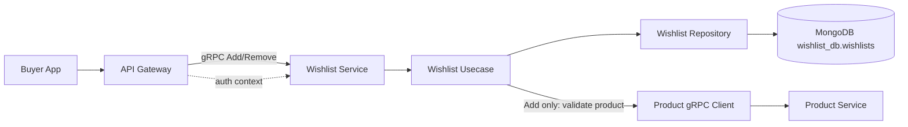
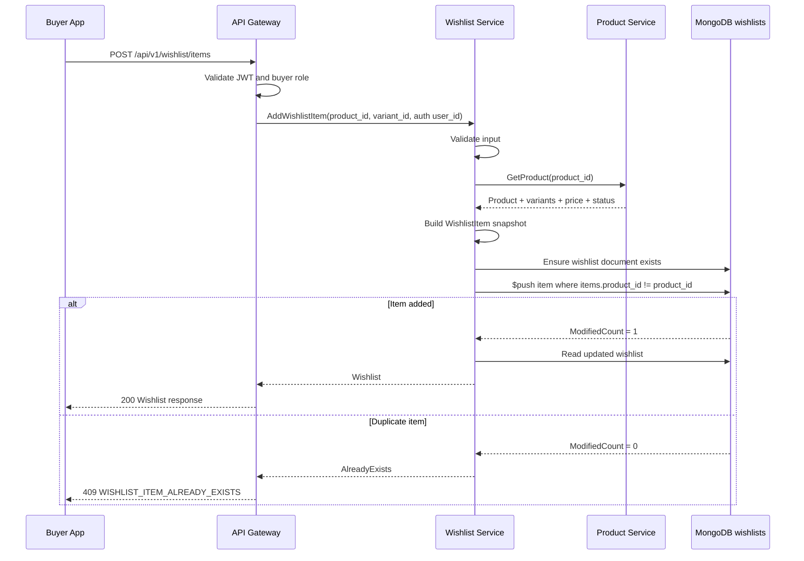
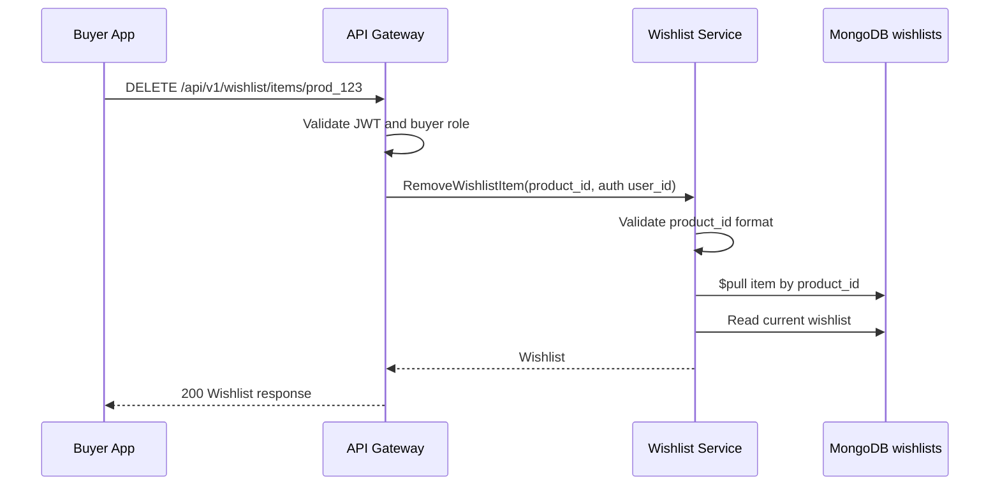

# 💖 Wishlist Service - Task 4: Add/Remove Item APIs


---

## 📌 Task Summary

| Field | Detail |
|---|---|
| Service | Wishlist Service |
| Task | Task 4 - Add/remove item APIs |
| Source | `docs/01-micro-tasks.md` -> `Wishlist Service` -> Task 4 |
| Requirement | Product id validate karke wishlist item add/remove karo. Duplicate item block karo. |
| Dependency | Product Service |
| Priority | P1 |
| Final Decision | **Buyer-authenticated add/remove APIs with Product Service validation and MongoDB duplicate-safe writes** |
| Output | Documentation-only implementation guide for Wishlist Task 4 |

> **Simple Hinglish goal:** Is task ka kaam Wishlist Service me product add/remove APIs ka implementation plan banana hai. Add ke time Product Service se product validate hoga, same product duplicate add nahi hoga, aur remove ke time user's wishlist se item safely delete hoga.

---

## ✅ Final Output Created

```text
TaskImplementation/
└── Wishlist Service/
    ├── task1.md
    ├── task2.md
    ├── task3.md
    └── task4.md
```

### Why this structure?

| Folder/File | Purpose |
|---|---|
| `TaskImplementation/` | Saare task-wise implementation guides ka central folder |
| `Wishlist Service/` | Wishlist service ke task guides ko group karta hai |
| `task1.md` | Wishlist model decision guide |
| `task2.md` | MongoDB choice guide |
| `task3.md` | `wishlists` collection design guide |
| `task4.md` | Sirf **Wishlist Service - Task 4** ka add/remove API implementation guide |

> 🟢 **Note:** Is task me actual backend service files create nahi kiye gaye. User ke requested output ke according sirf `task4.md` guide generate kiya gaya hai.

---

## 🧭 Documents Studied

| Document | Kya use kiya gaya |
|---|---|
| `docs/01-micro-tasks.md` | Task 4 ka exact scope: product id validate, add/remove, duplicate block |
| `TaskImplementation/Wishlist Service/task1.md` | Single private wishlist per buyer model |
| `TaskImplementation/Wishlist Service/task2.md` | MongoDB as Wishlist primary DB |
| `TaskImplementation/Wishlist Service/task3.md` | `wishlist_db.wishlists` collection, fields, indexes |
| `docs/04-microservice-design.md` | Wishlist APIs, Product Service dependency, duplicate rule |
| `docs/05-database-design.md` | Wishlist indexes: `user_id`, `items.product_id` |
| `docs/03-folder-structure.md` | Future backend `wishlist-service` clean architecture layout |
| `docs/02-system-architecture.md` | REST through Gateway, internal gRPC, no cross-service DB access |
| `docs/06-auth-security.md` | Buyer auth, JWT claims, input validation layers |
| `docs/13-developer-guide.md` | Backend coding flow, REST error format, testing strategy |
| `database/mongodb-schema-design.md` | Wishlist example document and indexes |
| `api/master-api.json` | REST/gRPC contracts: `AddWishlistItem`, `RemoveWishlistItem` |

---

## 🧱 Task Boundary

### ✅ Included in Task 4

| Included | Explanation |
|---|---|
| Add wishlist item API | `POST /api/v1/wishlist/items` and `WishlistService.AddWishlistItem` |
| Remove wishlist item API | `DELETE /api/v1/wishlist/items/{product_id}` and `WishlistService.RemoveWishlistItem` |
| Buyer auth rule | `user_id` JWT/auth context se aayega, request body se nahi |
| Product validation | Add ke time Product Service se product existence/status validate hoga |
| Variant validation | Agar `variant_id` diya hai to Product Service response me variant exist hona chahiye |
| Duplicate blocking | Same `product_id` same user's wishlist me dobara add nahi hoga |
| MongoDB write strategy | Atomic `$push` with duplicate guard and `$pull` for remove |
| Error mapping | gRPC status -> REST-friendly error code mapping |
| Code examples | Proto, Go usecase, repository, handler, and test snippets |
| Diagrams | Architecture and add/remove sequence diagrams |
| External tools | MongoDB Go Driver, gRPC/protobuf tooling, `mongosh`, Docker Compose |

### ❌ Not Included in Task 4

| Not Included | Future Task |
|---|---|
| Move wishlist item to cart | Wishlist Service Task 5 |
| Product deleted/out-of-stock event consumer | Wishlist Service Task 6 |
| Price drop notification trigger | Wishlist Service Task 7 |
| Analytics event publish | Wishlist Service Task 8 |
| `wishlist_events` collection implementation | Wishlist Service Task 8 or event/audit task |
| Frontend wishlist page | User App Frontend tasks |
| Cart Service integration | Task 5 |

> 🔴 **Important boundary:** Task 4 Product Service se product validate karega, but Product Service ke database ko directly query nahi karega. Microservice rule same rahega: direct cross-service DB access allowed nahi.

---

## 🧩 Final API Decision

### REST APIs

| Action | Method | Path | Auth | Request | Response |
|---|---|---|---|---|---|
| Add item | `POST` | `/api/v1/wishlist/items` | buyer | `WishlistItemInput` | `Wishlist` |
| Remove item | `DELETE` | `/api/v1/wishlist/items/{product_id}` | buyer | `IdPathRequest` | `Wishlist` |

### gRPC APIs

| Action | gRPC Method | Input | Output | Auth |
|---|---|---|---|---|
| Add item | `WishlistService.AddWishlistItem` | `WishlistItemInput` | `Wishlist` | buyer |
| Remove item | `WishlistService.RemoveWishlistItem` | `IdPathRequest` | `Wishlist` | buyer |

### Request schemas from `api/master-api.json`

```json
{
  "WishlistItemInput": {
    "type": "object",
    "required": ["product_id"],
    "properties": {
      "product_id": { "type": "string" },
      "variant_id": { "type": "string" }
    }
  }
}
```

```json
{
  "Wishlist": {
    "type": "object",
    "properties": {
      "wishlist_id": { "type": "string" },
      "user_id": { "type": "string" },
      "items": {
        "type": "array",
        "items": { "type": "object" }
      }
    }
  }
}
```

---

## 🪜 Step-by-Step Implementation

## Step 1: Previous Tasks Ko Base Banaya

Task 1, 2, and 3 se final base ye hai:

```text
One authenticated buyer -> One private wishlist -> MongoDB document -> Embedded items array
```

Existing collection:

```text
Database: wishlist_db
Collection: wishlists
Primary lookup: user_id
Duplicate check: items.product_id
```

Task 4 isi model par add/remove behavior build karega.

### Why this matters?

| Previous Decision | Task 4 Impact |
|---|---|
| Single private wishlist | Add/remove hamesha auth user ki wishlist par operate karega |
| MongoDB document model | `$push` and `$pull` se item list update hogi |
| `items.product_id` index | Product presence check fast hoga |
| Product Service dependency | Add se pehle product validate hoga |

---

## Step 2: Authenticated User Context Fix Kiya

Wishlist APIs buyer-auth protected hain.

### Final rule

```text
user_id request body se nahi aayega.
user_id JWT/auth context se aayega.
```

### Why?

Agar request body me `user_id` allow karenge, to malicious user kisi aur user ki wishlist modify kar sakta hai. Isliye Gateway JWT validate karega, phir gRPC metadata/context me authenticated `user_id` pass karega.

### Context example

```json
{
  "sub": "user_123",
  "sid": "sess_123",
  "roles": ["buyer"],
  "token_type": "access"
}
```

Wishlist Service usecase me:

```text
auth context sub -> user_id -> wishlist owner
```

---

## Step 3: Add Item Request Validate Kiya

Add API ka input:

```json
{
  "product_id": "prod_123",
  "variant_id": "var_1"
}
```

### Validation rules

| Field | Rule | Error if invalid |
|---|---|---|
| `product_id` | Required, non-empty, valid id format | `VALIDATION_ERROR` |
| `variant_id` | Optional, but if present non-empty | `VALIDATION_ERROR` |
| `user_id` | Required from auth context | `UNAUTHENTICATED` |

### Beginner explanation

- `product_id` zaruri hai because wishlist me product save karna hai.
- `variant_id` optional hai because kuch products variant-less ho sakte hain.
- `user_id` body me nahi hota, auth token se trusted source ke through milta hai.

---

## Step 4: Product Service Se Product Validate Kiya

Add item ke time Wishlist Service ko ye confirm karna hoga ki product valid hai.

### Product validation flow

```text
Wishlist Service -> Product Service.GetProduct(product_id)
```

### Validation checks

| Check | Why needed | Error |
|---|---|---|
| Product exists | Deleted/fake product wishlist me add nahi hona chahiye | `PRODUCT_NOT_FOUND` |
| Product status is published | Draft/unpublished product buyer ko save nahi karna chahiye | `PRODUCT_NOT_AVAILABLE` |
| Variant exists if `variant_id` provided | Invalid variant selection avoid karna hai | `VARIANT_NOT_FOUND` |
| Price snapshot available | Wishlist UI me last known price show ho sakta hai | fallback `null` allowed |
| Availability derived | Future UI me in-stock/out-of-stock show ho sakta hai | `unknown` fallback |

### Important boundary

```text
Wishlist Service Product Service ka DB direct read nahi karega.
Wishlist Service sirf Product Service gRPC/API se product validate karega.
```

### Product validation result example

```go
type ValidatedProduct struct {
	ProductID    string
	VariantID    string
	Status       string
	PriceAmount  int64
	Currency     string
	Availability string
}
```

---

## Step 5: Wishlist Item Snapshot Build Kiya

Product validation ke baad Wishlist Service embedded item banata hai.

### Item shape

```json
{
  "product_id": "prod_123",
  "variant_id": "var_1",
  "added_at": "2026-05-25T00:00:00Z",
  "last_known_price": {
    "amount": 299900,
    "currency": "INR"
  },
  "availability": "in_stock"
}
```

### Why snapshot store karte hain?

| Snapshot Field | Reason |
|---|---|
| `last_known_price` | Wishlist page par price display fast hota hai |
| `availability` | User ko product unavailable/deleted status dikha sakte hain |
| `added_at` | User sorting/history ke liye useful |

> 🟡 **Note:** `last_known_price` final price nahi hai. Checkout ke time final price Product/Order flow fresh validate karega.

---

## Step 6: Duplicate Item Block Kiya

Requirement clearly bolta hai:

```text
Duplicate item block karo.
```

### Final duplicate rule

```text
Same user_id + same product_id = duplicate
```

| Scenario | Result |
|---|---|
| User first time product add karta hai | ✅ Item add |
| Same user same product dobara add karta hai | ❌ `WISHLIST_ITEM_ALREADY_EXISTS` |
| Same user same product different variant ke saath add karta hai | ❌ Duplicate, because MVP product-level wishlist hai |
| Different user same product add karta hai | ✅ Allowed |

### Why `variant_id` duplicate key nahi hai?

Task 1 me product-level wishlist rule decide hua tha. Isliye same product ke multiple variants same wishlist me duplicate entries nahi banenge. Future me variant-level wishlist chahiye ho to duplicate key change ho sakta hai:

```text
Future possible key: product_id + variant_id
Current MVP key: product_id
```

---

## Step 7: MongoDB Add Strategy Design Kiya

Add operation duplicate-safe hona chahiye. Race condition example:

```text
User double click karta hai -> do add requests same time aate hain
```

Is case me bhi duplicate item nahi banna chahiye.

### Recommended repository flow

```text
1. Ensure wishlist document exists for user_id.
2. Atomic update:
   filter = { user_id, "items.product_id": { "$ne": product_id } }
   update = { "$push": { items: item }, "$set": { updated_at: now } }
3. If ModifiedCount == 0, product already exists.
4. Return updated wishlist.
```

### Mongo query example

```javascript
db.wishlists.updateOne(
  {
    user_id: "user_123",
    "items.product_id": { $ne: "prod_123" }
  },
  {
    $push: {
      items: {
        product_id: "prod_123",
        variant_id: "var_1",
        added_at: ISODate("2026-05-25T00:00:00Z"),
        last_known_price: {
          amount: NumberLong("299900"),
          currency: "INR"
        },
        availability: "in_stock"
      }
    },
    $set: {
      updated_at: ISODate("2026-05-25T00:00:00Z")
    }
  }
)
```

### Why this blocks duplicate?

Filter me condition hai:

```javascript
"items.product_id": { $ne: "prod_123" }
```

Matlab update sirf tab chalega jab wishlist me `prod_123` already nahi hai. Agar product already hai, update modify nahi karega, aur code duplicate error return karega.

---

## Step 8: MongoDB Remove Strategy Design Kiya

Remove operation product ko user's wishlist se pull karega.

### Final remove rule

```text
DELETE absent item should be idempotent.
```

Matlab agar user same product remove request dobara bhejta hai, service current wishlist return kar sakti hai. Ye frontend UX ke liye simple hai.

### Mongo query example

```javascript
db.wishlists.updateOne(
  {
    user_id: "user_123",
    "items.product_id": "prod_123"
  },
  {
    $pull: {
      items: {
        product_id: "prod_123"
      }
    },
    $set: {
      updated_at: ISODate("2026-05-25T00:00:00Z")
    }
  }
)
```

### Why remove me Product Service validation nahi?

Remove ke liye product currently exist karna zaruri nahi. Agar Product Service me product delete ho gaya hai, user ko phir bhi stale wishlist item remove karne dena chahiye.

```text
Add -> Product Service validation required
Remove -> Product id format validation enough
```

> 🔵 **Timestamp note:** Remove query me `"items.product_id"` filter isliye add kiya gaya hai taaki product already absent ho to `updated_at` unnecessarily change na ho.

---

## Step 9: Response Mapping Final Kiya

Add/remove ke baad API updated wishlist return karegi.

### MongoDB document

```javascript
{
  _id: "wish_123",
  user_id: "user_123",
  visibility: "private",
  items: [
    {
      product_id: "prod_123",
      variant_id: "var_1",
      added_at: ISODate("2026-05-25T00:00:00Z"),
      last_known_price: {
        amount: NumberLong("299900"),
        currency: "INR"
      },
      availability: "in_stock"
    }
  ],
  created_at: ISODate("2026-05-25T00:00:00Z"),
  updated_at: ISODate("2026-05-25T00:00:00Z")
}
```

### API response

```json
{
  "data": {
    "wishlist_id": "wish_123",
    "user_id": "user_123",
    "items": [
      {
        "product_id": "prod_123",
        "variant_id": "var_1",
        "added_at": "2026-05-25T00:00:00Z",
        "last_known_price": {
          "amount": 299900,
          "currency": "INR"
        },
        "availability": "in_stock"
      }
    ]
  },
  "request_id": "req_123",
  "error": null
}
```

### Mapping rule

```text
MongoDB _id -> API wishlist_id
```

---

## Step 10: Error Handling Define Kiya

### Domain errors

| Case | Domain Code | gRPC Code | REST Status |
|---|---|---:|---:|
| Missing/invalid `product_id` | `VALIDATION_ERROR` | `InvalidArgument` | `400` |
| Missing auth user | `UNAUTHENTICATED` | `Unauthenticated` | `401` |
| Product not found | `PRODUCT_NOT_FOUND` | `NotFound` | `404` |
| Product unpublished/deleted | `PRODUCT_NOT_AVAILABLE` | `FailedPrecondition` | `409` |
| Variant not found | `VARIANT_NOT_FOUND` | `InvalidArgument` | `400` |
| Duplicate wishlist item | `WISHLIST_ITEM_ALREADY_EXISTS` | `AlreadyExists` | `409` |
| MongoDB failure | `INTERNAL_ERROR` | `Internal` | `500` |
| Product Service timeout | `PRODUCT_SERVICE_UNAVAILABLE` | `Unavailable` | `503` |

### Error response example

```json
{
  "data": null,
  "request_id": "req_123",
  "error": {
    "code": "WISHLIST_ITEM_ALREADY_EXISTS",
    "message": "Product already exists in wishlist",
    "details": [
      {
        "field": "product_id",
        "value": "prod_123"
      }
    ]
  }
}
```

---

## 🧠 Domain Rules

| Rule | Explanation |
|---|---|
| Wishlist owner is auth user | Buyer sirf apni wishlist modify karega |
| Add validates product | Fake/deleted product add nahi hoga |
| Remove does not validate product existence | Deleted product ko wishlist se remove karna possible rahega |
| Duplicate key is `product_id` | MVP product-level wishlist hai |
| Add returns updated wishlist | Frontend ko fresh state milti hai |
| Remove is idempotent | Double delete UX friendly rahta hai |
| `updated_at` changes on mutation | Last modified time accurate rahega |
| `items.added_at` immutable | Item add time stable rahega |

---

## 🧾 Proto Contract Example

> ⚠️ Ye future implementation reference hai. Actual `proto/` files Task 4 guide me create nahi kiye gaye.

```proto
syntax = "proto3";

package ecommerce.wishlist.v1;

import "google/protobuf/timestamp.proto";

service WishlistService {
  rpc AddWishlistItem(WishlistItemInput) returns (Wishlist);
  rpc RemoveWishlistItem(IdPathRequest) returns (Wishlist);
}

message WishlistItemInput {
  string product_id = 1;
  string variant_id = 2;
}

message IdPathRequest {
  string id = 1;
}

message Money {
  int64 amount = 1;
  string currency = 2;
}

message WishlistItem {
  string product_id = 1;
  string variant_id = 2;
  google.protobuf.Timestamp added_at = 3;
  Money last_known_price = 4;
  string availability = 5;
}

message Wishlist {
  string wishlist_id = 1;
  string user_id = 2;
  repeated WishlistItem items = 3;
}
```

### Proto explanation

| Part | Purpose |
|---|---|
| `WishlistItemInput` | Add API body |
| `IdPathRequest` | Remove API path id, yahan product id pass hoga |
| `WishlistItem` | API response item |
| `Wishlist` | Add/remove ke baad updated wishlist response |

---

## 🧩 Go Domain Example

> ⚠️ Reference code only. Is guide ne actual `.go` file create nahi kiya.

```go
package domain

import "time"

type Availability string

const (
	AvailabilityUnknown    Availability = "unknown"
	AvailabilityInStock    Availability = "in_stock"
	AvailabilityOutOfStock Availability = "out_of_stock"
)

type MoneySnapshot struct {
	Amount   int64  `bson:"amount" json:"amount"`
	Currency string `bson:"currency" json:"currency"`
}

type WishlistItem struct {
	ProductID      string         `bson:"product_id" json:"product_id"`
	VariantID      string         `bson:"variant_id,omitempty" json:"variant_id,omitempty"`
	AddedAt        time.Time      `bson:"added_at" json:"added_at"`
	LastKnownPrice *MoneySnapshot `bson:"last_known_price,omitempty" json:"last_known_price,omitempty"`
	Availability   Availability   `bson:"availability,omitempty" json:"availability,omitempty"`
}

type Wishlist struct {
	ID         string         `bson:"_id" json:"wishlist_id"`
	UserID     string         `bson:"user_id" json:"user_id"`
	Visibility string         `bson:"visibility" json:"visibility"`
	Items      []WishlistItem `bson:"items" json:"items"`
	CreatedAt  time.Time      `bson:"created_at" json:"created_at"`
	UpdatedAt  time.Time      `bson:"updated_at" json:"updated_at"`
}
```

---

## 🔌 Product Client Interface Example

Usecase ko Product Service ke generated gRPC client par directly tightly couple nahi karna chahiye. Interface bana kar testing easy hoti hai.

```go
package usecase

import "context"

type ProductSnapshot struct {
	ProductID    string
	VariantID    string
	Status       string
	PriceAmount  int64
	Currency     string
	Availability string
}

type ProductValidator interface {
	ValidateWishlistProduct(ctx context.Context, productID, variantID string) (*ProductSnapshot, error)
}
```

### Why interface?

| Benefit | Explanation |
|---|---|
| Test-friendly | Unit tests me fake ProductValidator use kar sakte hain |
| Loose coupling | Usecase generated gRPC details se independent rahega |
| Clean architecture | Usecase interface depend karta hai, infra implementation provide karta hai |

---

## 🧠 Usecase Example: Add Item

```go
package usecase

import (
	"context"
	"strings"
	"time"
)

type AddWishlistItemInput struct {
	UserID    string
	ProductID string
	VariantID string
}

func (u *WishlistUsecase) AddItem(ctx context.Context, input AddWishlistItemInput) (*Wishlist, error) {
	userID := strings.TrimSpace(input.UserID)
	productID := strings.TrimSpace(input.ProductID)
	variantID := strings.TrimSpace(input.VariantID)

	if userID == "" {
		return nil, ErrUnauthenticated
	}
	if productID == "" {
		return nil, ErrInvalidProductID
	}

	product, err := u.productValidator.ValidateWishlistProduct(ctx, productID, variantID)
	if err != nil {
		return nil, err
	}

	now := time.Now().UTC()
	item := WishlistItem{
		ProductID: product.ProductID,
		VariantID: product.VariantID,
		AddedAt: now,
		LastKnownPrice: &MoneySnapshot{
			Amount: product.PriceAmount,
			Currency: product.Currency,
		},
		Availability: Availability(product.Availability),
	}

	if err := u.repo.EnsureWishlist(ctx, userID, now); err != nil {
		return nil, err
	}

	if err := u.repo.AddItemIfNotExists(ctx, userID, item, now); err != nil {
		return nil, err
	}

	return u.repo.GetByUserID(ctx, userID)
}
```

### Add usecase explanation

| Line/Part | Explanation |
|---|---|
| `TrimSpace` | Empty or space-only IDs reject karne ke liye |
| `ValidateWishlistProduct` | Product Service se existence/status/variant check |
| `time.Now().UTC()` | Consistent timestamp storage |
| `EnsureWishlist` | User ka wishlist document missing ho to create |
| `AddItemIfNotExists` | Atomic duplicate guard ke saath item add |
| `GetByUserID` | Updated wishlist response return |

---

## 🧠 Usecase Example: Remove Item

```go
package usecase

import (
	"context"
	"strings"
	"time"
)

type RemoveWishlistItemInput struct {
	UserID    string
	ProductID string
}

func (u *WishlistUsecase) RemoveItem(ctx context.Context, input RemoveWishlistItemInput) (*Wishlist, error) {
	userID := strings.TrimSpace(input.UserID)
	productID := strings.TrimSpace(input.ProductID)

	if userID == "" {
		return nil, ErrUnauthenticated
	}
	if productID == "" {
		return nil, ErrInvalidProductID
	}

	now := time.Now().UTC()

	if err := u.repo.RemoveItem(ctx, userID, productID, now); err != nil {
		return nil, err
	}

	wishlist, err := u.repo.GetByUserID(ctx, userID)
	if err == ErrWishlistNotFound {
		return u.repo.CreateEmptyWishlist(ctx, userID, now)
	}
	if err != nil {
		return nil, err
	}

	return wishlist, nil
}
```

### Remove usecase explanation

| Part | Explanation |
|---|---|
| No Product Service call | Deleted/stale product ko bhi remove karna possible |
| `$pull` repository call | Matching product item array se remove hoga |
| Idempotent behavior | Item absent ho to current wishlist return |
| Empty wishlist fallback | User ke paas document nahi hai to empty wishlist response possible |

---

## 🗄️ Mongo Repository Example

> ⚠️ Reference code only. Future implementation me exact package paths repo ke generated/shared packages ke according adjust honge.

```go
package repository

import (
	"context"
	"errors"
	"time"

	"go.mongodb.org/mongo-driver/v2/bson"
	"go.mongodb.org/mongo-driver/v2/mongo"
	"go.mongodb.org/mongo-driver/v2/mongo/options"
)

var ErrWishlistItemAlreadyExists = errors.New("wishlist item already exists")

type WishlistRepository struct {
	collection *mongo.Collection
	idFactory  func() string
}

func (r *WishlistRepository) EnsureWishlist(ctx context.Context, userID string, now time.Time) error {
	_, err := r.collection.UpdateOne(
		ctx,
		bson.M{"user_id": userID},
		bson.M{
			"$setOnInsert": bson.M{
				"_id":        r.idFactory(),
				"user_id":    userID,
				"visibility": "private",
				"items":      bson.A{},
				"created_at": now,
				"updated_at": now,
			},
		},
		options.UpdateOne().SetUpsert(true),
	)
	if mongo.IsDuplicateKeyError(err) {
		return nil
	}
	return err
}

func (r *WishlistRepository) AddItemIfNotExists(ctx context.Context, userID string, item WishlistItem, now time.Time) error {
	result, err := r.collection.UpdateOne(
		ctx,
		bson.M{
			"user_id": userID,
			"items.product_id": bson.M{
				"$ne": item.ProductID,
			},
		},
		bson.M{
			"$push": bson.M{
				"items": item,
			},
			"$set": bson.M{
				"updated_at": now,
			},
		},
	)
	if err != nil {
		return err
	}
	if result.ModifiedCount == 0 {
		return ErrWishlistItemAlreadyExists
	}
	return nil
}

func (r *WishlistRepository) RemoveItem(ctx context.Context, userID, productID string, now time.Time) error {
	_, err := r.collection.UpdateOne(
		ctx,
		bson.M{
			"user_id": userID,
			"items.product_id": productID,
		},
		bson.M{
			"$pull": bson.M{
				"items": bson.M{
					"product_id": productID,
				},
			},
			"$set": bson.M{
				"updated_at": now,
			},
		},
	)
	return err
}
```

### Repository explanation

| Method | Purpose |
|---|---|
| `EnsureWishlist` | User ke liye document create karta hai if missing |
| `AddItemIfNotExists` | Duplicate product guard ke saath atomic add |
| `RemoveItem` | Product item array se remove karta hai |

> 🔵 **Race note:** `EnsureWishlist` me duplicate key error ko success treat kiya ja sakta hai, kyunki parallel request ne same `user_id` ka wishlist document already create kar diya hoga.

### Race-condition safety

| Race Scenario | Result |
|---|---|
| Two add requests same product same user | First succeeds, second `ModifiedCount == 0` |
| Remove while add happening | Last write wins at item level; response fresh read se return |
| Missing wishlist add | `EnsureWishlist` creates document |
| Missing wishlist remove | No-op, then empty wishlist can be returned |

---

## 🌐 API Gateway Mapping Example

API Gateway public REST receive karega aur internal gRPC call karega.

### Add route

```text
POST /api/v1/wishlist/items
Authorization: Bearer <access_token>
Content-Type: application/json
```

Request:

```json
{
  "product_id": "prod_123",
  "variant_id": "var_1"
}
```

Gateway behavior:

```text
1. JWT validate karo.
2. buyer role allow karo.
3. JSON body validate karo.
4. user_id auth context me inject karo.
5. WishlistService.AddWishlistItem gRPC call karo.
6. gRPC response ko REST JSON envelope me map karo.
```

### Remove route

```text
DELETE /api/v1/wishlist/items/prod_123
Authorization: Bearer <access_token>
```

Gateway behavior:

```text
1. JWT validate karo.
2. buyer role allow karo.
3. path product_id validate karo.
4. user_id auth context me inject karo.
5. WishlistService.RemoveWishlistItem gRPC call karo.
6. Updated wishlist return karo.
```

---

## 🚦 gRPC Handler Example

```go
package grpc

import (
	"context"

	wishlistv1 "example.com/ecommerce/gen/ecommerce/wishlist/v1"
)

type WishlistHandler struct {
	wishlistv1.UnimplementedWishlistServiceServer
	usecase *WishlistUsecase
}

func (h *WishlistHandler) AddWishlistItem(ctx context.Context, req *wishlistv1.WishlistItemInput) (*wishlistv1.Wishlist, error) {
	userID, err := UserIDFromContext(ctx)
	if err != nil {
		return nil, mapDomainError(err)
	}

	wishlist, err := h.usecase.AddItem(ctx, AddWishlistItemInput{
		UserID:    userID,
		ProductID: req.GetProductId(),
		VariantID: req.GetVariantId(),
	})
	if err != nil {
		return nil, mapDomainError(err)
	}

	return mapWishlistToProto(wishlist), nil
}

func (h *WishlistHandler) RemoveWishlistItem(ctx context.Context, req *wishlistv1.IdPathRequest) (*wishlistv1.Wishlist, error) {
	userID, err := UserIDFromContext(ctx)
	if err != nil {
		return nil, mapDomainError(err)
	}

	wishlist, err := h.usecase.RemoveItem(ctx, RemoveWishlistItemInput{
		UserID:    userID,
		ProductID: req.GetId(),
	})
	if err != nil {
		return nil, mapDomainError(err)
	}

	return mapWishlistToProto(wishlist), nil
}
```

### Handler responsibility

| Handler Does | Handler Does Not Do |
|---|---|
| Auth context read | Product validation business logic |
| Request DTO mapping | MongoDB query writing |
| Usecase call | Duplicate rule implementation |
| Domain error to gRPC error map | Direct DB access |

---

## 📦 External Libraries / Tools

Task 4 guide create karne ke liye koi package install nahi kiya gaya. Future backend implementation ke liye ye tools/libraries use honge.

| Tool/Library | What it is | Why used | Install / Use |
|---|---|---|---|
| MongoDB | Document database | `wishlist_db.wishlists` collection me wishlist items store karne ke liye | Docker Compose/local MongoDB |
| MongoDB Go Driver v2 | Official Go MongoDB driver | `$push`, `$pull`, `UpdateOne`, BSON mapping ke liye | `go get go.mongodb.org/mongo-driver/v2/mongo` |
| gRPC Go | Go gRPC runtime | Wishlist Service and Product Service internal calls ke liye | `go get google.golang.org/grpc` |
| Protobuf Go | Generated protobuf types | Typed request/response contracts ke liye | `go install google.golang.org/protobuf/cmd/protoc-gen-go@latest` |
| gRPC Go plugin | gRPC service stubs generate karne ke liye | Proto se Go server/client code generate hota hai | `go install google.golang.org/grpc/cmd/protoc-gen-go-grpc@latest` |
| Buf CLI | Proto lint/generate workflow | Repo developer guide me proto generation ke liye recommended | `buf generate` |
| `mongosh` | MongoDB shell | Manual add/remove query verify karne ke liye | `mongosh "mongodb://localhost:27017"` |
| Docker Compose | Local infra runner | MongoDB local stack start karne ke liye | `docker compose up -d mongo` |

### Install examples

Wishlist Service module ready hone ke baad:

```bash
cd backend/services/wishlist-service
go get go.mongodb.org/mongo-driver/v2/mongo
go get google.golang.org/grpc
```

Proto generator setup:

```bash
go install google.golang.org/protobuf/cmd/protoc-gen-go@latest
go install google.golang.org/grpc/cmd/protoc-gen-go-grpc@latest
buf generate
```

MongoDB local check:

```bash
docker compose up -d mongo
mongosh "mongodb://localhost:27017"
```

### Basic env config

```env
WISHLIST_SERVICE_PORT=50054
WISHLIST_MONGO_URI=mongodb://localhost:27017
WISHLIST_MONGO_DATABASE=wishlist_db
WISHLIST_MONGO_COLLECTION=wishlists
PRODUCT_SERVICE_GRPC_ADDR=localhost:50053
WISHLIST_PRODUCT_CALL_TIMEOUT_MS=1000
```

---

## 🗂️ Clean Folder Structure

### Created/kept in this task

```text
TaskImplementation/
└── Wishlist Service/
    ├── task1.md
    ├── task2.md
    ├── task3.md
    └── task4.md
```

### Future backend implementation reference only

> 🔴 **Important:** Neeche wala backend structure Task 4 guide me create nahi kiya gaya. Ye actual implementation ke liye reference hai.

```text
backend/
└── services/
    └── wishlist-service/
        ├── cmd/
        │   └── server/
        │       └── main.go
        ├── internal/
        │   ├── clients/
        │   │   └── product_client.go
        │   ├── config/
        │   │   └── config.go
        │   ├── domain/
        │   │   └── wishlist.go
        │   ├── repository/
        │   │   └── mongo_wishlist_repository.go
        │   ├── transport/
        │   │   └── grpc/
        │   │       ├── server.go
        │   │       └── wishlist_handler.go
        │   └── usecase/
        │       ├── add_item.go
        │       ├── remove_item.go
        │       └── wishlist_usecase.go
        └── deploy/
```

### Future API Gateway reference

```text
backend/
└── services/
    └── api-gateway/
        └── internal/
            ├── clients/
            │   └── wishlist_client.go
            ├── handlers/
            │   └── wishlist_handler.go
            └── routes/
                └── routes.go
```

### File responsibility

| Future File | Responsibility |
|---|---|
| `domain/wishlist.go` | Wishlist structs and domain constants |
| `usecase/add_item.go` | Product validation + duplicate-safe add workflow |
| `usecase/remove_item.go` | Idempotent remove workflow |
| `repository/mongo_wishlist_repository.go` | MongoDB `EnsureWishlist`, `AddItemIfNotExists`, `RemoveItem` |
| `clients/product_client.go` | Product Service gRPC validation client |
| `transport/grpc/wishlist_handler.go` | gRPC request mapping and error mapping |
| `api-gateway/handlers/wishlist_handler.go` | REST request parsing and response envelope |

---

## 🏗️ Architecture Diagram



### Diagram explanation

- Buyer REST API Gateway ko call karta hai.
- Gateway auth validate karke internal gRPC call karta hai.
- Wishlist Service usecase business logic run karta hai.
- Add ke time Product Service se product validate hota hai.
- Repository MongoDB me wishlist document update karta hai.

---

## ➕ Add Item Flow Diagram



---

## ➖ Remove Item Flow Diagram



### Remove flow note

Product Service call remove me intentionally nahi hoti. Reason: agar product already deleted hai, user ko phir bhi wishlist se remove karna allowed hona chahiye.

---

## 🔁 API Examples

### Add item success

```bash
curl -X POST "https://api.example.com/api/v1/wishlist/items" \
  -H "Authorization: Bearer <access_token>" \
  -H "Content-Type: application/json" \
  -d '{
    "product_id": "prod_123",
    "variant_id": "var_1"
  }'
```

Response:

```json
{
  "data": {
    "wishlist_id": "wish_123",
    "user_id": "user_123",
    "items": [
      {
        "product_id": "prod_123",
        "variant_id": "var_1",
        "added_at": "2026-05-25T00:00:00Z",
        "last_known_price": {
          "amount": 299900,
          "currency": "INR"
        },
        "availability": "in_stock"
      }
    ]
  },
  "request_id": "req_123",
  "error": null
}
```

### Duplicate add error

```json
{
  "data": null,
  "request_id": "req_124",
  "error": {
    "code": "WISHLIST_ITEM_ALREADY_EXISTS",
    "message": "Product already exists in wishlist",
    "details": []
  }
}
```

### Remove item success

```bash
curl -X DELETE "https://api.example.com/api/v1/wishlist/items/prod_123" \
  -H "Authorization: Bearer <access_token>"
```

Response:

```json
{
  "data": {
    "wishlist_id": "wish_123",
    "user_id": "user_123",
    "items": []
  },
  "request_id": "req_125",
  "error": null
}
```

---

## 🧪 Test Plan

### Unit tests

| Test | Expected |
|---|---|
| Add missing `product_id` | `VALIDATION_ERROR` |
| Add missing auth user | `UNAUTHENTICATED` |
| Add product not found | `PRODUCT_NOT_FOUND` |
| Add unpublished product | `PRODUCT_NOT_AVAILABLE` |
| Add invalid variant | `VARIANT_NOT_FOUND` |
| Add valid product | Wishlist has new item |
| Add duplicate product | `WISHLIST_ITEM_ALREADY_EXISTS` |
| Remove existing product | Wishlist no longer has item |
| Remove absent product | Success with current wishlist |
| Remove missing auth user | `UNAUTHENTICATED` |

### Repository tests

| Test | Expected |
|---|---|
| `EnsureWishlist` creates document | Document exists with `visibility: private` |
| `EnsureWishlist` called twice | Still one document because `user_id` unique |
| `AddItemIfNotExists` first call | `ModifiedCount == 1` |
| `AddItemIfNotExists` duplicate call | Duplicate error |
| Parallel duplicate add | Only one item stored |
| `RemoveItem` | Matching `product_id` removed |

### gRPC handler tests

| Test | Expected |
|---|---|
| Auth context missing | `Unauthenticated` |
| Invalid request mapped | `InvalidArgument` |
| Duplicate mapped | `AlreadyExists` |
| Product timeout mapped | `Unavailable` |

### Gateway tests

| Test | Expected |
|---|---|
| POST without token | `401` |
| POST with invalid body | `400` |
| POST duplicate | `409` |
| DELETE with token | `200` |
| Response envelope | `{ data, request_id, error }` format |

---

## 🧪 Example Unit Test Sketch

```go
func TestAddItemBlocksDuplicate(t *testing.T) {
	ctx := context.Background()
	repo := NewFakeWishlistRepository()
	productValidator := &FakeProductValidator{
		Product: &ProductSnapshot{
			ProductID: "prod_123",
			VariantID: "var_1",
			Status: "published",
			PriceAmount: 299900,
			Currency: "INR",
			Availability: "in_stock",
		},
	}
	usecase := NewWishlistUsecase(repo, productValidator)

	_, err := usecase.AddItem(ctx, AddWishlistItemInput{
		UserID: "user_123",
		ProductID: "prod_123",
		VariantID: "var_1",
	})
	require.NoError(t, err)

	_, err = usecase.AddItem(ctx, AddWishlistItemInput{
		UserID: "user_123",
		ProductID: "prod_123",
		VariantID: "var_1",
	})
	require.ErrorIs(t, err, ErrWishlistItemAlreadyExists)
}
```

### Test explanation

Pehle add successful hota hai. Second add same `user_id + product_id` ke saath duplicate error return karta hai. Ye exactly Task 4 ka main business rule verify karta hai.

---

## 🔐 Security Checklist

| Security Rule | Status |
|---|---:|
| Buyer auth required | ✅ |
| `user_id` request body se accept nahi hota | ✅ |
| Gateway route-level authorization | ✅ |
| Service-level auth context check | ✅ |
| Product ID validation | ✅ |
| Direct Product DB access banned | ✅ |
| MongoDB update scoped by `user_id` | ✅ |
| Duplicate add blocked | ✅ |
| gRPC deadlines for Product Service call | ✅ |

---

## ⚙️ Operational Notes

| Concern | Recommended Handling |
|---|---|
| Product Service timeout | Short deadline, return `PRODUCT_SERVICE_UNAVAILABLE` |
| MongoDB slow query | Ensure `user_id` and `items.product_id` indexes exist from Task 3 |
| Large wishlist array | Future max item limit can be config-driven |
| Duplicate races | Atomic Mongo filter prevents duplicate item |
| Observability | Log `request_id`, `user_id`, `product_id`, result code |
| Metrics | Count add success, duplicate, remove success, Product Service failures |

### Suggested metrics

```text
wishlist_add_total{status="success"}
wishlist_add_total{status="duplicate"}
wishlist_add_total{status="product_not_found"}
wishlist_remove_total{status="success"}
wishlist_product_validation_duration_ms
wishlist_mongo_update_duration_ms
```

---

## 🚦 Implementation Checklist

| Item | Status |
|---|---:|
| `TaskImplementation/` folder available | ✅ |
| `TaskImplementation/Wishlist Service/` folder kept | ✅ |
| `task4.md` created | ✅ |
| Task 4 scope from `docs/01-micro-tasks.md` followed | ✅ |
| Add item API documented | ✅ |
| Remove item API documented | ✅ |
| Product Service validation documented | ✅ |
| Duplicate blocking rule documented | ✅ |
| MongoDB `$push` duplicate-safe strategy included | ✅ |
| MongoDB `$pull` remove strategy included | ✅ |
| Auth context ownership rule included | ✅ |
| Error mapping included | ✅ |
| Code examples included | ✅ |
| Mermaid diagrams included | ✅ |
| External tools/libraries explained | ✅ |
| Nothing beyond Wishlist Service Task 4 implemented | ✅ |

---

## 🧠 Final Summary

Wishlist Service Task 4 ka final implementation direction:

```text
POST /api/v1/wishlist/items
-> buyer auth
-> validate product_id
-> Product Service validation
-> build wishlist item snapshot
-> MongoDB atomic add if product not already present
-> return updated wishlist
```

```text
DELETE /api/v1/wishlist/items/{product_id}
-> buyer auth
-> validate product_id
-> MongoDB $pull from authenticated user's wishlist
-> return updated wishlist
```

Is design se:

- Fake/deleted product wishlist me add nahi hoga.
- Same product duplicate add nahi hoga.
- Buyer kisi aur user ki wishlist modify nahi kar sakta.
- MongoDB write atomic and race-safe rahega.
- Remove flow stale/deleted products ke liye bhi kaam karega.
- Task 5 ke move-to-cart flow ke liye clean base ready rahega.

> ✅ **Task 4 complete:** Add/remove item APIs ka beginner-friendly, architecture-aligned implementation guide documented in `TaskImplementation/Wishlist Service/task4.md`.
