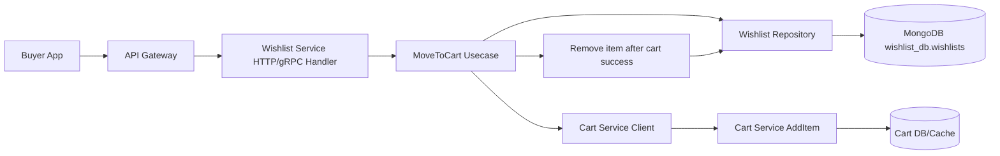
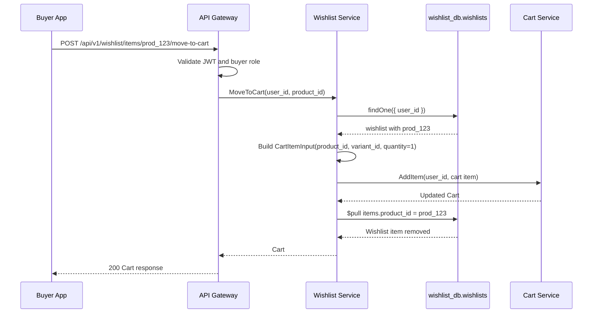
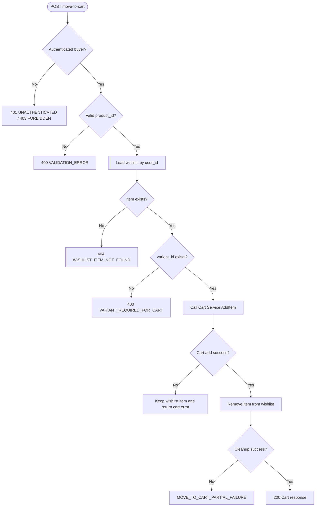

# 💖 Wishlist Service - Task 5: Move To Cart


---

## 📌 Task Summary

| Field | Detail |
|---|---|
| Service | Wishlist Service |
| Task | Task 5 - Move to cart |
| Source | `docs/01-micro-tasks.md` -> `Wishlist Service` -> Task 5 |
| Requirement | Wishlist item ko Cart Service me add karne ka flow banao. UX friction kam hoga. |
| Dependency | Cart Service |
| Priority | P1 |
| Final Decision | **Wishlist item pehle Cart Service me add hoga, successful cart add ke baad wishlist se remove hoga** |
| Output | Structured Hinglish implementation guide for Wishlist Task 5 |

> **Simple Hinglish goal:** Buyer wishlist page se product ko direct cart me move kar sake. User ko pehle item remove karna aur phir separately cart me add karna na pade. Flow ka main rule hai: **cart add successful hua tabhi wishlist item remove hoga**.

---

## ✅ Final Output Created

```text
TaskImplementation/
└── Wishlist Service/
    ├── task1.md
    ├── task2.md
    ├── task3.md
    ├── task4.md
    └── task5.md
```

### Why this structure?

| Folder/File | Purpose |
|---|---|
| `TaskImplementation/` | Saare task-wise implementation guides ka central folder |
| `Wishlist Service/` | Wishlist service ke task guides ko group karta hai |
| `task1.md` | Wishlist model decision guide |
| `task2.md` | Wishlist MongoDB choice guide |
| `task3.md` | `wishlists` collection design guide |
| `task4.md` | Add/remove item APIs guide |
| `task5.md` | Sirf **Wishlist Service - Task 5** ka move-to-cart guide |

> 🟢 **Note:** Is document me Task 5 ka implementation guide diya gaya hai. Task 6 availability sync, Task 7 price drop events, aur Task 8 analytics events yahan implement nahi kiye gaye.

---

## 🧭 Documents Studied

| Document/File | Kya use kiya gaya |
|---|---|
| `docs/01-micro-tasks.md` | Task 5 ka exact scope: wishlist item ko Cart Service me add karna |
| `docs/04-microservice-design.md` | Wishlist `MoveToCart` API and Cart Service responsibilities |
| `docs/02-system-architecture.md` | Direct cross-service DB access allowed nahi; service-to-service call use hoga |
| `docs/03-folder-structure.md` | Wishlist and Cart service clean architecture folder references |
| `docs/13-developer-guide.md` | Backend layer rules, REST envelope, tests, observability |
| `database/mongodb-schema-design.md` | Wishlist item shape and Cart item shape |
| `api/master-api.json` | `wishlist.move_to_cart`, `WishlistService.MoveToCart`, `CartService.AddItem`, `CartItemInput`, `Cart` schema |
| `TaskImplementation/Wishlist Service/task1.md` | Single private wishlist per buyer |
| `TaskImplementation/Wishlist Service/task2.md` | Wishlist uses MongoDB and owns `wishlist_db` |
| `TaskImplementation/Wishlist Service/task3.md` | `wishlists` collection with embedded `items` |
| `TaskImplementation/Wishlist Service/task4.md` | Add/remove API base, auth rule, duplicate rule |
| `backend/services/wishlist-service/internal/usecase/wishlist_service.go` | Current add/remove usecase base |
| `backend/services/wishlist-service/internal/transport/http/wishlist_handler.go` | Current HTTP routes and error envelope |

---

## 🧱 Task Boundary

### ✅ Included in Task 5

| Included | Explanation |
|---|---|
| Move-to-cart REST endpoint | `POST /api/v1/wishlist/items/{product_id}/move-to-cart` |
| Move-to-cart service method | `WishlistService.MoveToCart` |
| Wishlist item lookup | Authenticated buyer ki wishlist me product exist hai ya nahi check hoga |
| Cart Service call | Wishlist item se `CartItemInput` banake Cart Service `AddItem` call hoga |
| Quantity rule | Move ke time default `quantity = 1` rahegi |
| Variant rule | Cart schema me `variant_id` required hai, isliye wishlist item me variant missing ho to clean validation error |
| Cart-first safety | Cart add fail hua to wishlist item remove nahi hoga |
| Wishlist cleanup | Cart add success ke baad item wishlist se remove hoga |
| Error mapping | Cart/wishlist failures ko REST-friendly error codes me map kiya jayega |
| Code examples | Usecase, cart client, handler, config, and tests ke examples |
| Diagrams | Architecture, sequence, and decision flow Mermaid diagrams |

### ❌ Not Included in Task 5

| Not Included | Future Task |
|---|---|
| Product deleted/out-of-stock event consumer | Wishlist Service Task 6 |
| Price drop notification trigger | Wishlist Service Task 7 |
| Wishlist analytics event publish | Wishlist Service Task 8 |
| Recommendation Service events | Wishlist Service Task 8 |
| Frontend wishlist page implementation | User App Frontend task |
| Cart Service internal implementation | Cart Service tasks |
| Order checkout, inventory reserve, payment | Order/Payment tasks |

> 🔴 **Important boundary:** Wishlist Service Cart Service ke database ko direct read/write nahi karega. Cart me item add karne ke liye service call use hoga.

---

## 🧩 Final API Decision

### REST Contract

| Action | Method | Path | Auth | Response |
|---|---|---|---|---|
| Move wishlist item to cart | `POST` | `/api/v1/wishlist/items/{product_id}/move-to-cart` | buyer | `Cart` |

### gRPC Contract

| Method | Input | Output | Auth |
|---|---|---|---|
| `WishlistService.MoveToCart` | `IdPathRequest` | `Cart` | buyer |

### Cart Service Contract Used

| Cart Method | Input | Output |
|---|---|---|
| `CartService.AddItem` | `CartItemInput` | `Cart` |

`api/master-api.json` ke according:

```json
{
  "CartItemInput": {
    "type": "object",
    "required": ["product_id", "variant_id", "quantity"],
    "properties": {
      "product_id": { "type": "string" },
      "variant_id": { "type": "string" },
      "quantity": { "type": "integer", "minimum": 1 }
    }
  }
}
```

### Move Request Example

```http
POST /api/v1/wishlist/items/prod_123/move-to-cart
X-User-ID: user_123
X-User-Roles: buyer
X-Request-ID: req_123
```

### Success Response Example

```json
{
  "data": {
    "cart_id": "cart_123",
    "user_id": "user_123",
    "items": [
      {
        "item_id": "item_1",
        "product_id": "prod_123",
        "variant_id": "var_1",
        "quantity": 1
      }
    ],
    "subtotal": {
      "amount": 299900,
      "currency": "INR"
    },
    "discount": {
      "amount": 0,
      "currency": "INR"
    },
    "total": {
      "amount": 299900,
      "currency": "INR"
    }
  },
  "request_id": "req_123",
  "error": null
}
```

---

## 🏗️ Architecture



### Hinglish Explanation

- Buyer button click karta hai: **Move to cart**.
- API Gateway auth validate karke `user_id` Wishlist Service tak bhejta hai.
- Wishlist Service apni MongoDB me user's wishlist item find karta hai.
- Same product aur variant ko Cart Service me `quantity = 1` ke saath add karta hai.
- Cart Service success deta hai to Wishlist Service item ko wishlist se remove karta hai.
- Final response me updated `Cart` return hota hai.

---

## 🔁 Success Flow



---

## 🧠 Main Design Decision

### Why cart add first?

Move operation do services touch karta hai:

```text
Wishlist Service -> owns wishlist item
Cart Service -> owns cart item
```

Agar pehle wishlist se item remove kar diya aur Cart Service fail ho gaya, to buyer ka saved product lost feel hoga. Isliye safe order ye hai:

```text
1. Cart Service me item add karo
2. Add success ke baad wishlist se item remove karo
3. Updated Cart response return karo
```

### Failure behavior

| Failure Point | Result |
|---|---|
| Wishlist item not found | Cart call nahi hoga, `404 WISHLIST_ITEM_NOT_FOUND` |
| Wishlist item has no `variant_id` | Cart call nahi hoga, `400 VARIANT_REQUIRED_FOR_CART` |
| Cart Service unavailable | Wishlist item same rahega, `503 CART_SERVICE_UNAVAILABLE` |
| Cart Service product/stock reject kare | Wishlist item same rahega, mapped cart error |
| Cart add success but wishlist remove fails | Partial failure log hoga; idempotency key se retry safe rakhna chahiye |

> 🟡 **Distributed transaction note:** Wishlist DB aur Cart Service ke beech single ACID transaction nahi hoga. Isliye implementation idempotency, logging, and safe operation ordering par depend karegi.

---

## 🪜 Step-by-Step Implementation

## Step 1: Existing Base Samjha

Task 4 tak Wishlist Service me ye base ready hai:

```text
POST   /api/v1/wishlist/items              -> Add item
DELETE /api/v1/wishlist/items/{product_id} -> Remove item
```

Existing usecase concepts:

```go
type WishlistRepository interface {
    EnsureWishlist(ctx context.Context, userID string, now time.Time) error
    AddItemIfNotExists(ctx context.Context, userID string, item domain.WishlistItem, now time.Time) error
    RemoveItem(ctx context.Context, userID, productID string, now time.Time) error
    FindByUserID(ctx context.Context, userID string) (*domain.Wishlist, error)
}
```

Task 5 me same repository ka `FindByUserID` and `RemoveItem` use hoga. New Mongo collection ya new index ki need nahi hai.

### Why no DB schema change?

Wishlist item already enough data store karta hai:

```json
{
  "product_id": "prod_123",
  "variant_id": "var_1",
  "added_at": "2026-05-18T00:00:00Z",
  "last_known_price": {
    "amount": 299900,
    "currency": "INR"
  },
  "availability": "in_stock"
}
```

Cart add ke liye required fields:

```json
{
  "product_id": "prod_123",
  "variant_id": "var_1",
  "quantity": 1
}
```

`product_id` and `variant_id` wishlist item se mil jate hain. `quantity` move flow me fixed `1` set hoti hai.

---

## Step 2: Move Input Define Kiya

Move-to-cart endpoint URL path se `product_id` lega, aur auth context/header se `user_id`.

```go
type MoveToCartInput struct {
    UserID         string
    ProductID      string
    RequestID      string
    IdempotencyKey string
}
```

### Field explanation

| Field | Source | Why needed |
|---|---|---|
| `UserID` | Auth context / `X-User-ID` | Correct buyer ki wishlist aur cart update karne ke liye |
| `ProductID` | URL path | Kaunsa wishlist item move karna hai |
| `RequestID` | Gateway/header/generated | Logs and debugging ke liye |
| `IdempotencyKey` | Header or generated from request | Retry me duplicate cart add avoid karne ke liye |

### Validation rules

| Rule | Error |
|---|---|
| Missing `user_id` | `UNAUTHENTICATED` |
| Missing buyer role | `FORBIDDEN` |
| Empty/invalid `product_id` | `VALIDATION_ERROR` |
| Wishlist item absent | `WISHLIST_ITEM_NOT_FOUND` |
| Wishlist item has empty `variant_id` | `VARIANT_REQUIRED_FOR_CART` |

---

## Step 3: Cart Client Interface Banaya

Usecase direct HTTP/gRPC details nahi jaane. Isliye Cart Service ke liye interface banega.

```go
type CartClient interface {
    AddItem(ctx context.Context, input CartAddItemInput) (*Cart, error)
}

type CartAddItemInput struct {
    UserID         string
    ProductID      string
    VariantID      string
    Quantity       int
    RequestID      string
    IdempotencyKey string
}
```

### Why interface?

| Benefit | Explanation |
|---|---|
| Test easy | Unit test me fake cart client use ho sakta hai |
| Transport flexible | Aaj HTTP, future me gRPC client switch easy |
| Clean architecture | Usecase business logic me network implementation mix nahi hoti |

### Cart response model

```go
type Cart struct {
    CartID   string
    UserID   string
    Items    []CartItem
    Subtotal *Money
    Discount *Money
    Total    *Money
}

type CartItem struct {
    ItemID    string
    ProductID string
    VariantID string
    Quantity  int
}

type Money struct {
    Amount   int64
    Currency string
}
```

> 🟢 **Ownership rule:** Cart Service cart totals calculate karega. Wishlist Service cart total khud calculate nahi karega.

---

## Step 4: MoveToCart Usecase Implement Kiya

Core business flow:

```text
Validate auth/input
-> Load wishlist by user_id
-> Find product in wishlist items
-> Build cart item input
-> Call Cart Service AddItem
-> Remove item from wishlist
-> Return Cart response
```

### Go example

```go
func (s *WishlistService) MoveToCart(ctx context.Context, input MoveToCartInput) (*Cart, error) {
    if s == nil || s.repository == nil || s.cartClient == nil {
        return nil, errors.New("wishlist service is not initialized")
    }

    ctx = contextOrBackground(ctx)
    userID := normalizeID(input.UserID)
    productID := normalizeID(input.ProductID)

    if userID == "" {
        return nil, ErrUnauthenticated
    }
    if productID == "" {
        return nil, ValidationError{Field: "product_id", Message: "is required"}
    }

    wishlist, err := s.repository.FindByUserID(ctx, userID)
    if err != nil {
        return nil, err
    }

    item, found := wishlist.FindItem(productID)
    if !found {
        return nil, fmt.Errorf("%w: %s", domain.ErrWishlistItemNotFound, productID)
    }
    if normalizeID(item.VariantID) == "" {
        return nil, ValidationError{
            Field:   "variant_id",
            Message: "is required to move wishlist item to cart",
        }
    }

    cart, err := s.cartClient.AddItem(ctx, CartAddItemInput{
        UserID:         userID,
        ProductID:      item.ProductID,
        VariantID:      item.VariantID,
        Quantity:       1,
        RequestID:      input.RequestID,
        IdempotencyKey: moveToCartIdempotencyKey(input, item),
    })
    if err != nil {
        return nil, err
    }

    now := s.clock().UTC()
    if err := s.repository.RemoveItem(ctx, userID, productID, now); err != nil {
        return nil, fmt.Errorf("%w: cart add succeeded but wishlist cleanup failed: %v", ErrMoveToCartPartialFailure, err)
    }

    s.logger.Info("wishlist item moved to cart",
        "user_id", userID,
        "product_id", productID,
        "request_id", input.RequestID,
    )
    return cart, nil
}
```

### Idempotency key helper

```go
func moveToCartIdempotencyKey(input MoveToCartInput, item domain.WishlistItem) string {
    if key := normalizeID(input.IdempotencyKey); key != "" {
        return key
    }
    return "wishlist-move:" + normalizeID(input.UserID) + ":" + normalizeID(item.ProductID) + ":" + normalizeID(item.VariantID)
}
```

### Why idempotency important?

Buyer ke browser me network timeout ho sakta hai. Same request retry ho sakti hai. Agar Cart Service idempotency key support karta hai, duplicate cart quantity accidentally increase nahi hogi.

---

## Step 5: Cart HTTP Client Banaya

Current Wishlist Service already HTTP handler style use karta hai. Isliye simple implementation me Cart Service client `net/http` se ban sakta hai.

```go
type HTTPCartClient struct {
    baseURL    string
    httpClient *http.Client
    timeout    time.Duration
}

func (c *HTTPCartClient) AddItem(ctx context.Context, input CartAddItemInput) (*Cart, error) {
    payload := map[string]any{
        "product_id": input.ProductID,
        "variant_id": input.VariantID,
        "quantity":   input.Quantity,
    }

    body, err := json.Marshal(payload)
    if err != nil {
        return nil, err
    }

    ctx, cancel := context.WithTimeout(ctx, c.timeout)
    defer cancel()

    req, err := http.NewRequestWithContext(
        ctx,
        http.MethodPost,
        c.baseURL+"/api/v1/cart/items",
        bytes.NewReader(body),
    )
    if err != nil {
        return nil, fmt.Errorf("%w: build cart request: %v", ErrCartServiceUnavailable, err)
    }

    req.Header.Set("Content-Type", "application/json")
    req.Header.Set("Accept", "application/json")
    req.Header.Set("X-User-ID", input.UserID)
    req.Header.Set("X-User-Roles", "buyer")
    req.Header.Set("X-Request-ID", input.RequestID)
    req.Header.Set("X-Idempotency-Key", input.IdempotencyKey)

    resp, err := c.httpClient.Do(req)
    if err != nil {
        return nil, fmt.Errorf("%w: %v", ErrCartServiceUnavailable, err)
    }
    defer resp.Body.Close()

    if resp.StatusCode < 200 || resp.StatusCode >= 300 {
        return nil, mapCartHTTPStatus(resp.StatusCode)
    }

    return decodeCartResponse(resp.Body)
}
```

### HTTP status mapping

| Cart response | Wishlist error code | Meaning |
|---|---|---|
| `400` | `CART_VALIDATION_ERROR` | Cart input reject hua |
| `401` | `CART_UNAUTHENTICATED` | Cart Service auth metadata missing/invalid |
| `403` | `CART_FORBIDDEN` | Buyer role missing |
| `404` | `CART_PRODUCT_NOT_FOUND` | Product/variant missing |
| `409` | `CART_ITEM_UNAVAILABLE` | Stock/product unavailable |
| `5xx` | `CART_SERVICE_UNAVAILABLE` | Cart Service temporarily unavailable |

> 🔵 **Future note:** Project architecture internal services ke liye gRPC prefer karta hai. Jab proto generation ready ho, same `CartClient` interface ke peeche HTTP client ko gRPC client se replace kiya ja sakta hai.

---

## Step 6: Config Me Cart Service Add Kiya

Wishlist Service ko Cart Service ka address and timeout config se milna chahiye.

```go
type Config struct {
    ServiceName    string
    Mongo          MongoConfig
    ProductService ProductServiceConfig
    CartService    CartServiceConfig
    Auth           AuthConfig
}

type CartServiceConfig struct {
    BaseURL string
    Timeout time.Duration
}
```

### Environment variables

```env
WISHLIST_CART_SERVICE_BASE_URL=http://localhost:8083
WISHLIST_CART_SERVICE_TIMEOUT=1s
```

### Kubernetes/service-discovery style example

```env
WISHLIST_CART_SERVICE_BASE_URL=http://cart-service:8080
WISHLIST_CART_SERVICE_TIMEOUT=1s
```

### Why config?

| Reason | Explanation |
|---|---|
| Local/dev flexible | Local port alag ho sakta hai |
| Kubernetes friendly | Service DNS name use ho sakta hai |
| Fail-fast startup | Invalid URL startup pe pakad me aa jata hai |
| Timeout control | Slow Cart Service Wishlist request ko indefinitely block nahi karega |

---

## Step 7: Server Wiring Kiya

`cmd/server/main.go` me Cart client create karke Wishlist usecase ko inject karna hoga.

```go
cartClient, err := clients.NewHTTPCartClient(
    cfg.CartService.BaseURL,
    cfg.CartService.Timeout,
    logger,
)
if err != nil {
    return err
}

wishlistService, err := usecase.NewWishlistService(
    wishlistRepository,
    productValidator,
    cartClient,
    logger,
)
if err != nil {
    return err
}
```

### Constructor update idea

```go
func NewWishlistService(
    repository WishlistRepository,
    productValidator ProductValidator,
    cartClient CartClient,
    logger *slog.Logger,
    options ...WishlistServiceOption,
) (*WishlistService, error) {
    if repository == nil {
        return nil, errors.New("wishlist repository is required")
    }
    if productValidator == nil {
        return nil, errors.New("product validator is required")
    }
    if cartClient == nil {
        return nil, errors.New("cart client is required")
    }

    // existing initialization...
}
```

> 🟡 **Compatibility note:** Existing add/remove tests will need fake cart client injection after constructor signature update.

---

## Step 8: HTTP Handler Route Add Kiya

Existing path:

```text
/api/v1/wishlist/items/{product_id}
```

Task 5 path:

```text
/api/v1/wishlist/items/{product_id}/move-to-cart
```

### Handler interface update

```go
type WishlistUsecase interface {
    AddItem(ctx context.Context, input usecase.AddWishlistItemInput) (*domain.Wishlist, error)
    RemoveItem(ctx context.Context, input usecase.RemoveWishlistItemInput) (*domain.Wishlist, error)
    MoveToCart(ctx context.Context, input usecase.MoveToCartInput) (*usecase.Cart, error)
}
```

### Route parsing example

```go
func (h *WishlistHandler) handleItemByProduct(w http.ResponseWriter, r *http.Request) {
    requestID := h.requestID(r)

    if strings.HasSuffix(r.URL.Path, "/move-to-cart") {
        h.handleMoveToCart(w, r, requestID)
        return
    }

    if r.Method == http.MethodDelete {
        h.handleRemoveItem(w, r, requestID)
        return
    }

    h.writeError(w, r, requestID, http.StatusMethodNotAllowed, "METHOD_NOT_ALLOWED", "Method not allowed", nil)
}
```

### Move handler example

```go
func (h *WishlistHandler) handleMoveToCart(w http.ResponseWriter, r *http.Request, requestID string) {
    if r.Method != http.MethodPost {
        w.Header().Set("Allow", http.MethodPost)
        h.writeError(w, r, requestID, http.StatusMethodNotAllowed, "METHOD_NOT_ALLOWED", "Method not allowed", nil)
        return
    }

    productID, err := productIDFromMoveToCartPath(r.URL.Path)
    if err != nil {
        h.writeMappedError(w, r, requestID, err)
        return
    }

    userID, err := h.userIDFromRequest(r)
    if err != nil {
        h.writeMappedError(w, r, requestID, err)
        return
    }

    cart, err := h.usecase.MoveToCart(r.Context(), usecase.MoveToCartInput{
        UserID:         userID,
        ProductID:      productID,
        RequestID:      requestID,
        IdempotencyKey: strings.TrimSpace(r.Header.Get("X-Idempotency-Key")),
    })
    if err != nil {
        h.writeMappedError(w, r, requestID, err)
        return
    }

    h.writeResponse(w, http.StatusOK, requestID, mapCart(cart))
}
```

### Path helper example

```go
func productIDFromMoveToCartPath(path string) (string, error) {
    raw := strings.TrimPrefix(path, wishlistItemsPathPrefix)
    raw = strings.TrimSuffix(raw, "/move-to-cart")
    raw = strings.Trim(raw, "/")

    if raw == "" || strings.Contains(raw, "/") {
        return "", usecase.ValidationError{Field: "product_id", Message: "is invalid"}
    }

    productID, err := url.PathUnescape(raw)
    if err != nil {
        return "", usecase.ValidationError{Field: "product_id", Message: "is invalid"}
    }
    return productID, nil
}
```

---

## Step 9: Error Types Add Kiye

Task 5 ke liye kuch new errors useful rahenge.

```go
var (
    ErrCartServiceUnavailable = errors.New("cart service unavailable")
    ErrCartValidation         = errors.New("cart validation failed")
    ErrCartItemUnavailable    = errors.New("cart item unavailable")
    ErrMoveToCartPartialFailure = errors.New("move to cart partially failed")
)
```

### REST error mapping

| Error | HTTP | Code | Message |
|---|---:|---|---|
| `ErrUnauthenticated` | `401` | `UNAUTHENTICATED` | Authentication is required |
| `ErrPermissionDenied` | `403` | `FORBIDDEN` | Buyer role is required |
| `ValidationError(product_id)` | `400` | `VALIDATION_ERROR` | Invalid product id |
| `ValidationError(variant_id)` | `400` | `VARIANT_REQUIRED_FOR_CART` | Select a variant before moving to cart |
| `domain.ErrWishlistItemNotFound` | `404` | `WISHLIST_ITEM_NOT_FOUND` | Product is not in wishlist |
| `ErrCartItemUnavailable` | `409` | `CART_ITEM_UNAVAILABLE` | Product cannot be added to cart |
| `ErrCartServiceUnavailable` | `503` | `CART_SERVICE_UNAVAILABLE` | Cart service is unavailable |
| `ErrMoveToCartPartialFailure` | `500` | `MOVE_TO_CART_PARTIAL_FAILURE` | Cart updated but wishlist cleanup failed |

### Why separate cart errors?

Cart Service apni domain ka owner hai. Wishlist Service ko bas user-friendly mapping deni hai. Isse frontend ko clear pata chalega ki issue wishlist item missing hai, variant missing hai, ya Cart Service temporary unavailable hai.

---

## Step 10: Wishlist Cleanup Atomic Rakha

Cart add success ke baad cleanup existing repository method se ho sakta hai:

```go
err := s.repository.RemoveItem(ctx, userID, productID, now)
```

MongoDB operation internally:

```javascript
db.wishlists.updateOne(
  {
    user_id: "user_123",
    "items.product_id": "prod_123"
  },
  {
    $pull: {
      items: {
        product_id: "prod_123"
      }
    },
    $set: {
      updated_at: ISODate("2026-05-25T12:00:00Z")
    }
  }
)
```

### Why `$pull`?

| Reason | Explanation |
|---|---|
| Atomic update | Same document me item remove and timestamp update ek write me hota hai |
| Existing pattern | Task 4 remove flow already same idea use karta hai |
| Safe cleanup | Sirf authenticated user's wishlist update hoti hai |

---

## Step 11: Response Mapping Kiya

Wishlist move endpoint ka response `Cart` hai, `Wishlist` nahi.

```go
func mapCart(cart *usecase.Cart) cartResponse {
    if cart == nil {
        return cartResponse{Items: []cartItemResponse{}}
    }
    return cartResponse{
        CartID:   cart.CartID,
        UserID:   cart.UserID,
        Items:    mapCartItems(cart.Items),
        Subtotal: mapUsecaseMoney(cart.Subtotal),
        Discount: mapUsecaseMoney(cart.Discount),
        Total:    mapUsecaseMoney(cart.Total),
    }
}
```

### Why return Cart?

`api/master-api.json` me endpoint response schema:

```json
{
  "id": "wishlist.move_to_cart",
  "response_schema": "Cart"
}
```

Frontend ko cart badge, totals, and cart drawer instantly update karna hota hai. Isliye updated Cart response best UX hai.

---

## Step 12: Tests Add Kiye

### Usecase tests

| Test | Expected |
|---|---|
| Move existing item | Cart client called with product, variant, quantity `1`; wishlist item removed |
| Missing auth user | `ErrUnauthenticated` |
| Product absent from wishlist | `ErrWishlistItemNotFound`; cart client not called |
| Missing variant id | validation error; cart client not called |
| Cart client fails | wishlist item still present |
| Cart succeeds but remove fails | partial failure error logged/returned |

Example:

```go
func TestWishlistServiceMoveToCartAddsCartThenRemovesWishlistItem(t *testing.T) {
    now := time.Date(2026, 5, 25, 12, 0, 0, 0, time.UTC)
    repository := newFakeWishlistRepository(t)
    cartClient := &fakeCartClient{
        cart: &Cart{CartID: "cart_123", UserID: "user_123"},
    }
    service := mustWishlistServiceWithCart(t, repository, &fakeProductValidator{}, cartClient, now)

    item, _ := domain.NewWishlistItem(domain.AddWishlistItemInput{
        ProductID:    "prod_123",
        VariantID:    "var_1",
        Availability: domain.AvailabilityInStock,
    }, now)
    _ = repository.EnsureWishlist(context.Background(), "user_123", now)
    _ = repository.AddItemIfNotExists(context.Background(), "user_123", item, now)

    cart, err := service.MoveToCart(context.Background(), MoveToCartInput{
        UserID:    "user_123",
        ProductID: "prod_123",
        RequestID: "req_test",
    })
    if err != nil {
        t.Fatalf("MoveToCart returned error: %v", err)
    }
    if cart.CartID != "cart_123" {
        t.Fatalf("cart id = %q, want cart_123", cart.CartID)
    }
    if cartClient.input.Quantity != 1 {
        t.Fatalf("quantity = %d, want 1", cartClient.input.Quantity)
    }

    wishlist, _ := repository.FindByUserID(context.Background(), "user_123")
    if wishlist.HasProduct("prod_123") {
        t.Fatal("prod_123 still exists in wishlist after move")
    }
}
```

### HTTP handler tests

| Test | Expected |
|---|---|
| `POST /move-to-cart` with buyer headers | `200` and Cart envelope |
| Missing buyer role | `403 FORBIDDEN` |
| Wrong method | `405 METHOD_NOT_ALLOWED` |
| Encoded product id | URL unescape works |
| Move usecase error | Mapped error response |

### Cart client tests

Use Go `httptest.Server`:

```go
server := httptest.NewServer(http.HandlerFunc(func(w http.ResponseWriter, r *http.Request) {
    if r.Method != http.MethodPost {
        t.Fatalf("method = %s, want POST", r.Method)
    }
    if r.URL.Path != "/api/v1/cart/items" {
        t.Fatalf("path = %s, want /api/v1/cart/items", r.URL.Path)
    }
    if r.Header.Get("X-User-ID") != "user_123" {
        t.Fatalf("missing user header")
    }

    _ = json.NewEncoder(w).Encode(apiEnvelope{
        Data: map[string]any{
            "cart_id": "cart_123",
            "user_id": "user_123",
            "items": []map[string]any{
                {
                    "item_id": "item_1",
                    "product_id": "prod_123",
                    "variant_id": "var_1",
                    "quantity": 1,
                },
            },
        },
        RequestID: "req_test",
        Error: nil,
    })
}))
defer server.Close()
```

---

## 🧰 External Libraries / Tools Used

### 1. Go Standard Library

| Detail | Value |
|---|---|
| What | `net/http`, `encoding/json`, `context`, `time`, `errors`, `log/slog` |
| Why used | Cart Service HTTP call, JSON encoding/decoding, timeouts, logging |
| Install | No install needed, Go ke saath built-in |
| Use | `go test ./...` se compile/test verify hota hai |

### 2. MongoDB Go Driver

| Detail | Value |
|---|---|
| Package | `go.mongodb.org/mongo-driver/v2` |
| Why used | Existing Wishlist repository MongoDB `wishlists` collection update/read karta hai |
| Task 5 usage | Existing `FindByUserID` and `RemoveItem` methods use honge |
| Install | Already present in `backend/services/wishlist-service/go.mod` |

Install command fresh setup ke liye:

```bash
cd backend/services/wishlist-service
go get go.mongodb.org/mongo-driver/v2
```

### 3. Go Test Tool

| Detail | Value |
|---|---|
| What | Built-in Go test runner |
| Why used | Usecase, handler, and cart client tests verify karne ke liye |
| Install | Go ke saath built-in |
| Use |

```bash
cd backend/services/wishlist-service
go test ./...
```

### 4. Optional gRPC / Protobuf Tooling

Project architecture internal service calls ke liye gRPC recommend karta hai. Current Wishlist code HTTP transport use kar raha hai, but future gRPC implementation ke liye:

| Tool | Why |
|---|---|
| `google.golang.org/grpc` | Typed internal service client/server |
| `google.golang.org/protobuf` | Generated proto messages |
| `buf` | Proto generation workflow |

Install example:

```bash
cd backend/services/wishlist-service
go get google.golang.org/grpc google.golang.org/protobuf
```

Generate example:

```bash
buf generate
```

> 🔵 **Task 5 recommendation:** Interface `CartClient` keep karo. HTTP client se start karo; gRPC client later same interface ke peeche add ho sakta hai.

---

## 📁 Clean Implementation Folder Structure

Task 5 ke code changes ka expected layout:

```text
backend/
└── services/
    └── wishlist-service/
        ├── cmd/
        │   └── server/
        │       └── main.go
        └── internal/
            ├── clients/
            │   ├── product_http_validator.go
            │   ├── product_http_validator_test.go
            │   ├── cart_http_client.go
            │   └── cart_http_client_test.go
            ├── config/
            │   ├── config.go
            │   └── config_test.go
            ├── domain/
            │   ├── wishlist.go
            │   └── errors.go
            ├── repository/
            │   └── mongo_wishlist_repository.go
            ├── transport/
            │   └── http/
            │       ├── wishlist_handler.go
            │       └── wishlist_handler_test.go
            └── usecase/
                ├── wishlist_service.go
                └── wishlist_service_test.go
```

### File responsibility

| File | Task 5 responsibility |
|---|---|
| `internal/usecase/wishlist_service.go` | `MoveToCart` orchestration |
| `internal/clients/cart_http_client.go` | Cart Service `AddItem` HTTP client |
| `internal/config/config.go` | Cart Service base URL and timeout |
| `internal/transport/http/wishlist_handler.go` | `POST /move-to-cart` route |
| `cmd/server/main.go` | Cart client wiring |
| `*_test.go` files | Unit and handler tests |

---

## 🔎 Decision Flow Diagram



---

## 🧪 Manual Verification

### 1. Add item to wishlist first

```bash
curl -X POST http://localhost:8084/api/v1/wishlist/items \
  -H "Content-Type: application/json" \
  -H "X-User-ID: user_123" \
  -H "X-User-Roles: buyer" \
  -H "X-Request-ID: req_add_123" \
  -d '{"product_id":"prod_123","variant_id":"var_1"}'
```

### 2. Move item to cart

```bash
curl -X POST http://localhost:8084/api/v1/wishlist/items/prod_123/move-to-cart \
  -H "X-User-ID: user_123" \
  -H "X-User-Roles: buyer" \
  -H "X-Request-ID: req_move_123" \
  -H "X-Idempotency-Key: wishlist-move-user_123-prod_123-var_1"
```

### 3. Expected result

```text
HTTP 200
data.cart_id exists
data.items contains product_id=prod_123 variant_id=var_1
error is null
```

### 4. Verify wishlist cleanup in MongoDB

```javascript
use wishlist_db

db.wishlists.findOne(
  { user_id: "user_123" },
  { items: 1, updated_at: 1 }
)
```

Expected:

```json
{
  "items": []
}
```

---

## 📊 Observability

### Logs

Move success log:

```json
{
  "level": "INFO",
  "msg": "wishlist item moved to cart",
  "user_id": "user_123",
  "product_id": "prod_123",
  "request_id": "req_123"
}
```

Cart failure log:

```json
{
  "level": "WARN",
  "msg": "wishlist move to cart failed",
  "user_id": "user_123",
  "product_id": "prod_123",
  "request_id": "req_123",
  "error": "cart service unavailable"
}
```

### Suggested metrics

| Metric | Type | Why |
|---|---|---|
| `wishlist_move_to_cart_total` | Counter | Total move attempts |
| `wishlist_move_to_cart_success_total` | Counter | Successful moves |
| `wishlist_move_to_cart_failure_total` | Counter | Failure rate |
| `wishlist_move_to_cart_duration_ms` | Histogram | Latency tracking |
| `wishlist_move_to_cart_partial_failure_total` | Counter | Cart add success but wishlist cleanup failed |

> 🟡 **Metrics implementation** observability foundation ke shared libs se align honi chahiye. Task 5 me metric names and points define kiye gaye hain.

---

## 🔐 Security Rules

| Rule | Explanation |
|---|---|
| Buyer auth required | Guest/user without buyer role move nahi kar sakta |
| `user_id` body se nahi aayega | Auth context/header se owner decide hoga |
| No cross-user wishlist access | Query hamesha `{ user_id: authenticatedUserID }` se hogi |
| No direct Cart DB write | Cart Service API/gRPC call hi use hoga |
| Request timeout required | Slow Cart Service se Wishlist Service stuck nahi hogi |
| Structured errors | Internal implementation details user ko expose nahi honge |

---

## 🚦 Edge Cases

| Case | Expected behavior |
|---|---|
| Product not in wishlist | `404 WISHLIST_ITEM_NOT_FOUND` |
| Wishlist empty | `404 WISHLIST_ITEM_NOT_FOUND` |
| Product already in cart | Cart Service duplicate/merge rule apply karega; if success, wishlist item remove hoga |
| Variant missing in wishlist | `400 VARIANT_REQUIRED_FOR_CART` |
| Cart Service down | `503 CART_SERVICE_UNAVAILABLE`, wishlist item remains |
| Product out of stock | Cart Service reject karega, wishlist item remains |
| Retry after timeout | Idempotency key duplicate add avoid karegi |
| Wishlist cleanup fails | Partial failure log/error; cart item already added |

---

## 🧾 Final Checklist

| Check | Status |
|---|---|
| `TaskImplementation/` folder exists | ✅ |
| `TaskImplementation/Wishlist Service/` folder kept | ✅ |
| `task5.md` created | ✅ |
| Task 5 requirement documented | ✅ |
| Step-by-step Hinglish guide added | ✅ |
| External tools/libraries explained | ✅ |
| Folder structure included | ✅ |
| Code examples included | ✅ |
| Mermaid diagrams included | ✅ |
| Task 6/7/8 not implemented | ✅ |

---

## 🏁 Final Summary

Wishlist Service Task 5 ka final implementation design:

```text
POST /api/v1/wishlist/items/{product_id}/move-to-cart
-> Authenticated buyer validate
-> Wishlist item find
-> CartItemInput build with quantity = 1
-> Cart Service AddItem call
-> Success ke baad wishlist item remove
-> Updated Cart response return
```

Is flow se buyer ka UX smoother hota hai: wishlist page se one-click cart movement possible ho jata hai, aur failure cases me saved wishlist item safe rehta hai.
