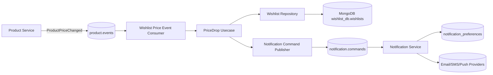
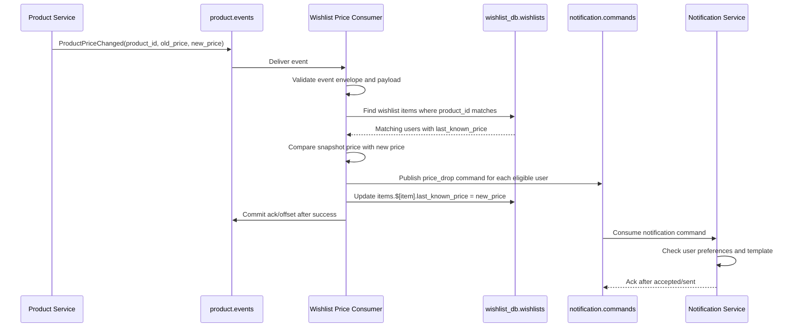
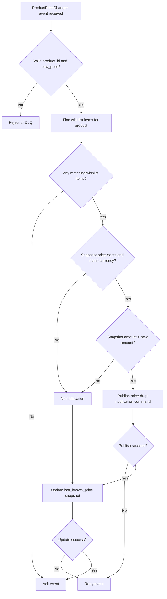

# 💖 Wishlist Service - Task 7: Price Drop Events


---

## 📌 Task Summary

| Field | Detail |
|---|---|
| Service | Wishlist Service |
| Task | Task 7 - Price drop events |
| Source | `docs/01-micro-tasks.md` -> `Wishlist Service` -> Task 7 |
| Requirement | Price change pe interested users ko notification trigger karo. |
| Dependency | Notification Service |
| Priority | P2 |
| Final Decision | **Product price-change event consume karke wishlist users ko price-drop notification command bhejna hai, phir `last_known_price` snapshot update karna hai** |
| Output | Structured Hinglish implementation guide for Wishlist Task 7 |

> **Simple Hinglish goal:** Agar kisi product ka price kam hota hai aur woh product kisi buyer ki wishlist me saved hai, to buyer ko price-drop notification milni chahiye. Wishlist Service price compare karega, Notification Service ko command bhejega, aur wishlist item ka `last_known_price` update karega.

---

## ✅ Final Output Created

```text
TaskImplementation/
└── Wishlist Service/
    ├── task1.md
    ├── task2.md
    ├── task3.md
    ├── task4.md
    ├── task5.md
    ├── task6.md
    └── task7.md
```

### Why this structure?

| Folder/File | Purpose |
|---|---|
| `TaskImplementation/` | Saare task-wise implementation guides ka central folder |
| `Wishlist Service/` | Wishlist service ke task guides ko group karta hai |
| `task1.md` | Wishlist model decision guide |
| `task2.md` | Wishlist MongoDB choice guide |
| `task3.md` | `wishlists` collection design guide |
| `task4.md` | Add/remove item APIs guide |
| `task5.md` | Move-to-cart guide |
| `task6.md` | Availability sync guide |
| `task7.md` | Sirf **Wishlist Service - Task 7** ka price-drop notification guide |

> 🟢 **Note:** Is document me Task 7 ka guide diya gaya hai. Task 8 analytics/recommendation events yahan implement nahi kiye gaye.

---

## 🧭 Documents Studied

| Document/File | Kya use kiya gaya |
|---|---|
| `docs/01-micro-tasks.md` | Task 7 ka exact scope: price change pe interested users ko notification trigger karna |
| `docs/04-microservice-design.md` | Wishlist responsibility: price drop track karna; Notification opt-in respect karna |
| `docs/02-system-architecture.md` | Async event-driven communication and no cross-service DB access rule |
| `docs/03-folder-structure.md` | Wishlist and Notification service clean architecture folder references |
| `docs/11-devops-external-services.md` | `product.events`, `notification.commands`, event envelope, retries, DLQ |
| `docs/12-logging-monitoring-scalability.md` | Notifications async hone chahiye; Notification Service down ho to retry |
| `database/mongodb-schema-design.md` | `wishlists.items.last_known_price` and Notification collections |
| `api/master-api.json` | `NotificationService.SendNotification`, `SendNotificationRequest`, `AcceptedResponse` |
| `TaskImplementation/Wishlist Service/task1.md` | `last_known_price` future price-drop notification ke liye useful snapshot hai |
| `TaskImplementation/Wishlist Service/task3.md` | `wishlists` collection and item schema |
| `TaskImplementation/Wishlist Service/task4.md` | Add item ke time initial `last_known_price` save hota hai |
| `TaskImplementation/Wishlist Service/task6.md` | Product events consume karne ka boundary and retry pattern |
| `backend/services/wishlist-service/internal/domain/wishlist.go` | Existing `Money`, `WishlistItem`, and `last_known_price` domain shape |
| `backend/services/wishlist-service/internal/repository/mongo_wishlist_repository.go` | Existing MongoDB repository and `items.product_id` index |

---

## 🧱 Task Boundary

### ✅ Included in Task 7

| Included | Explanation |
|---|---|
| Product price event consumer design | Wishlist Service `product.events` se price-change event consume karega |
| Price-drop detection | `new_price.amount < last_known_price.amount` and same currency hone par notification trigger hoga |
| Interested users lookup | Jinke wishlist me same `product_id` saved hai, wahi interested users hain |
| Notification command trigger | Wishlist Service `notification.commands` topic/queue me command publish karega ya internal Notification API call karega |
| Preference respect boundary | Notification Service user preferences (`marketing_enabled`, channels) enforce karega |
| Snapshot update | Price drop, price increase, ya same price event ke baad `last_known_price` latest value se update hoga |
| Idempotency strategy | Stable notification idempotency key use hoga taaki duplicate event se duplicate notification na jaye |
| Retry and DLQ guidance | Publish/update failures pe retry; poison messages DLQ me jayenge |
| Code examples | Event payload, usecase, repository, publisher, tests ke snippets |
| Diagrams | Architecture, sequence, and decision flow Mermaid diagrams |

### ❌ Not Included in Task 7

| Not Included | Future Task |
|---|---|
| Wishlist add/remove analytics events | Wishlist Service Task 8 |
| Recommendation Service event publishing | Wishlist Service Task 8 |
| Notification provider implementation | Notification Service tasks |
| Notification templates CRUD | Notification Service Task 3 |
| User notification preference UI | User App Frontend profile/preferences task |
| Product Service price update implementation | Product Service pricing task |
| Product DB direct read | Banned by microservice ownership rule |
| Public REST endpoint for price drop | Not required; this is async background processing |

> 🔴 **Important boundary:** Wishlist Service Product Service ke MongoDB ya Notification Service ke MongoDB ko direct read/write nahi karega. Product price data event se aayega, aur delivery preference Notification Service handle karega.

---

## 🧩 Final Design Decision

### Event-driven design

```text
Product Service price update
-> ProductPriceChanged event
-> Wishlist Service compares wishlist snapshots
-> Notification command for price-drop users
-> Wishlist last_known_price update
```

### Notification kab trigger hogi?

| Condition | Notification? | Snapshot update? |
|---|---:|---:|
| `old wishlist price > new product price` and same currency | ✅ Yes | ✅ Yes |
| New price same as wishlist snapshot | ❌ No | ✅ Yes, idempotent |
| Product price increased | ❌ No | ✅ Yes |
| Wishlist item price missing | ❌ No | ✅ Yes |
| Currency changed | ❌ No direct drop compare | ✅ Yes |
| Product deleted/unavailable | ❌ Task 6 handles availability | ❌ Not Task 7 focus |

### Why snapshot update after every valid price event?

Wishlist ka `last_known_price` source of truth nahi hai, but price-drop detection ke liye baseline hai.

```text
Wishlist old snapshot: INR 1200
Product new price: INR 1500 -> no notification, snapshot becomes 1500
Product later price: INR 999 -> notification, because 999 < 1500
```

Yahi behavior buyer ko real price drop alert deta hai.

---

## 🏗️ Architecture



### Hinglish Explanation

- Product Service price update hone par `ProductPriceChanged` event publish karta hai.
- Wishlist Service ka consumer event receive karta hai.
- Usecase wishlist DB me matching product ke interested users find karta hai.
- Har matching wishlist item me old snapshot price compare hota hai.
- Sirf price drop users ke liye notification command publish hoti hai.
- Notification Service preferences check karke actual email/SMS/push send karta hai.
- Wishlist Service `last_known_price` latest price se update karta hai.

---

## 🔁 Price Drop Flow



---

## 🪜 Step-by-Step Implementation

## Step 1: Existing `last_known_price` Ko Baseline Banaya

Task 1, Task 3, aur current domain me wishlist item ke andar price snapshot already planned hai:

```go
type Money struct {
    Amount   int64
    Currency string
}

type WishlistItem struct {
    ProductID      string
    VariantID      string
    AddedAt        time.Time
    LastKnownPrice *Money
    Availability   Availability
}
```

### Iska use kya hai?

| Field | Task 7 me use |
|---|---|
| `product_id` | Product price event se wishlist item match karne ke liye |
| `variant_id` | Variant-level price change ho to exact variant match karne ke liye |
| `last_known_price.amount` | Drop detect karne ke liye old baseline |
| `last_known_price.currency` | Same currency compare validate karne ke liye |
| `availability` | Deleted item ko price-drop notification nahi bhejna |

> 🟣 **Beginner note:** `last_known_price` final checkout price nahi hai. Ye sirf wishlist UI aur notification baseline ke liye cached value hai.

---

## Step 2: Product Price Event Contract Define Kiya

Product Service ko price update ke baad standard event envelope me event publish karna chahiye.

### Event envelope

```json
{
  "event_id": "evt_price_123",
  "event_type": "ProductPriceChanged",
  "version": 1,
  "occurred_at": "2026-05-26T10:30:00Z",
  "producer": "product-service",
  "trace_id": "trace_123",
  "payload": {}
}
```

### Payload

```json
{
  "product_id": "prod_123",
  "variant_id": "var_1",
  "old_price": {
    "amount": 349900,
    "currency": "INR"
  },
  "new_price": {
    "amount": 299900,
    "currency": "INR"
  },
  "title": "Running Shoes",
  "image_url": "https://cdn.example.com/prod_123/main.jpg",
  "product_url": "/products/prod_123"
}
```

### Required fields

| Field | Required | Why |
|---|---:|---|
| `payload.product_id` | ✅ | Wishlist item match karne ke liye |
| `payload.new_price.amount` | ✅ | Drop comparison ke liye |
| `payload.new_price.currency` | ✅ | Currency-safe comparison ke liye |
| `payload.variant_id` | ❌ | Variant-specific price update ke liye optional |
| `payload.old_price` | ❌ | Helpful for logs/debug, but Wishlist apne snapshot se compare karega |
| `title`, `image_url`, `product_url` | ❌ | Notification template variables ke liye helpful |

> 🟡 **Contract note:** Wishlist Service apne stored `last_known_price` se compare karega, Product event ke `old_price` par blindly depend nahi karega. Kyunki wishlist me user ne product kab add kiya tha, us time ka snapshot alag ho sakta hai.

---

## Step 3: Price-Drop Rule Implement Kiya

### Final comparison rule

```text
If:
  wishlist_item.last_known_price exists
  AND wishlist_item.last_known_price.currency == event.new_price.currency
  AND wishlist_item.last_known_price.amount > event.new_price.amount
Then:
  trigger price-drop notification
```

### Go helper example

```go
package usecase

import "ecommerce/backend/services/wishlist-service/internal/domain"

func isPriceDrop(previous *domain.Money, current domain.Money) bool {
    if previous == nil {
        return false
    }
    if previous.Currency != current.Currency {
        return false
    }
    return previous.Amount > current.Amount
}
```

### Why Product event `old_price` se compare nahi?

Example:

```text
User ne wishlist me item add kiya: INR 5000
Product price pehle hua: INR 4500
Wishlist consumer temporarily down tha
Product event me current old_price: INR 4500, new_price: INR 4000
Wishlist snapshot abhi bhi: INR 5000
Buyer ke liye actual drop: 5000 -> 4000
```

Isliye Wishlist ka local snapshot hi best baseline hai.

---

## Step 4: Interested Users Query Banayi

Interested users ka matlab:

```text
Users jinke wishlist items me same product_id saved hai
```

### MongoDB query idea

```javascript
db.wishlists.find(
  {
    items: {
      $elemMatch: {
        product_id: "prod_123",
        "last_known_price.currency": "INR",
        "last_known_price.amount": { $gt: NumberLong(299900) },
        availability: { $ne: "deleted" }
      }
    }
  },
  {
    user_id: 1,
    "items.$": 1
  }
)
```

### Hinglish explanation

- Query sirf woh wishlist documents dhundti hai jisme product saved hai.
- `last_known_price.amount > new_price.amount` condition se sirf drop candidates milte hain.
- `availability != deleted` se deleted product ke liye notification avoid hoti hai.
- Projection `items.$` matching array item return karta hai, full wishlist load nahi hoti.

### Variant rule

| Event type | Match rule |
|---|---|
| Product-level price event, no `variant_id` | Same `product_id` wale wishlist items match honge |
| Variant-level price event with `variant_id` | Same `product_id` + same `variant_id` match hoga |
| Wishlist item has no `variant_id` | Product-level event match karega; variant event skip karega |

---

## Step 5: Repository Methods Add Kiye

Task 7 ke liye repository me do main capabilities chahiye:

| Method | Purpose |
|---|---|
| `StreamPriceDropCandidates` | Matching wishlist users and old prices cursor/batches me process karna |
| `UpdateLastKnownPriceForProduct` | Product/variant ka latest price snapshot update karna |

### Domain DTO example

```go
package usecase

import (
    "time"

    "ecommerce/backend/services/wishlist-service/internal/domain"
)

type PriceChangeInput struct {
    EventID    string
    ProductID  string
    VariantID  string
    NewPrice   domain.Money
    Title      string
    ImageURL   string
    ProductURL string
    OccurredAt time.Time
    TraceID    string
}

type PriceDropCandidate struct {
    UserID        string
    ProductID     string
    VariantID     string
    PreviousPrice domain.Money
}

type PriceUpdateResult struct {
    MatchedCount  int64
    ModifiedCount int64
}
```

### Repository interface example

```go
type WishlistRepository interface {
    StreamPriceDropCandidates(
        ctx context.Context,
        productID string,
        variantID string,
        newPrice domain.Money,
        handle func(PriceDropCandidate) error,
    ) error

    UpdateLastKnownPriceForProduct(
        ctx context.Context,
        productID string,
        variantID string,
        newPrice domain.Money,
        now time.Time,
    ) (PriceUpdateResult, error)
}
```

### Mongo update example

```go
func (r *MongoWishlistRepository) UpdateLastKnownPriceForProduct(
    ctx context.Context,
    productID string,
    variantID string,
    newPrice domain.Money,
    now time.Time,
) (PriceUpdateResult, error) {
    itemFilter := bson.M{"item.product_id": productID}
    if variantID != "" {
        itemFilter["item.variant_id"] = variantID
    }

    update := bson.M{
        "$set": bson.M{
            "items.$[item].last_known_price": bson.M{
                "amount":   newPrice.Amount,
                "currency": newPrice.Currency,
            },
            "updated_at": now,
        },
    }

    result, err := r.collection.UpdateMany(
        ctx,
        bson.M{"items.product_id": productID},
        update,
        options.UpdateMany().SetArrayFilters([]any{itemFilter}),
    )
    if err != nil {
        return PriceUpdateResult{}, err
    }

    return PriceUpdateResult{
        MatchedCount:  result.MatchedCount,
        ModifiedCount: result.ModifiedCount,
    }, nil
}
```

> 🔵 **Why update all matching snapshots?** Agar price increase hua hai tab bhi snapshot update hona chahiye. Warna future me real drop compare galat baseline se hoga.

---

## Step 6: Notification Command Build Kiya

Wishlist Service actual email/SMS/push send nahi karega. Woh sirf Notification Service ko command dega.

### Notification command example

```json
{
  "event_id": "notif_price_drop_user_123_prod_123_299900",
  "event_type": "SendNotification",
  "version": 1,
  "occurred_at": "2026-05-26T10:30:01Z",
  "producer": "wishlist-service",
  "trace_id": "trace_123",
  "payload": {
    "user_id": "user_123",
    "channel": "auto",
    "template_key": "wishlist_price_drop",
    "idempotency_key": "wishlist_price_drop:user_123:prod_123:var_1:INR:299900",
    "variables": {
      "product_id": "prod_123",
      "variant_id": "var_1",
      "title": "Running Shoes",
      "old_price_amount": 349900,
      "new_price_amount": 299900,
      "currency": "INR",
      "savings_amount": 50000,
      "product_url": "/products/prod_123",
      "image_url": "https://cdn.example.com/prod_123/main.jpg"
    }
  }
}
```

### Why `channel = auto`?

Notification preferences Notification Service own karta hai. `auto` ka meaning:

```text
Notification Service user preference check kare:
email_enabled / sms_enabled / push_enabled / marketing_enabled
Then best allowed channel choose kare.
```

### Idempotency key

```text
wishlist_price_drop:{user_id}:{product_id}:{variant_id}:{currency}:{new_amount}
```

Isse same event retry hone par duplicate notification avoid hoti hai.

---

## Step 7: Usecase Flow Implement Kiya

### Usecase pseudocode

```go
func (s *PriceDropService) HandleProductPriceChanged(ctx context.Context, input PriceChangeInput) error {
    if err := validatePriceChange(input); err != nil {
        return err
    }

    err := s.repository.StreamPriceDropCandidates(
        ctx,
        input.ProductID,
        input.VariantID,
        input.NewPrice,
        func(candidate PriceDropCandidate) error {
            command := buildPriceDropNotification(input, candidate)
            if err := s.notificationPublisher.Publish(ctx, command); err != nil {
                return err
            }
            return nil
        },
    )
    if err != nil {
        return err
    }

    _, err = s.repository.UpdateLastKnownPriceForProduct(
        ctx,
        input.ProductID,
        input.VariantID,
        input.NewPrice,
        s.clock().UTC(),
    )
    return err
}
```

### Flow explanation

| Step | Kya hota hai | Failure behavior |
|---|---|---|
| Validate event | Required fields and money format check | Bad event -> DLQ or ignored based on error type |
| Stream candidates | Wishlist DB se price-drop users cursor/batches me process | DB error -> retry |
| Publish commands | Notification Service ke liye commands enqueue | Queue error -> retry, offset commit nahi |
| Update snapshot | Latest price wishlist item me save | DB error -> retry |
| Ack event | Sab successful hone ke baad event commit | Duplicate retry idempotent rahega |

> 🟡 **Reliability note:** Publish notification command before snapshot update. Agar update pehle kar diya aur publish fail ho gaya, to next retry price drop detect nahi karega. Publish-first + idempotency safer hai.

---

## Step 8: Product Event Consumer Add Kiya

Consumer ka kaam business logic nahi hota. Consumer sirf event decode/validate karke usecase call karega.

### Consumer example

```go
type ProductPriceEventConsumer struct {
    service *PriceDropService
    logger  *slog.Logger
}

func (c *ProductPriceEventConsumer) Handle(ctx context.Context, event EventEnvelope) error {
    if event.EventType != "ProductPriceChanged" {
        c.logger.Debug("product event ignored by wishlist price consumer",
            "event_type", event.EventType,
            "event_id", event.EventID,
        )
        return nil
    }

    payload, err := decodeProductPriceChanged(event.Payload)
    if err != nil {
        return fmt.Errorf("decode product price event: %w", err)
    }

    return c.service.HandleProductPriceChanged(ctx, PriceChangeInput{
        EventID:    event.EventID,
        ProductID:  payload.ProductID,
        VariantID:  payload.VariantID,
        NewPrice:   payload.NewPrice,
        Title:      payload.Title,
        ImageURL:   payload.ImageURL,
        ProductURL: payload.ProductURL,
        OccurredAt: event.OccurredAt,
        TraceID:    event.TraceID,
    })
}
```

### Consumer rules

| Rule | Why |
|---|---|
| Unsupported event ignore + ack | Same topic me multiple Product events aa sakte hain |
| Decode error classify karo | Permanent bad payload DLQ me ja sakta hai |
| DB/queue failure retry karo | Temporary issue recover ho sakta hai |
| Success ke baad commit | At-least-once delivery safe rahegi |

---

## Step 9: Notification Publisher Add Kiya

Publisher `notification.commands` me command publish karega.

### Interface

```go
type NotificationPublisher interface {
    Publish(ctx context.Context, command NotificationCommand) error
}

type NotificationCommand struct {
    EventID        string
    UserID         string
    TemplateKey    string
    Channel        string
    IdempotencyKey string
    Variables      map[string]any
    TraceID        string
}
```

### Build command helper

```go
func buildPriceDropNotification(input PriceChangeInput, candidate PriceDropCandidate) NotificationCommand {
    savings := candidate.PreviousPrice.Amount - input.NewPrice.Amount

    return NotificationCommand{
        EventID:        "notif_" + input.EventID + "_" + candidate.UserID,
        UserID:         candidate.UserID,
        TemplateKey:    "wishlist_price_drop",
        Channel:        "auto",
        IdempotencyKey: priceDropIdempotencyKey(candidate, input.NewPrice),
        TraceID:        input.TraceID,
        Variables: map[string]any{
            "product_id":       input.ProductID,
            "variant_id":       input.VariantID,
            "title":            input.Title,
            "old_price_amount": candidate.PreviousPrice.Amount,
            "new_price_amount": input.NewPrice.Amount,
            "currency":         input.NewPrice.Currency,
            "savings_amount":   savings,
            "product_url":      input.ProductURL,
            "image_url":        input.ImageURL,
        },
    }
}
```

---

## Step 10: Config Add Kiya

### Suggested environment variables

| Env var | Example | Purpose |
|---|---|---|
| `WISHLIST_PRODUCT_EVENTS_TOPIC` | `product.events` | Product price events consume karne ke liye |
| `WISHLIST_PRICE_EVENTS_GROUP_ID` | `wishlist-price-drop-service` | Consumer group name |
| `WISHLIST_NOTIFICATION_COMMANDS_TOPIC` | `notification.commands` | Notification command publish karne ke liye |
| `WISHLIST_PRICE_DROP_TEMPLATE_KEY` | `wishlist_price_drop` | Notification template key |
| `WISHLIST_PRICE_DROP_BATCH_SIZE` | `500` | Cursor/page me kitne candidates process honge |
| `WISHLIST_PRICE_DROP_MIN_DELTA_AMOUNT` | `1` | Minimum drop amount in minor unit |
| `WISHLIST_PRICE_EVENTS_DLQ_TOPIC` | `product.events.wishlist.price.dlq` | Failed poison messages |

### Why batch size?

Popular product thousands of wishlists me ho sakta hai. Cursor/batch processing se memory stable rehti hai.

```text
Find next 500 candidates -> publish notifications
Find next 500 candidates -> publish notifications
All candidate pages done -> update snapshot once
```

> 🔴 **Important:** Snapshot update saare eligible candidates publish hone ke baad hi karo. Agar first page ke baad snapshot update kar diya, to remaining users ka old price overwrite ho jayega aur unhe price-drop notification miss ho sakti hai.

---

## Step 11: Preference Respect Kiya

Notification preference data Notification Service own karta hai:

```json
{
  "email_enabled": true,
  "sms_enabled": false,
  "push_enabled": true,
  "marketing_enabled": true
}
```

### Responsibility split

| Service | Responsibility |
|---|---|
| Wishlist Service | Identify price-drop candidates and trigger notification command |
| Notification Service | Check preference, choose channel, apply template, send provider request |

### Why Wishlist Service preference DB read nahi karega?

Microservice golden rule ke according service apni database own karti hai. Wishlist Service Notification Service ke `notification_preferences` collection ko direct read nahi karega.

---

## Step 12: Idempotency And Retry Safe Banaya

Product events usually at-least-once deliver hote hain. Matlab same event duplicate aa sakta hai.

### Idempotency layers

| Layer | Idempotency rule |
|---|---|
| Notification command | Stable `idempotency_key` per user/product/new price |
| Snapshot update | `$set` same price repeat karne se final state same rahegi |
| Event consume | Event ack only after publish + update success |

### Failure handling

| Failure | Action |
|---|---|
| Product event decode invalid | DLQ with reason |
| No matching wishlist users | Success ack |
| Notification publish fails | Retry event; do not update snapshot |
| Snapshot update fails after publish | Retry event; duplicate notifications deduped by idempotency key |
| Notification Service down | `notification.commands` retry/DLQ handles later |

---

## Step 13: Observability Add Kiya

### Logs

```go
logger.Info("wishlist price drop processed",
    "event_id", input.EventID,
    "product_id", input.ProductID,
    "variant_id", input.VariantID,
    "currency", input.NewPrice.Currency,
    "new_amount", input.NewPrice.Amount,
    "candidate_count", len(candidates),
    "trace_id", input.TraceID,
)
```

### Metrics

| Metric | Type | Labels | Meaning |
|---|---|---|---|
| `wishlist_price_events_consumed_total` | Counter | `result` | Kitne price events consume hue |
| `wishlist_price_drop_candidates_total` | Counter | `product_id` optional/high-cardinality avoid | Price-drop eligible wishlist items |
| `wishlist_price_drop_notifications_published_total` | Counter | `result` | Notification commands publish count |
| `wishlist_price_snapshot_updates_total` | Counter | `result` | `last_known_price` updates |
| `wishlist_price_event_processing_seconds` | Histogram | `event_type` | Event processing latency |
| `wishlist_price_event_lag_seconds` | Gauge/Histogram | `topic` | Event occurred time se processing delay |

> 🟡 **Metric note:** `product_id` label high-cardinality ho sakta hai. Production metrics me product_id ko logs/traces me rakho, metric label me avoid karo.

---

## 🧪 Testing Strategy

### Unit test cases

| Test | Expected |
|---|---|
| Old price 349900, new price 299900 same currency | Notification command publish hota hai |
| Old price 299900, new price 349900 | No notification, snapshot update hota hai |
| Old price nil | No notification, snapshot update hota hai |
| Currency mismatch | No notification, snapshot update hota hai |
| Deleted wishlist item | No notification |
| Variant event and wishlist variant mismatch | No notification |
| Notification publish fails | Usecase error return karta hai; event retry hoga |
| Snapshot update fails after publish | Usecase error return karta hai; idempotency duplicate protect karegi |
| Duplicate ProductPriceChanged event | Same idempotency key generate hota hai |

### Example unit test

```go
func TestPriceDropPublishesNotification(t *testing.T) {
    repo := &fakeWishlistRepository{
        candidates: []PriceDropCandidate{
            {
                UserID:    "user_123",
                ProductID: "prod_123",
                VariantID: "var_1",
                PreviousPrice: domain.Money{
                    Amount:   349900,
                    Currency: "INR",
                },
            },
        },
    }
    publisher := &fakeNotificationPublisher{}
    service := NewPriceDropService(repo, publisher, testLogger())

    err := service.HandleProductPriceChanged(context.Background(), PriceChangeInput{
        EventID:   "evt_123",
        ProductID: "prod_123",
        VariantID: "var_1",
        NewPrice: domain.Money{
            Amount:   299900,
            Currency: "INR",
        },
        Title: "Running Shoes",
    })

    if err != nil {
        t.Fatalf("HandleProductPriceChanged returned error: %v", err)
    }
    if len(publisher.commands) != 1 {
        t.Fatalf("commands = %d, want 1", len(publisher.commands))
    }
    if publisher.commands[0].TemplateKey != "wishlist_price_drop" {
        t.Fatalf("template = %q", publisher.commands[0].TemplateKey)
    }
}
```

### Manual MongoDB verification

1. Sample wishlist item insert karo:

```javascript
db.wishlists.insertOne({
  _id: "wish_123",
  user_id: "user_123",
  visibility: "private",
  items: [
    {
      product_id: "prod_123",
      variant_id: "var_1",
      added_at: ISODate("2026-05-26T09:00:00Z"),
      last_known_price: { amount: NumberLong(349900), currency: "INR" },
      availability: "in_stock"
    }
  ],
  created_at: ISODate("2026-05-26T09:00:00Z"),
  updated_at: ISODate("2026-05-26T09:00:00Z")
})
```

2. Price-drop event publish karo:

```json
{
  "event_id": "evt_price_123",
  "event_type": "ProductPriceChanged",
  "version": 1,
  "producer": "product-service",
  "occurred_at": "2026-05-26T10:30:00Z",
  "payload": {
    "product_id": "prod_123",
    "variant_id": "var_1",
    "new_price": {
      "amount": 299900,
      "currency": "INR"
    }
  }
}
```

3. Expected:

```text
notification.commands me wishlist_price_drop command publish hoga
wishlists.items.last_known_price.amount 299900 ho jayega
```

4. Verify snapshot:

```javascript
db.wishlists.findOne(
  { user_id: "user_123", "items.product_id": "prod_123" },
  { user_id: 1, "items.$": 1 }
)
```

---

## 📦 External Libraries / Tools

> 🟢 **Current requested output:** Is task me sirf `TaskImplementation/Wishlist Service/task7.md` create kiya gaya. Koi new dependency install nahi ki gayi.

### Implementation ke time useful dependencies

| Tool/Library | Type | Why used | Install |
|---|---|---|---|
| `go.mongodb.org/mongo-driver/v2` | Go library | `wishlists` collection query/update ke liye | Already present in Wishlist Service; otherwise `go get go.mongodb.org/mongo-driver/v2` |
| Kafka client, e.g. `github.com/segmentio/kafka-go` | Go library | `product.events` consume and `notification.commands` publish karne ke liye | `go get github.com/segmentio/kafka-go` |
| RabbitMQ client, e.g. `github.com/rabbitmq/amqp091-go` | Go library | Agar platform RabbitMQ choose kare to queue consume/publish ke liye | `go get github.com/rabbitmq/amqp091-go` |
| `log/slog` | Go standard library | Structured logs ke liye | No install needed |
| `testing` | Go standard library | Unit tests ke liye | No install needed |
| Mermaid | Markdown diagram syntax | Architecture/flow diagrams render karne ke liye | No install in repo; GitHub/Markdown viewer render karta hai |

### Kafka usage example

```bash
cd backend/services/wishlist-service
go get github.com/segmentio/kafka-go
```

```go
reader := kafka.NewReader(kafka.ReaderConfig{
    Brokers: []string{"localhost:9092"},
    Topic:   "product.events",
    GroupID: "wishlist-price-drop-service",
})
```

### RabbitMQ usage example

```bash
cd backend/services/wishlist-service
go get github.com/rabbitmq/amqp091-go
```

```go
channel.PublishWithContext(
    ctx,
    "",
    "notification.commands",
    false,
    false,
    amqp.Publishing{
        ContentType: "application/json",
        Body:        commandBytes,
    },
)
```

> 🔵 **Choose one:** Platform docs bolte hain Kafka recommended hai, RabbitMQ acceptable hai. Ek project me dono mix karne se complexity badhegi, isliye infrastructure decision ke hisaab se one queue client choose karo.

---

## 🗂️ Clean Backend Folder Structure

Task 7 implement karte time recommended backend structure:

```text
backend/
└── services/
    └── wishlist-service/
        ├── cmd/
        │   └── server/
        │       └── main.go
        ├── internal/
        │   ├── config/
        │   │   └── config.go
        │   ├── domain/
        │   │   └── wishlist.go
        │   ├── events/
        │   │   ├── event_envelope.go
        │   │   ├── product_price_consumer.go
        │   │   └── notification_publisher.go
        │   ├── repository/
        │   │   ├── mongo_wishlist_repository.go
        │   │   └── wishlist_document.go
        │   ├── transport/
        │   │   ├── grpc/
        │   │   └── http/
        │   └── usecase/
        │       ├── price_drop_service.go
        │       └── wishlist_service.go
        └── migrations/
            └── mongo/
```

### File responsibilities

| File | Responsibility |
|---|---|
| `events/event_envelope.go` | Common event envelope parse/validate |
| `events/product_price_consumer.go` | `ProductPriceChanged` consume and usecase call |
| `events/notification_publisher.go` | `notification.commands` publish |
| `usecase/price_drop_service.go` | Price-drop business logic |
| `repository/mongo_wishlist_repository.go` | Candidate query and price snapshot update |
| `config/config.go` | Topics, group id, batch size, template key config |
| `cmd/server/main.go` | Consumer/publisher wiring |

> 🟢 **Current requested output:** Sirf `TaskImplementation/Wishlist Service/task7.md` create kiya gaya. Backend files above implementation guide ke examples hain.

---

## 🔐 Security And Privacy

| Concern | Rule |
|---|---|
| User identity | Notification command me only target `user_id` bhejo |
| PII | Email/phone Wishlist Service handle nahi karega |
| Preferences | Notification Service own and enforce karega |
| Cross-service DB | Wishlist Service Notification/Product DB direct read nahi karega |
| Logs | Price/product/user ids okay; email/phone/name avoid karo |
| Abuse | Notification Service rate limit and dedupe karega |

---

## 🚦 Decision Flow



---

## ✅ Acceptance Checklist

| Check | Status |
|---|---:|
| `TaskImplementation/Wishlist Service/` folder exists | ✅ |
| `task7.md` created | ✅ |
| Task 7 scope documented | ✅ |
| Price-drop comparison rule defined | ✅ |
| Notification Service dependency explained | ✅ |
| `product.events` consumer flow documented | ✅ |
| `notification.commands` producer flow documented | ✅ |
| Snapshot update rule documented | ✅ |
| Idempotency and retry behavior documented | ✅ |
| External libraries/tools explained | ✅ |
| Mermaid diagrams included | ✅ |
| No Task 8 analytics implementation included | ✅ |

---

## 🧾 Final Outcome

Wishlist Service Task 7 ka final outcome:

```text
Input: ProductPriceChanged event
Detection: Wishlist snapshot price > new product price
Action: Notification command publish for interested wishlist users
Persistence: last_known_price snapshot updated to latest product price
Safety: Notification preferences handled by Notification Service, duplicate events protected by idempotency key
```

Task 7 complete hai as a documentation-first implementation guide. Ye guide future backend code changes ke liye exact service boundary, event contract, repository methods, notification command format, retry strategy, tests, and folder structure define karta hai.
