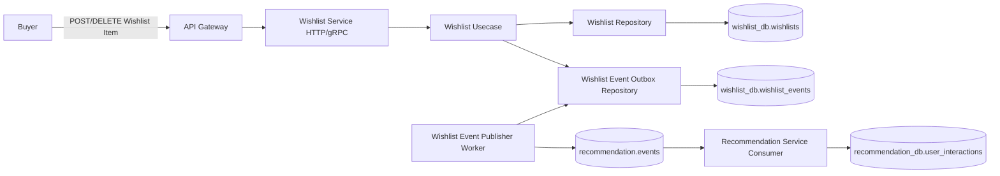
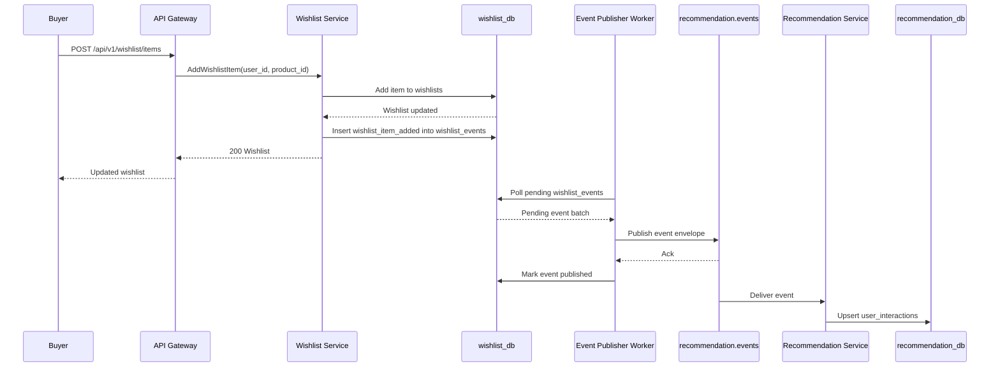
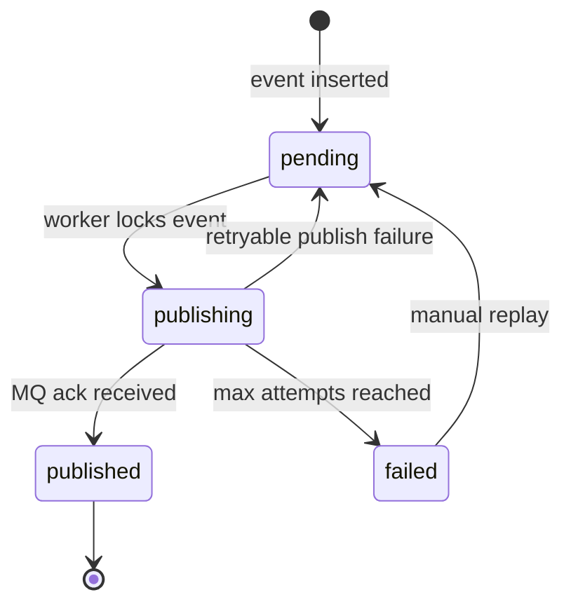
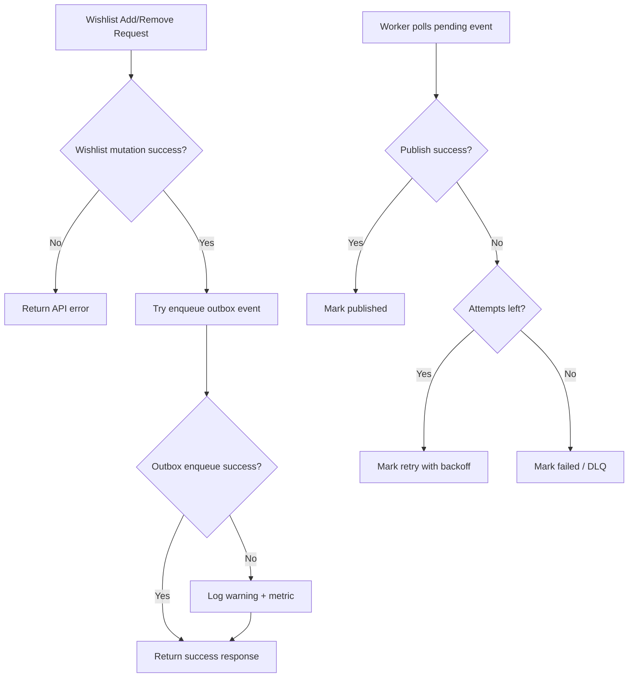

# 💖 Wishlist Service - Task 8: Analytics Events


---

## 📌 Task Summary

| Field | Detail |
|---|---|
| Service | Wishlist Service |
| Task | Task 8 - Analytics events |
| Source | `docs/01-micro-tasks.md` -> `Wishlist Service` -> Task 8 |
| Requirement | Wishlist add/remove events Recommendation Service ko bhejo. Personalization improve hoga. |
| Dependency | Message queue |
| Priority | P2 |
| Final Decision | **Wishlist add/remove ke baad event `recommendation.events` topic par publish hoga, aur reliability ke liye Wishlist Service-owned `wishlist_events` outbox collection use hogi** |
| Output | Structured Hinglish implementation guide for Wishlist Task 8 |

> **Simple Hinglish goal:** Jab buyer product wishlist me add ya remove kare, Wishlist Service ek analytics event publish karega. Recommendation Service is event ko consume karke user-product interaction samjhega, jisse personalized recommendations better banengi.

---

## ✅ Final Output Created

```text
TaskImplementation/
└── Wishlist Service/
    ├── task1.md
    ├── task2.md
    ├── task3.md
    ├── task4.md
    ├── task5.md
    ├── task6.md
    ├── task7.md
    └── task8.md
```

### Why this structure?

| Folder/File | Purpose |
|---|---|
| `TaskImplementation/` | Saare task-wise implementation guides ka central folder |
| `Wishlist Service/` | Wishlist service ke task guides ko group karta hai |
| `task1.md` | Wishlist model decision guide |
| `task2.md` | Wishlist MongoDB choice guide |
| `task3.md` | `wishlists` collection design guide |
| `task4.md` | Add/remove item APIs guide |
| `task5.md` | Move-to-cart guide |
| `task6.md` | Availability sync guide |
| `task7.md` | Price-drop notification guide |
| `task8.md` | Sirf **Wishlist Service - Task 8** ka analytics event guide |

> 🟢 **Note:** Is document me only Task 8 ka implementation guide diya gaya hai. Recommendation engine scoring, ML model, frontend analytics SDK, aur production Kafka cluster setup yahan implement nahi kiye gaye.

---

## 🧭 Documents Studied

| Document/File | Kya use kiya gaya |
|---|---|
| `docs/01-micro-tasks.md` | Task 8 ka exact scope: wishlist add/remove events Recommendation Service ko bhejna |
| `docs/04-microservice-design.md` | Wishlist responsibility: analytics events emit karna; `wishlist_events` collection mention |
| `docs/02-system-architecture.md` | Service boundaries and async communication direction |
| `docs/03-folder-structure.md` | Wishlist service clean architecture layout |
| `docs/05-database-design.md` | Batch consumers and recommendation feature guidance |
| `docs/11-devops-external-services.md` | Message queue topic list, `recommendation.events`, common event envelope, retry/DLQ rules |
| `docs/12-logging-monitoring-scalability.md` | Async events for recommendations and analytics; graceful degradation rule |
| `database/mongodb-schema-design.md` | Wishlist DB shape and Recommendation Service `user_interactions` target model |
| `api/master-api.json` | Wishlist methods and Recommendation Service API names |
| `TaskImplementation/Wishlist Service/task1.md` | Analytics events are future Task 8 scope |
| `TaskImplementation/Wishlist Service/task3.md` | `wishlist_events` intentionally deferred to Task 8 |
| `TaskImplementation/Wishlist Service/task4.md` | Add/remove item APIs are trigger points |
| `TaskImplementation/Wishlist Service/task6.md` | Event-driven retry/idempotency mindset |
| `TaskImplementation/Wishlist Service/task7.md` | Async event boundary and no cross-service DB access rule |
| `backend/services/wishlist-service/internal/usecase/wishlist_service.go` | Existing `AddItem` and `RemoveItem` usecase methods |
| `backend/services/wishlist-service/internal/domain/wishlist.go` | Existing `WishlistItem`, `Money`, `Availability` domain shape |
| `backend/services/wishlist-service/internal/repository/mongo_wishlist_repository.go` | Existing MongoDB repository pattern |

---

## 🧱 Task Boundary

### ✅ Included in Task 8

| Included | Explanation |
|---|---|
| Wishlist add event | Successful add ke baad `wishlist_item_added` event create hoga |
| Wishlist remove event | Existing item remove hone par `wishlist_item_removed` event create hoga |
| Message queue publishing | Event `recommendation.events` topic/queue par publish hoga |
| Outbox collection | Wishlist Service-owned `wishlist_events` collection pending/published/failed events track karegi |
| Idempotency | `event_id` unique hoga; retry duplicate recommendation interaction create nahi karega |
| Retry and DLQ guidance | Publish fail hone par backoff retry; repeated fail hone par DLQ |
| Recommendation contract | Recommendation Service ko expected payload shape document kiya gaya |
| Code examples | Domain event, repository, usecase, publisher, worker, test examples |
| Diagrams | Architecture, event flow, outbox lifecycle diagrams |
| External tools | MongoDB, Kafka/RabbitMQ, Go Kafka client, Docker Compose usage explain kiya gaya |

### ❌ Not Included in Task 8

| Not Included | Future/Other Scope |
|---|---|
| Recommendation ranking algorithm | Recommendation Service tasks |
| Recommendation Service DB implementation | Recommendation Service tasks |
| Frontend product recommendation UI | User App Frontend tasks |
| Session/page-view analytics SDK | Session Management Service / frontend analytics tasks |
| Product view, cart, purchase events | Product/Cart/Order/Session service analytics tasks |
| Production Kafka cluster provisioning | DevOps/external services tasks |
| Price-drop notification events | Wishlist Service Task 7 |
| Product availability event consumer | Wishlist Service Task 6 |

> 🔴 **Important boundary:** Wishlist Service Recommendation Service ke MongoDB ko direct write nahi karega. Wishlist Service sirf event publish karega. Recommendation Service apni DB me consume karke `user_interactions` maintain karega.

---

## 🧩 Final Design Decision

### Event-driven analytics design

```text
Buyer action
-> Wishlist API
-> Wishlist DB mutation
-> wishlist_events outbox insert
-> background publisher
-> recommendation.events topic
-> Recommendation Service consumer
-> recommendation_db.user_interactions
```

### Why outbox pattern?

Add/remove API ke same request me direct Kafka publish karna simple hai, but risky hai:

| Problem | Direct publish risk | Outbox solution |
|---|---|---|
| DB update success, Kafka fail | Wishlist changed but event lost | Event DB me pending save hota hai, worker retry karega |
| Kafka slow | API latency badh sakti hai | API sirf local DB/outbox write kare, publisher async chale |
| Duplicate retry | Same event multiple publish ho sakta hai | Unique `event_id` and Recommendation idempotency handle kare |
| Debugging | Missing events trace karna hard | `wishlist_events` collection se status visible hota hai |

> 🟢 **Final rule:** Wishlist core action should not depend on Recommendation Service uptime. Personalization eventually consistent rahega.

---

## 🏗️ Architecture



### Hinglish Explanation

- Buyer wishlist item add/remove karta hai.
- Wishlist Service pehle actual wishlist mutation karta hai.
- Mutation success ke baad analytics event outbox me store hota hai.
- Background worker pending events publish karta hai.
- Recommendation Service event consume karke user interaction feature update karta hai.
- Wishlist Service Recommendation DB ko direct touch nahi karta.

---

## 🔁 End-to-End Event Flow



---

## 🪜 Step-by-Step Implementation

## Step 1: Event Trigger Points Identify Kiye

Wishlist Service me Task 8 ke trigger points:

| Action | Existing usecase method | Event type | Publish kab hoga? |
|---|---|---|---|
| Add wishlist item | `AddItem` | `wishlist_item_added` | Product validation + Mongo add success ke baad |
| Remove wishlist item | `RemoveItem` | `wishlist_item_removed` | Item actually present tha aur remove success hua tab |

### Duplicate add ka behavior

Duplicate add Task 4 me block hota hai. Isliye duplicate request par analytics event publish nahi karna chahiye.

```text
First add  -> wishlist_item_added ✅
Second add -> duplicate error/no mutation -> no analytics event ❌
```

### Idempotent remove ka behavior

Remove operation user experience ke liye idempotent ho sakta hai. Lekin analytics ke liye event tabhi meaningful hai jab item pehle wishlist me exist karta tha.

```text
Item existed -> remove success -> wishlist_item_removed ✅
Item absent  -> no-op response -> no analytics event ❌
```

> 🟡 **Implementation note:** Remove event banane ke liye remove se pehle current wishlist read karke item snapshot capture karna useful hai, kyunki remove ke baad item details DB me nahi rahengi.

---

## Step 2: Event Naming Final Kiya

Recommendation Service ko simple, stable event names milne chahiye.

| Event Type | Meaning | Recommendation weight idea |
|---|---|---:|
| `wishlist_item_added` | User ne product future interest ke liye save kiya | `+4` |
| `wishlist_item_removed` | User ne product wishlist se remove kiya | `-2` |

### Why add event ka weight cart se kam but view se zyada?

```text
Product view        -> weak interest
Wishlist add        -> medium/strong interest
Cart add            -> strong purchase intent
Purchase            -> final conversion
Wishlist remove     -> interest reduced
```

Recommendation Service exact weights apne side decide karega. Wishlist Service sirf clean event publish karega.

---

## Step 3: Common Event Envelope Use Kiya

`docs/11-devops-external-services.md` me common event envelope diya gaya hai. Task 8 me same shape follow hogi.

```json
{
  "event_id": "evt_wish_01HW...",
  "event_type": "wishlist_item_added",
  "version": 1,
  "occurred_at": "2026-05-26T12:10:00Z",
  "producer": "wishlist-service",
  "trace_id": "req_abc_123",
  "payload": {
    "user_id": "user_123",
    "product_id": "prod_123",
    "variant_id": "var_1",
    "action": "add",
    "source": "wishlist",
    "availability": "in_stock",
    "last_known_price": {
      "amount": 299900,
      "currency": "INR"
    }
  }
}
```

### Envelope fields

| Field | Required | Explanation |
|---|---:|---|
| `event_id` | ✅ | Globally unique id; duplicate handling ke liye |
| `event_type` | ✅ | `wishlist_item_added` ya `wishlist_item_removed` |
| `version` | ✅ | Payload schema version |
| `occurred_at` | ✅ | Buyer action ka timestamp |
| `producer` | ✅ | Always `wishlist-service` |
| `trace_id` | 🟡 | Request tracing ke liye useful |
| `payload` | ✅ | Wishlist-specific event data |

### Payload fields

| Field | Required | Explanation |
|---|---:|---|
| `user_id` | ✅ | Recommendation personalization ke liye |
| `product_id` | ✅ | Product interaction ka core target |
| `variant_id` | 🟡 | Variant-specific catalog ke liye optional |
| `action` | ✅ | `add` or `remove` |
| `source` | ✅ | Always `wishlist` |
| `availability` | 🟡 | Product available/out_of_stock/deleted snapshot |
| `last_known_price` | 🟡 | Recommendation price sensitivity features ke liye optional |

> 🔵 **Privacy note:** Event me email, phone, address, name, ya payment info bilkul nahi bhejna. `user_id` internal identifier enough hai.

---

## Step 4: `wishlist_events` Outbox Collection Design Kiya

Wishlist Service Task 3 me `wishlists` collection design hua tha. Task 8 me `wishlist_events` outbox collection add hogi.

### Database and collection

```text
Database: wishlist_db
Collection: wishlist_events
Purpose: Pending/published analytics events track karna
Owner: Wishlist Service only
```

### Example document

```json
{
  "_id": "evt_wish_01HWABC",
  "event_type": "wishlist_item_added",
  "version": 1,
  "topic": "recommendation.events",
  "payload": {
    "user_id": "user_123",
    "product_id": "prod_123",
    "variant_id": "var_1",
    "action": "add",
    "source": "wishlist",
    "availability": "in_stock",
    "last_known_price": {
      "amount": 299900,
      "currency": "INR"
    }
  },
  "trace_id": "req_abc_123",
  "status": "pending",
  "attempts": 0,
  "next_retry_at": "2026-05-26T12:10:00Z",
  "last_error": "",
  "occurred_at": "2026-05-26T12:10:00Z",
  "published_at": null,
  "created_at": "2026-05-26T12:10:00Z",
  "updated_at": "2026-05-26T12:10:00Z"
}
```

### Status lifecycle



### Indexes

```javascript
db.wishlist_events.createIndex(
  { status: 1, next_retry_at: 1, created_at: 1 },
  { name: "idx_wishlist_events_pending_retry" }
)

db.wishlist_events.createIndex(
  { event_type: 1, occurred_at: -1 },
  { name: "idx_wishlist_events_type_time" }
)

db.wishlist_events.createIndex(
  { published_at: 1 },
  {
    name: "ttl_wishlist_events_published_at",
    expireAfterSeconds: 2592000
  }
)
```

| Index | Why needed |
|---|---|
| `idx_wishlist_events_pending_retry` | Worker pending events fast poll karega |
| `idx_wishlist_events_type_time` | Debugging/analytics audit queries ke liye |
| `ttl_wishlist_events_published_at` | Published events 30 days baad cleanup; storage control |

> 🟣 **Why `_id` as event id?** MongoDB `_id` already unique hai. Same event accidentally dobara insert karne par duplicate key error milega, jo idempotency me help karta hai.

---

## Step 5: Go Domain Event Structs Banaye

Recommended file:

```text
backend/services/wishlist-service/internal/domain/wishlist_event.go
```

```go
package domain

import "time"

type WishlistEventType string

const (
    WishlistEventItemAdded   WishlistEventType = "wishlist_item_added"
    WishlistEventItemRemoved WishlistEventType = "wishlist_item_removed"
)

type WishlistEventStatus string

const (
    WishlistEventPending    WishlistEventStatus = "pending"
    WishlistEventPublishing WishlistEventStatus = "publishing"
    WishlistEventPublished  WishlistEventStatus = "published"
    WishlistEventFailed     WishlistEventStatus = "failed"
)

type WishlistAnalyticsPayload struct {
    UserID         string
    ProductID      string
    VariantID      string
    Action         string
    Source         string
    Availability   Availability
    LastKnownPrice *Money
}

type WishlistAnalyticsEvent struct {
    EventID     string
    EventType   WishlistEventType
    Version     int
    Topic       string
    Payload     WishlistAnalyticsPayload
    TraceID     string
    Status      WishlistEventStatus
    Attempts    int
    NextRetryAt time.Time
    LastError   string
    OccurredAt  time.Time
    PublishedAt *time.Time
    CreatedAt   time.Time
    UpdatedAt   time.Time
}
```

### Hinglish Explanation

- `WishlistEventType` event ka naam stable banata hai.
- `WishlistAnalyticsPayload` me sirf recommendation ke useful fields hain.
- `WishlistAnalyticsEvent` outbox metadata store karta hai: status, attempts, retry time, etc.
- `Version` future schema changes ke liye hai.

---

## Step 6: Event Builder Helper Add Kiya

Recommended file:

```text
backend/services/wishlist-service/internal/usecase/wishlist_event_builder.go
```

```go
package usecase

import (
    "time"

    "ecommerce/backend/services/wishlist-service/internal/domain"
)

const recommendationEventsTopic = "recommendation.events"

func newWishlistAnalyticsEvent(
    eventID string,
    eventType domain.WishlistEventType,
    userID string,
    item domain.WishlistItem,
    traceID string,
    occurredAt time.Time,
) domain.WishlistAnalyticsEvent {
    action := "add"
    if eventType == domain.WishlistEventItemRemoved {
        action = "remove"
    }

    return domain.WishlistAnalyticsEvent{
        EventID:   eventID,
        EventType: eventType,
        Version:   1,
        Topic:     recommendationEventsTopic,
        Payload: domain.WishlistAnalyticsPayload{
            UserID:         userID,
            ProductID:      item.ProductID,
            VariantID:      item.VariantID,
            Action:         action,
            Source:         "wishlist",
            Availability:   item.Availability.Normalized(),
            LastKnownPrice: item.LastKnownPrice,
        },
        TraceID:     traceID,
        Status:      domain.WishlistEventPending,
        Attempts:    0,
        NextRetryAt: occurredAt,
        OccurredAt:  occurredAt,
        CreatedAt:   occurredAt,
        UpdatedAt:   occurredAt,
    }
}
```

### Why builder helper?

| Benefit | Explanation |
|---|---|
| Consistency | Add/remove dono same envelope format use karenge |
| Testability | Event payload unit test easy hoga |
| Versioning | Future schema v2 yahin central change hoga |
| Less duplication | Usecase methods me repeated mapping nahi hoga |

---

## Step 7: Outbox Repository Interface Add Kiya

Usecase ko MongoDB implementation directly pata nahi hona chahiye. Interface se test doubles easy bante hain.

```go
type WishlistEventRepository interface {
    Enqueue(ctx context.Context, event domain.WishlistAnalyticsEvent) error
    ClaimPending(ctx context.Context, limit int, now time.Time) ([]domain.WishlistAnalyticsEvent, error)
    MarkPublished(ctx context.Context, eventID string, publishedAt time.Time) error
    MarkRetry(ctx context.Context, eventID string, attempts int, nextRetryAt time.Time, lastError string) error
    MarkFailed(ctx context.Context, eventID string, attempts int, lastError string, failedAt time.Time) error
}
```

### Hinglish Explanation

- `Enqueue`: API request ke time event pending state me save karta hai.
- `ClaimPending`: background worker pending events batch me lock karta hai.
- `MarkPublished`: publish success ke baad status update karta hai.
- `MarkRetry`: temporary failure par retry schedule karta hai.
- `MarkFailed`: max retry cross hone par event failed mark hota hai.

---

## Step 8: Mongo Outbox Repository Implement Kiya

Recommended file:

```text
backend/services/wishlist-service/internal/repository/mongo_wishlist_event_repository.go
```

### Enqueue example

```go
func (r *MongoWishlistEventRepository) Enqueue(ctx context.Context, event domain.WishlistAnalyticsEvent) error {
    if event.EventID == "" {
        return errors.New("event_id is required")
    }

    document := newWishlistEventDocument(event)
    _, err := r.collection.InsertOne(contextOrBackground(ctx), document)
    if err != nil {
        if mongo.IsDuplicateKeyError(err) {
            return nil
        }
        return fmt.Errorf("enqueue wishlist analytics event %q: %w", event.EventID, err)
    }
    return nil
}
```

### Claim pending example

```go
func (r *MongoWishlistEventRepository) ClaimPending(ctx context.Context, limit int, now time.Time) ([]domain.WishlistAnalyticsEvent, error) {
    filter := bson.M{
        "status": domain.WishlistEventPending,
        "next_retry_at": bson.M{
            "$lte": now,
        },
    }

    update := bson.M{
        "$set": bson.M{
            "status":     domain.WishlistEventPublishing,
            "updated_at": now,
        },
    }

    // Beginner-friendly approach:
    // 1. Find pending docs sorted by created_at.
    // 2. For each doc, update status from pending -> publishing.
    // 3. Only process docs where update matched.
    // Production me findOneAndUpdate loop with lease_id better hoga.
    return r.claimBatch(ctx, filter, update, limit)
}
```

### Why `publishing` lock status?

Multiple worker replicas parallel chal sakte hain. Agar worker A aur worker B same pending event pick kar lete hain, duplicate publish ka risk hai. `pending -> publishing` atomic update event ko temporarily lock karta hai.

> 🟡 **Production note:** `publishing` state ke saath `locked_until` / `lease_id` add karna better hota hai. Agar worker crash ho jaye, lease expire ke baad event retry ho sakta hai.

---

## Step 9: Add Flow Me Event Enqueue Kiya

Existing `AddItem` method me event point successful repository add ke baad aayega.

### Before Task 8

```text
Validate product
-> Ensure wishlist
-> Add item
-> Read wishlist
-> Return response
```

### After Task 8

```text
Validate product
-> Ensure wishlist
-> Add item
-> Enqueue wishlist_item_added event
-> Read wishlist
-> Return response
```

### Code example

```go
if err := s.repository.AddItemIfNotExists(ctx, userID, item, now); err != nil {
    if errors.Is(err, domain.ErrDuplicateProduct) {
        s.logger.Info("wishlist duplicate add blocked", "user_id", userID, "product_id", productID)
    }
    return nil, err
}

event := newWishlistAnalyticsEvent(
    s.eventIDFactory(),
    domain.WishlistEventItemAdded,
    userID,
    item,
    requestTraceID(ctx),
    now,
)

if err := s.eventRepository.Enqueue(ctx, event); err != nil {
    s.logger.Warn("wishlist analytics event enqueue failed",
        "event_type", event.EventType,
        "user_id", userID,
        "product_id", productID,
        "error", err,
    )
}
```

### Should API fail if analytics enqueue fails?

Recommended Task 8 behavior:

| Failure | API response | Reason |
|---|---|---|
| Product validation fail | Fail request | Core wishlist correctness |
| Mongo wishlist add fail | Fail request | Core mutation did not happen |
| Outbox enqueue fail | Do not fail by default, log + metric | Analytics is P2 and should not break wishlist UX |
| Kafka publish fail | Do not affect API, worker retries | Async flow |

> 🟢 **Buyer-first rule:** Wishlist add/remove UX should stay fast even if Recommendation Service ya message queue temporarily down ho.

---

## Step 10: Remove Flow Me Event Enqueue Kiya

Remove event ke liye item details remove se pehle capture karni chahiye.

### Flow

```text
Ensure wishlist
-> Read wishlist
-> Find item by product_id
-> Remove item
-> If item existed, enqueue wishlist_item_removed event
-> Read updated wishlist
-> Return response
```

### Code example

```go
wishlistBeforeRemove, err := s.repository.FindByUserID(ctx, userID)
if err != nil && !errors.Is(err, domain.ErrWishlistNotFound) {
    return nil, err
}

removedItem, itemExisted := domain.WishlistItem{}, false
if wishlistBeforeRemove != nil {
    removedItem, itemExisted = wishlistBeforeRemove.FindItem(productID)
}

if err := s.repository.RemoveItem(ctx, userID, productID, now); err != nil {
    return nil, err
}

if itemExisted {
    event := newWishlistAnalyticsEvent(
        s.eventIDFactory(),
        domain.WishlistEventItemRemoved,
        userID,
        removedItem,
        requestTraceID(ctx),
        now,
    )
    if err := s.eventRepository.Enqueue(ctx, event); err != nil {
        s.logger.Warn("wishlist remove analytics event enqueue failed",
            "user_id", userID,
            "product_id", productID,
            "error", err,
        )
    }
}
```

### Why absent item par event nahi?

Absent item remove request user intent ka weak signal ho sakta hai, but current Task 8 ka scope successful wishlist add/remove events hai. Agar item already absent tha, actual wishlist state change nahi hua.

---

## Step 11: Event Publisher Interface Banaya

Worker ko message queue implementation ke details se isolate karo.

Recommended file:

```text
backend/services/wishlist-service/internal/events/publisher.go
```

```go
package events

import (
    "context"

    "ecommerce/backend/services/wishlist-service/internal/domain"
)

type Publisher interface {
    Publish(ctx context.Context, event domain.WishlistAnalyticsEvent) error
    Close() error
}
```

### Why interface?

| Reason | Benefit |
|---|---|
| Kafka/RabbitMQ swap | Usecase/worker code same rahega |
| Unit tests | Fake publisher use hoga |
| Local dev | No-op publisher possible |
| Clean architecture | Infra details `internal/events` me confined |

---

## Step 12: Kafka Publisher Implement Kiya

Recommended tool: `github.com/segmentio/kafka-go`

Recommended file:

```text
backend/services/wishlist-service/internal/events/kafka_publisher.go
```

```go
package events

import (
    "context"
    "encoding/json"
    "fmt"

    "ecommerce/backend/services/wishlist-service/internal/domain"

    "github.com/segmentio/kafka-go"
)

type KafkaPublisher struct {
    writer *kafka.Writer
}

func NewKafkaPublisher(brokers []string, topic string) (*KafkaPublisher, error) {
    if len(brokers) == 0 {
        return nil, fmt.Errorf("kafka brokers are required")
    }
    if topic == "" {
        return nil, fmt.Errorf("kafka topic is required")
    }

    return &KafkaPublisher{
        writer: &kafka.Writer{
            Addr:  kafka.TCP(brokers...),
            Topic: topic,
        },
    }, nil
}

func (p *KafkaPublisher) Publish(ctx context.Context, event domain.WishlistAnalyticsEvent) error {
    body, err := json.Marshal(event)
    if err != nil {
        return fmt.Errorf("marshal wishlist analytics event: %w", err)
    }

    return p.writer.WriteMessages(ctx, kafka.Message{
        Key:   []byte(event.Payload.UserID),
        Value: body,
        Headers: []kafka.Header{
            {Key: "event_id", Value: []byte(event.EventID)},
            {Key: "event_type", Value: []byte(event.EventType)},
            {Key: "producer", Value: []byte("wishlist-service")},
        },
    })
}

func (p *KafkaPublisher) Close() error {
    return p.writer.Close()
}
```

### Why Kafka key `user_id`?

Same user ke interactions same partition me ja sakte hain. Recommendation Service ko per-user ordering ka better chance milta hai.

> 🟡 **Alternative:** Agar project RabbitMQ use kare, same `Publisher` interface ke peeche `amqp091-go` implementation ban sakti hai.

---

## Step 13: Background Publisher Worker Banaya

Recommended file:

```text
backend/services/wishlist-service/internal/events/outbox_worker.go
```

```go
package events

import (
    "context"
    "log/slog"
    "time"

    "ecommerce/backend/services/wishlist-service/internal/domain"
)

type OutboxRepository interface {
    ClaimPending(ctx context.Context, limit int, now time.Time) ([]domain.WishlistAnalyticsEvent, error)
    MarkPublished(ctx context.Context, eventID string, publishedAt time.Time) error
    MarkRetry(ctx context.Context, eventID string, attempts int, nextRetryAt time.Time, lastError string) error
    MarkFailed(ctx context.Context, eventID string, attempts int, lastError string, failedAt time.Time) error
}

type OutboxWorker struct {
    repository  OutboxRepository
    publisher   Publisher
    logger      *slog.Logger
    batchSize   int
    maxAttempts int
    pollEvery   time.Duration
}

func (w *OutboxWorker) Run(ctx context.Context) error {
    ticker := time.NewTicker(w.pollEvery)
    defer ticker.Stop()

    for {
        if err := w.publishBatch(ctx); err != nil {
            w.logger.Warn("wishlist analytics publish batch failed", "error", err)
        }

        select {
        case <-ctx.Done():
            return ctx.Err()
        case <-ticker.C:
        }
    }
}
```

### Publish batch logic

```go
func (w *OutboxWorker) publishBatch(ctx context.Context) error {
    now := time.Now().UTC()
    events, err := w.repository.ClaimPending(ctx, w.batchSize, now)
    if err != nil {
        return err
    }

    for _, event := range events {
        if err := w.publisher.Publish(ctx, event); err != nil {
            attempts := event.Attempts + 1
            if attempts >= w.maxAttempts {
                _ = w.repository.MarkFailed(ctx, event.EventID, attempts, err.Error(), now)
                continue
            }

            nextRetryAt := now.Add(backoff(attempts))
            _ = w.repository.MarkRetry(ctx, event.EventID, attempts, nextRetryAt, err.Error())
            continue
        }

        _ = w.repository.MarkPublished(ctx, event.EventID, now)
    }
    return nil
}

func backoff(attempts int) time.Duration {
    switch {
    case attempts <= 1:
        return 5 * time.Second
    case attempts == 2:
        return 30 * time.Second
    case attempts == 3:
        return 2 * time.Minute
    default:
        return 10 * time.Minute
    }
}
```

### Hinglish Explanation

- Worker har few seconds pending events poll karta hai.
- Event publish success ho to `published` mark hota hai.
- Temporary failure ho to `pending` + `next_retry_at` future me set hota hai.
- Bahut zyada failure ho to `failed` mark hota hai.
- Failed events later manual replay/DLQ process se handle ho sakte hain.

---

## Step 14: Config Add Kiya

Recommended env vars:

```env
WISHLIST_ANALYTICS_EVENTS_ENABLED=true
WISHLIST_EVENT_OUTBOX_COLLECTION=wishlist_events
WISHLIST_EVENT_TOPIC=recommendation.events
WISHLIST_EVENT_PUBLISHER=kafka
WISHLIST_KAFKA_BROKERS=localhost:9092
WISHLIST_EVENT_POLL_INTERVAL=5s
WISHLIST_EVENT_BATCH_SIZE=50
WISHLIST_EVENT_MAX_ATTEMPTS=5
```

### Config fields

```go
type EventConfig struct {
    Enabled          bool
    OutboxCollection string
    Topic            string
    Publisher        string
    KafkaBrokers     []string
    PollInterval     time.Duration
    BatchSize        int
    MaxAttempts      int
}
```

### Defaults

| Setting | Default | Why |
|---|---|---|
| `Enabled` | `true` | Task 8 enabled by default in service |
| `OutboxCollection` | `wishlist_events` | Docs me mentioned collection |
| `Topic` | `recommendation.events` | DevOps docs topic |
| `Publisher` | `kafka` | Kafka recommended for event streaming |
| `PollInterval` | `5s` | Low latency but not too chatty |
| `BatchSize` | `50` | Small safe batch for MVP |
| `MaxAttempts` | `5` | Retry enough, then fail/DLQ |

---

## Step 15: `main.go` Wiring Kiya

Current service startup already Mongo repo, Product client, Cart client, and HTTP server wire karta hai. Task 8 me additional wiring:

```text
Load config
-> Create wishlist repository
-> Create wishlist event repository
-> Create Kafka/RabbitMQ publisher
-> Create outbox worker
-> Pass event repository to WishlistService
-> Start HTTP server and worker together
-> Shutdown gracefully
```

### Pseudo-code

```go
eventRepository, err := repository.NewMongoWishlistEventRepository(
    client.Database(cfg.Mongo.Database),
    cfg.Events.OutboxCollection,
    logger,
)
if err != nil {
    return err
}

publisher, err := events.NewKafkaPublisher(cfg.Events.KafkaBrokers, cfg.Events.Topic)
if err != nil {
    return err
}
defer publisher.Close()

wishlistService, err := usecase.NewWishlistService(
    wishlistRepository,
    productValidator,
    cartClient,
    eventRepository,
    logger,
)
if err != nil {
    return err
}

worker := events.NewOutboxWorker(eventRepository, publisher, logger, events.WorkerConfig{
    BatchSize:   cfg.Events.BatchSize,
    MaxAttempts: cfg.Events.MaxAttempts,
    PollEvery:   cfg.Events.PollInterval,
})

go func() {
    if err := worker.Run(stopCtx); err != nil && !errors.Is(err, context.Canceled) {
        logger.Error("wishlist analytics worker stopped", "error", err)
    }
}()
```

> 🟢 **Graceful shutdown:** HTTP server aur worker dono same shutdown context respect karenge. Shutdown ke time in-flight publish complete karne ke liye small timeout use karo.

---

## Step 16: Recommendation Service Contract Document Kiya

Wishlist Service publish karega. Recommendation Service consume karega. Dono ke beech contract:

### Topic/queue

```text
recommendation.events
```

### Supported event types from Wishlist Service

```text
wishlist_item_added
wishlist_item_removed
```

### Recommendation side mapping

| Wishlist event | Recommendation interaction |
|---|---|
| `wishlist_item_added` | `event_type = "wishlist_add"`, positive weight |
| `wishlist_item_removed` | `event_type = "wishlist_remove"`, negative weight |

### Target Recommendation DB example

```json
{
  "_id": "interaction_evt_wish_01HWABC",
  "user_id": "user_123",
  "product_id": "prod_123",
  "event_type": "wishlist_add",
  "weight": 4,
  "occurred_at": "2026-05-26T12:10:00Z",
  "source_event_id": "evt_wish_01HWABC"
}
```

> 🔴 **Boundary reminder:** Ye Recommendation Service side ka expected consume behavior hai. Task 8 me Recommendation Service code implement nahi karna.

---

## Step 17: Idempotency and Duplicate Handling Add Kiya

### Wishlist Service side

| Case | Handling |
|---|---|
| Same event enqueue twice | `_id = event_id` duplicate key ignore |
| Worker retries same event | Same `event_id` publish ho sakta hai; consumer idempotent hona chahiye |
| Worker crashes after publish before mark published | Event retry possible; consumer uses `source_event_id` unique |
| Duplicate add blocked | Event create nahi hota |
| Remove absent item | Event create nahi hota |

### Recommendation Service side

Recommended unique index:

```javascript
db.user_interactions.createIndex(
  { source_event_id: 1 },
  { unique: true, name: "uniq_user_interactions_source_event_id" }
)
```

Consumer upsert idea:

```go
filter := bson.M{"source_event_id": envelope.EventID}
update := bson.M{"$setOnInsert": interactionDocument}
_, err := collection.UpdateOne(ctx, filter, update, options.UpdateOne().SetUpsert(true))
```

> 🟢 **Rule:** At-least-once delivery accept karo, consumer idempotent banao. Exactly-once delivery par depend mat karo.

---

## Step 18: Observability Add Kiya

Task 8 analytics flow async hai, isliye logs/metrics/traces important hain.

### Logs

| Log event | Level | Important fields |
|---|---|---|
| Event enqueued | `INFO` | `event_id`, `event_type`, `user_id`, `product_id` |
| Enqueue failed | `WARN` | `event_type`, `user_id`, `product_id`, `error` |
| Publish success | `INFO` | `event_id`, `topic`, `attempts` |
| Publish retry | `WARN` | `event_id`, `attempts`, `next_retry_at`, `error` |
| Publish failed permanently | `ERROR` | `event_id`, `attempts`, `last_error` |

### Metrics

```text
wishlist_events_enqueued_total{event_type}
wishlist_events_published_total{event_type}
wishlist_events_publish_failed_total{event_type}
wishlist_events_pending_count
wishlist_events_publish_latency_ms
wishlist_events_worker_batch_size
```

### Trace fields

| Field | Purpose |
|---|---|
| `trace_id` | API request to async publish correlate karna |
| `event_id` | Single event lifecycle track karna |
| `user_id` | Debugging; logs me PII avoid karte hue internal id okay |
| `product_id` | Product-level analytics issues debug karna |

---

## Step 19: Testing Strategy Banayi

### Unit tests

| Test | Expected |
|---|---|
| Add item success enqueues `wishlist_item_added` | Event type, user_id, product_id correct |
| Duplicate add does not enqueue event | Event repo not called |
| Remove existing item enqueues `wishlist_item_removed` | Removed item snapshot included |
| Remove absent item does not enqueue event | Event repo not called |
| Event builder creates version `1` | Version stable |
| Worker publish success marks published | Status updated |
| Worker publish fail schedules retry | Attempts increment + next_retry_at set |
| Worker max attempts marks failed | Status `failed` |

### Example fake event repository test

```go
func TestWishlistServiceAddItemEnqueuesAnalyticsEvent(t *testing.T) {
    repo := newFakeWishlistRepository()
    events := &fakeWishlistEventRepository{}
    validator := fakeProductValidator{
        product: ProductSnapshot{
            ProductID:    "prod_123",
            VariantID:    "var_1",
            Availability: domain.AvailabilityInStock,
            LastKnownPrice: &domain.Money{
                Amount:   299900,
                Currency: "INR",
            },
        },
    }

    service, err := NewWishlistService(repo, validator, fakeCartClient{}, events, slog.Default())
    require.NoError(t, err)

    _, err = service.AddItem(context.Background(), AddWishlistItemInput{
        UserID:    "user_123",
        ProductID: "prod_123",
        VariantID: "var_1",
    })
    require.NoError(t, err)
    require.Len(t, events.enqueued, 1)
    require.Equal(t, domain.WishlistEventItemAdded, events.enqueued[0].EventType)
    require.Equal(t, "user_123", events.enqueued[0].Payload.UserID)
    require.Equal(t, "prod_123", events.enqueued[0].Payload.ProductID)
}
```

### Integration tests

| Test | Setup | Expected |
|---|---|---|
| Outbox insert | Mongo test DB | `wishlist_events` doc created |
| Pending index query | Mongo test DB | Worker finds pending event quickly |
| Kafka publish | Local Kafka container | Message appears on `recommendation.events` |
| Retry flow | Fake publisher failure | Event becomes pending with future retry |

---

## Step 20: Failure Handling Rules Final Kiye



### Failure table

| Failure point | Handling |
|---|---|
| Product validation fail | No wishlist mutation, no event |
| Wishlist Mongo mutation fail | No event |
| Outbox insert fail | Log warning, increment metric, API can still succeed |
| Worker cannot connect to Kafka | Retry pending events |
| Kafka publish succeeds but mark published fails | Event may republish; consumer idempotency handles duplicate |
| Recommendation consumer down | Kafka retains event; consumer catches up later |

---

## 📦 External Libraries / Tools

### 1. MongoDB

| Field | Detail |
|---|---|
| What | Document database |
| Why used | `wishlists` and `wishlist_events` service-owned collections store karne ke liye |
| Current project status | Wishlist Service already MongoDB Go Driver use karta hai |
| Install/use | Local MongoDB Docker Compose service ya managed MongoDB |

Go dependency already present:

```bash
cd backend/services/wishlist-service
go get go.mongodb.org/mongo-driver/v2/mongo
```

### 2. Kafka

| Field | Detail |
|---|---|
| What | Distributed event streaming platform |
| Why used | `recommendation.events` high-throughput analytics events publish/consume karne ke liye |
| Project docs | `docs/11-devops-external-services.md` Kafka recommended bolta hai |
| Install/use | Docker Compose/local Kafka, then Go producer library |

Example local topic:

```bash
kafka-topics --bootstrap-server localhost:9092 \
  --create \
  --topic recommendation.events \
  --partitions 3 \
  --replication-factor 1
```

### 3. `github.com/segmentio/kafka-go`

| Field | Detail |
|---|---|
| What | Go Kafka client |
| Why used | Wishlist Service se Kafka topic me event publish karne ke liye |
| Install | `go get github.com/segmentio/kafka-go` |
| Use | `kafka.Writer` se messages publish |

Install command:

```bash
cd backend/services/wishlist-service
go get github.com/segmentio/kafka-go
```

### 4. RabbitMQ alternative: `github.com/rabbitmq/amqp091-go`

| Field | Detail |
|---|---|
| What | Go AMQP client |
| Why used | Agar project Kafka ki jagah RabbitMQ choose kare |
| Install | `go get github.com/rabbitmq/amqp091-go` |
| Use | Exchange/queue me event publish |

Install command:

```bash
cd backend/services/wishlist-service
go get github.com/rabbitmq/amqp091-go
```

> 🟡 **Choose one:** Project docs Kafka recommended bolte hain. RabbitMQ sirf simpler queueing alternative hai. Dono ek saath implement karna Task 8 me zaruri nahi.

### 5. Mermaid

| Field | Detail |
|---|---|
| What | Markdown-friendly diagram syntax |
| Why used | Architecture, sequence, aur state flow visually explain karne ke liye |
| Install | GitHub/GitLab/Markdown preview me built-in support ho sakta hai |
| Use | Markdown fenced block: <code>```mermaid</code> |

---

## 🗂️ Clean Folder Structure

### Documentation output

```text
TaskImplementation/
└── Wishlist Service/
    └── task8.md
```

### Recommended backend implementation structure

```text
backend/
└── services/
    └── wishlist-service/
        ├── cmd/
        │   └── server/
        │       └── main.go
        ├── internal/
        │   ├── config/
        │   │   └── config.go
        │   ├── domain/
        │   │   ├── wishlist.go
        │   │   ├── wishlist_event.go
        │   │   └── errors.go
        │   ├── events/
        │   │   ├── publisher.go
        │   │   ├── kafka_publisher.go
        │   │   └── outbox_worker.go
        │   ├── repository/
        │   │   ├── mongo_wishlist_repository.go
        │   │   ├── mongo_wishlist_event_repository.go
        │   │   ├── wishlist_document.go
        │   │   └── wishlist_event_document.go
        │   ├── transport/
        │   │   └── http/
        │   │       └── wishlist_handler.go
        │   └── usecase/
        │       ├── wishlist_service.go
        │       └── wishlist_event_builder.go
        └── migrations/
            └── mongo/
                ├── 002_create_wishlist_events_collection.up.js
                └── 002_create_wishlist_events_collection.down.js
```

### File responsibilities

| File | Responsibility |
|---|---|
| `domain/wishlist_event.go` | Event types, payload, status enums |
| `usecase/wishlist_event_builder.go` | Add/remove event envelope build |
| `usecase/wishlist_service.go` | Add/remove success ke baad event enqueue |
| `repository/mongo_wishlist_event_repository.go` | Outbox CRUD, claim, retry, publish status |
| `repository/wishlist_event_document.go` | Mongo document <-> domain mapping |
| `events/publisher.go` | Message publisher interface |
| `events/kafka_publisher.go` | Kafka implementation |
| `events/outbox_worker.go` | Pending events publish/retry loop |
| `config/config.go` | Event publisher config/env vars |
| `cmd/server/main.go` | Repository, publisher, worker wiring |
| `migrations/mongo/002...up.js` | `wishlist_events` collection + indexes |

> 🟢 **Scope note:** Ye recommended implementation structure hai. Is task output me backend files create nahi kiye gaye, kyunki requested output specifically documentation folder and `task8.md` hai.

---

## 🧪 Verification Checklist

| Check | Expected |
|---|---|
| `TaskImplementation/Wishlist Service/task8.md` exists | ✅ |
| Guide Hinglish me hai | ✅ |
| Add/remove analytics event design covered | ✅ |
| Message queue dependency explained | ✅ |
| `wishlist_events` outbox collection documented | ✅ |
| External libraries/tools listed | ✅ |
| Install/use commands included | ✅ |
| Folder structure included | ✅ |
| Go/JSON/Mongo code examples included | ✅ |
| Mermaid diagrams included | ✅ |
| Recommendation Service boundary clear | ✅ |
| Nothing beyond Wishlist Service Task 8 implemented | ✅ |

---

## ✅ Final Task 8 Outcome

Wishlist Service Task 8 ka final implementation direction:

```text
On wishlist item add/remove:
1. Core wishlist mutation successful honi chahiye.
2. Analytics payload build hoga.
3. Event `wishlist_events` outbox me pending save hoga.
4. Background worker event `recommendation.events` par publish karega.
5. Recommendation Service event consume karke personalization improve karega.
```

### Final event types

```text
wishlist_item_added
wishlist_item_removed
```

### Final topic

```text
recommendation.events
```

### Final outbox collection

```text
wishlist_db.wishlist_events
```

> ✅ **Task 8 complete:** Wishlist add/remove analytics events ka beginner-friendly, step-by-step implementation guide ready hai. This design keeps Wishlist Service fast, resilient, and cleanly decoupled from Recommendation Service.
