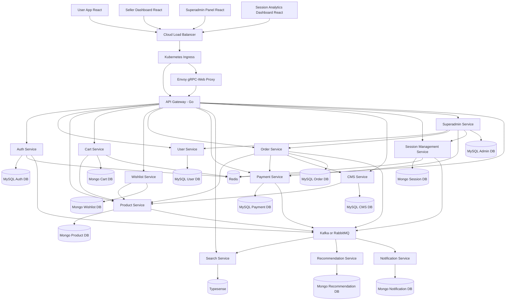
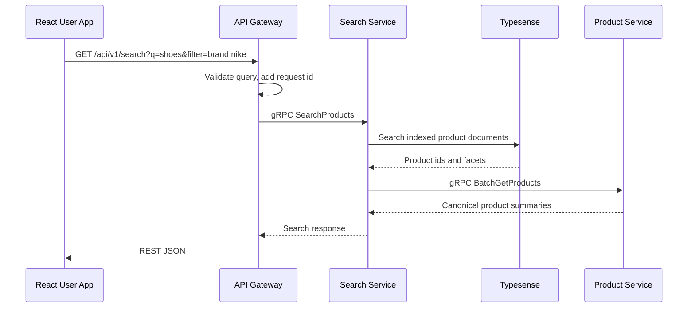
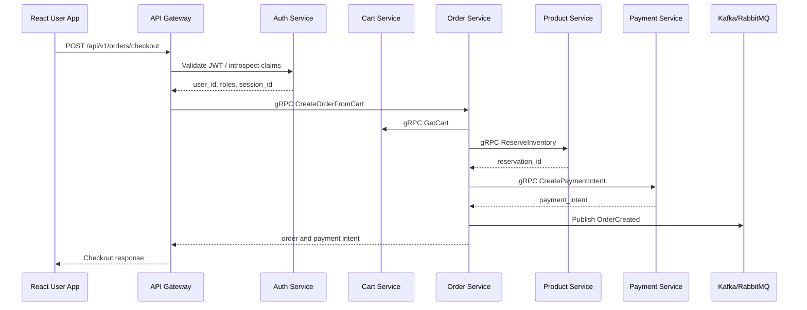
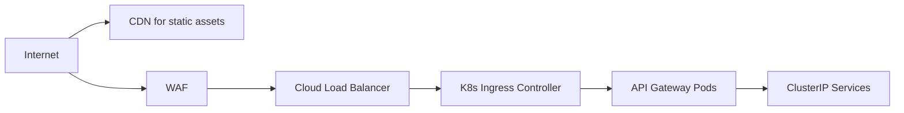
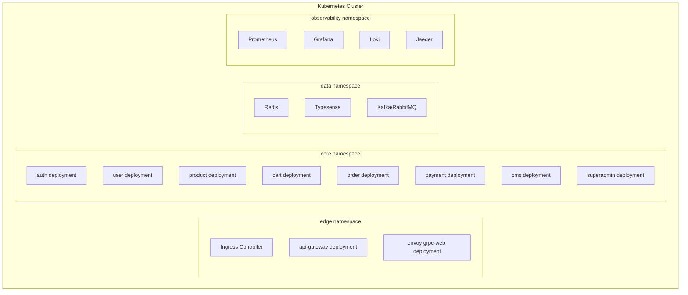

# Step 2 - System Architecture

## Architecture Goals

Ye platform Amazon/Flipkart/Shopify style scalable architecture follow karega:

- Public traffic API Gateway pe aayega.
- Internal services mostly gRPC use karenge, kyunki gRPC fast, typed, and contract-driven hota hai.
- REST frontend-friendly APIs ke liye gateway expose karega.
- gRPC-Web selected browser modules ke liye Envoy/gateway bridge se use hoga.
- Har microservice ka apna database hoga. Direct cross-service DB access allowed nahi hoga.
- Kafka/RabbitMQ event-driven async work ke liye use hoga.
- Redis caching, rate limiting, active sessions, and hot data ke liye use hoga.
- Kubernetes horizontal scaling, service discovery, health checks, and rolling deployments manage karega.

## High-Level Microservices Diagram

## Request Flow - Product Browse

Hinglish explanation: Browser REST call karta hai kyunki frontend ke liye easy hai. Gateway internal gRPC call karta hai. Typesense fast search result deta hai, Product Service canonical product data confirm karta hai.

## Request Flow - Checkout

Important detail: Order create and inventory reserve idempotency key ke saath hoga. Payment success final webhook se confirm hoga, frontend callback se nahi.

## API Gateway Responsibilities

| Area | Responsibility |
|---|---|
| Routing | Public REST routes ko correct gRPC service method se map karega. |
| Auth | JWT verify, role check, session id extract, user context inject karega. |
| Rate limiting | Redis based per IP, per user, per route limits enforce karega. |
| Validation | Request body, query, headers, file size, content type validate karega. |
| Error mapping | gRPC status codes ko frontend-friendly JSON errors me convert karega. |
| Observability | Request id, structured logs, metrics, traces generate karega. |
| BFF behavior | Frontend ke liye aggregation karega, but heavy business logic service me rahega. |

## gRPC Communication Flow

Internal calls:

- Gateway to services: unary gRPC for normal CRUD and commands.
- Service to service: gRPC only when synchronous answer chahiye, jaise `ReserveInventory`.
- Events: Kafka/RabbitMQ when async processing chahiye, jaise `ProductUpdated` to Search.

Rules:

- Direct DB access across services banned.
- Each service owns its database.
- Protobuf contracts versioned honge: `proto/ecommerce/product/v1/product.proto`.
- Breaking changes new version me jayenge, old version deprecation window ke saath.
- gRPC deadlines mandatory honge, for example 300 ms search, 1.5 s checkout internals.

## Load Balancer and Traffic

Production path:

1. CDN static React bundles serve karega.
2. WAF malicious traffic block karega.
3. Cloud Load Balancer traffic Kubernetes ingress ko bhejega.
4. Ingress TLS terminate ya pass-through karega.
5. API Gateway pods horizontally scale honge.
6. Internal services ClusterIP via Kubernetes DNS se call honge.

## Kubernetes Cluster Design

Recommended namespaces:

- `edge`: ingress, API gateway, Envoy.
- `core`: business services.
- `data`: self-managed dev/staging data systems. Production me managed DB recommended.
- `observability`: Prometheus, Grafana, Loki, Jaeger/Tempo.
- `jobs`: cron jobs, batch workers, reindex jobs.

## CI/CD Pipeline

```mermaid
flowchart LR
    Dev[Developer Push] --> PR[Pull Request]
    PR --> Lint[Lint and Format]
    Lint --> Unit[Unit Tests]
    Unit --> Contract[Proto Contract Checks]
    Contract --> Build[Build Go and React]
    Build --> Image[Docker Build]
    Image --> Scan[Security Scan]
    Scan --> Push[Push Image Registry]
    Push --> DeployDev[Deploy Dev]
    DeployDev --> E2E[E2E and Smoke Tests]
    E2E --> Approve[Manual Approval for Prod]
    Approve --> DeployProd[Rolling or Canary Deploy]
    DeployProd --> Monitor[Metrics and Alerts]
```

Pipeline stages:

| Stage | Detail |
|---|---|
| Lint | Go vet, golangci-lint, ESLint, TypeScript check. |
| Test | Unit tests, integration tests with test containers, contract tests. |
| Build | Static Go binaries, React production bundles. |
| Image scan | Vulnerability scanning before registry push. |
| Deploy dev | Automatic deployment on merge to `main`. |
| Deploy staging | Release candidate validation, seeded data, load smoke test. |
| Deploy prod | Canary first, then rolling deployment after metrics are healthy. |
| Rollback | Previous image tag and DB migration rollback strategy documented. |

## Data Ownership

| Service | Owns Data | Other Services Access By |
|---|---|---|
| Auth | Credentials, tokens, OTP, roles | gRPC only |
| User | User profile, addresses, seller profile | gRPC only |
| Product | Product catalog, variants, inventory | gRPC and events |
| Cart | Active cart data | gRPC only |
| Wishlist | Wishlist documents | gRPC only |
| Order | Orders, order items, fulfillment | gRPC and events |
| Payment | Payments, refunds, gateway events | gRPC and events |
| Search | Typesense index | REST/gRPC search APIs |
| CMS | Coupons, offers, seller settings | gRPC only |
| Session | Sessions, journeys, analytics events | REST ingestion and gRPC queries |
| Superadmin | Admin settings and audit | gRPC only |

## Production Principles

- Services stateless rakho, state DB/Redis/message queue me rahe.
- Idempotency checkout, payment, webhook, inventory operations me mandatory hai.
- Observability optional nahi hai. Har service logs, metrics, traces emit kare.
- Schema migrations automated but reviewed honi chahiye.
- Secrets Kubernetes secrets or external secret manager se load honge.
- Public APIs backward compatible rakho.
- Event consumers at-least-once semantics assume karein, so handlers idempotent honge.

