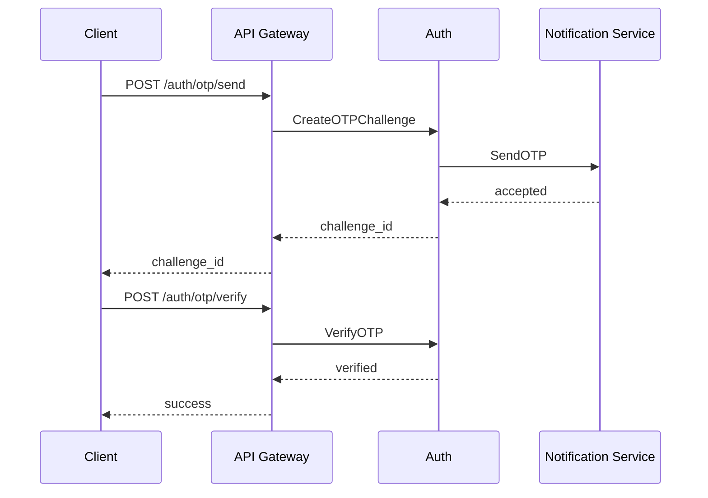

# Step 7 - Auth and Security

## Security Goals

Platform me security ko feature nahi, foundation treat karna hai. Auth, payments, sessions, seller tools, and superadmin actions high-risk areas hain.

## JWT Authentication

### Token Types

| Token | TTL | Stored? | Purpose |
|---|---:|---|---|
| Access token | 15 minutes | No | API access. |
| Refresh token | 7 to 30 days | Hash in MySQL | Access token renew. |
| OTP token/challenge | 5 minutes | Hash in MySQL/Redis | Email/phone verification. |

### JWT Claims

```json
{
  "sub": "user_123",
  "sid": "sess_123",
  "roles": ["buyer"],
  "seller_id": "seller_456",
  "token_type": "access",
  "iat": 1760000000,
  "exp": 1760000900,
  "iss": "ecommerce-auth",
  "aud": "ecommerce-api"
}
```

### Rules

- Access token short-lived hoga.
- Refresh token rotate hoga. Reuse detect hua to session revoke.
- JWT signing key external secret manager me store hoga.
- Key rotation support ke liye `kid` header use hoga.
- Gateway token validate karega, services bhi sensitive actions me auth context verify karenge.

## OTP Verification

Supported channels:

- Email OTP.
- Phone SMS OTP.

Rules:

- OTP plain text store nahi hoga, only hash.
- OTP length 6 digits minimum.
- Expiry 5 minutes.
- Max attempts 5.
- Resend cooldown 30 to 60 seconds.
- Per target daily limit.
- OTP verified event Auth Service publish karega.

Flow:



## Role-Based Access Control

Roles:

- `buyer`
- `seller`
- `seller_manager`
- `seller_catalog_editor`
- `seller_order_manager`
- `admin`
- `finance_admin`
- `catalog_admin`
- `operations_admin`
- `superadmin`

Permission examples:

| Permission | Buyer | Seller | Admin | Superadmin |
|---|---:|---:|---:|---:|
| `profile:read:self` | yes | yes | yes | yes |
| `cart:write:self` | yes | yes | no | no |
| `product:write:own_seller` | no | yes | no | yes |
| `order:read:self` | yes | yes | yes | yes |
| `payment:refund:review` | no | no | finance_admin | yes |
| `platform:settings:write` | no | no | no | yes |

RBAC enforcement:

- Gateway route-level authorization.
- Service-level domain authorization.
- Superadmin high-risk operations audit mandatory.

## Rate Limiting

Use Redis token bucket or sliding window.

| Route Group | Limit Example |
|---|---|
| Login | 5 attempts per IP per 10 min |
| OTP send | 3 per target per 15 min |
| Product search | 120 per IP per min |
| Cart mutations | 60 per user per min |
| Checkout | 10 per user per 10 min |
| Admin mutations | 30 per admin per min |

## Input Validation

Validation layers:

1. Frontend form validation for UX.
2. API Gateway request DTO validation.
3. Service usecase validation.
4. Database constraints.

Rules:

- All IDs validate format.
- Max body size enforce.
- File uploads limited by type and size.
- HTML inputs sanitized where rendered.
- Money values use integer minor units internally when possible.

## Secure Sessions

Session Management Service independent hoga, but Auth login/logout ke saath integrate karega.

Security fields:

- `session_id`
- `user_id`
- `anonymous_id`
- `device_fingerprint_hash`
- `ip_hash`
- `user_agent`
- `started_at`
- `last_seen_at`
- `revoked_at`

Controls:

- Logout revokes refresh token and marks session ended.
- Suspicious refresh token reuse revokes session family.
- PII minimize and hash sensitive identifiers.
- Admin session viewing masks PII by default.

## HTTPS and TLS

- TLS 1.2+ minimum, TLS 1.3 preferred.
- HSTS enabled.
- Secure cookies if cookies are used.
- Internal gRPC can use mTLS in production via service mesh.
- Webhooks must verify provider signature.

## Secrets

Never commit secrets.

Use:

- Kubernetes Secrets for basic setup.
- External Secrets Operator with AWS Secrets Manager/GCP Secret Manager/Azure Key Vault for production.
- Sealed Secrets for GitOps if needed.

Secret examples:

- JWT private key.
- DB passwords.
- Payment provider keys.
- SMS/email provider credentials.
- Typesense API key.

## Security Headers

Gateway should add:

- `Strict-Transport-Security`
- `X-Content-Type-Options: nosniff`
- `X-Frame-Options: DENY`
- `Referrer-Policy`
- `Content-Security-Policy`

## Audit Logging

Audit required for:

- Login failure spikes.
- Password reset.
- Role assignment.
- Seller approval/suspension.
- Refund review.
- Platform setting changes.
- Admin data export.

Audit fields:

- actor id
- actor role
- action
- resource type
- resource id
- request id
- IP hash
- before/after summary
- created at

## Compliance Readiness

- PII deletion support.
- Data retention policy.
- Payment card data should not touch platform servers if using Stripe/Razorpay-style hosted flows.
- Logs must not contain passwords, OTP, full tokens, card data, or raw secrets.

