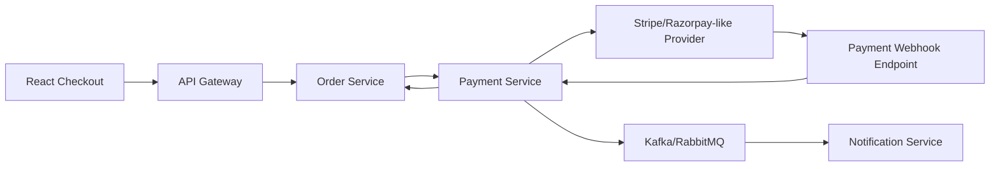
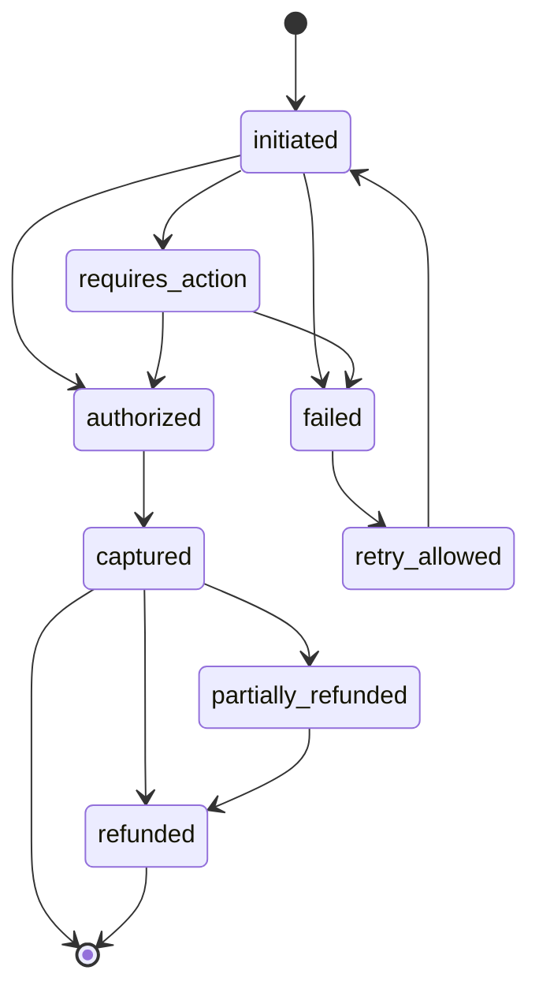

# Step 8 - Payment System

## Payment Architecture

Payment Service provider abstraction rakhega so Stripe/Razorpay-like gateways swap ho sakein.



## Payment State Machine



## Core Rules

- Payment intent creation idempotent hoga.
- Provider webhook signature verify mandatory.
- Payment final status provider webhook se decide hoga.
- Client success page sirf user feedback hai, accounting source nahi.
- Card data platform server par store nahi hoga.
- Refunds immutable records me track honge.

## Success Flow

1. User checkout start karta hai.
2. Order Service pending order create karta hai.
3. Product inventory reserve hoti hai.
4. Payment Service provider intent create karta hai.
5. Frontend provider UI complete karta hai.
6. Provider webhook sends success.
7. Payment Service webhook validate karke `captured` mark karta hai.
8. Order Service `paid` mark karta hai.
9. Product Service inventory commit karta hai.
10. Notification Service confirmation bhejta hai.

## Failure Flow

1. Payment provider failure webhook bhejta hai.
2. Payment status `failed`.
3. Order status `payment_failed`.
4. Inventory reservation release.
5. User ko retry option milta hai.

## Retry Flow

Rules:

- Same order ke liye new payment attempt create ho sakta hai.
- Idempotency key duplicate provider intent prevent karegi.
- Max retry count configurable.
- Failed attempts audit me rahenge.

## Refund Flow

Types:

- Full refund.
- Partial refund.
- Manual refund review for high-value orders.

Flow:

1. Refund request Order/Superadmin se aata hai.
2. Payment Service refund record `requested` state me create karta hai.
3. Provider refund API call hoti hai.
4. Provider response or webhook refund status update karta hai.
5. Order Service refund status receive karta hai.
6. Notification Service user ko update bhejta hai.

## Payment Provider Interface

```go
type Provider interface {
    CreateIntent(ctx context.Context, req CreateIntentRequest) (CreateIntentResponse, error)
    Capture(ctx context.Context, req CaptureRequest) (CaptureResponse, error)
    Refund(ctx context.Context, req RefundRequest) (RefundResponse, error)
    VerifyWebhook(ctx context.Context, headers map[string]string, body []byte) (WebhookEvent, error)
}
```

## Idempotency

Idempotency keys:

- `checkout:{user_id}:{client_key}`
- `payment_intent:{order_id}:{attempt_no}`
- `webhook:{provider}:{event_id}`
- `refund:{payment_id}:{refund_key}`

Store:

- MySQL unique indexes for payment and refund operations.
- Webhook provider event id unique.

## Reconciliation

Daily job:

1. Download provider settlement report.
2. Match provider payment id with local payment.
3. Compare amount, currency, status, fee, settlement id.
4. Mark matched or mismatch.
5. Alert finance admin for mismatch.

## Security

- Webhook signature verification.
- Provider API keys from secret manager.
- Amount computed server-side only.
- Currency whitelist.
- Refund permission restricted to finance admin/superadmin.
- Payment logs redact provider secrets and card details.

