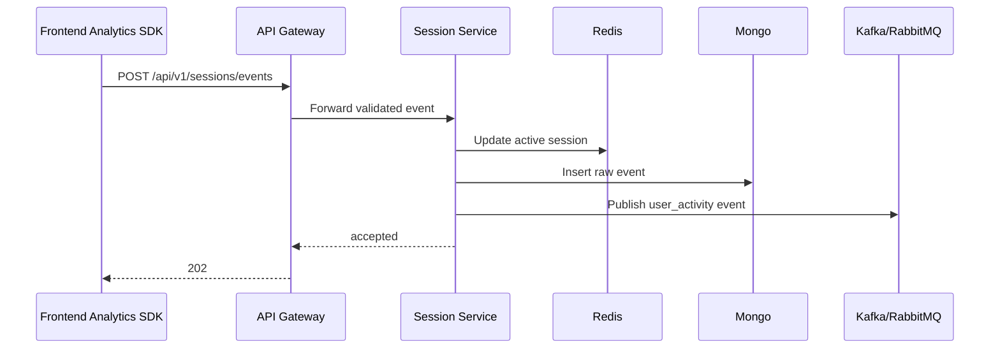

# Step 9 - Session Management System

## Purpose

Session Management Service ek independent project/service hoga. Iska kaam sirf login session nahi, balki user activity tracking, journey tracking, device/session tracking, analytics dashboard, and heatmap data handle karna hai.

## Core Concepts

| Concept | Detail |
|---|---|
| Anonymous ID | Browser/device pe generated id before login. |
| User ID | Login ke baad anonymous activity user profile se link hoti hai. |
| Session ID | One visit window. Usually 30 minutes inactivity ke baad new session. |
| Event | Page view, click, scroll, search, product view, add to cart, checkout step. |
| Journey | Session ke events ka ordered timeline. |
| Heatmap | Click/scroll coordinate aggregation for page UX insights. |

## Event Types

| Event | Example Payload |
|---|---|
| `page_view` | path, title, referrer, utm |
| `product_view` | product_id, category_id, seller_id |
| `search` | query, filters, result_count |
| `click` | path, element_id, x, y, viewport |
| `scroll` | path, depth_percent |
| `add_to_cart` | product_id, variant_id, quantity |
| `checkout_step` | step_name, order_id |
| `payment_result` | order_id, status |

## Ingestion Flow

## Tracking SDK Responsibilities

Frontend shared SDK:

- Generate and persist anonymous id.
- Generate session id.
- Batch events to reduce network calls.
- Retry failed sends with backoff.
- Respect consent and privacy settings.
- Mask sensitive fields.

## Journey Tracking

Journey summary document:

- `session_id`
- `user_id`
- `entry_page`
- `exit_page`
- `total_events`
- `products_viewed`
- `searches`
- `cart_actions`
- `checkout_started`
- `payment_completed`
- `duration_seconds`

Use:

- Analytics dashboard session replay-like timeline.
- Funnel debugging.
- Fraud/suspicious behavior detection.

## Device and Session Tracking

Captured fields:

- user agent
- browser
- operating system
- device type
- approximate country/city from IP resolver
- screen size
- viewport size
- language
- referrer
- UTM parameters

Privacy:

- Store IP hash, not raw IP, unless legal/security requirement says otherwise.
- Mask user identifiers in analytics UI by default.
- Respect deletion requests.

## Analytics Dashboard

Main views:

- Live active users.
- Sessions table.
- Journey explorer.
- Funnel report.
- Heatmap page.
- Device/browser report.
- Source/UTM report.
- Retention/cohort report.

Metrics:

- active users now
- sessions today
- conversion rate
- product view to cart rate
- cart to checkout rate
- checkout to paid rate
- average session duration
- bounce rate

## Heatmaps - Conceptual Design

Click heatmap:

- Track click x/y as percentage of viewport or element.
- Aggregate by route, viewport bucket, device type.
- Dashboard renders points over page screenshot/template.

Scroll heatmap:

- Track max scroll depth.
- Aggregate percentage buckets: 25, 50, 75, 90, 100.

Important:

- Do not record keystrokes.
- Do not capture password, OTP, card data, or private text fields.

## Storage Strategy

- Raw events: MongoDB TTL, for example 30 to 90 days.
- Journey summaries: 180 to 365 days.
- Aggregates: long-term.
- Active sessions: Redis with expiry.

## APIs

Public ingestion:

- `POST /api/v1/sessions/events`

Dashboard:

- `GET /api/v1/analytics/live`
- `GET /api/v1/analytics/sessions`
- `GET /api/v1/analytics/sessions/{session_id}/journey`
- `GET /api/v1/analytics/funnels`
- `GET /api/v1/analytics/heatmaps`
- `GET /api/v1/analytics/devices`

## Scalability

- Event ingestion should accept 202 quickly.
- Batch insert Mongo events.
- Use Kafka/RabbitMQ for downstream processing.
- Pre-aggregate metrics with scheduled workers.
- Shard high-volume events by `session_id` or `created_at`.

