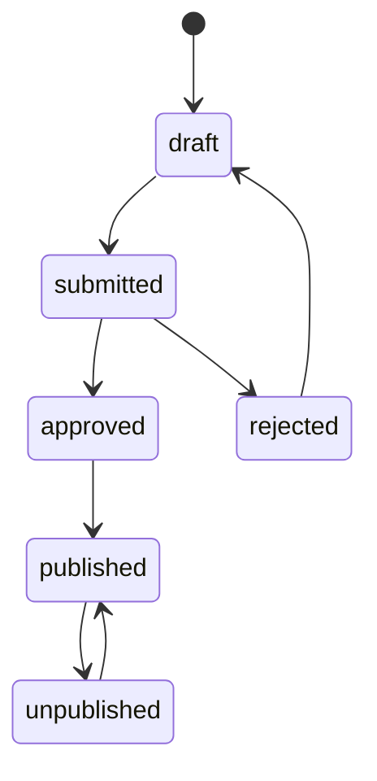

# Step 10 and Step 15 - CMS and Superadmin System

## CMS System - Seller Panel

CMS ka purpose seller ko apna mini control center dena hai: products manage karo, orders handle karo, offers/coupons banao, revenue analytics dekho.

### Seller CMS Modules

| Module | Features |
|---|---|
| Overview | GMV, orders, conversion, top products, low stock alerts. |
| Product Management | Create/edit products, variants, images, categories, draft/publish. |
| Inventory | Stock update, low stock alerts, reservation visibility. |
| Order Management | Seller orders, shipment updates, cancellations, returns view. |
| Offers and Coupons | Fixed/percentage coupons, campaign scheduling, usage limits. |
| Revenue Analytics | Revenue trend, product performance, refund rate. |
| Team Management | Seller staff roles and permissions. |
| Audit Activity | Product edits, coupon changes, order actions. |

### Product Management Flow



### Coupon Rules

Supported MVP rules:

- Fixed amount discount.
- Percentage discount.
- Minimum cart value.
- Max discount cap.
- Product/category/seller scope.
- New user only.
- Usage limit per user.
- Global usage limit.
- Start and end time.

Coupon validation output:

```json
{
  "valid": true,
  "discount_amount": 2500,
  "currency": "INR",
  "reason": null,
  "coupon_id": "coupon_123"
}
```

### Seller Analytics

Metrics:

- revenue
- orders
- average order value
- conversion rate
- refund rate
- top products
- low stock products
- coupon usage

Data source:

- Order events.
- Payment events.
- Product events.
- Session events.

## Superadmin System

Superadmin platform owner ka control plane hai. Ye normal seller dashboard se alag and stricter security wala app hoga.

### Superadmin Modules

| Module | Capabilities |
|---|---|
| Users | Search, view, block/unblock, session view. |
| Sellers | KYC review, approve, suspend, catalog moderation. |
| Orders | Cross-platform order search, dispute support. |
| Payments | Payment lookup, refunds, reconciliation mismatch. |
| Sessions | Live sessions, suspicious activity, user journey. |
| Search | Synonyms, reindex, zero-result queries. |
| Platform Settings | Commission, feature flags, maintenance mode. |
| Audit Logs | All admin actions, filters, export. |

### Superadmin Permission Model

| Role | Scope |
|---|---|
| `superadmin` | Full platform access. |
| `operations_admin` | Users, sellers, orders, support actions. |
| `finance_admin` | Payments, refunds, reconciliation. |
| `catalog_admin` | Product moderation, categories, search synonyms. |
| `readonly_admin` | Read-only operational view. |

### High-Risk Controls

- Refund approval may require maker-checker for high value.
- Seller suspension requires reason code.
- User block requires audit note.
- Platform setting changes require audit and optional approval.
- Admin session timeout shorter than buyer session.
- Admin MFA should be required.

### Admin Audit Log

Every mutation stores:

- actor admin id
- action
- resource type
- resource id
- request id
- IP hash
- before summary
- after summary
- reason
- created at

### Superadmin Workflows

Seller approval:

1. Seller submits KYC.
2. User Service stores seller profile and KYC metadata.
3. Superadmin Service creates review task.
4. Admin approves/rejects.
5. User Service seller status updates.
6. Notification Service informs seller.

Refund review:

1. Buyer/seller/support requests refund.
2. Payment Service creates refund request.
3. Superadmin finance queue receives task.
4. Finance admin approves/rejects.
5. Payment Service calls provider refund.
6. Order and Notification services receive events.

